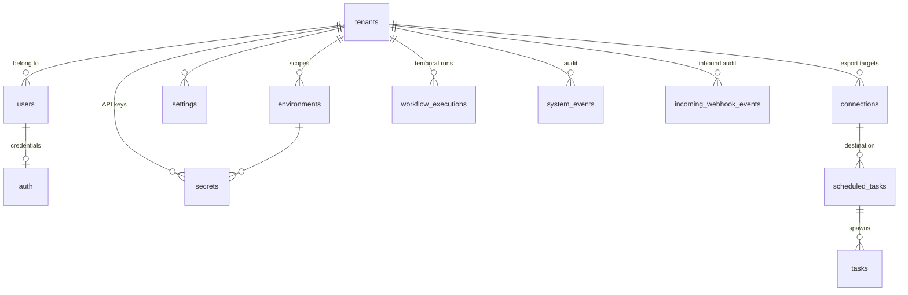
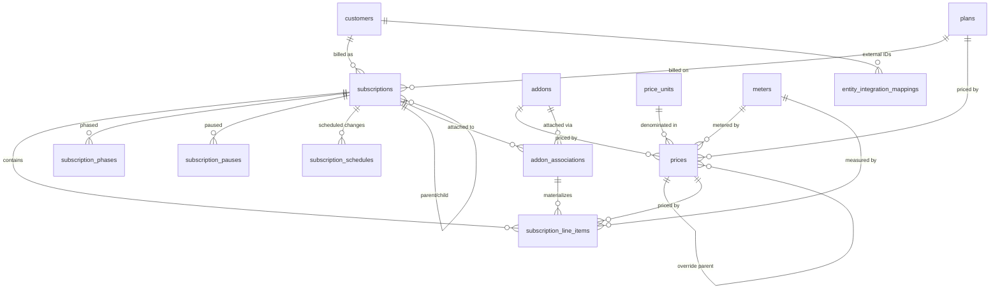
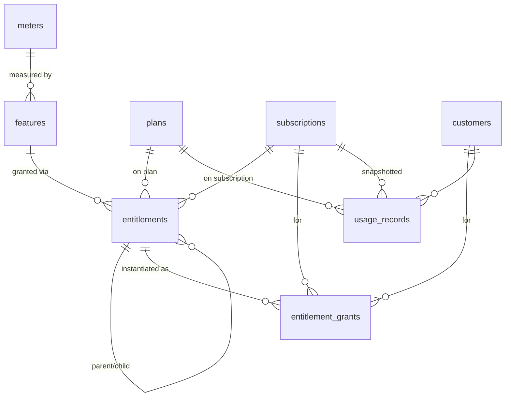
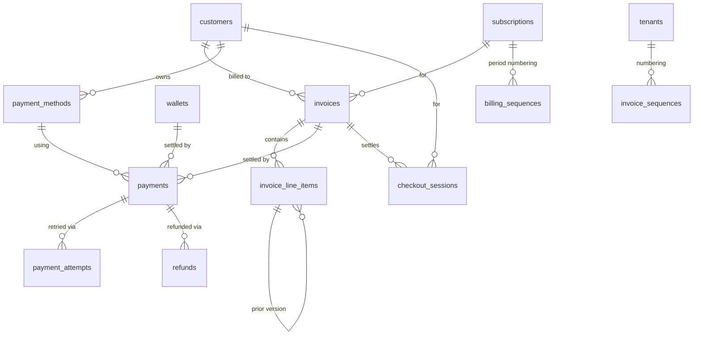
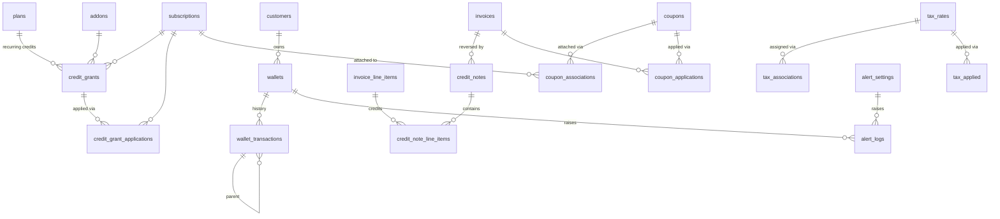

# Flexprice Database Schema Reference

Reference for self-hosting operators, analysts, and integrators who need to query the
Flexprice databases directly. Covers every PostgreSQL table plus the two ClickHouse
tables used for event ingestion and metering.

---

## 1. How to read this document

### Two databases
- **PostgreSQL** — transactional store. Every business entity (customers, subscriptions,
  invoices, payments, credits, etc.) lives here. Managed via [Ent](https://entgo.io/)
  schemas in `ent/schema/*.go`; migrations produced with `make generate-migration`.
- **ClickHouse** — analytics store for raw usage events and the per-meter aggregation
  cache. Only two tables (`flexprice.events`, `flexprice.meter_usage`) — documented
  in §7.

### Relationships are implicit
The Postgres schema deliberately avoids most foreign-key constraints — relationships
are enforced in the application layer, not by the database. Almost every "reference"
between two tables is a `varchar(50)` column named `<entity>_id` that contains the `id`
of a row in the referenced table. Treat them as logical foreign keys when writing
joins; there is no ON DELETE cascade.

### Multi-tenancy is a hard invariant
**Every** query you write against these tables must filter by `tenant_id` and
`environment_id`. Missing either filter is a data-leak bug in application code and
should be treated the same way in ad-hoc SQL: it will happily return rows from other
tenants/environments. All the composite indexes are laid out `(tenant_id,
environment_id, …)` for exactly this reason.

### Shared columns (mixins) — present on nearly every table
Rather than repeating these in every table description below, they are documented once
here.

| Column | Type | Source | Notes |
|---|---|---|---|
| `id` | `varchar(50)` | per-table | Application-generated (ULID-style prefix + suffix, e.g. `cust_01H...`). Primary key, immutable. |
| `tenant_id` | `varchar(50)` | `BaseMixin` | FK-by-convention → `tenants.id`. Immutable. |
| `status` | `varchar(20)` | `BaseMixin` | Soft-delete + lifecycle flag. Common values: `published`, `archived`, `deleted`. Most partial indexes filter on `status = 'published'`. |
| `created_at` | `timestamp` | `BaseMixin` | Set at insert, immutable. |
| `updated_at` | `timestamp` | `BaseMixin` | Auto-updated on every write. |
| `created_by` / `updated_by` | `varchar` | `BaseMixin` | User/service ID that performed the write (optional). |
| `environment_id` | `varchar(50)` | `EnvironmentMixin` | FK-by-convention → `environments.id`. Immutable. Present on nearly all tables (`tenants`, `environments`, `users`, `auth`, `invoice_sequences`, `billing_sequences` are the notable exceptions). |
| `metadata` | `jsonb` | `MetadataMixin` | Free-form user metadata. Where present, indexed with a GIN index for `@>` containment queries. |

Whenever a table description below says "Uses BaseMixin, EnvironmentMixin, MetadataMixin",
those columns are implicit — the per-table column list only shows the entity-specific
fields.

### About indexes
Only non-boilerplate indexes are called out per-table. Assume every table that
carries both columns also has:
- `(tenant_id, environment_id)` composite index — the exceptions are the tables
  without an `environment_id` (`tenants`, `environments`, `users`, `auth`,
  `invoice_sequences`, `billing_sequences`)
- GIN index on `metadata` (when the mixin is present)
- B-tree on `id` (primary key)

### Column type conventions
- `varchar(50)` — internal IDs (ULID-length safe).
- `varchar(255)` — external IDs, names, display fields.
- `numeric(20,8)` / `numeric(20,9)` / `numeric(25,15)` — money, credits, quantities.
  High precision to avoid float drift in billing math. Always render with the pinned
  scale.
- `jsonb` — used liberally for provider metadata, configuration blobs, and snapshots
  (frozen at write time so historical calculations remain reproducible).

---

## 2. High-level ER map

Grouped by domain. The arrows are directional (`A → B` means "row in A references a
row in B via a `*_id` column"); none of these are enforced FKs.

### 2.1 Tenancy backbone

### 2.2 Customers, subscriptions, plans, pricing

### 2.3 Metering, features, entitlements

### 2.4 Invoicing, payments, refunds

### 2.5 Credits, coupons, tax, alerts

---

## 3. Tenancy, Auth & System

### `tenants`
Root workspace/company. Everything else is scoped to a tenant via `tenant_id`.

**Columns:**
- `id` (varchar(50)) — unique, immutable
- `name` (varchar(100))
- `status` (varchar(20)) — `published` / etc.
- `internal_status` (varchar(20)) — defaults to `trialing`; used for billing lifecycle of the tenant itself
- `created_at` / `updated_at` (timestamp)
- `billing_details` (jsonb, Optional) — nested email/phone/address for the tenant
- `metadata` (jsonb, Optional)

**Notable indexes:**
- `idx_tenant_created_at`

### `environments`
Isolation scope within a tenant (e.g., `production`, `staging`, `development`). All
business entities carry `environment_id` and must be filtered by it.

**Columns:**
- `name` (varchar(50))
- `type` (varchar(20)) — e.g., `production`, `development`

**Relations:**
- `tenant_id` → `tenants.id`

**Notable indexes:**
- `idx_environment_tenant_id_type`, `idx_environment_tenant_status`

### `users`
Human users. Console/SSO login identities. Distinct from `secrets` (API keys) and from
`customers` (the parties being billed).

**Columns:**
- `email` (varchar(255), Optional)
- `name` (varchar(255), Optional)
- `type` (varchar(20)) — default `user`
- `roles` (text[]) — RBAC role names

**Relations:**
- `tenant_id` → `tenants.id`

**Notable indexes:**
- `idx_user_email_unique` — unique partial index on email where `status = 'published'`

### `auth`
Provider credentials for a user (OAuth tokens, etc.). One live row per user.

**Columns:**
- `user_id` (varchar(50), immutable)
- `provider` (varchar(20)) — `oauth`, `saml`, etc.
- `token` (text)

**Relations:**
- `user_id` → `users.id`

**Notable indexes:**
- `idx_auth_user_id_unique` — unique partial index where `status = 'published'`

### `secrets`
API keys and third-party integration credentials, scoped to tenant + environment.
Snapshots the creating user's roles at issue time.

**Columns:**
- `name` (varchar(255))
- `type` (varchar(20)) — `private_key`, `publishable_key`, `integration`
- `provider` (varchar(50)) — `flexprice`, `stripe`, etc.
- `value` (text, Optional) — hashed key (empty for integration credentials)
- `display_id` (varchar(50), Optional) — first 8 chars for UI display
- `expires_at` (timestamp, Optional/Nullable)
- `last_used_at` (timestamp, Optional/Nullable)
- `provider_data` (jsonb, Optional) — encrypted provider payload
- `roles` (text[], Optional)
- `user_type` (varchar(20), Optional)
- `user_id` (varchar(50), Optional)

**Relations:**
- `tenant_id` → `tenants.id`
- `environment_id` → `environments.id`
- `user_id` → `users.id` (when the key belongs to a real user)

### `settings`
Generic key/JSON settings per tenant + environment.

**Columns:**
- `key` (varchar(255))
- `value` (jsonb, Optional)

**Relations:**
- `tenant_id` → `tenants.id`
- `environment_id` → `environments.id`

**Notable indexes:**
- Unique partial on `(tenant_id, environment_id, key)` where `status = 'published'`

### `connections`
Outbound integration destinations (e.g., S3 bucket, data warehouse) used by scheduled
exports.

**Columns:**
- `name` (varchar(255))
- `provider_type` (varchar(50)) — `s3`, `warehouse`, …
- `encrypted_secret_data` (jsonb, Optional)
- `metadata` (jsonb, Optional)
- `sync_config` (jsonb, Optional)

**Relations:**
- `tenant_id` → `tenants.id`
- `environment_id` → `environments.id`

### `groups`
Named collection of entities. Currently used for grouping prices (`entity_type = 'price'`),
extensible to other entity types.

**Columns:**
- `name` (varchar(255))
- `entity_type` (varchar(50), immutable) — default `price`
- `lookup_key` (varchar(255), Optional)

**Relations:**
- `tenant_id` → `tenants.id`
- `environment_id` → `environments.id`

**Notable indexes:**
- Unique partial on `(tenant_id, environment_id, lookup_key)` where `status = 'published'` and `lookup_key IS NOT NULL`

### `tasks`
Long-running async work units (imports, exports). Each row tracks progress counters
and file location. Usually driven by a Temporal workflow whose ID is stored in
`workflow_id`.

**Columns:**
- `id` (varchar(100))
- `task_type` (varchar(50)) — `import`, `export`
- `entity_type` (varchar(50)) — `feature_usage`, `customer`, …
- `scheduled_task_id` (varchar(50), Optional)
- `workflow_id` (varchar(255), Optional/Nullable)
- `file_url` (varchar(255))
- `file_name` (varchar(255), Optional/Nullable)
- `file_type` (varchar(10)) — `csv`, `json`
- `task_status` (varchar(50)) — `PENDING`, `RUNNING`, `COMPLETED`, `FAILED`
- `total_records` / `processed_records` / `successful_records` / `failed_records` (int)
- `error_summary` (text, Optional/Nullable)
- `metadata` (jsonb, Optional)
- `started_at` / `completed_at` / `failed_at` (timestamp, Optional/Nullable)

**Relations:**
- `tenant_id` → `tenants.id`
- `environment_id` → `environments.id`
- `scheduled_task_id` → `scheduled_tasks.id`

### `scheduled_tasks`
Recurring export jobs (backed by Temporal schedules) that spawn `tasks` rows.

**Columns:**
- `connection_id` (varchar(50))
- `entity_type` (varchar(50))
- `interval` (varchar(20)) — `hourly`, `daily`, `weekly`, `monthly`
- `enabled` (bool) — default `true`
- `job_config` (jsonb, Optional) — S3 config (bucket, region, prefix, compression, encryption)
- `temporal_schedule_id` (varchar(100), Optional)

**Relations:**
- `tenant_id` → `tenants.id`
- `environment_id` → `environments.id`
- `connection_id` → `connections.id`

### `workflow_executions`
Historical record of Temporal workflow runs. Populated by observability side-effects,
not required for correctness of billing itself.

**Columns:**
- `id` (varchar(26)) — ULID
- `workflow_id` (varchar(255))
- `run_id` (varchar(255))
- `workflow_type` (varchar(100)) — `BillingWorkflow`, `PriceSyncWorkflow`, …
- `task_queue` (varchar(100))
- `start_time` (timestamp)
- `end_time` (timestamp, Optional/Nullable)
- `duration_ms` (int64, Optional/Nullable)
- `workflow_status` (varchar(50)) — `Running`, `Completed`, `Failed`, …
- `entity` (varchar(100), Optional/Nullable) — `plan`, `invoice`, `subscription`
- `entity_id` (varchar(255), Optional/Nullable)
- `metadata` (jsonb, Optional)

**Relations:**
- `tenant_id` → `tenants.id`
- `environment_id` → `environments.id`

**Notable indexes:**
- Unique `(workflow_id, run_id)`
- Filter indexes on `workflow_type`, `task_queue`, `workflow_status`, `(entity, entity_id)`, `start_time`

### `system_events`
Internal audit trail — one row per emitted webhook event. Records what was published,
when, and whether it succeeded.

**Columns:**
- `event_name` (varchar(128), Optional)
- `entity_type` (varchar(64), Optional)
- `entity_id` (varchar(50), Optional)
- `webhook_message_id` (varchar(128), Optional/Nullable)
- `published_at` (timestamp, Optional/Nullable)
- `payload` (jsonb, Optional)
- `failure_count` (int) — default `0`
- `failure_reason` (text, Optional/Nullable)

**Relations:**
- `tenant_id` → `tenants.id`
- `environment_id` → `environments.id`

### `incoming_webhook_events`
Audit log of inbound webhook calls from third parties (Stripe, etc.). All fields are
immutable.

**Columns:**
- `provider` (varchar(50), immutable)
- `method` (varchar(10), immutable)
- `path` (text, immutable)
- `request_id` (varchar(100), Optional, immutable)
- `headers` (jsonb, Optional, immutable)
- `body` (text, Optional, immutable)

**Relations:**
- `tenant_id` → `tenants.id`
- `environment_id` → `environments.id`

**Notable indexes:**
- `(tenant_id, environment_id, provider, created_at)`, `(tenant_id, environment_id, created_at)`, `request_id`

---

## 4. Customers, Plans, Subscriptions & Pricing

### `customers`
End-parties being billed. `external_id` is the caller's own ID for the customer (SSOT
in their CRM) and is what `POST /events` looks up.

**Columns:**
- `external_id` (varchar(255)) — unique per tenant+environment for published rows
- `name` (varchar(255))
- `email` (varchar(255), Optional)
- `contact` (varchar(20), Optional/Nullable)
- `address_line1`, `address_line2` (varchar(255), Optional)
- `address_city`, `address_state` (varchar(100), Optional)
- `address_postal_code` (varchar(20), Optional)
- `address_country` (varchar(2), Optional) — ISO code
- `timezone` (varchar(50)) — default `UTC`

**Relations:**
- `tenant_id` → `tenants.id`
- `environment_id` → `environments.id`

**Notable indexes:**
- Unique partial on `(tenant_id, environment_id, external_id)` where published and non-empty
- Partial on `(tenant_id, environment_id, email)` where published and email present

### `subscriptions`
An active plan assignment to a customer. Drives invoicing.

**Columns:**
- `lookup_key` (varchar, Optional)
- `customer_id` (varchar(50), immutable)
- `plan_id` (varchar(50))
- `subscription_status` (varchar(50)) — `active`, `paused`, `cancelled`, …
- `currency` (varchar(10), immutable)
- `billing_anchor`, `start_date`, `end_date` (timestamp)
- `current_period_start`, `current_period_end` (timestamp)
- `cancelled_at`, `cancel_at` (timestamp, Optional/Nullable)
- `cancel_at_period_end` (bool)
- `trial_start`, `trial_end` (timestamp, Optional/Nullable)
- `billing_cadence`, `billing_period`, `billing_period_count` (varchar, int, immutable)
- `billing_cycle` (varchar) — `anniversary` or fixed date
- `version` (int) — optimistic concurrency
- `metadata` (jsonb, Optional)
- `pause_status`, `active_pause_id` (varchar, Optional/Nullable)
- `commitment_amount` (numeric(20,6), Optional/Nullable)
- `commitment_duration` (varchar(50), Optional/Nullable)
- `overage_factor` (numeric(10,6), Optional/Nullable)
- `payment_behavior`, `collection_method` (varchar(50))
- `gateway_payment_method_id` (varchar(255), Optional)
- `timezone` (varchar) — default `UTC`
- `proration_behavior` (varchar(50), immutable)
- `enable_true_up` (bool)
- `invoicing_customer_id` (varchar(50), Optional/Nullable) — alternate bill-to
- `parent_subscription_id` (varchar(50), Optional/Nullable) — hierarchy
- `payment_terms` (varchar(20), Optional/Nullable) — `NET_15` … `NET_90`
- `subscription_type` (varchar(20)) — `standalone`, `parent`, `inherited`, `delegated_invoicing`, `grouped_invoicing`
- `auto_invoice_threshold` (numeric(20,6), Optional/Nullable) — intermediate-invoice trigger
- `synced_price_sequence` (bigint) — high-water mark for plan-price reconciliation

**Relations:**
- `tenant_id` → `tenants.id`
- `environment_id` → `environments.id`
- `customer_id` → `customers.id`
- `plan_id` → `plans.id`
- `invoicing_customer_id` → `customers.id`
- `parent_subscription_id` → `subscriptions.id`
- `active_pause_id` → `subscription_pauses.id`

**Notable indexes:**
- Partial on `(tenant_id, environment_id, plan_id, synced_price_sequence, id)` where published — covers plan-price sync scans
- Partial on `(tenant_id, environment_id, current_period_end, subscription_status)` for billing-cycle worker

### `subscription_line_items`
Materialised charges on a subscription. One row per (plan or addon) × price. Recreated
during plan-price sync as prices change.

**Columns:**
- `subscription_id`, `customer_id` (varchar(50), immutable)
- `entity_id` (varchar(50), Optional/Nullable) — plan or addon
- `entity_type` (varchar(50), immutable) — `plan`, `addon`, `subscription`
- `plan_display_name` (varchar, Optional/Nullable)
- `price_id` (varchar(50))
- `price_type` (varchar(50), Optional/Nullable)
- `meter_id` (varchar(50), Optional/Nullable)
- `meter_display_name`, `display_name` (varchar, Optional/Nullable)
- `price_unit_id` (varchar(50), Optional/Nullable)
- `price_unit` (varchar(3), Optional/Nullable)
- `quantity` (numeric(20,8))
- `currency` (varchar(10))
- `billing_period`, `billing_period_count` (varchar, int)
- `invoice_cadence` (varchar(20), Optional, immutable) — deprecated
- `start_date`, `end_date` (timestamp, Optional/Nullable)
- `subscription_phase_id` (varchar(50), Optional/Nullable, immutable)
- `addon_association_id` (varchar(50), Optional/Nullable, immutable)
- `metadata` (jsonb, Optional)
- `commitment_amount`, `commitment_quantity` (numeric(20,8), Optional/Nullable)
- `commitment_type`, `commitment_duration` (varchar, Optional/Nullable)
- `commitment_overage_factor` (numeric(10,4), Optional/Nullable)
- `commitment_true_up_enabled`, `commitment_windowed` (bool)
- `commitment_time_buckets` (jsonb, Optional)

**Relations:**
- `tenant_id` → `tenants.id`
- `environment_id` → `environments.id`
- `subscription_id` → `subscriptions.id`
- `customer_id` → `customers.id`
- `price_id` → `prices.id`
- `meter_id` → `meters.id`
- `price_unit_id` → `price_units.id`
- `subscription_phase_id` → `subscription_phases.id`
- `addon_association_id` → `addon_associations.id`

**Notable indexes:**
- Partial on `(tenant_id, environment_id, subscription_id, price_id, entity_type)` where published — guards plan-price sync

### `subscription_pauses`
Recorded pause windows on a subscription.

**Columns:**
- `subscription_id` (varchar(50), immutable)
- `pause_status`, `pause_mode` (varchar(50))
- `resume_mode` (varchar(50), Optional)
- `pause_start`, `pause_end` (timestamp)
- `resumed_at` (timestamp, Optional/Nullable)
- `original_period_start`, `original_period_end` (timestamp)
- `reason` (text, Optional)
- `metadata` (jsonb, Optional)

**Relations:**
- `subscription_id` → `subscriptions.id`

**Notable indexes:**
- `(tenant_id, environment_id, pause_start, status)`, `(tenant_id, environment_id, pause_end, status)`

### `subscription_phases`
Time-boxed configurations within a subscription (phased pricing, tiered trials).

**Columns:**
- `subscription_id` (varchar(50), immutable)
- `start_date` (timestamp, immutable)
- `end_date` (timestamp, Optional/Nullable)

**Relations:**
- `subscription_id` → `subscriptions.id`

### `subscription_schedules`
Queued future modifications (plan changes, addon add/remove) with execution result.

**Columns:**
- `subscription_id` (varchar(50), immutable)
- `schedule_type` (varchar(50)) — `plan_change`, `addon_change`, …
- `scheduled_at` (timestamp)
- `configuration` (jsonb) — type-specific config
- `executed_at`, `cancelled_at` (timestamp, Optional/Nullable)
- `execution_result` (jsonb, Optional)
- `error_message` (text, Optional/Nullable)

**Relations:**
- `subscription_id` → `subscriptions.id`

**Notable indexes:**
- Unique partial on `(subscription_id, schedule_type)` where `status = 'pending'`
- Partial on `(scheduled_at, status)` where `status = 'pending'`

### `plans`
Pricing plans offered to customers.

**Columns:**
- `lookup_key` (varchar(255), Optional)
- `name` (varchar(255))
- `description` (text, Optional)
- `display_order` (int) — default 0

**Notable indexes:**
- Unique partial on `(tenant_id, environment_id, lookup_key)` where published and non-null

### `prices`
Atomic price definition. Bound to a plan, addon, or a specific subscription (as
override). Contains all pricing math: flat fees, tiers, transforms, currency-unit
conversions.

**Columns:**
- `display_name` (varchar(255), Optional)
- `amount` (numeric(25,15), immutable)
- `currency` (varchar(3), immutable)
- `display_amount` (varchar(255), Optional, immutable)
- `price_unit_type` (varchar(20), immutable) — `FIAT` or `Custom`
- `price_unit_id` (varchar(50), Optional/Nullable, immutable)
- `price_unit` (varchar(3), Optional/Nullable, immutable)
- `price_unit_amount` (numeric(25,15), Optional/Nullable, immutable)
- `display_price_unit_amount` (varchar(255), Optional, immutable)
- `conversion_rate` (numeric(25,15), Optional/Nullable, immutable)
- `min_quantity` (numeric(20,8), Optional/Nullable, immutable)
- `type` (varchar(20), immutable) — `RECURRING`, `ONE_TIME`, …
- `billing_period`, `billing_period_count` (varchar, int, immutable)
- `billing_model` (varchar(20), immutable) — `FLAT_FEE`, `TIERED`, `PACKAGE`, …
- `billing_cadence` (varchar(20), immutable) — `RECURRING` or `ONE_TIME`
- `invoice_cadence` (varchar(20), Optional, immutable)
- `trial_period_days` (int, immutable)
- `meter_id` (varchar(50), Optional/Nullable, immutable)
- `filter_values` (jsonb, Optional) — meter-filter matches
- `tier_mode` (varchar(20), Optional/Nullable, immutable) — `VOLUME`, `SLAB`
- `tiers` (jsonb, Optional, immutable)
- `price_unit_tiers` (jsonb, Optional, immutable)
- `transform_quantity` (jsonb, Optional, immutable)
- `lookup_key` (varchar(255), Optional)
- `description` (text, Optional)
- `metadata` (jsonb, Optional)
- `entity_type` (varchar(20), immutable) — `PLAN`, `ADDON`, `SUBSCRIPTION`
- `entity_id` (varchar(50), immutable)
- `parent_price_id` (varchar(50), Optional/Nullable) — plan price this subscription price overrides
- `start_date` (timestamp, Optional/Nullable, immutable)
- `end_date` (timestamp, Optional/Nullable)
- `group_id` (varchar(50), Optional/Nullable)
- `sequence` (bigserial) — auto-incrementing change token

**Relations:**
- `meter_id` → `meters.id`
- `price_unit_id` → `price_units.id`
- `parent_price_id` → `prices.id`
- `entity_id` → `plans.id` / `addons.id` / `subscriptions.id` depending on `entity_type`
- `group_id` → `groups.id`

**Notable indexes:**
- Unique partial on `(tenant_id, environment_id, lookup_key)` where published, non-null, and `end_date IS NULL`
- Partial on `(tenant_id, environment_id, entity_id, entity_type, sequence)` where published — used by plan-price sync
- Partial on `(tenant_id, environment_id, entity_id, parent_price_id)` where published and `entity_type = 'SUBSCRIPTION'` — subscription-scoped override lookup

### `price_units`
Reference custom pricing units (tokens, crypto denominations, etc.) with conversion
to a fiat base currency.

**Columns:**
- `name` (varchar(255))
- `code` (varchar(3), immutable)
- `symbol` (varchar(10))
- `base_currency` (varchar(3), immutable)
- `conversion_rate` (numeric(10,5), immutable)

**Notable indexes:**
- Unique partial on `(tenant_id, environment_id, code)` where published

### `addons`
Optional supplementary charges attachable to a subscription.

**Columns:**
- `lookup_key` (varchar(255), immutable)
- `name` (varchar(255))
- `description` (text, Optional)
- `metadata` (jsonb, Optional)

**Notable indexes:**
- Unique partial on `(tenant_id, environment_id, lookup_key)` where published and non-null

### `addon_associations`
Attaches an addon to a subscription (or other entity type) with lifecycle state.

**Columns:**
- `entity_id` (varchar(50), immutable) — subscription id in practice
- `entity_type` (varchar(50), immutable)
- `addon_id` (varchar(50), immutable)
- `start_date`, `end_date` (timestamp, Optional/Nullable)
- `addon_status` (varchar(20)) — `active`, `cancelled`, …
- `cancellation_reason` (varchar(255), Optional)
- `cancelled_at` (timestamp, Optional/Nullable)
- `metadata` (jsonb, Optional)

**Relations:**
- `addon_id` → `addons.id`
- `entity_id` → depends on `entity_type` (typically `subscriptions.id`)

### `costsheets`
Cost-of-goods definitions used by margin / cost-vs-revenue analytics.

**Columns:**
- `name` (varchar(255))
- `lookup_key` (varchar(255), Optional)
- `description` (text, Optional)

**Notable indexes:**
- Unique partial on `(tenant_id, environment_id, lookup_key)` where published and non-null

### `meters`
Defines *what* to measure and *how* to aggregate. `event_name` binds to raw events in
ClickHouse; `aggregation` describes the reduction (sum, count, count_unique, max, …);
`filters` restrict which event properties qualify.

**Columns:**
- `event_name` (varchar(255))
- `name` (varchar(255))
- `aggregation` (jsonb) — `{type, field, expression, multiplier, bucket_size, group_by}`
- `filters` (jsonb) — `[{key, values}]`
- `reset_usage` (varchar(20)) — `BILLING_PERIOD` or `CUSTOM`

**Notable indexes:**
- Partial on `(tenant_id, environment_id, status)` where `status IN ('published', 'archived')`

### `entity_integration_mappings`
Bi-directional lookup between an internal entity (customer, plan, subscription, …)
and its external provider counterpart (e.g. `cus_xxx` in Stripe).

**Columns:**
- `entity_id` (varchar(255))
- `entity_type` (varchar(50)) — `customer`, `plan`, `subscription`, …
- `provider_type` (varchar(50)) — `stripe`, `salesforce`, …
- `provider_entity_id` (varchar(255))
- `metadata` (jsonb, Optional)

**Notable indexes:**
- Unique partial on `(tenant_id, environment_id, entity_type, entity_id, provider_type)` where published
- `(provider_type, provider_entity_id)` for reverse lookup

---

## 5. Features, Entitlements, Invoicing & Payments

### `features`
Named capability the customer consumes. May be metered (bound to a `meter`) or a
static toggle.

**Columns:**
- `lookup_key` (varchar(255), immutable, Nullable)
- `name` (varchar(255))
- `description` (text, Optional)
- `type` (varchar(50), immutable) — metered / static / etc.
- `meter_id` (varchar(50), Optional)
- `metadata` (jsonb, Optional)
- `unit_singular`, `unit_plural` (varchar(50), Optional)
- `reporting_unit_singular`, `reporting_unit_plural` (varchar(255), Optional)
- `reporting_unit_conversion_rate` (numeric(20,10), Optional)
- `alert_settings` (jsonb, Optional)
- `group_id` (varchar(50), Optional)

**Relations:**
- `meter_id` → `meters.id`
- `group_id` → `groups.id`

**Notable indexes:**
- Unique partial on `(tenant_id, environment_id, lookup_key)` where published
- `(tenant_id, environment_id, meter_id)`, and filter indexes on `type`, `status`, `created_at`, `group_id`

### `entitlements`
Customer-facing access rule for a feature, at plan or subscription scope. Also
carries recurring-grant configuration (quota, duration, allocation behavior).

**Columns:**
- `entity_type` (varchar(50)) — default `PLAN`; also `SUBSCRIPTION`
- `entity_id` (varchar(50), Optional)
- `feature_id` (varchar(50))
- `feature_type` (varchar(50)) — denormalised
- `is_enabled` (bool) — default `false`
- `usage_limit` (int64, Optional)
- `usage_reset_period` (varchar(20), Optional)
- `is_soft_limit` (bool) — default `false`
- `static_value` (varchar, Optional) — for non-metered features
- `display_order` (int) — default 0
- `parent_entitlement_id` (varchar(50), Optional) — subscription-scoped child of a plan entitlement
- `start_date`, `end_date` (timestamp, Optional) — subscription-scoped time-boxing
- `config_value` (jsonb, Optional)
- `grant_measure` (varchar(20), Optional) — e.g. `credits`
- `grant_duration_value` (int, Optional)
- `grant_duration_unit` (varchar(20), Optional) — `hour`/`day`/`week`/`month`
- `grant_allocation_behavior` (varchar(20)) — default `FirstUsage`
- `grant_quota` (numeric(25,15), Optional)
- `aggregation_mode` (varchar(20)) — default `Additive`

**Relations:**
- `feature_id` → `features.id`
- `entity_id` → `plans.id` or `subscriptions.id` depending on `entity_type`
- `parent_entitlement_id` → `entitlements.id`

**Notable indexes:**
- Unique partial on `(tenant_id, environment_id, entity_type, entity_id, feature_id)` where published
- `(entity_id, entity_type, feature_id, start_date, end_date)` for time-window scans

### `entitlement_grants`
Instantiation of a recurring entitlement quota for a specific subscription window.
The unit of consumption tracking; contains `quota`, `usage`, and `valid_from` /
`valid_to`.

**Columns:**
- `entitlement_config_id` (varchar(50), immutable)
- `customer_id` (varchar(50), immutable)
- `subscription_id` (varchar(50), immutable)
- `scope_entity_type` (varchar(20)) — default `feature`
- `scope_entity_id` (varchar(50), immutable)
- `measure` (varchar(20), immutable) — e.g. `credits`
- `quota` (numeric(25,15), immutable)
- `usage` (numeric(25,15)) — default 0
- `valid_from`, `valid_to` (timestamp)
- `grant_status` (varchar(20)) — default `active` (`active`/`exhausted`/`expired`)
- `last_computed_at` (timestamp, Optional)
- `quota_crossed_at` (timestamp, Optional) — set when `usage >= quota`

**Relations:**
- `entitlement_config_id` → `entitlements.id`
- `customer_id` → `customers.id`
- `subscription_id` → `subscriptions.id`
- `scope_entity_id` → `features.id` typically

**Notable indexes:**
- Unique on `(tenant_id, environment_id, entitlement_config_id, customer_id, subscription_id, valid_from)` — race-safety on grant open
- `(tenant_id, environment_id, customer_id, valid_to, entitlement_config_id, subscription_id)` — cycle-bounded range scans

### `usage_records`
Rolling per-window snapshots of subscription usage, written by the marketplace
snapshot cron. Provider-agnostic; the `syncs` JSON tracks per-connection publish
status.

**Columns:**
- `customer_id` (varchar(50))
- `customer_external_id` (varchar(255), Optional)
- `subscription_id`, `plan_id` (varchar(50))
- `quantity` (numeric(20,8)) — reserved (v1 unused)
- `amount` (numeric(20,8))
- `currency` (varchar(10))
- `period_start`, `period_end` (timestamp)
- `synced` (bool) — default `false`
- `syncs` (jsonb) — `{connection_id: {...}}`

**Relations:**
- `customer_id` → `customers.id`
- `subscription_id` → `subscriptions.id`
- `plan_id` → `plans.id`

**Notable indexes:**
- `(tenant_id, environment_id, synced)` — unsynced-row scan
- Unique partial on `(tenant_id, environment_id, subscription_id, period_start, period_end)` where published

### `invoices`
The billing document. Multiple types (subscription / one-off / credit-note-back).
Tracks lifecycle (`invoice_status`) and settlement (`payment_status`) independently.

**Columns:**
- `customer_id` (varchar(50), immutable)
- `subscription_id` (varchar(50), Optional/Nullable)
- `subscription_customer_id` (varchar(50), Optional, immutable)
- `invoice_type` (varchar(50), immutable) — `SUBSCRIPTION`, `ACCOUNT`, `CREDIT_NOTE`
- `invoice_status` (varchar(50)) — default `DRAFT` → `FINALIZED` / `VOIDED`
- `payment_status` (varchar(50)) — default `PENDING` → `PARTIAL` / `PAID` / `UNPAID` / `REFUNDED`
- `currency` (varchar(10), immutable)
- `amount_due`, `amount_paid`, `amount_remaining` (numeric(20,8))
- `subtotal`, `adjustment_amount`, `refunded_amount` (numeric(20,8))
- `total_tax`, `total_discount`, `total` (numeric(20,8), Optional/Nullable)
- `description` (text, Optional)
- `due_date`, `paid_at`, `voided_at`, `finalized_at`, `issue_date`, `last_computed_at` (timestamp, Optional/Nullable)
- `billing_period` (varchar, Optional, immutable)
- `period_start`, `period_end` (timestamp, Optional, immutable)
- `invoice_pdf_url` (varchar, Optional)
- `billing_reason` (varchar, Optional)
- `metadata` (jsonb, Optional)
- `version` (int) — default 1
- `invoice_number` (varchar(50), Optional) — generated
- `billing_sequence` (int, Optional/Nullable)
- `total_prepaid_credits_applied` (numeric(20,8), Optional/Nullable)
- `idempotency_key` (varchar(100), Optional/Nullable)
- `recalculated_invoice_id` (varchar(50), Optional/Nullable) — replacement invoice ID after void-and-recalc
- `is_manually_edited` (bool) — default `false`

**Relations:**
- `customer_id` → `customers.id`
- `subscription_id` → `subscriptions.id`
- `subscription_customer_id` → `customers.id`
- `recalculated_invoice_id` → `invoices.id`

**Notable indexes:**
- Filter indexes on `(customer_id, invoice_status, payment_status)`, `(subscription_id, invoice_status, payment_status)`, `(invoice_type, invoice_status, payment_status)`, `(due_date, invoice_status, payment_status)`
- Unique partial on `(tenant_id, environment_id, invoice_number)` where published and non-null
- Unique partial on `(tenant_id, environment_id, idempotency_key)` where published and non-voided
- Unique partial on `(subscription_id, period_start, period_end)` excluding voided

### `invoice_line_items`
Itemised charges within an invoice. Preserves the pricing dimensions (price, meter,
period) at the time of invoicing.

**Columns:**
- `invoice_id`, `customer_id` (varchar(50), immutable)
- `subscription_id` (varchar(50), Optional/Nullable, immutable)
- `entity_id`, `entity_type` (varchar(50), Optional/Nullable, immutable)
- `plan_display_name`, `meter_display_name`, `display_name` (varchar, Optional/Nullable, immutable)
- `price_id`, `price_type`, `meter_id`, `price_unit_id` (varchar(50), Optional/Nullable, immutable)
- `price_unit` (varchar(3), Optional/Nullable, immutable)
- `price_unit_amount` (numeric(20,8), Optional/Nullable, immutable)
- `amount`, `quantity` (numeric(20,8))
- `currency` (varchar(10), immutable)
- `period_start`, `period_end` (timestamp, Optional/Nullable)
- `metadata` (jsonb, Optional)
- `commitment_info` (jsonb, Optional)
- `prepaid_credits_applied` (numeric(20,8))
- `line_item_discount`, `invoice_level_discount` (numeric(20,8))
- `subscription_line_item_id` (varchar(50), Optional/Nullable, immutable)
- `adjusted_entitlement_quantity` (numeric(20,8), Optional/Nullable)
- `parent_line_item_id` (varchar(50), Optional/Nullable, immutable) — points to prior version on edit

**Relations:**
- `invoice_id` → `invoices.id`
- `customer_id` → `customers.id`
- `subscription_id` → `subscriptions.id`
- `price_id` → `prices.id`
- `meter_id` → `meters.id`
- `subscription_line_item_id` → `subscription_line_items.id`
- `parent_line_item_id` → `invoice_line_items.id`

**Notable indexes:**
- Standard filter indexes on `invoice_id`, `customer_id`, `subscription_id`, `price_id`, `meter_id`
- `(period_start, period_end)`, `(subscription_id, status)`

### `revenue_facts`
Derived, day-grain slice of a subscription line item's revenue, written by the
revenue rollup (a shadow re-run of the billing preview) — never by the invoicing
path. Rows are `PROVISIONAL` while the billing period is open (recomputed in
place, `version` bumps) and flip to `FINAL` when their invoice finalizes; a
voided invoice appends negated contra rows (`is_revert = true`) rather than
editing anything. Not part of billing correctness; populated only for tenants
opted in via the `revenue_analytics_config` setting.

**Columns:**
- `id` (text, PK)
- `tenant_id`, `environment_id` (text) — RLS scope on every query
- `customer_id`, `subscription_id` (text) — the LINE ITEM's subscription (child in grouped invoicing)
- `sub_line_item_id`, `price_id`, `meter_id` (text, nullable; non-null on provisional rows)
- `aggregation_type` (text, nullable), `revenue_source` (text: `usage` | `fixed` | `commitment_trueup` | `overage`)
- `period_start`, `period_end`, `day` (date) — `period_end` inclusive; `day` is the grain
- `service_start`, `service_end` (date, nullable), `recognition_method` (text, nullable) — reserved for recognition
- `usage_at_list_rate`, `tier_delta`, `entitlement_amount`, `line_discount`, `invoice_discount`, `net_amount`, `billable_qty`, `entitlement_qty` (numeric(38,9))
- `decomposition_mode` (text: `marginal` | `period_only`), `currency` (text)
- `status` (text: `PROVISIONAL` | `FINAL`), `is_revert` (bool)
- `invoice_id`, `invoice_line_item_id` (text, nullable) — stamped on the FINAL flip
- `lock_adjusted_day` (date, nullable) — reserved for accounting-period locks
- `computed_at` (timestamptz), `version` (bigint) — audit columns (no BaseMixin)

**Notable indexes:**
- Partial unique `(tenant_id, environment_id, subscription_id, price_id, sub_line_item_id, day, revenue_source) WHERE status = 'PROVISIONAL'` — one live provisional row per grain; drives the upsert
- `(tenant_id, environment_id, day, revenue_source)` — read path
- `(tenant_id, environment_id, invoice_id)` — invoice joins, drift sweep

### `invoice_sequences`
Per-`(tenant, environment, YYYYMM)` counter for generating human-readable invoice
numbers. Updated with optimistic locking.

**Columns:**
- `tenant_id`, `environment_id` (varchar(50))
- `year_month` (varchar(6)) — `YYYYMM`
- `last_value` (bigint) — next number to hand out
- `created_at`, `updated_at`

**Notable indexes:**
- Unique `(tenant_id, environment_id, year_month)`

### `billing_sequences`
Per-subscription counter for billing period sequence numbers.

**Columns:**
- `tenant_id`, `subscription_id` (varchar(50))
- `last_sequence` (int)
- `created_at`, `updated_at`

**Notable indexes:**
- Unique `(tenant_id, subscription_id)`

### `payments`
Attempt to settle a `destination_type` / `destination_id` pair (usually an invoice or
a wallet topup). One row per logical payment; retries go in `payment_attempts`.

**Columns:**
- `idempotency_key` (varchar(50), immutable)
- `destination_type`, `destination_id` (varchar(50))
- `payment_method_type` (varchar(50))
- `payment_method_id` (varchar(50), Optional)
- `payment_gateway` (varchar(50), Optional/Nullable)
- `gateway_payment_id`, `gateway_tracking_id` (varchar(255), Optional/Nullable)
- `gateway_metadata` (jsonb, Optional)
- `amount` (numeric(20,8))
- `currency` (varchar(10), immutable)
- `payment_status` (varchar(50)) — `PENDING`/`SUCCESS`/`FAILED`/`REFUNDED`/`VOIDED`
- `track_attempts` (bool) — default `false`
- `metadata` (jsonb, Optional)
- `succeeded_at`, `failed_at`, `refunded_at`, `voided_at`, `recorded_at` (timestamp, Optional/Nullable)
- `error_message` (text, Optional/Nullable)

**Relations:**
- `destination_id` → `invoices.id` / `wallets.id` depending on `destination_type`
- `payment_method_id` → `payment_methods.id`

**Notable indexes:**
- `(tenant_id, environment_id, destination_type, destination_id, payment_status, status)`
- `(payment_gateway, gateway_payment_id)` — provider dedupe
- Unique `(tenant_id, environment_id, idempotency_key)`

### `payment_attempts`
Individual gateway submission attempts under a `payment`. Retry history.

**Columns:**
- `payment_id` (varchar(50))
- `payment_status` (varchar(20))
- `attempt_number` (int) — default 1, monotonically increasing per payment
- `gateway_attempt_id` (varchar(255), Optional/Nullable)
- `error_message` (text, Optional/Nullable)
- `metadata` (jsonb, Optional)

**Relations:**
- `payment_id` → `payments.id`

**Notable indexes:**
- Unique `(payment_id, attempt_number)`
- Partial on `gateway_attempt_id` for non-null values

### `payment_methods`
Stored payment instrument (tokenised card, ACH mandate, etc.) for a customer.

**Columns:**
- `customer_id` (varchar(50), immutable)
- `type` (varchar(50)) — `CARD`, …
- `gateway` (varchar(50))
- `gateway_method_id` (varchar(255))
- `payment_method_status` (varchar(50)) — default `ACTIVE`
- `is_default` (bool) — default `false`
- `method_details` (jsonb, Optional) — `last4`, expiry, brand, …

**Relations:**
- `customer_id` → `customers.id`

### `refunds`
Provider-side refund attempt against a `payment`. Idempotent per gateway request.

**Columns:**
- `payment_id` (varchar(50), immutable)
- `payment_gateway` (varchar(50), immutable)
- `gateway_refund_id`, `gateway_tracking_id` (varchar(255), Optional/Nullable)
- `amount` (numeric(20,8))
- `currency` (varchar(10), immutable)
- `refund_status` (varchar(50)) — `PENDING`/`SUCCEEDED`/`FAILED`/`CANCELLED`
- `refund_reason` (varchar(50)) — `DUPLICATE`/`FRAUDULENT`/…
- `idempotency_key` (varchar(255), immutable)
- `gateway_idempotency_token` (varchar(255), immutable)
- `failure_reason` (text, Optional/Nullable)
- `metadata`, `gateway_metadata` (jsonb, Optional)
- `initiated_at`, `succeeded_at`, `failed_at`, `cancelled_at` (timestamp, Optional/Nullable)

**Relations:**
- `payment_id` → `payments.id`

**Notable indexes:**
- Unique `(tenant_id, environment_id, idempotency_key)`
- Filter indexes on `payment_id`, `refund_status`, `gateway_refund_id`

### `checkout_sessions`
Hosted-payment session (e.g., Stripe Checkout) associated with an invoice or ad-hoc
charge. Tracks the whole hosted flow lifecycle.

**Columns:**
- `customer_id` (varchar(50), immutable)
- `action` (varchar(30), immutable) — e.g. `pay_invoice`
- `checkout_status` (varchar(20)) — default `initiated`; `pending`/`completed`/`expired`/`cancelled`/`failed`
- `payment_provider` (varchar(20), immutable)
- `checkout_invoice_id`, `checkout_payment_id` (varchar(50), Optional/Nullable)
- `configuration`, `payment_provider_config`, `result`, `provider_result` (jsonb)
- `idempotency_key` (varchar(255), Optional/Nullable)
- `success_url`, `failure_url`, `cancel_url` (text, Optional/Nullable)
- `expires_at`, `completed_at`, `cancelled_at` (timestamp, Optional/Nullable)
- `failure_reason` (text, Optional/Nullable)
- `metadata` (jsonb, Optional)

**Relations:**
- `customer_id` → `customers.id`
- `checkout_invoice_id` → `invoices.id`
- `checkout_payment_id` → `payments.id`

**Notable indexes:**
- Unique partial on `(tenant_id, environment_id, idempotency_key)` on active sessions
- Partial on `expires_at` on active sessions

### `alert_logs`
Immutable point-in-time record of an alert firing on a monitored entity. Rows are
never updated; a new row is written every state transition.

**Columns:**
- `entity_type`, `entity_id` (varchar(50), immutable)
- `parent_entity_type`, `parent_entity_id` (varchar(50), Optional/Nullable, immutable)
- `customer_id` (varchar(50), Optional/Nullable, immutable)
- `alert_type` (varchar(50), immutable) — `credit_balance`, `ongoing_balance`, …
- `alert_status` (varchar(50), immutable) — `ok` / `in_alarm`
- `alert_info` (jsonb, immutable) — threshold, observed value, timestamp
- `alert_setting_id` (varchar(50), Optional/Nullable, immutable) — nil for wallet-level alerts

**Relations:**
- `entity_id` → varies (`wallets.id`, `entitlements.id`, `features.id`)
- `parent_entity_id` → varies (e.g. `wallets.id` for feature-wallet alerts)
- `customer_id` → `customers.id`
- `alert_setting_id` → `alert_settings.id`

**Notable indexes:**
- `(entity_type, entity_id, created_at)` — latest state lookup
- `(entity_type, entity_id, parent_entity_type, parent_entity_id, created_at)` — hierarchy lookup
- `(customer_id, alert_type, alert_status, created_at)` — customer dashboard
- `(alert_setting_id, created_at)` — settings-scoped history

---

## 6. Credits, Coupons, Tax & Alerts

### `wallets`
Prepaid credit balance for a customer, in a specific currency. Balance can auto-topup.

**Columns:**
- `name` (varchar(255), Optional)
- `customer_id` (varchar(50))
- `currency` (varchar(10))
- `description` (text, Optional)
- `metadata` (jsonb, Optional)
- `balance` (numeric(20,9)) — currency-denominated
- `credit_balance` (numeric(20,9)) — credit-denominated
- `wallet_status` (varchar(50)) — default `active`
- `auto_topup` (jsonb, Optional)
- `wallet_type` (varchar(50), immutable) — default `prepaid`
- `conversion_rate` (numeric(10,5), immutable) — credits→currency
- `topup_conversion_rate` (numeric(10,5), Optional, immutable)
- `config` (jsonb, Optional)
- `alert_settings` (jsonb, Optional)
- `alert_state` (varchar(50)) — default `ok`

**Relations:**
- `customer_id` → `customers.id`

### `wallet_transactions`
Append-only ledger of wallet activity: credits, debits, topups, consumption. Supports
FIFO/priority credit consumption via `credits_available` and `priority`.

**Columns:**
- `wallet_id` (varchar(50))
- `customer_id` (varchar(50), Optional)
- `type` (varchar(50)) — default `credit`; `credit`/`debit`
- `amount` (numeric(20,9))
- `credit_amount`, `credit_balance_before`, `credit_balance_after` (numeric(20,9))
- `reference_type`, `reference_id` (varchar(50), Optional) — e.g. `invoice`, `subscription`
- `description` (text, Optional)
- `metadata` (jsonb, Optional)
- `transaction_status` (varchar(50)) — default `pending`
- `expiry_date` (timestamp, Optional/Nullable, immutable)
- `credits_available` (numeric(20,9)) — remaining credit from this row (drops as consumed)
- `currency` (varchar(10))
- `conversion_rate`, `topup_conversion_rate` (numeric(10,5), Optional/Nullable, immutable)
- `idempotency_key` (varchar(100), Optional/Nullable, immutable)
- `transaction_reason` (varchar(50), immutable) — default `free_credit`
- `priority` (int, Optional) — lower = consumed first
- `parent_transaction_id` (varchar(50), Optional/Nullable, immutable)

**Relations:**
- `wallet_id` → `wallets.id`
- `customer_id` → `customers.id`
- `reference_id` → depends on `reference_type`
- `parent_transaction_id` → `wallet_transactions.id`

**Notable indexes:**
- `(tenant_id, environment_id, wallet_id, type, credits_available, expiry_date)` partial where `credits_available > 0 AND type = 'credit'` — active-credits scan
- Unique partial on `(tenant_id, environment_id, idempotency_key)` where set and published
- `(reference_type, reference_id, status)`, `(parent_transaction_id, transaction_status)`

### `credit_grants`
Template for a recurring credit allocation attached to a plan, subscription, or
addon (e.g. "500 credits per month for the life of the plan").

**Columns:**
- `name` (varchar(255))
- `scope` (varchar(50)) — `plan`/`subscription`/`addon`
- `plan_id`, `subscription_id`, `addon_id` (varchar(50), Optional/Nullable)
- `credits` (numeric(20,8), immutable)
- `conversion_rate`, `topup_conversion_rate` (numeric(10,5), Optional/Nullable, immutable)
- `cadence` (varchar(50), immutable) — `monthly`/`annual`/…
- `period` (varchar(50), Optional/Nullable, immutable)
- `period_count` (int, Optional/Nullable, immutable)
- `expiration_type` (varchar(50), immutable) — `rolling`/`absolute`/…
- `expiration_duration` (int, Optional/Nullable, immutable)
- `expiration_duration_unit` (varchar(50), Optional/Nullable, immutable) — `days`/`months`/…
- `priority` (int, Optional/Nullable, immutable)
- `metadata` (jsonb, Optional) — default `{}`
- `start_date`, `end_date` (timestamp, Optional/Nullable)
- `credit_grant_anchor` (timestamp, Optional/Nullable, immutable)

**Relations:**
- `plan_id` → `plans.id`
- `subscription_id` → `subscriptions.id`
- `addon_id` → `addons.id`

**Notable indexes:**
- Three partial indexes on `(tenant_id, environment_id, scope, <ref>_id)` scoped by which ID is set

### `credit_grant_applications`
Instance of a `credit_grant` applied for a specific subscription billing period.
Tracks scheduled vs applied timing, retries, and failures.

**Columns:**
- `credit_grant_id` (varchar(50))
- `subscription_id` (varchar(50))
- `scheduled_for` (timestamp)
- `applied_at` (timestamp, Optional/Nullable)
- `period_start` (timestamp, immutable)
- `period_end` (timestamp, Optional/Nullable, immutable)
- `application_status` (varchar(50)) — default `pending`
- `credits` (numeric(20,8))
- `application_reason` (text, immutable) — enum string
- `subscription_status_at_application` (varchar(50))
- `retry_count` (int)
- `failure_reason` (text, Optional/Nullable)
- `metadata` (jsonb, Optional)
- `idempotency_key` (varchar(100), immutable)

**Relations:**
- `credit_grant_id` → `credit_grants.id`
- `subscription_id` → `subscriptions.id`

**Notable indexes:**
- Unique on `idempotency_key`

### `credit_notes`
Credit memo against an invoice (refund / adjustment).

**Columns:**
- `invoice_id` (varchar(50))
- `customer_id` (varchar(50))
- `subscription_id` (varchar(50), Optional/Nullable)
- `credit_note_number` (varchar(50), immutable)
- `credit_note_status` (varchar(50)) — default `draft`; `finalized`/`voided`
- `credit_note_type` (varchar(50), immutable) — `refund`/`adjustment`
- `refund_status` (varchar(50), Optional/Nullable)
- `reason` (varchar(50), immutable)
- `memo` (text, Optional, immutable)
- `currency` (varchar(50), immutable)
- `idempotency_key` (varchar(100), Optional/Nullable, immutable)
- `voided_at`, `finalized_at` (timestamp, Optional/Nullable)
- `metadata` (jsonb, Optional)
- `total_amount` (numeric(20,8), immutable)

**Relations:**
- `invoice_id` → `invoices.id`
- `customer_id` → `customers.id`
- `subscription_id` → `subscriptions.id`

**Notable indexes:**
- Unique partial on `(tenant_id, environment_id, credit_note_number)` where published, non-empty
- Unique partial on `(tenant_id, environment_id, idempotency_key)` where non-empty
- Filter indexes on `invoice_id`, `credit_note_status`, `credit_note_type`, `customer_id`, `subscription_id`

### `credit_note_line_items`
Line-level breakdown of a credit note, mapping back to the source invoice line items.

**Columns:**
- `credit_note_id` (varchar(50), immutable)
- `invoice_line_item_id` (varchar(50))
- `display_name` (varchar(255))
- `amount` (numeric(20,8))
- `currency` (varchar(10))
- `metadata` (jsonb, Optional)

**Relations:**
- `credit_note_id` → `credit_notes.id`
- `invoice_line_item_id` → `invoice_line_items.id`

### `coupons`
Discount offer definition. Applied via `coupon_associations` (to subscriptions) or
directly recorded on invoices via `coupon_applications`.

**Columns:**
- `name` (varchar(255))
- `redeem_after`, `redeem_before` (timestamp, Optional/Nullable)
- `max_redemptions` (int, Optional/Nullable)
- `total_redemptions` (int) — counter, default 0
- `rules` (jsonb, Optional) — rule-engine configuration
- `amount_off` (numeric(20,8), Optional)
- `percentage_off` (numeric(7,4), Optional)
- `type` (varchar(20)) — default `fixed`; `fixed`/`percentage`
- `cadence` (varchar(20)) — default `once`; `once`/`repeated`/`forever`
- `duration_in_periods` (int, Optional/Nullable)
- `currency` (varchar(10), Optional/Nullable)
- `metadata` (jsonb, Optional)
- `coupon_code` (varchar(100), Optional/Nullable) — stored lowercase

**Notable indexes:**
- Unique partial on `(tenant_id, environment_id, coupon_code)` where published and non-empty

### `coupon_applications`
Record of a coupon actually applied to an invoice or invoice line item. Snapshots
the coupon at time of application (so historical invoice math is stable).

**Columns:**
- `coupon_id` (varchar(50), immutable)
- `coupon_association_id` (varchar(50), Optional/Nullable)
- `invoice_id` (varchar(50), immutable)
- `invoice_line_item_id` (varchar(50), Optional/Nullable)
- `applied_at` (timestamp, immutable)
- `original_price`, `final_price`, `discounted_amount` (numeric(20,8))
- `discount_type` (varchar(20)) — `fixed`/`percentage`
- `discount_percentage` (numeric(7,4), Optional/Nullable)
- `currency` (varchar(10), Optional/Nullable)
- `coupon_snapshot` (jsonb, Optional) — frozen coupon config
- `metadata` (jsonb, Optional)
- `subscription_id` (varchar(50), Optional/Nullable)

**Relations:**
- `coupon_id` → `coupons.id`
- `coupon_association_id` → `coupon_associations.id`
- `invoice_id` → `invoices.id`
- `invoice_line_item_id` → `invoice_line_items.id`
- `subscription_id` → `subscriptions.id`

### `coupon_associations`
Binding of a coupon to a subscription (optionally scoped to a specific line item or
phase) for a time window.

**Columns:**
- `coupon_id` (varchar(50), immutable)
- `subscription_id` (varchar(50), immutable)
- `subscription_line_item_id` (varchar(50), Optional/Nullable)
- `subscription_phase_id` (varchar(50), Optional/Nullable)
- `start_date` (timestamp, immutable)
- `end_date` (timestamp, Optional/Nullable)
- `metadata` (jsonb, Optional)

**Relations:**
- `coupon_id` → `coupons.id`
- `subscription_id` → `subscriptions.id`
- `subscription_line_item_id` → `subscription_line_items.id`
- `subscription_phase_id` → `subscription_phases.id`

### `tax_rates`
Master tax definition (GST/VAT/sales tax). Percentage or fixed. Immutable `type`.

**Columns:**
- `name` (varchar(255))
- `description` (text, Optional)
- `code` (varchar(50)) — e.g. `CGST`, `SGST`
- `tax_rate_status` (varchar(50))
- `tax_rate_type` (varchar(50), immutable) — default `percentage`; `percentage`/`fixed`
- `scope` (varchar(50))
- `percentage_value` (numeric(9,6), Optional/Nullable)
- `fixed_value` (numeric(9,6), Optional/Nullable)
- `metadata` (jsonb, Optional)

**Notable indexes:**
- Unique partial on `(tenant_id, environment_id, code)` where published and non-empty

### `tax_applied`
Audit row per tax calculation performed on an entity (usually an invoice).

**Columns:**
- `tax_rate_id` (varchar(50))
- `entity_type`, `entity_id` (varchar(50), immutable)
- `tax_association_id` (varchar(50), Optional/Nullable)
- `taxable_amount`, `tax_amount` (numeric(15,6))
- `currency` (varchar(3), immutable)
- `applied_at` (timestamp, immutable)
- `metadata` (jsonb, Optional)
- `idempotency_key` (varchar(50), Optional/Nullable)

**Relations:**
- `tax_rate_id` → `tax_rates.id`
- `entity_id` → varies (`invoices.id`, `subscriptions.id`)
- `tax_association_id` → `tax_associations.id`

**Notable indexes:**
- Unique `(tenant_id, environment_id, entity_type, entity_id, tax_rate_id)`

### `tax_associations`
Assignment of a `tax_rate` to an entity (customer, plan, product) with an
`auto_apply` toggle, `priority`, and validity window.

**Columns:**
- `tax_rate_id` (varchar(50))
- `entity_type` (varchar(50), immutable)
- `entity_id` (varchar(50))
- `priority` (int) — default 100 (lower wins)
- `auto_apply` (bool) — default `true`
- `currency` (varchar(100), Optional, immutable)
- `metadata` (jsonb, Optional)
- `start_date`, `end_date` (timestamp, Optional/Nullable)

**Relations:**
- `tax_rate_id` → `tax_rates.id`
- `entity_id` → varies by `entity_type`

### `alert_settings`
Alert configuration for spend/usage monitoring. Attached to a subscription (or child
line item / group), stores threshold config in `config`. Rows in `alert_logs` are
raised against these.

**Columns:**
- `enabled` (bool) — default `true`
- `entity_type` (varchar(50), immutable) — `subscription`/`line_item`/`group`
- `entity_id` (varchar(50))
- `parent_entity_type` (varchar(50), Optional/Nullable, immutable) — usually `subscription`
- `parent_entity_id` (varchar(50), Optional/Nullable, immutable)
- `config` (jsonb) — thresholds (percent, absolute, …)

**Relations:**
- `entity_id` → `subscriptions.id` / `subscription_line_items.id` / `groups.id`
- `parent_entity_id` → `subscriptions.id`

**Notable indexes:**
- `(tenant_id, environment_id, status, enabled, entity_type, entity_id)`
- `(tenant_id, environment_id, status, enabled, entity_type, parent_entity_type, parent_entity_id)` — child lookup under parent

---

## 7. ClickHouse tables

Both tables live in the `flexprice` database. They are optimised for high-throughput
inserts and time-partitioned reads. `ReplacingMergeTree` is used so late-arriving
duplicate `id`s are collapsed on merge (last-write-wins by `ingested_at`).

**Critical:** every query issued by application code sets `max_memory_usage = 90 GiB`
per query as a hard invariant. Preserve this cap when writing ad-hoc analytics.

### `flexprice.events`
Raw usage events ingested via `POST /events`. This is the source-of-truth for all
metering; `flexprice.meter_usage` is a derived materialization.

| Column | Type | Notes |
|---|---|---|
| `id` | `String` | Application-generated event ID. Unique within tenant/env by convention. Dedup key. |
| `tenant_id` | `String` | FK-by-convention → `tenants.id`. Must always be filtered. |
| `environment_id` | `String` | FK-by-convention → `environments.id`. Must always be filtered. |
| `external_customer_id` | `String` | Customer's own ID, matches `customers.external_id`. Bloom-filter index for fast point lookups. |
| `customer_id` | `Nullable(String)` | Resolved internal `customers.id` (may be nil at ingest time). |
| `event_name` | `String` | Meter binding — corresponds to `meters.event_name`. Set-index for equality filters. |
| `source` | `Nullable(String)` | Free-form producer label. Set-index. |
| `timestamp` | `DateTime64(3)` | Event time (as reported by the caller). Partition key at day resolution. |
| `ingested_at` | `DateTime64(3)` | Server-side receipt time. Also the `ReplacingMergeTree` version — highest wins on collapse. |
| `properties` | `String` | JSON-serialised event properties (parsed on demand). |

**Engine / layout:**
- `ENGINE = ReplacingMergeTree(ingested_at)`
- `PARTITION BY toYYYYMMDD(timestamp)` — day-partitioned; drop-partition is the fast delete path.
- `PRIMARY KEY (tenant_id, environment_id)`
- `ORDER BY (tenant_id, environment_id, timestamp, id)`
- `index_granularity = 16384`

**Skip indexes:**
- `external_customer_id_idx` — bloom filter (granularity 8192)
- `event_name_idx`, `source_idx` — `set(0)` (granularity 8192)

**Constraints:** `id`, `tenant_id`, `environment_id`, `event_name` must all be non-empty.

**Relations (logical):**
- `tenant_id` → `postgres.tenants.id`
- `environment_id` → `postgres.environments.id`
- `external_customer_id` → `postgres.customers.external_id`
- `customer_id` → `postgres.customers.id`
- `event_name` → `postgres.meters.event_name`

### `flexprice.meter_usage`
Per-meter, per-customer, per-timestamp materialised aggregate of usage. Built from
`events` by the aggregation pipeline; sits on the hot read path for meter-driven
pricing.

| Column | Type | Notes |
|---|---|---|
| `id` | `String` | Dedup identity (`ReplacingMergeTree` key). |
| `tenant_id` | `LowCardinality(String)` | FK-by-convention → `tenants.id`. |
| `environment_id` | `LowCardinality(String)` | FK-by-convention → `environments.id`. |
| `external_customer_id` | `LowCardinality(String)` | FK-by-convention → `customers.external_id`. |
| `meter_id` | `LowCardinality(String)` | FK-by-convention → `postgres.meters.id`. |
| `event_name` | `LowCardinality(String)` | Redundant with `meter_id.event_name` — denormalised for query speed. |
| `timestamp` | `DateTime` | Event bucket time. Partition key at day resolution. |
| `ingested_at` | `DateTime64(3)` | ReplacingMergeTree version. |
| `qty_total` | `Decimal(25, 15)` | Aggregated quantity. Type/aggregation defined on the meter. |
| `unique_hash` | `String` | Populated only for `COUNT_UNIQUE` aggregations — the hash of the distinct-field value. |
| `source` | `LowCardinality(String)` | Copied from the source event. |
| `properties` | `String` | Original properties JSON (kept for analytics; not on the hot read path). |

**Engine / layout:**
- `ENGINE = ReplacingMergeTree(ingested_at)`
- `PARTITION BY toYYYYMMDD(timestamp)`
- `PRIMARY KEY (tenant_id, environment_id, external_customer_id, meter_id, timestamp)`
- `ORDER BY (tenant_id, environment_id, external_customer_id, meter_id, timestamp, id)`
- `index_granularity = 8192`
- Storage: `Delta` / `DoubleDelta` / `ZSTD` codecs for tight compression on time and metric columns.

**Relations (logical):**
- `tenant_id` → `postgres.tenants.id`
- `environment_id` → `postgres.environments.id`
- `external_customer_id` → `postgres.customers.external_id`
- `meter_id` → `postgres.meters.id`
- `event_name` → `postgres.meters.event_name`

---

## 8. Practical notes when querying directly

1. **Always filter by `tenant_id` AND `environment_id`.** Every composite index leads
   with them; without them the planner falls back to full scans.
2. **Filter by `status = 'published'` for "live" rows.** `archived` and `deleted`
   still occupy the table and appear in unqualified counts.
3. **Joins are on `<entity>_id` string columns.** There are no `ON DELETE` cascades.
   A deleted row in a "parent" table still leaves orphaned `*_id` references — treat
   the source of truth as the application logic.
4. **Money columns are exact.** Never `float`-cast `numeric(20,8)` / `numeric(25,15)`
   values; use `numeric` arithmetic and cast to text at the boundary.
5. **`jsonb` columns are snapshots.** Fields such as `coupon_snapshot`,
   `commitment_info`, `gateway_metadata`, and `alert_info` are captured at the moment
   of write and are the correct answer to "what was the config at that time?". Do
   not reconstruct them by joining to the live rows.
6. **Idempotency keys are your friend.** Wherever you see `idempotency_key`, use it
   as the natural key for reconciliation against upstream systems (Stripe payment
   intents, imports, etc.).
7. **ClickHouse `ReplacingMergeTree`** deduplicates on merge, not on read. If you
   need de-duplication guarantees, use `FINAL` or `argMax(..., ingested_at)`.
