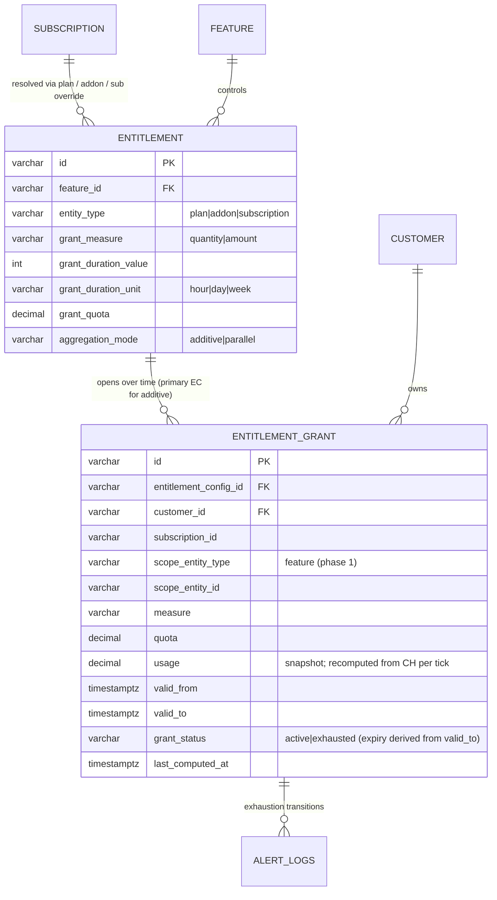
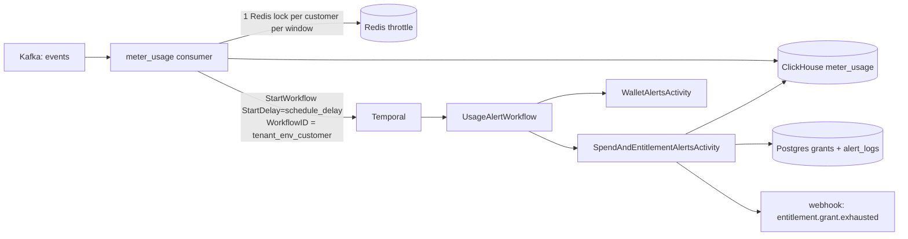
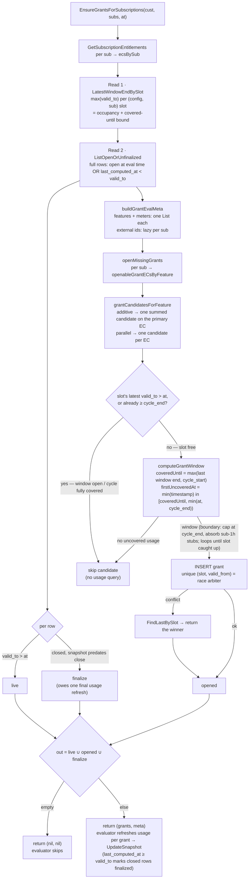

# FLE-959 — Entitlements Revamp: Time-Boxed Grants, Parallel Entitlements, and Usage Alerts

- **Ticket:** [FLE-959](https://linear.app/flexprice/issue/FLE-959/entitlements-revamp)
- **Date:** 2026-07-08 (revised 2026-07-23 to match implementation)
- **Author:** Ankit Malik
- **Status:** Implemented (Phase 1)

---

## 1. Summary

**Entitlement Grants** are time-boxed usage buckets instantiated from entitlements that carry a *grant config*. They add three capabilities on top of the legacy entitlement model:

- **Time-boxed quotas** — "100 tokens per 5 hours", independent of the billing cycle.
- **Aggregation modes** — `additive` (multiple entitlements on a feature merge into ONE summed bucket) or `parallel` (each entitlement is its own independent bucket).
- **Amount-based quotas** — "$50 of compute per day", priced through the existing billing pipeline.

Everything reuses existing infrastructure:

| Concern | Reused surface |
|---|---|
| Pricing (incl. mid-window price changes) | `GetSubscriptionMeterUsageWithSub` + `ConvertToBillingCharges` (per-line-item date-range segmentation) |
| Alerts | `alert_logs` + state-transition dedup (`GetLatestAlert`) |
| Webhooks | `entitlement.grant.exhausted` via the standard alert→webhook pipeline |
| Per-subscription overrides | `GetSubscriptionEntitlements` (plan + addon + sub override resolution) |
| Billing overage | `adjustMeterUsageGrants` inside `CalculateMeterUsageCharges` |

New surface: one PG table (`entitlement_grants`), grant-config columns on `entitlements`, one Temporal workflow (`UsageAlertWorkflow`), one config block (`usage_alerts`).

**SLA:** alerts fire within ≤ `schedule_delay` (default 5m30s) p99 of event ingest.

---

## 2. Concepts

| Term | Meaning |
|---|---|
| **Entitlement Config (EC)** | An `entitlements` row that carries a grant config (`grant_measure`, `grant_duration_*`, `grant_quota`). Presence of the config is the opt-in — there is no separate `grant_type` discriminator. `HasGrantConfig()` in the domain model is the single source of truth. |
| **Entitlement Grant (EG)** | A row in `entitlement_grants`: one concrete, immutable time window with a quota and a usage snapshot. `grant_status` tracks quota state only (`active → exhausted`); **expiry is derived** from `valid_to <= now` and never written. |
| **Aggregation mode** | `additive` (default): all grant ECs on a feature open **one** grant per window with `quota = Σ quotas`. `parallel`: each EC opens its own grant. One mode per feature, enforced at write time. |
| **Measure** | `quantity` (raw meter units) or `amount` (currency). One measure per feature, enforced at write time. |
| **Live grant** | `valid_to > now` — purely time-derived, no status involved. At most one window per (tenant, env, config, customer, subscription) slot is open at a time; a closed window frees the slot by construction. |
| **Cycle-boundary cap** | `valid_to <= subscription.current_period_end`. Grants never straddle two cycles. |

---

## 3. Data Model

### 3.1 `entitlements` — grant-config columns

```sql
ALTER TABLE entitlements
  ADD COLUMN grant_measure        varchar(20),        -- 'quantity' | 'amount'
  ADD COLUMN grant_duration_value int,
  ADD COLUMN grant_duration_unit  varchar(10),        -- 'hour' | 'day' | 'week'
  ADD COLUMN grant_quota          numeric(25,15),
  ADD COLUMN aggregation_mode     varchar(20) NOT NULL DEFAULT 'additive';
```

Grant config is **all-or-nothing**: either every field is set (metered feature required) or none are (legacy entitlement). The update API clears a config via `clear_grant_config: true`.

### 3.2 `entitlement_grants`

```sql
CREATE TABLE entitlement_grants (
    id                     varchar(50) PRIMARY KEY,          -- prefix eg_
    tenant_id              varchar NOT NULL,
    environment_id         varchar NOT NULL,
    entitlement_config_id  varchar(50) NOT NULL,             -- primary EC for additive groups
    customer_id            varchar(50) NOT NULL,
    subscription_id        varchar(50) NOT NULL,
    scope_entity_type      varchar(20) NOT NULL DEFAULT 'feature',  -- feature | subscription | group (future)
    scope_entity_id        varchar(50) NOT NULL,
    measure                varchar(20) NOT NULL,             -- quantity | amount
    quota                  numeric(25,15) NOT NULL,          -- immutable; Σ quotas for additive groups
    usage                  numeric(25,15) NOT NULL DEFAULT 0,-- snapshot, refreshed per tick
    valid_from             timestamptz NOT NULL,
    valid_to               timestamptz NOT NULL,             -- <= sub.current_period_end
    grant_status           varchar(20) NOT NULL DEFAULT 'active',  -- active|exhausted; expiry derived from valid_to
    last_computed_at       timestamptz,                             -- snapshot watermark; >= valid_to marks a closed window finalized
    quota_crossed_at       timestamptz                              -- set once: the EVALUATION time that first saw usage >= quota (see §5.3 note)
    -- + standard base columns (status, created_at, ...)
);

-- Race arbiter + slot history: valid_from is deterministic under
-- usage-anchored windows (same covered-until bound + same events => same
-- start), so two workers opening the same slot collide here; also serves
-- FindLastBySlot (5-col equality + ORDER BY valid_from DESC LIMIT 1, no sort).
CREATE UNIQUE INDEX ON entitlement_grants
  (tenant_id, environment_id, entitlement_config_id, customer_id, subscription_id, valid_from);

-- Every per-tick and billing read: equality on (tenant, env, customer) +
-- range on valid_to bounds each scan to the current cycle even as the table
-- grows. Trailing config/sub resolve the slot-frontier GROUP BY and the
-- billing subscription filter in-index (both immutable).
CREATE INDEX ON entitlement_grants
  (tenant_id, environment_id, customer_id, valid_to, entitlement_config_id, subscription_id);
```

Query → index map (every production read; the table only ever grows):

| Query | Index | Shape |
|---|---|---|
| `Create` (race arbiter) | unique | conflict on (slot, valid_from) |
| `FindLastBySlot` (conflict re-read) | unique | 5-col equality + backward scan, LIMIT 1 |
| `LatestWindowEndBySlot` (per tick) | customer+valid_to | cycle-bounded range, GROUP BY in-index |
| `ListOpenOrUnfinalized` (per tick) | customer+valid_to | cycle-bounded range, `last_computed_at` residual on the few fetched rows |
| Billing `WithCycleOverlap` (per invoice) | customer+valid_to | cycle-bounded range, sub filter in-index, `valid_from` residual |
| `Get`/`Update`/`UpdateSnapshot`/`Delete` | PK | — |

Snapshot writes (`usage`, `grant_status`, `last_computed_at`) touch no indexed column, so updates stay HOT — no index churn from the evaluator loop. On the ClickHouse side, `GetEarliestUsageTimestamp` and the usage refresh filter exactly on the `meter_usage` primary-key prefix `(tenant, env, external_customer_id, meter_id, timestamp)`, so granule + partition pruning apply fully.

Alert history lives in `alert_logs` (`entity_type='entitlement_grant'`, `alert_type='entitlement_grant_exhausted'`); `grant_status` is the durable exhaustion signal. There are no per-grant alert bookkeeping columns.

### 3.3 ER diagram



---

## 4. Trigger Pipeline



Per event, after the ClickHouse insert (`runMeterUsagePostInsertSideEffects`, gated by `usage_alerts.enabled`):

1. **Redis throttle** — `AcquireLock(usage_alert_schedule:v1:{customer}, TTL = schedule_delay)`. An event at 5:02pm scheduling a 5:07pm run locks the customer until 5:07pm; the burst in between never calls Temporal. Lock is released on StartWorkflow failure so a later event retries. No Locker configured = fail open.
2. **StartWorkflow** with a stable `WorkflowID` per (tenant, env, customer) and `StartDelay = schedule_delay`. `WorkflowExecutionAlreadyStarted` is the dedup safety net behind the lock.

There is **no pre-scheduling "does this customer have configs" gate** — each workflow-side evaluator bails on cheap indexed DB reads when there is nothing to do.

**Staleness handling** (two distinct queues, two mechanisms; `stale_after` bounds both):

- **Workflow run fired late** — under a workflow-task backlog, a run scheduled for 5:07 may only reach a worker at 6:10. The scheduler stamps the intended fire time (`ScheduledFor`) into the input; a run older than `stale_after` re-schedules **once** via `ContinueAsNew` — the same workflow ID atomically gets a fresh run whose first task lands at the *back* of the queue, so already-queued newer customers evaluate first. No sleeping, no duplicate-workflow race (same ID chain); the `AlreadyRescheduled` flag caps it to one hand-off per chain so a sustained backlog can't livelock.
- **Activity waited too long in the activity queue** — bounded by `ScheduleToStartTimeout = stale_after`. Temporal does not retry schedule-to-start timeouts (a retry would rejoin the same queue); the error is logged and the next event's workflow re-evaluates the customer.

The knobs travel in the workflow input (stamped from config by the scheduler) to keep replays deterministic.

### Config (`usage_alerts`, root of config.yaml)

```yaml
usage_alerts:
  enabled: false          # meter usage pushes the debounce workflow
  schedule_delay: "5m30s" # workflow StartDelay AND Redis throttle-lock TTL
  stale_after: "1h"       # late-run yield (ContinueAsNew) + activity ScheduleToStartTimeout
```

---

## 5. Evaluation (`SpendAndEntitlementAlertsActivity`)

`EvaluateSpendAndEntitlementAlertsForCustomer` fetches the customer's **active subscriptions once** and feeds them to both halves; their errors join (`errors.Join`) so one failing never blocks the other.

### 5.1 Spend alerts

Subscription-level only (line-item and group scopes were dropped). Enabled sub-scoped alert configs are fetched first; only configured subs pay for a usage query. Usage flows through the data-fed `GetMeterUsageForSubscription` → `CalculateMeterUsageCharges`; the total is compared against thresholds and logged via `alert_logs`.

### 5.2 `EnsureGrantsForSubscriptions`

**Two constant-size reads per pass** — result size is per-slot, never per-window, so cost does not grow as the cycle accumulates windows:

1. **Slot frontiers** (`LatestWindowEndBySlot`): `max(valid_to)` grouped by (config, subscription) — one aggregate row per slot answers both occupancy (`end > now` ⇒ open) and the coverage frontier.
2. **Working set** (`ListOpenOrUnfinalized`): full rows only where `valid_to > now` (open) OR `last_computed_at < valid_to` (closed but owing its **final usage refresh** so tail events reach the snapshot billing reads). A finalized snapshot (`last_computed_at >= valid_to`) self-excludes from every later pass.

No per-slot queries, no status writes. A shared **meta bundle** (features, meters, lazily-memoized external customer ids) is built once and reused by both grant opening and the evaluator's refresh loop; a pass that yields no grants returns nil meta and the evaluator skips entirely.



For each subscription, resolve its entitlements (`GetSubscriptionEntitlements` — plan + addon + sub overrides), keep those with a grant config, then per feature:

- Skip ECs whose `grant_duration >= cycle length` — a grant spanning the whole cycle is just the cycle quota, which legacy `usage_limit + usage_reset_period` already expresses. Avoids redundant rows and evaluation.
- **parallel** → one grant per EC without an open window.
- **additive** → ONE grant for the group with `quota = Σ quotas`, opened on the lowest-ID ("primary") EC's slot. One bucket downstream means evaluation, alerts, and billing treat the group as a single pool with no extra machinery.

Grant opening (`openOneGrant`): compute the window and INSERT — nothing else. The unique `(slot, valid_from)` index is the race arbiter: `valid_from` is deterministic (same covered-until bound + same events ⇒ same start), so a losing racer collides and re-reads the winner (`FindLastBySlot`).

**Window math (`computeGrantWindow`) — windows are usage-anchored.** Every window opens at the first usage event past the covered range, so every event *visible at evaluation time* falls inside a window and idle periods open no windows at all (a backdated arrival into an already-passed gap is the accepted edge below):

- **`coveredUntil`** = `max(prev.valid_to, cycle_start)` from the slot's latest grant — everything before it is covered by past windows (no grant, or one from an earlier cycle → `cycle_start`; last usage in the previous cycle followed by first usage in the new one is a normal idle gap, not an error).
- **`firstUncoveredAt`** = `min(timestamp)` of `meter_usage` in `[coveredUntil, min(now, cycle_end))` for the grant's meter + external customer IDs (`GetEarliestUsageTimestamp`). The `cycle_end` clamp keeps next-cycle events out before the subscription object rolls; an empty range simply finds nothing. **No uncovered usage → no grant opens** (lazy opening — the next tick re-checks with the same covered-until bound, so an event still in the ingest pipeline is picked up later).
- `valid_from = firstUncoveredAt` — exact for events visible in the uncovered query range: an event at 2:00 evaluated at 2:07 opens a window starting 2:00. Idle gaps between windows are legal by construction (no events there *when the window opened*; a later backdated arrival into such a gap stays uncovered — see the accepted edges).
- `valid_to = valid_from + duration`; when the remainder to `cycle_end` would be sub-minimum the window **stretches to `cycle_end`** — cap and trailing-stub absorption in one rule. The **1h minimum is best-effort at the boundary**: a forced tail (first uncovered event inside the cycle's last hour) opens short `[event, cycle_end)` — coverage beats window-length aesthetics; the config-level minimum (`grant_duration >= 1h`) is structural (smallest unit is an hour).
- **Catch-up drains in one pass**: after delayed evaluation or cycle-rollover lag, a single tick loops per slot — open window, advance the covered bound, re-anchor — until the latest window is open at `now` or no uncovered usage remains. Draining a backlog never depends on future events arriving. Usage recompute from CH keeps late accounting idempotent.

Grants are immutable for their lifetime; EC/mode/quota changes take effect from the next window.

**Accepted best-effort edges:** a backdated event landing inside an old idle gap *between* windows is lost (the covered set is a union of windows, not a single bound); a lone final event with no successors is only covered once a later event triggers a tick.

### 5.3 Usage refresh + exhaustion

Per returned feature-scoped grant (open windows plus the finalize set), over `[valid_from, min(now, valid_to))`:

- **quantity** — one raw `meter_usage` query (`dto.UsageTotalRequest.ToParams()`, FINAL consistency).
- **amount** — rides the billing path: `GetSubscriptionMeterUsageWithSub` + `ConvertToBillingCharges`, summing the charges for the grant's meter. The billing path splits the window into per-line-item date ranges, so a **mid-window price change produces a new segment priced at its own price** — no price pinning, no retroactive repricing.

Snapshot write (`UpdateSnapshot`): `usage`, `last_computed_at`, `quota_crossed_at`, and `active → exhausted` when `usage >= quota`.

**Quota-exhaustion recording (once per grant lifetime):** when a refresh first sees `usage >= quota`, the evaluator sets `quota_crossed_at = evaluation time` — no extra queries. **Note (deliberate approximation):** this is the *detection* time, not the exact event-level crossing; billing only charges usage *after* it, so overage accrued between the true crossing and detection is never billed — pro-customer, bounded by the debounce delay. The exact alternative, if ever needed, is binary-searching the crossing second on the running measure and storing the usage total through it (see decisions log). That is ALL the evaluator does for overage; billing derives everything else (§6).

**Alerts fire on exhaustion only** (`usage/quota >= 1`): one `alert_logs` row (`in_alarm`) per grant, deduped by state transition, delivered as the `entitlement.grant.exhausted` webhook (payload: subscription + grant id + usage ratio). Recovery is a new grant window, not a state flip.

---

## 6. Billing Overage — `adjustMeterUsageGrants`

Runs inside `CalculateMeterUsageCharges`. Grants for the cycle are loaded once per invoice build (`WithCycleOverlap` — purely time-based, so a grant whose window closed mid-cycle still owes its overage) and folded per line item, replacing the legacy entitlement adjustment for that feature.

**Merged-overage-windows model:** overage usage bills **exactly once** no matter how many ECs were in overage. The evaluator records only *when* each grant exhausted (§5.3); billing derives everything else:

- **Single EC** (common config): snapshot sum `Σ max(0, usage − quota)` — exact, zero queries.
- **Multiple ECs** (`mergedOverage`): each quota-crossed EG contributes an overage window `[quota_crossed_at, valid_to)`; overlapping windows **merge**, and billable = usage/cost inside the merged windows. Quantity measure: **one** ClickHouse query over all windows (`TimeRanges` OR'd in `BuildWhereClause`); amount measure: one billing-path pricing per window. **Zero queries when nothing crossed** (the common case) — marginal next to the per-meter usage queries `CalculateMeterUsageCharges` already runs.
- **Lag semantics:** an EG over quota whose exhaustion isn't recorded yet simply contributes no window — it bills on the next pass (slight lag, never wrong). A measurement error propagates: the charge calculation fails and retries rather than billing an approximation.
- **Service boundaries:** window measurement lives on `MeterUsageService` (`GetUsageTotal`, `GetMeterWindowCost`); neither the evaluator nor the billing fold touches the meter-usage repo directly.
- **Freshness:** wallet real-time balance accepts ≤ one debounce of staleness; invoice creation runs `RefreshEntitlementGrantsForCustomer` (grants-only pass, idempotent) before charges so snapshots are fresh at the money moment.

`PerECOverage` reports per-EC violation totals (`usage − quota`) — overlapping across ECs by construction, NOT a bill decomposition. Combined-pool stays rejected (masks per-budget overage in alerts); additive groups are one summed grant, so a single EC covers that mode.

- **Quantity lane** — the summed overage becomes the billable quantity for the pricer (commit / tier / true-up apply on top as usual).
- **Amount lane** — the summed overage is already currency; it lands directly on the line item and the quantity zeroes so nothing double-counts. A runtime guard skips folding when the line item carries commitment or true-up, or the price is tiered (those need full-cycle pricing scope) — EC-write validation prevents the tiered case, the guard covers config drift and sub-line-level commitments invisible at EC-write time.

Only **feature-scoped** grants fold per meter. A future subscription- or group-scoped grant spans multiple meters; folding it per line item would count its overage once per meter, so those scopes wait for an invoice-level allocation pass.

---

## 7. Restrictions (enforced)

**EC write time (domain + service validation):**

1. Grant config is all-or-nothing: `grant_measure` + `grant_duration_value/unit` + `grant_quota`, on **metered features only**; `grant_quota > 0`.
2. `grant_duration >= 1 hour`.
3. No **MAX** meters (peak, not additive consumption) and no **bucketed** meters (a grant window slices buckets ambiguously).
4. `measure='amount'` rejects **tiered** prices on the meter — amount grants require linear/flat per-unit pricing.
5. `aggregation_mode='parallel'` requires a grant config (legacy entitlements are always additive).
6. **Cross-EC coherence per feature**: one aggregation mode, one measure; **additive** groups must also share `grant_duration` (their quotas sum into one window).
7. **One published entitlement per (entity, feature)** — DB partial unique index `WHERE status='published' AND aggregation_mode <> 'parallel'`. Parallel ECs stack on one entity (that's the mode's purpose); additive duplicates on the same entity are a quota edit, not a second row — additive *groups* span entities (plan + addon + subscription override).

**Grant open time:**

8. `grant_duration < subscription cycle length` — cycle-spanning grants are skipped (use `usage_reset_period` instead).
9. Cycle-boundary cap: `valid_to <= current_period_end`. The cycle's final window absorbs a sub-1h trailing remainder; a forced-tail anchor opens a short window `[event, cycle_end)` — the 1h minimum is best-effort at the boundary (config-level minimum stays structural).
10. One window at a time per (tenant, env, config, customer, subscription) slot — the unique `(slot, valid_from)` index arbitrates racing opens; occupancy itself is time-derived (`valid_to > now`).
11. Grants are immutable; config changes apply from the next window.

**Runtime (billing fold):**

12. Grant folding requires an **additive, non-bucketed** meter aggregation (SUM / COUNT / SUM_WITH_MULTIPLIER without a bucket): snapshot sums and merged-window measurement assume usage decomposes over time windows, which MAX / LATEST / AVG / bucketed meters don't. Grant folding also skips **tiered** prices in both lanes (overage is priced standalone / pre-priced per window — the marginal units would land in the wrong tier); the **amount lane** additionally skips commitment / true-up line items (they reconcile the whole cycle, which pre-priced overage bypasses). The quantity lane composes with commitments — its qty re-enters the normal pipeline.
13. Only feature-scoped grants fold per meter.

**Alerting:**

14. Exhaustion-only (`usage/quota >= 1` → `in_alarm`), deduped by alert-log state transition; no intermediate thresholds, no recovery transitions.

---

## 8. Failure Modes

| Failure | Behavior |
|---|---|
| Activity crashes / retried | Alert dedup (state transition) + idempotent `UpdateSnapshot` + `EnsureGrants` convergence make retries safe. |
| Redis unavailable | Throttle fails open; Temporal `AlreadyStarted` dedup absorbs duplicates. |
| Temporal unavailable | CH insert + Kafka ack unaffected; alerts delayed, not lost. |
| Evaluation delayed / consumer down | Usage during the outage anchors each missed window exactly; one tick drains the whole backlog (per-slot catch-up loop) and recomputes usage from CH. |
| Cycle-rollover lag (period fields updated late by the billing worker) | Ticks during the lag open nothing past the stale `cycle_end`: once slot coverage reaches `cycle_end` the open loop skips without even issuing the usage query. The first tick after rollover drains all backlog windows at exact event timestamps. If no event ever arrives post-rollover, the backlog waits for the next tick — hardening option: trigger an evaluation from the rollover workflow itself. |
| Outage spanning a cycle rollover | New cycle anchors at `cycle_start` (coverage continues); windows never open in a closed cycle, so an old-cycle uncovered tail stays unbilled (accepted — same class as any usage after the last window of a cycle). |
| Backdated events | Usage is always recomputed from CH over the grant window, never incremented — late events inside a window are picked up on the next tick. |
| Window closes between ticks | The closed grant stays in the finalize set (`last_computed_at < valid_to`) and gets one final refresh — the tick scheduled by the window's own last event performs it. |
| Slot race (two workers opening) | Deterministic `valid_from` ⇒ collision on the unique `(slot, valid_from)` index; loser re-reads the winner. |
| Exhaustion not yet recorded at read time (evaluator lagging) | The EG contributes no overage window — bills on the next pass. Slight lag, never a wrong number; invoice creation closes the gap by running a grants-only refresh first. |
| Merged-window measurement failure at read time | The error propagates — charge calculation fails and the invoice/balance request retries. A knowingly wrong number is never billed. |
| Workflow-task backlog | Late-firing runs yield once via `ContinueAsNew` to the back of the queue; newer customers evaluate first. |
| Activity-queue backlog | `ScheduleToStartTimeout` bounds the wait; error logged, next event's workflow re-evaluates. |

---

## 9. Decisions Log

| Decision | Rationale |
|---|---|
| No `grant_type` column | Fully derivable: an entitlement with a grant config *is* grant-based (`HasGrantConfig()`). Fewer knobs, no half-set states. |
| `aggregation_mode` enum (`additive` default / `parallel`) instead of a `parallel` bool | Names the semantic; additive stays the legacy-compatible default. |
| Additive = ONE summed grant on the primary EC slot | Single pool downstream — evaluation, alerts, billing need zero group-awareness. Splitting usage across same-feature buckets would need attribution machinery. |
| Parallel = one grant per EC slot | Independent windows/budgets that each see the full usage stream; windows drift (usage-anchored per slot). Billing uses the excess-interval union — every unit that exceeded ≥1 budget bills exactly once — aligned violations merge, drifted ones both bill. Combined-pool rejected — masks per-budget overage in alerts. |
| Record *when*, measure *where* (exhaustion timestamp at evaluator time, merged overage windows at read) | The debounced tick stores one fact per exhausted grant (`quota_crossed_at`); billing merges the overage windows and measures usage inside them — 0 queries when nothing crossed, ~1 when in overage. Replaced a full ownership ledger: same bill-once semantics, a fraction of the machinery. Invoice creation runs one idempotent refresh to close the debounce gap. |
| `quota_crossed_at` = detection time, not the exact event-level crossing | Exact crossing needs extra ClickHouse queries (binary search on running usage) plus a stored usage-at-crossing for the straddling event. We skip both: billing only charges usage after detection — under-bills by the overage accrued before the tick (pro-customer, bounded by the debounce). Upgrade path if exactness is ever needed: binary-searched crossing second + usage-through-it. |
| No price pinning on amount grants | The billing path already segments queries by line-item date ranges; a mid-window price change is priced per segment. Pinning would freeze the whole window at one price — worse. |
| Usage-anchored windows (replaces butt-joint / delay-derived anchors) | Windows open at the first uncovered usage event and never at all when there is none — exact coverage with no idle-time windows and no delay-derived approximation. One extra indexed CH `min(timestamp)` scalar per window open. |
| Skip `duration >= cycle length` at open | Cycle-scoped quotas already exist as `usage_reset_period`; avoids redundant rows/evaluation. Checked at open (not write) because cycle length is per-subscription. |
| Cycle-boundary cap | Pricer stays cycle-scoped; no cross-cycle config ambiguity. |
| Exhaustion-only alerts | Product decision; alert history in `alert_logs`, `grant_status` is the durable signal. Intermediate thresholds can return later without schema changes. |
| Redis schedule-throttle + Temporal `StartDelay` (not Schedules, not in-workflow sleep) | `StartDelay` is the native one-shot debounce primitive — no task dispatched until fire time; the Redis lock keeps the per-event Temporal RPC to one per customer per window. Schedules are for recurring triggers; in-workflow sleep burns a task immediately. |
| No pre-scheduling config gate | Workflow-side evaluators bail on cheap indexed reads; a gate duplicates those checks and risks false negatives (missed grant evaluation = billing wrongness). |
| Spend alerts subscription-level only | Line-item/group spend alerts dropped by design review; settings CRUD retained for now. |
| `ContinueAsNew` for late-firing workflow runs | Temporal's native "replace myself with a fresh run": same workflow ID (no duplicate race), fresh task at the back of the queue, no in-workflow sleep. One yield per chain guards against livelock. |
| `ScheduleToStartTimeout` for activity-queue waits | Temporal's out-of-the-box queue-wait bound; not retried by policy (a retry rejoins the same queue). Distinct from workflow-run staleness — different queues. Knobs ride the workflow input for replay determinism. |
| Minimum grant duration 1 hour; hour/day/week units | Product rule — no noisy short buckets. Enforced at config level (structural — smallest unit is an hour); instantiated windows honor it best-effort: cycle-boundary tails may be shorter, keeping window math a plain anchor + cap and never leaving boundary usage uncovered. |
| Multi-window catch-up per tick | One evaluation pass loops per slot until caught up to `now`, so a rollover-lag or outage backlog drains on the first tick instead of needing one future event per missed window. Bounded: windows strictly advance the covered range within one cycle. |
| Expiry derived, never written (`grant_status` = quota state only) | Closed windows need no UPDATE at all — `valid_to <= now` says it. The slot's uniqueness moved to `(slot, valid_from)`, sound because usage-anchored `valid_from` is deterministic. Two constant-size reads (slot-frontier aggregate + open-or-unfinalized working set) replace per-slot expire/find queries and stay flat as the cycle accumulates windows. |
| Finalize via `last_computed_at >= valid_to` | A closed window still owes one usage refresh (its last events tick in after the close, debounce ≈ schedule delay). The marker is snapshot data the evaluator already writes — no status machinery, self-clearing, zero cost when idle. |

---

## 10. Phase 2 (future, not building now)

Real-time (<60s) alerting via per-event Redis counters, CH `seq_id`/`ingest_epoch` ordering, cold-path bootstrap from PG snapshots, and per-event wallet decrement (Phase 3). The 5-minute pipeline remains the reconciliation layer. Detailed ERD to be written when committed; earlier draft retained in git history of this file.
