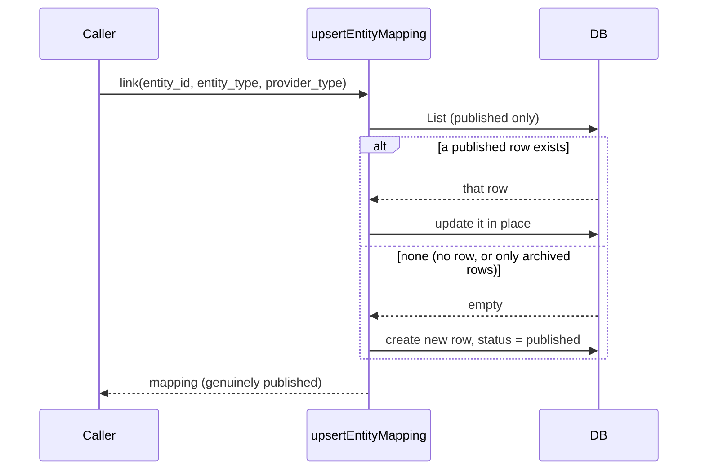
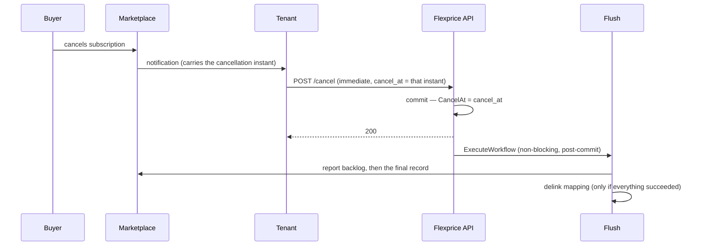
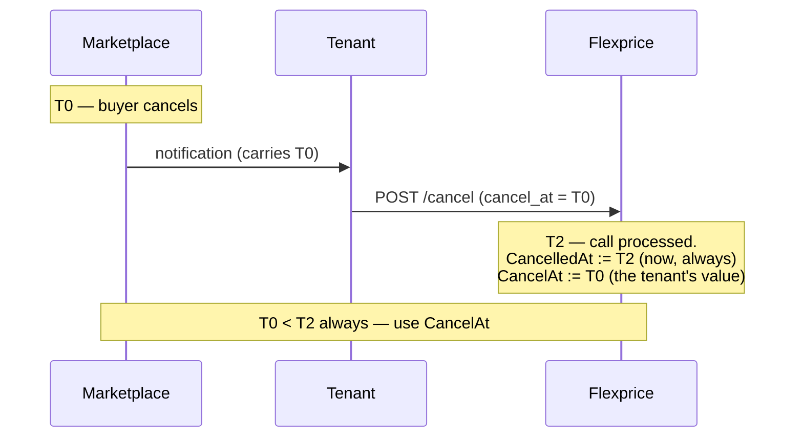

# Marketplace Integration — Cancellation Flush & Entity Mapping Lifecycle

Ticket: FLE-1106
Author: Tsage
Status: design, pending approval
Scope: two lifecycle defects and the final-usage flush that closes them. Applies to all three
marketplaces (AWS, GCP, Azure) and, for the mapping defect, to every integration provider.

Builds on [v3](2026-07-23-FLE-1071-marketplace-integration-v3.md). Everything in v3 stands except
where §6 marks it superseded.

---

## 1. What this changes

| # | Problem | Fix |
| --- | --- | --- |
| 1 | Re-linking an entity after unlinking silently leaves the mapping `archived`. The API returns 200 but no active mapping exists. | Treat an archived row as absent: create a new published row instead of updating it (§2). |
| 2 | Cancelling a subscription leaves its marketplace mapping `published`, and the final active-period usage is never reported inside the marketplaces' post-cancellation windows. | A one-shot flush on cancellation: report the backlog, compute and report the final window, then archive the mapping (§3). |

The driver for #2 is timing. v3 §10 assumed the tenant could wait for the 6-hour snapshot cron's
4–10h lag before archiving. AWS and GCP give roughly **one hour** after cancellation, so that
assumption loses the final usage of every cancelled marketplace subscription (§4).

---

## 2. Defect 1 — re-link after unlink

### 2.1 What happens today

`DelinkIntegrationMapping` soft-deletes: it flips `status` to `archived` and leaves the row and its
unique-index columns untouched. That part is correct.

The defect is in `upsertEntityMapping`
([entityintegrationmapping.go](../../internal/ee/service/entityintegrationmapping.go)). It looked up
existing mappings with `types.NewNoLimitQueryFilter()`, which leaves `Status` nil, so
`ApplyStatusFilter` applies **no status predicate** and archived rows match. With only an archived row
present, the service updated it in place and returned it — `Update` writes back whatever status the
caller passed, so the row stayed `archived`. The caller got a 200 and a mapping object, but no active
mapping existed.

The marketplace path was never affected: `RegisterAgreement` / `createMappingIfAbsent`
([marketplace.go](../../internal/ee/service/marketplace.go)) already queried with
`NewNoLimitPublishedQueryFilter()`.

### 2.2 The fix

One-line change: query published-only. An archived row is then invisible to the lookup, so a re-link
falls through to the existing create path and gets a new published row. The archived row is never
touched.

```go
filter := &types.EntityIntegrationMappingFilter{
    QueryFilter: types.NewNoLimitPublishedQueryFilter(),   // was NewNoLimitQueryFilter()
    EntityID:    req.EntityID,
    ...
}
```



### 2.3 Why no `expired_at` column

Considered and rejected. Reusing an archived row would need a separate timestamp for when it had been
archived — but that timestamp would be overwritten on the next unlink, so it could not carry history
anyway. Creating a new row makes the column unnecessary: the archived row's `updated_at` is when it was
archived, the new row's `created_at` is when it was re-linked, and the full history is the ordered
sequence of rows.

The unique index already permits this. It is **partial** —
`Unique().Annotations(entsql.IndexWhere("((status)::text = 'published'::text)"))`
([ent/schema/entityintegrationmapping.go](../../ent/schema/entityintegrationmapping.go)) — so any
number of archived rows can coexist with one published row for the same
`(tenant, environment, entity_type, entity_id, provider_type)`. No schema change.

### 2.4 Test gap

`TestLinkIntegrationMapping_UpsertExistingMapping` only covered link → link on a still-published row.
Nothing exercised delink → re-link, which is why this shipped unnoticed. A regression test for that
path is part of this work.

---

## 3. Defect 2 — the cancellation flush

### 3.1 Trigger

`CancelSubscription` stays fast and is not restructured. After its existing `WithTx` commits — next to
the existing `publishCancellationEvents` call — it starts the flush with `ExecuteWorkflow`
(non-blocking), gated on:

```go
subscription.SubscriptionStatus == types.SubscriptionStatusCancelled &&
    subscription.CancelAt != nil &&
    s.hasMarketplaceMapping(ctx, subscription.ID)
```

The status check matters: `CancelAt` is set for all three cancellation types, but only `immediate`
sets `Cancelled` synchronously. `end_of_period` and `scheduled_date` leave the subscription active
until a later processor, so flushing then would report a final window for a subscription that has not
ended. `hasMarketplaceMapping` gates at the call site so ordinary cancellations don't start a workflow
that would immediately no-op; a lookup error is logged and treated as "no mapping", since this is a
post-commit side effect that must never fail an already-committed cancellation.

Starting workflows after the transaction matches the existing convention (`CreateSubscription`'s
HubSpot syncs, `CreateCustomer`'s onboarding). **This is not a cron** — one execution per cancellation.
The snapshot (6h) and report (3h) crons are unchanged.



### 3.2 Sequence

Workflow `MarketplaceSubscriptionFinalUsageFlushWorkflow`, activity
`MarketplaceSubscriptionFinalUsageFlushActivity`. The workflow is a thin wrapper — one
`ExecuteActivity` with 5 attempts (5s initial, 2× backoff, 1 min max, 5 min start-to-close). All logic
is in the activity.

```text
FlushActivity(subscriptionID, cancelAt, tenantID, environmentID):
    # cancelAt = sub.CancelAt, never sub.CancelledAt (§3.6)
    # tenantID/environmentID come from the workflow input and are set onto ctx first —
    # every repository call below is scoped by them.

1. subMappings = published subscription mappings for [aws, gcp, azure]
   if none: return                                  # not a marketplace subscription
   for m in subMappings:
       conn = resolve m's connection; prepareConnection(conn)
       on failure: log, set connectionResolutionFailed, continue   # never abort the others

2. # Phase 1 — the pre-existing backlog. Fetched before phase 2 computes anything, so a first run
   # never sees its own final record here.
   backlog = List(subscription_id, synced=false, period_end >= now-24h, sort period_end asc)
   for rec in backlog:
       if not isEligibleForReport(rec): continue    # non-USD or negative (§8.2)
       reportRecordToConnections(rec, relevantConnections(rec)); MarkSynced(rec)

3. # Phase 2 — the one final record.
   computedThrough = MAX(period_end) over ALL published rows, else earliest mapping created_at (§3.3)
   finalRec = buildFinalUsageRecord(computedThrough, cancelAt)     # nil if cancelAt <= computedThrough
   if finalRec and isEligibleForReport(finalRec):
       reportRecordToConnections(finalRec, relevantConnections(finalRec))
       if fully reported:
           finalRec.PeriodEnd = cancelAt            # stored exact; the wire got cancelAt - 1s (§3.4)
           Create(finalRec)                         # first write, only now
       else: finalUsageFlushFailed = true

4. if connectionResolutionFailed or finalUsageFlushFailed or any backlog record failed:
       return error                                 # Temporal retries; mapping stays published (§3.5)
   else:
       for m in subMappings: entityIntegrationMappingRepo.Delete(m)
```

Customer and plan mappings are **not** archived. Only the subscription's marketplace mappings are.

```mermaid
sequenceDiagram
    participant Flush
    participant DB as usage_records
    participant MP as Marketplaces

    Note over Flush,MP: Phase 1 — backlog (pre-existing rows only)
    Flush->>DB: unsynced rows, period_end within 24h
    loop each record × each relevant connection without an entry
        Flush->>MP: report
        alt accepted
            MP-->>Flush: reporting_id → syncs[conn]
        else Azure zero-amount
            Flush->>Flush: syncs[conn] = skipped
        else rejected / failed
            Flush->>Flush: no entry — stays unsynced
        end
    end
    Flush->>DB: MarkSynced (true iff every relevant connection has an entry)

    Note over Flush,MP: Phase 2 — the one final record
    Flush->>DB: frontier = MAX(period_end)
    alt cancelAt > frontier
        Flush->>Flush: compute usage — NOT written yet
        Flush->>MP: report (wire timestamp = cancelAt - 1s)
        alt fully reported
            Flush->>DB: create record (period_end = cancelAt)
        else any connection failed
            Flush->>Flush: discard — next attempt recomputes fresh
        end
    end

    alt everything succeeded
        Flush->>Flush: delink every mapping
    else any failure
        Flush->>Flush: mapping stays published; return error
    end
```

### 3.3 Window rules

**The frontier spans all rows, not just unsynced ones.** Taking the max over unsynced rows alone can
double-bill: if record A `[T-10h, T-4h]` failed to sync but B `[T-4h, T+2h]` succeeded, the unsynced
max is `T-4h` and the flush window `[T-4h, cancelAt]` re-reports everything B covered. The max over
**all published rows** is `T+2h`. Since snapshot windows are contiguous, the frontier has no holes
behind it — every earlier span belongs to some row, and those rows are exactly what Phase 1 reports.

**Fallback when no usage record exists.** A subscription can be linked and cancelled without the
snapshot cron ever running for it. The flush then uses the earliest subscription mapping's
`created_at` — the moment the subscription became reportable to that marketplace. Consequence: usage
from before it was linked is deliberately excluded.

**Boundaries.** `period_start` is inclusive, `period_end` exclusive, inherited from the ClickHouse
query builder (`timestamp >= ?` and `timestamp < ?`). Chaining `period_start = previous period_end`
counts a boundary event exactly once. `buildFinalUsageRecord` early-returns when
`cancelAt <= windowStart`, so a backdated cancellation can't produce an inverted window; the backlog
flush is then the whole job.

### 3.4 Why the final record is reported before it is written

Two earlier shapes were tried; each had a real bug the next one fixed.

| Shape | Stored `period_end` | Bug |
| --- | --- | --- |
| 1. Create first, with the margin baked in | `cancelAt - 1s` | The row instantly becomes the frontier, so `cancelAt > frontier` is *still true* on a retry — it creates a second, near-empty record for the 1-second sliver. |
| 2. Create first, store the true instant | `cancelAt` | Fixes the sliver, but a partially-reported row (say GCP failed) sits `synced = false` and the **next run picks it up through Phase 1**, which applies no margin — GCP's strict `<` rejects it forever. |
| **3. Report first, then create** (current) | `cancelAt` | None of the above. Nothing unreported is ever persisted, so a retry recomputes the same window from an unchanged frontier and reports it again with the margin correctly applied. |

The cost of shape 3: nothing about a partially-successful attempt survives between retries for the
final record, and each rebuild generates a fresh id. AWS de-duplicates on customer+dimension+timestamp
so a resend is safe there; GCP de-duplicates on `OperationID` (= the record id), so it cannot recognise
a retry as the same operation — see §7.

### 3.5 Failure handling and when the mapping is delinked

A report failure does not stop the run: every backlog record is still attempted and every connection
still resolved, exactly as the report cron behaves. Retries are idempotent for backlog records — a
connection that already has a `rec.Syncs[connection_id]` entry (real accept *or* skip) is never
re-attempted.

Each record's outcome is exactly one of three, decided by the caller from `rec.Synced` and
`anyRealEntry` (the shared reporter itself only reports; it does not classify):

- **succeeded** — every relevant connection has an entry, and at least one is a real post
- **failed** — at least one relevant connection still has no entry
- **skipped** — every relevant connection has an entry, but all are skips (today only Azure's
  zero-amount case) — nothing was posted anywhere

**Delink runs only when everything succeeded**: no failed backlog record, the final record (if needed)
fully reported, and every mapped connection resolved. On any failure the mapping stays `published` and
the activity returns an error.

This reverses the original draft, which delinked unconditionally on the reasoning that a cancelled
subscription shouldn't keep a live-looking mapping. That trade was wrong: a published mapping is the
*only* thing that keeps a subscription's backlog visible to the 3h report cron
(`isRelevantForSubscription` resolves through published mappings only). Delinking on failure doesn't
just look stale — it permanently strands whatever failed to report, with no path back short of a human
re-publishing the mapping. Retries are cheap and idempotent, so there was no compensating benefit.

**No skip entries on the row itself.** An earlier draft resolved leftover rows with
`{skipped: true, skip_reason: "subscription_flushed"}`. Dropped: the 24h bound (§5) already stops
expired rows being re-scanned, and marking them synced would make a subscription whose connection was
broken for days look cleanly resolved when revenue was actually lost. Do not confuse this with the
per-run *skipped* outcome above, which is in-memory observability only and never persisted. Azure's
`zero_amount_not_supported` remains the only place `Skipped: true` is set.

### 3.6 The cancellation timestamp — `CancelAt`, not `CancelledAt`

GCP requires the reported timestamp to be strictly *before* its own recorded cancellation instant, and
Flexprice's `cancelled_at` can never satisfy that: it is set only after the marketplace already
cancelled, the marketplace notified the tenant, and the tenant called us. That's causal ordering, not
latency.



The API already carries the right value. `CancelSubscriptionRequest` accepts `cancel_at` for a
backdated immediate cancellation, validated only to reject a future date and to require it fall after
the current period start. **The tenant contract for a marketplace-linked subscription is: call
`/cancel` with `cancellation_type: "immediate"` and `cancel_at` set to the marketplace's own
cancellation instant** (from the same notification that prompted the call).

Which field it lands in is easy to get wrong. In `updateSubscriptionForCancellation`:

```go
now := time.Now().UTC()
subscription.CancelledAt = &now                // ALWAYS wall-clock now
switch cancellationType {
case types.CancellationTypeImmediate:
    subscription.CancelAt = &effectiveDate     // ← the tenant's backdated value lands HERE
    subscription.EndDate = &effectiveDate
```

So the flush reads **`sub.CancelAt`**. Verified against a real row: a `scheduled_date` cancellation
showed `cancelled_at` at the API-call instant while `cancel_at`/`end_date` carried the requested
effective date hours later — the two genuinely diverge.

With the tenant supplying the marketplace's own instant, `cancelAt - 1 second` is a minimal
deterministic correction against the real comparison GCP makes, applied uniformly to all three
providers rather than branched: it satisfies GCP's strict `<`, and conflicts with neither Azure (whose
documented example accepts landing exactly at the instant) nor AWS (no such comparison).

---

## 4. What the marketplaces actually allow after cancellation

All three reject usage for an inactive subscription; each does it differently, and two have a
post-cancellation window far shorter than their general staleness limit.

| | General staleness window | Post-cancellation window | Rejection for an inactive subscription |
| --- | --- | --- | --- |
| **AWS** | 24h, plus a month-end cutoff at 06:00 UTC on the 1st | **~1 hour** from `License Deprovisioned` / `unsubscribe-pending` | `Status: CustomerNotSubscribed` |
| **GCP** | no hard cutoff published; guidance is **within 1 hour** of the usage occurring, with a ≤30-day outage provision (re-timestamped, not backdated) | **1 hour**, and the timestamp must be *before* the cancellation | `reportErrors` `NOT_FOUND` — *inferred, not doc-confirmed* |
| **Azure** | 24h from `effectiveStartTime` | none stated separately; the 24h rule governs | `ResourceNotActive` (batch) / 400 "SaaS subscription isn't in Subscribed status" (single) |

Sources: AWS —
[SaaS EventBridge integration](https://docs.aws.amazon.com/marketplace/latest/userguide/saas-eventbridge-integration.html#saas-eventbridge-final-usage)
("this event marks the start of a 1-hour final reporting window… After this window closes… usage
reporting is no longer accepted"),
[BatchMeterUsage](https://docs.aws.amazon.com/marketplace/latest/APIReference/API_marketplace-metering_BatchMeterUsage.html),
[UsageRecordResult](https://docs.aws.amazon.com/marketplace/latest/APIReference/API_marketplace-metering_UsageRecordResult.html).
GCP —
[Best practices for usage reporting](https://docs.cloud.google.com/marketplace/docs/partners/integrated-saas/best-practices-reporting#report_usage_after_an_entitlement_is_canceled)
("you can still report it with a timestamp that reflects the actual time… Report this usage within one
hour"). Azure —
[Metering service APIs](https://learn.microsoft.com/en-us/partner-center/marketplace-offers/marketplace-metering-service-apis),
[FAQ on already-unsubscribed subscriptions](https://learn.microsoft.com/en-us/partner-center/marketplace-offers/marketplace-metering-service-apis-faq#what-happens-when-you-emit-usage-for-a-saas-subscription-that-s-already-unsubscribed-)
("The only exception is reporting usage for the time that was before the SaaS subscription is
cancelled").

**Why the marketplace can't tell us what we already reported.** Only Azure supports it
(`GET /api/usageEvents?usageStartDate=…`). AWS's metering API has no seller-queryable read (its
guidance is CloudTrail, the tenant's own audit log); GCP's Service Control exposes only `check` and
`report`. So `usage_records` stays the source of truth for all three.

---

## 5. Schema and repository changes

**No migrations.** `entity_integration_mapping` keeps its partial unique index (§2.3);
`usage_records` is unchanged.

**`ListUnsynced` gains a 24h bound.** It previously returned every `synced = false` row forever, so
rows past the submission window were re-scanned by every run and never resolved. Now bounded by
`period_end >= now() - 24h` — Azure's exact limit, AWS's limit (whose month-end rule is a deadline, not
an extension), and far more generous than GCP's hourly guidance.

**`UsageRecordFilter` added.** No filter type existed; the repository exposed only `Create`,
`ExistsForPeriod`, `ListUnsynced` and `MarkSynced`. Rather than one bespoke method per query, a filter
following `EntityIntegrationMappingFilter`'s shape was added (embedded `*QueryFilter` /
`*TimeRangeFilter`, `Filters`, `Sort`, plus explicit columns), with a matching `List` on the interface
and Ent implementation. Both flush queries are the same call:

- frontier — `{subscription_id, sort: period_end desc, limit: 1}`
- backlog — `{subscription_id, synced: false, period_end >= now-24h, sort: period_end asc}`

`ListUnsynced` was **not** folded in; the report cron needs it tenant/environment-scoped rather than
subscription-scoped.

**Tenant filter hardened.** `EntityIntegrationMappingQueryOptions.ApplyTenantFilter` skipped the tenant
predicate when the ctx tenant was empty, failing *open* (cross-tenant rows) instead of closed. Now
unconditional, matching `ConnectionQueryOptions`. No call site relied on the old behaviour — the only
deliberately cross-tenant query is `Connection.ListPublishedByProvider`, a separate method that
documents why.

---

## 6. Corrections to v3

| v3 section | Status |
| --- | --- |
| §8.1 Snapshot cron | Still correct for live subscriptions. Cancelled ones are now handled by the flush (§3). |
| §8.2 Reporting cron | Still correct. `ListUnsynced` gains the 24h bound (§5). |
| §10, "archive only after the snapshot cron's 4–10h lag" | **Superseded.** AWS and GCP allow ~1 hour (§4); a 4–10h wait misses both windows. |
| §10 lifecycle table, `Suspend` row | **Incorrect.** Azure permits usage only in `Subscribed` status, explicitly not `Suspended`. Should read: reporting is rejected while suspended; the mapping stays published because `Reinstate` is possible. |
| §2.5, "GCP submission window not documented" | **Resolved, and the framing was wrong.** GCP documents "within one hour" clearly; what it doesn't publish is a hard rejection cutoff like AWS's `TimestampOutOfBoundsException` or Azure's `Expired`. |
| §12, "no terminal state for expired rows" | **Partially addressed.** The 24h bound stops re-scanning; a true terminal status is still not built. |

---

## 7. Known gaps

| Gap | Status |
| --- | --- |
| No "give up" marker on a record that can never be sent | **Partly fixed.** The 24h bound stops the cron re-scanning hopeless rows, but they still sit `synced = false` with nothing marking them dead. A terminal status remains future work. |
| No dead-letter table | **Closed, not needed.** Failure logs carry every identifier (§8) and are queryable in SigNoz; a second copy would be a second thing to keep consistent. |
| GCP's timing rules differ in shape from AWS's and Azure's | **Answered.** GCP expects hourly reporting but publishes no hard cutoff. The 24h bound is exact for AWS/Azure and simply a uniform choice for GCP. |
| Which clock Azure measures lateness by | **Partly answered.** Azure rejects on *status* independently of the 24h rule, and usage from before cancellation stays reportable. Submission-time vs. timestamp is still unstated in any doc. |
| One record per API call instead of batching | **Enhancement.** Not a flush risk: the 24h bound caps a backlog at ~4 records across ≤3 marketplaces, so a flush makes at most about a dozen calls. |
| GCP could reject the final report as too late | **Resolved (§3.6)** by sourcing the timestamp from `sub.CancelAt` and reporting `cancelAt - 1s`. |

**New in v4, still open:**

**Nothing re-triggers the flush once its own retries are exhausted.** Temporal does not restart it and
`CancelSubscription` calls `ExecuteWorkflow` once. Recovery is then the 3h report cron's job, which is
fine for the backlog (it has a real 24h window) but not for the final record's timestamp — AWS/GCP's
~1 hour deadline doesn't care that the cron keeps trying. The 5 attempts are ~2.5 minutes of backoff,
well inside the hour, so exhausting them on a transient issue still leaves the cron a full window. If
the deadline itself was already blown, no retry by anything can fix it — that's the marketplaces' rule,
not a design gap.

**GCP could double-count a final record split across retries.** Because shape 3 (§3.4) never persists
an unreported record, a rebuild generates a fresh id, and GCP de-duplicates on `OperationID` = that id.
If GCP accepts on attempt 1 but a *different* connection fails, attempt 2 reports the same usage to GCP
under a new identity. Narrow, but real. Closing it means deriving the final record's id
deterministically (e.g. from `subscription_id + cancel_at`) instead of a fresh UUID.

**A connection broken for more than a day permanently loses that usage.** Inherent to the providers:
the flush catches a broken connection up only for the last 24 hours, and AWS/Azure reject anything
older. AWS is not double-reported — the frontier covers only genuinely new time, and the backlog step
skips connections that already have an entry — so the loss is one-sided. The mitigation both Azure and
GCP describe is rolling the expired quantity into a current-timestamped event, which weakens the
customer's audit trail and is a case-by-case call, not something to automate. The real defence is
alerting on the failure logs long before a cancellation exposes it.

---

## 8. Logging and what to search for

Levels are `error`, `info`, or `debug` only — never `warn`.

**Credentials are never logged, at any level, for any provider** — no `client_secret` or bearer token
(Azure), no `role_arn`, `external_id` or assumed-role credentials (AWS), no WIF JSON or federated token
(GCP). Provider errors pass through `utils.RedactSecrets`, which strips the tenant's identifiers and
preserves everything else verbatim, because the status and reason are what make a failure diagnosable.

Four message strings carry the whole feature. Grep these first:

| Message | Emitted by | Meaning |
| --- | --- | --- |
| `marketplace usage snapshot failed` | snapshot cron | Always tagged `stage` |
| `marketplace usage report failed` | report cron **and** the flush | Always tagged `stage`. Shared, because both call the same reporter — when debugging a flush, grep this too |
| `marketplace subscription flush failed` | flush only | Always tagged `stage` |
| `marketplace usage record synced` / `marketplace subscription flush: usage record synced` | report cron / flush | The only lines meaning a marketplace accepted a record |

Every line tied to one connection carries `marketplace` and `connection_id`; every line tied to one
record carries `usage_record_id`. Connection-level lines (auth, mapping load) have no
`usage_record_id`, because no record is in scope yet.

### 8.1 Snapshot activity — every 6h, never contacts a marketplace

Computes usage and writes `usage_records`. Every failure here is Flexprice-side. Window is anchored to
the run's *scheduled* time: `[scheduledTime − 10h, scheduledTime − 4h]`, so re-runs recompute the
identical window.

```
Starting MarketplaceUsageSnapshotWorkflow
[warn-ish info] scheduled start time unavailable; falling back to current time   ← windows stop being reproducible
Starting MarketplaceUsageSnapshotActivity   period_start=… period_end=…
Completed MarketplaceUsageSnapshotActivity  total=… succeeded=… failed=…
MarketplaceUsageSnapshotWorkflow completed  period_start=… period_end=… total=… succeeded=… failed=…
```

| `stage` | What broke | Blast radius |
| --- | --- | --- |
| `list_connections` | Listing published connections for a provider | That **provider** skipped; others continue |
| `list_customer_mappings` | Customer mappings for a connection | That **connection** skipped |
| `list_subscription_mappings` | Subscription mappings for a connection | That **connection** skipped |
| `get_subscription` | `GetWithLineItems` | That subscription counted `failed` |
| `check_existing` | The "already snapshotted" lookup | That subscription counted `failed` |
| `get_meter_usage` | Usage retrieval | That subscription counted `failed` |
| `calculate_charges` | `CalculateMeterUsageCharges` | That subscription counted `failed` |
| `create_usage_record` | The insert, for a reason other than already-exists | That subscription counted `failed` |

Reading the counts: `Total` counts **distinct subscriptions** (a subscription mapped to two
marketplaces is deduplicated, not counted twice). `succeeded` means a row now exists — whether written
this run, already present, or won by a concurrent insert; all three are correct. `failed` means that
window's usage was never captured, and **nothing retries it** — the next scheduled run computes a
different window.

Two things are invisible here, and both matter:

- The first three stages abort before reaching any subscription, so they increment nothing.
  `total=0 succeeded=0 failed=0` next to one of them means "never got far enough to look", not
  "nothing to do".
- A subscription whose customer has no published customer mapping, or a connection whose tenant has no
  mapped customers at all, is skipped with **no log and no count**. Legitimate, but silent.

There is **no per-subscription success log**. The only evidence is the row itself.

### 8.2 Report activity — every 3h, this is where marketplaces are called

Tenant-wide by construction: `ListPublishedByProvider` deliberately bypasses tenant scoping (the one
query that does) so a job with no tenant on ctx can discover work, then groups by (tenant, environment)
and sets both onto ctx before anything else.

Its own stages — all under `marketplace usage report failed`:

| `stage` | What broke | Blast radius |
| --- | --- | --- |
| `list_connections` | Listing published connections for a provider | That provider skipped |
| `list_unsynced` | Reading the tenant's unsynced records | That **tenant/environment group** skipped entirely |
| `mark_synced` | Persisting sync state **after** the marketplace already accepted | See below |

Auth and the report call itself are in §8.4 — they are shared with the flush.

> `mark_synced` is the one genuinely dangerous stage: the provider has the usage, our table doesn't.
> The next run re-reports. AWS de-duplicates on customer+dimension+timestamp and GCP on `OperationID`
> (unchanged for a persisted row), so both are safe; Azure returns 409, surfacing as
> `stage=usage_event`. Always investigate.

**Pre-filter, before any connection is chosen** (provider-agnostic, so no `marketplace` tag). Both are
excluded from *every* count:

| Level | Message | Meaning |
| --- | --- | --- |
| `debug` | `skipping marketplace usage record, currency not usd` | None of the three marketplaces accept non-USD. **Debug-level, so invisible at default settings** — a EUR marketplace subscription simply never syncs, with no signal. Check this first when records aren't syncing and nothing is logged. |
| `error` | `marketplace usage record has negative amount` | A credit, not usage. An upstream billing bug; never sent. |

Reading the counts: `Total` counts records that reached at least one relevant connection. `succeeded` =
every relevant connection has an entry and at least one is a real post (`synced` now true, done
forever). `failed` = at least one connection still missing; the next run retries **only** the missing
ones. `skipped` = every entry is a skip (Azure zero-amount only).

Two caveats worth knowing:

- `skipped` is in the workflow result but in **neither completion log** — both log only
  `total`/`succeeded`/`failed`. Read it from the Temporal UI.
- A record is `failed` if *any* relevant connection is missing, however many succeeded. With GCP broken
  and AWS/Azure fine, you will see `…usage record synced` lines for AWS and Azure right next to the
  record being counted `failed`. Expected, not contradictory.

### 8.3 Flush activity — once per cancellation

Trigger-side, all emitted post-commit so none can affect the cancellation:

| Level | Message | Meaning |
| --- | --- | --- |
| `info` | **`marketplace subscription flush workflow started successfully`** | **The definitive confirmation.** Carries `workflow_id` |
| `error` | `failed to look up marketplace mappings for subscription flush` | The gate query failed; treated as "no mapping" so the cancellation is never blocked. Nothing downstream ran |
| `info` | `temporal service not available for marketplace subscription flush` | Temporal isn't wired into this process |
| `error` | `failed to start marketplace subscription flush workflow` | `ExecuteWorkflow` failed — usually Temporal unreachable |

Seeing **none** of the four is itself a finding: the subscription had no published marketplace mapping.

Activity stages — all under `marketplace subscription flush failed`:

| `stage` | Phase | Blast radius |
| --- | --- | --- |
| `list_subscription_mappings` | setup | **Hard abort**, activity retries |
| `get_connection` | setup | **Does not abort** — other mappings still processed, but this blocks delink |
| `list_backlog` | 1 | **Hard abort** |
| `mark_synced` | 1 | That record forced to `failed`; same warning as §8.2 |
| `get_subscription` / `get_meter_usage` / `calculate_charges` | 2 | **Hard abort** |
| `create_usage_record` | 2 | **Hard abort** — note this runs *after* the record was already reported, so the provider has the usage but the row isn't stored |
| `delink_mapping` | 3 | Only reachable once everything else succeeded — a pure DB failure at the last step |

Success path:

```
Starting MarketplaceSubscriptionFinalUsageFlushWorkflow   subscription_id=…
[if not a marketplace sub] subscription has no marketplace mapping, nothing to flush   ← ends here
marketplace subscription flush: usage record synced        (phase 1, per record per connection)
marketplace subscription flush: final usage record created (phase 2, only after a successful report)
marketplace subscription flush: usage record synced        (the final record's connections)
MarketplaceSubscriptionFinalUsageFlushActivity completed   final_record_id=… records_succeeded=… records_skipped=… mappings_delinked=…
MarketplaceSubscriptionFinalUsageFlushWorkflow completed   … records_failed=… …
```

The activity's completion log omits `records_failed` (it only runs on the success path, where that
count is zero); the workflow's includes it.

**Confirming the final record — the most misread signal.** Because it is only written after a
successful report (§3.4), a still-failing final record is **never in the table at all**: each retry
rebuilds and re-attempts it with a new id. There is no partial row to find. `final usage record
created` and a non-empty `final_record_id` are the only positive signals. If neither appears, exactly
one of these is true, and the other logs say which: no final record was needed (`cancel_at` at or
before the frontier), the connection didn't resolve (`stage=get_connection`), reporting failed (§8.4,
carrying a `usage_record_id` that won't exist in `usage_records` — that's the discarded attempt), or
the record was ineligible (§8.2's two pre-filter lines; the flush applies the same filter).

**Confirming the delink.** No per-mapping success log — only `mappings_delinked` and the absence of
`stage=delink_mapping`. Per §3.5 it must **only** happen on a fully successful run: a mapping archived
on a run that also logged a failure is a bug worth reporting. Still `published` after a failed flush is
correct and deliberate.

**Timing.** 5 attempts, ~2.5 minutes of total backoff, 5-minute start-to-close per attempt —
comfortably inside the one-hour window. What isn't bounded is queue delay: compare `start_time` on the
tracking line against the line's own timestamp. Minutes is harmless; tens of minutes means worker
saturation.

### 8.4 Connection auth and the report call — shared by §8.2 and §8.3

Both paths use the same reporter, so these lines are identical from either caller and all carry
`marketplace usage report failed` — **including during a flush**.

**Auth has no success log.** If it works you see nothing; success is proven only by execution reaching
the report call. A failure skips the **whole connection** for that run (and in the flush, blocks
delink).

| Provider | `stage` values, in order |
| --- | --- |
| **AWS** | `read_connection` (missing secret data *or* missing `sync_config` region) → `decrypt_role_arn` → `decrypt_external_id` → `load_mappings` → `assume_role` |
| **GCP** | `read_connection` → `decrypt_credentials_json` → `load_mappings` → `wif_session` |
| **Azure** | `read_connection` → `decrypt_tenant_id` → `decrypt_client_id` → `decrypt_client_secret` → `load_mappings` → `get_token` (most commonly an **expired client secret** — the failure that appears after months of working) |

One check covers all three — empty output means every configured credential is valid:

```bash
grep 'marketplace usage report failed' log | grep -E 'stage=(assume_role|wif_session|get_token)'
```

**The report call.** First distinguish our data problem from their rejection: `stage=resolve_record`
means the entity mapping is missing a required field and **nothing was sent** (AWS: license_arn /
customer account / plan dimension; GCP: usage_reporting_id / service_name / metric_name; Azure:
resource_id / plan_id / dimension).

| Provider | Log | Meaning |
| --- | --- | --- |
| AWS | `stage=convert_quantity` | Amount doesn't fit AWS's int32 quantity |
| AWS | `stage=batch_meter_usage` | Transport or malformed request — no verdict reached |
| AWS | `marketplace usage record not processed by aws, will retry next run` (info) | No result row returned |
| AWS | `…rejected by aws: customer not subscribed, will retry next run` | `CustomerNotSubscribed` — self-heals if the buyer re-subscribes. **Expected against a test customer** |
| AWS | `…rejected by aws: conflicts with a different record already on file, needs manual investigation` | `DuplicateRecord` — AWS holds a *different* record for the same key. Retrying can't fix it |
| AWS | `…rejected by aws: unrecognized status, will retry next run` | `aws_status` carries the raw value |
| GCP | `stage=services_report` | Transport failure **or** an API-level rejection such as 403 — read the error text, not just the stage |
| GCP | `marketplace usage report rejected by gcp, will retry next run` | HTTP 200 but `reportErrors` set. `error_code=5` NOT_FOUND (inactive consumer), `7` PERMISSION_DENIED (missing IAM grant), `3` INVALID_ARGUMENT |
| Azure | `marketplace usage record skipped: zero quantity not supported by azure` (info) | **Not a failure.** Nothing sent; the connection resolves as a *skip*, permanently |
| Azure | `stage=usage_event` | Every other Azure outcome — rejection, status error and transport failure are indistinguishable at the stage level. Read the error text for the HTTP status |
| All | `…usage record synced` | **Accepted.** `reporting_id` is AWS's `MeteringRecordId`, GCP's `operationId`, or Azure's `usageEventId` |

**The "already reported" silence.** A connection that already holds an entry in `rec.Syncs` is skipped
with no log and no API call — correct, but it means a provider can vanish from a run's logs because an
earlier run already satisfied it. Absence of AWS lines does **not** mean AWS failed.

### 8.5 Answering "was this record reported?"

Logs alone can't always tell you, because of the two silences above. Read the row:

```sql
SELECT synced, syncs FROM usage_records WHERE id = '<usage_record_id>';
```

A connection id present with a real `reporting_id` = accepted (possibly on an earlier run). Present
with `"skipped": true` = resolved via skip. **Absent** = never accepted — and check whether that
provider is even relevant: the subscription mapping must exist *and* carry a non-empty provider entity
id, or `relevantConnections` excludes it silently.

For a flush specifically, the final record's `period_end` must equal `cancel_at` **exactly**, not
`cancel_at - 1s` — the margin exists only on the wire (§3.4).

### 8.6 Local-dev noise — not this feature

| Symptom | Explanation |
| --- | --- |
| `BadSearchAttributes: custom search attribute 'TenantID'/'EnvironmentID'/'SubscriptionID' not found` | From `ProcessSubscriptionBillingWorkflow`, the only caller of `UpsertWorkflowSearchAttributes`. The dev namespace never had them registered. Interleaved because one local worker runs many workflow types |
| `Failed to track workflow start: tenant_id is required` + `workflow_execution not found` on the marketplace crons | Fixed: both crons are now in `temporalCronWorkflowTypes`, which excludes them from tracking like every other cron. They are tenant-wide, so there was never a tenant to write a tracking row with |
| `redis: … connection refused` at boot | Non-fatal; ~500ms of retries |
| `dial tcp 127.0.0.1:7233: connect: connection refused` | Fatal — every mode needs a reachable Temporal. `temporal server start-dev` (no Docker needed) |

---

## 9. Reference

Everything in v3 §13 still applies. Added here:

**AWS** — [SaaS EventBridge integration](https://docs.aws.amazon.com/marketplace/latest/userguide/saas-eventbridge-integration.html#saas-eventbridge-final-usage) (1-hour final window) ·
[SNS notifications](https://docs.aws.amazon.com/marketplace/latest/userguide/saas-notification.html) (`unsubscribe-pending`) ·
[UsageRecordResult](https://docs.aws.amazon.com/marketplace/latest/APIReference/API_marketplace-metering_UsageRecordResult.html) (`CustomerNotSubscribed`)

**GCP** — [Best practices for usage reporting](https://docs.cloud.google.com/marketplace/docs/partners/integrated-saas/best-practices-reporting#report_usage_after_an_entitlement_is_canceled) (1-hour post-cancellation rule)

**Azure** — [Metering FAQ: already-unsubscribed](https://learn.microsoft.com/en-us/partner-center/marketplace-offers/marketplace-metering-service-apis-faq#what-happens-when-you-emit-usage-for-a-saas-subscription-that-s-already-unsubscribed-) ·
[SaaS subscription life cycle](https://learn.microsoft.com/en-us/partner-center/marketplace-offers/pc-saas-fulfillment-life-cycle) ·
[Implementing a webhook](https://learn.microsoft.com/en-us/partner-center/marketplace-offers/pc-saas-fulfillment-webhook) (`Unsubscribe` is notify-only)
