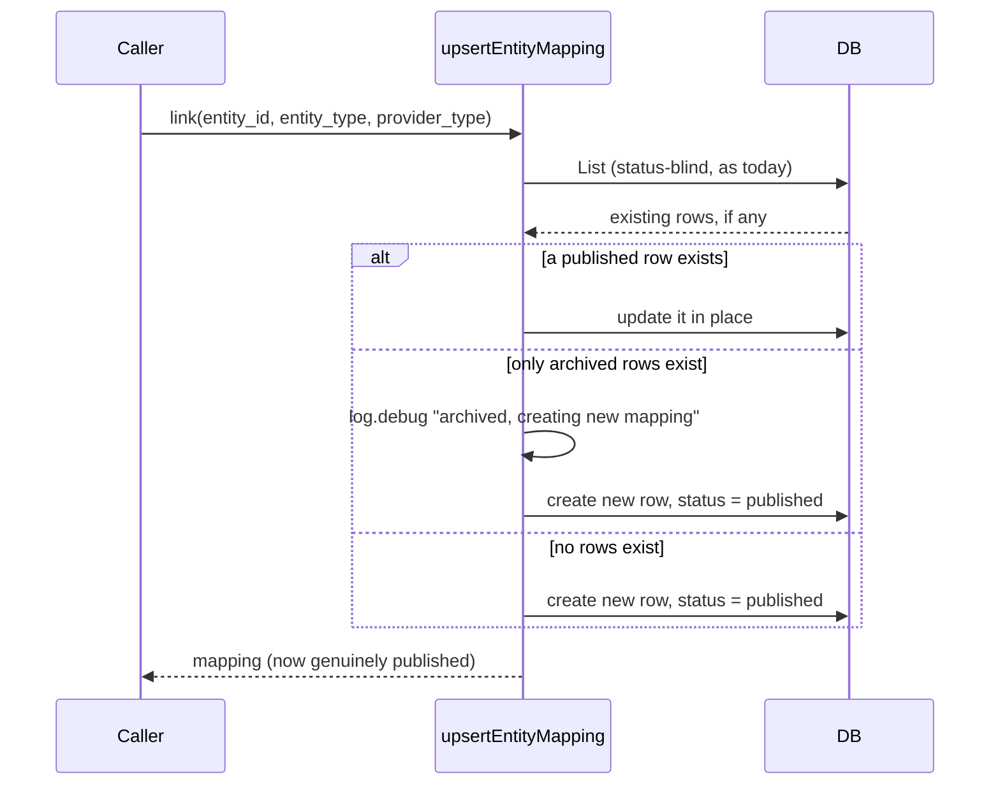
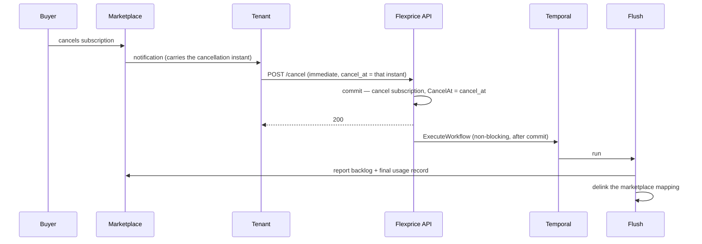
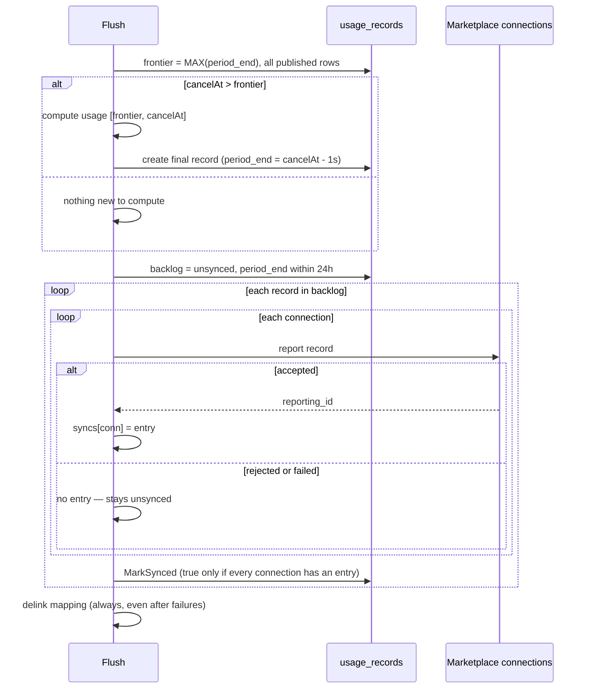
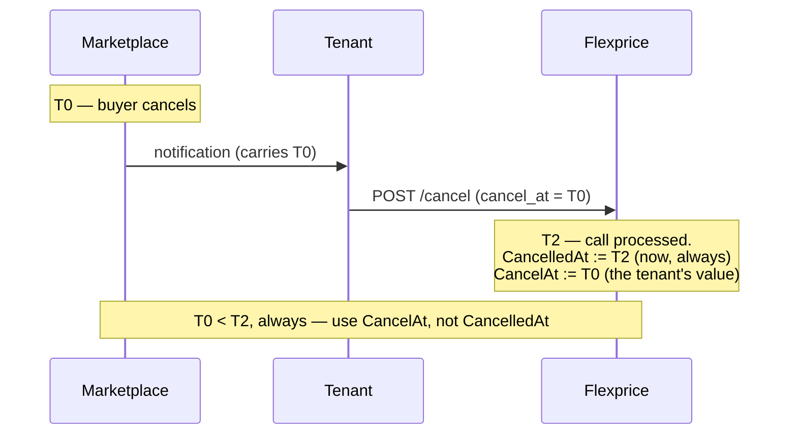

# Marketplace Integration — Cancellation Flush & Entity Mapping Lifecycle

Ticket: FLE-1106
Author: Tsage
Status: design, pending approval
Scope: two lifecycle defects and the final-usage flush that closes them. Applies to all three
marketplaces (AWS, GCP, Azure) and, for the mapping defect, to every integration provider.

This builds on
[2026-07-23-FLE-1071-marketplace-integration-v3.md](2026-07-23-FLE-1071-marketplace-integration-v3.md).
Everything in v3 stands except where §6 below marks it superseded.

---

## 1. What this changes

Two defects, one new mechanism.

| # | Problem | Fix |
| --- | --- | --- |
| 1 | Re-linking an entity after unlinking silently leaves the mapping `archived`. The API returns 200 but no active mapping exists. | Treat an archived row as absent: create a new published row instead of updating it (§2). |
| 2 | Cancelling a subscription leaves its marketplace mapping `published`, and the final active-period usage is never reported inside the marketplaces' post-cancellation windows. | A one-shot flush on cancellation: report the backlog, compute and report the final window, then archive the subscription mapping (§3). |

The driver for #2 is timing. v3 §10 assumed the tenant could wait for the 6-hour snapshot cron's
4–10h lag to catch the last window before archiving. Both AWS and GCP give roughly **one hour** after
cancellation, so that assumption loses the final usage of every cancelled marketplace subscription
(§4).

---

## 2. Defect 1 — re-link after unlink

### 2.1 What happens today

`DelinkIntegrationMapping`
([entityintegrationmapping.go:271-314](../../internal/ee/service/entityintegrationmapping.go))
soft-deletes: it flips `status` to `archived` via `Delete`
([repository/ent/entityintegrationmapping.go:310-356](../../internal/repository/ent/entityintegrationmapping.go)).
The row stays, and its unique-index columns are untouched. That part is correct.

The defect is in `upsertEntityMapping`
([entityintegrationmapping.go:316-366](../../internal/ee/service/entityintegrationmapping.go)). It
looks up existing mappings with `types.NewNoLimitQueryFilter()`, which leaves `Status` nil, so
`GetStatus()` returns `""` and `ApplyStatusFilter` applies **no status predicate at all** — archived
rows match. When the only existing row is the archived one, the service updates its
`ProviderEntityID`, `Metadata` and timestamps, then returns:

```go
if len(existing) > 0 {
    mapping := existing[0]
    mapping.ProviderEntityID = req.ProviderEntityID
    mapping.Metadata = metadata
    mapping.UpdatedAt = time.Now().UTC()
    mapping.UpdatedBy = types.GetUserID(ctx)
    if err := s.EntityIntegrationMappingRepo.Update(ctx, mapping); err != nil { ... }
    return mapping, nil          // status is never reset to published
}
```

`Update` writes whatever status the caller passed, so the row goes back to Postgres still
`status = 'archived'`. The caller gets a 200 and a mapping object, but no active mapping exists.

The marketplace path is **not** affected: `RegisterAgreement` / `createMappingIfAbsent`
([marketplace.go:198-240](../../internal/ee/service/marketplace.go)) queries with
`NewNoLimitPublishedQueryFilter()`, so an archived row is invisible to it and a re-link creates a
fresh published row correctly.

### 2.2 The fix

Branch on the found row's status:

```text
existing = List(entity_id, entity_type, provider_type)     # status-blind, as today

if a PUBLISHED row exists:
    update it in place                                      # unchanged behaviour
else if only ARCHIVED rows exist:
    log.debug("entity mapping is archived, creating new mapping", entity_id, entity_type, provider_type)
    create a NEW row with a new id and status = published    # never touch the archived row
else:
    create as today
```

The archived row is left exactly as it was.



### 2.3 Why no `expired_at` / `terminated_at` column

Considered and rejected. Reusing an archived row and flipping it back to `published` would need a
separate timestamp to record when it had been archived — but that timestamp would then be overwritten
on the next unlink, so it could not carry history anyway.

Creating a new row makes the column unnecessary:

- the archived row's own `updated_at` is when it was archived (set by `Delete`),
- the new row's `created_at` is when it was re-linked,
- the full link/unlink history is the ordered sequence of rows.

The unique index already permits this. It is **partial** —
`Unique().Annotations(entsql.IndexWhere("((status)::text = 'published'::text)"))`
([ent/schema/entityintegrationmapping.go:71-74](../../ent/schema/entityintegrationmapping.go)) — so
any number of archived rows can coexist with one published row for the same
`(tenant, environment, entity_type, entity_id, provider_type)`. No schema change.

### 2.4 Test gap

`TestLinkIntegrationMapping_UpsertExistingMapping`
([entityintegrationmapping_test.go:279-315](../../internal/ee/service/entityintegrationmapping_test.go))
only covers link → link on a still-published row. Nothing exercises delink → re-link, which is why
this shipped unnoticed. A regression test for that path is part of this work.

---

## 3. Defect 2 — the cancellation flush

### 3.1 Trigger

`CancelSubscription` ([subscription.go:1931](../../internal/ee/service/subscription.go)) stays fast
and is not restructured. After its existing `WithTx` (2035-2146) commits — alongside the existing
`publishCancellationEvents` call (2155-2157) — it starts the flush workflow with `ExecuteWorkflow`
(non-blocking; the blocking variant is `ExecuteWorkflowSync`,
[temporal/service/interface.go:18,40,46](../../internal/temporal/service/interface.go)).

This matches the convention already in the codebase: `CreateSubscription` starts its HubSpot sync
workflows after its transaction returns ([subscription.go:532-568, 851-877](../../internal/ee/service/subscription.go)),
and `CreateCustomer` does the same for onboarding ([customer.go:87-99](../../internal/ee/service/customer.go)).
No workflow is started inside a `WithTx` anywhere in `internal/ee/service`, for the obvious reason
that a rollback would leave an orphaned workflow running against rows that were never written.

**This is not a cron.** It is one workflow execution per cancellation. The snapshot (6h) and report
(3h) crons are unchanged and keep running for live subscriptions.



### 3.2 Sequence

```text
FlushSubscriptionUsage(subscriptionID, cancelAt):     # cancelAt = sub.CancelAt, NOT sub.CancelledAt — see §3.8

1. subMappings = published subscription mappings for [aws, gcp, azure]
   if none: return                                    # not a marketplace subscription

   connections   = resolve each mapping's connection
   preparedConns = [prepareConnection(c) for c in connections]      # report_activities.go:301, reused

2. frontier = MAX(period_end) over ALL published usage_records for this subscription
   if none:  frontier = subscription mapping's created_at           # §3.4

3. if cancelAt > frontier:                                          # §3.5
       usage      = GetMeterUsageBySubscription(subscriptionID, frontier, cancelAt)   # true window — full amount
       amount     = CalculateMeterUsageCharges(...)
       reportedAt = cancelAt - 1 second                             # §3.8 — reported timestamp only
       Create(UsageRecord{period_start: frontier, period_end: reportedAt, synced: false, ...})
       # ErrAlreadyExists is success — same idempotency rule as snapshot_activities.go:272

4. backlog = List(subscription_id, synced=false, period_end >= now-24h, sort period_end asc)
   for rec in backlog:                                 # includes the row just created
       for conn in preparedConns:                      # one API call per record per connection
           entry, ok = reportAWS/GCP/AzureRecord(rec, conn)          # reused unchanged, sends rec.PeriodEnd
           if ok: rec.Syncs[conn.ID] = entry
       MarkSynced(rec.ID, rec.Syncs, allConnectionsPresent)

   if any record failed to report:
       return error                                    # Temporal retries; syncs map makes it idempotent

5. for mapping in subMappings:                         # ALWAYS runs, even after exhausted retries
       DelinkIntegrationMapping(subscriptionID, subscription, mapping.ProviderType)
```

Customer and plan mappings are **not** archived. Only the subscription's marketplace mappings are.



Note step 3's `reportedAt`: the usage **amount** is computed over the true window `[frontier, cancelAt]` —
nothing is under-billed. Only the persisted `period_end` (and therefore the timestamp every provider
receives, since `reportAWSRecord`/`reportGCPRecord`/`reportAzureRecord` all send `rec.PeriodEnd`
unchanged) is backed off by one second. See §3.8 for why.

### 3.3 Why `frontier` spans all rows, not just unsynced ones

Taking the max over unsynced rows alone can double-bill. If record A `[T-10h, T-4h]` failed to sync
but record B `[T-4h, T+2h]` succeeded, the max over unsynced rows is `T-4h`, and the flush window
`[T-4h, cancelAt]` re-reports everything B already covered.

The max over **all published rows** is `T+2h`, giving `[T+2h, cancelAt]`. Since the snapshot
cron's windows are contiguous (`period_start = scheduledTime−10h`, `period_end = scheduledTime−4h`,
every 6h), the frontier has no holes behind it: every span before it belongs to some row, and those
rows are exactly what step 4 reports.

### 3.4 Fallback when no usage record exists

A subscription can be linked and cancelled without the snapshot cron ever having run for it. Then
`frontier` is undefined and the flush uses the **subscription mapping's `created_at`**.

That is the moment the subscription became reportable to that marketplace; nothing before it could
ever have been owed there. Note the consequence: if the subscription's billing period started before
it was linked, that earlier usage is deliberately excluded from the flush. That is intended, not an
oversight.

### 3.5 Boundary semantics

`period_start` is **inclusive**, `period_end` **exclusive** — inherited from the ClickHouse query
builder, which emits `timestamp >= ?` and `timestamp < ?`
([meter_usage_query_builder.go:166-173](../../internal/repository/clickhouse/meter_usage_query_builder.go)).

Chaining `period_start = previous period_end` therefore counts a boundary event exactly once: the
previous window excluded it, this one includes it. Making `period_start` exclusive would **skip** any
event landing precisely on the boundary. Keep it inclusive.

Step 3 is guarded on `cancelAt > frontier` because a backdated cancellation would otherwise
produce an inverted window. When the guard fails, the backlog flush is the whole job.

### 3.6 Failure handling

A report failure inside the flush returns an error from the activity so Temporal retries it. Retries
are naturally idempotent: `if _, done := rec.Syncs[conn.ID]; done { continue }`
([report_activities.go:239](../../internal/temporal/activities/marketplace/report_activities.go))
means only the connections that actually failed are re-attempted.

When retries are exhausted:

- the failed records keep `synced = false` and gain no `syncs` entry — they are not marked skipped
  and nothing is resolved silently,
- an `error` line is logged carrying every non-secret identifier available: `subscription_id`,
  `customer_id`, `usage_record_id`, `connection_id`, `marketplace`, `period_start`, `period_end`,
  `amount`, and the provider-side identifier (`license_arn`, `consumer_id`/entitlement id, or
  `resource_id`), plus the provider's own error text,
- credentials are never logged, at any level: no `client_secret` or bearer token (Azure), no
  `role_arn`, `external_id` or assumed-role credentials (AWS), no WIF JSON or federated token (GCP).
  Provider errors go through `utils.RedactSecrets` first, exactly as v3 §8.4 requires,
- the delink in step 5 **still runs**. The subscription is cancelled; leaving its mapping published
  would be stale state. The trade-off is accepted deliberately: once archived, the 3h report cron
  cannot retry those rows, because `isRelevantForSubscription` resolves through published mappings
  only ([report_activities.go:86-96, 231-233](../../internal/temporal/activities/marketplace/report_activities.go)).
  At that point the failure is a tenant-side credential or configuration problem, and the logged
  error is the signal to act on.

### 3.7 No skip entries

An earlier draft resolved leftover rows with `{skipped: true, skip_reason: "subscription_flushed"}`.
Dropped. The 24h bound in §5.2 already stops expired rows being re-scanned forever, and marking them
`synced = true, skipped = true` would make a subscription whose connection was broken for days look
cleanly resolved when in fact revenue was lost. `synced = false` on an old row is the more honest
signal and preserves the diagnostic trail.

The existing Azure zero-amount skip (`zero_amount_not_supported`, v3 §11.6) is unaffected.

### 3.8 Sourcing the cancellation timestamp — `CancelAt`, not `CancelledAt`

This closes what was an open risk in an earlier draft of this document: GCP requires the reported
timestamp to be strictly *before* its own recorded cancellation instant, and Flexprice's own
`cancelled_at` can never satisfy that, because it is set by definition *after* the marketplace's own
cancellation already happened — buyer cancels at the marketplace, the marketplace notifies the tenant,
the tenant then calls Flexprice, and only at that point does Flexprice record anything. No amount of
speed on our side closes that gap; it's a causal ordering, not a latency problem.



The fix doesn't need a buffer or a guess, because the API already carries the right value if the
tenant is asked to supply it. `CancelSubscriptionRequest` already accepts `cancel_at` for a backdated
immediate cancellation: *"For 'immediate', accepts past/current dates only... backdated
cancellation"* ([dto/subscription.go:655-659](../../internal/api/dto/subscription.go)), validated to
reject only a future date ([dto/subscription.go:737-743](../../internal/api/dto/subscription.go)) and
to require it fall after the current period start
([subscription.go:1982-1991](../../internal/ee/service/subscription.go)) — no upper bound on how far
in the past it can be. **The tenant contract for a marketplace-linked subscription is: call `/cancel`
with `cancellation_type: "immediate"` and `cancel_at` set to the marketplace's own cancellation
instant** (from the same webhook/notification that told the tenant to call us in the first place).

The field this lands in matters, and it is easy to get wrong. Traced through
`updateSubscriptionForCancellation` ([subscription.go:6100-6121](../../internal/ee/service/subscription.go)):

```go
now := time.Now().UTC()
subscription.CancelledAt = &now                    // ALWAYS wall-clock now — never the tenant's cancel_at

switch cancellationType {
case types.CancellationTypeImmediate:
    subscription.CancelAt = &effectiveDate          // ← the tenant's backdated cancel_at lands HERE
    subscription.EndDate = &effectiveDate           // ← and here
```

`CancelledAt` is unconditional — the comment above it says plainly *"cancelled_at is the time of the
subscription cancellation [call]"*. `determineEffectiveDate`
([subscription.go:5994-5998](../../internal/ee/service/subscription.go)) confirms a backdated
`customDate` is returned unmodified for the immediate case. So the flush must read **`sub.CancelAt`**
(equivalently `sub.EndDate` for the immediate path) — reading `sub.CancelledAt` here would silently
reintroduce the exact causal-ordering problem this section exists to close. Verified against a real
row: a subscription cancelled via `scheduled_date` showed `cancelled_at` at the API-call instant while
`cancel_at`/`end_date` carried the requested effective date, several hours later — confirming the two
fields diverge in practice, not just in the code path being read here.

With the tenant supplying the marketplace's own instant, `cancelAt - 1 second` (§3.2 step 3) is now a
minimal, deterministic correction against the *real* comparison GCP makes — not an arbitrary safety
margin against a value we could only estimate. One second costs nothing material and is not
provider-specific: it satisfies GCP's strict `<` requirement, and does not conflict with Azure (whose
own worked example already accepts landing exactly *at* the instant) or AWS (no such comparison exists
at all).

---

## 4. What the marketplaces actually allow after cancellation

All three reject usage for an inactive subscription; each does it differently, and two have a
post-cancellation window far shorter than their general staleness limit.

| | General staleness window | Post-cancellation window | Rejection for an inactive subscription |
| --- | --- | --- | --- |
| **AWS** | 24h, plus a month-end cutoff at 06:00 UTC on the 1st for the prior month | **~1 hour** from `License Deprovisioned` / `unsubscribe-pending` | `Status: CustomerNotSubscribed` |
| **GCP** | no hard cutoff published; guidance is **within 1 hour** of the usage occurring, with a ≤30-day outage provision (re-timestamped, not backdated) | **1 hour**, and the timestamp must be *before* the cancellation | `reportErrors` `NOT_FOUND` — *inferred, not doc-confirmed* |
| **Azure** | 24h from `effectiveStartTime` | none stated separately; the 24h rule governs | `ResourceNotActive` (batch) / 400 "SaaS subscription isn't in Subscribed status" (single) |

Sources:

- AWS — [Managing SaaS subscription events with Amazon EventBridge](https://docs.aws.amazon.com/marketplace/latest/userguide/saas-eventbridge-integration.html#saas-eventbridge-final-usage):
  "this event marks the start of a 1-hour final reporting window… After this window closes, customer
  entitlements are fully revoked and usage reporting is no longer accepted."
  [BatchMeterUsage](https://docs.aws.amazon.com/marketplace/latest/APIReference/API_marketplace-metering_BatchMeterUsage.html)
  for the 24h + month-end rule;
  [UsageRecordResult](https://docs.aws.amazon.com/marketplace/latest/APIReference/API_marketplace-metering_UsageRecordResult.html)
  for `CustomerNotSubscribed`.
- GCP — [Best practices for usage reporting](https://docs.cloud.google.com/marketplace/docs/partners/integrated-saas/best-practices-reporting#report_usage_after_an_entitlement_is_canceled):
  "If you have unreported usage after an entitlement is canceled, you can still report it with a
  timestamp that reflects the actual time when the usage was generated. Report this usage within one
  hour. Do not report any usage as new usage after the entitlement ends."
- Azure — [Metering service APIs](https://learn.microsoft.com/en-us/partner-center/marketplace-offers/marketplace-metering-service-apis)
  for the 24h rule and the `ResourceNotActive` / 400 statuses;
  [Metering service APIs FAQ — "What happens when you emit usage for a SaaS subscription that's already unsubscribed?"](https://learn.microsoft.com/en-us/partner-center/marketplace-offers/marketplace-metering-service-apis-faq#what-happens-when-you-emit-usage-for-a-saas-subscription-that-s-already-unsubscribed-)
  for the post-cancellation exception: "Usage can be emitted only for subscriptions in the Subscribed
  status (and not for subscriptions in `PendingFulfillmentStart`, `Suspended`, or `Unsubscribed`
  status). The only exception is reporting usage for the time that was before the SaaS subscription
  is canceled. For example, the customer canceled the SaaS subscription today at 3 pm. Now is 5 pm,
  the publisher can still emit usage for the period between 6 pm yesterday and 3 pm today."
- Azure cancellation flow — [SaaS subscription life cycle](https://learn.microsoft.com/en-us/partner-center/marketplace-offers/pc-saas-fulfillment-life-cycle),
  [Implementing a webhook](https://learn.microsoft.com/en-us/partner-center/marketplace-offers/pc-saas-fulfillment-webhook)
  (the `Unsubscribe` action is notify-only: "There's no send to ACK for this event").

### 4.1 Why the marketplace cannot tell us what we already reported

Considered as a way to derive the flush window from the provider rather than our own table. Only one
of three supports it, so `usage_records` stays the source of truth for all three:

- **Azure** — yes: `GET /api/usageEvents?api-version=2018-08-31&usageStartDate=<date>` returns prior
  submissions with `usageDate` and `reconStatus`.
- **AWS** — no. The metering API is `MeterUsage` / `BatchMeterUsage` / `RegisterUsage` /
  `ResolveCustomer`. AWS's own guidance for auditing past submissions is CloudTrail, which is the
  tenant's audit log, not a seller-queryable metering API.
- **GCP** — no. Service Control exposes only `check` and `report`.

---

## 5. Schema, repository and filter changes

### 5.1 No schema changes

Neither defect needs a migration. `entity_integration_mapping` keeps its partial unique index
(§2.3); `usage_records` is unchanged.

### 5.2 `ListUnsynced` gains a 24h bound

Today `ListUnsynced` ([repository/ent/usagerecord.go:127-154](../../internal/repository/ent/usagerecord.go))
returns every `synced = false` row for a tenant/environment, forever. Rows past the submission window
can never be accepted, so they are re-scanned by every run and never resolve.

Add `period_end >= now() - 24h`. Safe on all three providers: it is Azure's exact limit, it is AWS's
limit (whose month-end rule is a *deadline*, not an extension, so a flat 24h never over-includes),
and it is far more generous than GCP's hourly guidance.

This also removes the need for the skip entries discussed in §3.7 — an expired row is simply never
fetched again, while its `synced = false` state remains visible for diagnosis.

### 5.3 A generalized `UsageRecordFilter`

No `UsageRecordFilter` exists today; the repository exposes only `Create`, `ExistsForPeriod`,
`ListUnsynced` and `MarkSynced`. Rather than adding one bespoke method per query, add a filter type
following the shape of `EntityIntegrationMappingFilter`
([types/entityintegrationmapping.go:89-105](../../internal/types/entityintegrationmapping.go)):
embedded `*QueryFilter` and `*TimeRangeFilter`, `Filters []*FilterCondition`, `Sort []*SortCondition`,
plus entity-specific fields (`SubscriptionID`, `Synced`, …).

Both flush queries are then the same `List(ctx, filter)` call:

- `frontier` — `{subscription_id, status: published, sort: period_end desc, limit: 1}`
- `backlog` — `{subscription_id, synced: false, period_end >= now-24h, sort: period_end asc}`

`ListUnsynced` can fold into it later; it is not required by this change.

---

## 6. Corrections to v3

| v3 section | Status |
| --- | --- |
| §8.1 Snapshot cron | Still correct for live subscriptions. A cancelled subscription is now handled by the flush (§3), not by waiting for the next scheduled run. |
| §8.2 Reporting cron | Still correct. `ListUnsynced` gains the 24h bound (§5.2). |
| §10, "the tenant should archive only after the snapshot cron's 4–10h lag has had a chance to capture the final active-period usage" | **Superseded.** AWS and GCP allow roughly one hour after cancellation (§4); a 4–10h wait misses both windows. Cancellation now triggers the flush directly (§3). |
| §10 lifecycle table, `Suspend` row: "mapping stays published, reporting continues until `Unsubscribe`" | **Incorrect.** Azure documents that usage may be emitted only in `Subscribed` status — explicitly not `Suspended` (§4). Reporting for a suspended Azure subscription is rejected with `ResourceNotActive`. The row should read: reporting will be rejected while suspended; the mapping stays published because `Reinstate` is possible. |
| §2.5, "GCP submission window: not documented; assumed similar" | **Resolved, and the framing was wrong.** GCP documents its timing expectations clearly — "within one hour," stated for normal reporting, month-end, and post-cancellation alike (§7.1) — it simply does not publish a hard technical rejection cutoff the way AWS (`TimestampOutOfBoundsException`) and Azure (`Expired`) do. Checked directly against the raw text of all seven GCP references this ERD cites, plus the `manage-entitlements` and `providers.entitlements` API pages — no "24 hours" figure exists anywhere in GCP's marketplace documentation. |
| §12, "No terminal state / TTL for un-acceptable or expired rows" | **Partially addressed.** The 24h bound (§5.2) stops expired rows being re-scanned. A true terminal status is still not built. |
| §12, "Azure's late-submission rule is unconfirmed" | **Partially resolved.** Azure rejects on subscription status (`ResourceNotActive` / 400) independently of the 24h `effectiveStartTime` rule. Whether lateness is judged by submission time or `effectiveStartTime` is still unstated. |

---

## 7. Known gaps

Every gap listed in v3 §12 is restated here in full, each with what v4 does about it. Nothing is
dropped just because it was written down before.

Nothing below is an open risk to the launch. The one item that was — whether GCP rejects the final
report because our timestamp lands after its own cancellation instant — is resolved by sourcing the
timestamp correctly rather than guessing at a margin (§3.8). Everything else is either closed, an
accepted trade-off, or a follow-up enhancement.

### 7.1 Carried over from v3

**No "give up" marker on a record that can never be sent — _partly fixed; remainder is an enhancement, not a blocker_.**

Some usage records can never succeed, no matter how many times we try: the buyer's subscription
closed, or the record is simply older than the marketplace will accept. The problem is that a record
in that state looks exactly like a record that failed once and deserves another try — both just say
`synced = false`. Nothing in the row distinguishes "retry me" from "this is hopeless."

The consequence was that the reporting cron kept picking those hopeless records up on every run,
forever, and the pile only grew.

What v4 does: the reporting cron now only looks at records from the last 24 hours (§5.2). Anything
older is never fetched again, so hopeless records stop being retried and the query stops getting
slower over time. What v4 does **not** do is give those records a real "finished, expired" status —
they are still sitting there marked unsynced, we simply stop looking at them. Anyone reading the
table directly still has to work out for themselves that an old unsynced row is dead. A proper
terminal status remains future work.

**No dead-letter table — _closed, not needed_.**

v3 listed the absence of a dead-letter table as a gap: nowhere to answer "which records are failing,
and how often?" without grepping logs.

Closing this rather than carrying it forward. The failure logs now carry every identifier needed to
answer that question — subscription, customer, usage record, connection, marketplace, period, and the
provider's own error text (§3.6) — and they are queryable in SigNoz. A dead-letter table would be a
second copy of the same information in a second place to keep consistent. The original gap assumed
logs could only be grepped; that is no longer the case.

**GCP's timing rules are different in shape from AWS's and Azure's — _answered_.**

v3 recorded GCP's submission window as "not documented; assumed similar" to AWS's 24 hours. That
framing was wrong in both directions. GCP documents its timing expectations clearly; what it does
*not* publish is a hard rejection cutoff.

GCP's actual rules ([Best practices for usage reporting](https://docs.cloud.google.com/marketplace/docs/partners/integrated-saas/best-practices-reporting)):

- *"Service providers must report usage within one hour of the usage being generated."* — one hour,
  not 24.
- Month-end: report by 1 AM US Pacific the following day to land on that month's invoice.
- Post-cancellation: within one hour, with a timestamp before the cancellation.
- Extended outage: a grace period *"not exceeding 30 days"*, during which usage is collected in
  hourly windows and then, once service is restored, reported *"as actual usage with the time the
  data was collected"* — re-timestamped to the present, not backdated.

So AWS and Azure both enforce a hard 24-hour wall (`TimestampOutOfBoundsException` and `Expired`
respectively); GCP enforces no documented wall at all, but expects hourly reporting.

One consequence for §5.2: the 24-hour bound on `ListUnsynced` matches AWS's and Azure's limits
exactly, but for GCP it is simply a choice — it stops us retrying records GCP might still have
accepted. This is deliberate, to keep one uniform rule across all three providers rather than a
per-provider retention window.

**We don't know which clock Azure measures lateness by — _partly answered_.**

Azure won't accept usage older than 24 hours. What its docs never say is *which* 24 hours: measured
from when we send the request, or from the timestamp we put inside the request. In normal operation
this never matters, because our records are only 4–10 hours old when we send them. It would only
matter right at the edge — a subscription cancelled just as a record approaches the 24-hour mark.

v4 answers a neighbouring question but not this one. We confirmed Azure rejects usage for an inactive
subscription on *status* grounds, separately from any lateness rule (`ResourceNotActive`, or a 400
saying the subscription isn't in `Subscribed` status), and confirmed that usage for the period
*before* cancellation stays reportable (§4). The submission-time-versus-timestamp question is still
unanswered by any published doc.

**We send one record per API call instead of batching — _enhancement; not a problem for the flush_.**

All three marketplaces accept multiple records in a single call (AWS and Azure up to 25; GCP up to
1 MB). We send them one at a time, so a tenant with many buyers makes many more API calls than
strictly necessary.

v4 does not change this, and deliberately so — the reasons in v3 §12 still hold (AWS and GCP scope a
single call to one product, so batching would need records grouped by product first; and AWS's move
to per-record `LicenseArn` for Concurrent Agreements by June 2026 will remove that constraint anyway).

Worth noting explicitly for the flush specifically: this is not a throughput risk there. The 24-hour
bound means a backlog can hold at most four records (the snapshot cron runs every 6 hours), and a
subscription can be mapped to at most three marketplaces — so the flush makes at most about a dozen
API calls, comfortably inside its one-hour deadline.

### 7.2 New in v4

**GCP could reject the final report because our timestamp was a moment too late — _resolved, see §3.8_.**

GCP requires that any usage reported after a cancellation carries a timestamp from *before* the
cancellation happened. The risk was sourcing that timestamp from Flexprice's own `cancelled_at` —
which is causally always at or after the marketplace's own instant, since it's only ever set once the
tenant, having been notified by the marketplace, calls us — so it could never satisfy "before."

Closed by sourcing it correctly rather than padding for uncertainty: the tenant supplies the
marketplace's own cancellation instant via the existing backdated-immediate-cancellation `cancel_at`
field, the flush reads `sub.CancelAt` (not `sub.CancelledAt`, which is unconditionally wall-clock
processing time — §3.8 traces this exactly), and reports `cancelAt - 1 second`. This affects GCP alone
in practice — Azure's own documented example already accepts landing exactly at the cancellation
instant, and AWS makes no such comparison — but the fix is applied uniformly to all three rather than
branched per provider.

**Once the flush gives up, nothing tries again — _accepted trade-off_.**

Temporal retries the flush automatically, and those retries are safe to repeat. But when the retries
are finally exhausted, the flush archives the subscription's mapping anyway (§3.6). From that moment
the ordinary reporting cron cannot pick those records up, because it only considers subscriptions
with a published mapping — even if hours of the marketplace's window were still left.

This is a deliberate choice: a cancelled subscription should not keep a live-looking mapping. By the
time retries are exhausted the cause is almost always a tenant-side credentials or configuration
problem, and the error log is the signal for someone to act on.

**A connection broken for more than a day permanently loses that usage — _inherent to the providers_.**

Say a subscription is linked to both AWS and Azure. AWS has been reporting fine for weeks, but the
Azure connection's client secret expired ten days ago, so every Azure report has failed since.

When the buyer cancels, the flush catches Azure up — but only for the last 24 hours of records. Ten
days of Azure usage sits in `usage_records`, correctly computed, and can never be sent: AWS and Azure
both reject any record whose timestamp is more than 24 hours old, so re-sending them is not an option
we can build our way around.

To be clear about what does *not* go wrong here: AWS is not double-reported. The final window starts
from the newest record's `period_end` regardless of who has synced it, so it covers only genuinely
new time, and the backlog step skips any connection that already has an entry for a record. The loss
is one-sided — the broken connection misses out, the healthy one is unaffected.

The mitigation, if this revenue matters, is the one both Azure and GCP describe in their own docs:
roll the expired quantity into a current-timestamped event instead of trying to backdate it. Neither
provider lets you preserve the original timestamps, and Microsoft warns it weakens the customer's
billing audit trail, so this is a deliberate choice to make case by case — not something to automate
here.

The real defence is not losing ten days in the first place: a broken connection should be alerted on
from the `error` logs (§3.6) long before a cancellation exposes it.

---

## 8. Reference

Everything in v3 §13 still applies. Added here:

**AWS**
- [Managing SaaS subscription events with Amazon EventBridge](https://docs.aws.amazon.com/marketplace/latest/userguide/saas-eventbridge-integration.html#saas-eventbridge-final-usage) — the 1-hour final reporting window
- [Amazon SNS notifications for SaaS products](https://docs.aws.amazon.com/marketplace/latest/userguide/saas-notification.html) — `unsubscribe-pending` / `unsubscribe-success`
- [UsageRecordResult](https://docs.aws.amazon.com/marketplace/latest/APIReference/API_marketplace-metering_UsageRecordResult.html) — `CustomerNotSubscribed`

**GCP**
- [Best practices for usage reporting](https://docs.cloud.google.com/marketplace/docs/partners/integrated-saas/best-practices-reporting#report_usage_after_an_entitlement_is_canceled) — the 1-hour post-cancellation rule

**Azure**
- [Metering service APIs FAQ — emitting usage for an already-unsubscribed SaaS subscription](https://learn.microsoft.com/en-us/partner-center/marketplace-offers/marketplace-metering-service-apis-faq#what-happens-when-you-emit-usage-for-a-saas-subscription-that-s-already-unsubscribed-) — status eligibility and the post-cancellation exception
- [Metering service APIs FAQ — maximum delay between event and emission](https://learn.microsoft.com/en-us/partner-center/marketplace-offers/marketplace-metering-service-apis-faq) — the general 24h rule
- [Managing the SaaS subscription life cycle](https://learn.microsoft.com/en-us/partner-center/marketplace-offers/pc-saas-fulfillment-life-cycle) — `Unsubscribed` state
- [Implementing a webhook on the SaaS service](https://learn.microsoft.com/en-us/partner-center/marketplace-offers/pc-saas-fulfillment-webhook) — `Unsubscribe` is notify-only
