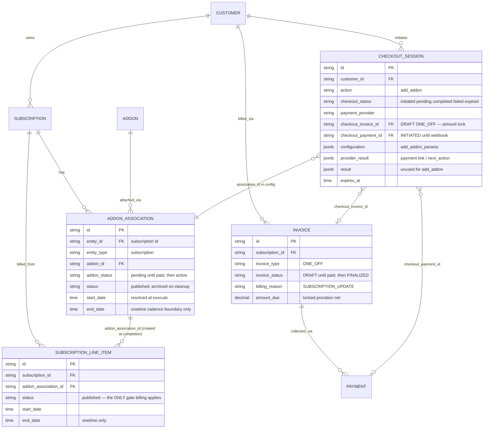

# Payment-Gated Addon Attach — Design ERD

Status: **Implemented (backend)** — pay-first addon attach live; swagger regen pending
Date: 2026-08-06
Related: [Payment-gated quantity change](2026-07-17-payment-gated-quantity-change.md), [Payment-gated wallet top-up](2026-07-20-payment-gated-wallet-topup.md), [Proration charge invoice idempotency](2026-07-22-proration-charge-invoice-idempotency.md), [Credit grants in addons](credit-grants-in-addons.md)

---

## 1. Problem Statement

`POST /subscriptions/addon` attaches an addon **immediately** and only then raises a one-off proration invoice, whose failure is deliberately swallowed — the addon is live and `UNBILLED` for the period. That pay-later model suits B2B invoice customers.

For B2B2C, an addon that produces a charge must take effect **only after payment succeeds**.

**Goal:** an opt-in `checkout` object on `POST /subscriptions/addon`. When the attach produces a net charge, nothing takes effect until the customer pays; when it produces no charge, the addon attaches immediately and the checkout is ignored. Zero behaviour change when `checkout` is omitted.

This is the **third** application of the recipe established by quantity change and wallet top-up, following §8 of the quantity-change doc: a new checkout action and a new params blob rather than overloading `line_item_modifications`.

---

## 2. Approach

### 2.1 API surface (backward compatible)

- `POST /subscriptions/addon` — unchanged when `checkout` is omitted; the pay-later path does no extra work.
- `checkout` is on the **outer** `AddAddonRequest` only. `AddAddonToSubscriptionRequest` is embedded in `CreateSubscriptionRequest.Addons`, which must not gain a checkout of its own.
- The response embeds the association as a **pointer**, so `encoding/json` omits it entirely when nil and the pay-later body stays byte-identical to the flat shape this endpoint returned before.

### 2.2 Branching

| Condition | Path | Result |
| --- | --- | --- |
| `checkout` omitted | Pay-later (unchanged) | Addon live; proration invoice raised, failure swallowed |
| `checkout` + net charge > 0 | **Pay-first** | `pending` association only; DRAFT invoice; checkout session |
| `checkout` + net ≤ 0 | Immediate | Addon live; `checkout_session: null`; zero sessions created |

Three routes reach net ≤ 0, and all of them attach immediately because **the pay-later path would raise no charge either**:

1. **Usage / metered addon prices** — proration skips `PRICE_TYPE_USAGE`; future consumption is unknown at change time. The charge lands on the next regular arrear invoice.
2. **`proration_behavior: none`** — the calculator short-circuits before computing.
3. **`proration_behavior` unset** — see 2.4.

### 2.3 Why a pending association, and not "persist nothing"

- **Associations are already pending-safe.** Billing, invoicing, meter-usage and every Temporal activity read `addon_associations` **zero times**. Entitlement resolution and the public associations list both filter `addon_status = 'active'`. A pending association is billing-invisible by construction.
- **Line items are not safe to pre-create.** Billing's only gate is `status = 'published'`: it lists line items, overwrites `sub.LineItems`, and feeds every invoice, preview and recalculation. `ClassifyLineItems` buckets purely on price type / cadence / dates — it has no knowledge of `addon_association_id` or addon status. A published addon line item on an active subscription **is billed at the next rollover**, including by the unattended daily draft-recompute cron.

Net effect: the association carries the identity, the line items stay unborn. The persisted config is four scalar fields per addon — no `json.RawMessage`, no DTO structs mirrored into `types`, no import cycle.

### 2.4 The `Compute` / `Apply` gate asymmetry

`LineItemProrationService.Compute` calculates; `Apply` calculates **and settles**. Their gates are not the same, which is load-bearing:

| `proration_behavior` | `Apply` | `Compute` |
| --- | --- | --- |
| `create_prorations` | settles | computes |
| `none` | no-op (own gate) | nil via the calculator |
| **unset (`""`)** | **no-op** | **computes a real charge** |

`Apply` short-circuits on anything ≠ `create_prorations`; `Compute` has no gate of its own. So `calculateAddonProration` replicates `Apply`'s gate as its first statement — otherwise an unset behaviour would quote a charge at checkout that pay-later would never raise.

### 2.5 Plan / calculate / persist

The attach is split so both branches consume **one** resolution, mirroring `buildQuantityChangeRequest → calculateProration → settle*`:

```text
createAddonAttachParams  → resolves validations, prices, association, line items. Writes nothing.
calculateAddonProration  → prices those exact line items.
persistAddonAttach       → writes association + line items + bucket prices + credit grants. Raises no charge.
settleAddonAttachPayLater→ raises the proration charge.
```

Pay-first calls the first two, then persists **only** the pending association. Completion re-runs `createAddonAttachParams` and calls `persistAddonAttach`. There is no skip-flag: the mutation and the settlement are separate functions, so the completion path simply never calls the settlement — exactly how `completeModifySubscriptionCheckout` calls `applyQuantityChange` and never `settlePayLater`.

### 2.6 Effective date

`createLineItemFromPrice` clamps each line item's start to `max(requestedStart, sub.StartDate, price.StartDate)`. The charge is therefore priced from `addonProrationEffectiveDate` — the latest line-item start — not from the requested start. Preview and pay-later share that helper, so they cannot diverge.

**Known limitation:** the effective date is a single value collapsed with `max`. When addon prices carry differing `price.StartDate`s, the earliest-starting line item is under-charged. This is **pre-existing** pay-later behaviour, preserved deliberately so the quoted amount matches what pay-later would bill. Fixing it means grouping entries by start date and computing per group, in both paths at once — a separate change.

### 2.7 Checkout-path restrictions (v1)

| Restriction | Reason |
| --- | --- |
| `override_line_items` must be empty | `ProcessSubscriptionPriceOverrides` persists real price rows and rewrites `lineItem.PriceID`. Pricing a draft from a price row that does not exist yet needs a second pricing implementation kept bit-identical to the first, including CUSTOM price-unit conversion — an over/under-charge risk. |
| `line_item_commitments` must be empty | **Scope, not correctness.** Commitments never reach the proration params, so the amount would be identical. Replaying them means carrying a `dto` struct inside `types`, which is an import cycle. Lift-able without an API break. |
| Subscription must be `active` (not `draft`) | Kills the interaction with `ActivateDraftSubscription → shiftAddonLineItemDates`, which filters `addon_status = active` and would leave a pending association anchored to pre-activation dates. A draft subscription's own gating is the `create_subscription` checkout flow. |

Enforced in `AddAddonRequest.Validate` at the API boundary **and** in the service, which is the layer that genuinely cannot honour them.

### 2.8 Concurrent guard

`getAnyPendingAddonCheckoutSession` matches `[modify_subscription, add_addon]` for the subscription, statuses `initiated|pending`, and runs **before any write**. Both payment-gated subscription flows now mutually exclude — either can invalidate the amount the other locked on its draft.

This requires the configuration filter to **OR** two JSON paths, since a subscription id lives under `modify_subscription_params` for quantity change and under `add_addon_params` here. Implementing it as a second ANDed predicate would demand one session carry both blobs and would match nothing, silently blinding the guard.

### 2.9 Pending-state guards

| Site | Change |
| --- | --- |
| `RemoveAddonFromSubscription` | Rejects pending — it reads via `GetByID`, which applies no status filter. Checked **before** the EndDate guard, because a pending onetime association already carries the cadence boundary as its EndDate and would otherwise report the wrong reason. |
| `cancelAddonsForSubscription` | Cancels pending alongside active, or they outlive the subscription. The skip-if-EndDate branch is exempted for pending, for the same cadence-boundary reason. |
| `validateEntitlementCompatibility` | Folds pending addons' metered reset periods into the conflict check via a compatibility-only read. Without it, a **pay-later** add — which never hits the concurrent guard — passes its own check, and completing the outstanding checkout leaves two conflicting reset periods live on one feature. |
| `shiftAddonLineItemDates` | No change; documented. The checkout path forbids draft subscriptions, so a pending association can never reach it. |

---

## 3. ERD



**The invariant this rests on:** `ADDON_ASSOCIATION` exists at execute time; `SUBSCRIPTION_LINE_ITEM` does not. Billing traverses only the latter.

---

## 4. Configuration JSON (v1)

### 4.1 `configuration.add_addon_params`

```json
{
  "add_addon_params": {
    "subscription_id": "subs_01J...",
    "addons": [
      {
        "association_id": "addon_assoc_01J...",
        "addon_id": "addon_01J...",
        "cadence": "recurring",
        "proration_behavior": "create_prorations",
        "start_date": "2026-08-06T09:14:00Z"
      }
    ]
  }
}
```

| Field | Why it is stored |
| --- | --- |
| `association_id` | The pending row. Its `addon_status` is the replay fingerprint. |
| `addon_id` | Rebuilds the attach request. |
| `cadence` | Stored explicitly, **not** inferred from `end_date` — removal and cancellation also write `end_date`, so the inference is ambiguous. |
| `proration_behavior` | Not for the charge (locked on the draft) but for `addonCreditGrantProration`, which needs it to prorate the addon's first credit grant identically to pay-later. |
| `start_date` | **Resolved at execute, never null.** Replaying with null would default to `time.Now()` and rebuild line items for a different day than the draft was priced for. |

List-shaped so batching is additive; the attach endpoint is single-addon today, and completion loops the list. An empty list is rejected — it would complete silently, finalizing the invoice while nothing attaches.

The blob is deliberately denormalized rather than a pointer to the association row, matching `ModifySubscriptionParams` and `WalletTopupParams`: a payment record should be self-describing, and completion-time validation stays a pure DTO check with no DB access.

---

## 5. Attach response

Pay-later / zero-net — byte-identical to the pre-checkout shape:

```json
{ "id": "addon_assoc_01J...", "addon_id": "addon_01J...", "addon_status": "active", "...": "..." }
```

Pay-first:

```json
{
  "id": "addon_assoc_01J...",
  "addon_status": "pending",
  "checkout_session": {
    "id": "cs_01J...",
    "checkout_status": "pending",
    "payment_action": { "type": "payment_link", "url": "https://rzp.io/i/..." }
  },
  "invoice": { "id": "inv_01J...", "invoice_status": "DRAFT", "amount_due": "25.81" }
}
```

---

## 6. Status mapping

| Phase | Checkout | Association | Line items | Invoice | Payment | Credit grants |
| --- | --- | --- | --- | --- | --- | --- |
| After pay-first execute | `pending` | `pending` | **none** | `DRAFT` | `INITIATED` | none |
| After webhook success | `completed` | `active` | created | `FINALIZED` + paid | `SUCCEEDED` | materialized |
| Fail / expire / cancel | `failed` / `expired` | archived | none | archived | archived | none |
| Completion errors after payment | `pending` | stays `pending` | none | `FINALIZED` | `SUCCEEDED` | none |

The last row is the paid-but-unactivated state — clean and resumable, but see §9.

---

## 7. Scenarios

| # | Scenario | Handling |
| --- | --- | --- |
| 1 | Attach without `checkout` | Existing pay-later; addon live, proration invoice raised |
| 2 | `checkout` + net charge | Pending association + DRAFT + session; no line items, no grants, wallet untouched |
| 3 | `checkout` + usage-only prices | Net 0 → attach immediately, `checkout_session: null` |
| 4 | `checkout` + `proration_behavior` none or unset | Net 0 → attach immediately |
| 5 | `checkout` + `override_line_items` / `line_item_commitments` | Validation error; nothing persisted |
| 6 | `checkout` + draft subscription | Validation error; pay-later attach to a draft still works |
| 7 | Second payment-gated change while a session is pending | Rejected `ErrAlreadyExists`, before any write |
| 8 | Payment succeeds | Association → active, line items + grants created, same draft finalized, **no second charge** |
| 9 | Duplicate webhook | Association status is the fingerprint; second call is a no-op |
| 10 | Subscription cancelled mid-checkout | Completion errors; association stays `pending`, invoice stays `DRAFT` |
| 11 | Period rolls over mid-checkout (onetime cadence) | `addonPeriodEndForStartDate` walks forward only and errors — no silent re-anchoring |
| 12 | Session create fails after the draft exists | Draft archived by `StartPayFirstCheckoutSession`; pending association archived by the attach path |
| 13 | Session expires / cron cleanup | Payment + invoice + pending association archived; subscription untouched |
| 14 | Session completed, then late expiry | Cleanup guards on `addon_status == pending`; a live addon is left alone |
| 15 | `DELETE /subscriptions/addon` on a pending association | Rejected — settle the checkout instead |
| 16 | Subscription cancelled while a checkout is outstanding | Pending association cancelled alongside |

---

## 8. Evolvability notes

The recipe holds for a fourth consumer:

1. Opt-in `CheckoutParams` on the mutating endpoint.
2. Split resolve → calculate → persist → settle, so pay-first can persist an identity without settling.
3. Persist a **minimal** self-describing config blob; lock money on a DRAFT.
4. Complete by re-hydrating from the blob and re-running the *persist* half only.
5. Guard concurrently across **all** payment-gated actions for the entity.

Two things generalise from this application specifically:

- **Find the entity billing does not read.** The pending-association design works only because billing traverses line items and never associations. A future flow must identify its own equivalent, or it has no safe pending state.
- **When a new params blob carries an entity id the guard filters on, the repository predicate must be widened to an `OR` over all blobs.** This is easy to miss and fails open — the guard silently matches nothing rather than erroring.

Deferred, each additive: `line_item_commitments` on the checkout path (§2.7), batching more than one addon per session (§4.1), and `override_line_items`, which needs the pricing question in §2.7 answered first.

---

## 9. Known sharp edges

1. **Paid-but-unactivated cannot be fully eliminated.** The pending association guarantees *identity*, not *success*. Line items, bucket prices and credit grants are still created at completion, and any of them can fail after the customer has paid — addon unpublished, subscription cancelled, price archived, period rolled over, commitment conflict, wallet top-up failure. Pre-creating the line items is not an option (§2.3), and `materializeAddonCreditGrants` tops up the wallet, so it cannot be pre-run either. Mitigation, not elimination: the ~15-minute session expiry keeps the window small and failures leave a clean, resumable state. **A reconciliation job that retries or refunds these is a follow-up ticket** — the existing refund path covers expired/failed sessions only, not "paid and completion errored".
2. **Opposite failure modes by design.** Pay-later swallows proration failures (addon attached, unbilled); pay-first inverts it. Not unified here, deliberately.
3. **The widened concurrent guard is a behaviour change** for the existing modify flow: a pending addon session now blocks a quantity change. Intended per quantity-change §8. **Changelog it.**
4. **`RemoveAddonFromSubscription` orphans override price rows** created by `ProcessSubscriptionPriceOverrides` — it cancels the association and soft-deletes line items but never archives the prices. Pre-existing, and unreachable from the checkout path, which forbids overrides. Follow-up ticket.
5. **ARREAR fixed prices are charged pro-rata at attach.** `shouldIssueCharge` ignores `PlanPayInAdvance` for `AddItem`; that flag only gates the credit side. Inconsistent with cadence semantics but pre-existing and unchanged here.
6. **Response type change is source-breaking for typed SDKs** even though the JSON stays compatible — coordinate swagger + SDK regen.
7. **Test-double fidelity.** `InMemoryAddonAssociationStore.Delete` was hard-deleting while the ent repository soft-deletes; fixed. Its filter still applies the published/archived status only inside the time-window branch, so `QueryFilter.Status` is a no-op outside it — worth a follow-up.
