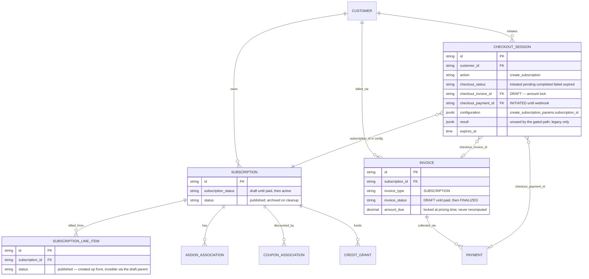

# Payment-Gated Subscription Create — Design ERD

Status: **Implemented (backend)** — pay-first create live; swagger regen pending
Date: 2026-08-07
Related: [Payment-gated quantity change](2026-07-17-payment-gated-quantity-change.md), [Payment-gated wallet top-up](2026-07-20-payment-gated-wallet-topup.md), [Payment-gated addon attach](2026-08-06-payment-gated-addon-attach.md)

---

## 1. Problem Statement

Checkout-gated subscription creation predates the recipe the other three flows share. It goes
through `POST /checkout/sessions` with `action: create_subscription` and a **nine-field hand-copy**
of `CreateSubscriptionRequest` ([checkout_session.go:358-368](../../internal/ee/service/checkout_session.go#L358-L368)):
`plan_id, currency, lookup_key, start_date, end_date, billing_period, metadata` plus the customer
and a forced draft status.

Everything else on the create request is silently dropped: **addons, coupons, credit grants, price
overrides, entitlement overrides, extra line items, commitments, tax overrides, payment behaviour**.
A B2B2C merchant cannot sell a plan-plus-addon bundle, or apply a signup coupon, behind a payment
gate.

**Goal:** an opt-in `checkout` object on `POST /subscriptions`, carrying the **full** request
surface. Zero behaviour change when `checkout` is omitted. This is the **fourth** application of the
recipe, following §8 of the addon-attach doc.

---

## 2. Approach

### 2.1 Why the entry point moves

`internal/types` imports nothing from `internal/api/dto`, and the ent column type is
`types.CheckoutConfiguration`. Widening `types.CreateSubscriptionParams` to full parity would mean
hand-porting ~10 nested DTO structs plus ~300 lines of validation into `internal/types` and
maintaining a mapper — a fork of half the subscription DTO layer that drifts on every new field.
This is the same wall the addon flow hit for `line_item_commitments` (its §2.7).

So the gate moves to the endpoint that already speaks the full request. `POST /checkout/sessions`
with `action: create_subscription` **keeps working unchanged** — unlike the other three actions,
which that endpoint rejects outright.

### 2.2 The billing-invisible identity

The recipe's load-bearing question: what can be persisted before payment without billing reading it?
Quantity change and addon attach answer it by deferring their mutation entirely. **This flow cannot** —
addons and coupons must be attached for the invoice to price them.

The answer already existed: a **`SubscriptionStatusDraft` subscription**. `createSubscription` skips
the opening invoice for draft ([subscription.go:453-460](../../internal/ee/service/subscription.go#L453-L460)),
and draft subscriptions are filtered out of billing and meter paths
([invoice.go:1995](../../internal/ee/service/invoice.go#L1995),
[meter_usage.go:2243](../../internal/ee/service/meter_usage.go#L2243)).

Module **B therefore runs up front, in DRAFT**, and only *activation* is deferred. The cost: every
failure path from that point has to archive the draft subscription **and its children** — the first
flow in this family whose pending identity owns sub-entities (§9.1).

### 2.3 Where the branch lives

Not at the top of `CreateSubscription`. The gate is a **settlement** decision, so it sits where the
opening invoice is decided, and the create resolves exactly once:

| Site | What it does |
| --- | --- |
| [subscription.go:76-84](../../internal/ee/service/subscription.go#L76-L84) | Inherit `collection_method` from the checkout's, before `Validate` applies its own default |
| [subscription.go:290-298](../../internal/ee/service/subscription.go#L290-L298) | Force `draft` — **after** `syncTrialingStateFromCreateRequest` |
| [subscription.go:575-581](../../internal/ee/service/subscription.go#L575-L581) | `gateSubscriptionOnCheckout`, after the response is built and **before** the webhook block |

The middle one is the subtle one, and it is why there is no separate trial pre-flight — see §2.4.

### 2.4 Trials fall through, and the ordering that makes it work

A trial raises no opening charge, so there is nothing to gate: a trialing subscription is created
normally and no session is opened, consistent with the zero-amount branch.

`syncTrialingStateFromCreateRequest` **returns early for draft**
([subscription.go:8153](../../internal/ee/service/subscription.go#L8153)). Forcing draft *before* it
would therefore flatten a plan-inherited trial into a plain draft, and completion would later
activate it as ACTIVE — **silently destroying a trial the customer was entitled to**. A DTO-level
check cannot catch that case, because plan-inherited trials are only resolved later by
`setCreateSubscriptionTrialWindow` ([subscription_trial.go:28-47](../../internal/ee/service/subscription_trial.go#L28-L47)).

Forcing draft *after* it costs nothing and makes the trial case fall out for free. Regression test:
`TestCreateSubscriptionWithCheckout_PlanInheritedTrialFallsThrough`.

### 2.5 Nothing to collect → activate immediately

Two distinct routes, and the second is the trap:

| Route | Detected by | Invoice |
| --- | --- | --- |
| No charges at all (usage-only plan) | `ComputeInvoice`'s `skipped` — a zero **subtotal** | Archived; an empty draft would just linger |
| Charges fully discounted | `amount_due <= 0` | **Finalized and kept** — a zero-due invoice finalizes as paid, so the subtotal and discount stay on the books |

`skipped` does **not** catch the second: the subtotal is real, the discount cancels it. Branching on
`skipped` alone would open a payment link for zero.

### 2.6 Module pipeline

| Module | Function | Role |
| --- | --- | --- |
| **A** | `CreateSubscriptionRequest.Validate()` + `validateCheckoutCompatibility` | Validate intent. No writes. |
| **B** | `createSubscription` (existing, unchanged) | Materialize DRAFT: line items, **addons**, **coupons**, grants, overrides, tax links. Opening invoice skipped. |
| **C** | `buildCheckoutDraftInvoice` | Draft invoice → `ComputeInvoice` → `RecalculateTaxesOnInvoice`. **Money lock** = `amount_due`. |
| **D1** | existing default path | `checkout` omitted. Untouched. |
| **D2a** | `activateGatedSubscriptionNow` | Nothing to collect → activate, no session. |
| **D2b** | `settleCreateSubscriptionPayFirst` | `StartPayFirstCheckoutSession` on the locked draft. |
| **D3** | `completeSubscriptionCheckout` | Webhook: finalize + reconcile, then activate. No re-pricing. |

| Path | Modules |
| --- | --- |
| Normal create (no `checkout`) | A + B + D1 |
| Trialing create with `checkout` | A + B + D1 (checkout ignored) |
| Zero-amount create with `checkout` | A + B + C + D2a |
| Pay-first create | A + B + C + D2b |
| Webhook complete | D3 |

`activateGatedSubscription` is shared by D2a and D3: flip DRAFT→ACTIVE plus process the credit
grants the draft held back. Publishing is deliberately **not** in it — `CreateSubscription` publishes
from the resulting status, so a gated create that activates immediately would otherwise announce
itself twice.

### 2.7 Lifecycle

```text
POST /subscriptions (checkout present)
  → A: validate + allowlist; inherit collection_method from checkout config
  → B: createSubscription; trial resolved; forced draft if not trialing
  → trialing?  → return normally, checkout_session omitted
  → C: draft invoice → ComputeInvoice → RecalculateTaxesOnInvoice
  → nothing due? → D2a: archive-or-finalize, activate, apply grants, no session
  → D2b: StartPayFirstCheckoutSession(action = create_subscription,
             configuration.create_subscription_params = { subscription_id })
       on failure: draft invoice archived by StartPayFirst; draft subscription archived by us
  → publish subscription.draft_created (gated) or subscription.created (activated)
  → return SubscriptionResponse + checkout_session.payment_action.url

Razorpay webhook (payment_link.paid / payment.captured)
  → CompleteCheckoutSession → completeSubscriptionCheckout:
       finalize the same invoice + payment SUCCEEDED + ReconcilePaymentStatus
       DRAFT → ACTIVE + process pending credit grants
       publish subscription.created

fail / expire / cancel
  → cleanupCheckoutSession: archive invoice + payment + draft subscription (+ its children)
```

**Money settles before activation.** If finalization fails, the subscription stays DRAFT behind a
DRAFT invoice — a clean, resumable state a retry can finish — rather than a live subscription behind
an unfinalized invoice.

### 2.8 API surface (backward compatible)

```json
POST /v1/subscriptions
{
  "external_customer_id": "cust_1",
  "plan_id": "plan_x", "currency": "usd", "billing_period": "MONTHLY",
  "addons": [{ "addon_id": "addon_x", "cadence": "recurring" }],
  "subscription_coupons": [{ "coupon_code": "SAVE20" }],
  "credit_grants": [ ... ], "override_line_items": [ ... ],
  "checkout": {
    "payment_provider": "razorpay",
    "success_url": "...", "failure_url": "...", "cancel_url": "...",
    "idempotency_key": "optional", "payment_provider_config": {}, "metadata": {}
  }
}
```

`SubscriptionResponse` gains `checkout_session` — an omitempty pointer, so the pay-later body stays
byte-identical. It sits on `SubscriptionResponse` rather than a wrapper type because that struct is
already the optional-decorations DTO (`latest_invoice`, `coupon_associations`, `credit_grants`,
`entitlements`), and a wrapper would ripple through eleven internal `CreateSubscription` callers plus
the Stripe integration.

### 2.9 Checkout-path restrictions (v1)

Deliberately short — the point of the work is that the full surface passes through.

| Restriction | Reason |
| --- | --- |
| `subscription_status` | Not the caller's to choose; checkout forces draft |
| `phases` | Phase 0 is written in the create tx but `handleSubscriptionPhases` (phases 1..n) is skipped for draft — a gated create would persist a half-built schedule. Lifting it means running `handleSubscriptionPhases` at activation. |
| `inheritance` | Children are created in-tx and inherit the parent's draft status, so gating is feasible — but cleanup must archive them and unwind grouped-invoicing conversions of *pre-existing* subscriptions, and activation must cascade. |

**Explicitly not restricted**, because they are lifetime subscription config rather than instructions
for this one payment — and the opening invoice they would have influenced is skipped for a draft:

| Accepted | Handling |
| --- | --- |
| `payment_behavior`, `gateway_payment_method_id` | Persisted on the row and read at every renewal via `NewPaymentParametersFromSubscription`. Rejecting them would pin every gated subscription to `default_active` with no saved method. |
| `collection_method` | Governs *future* invoices — a different question from `checkout.payment_provider_config.collection_method`, which governs only how this checkout collects (link vs mandate). When the caller sets neither, the subscription inherits the checkout's **effective** method: its config value, or `send_invoice`. The fallback matters — without it a link-paid subscription takes `Validate`'s own `charge_automatically` default and would try to auto-charge its first renewal against a mandate that was never created, while the legacy create-session path stores `send_invoice`. Pinned by `TestCreateSubscriptionWithCheckout_CollectionMethodInheritance`. |
| `trial_period_days` | Falls through (§2.4). |

### 2.10 No concurrent guard

Unlike modify / top-up / addon there is no pre-existing resource to guard — every call creates a new
subscription. Duplicate protection is `checkout.idempotency_key`, partial-unique while
`checkout_status IN ('initiated','pending')`, surfacing as `ErrAlreadyExists` → HTTP 409.

`CheckoutConfigurationFilter.SubscriptionID` ORs `modify_subscription_params` and
`add_addon_params` only ([checkout_session.go:438-464](../../internal/repository/ent/checkout_session.go#L438-L464)).
It is **not** widened here because nothing queries it — but per the addon doc §8 this omission
**fails open**, so any future guard must add the third JSON path *and* its in-memory mirror.

---

## 3. ERD



**The invariant this rests on:** billing reaches line items only through a non-draft subscription.
The addon flow could not pre-create line items for exactly this reason; here the *parent* is the
thing billing skips, so they are safe.

---

## 4. Configuration JSON (v1)

```json
{
  "create_subscription_params": {
    "subscription_id": "subs_01J..."
  }
}
```

One field. Everything completion needs already lives on the row it points at — unlike
`AddAddonParams`, which denormalizes because its association row does not carry the attach intent.

`CreateSubscriptionParams.Validate()` short-circuits when `subscription_id` is set: the legacy
plan / currency / billing-period fields are the *other* entry point's wire contract and are
meaningless here.

Completion resolves its three ids across both shapes — configuration + session columns for the gated
path, `session.Result` for legacy — so in-flight legacy sessions keep completing.

---

## 5. Status mapping

| Phase | Checkout | Subscription | Invoice | Payment | Credit grants |
| --- | --- | --- | --- | --- | --- |
| After pay-first create | `pending` | `draft` | `DRAFT` | `INITIATED` | pending |
| After webhook success | `completed` | `active` | `FINALIZED` + paid | `SUCCEEDED` | applied |
| Nothing to collect | none | `active` | archived or `FINALIZED` | none | applied |
| Trialing | none | `trialing` | trial-start `$0` | none | per trial rules |
| Fail / expire / cancel | `failed` / `expired` | archived | archived | archived | archived |
| Completion errors after payment | `pending` | stays `draft` | `FINALIZED` | `SUCCEEDED` | pending |

---

## 6. Scenarios

| # | Scenario | Handling |
| --- | --- | --- |
| 1 | Create without `checkout` | Unchanged pay-later path |
| 2 | `checkout` + charge > 0 | Draft subscription + DRAFT invoice + session |
| 3 | `checkout` + addons | Addon line items priced into the locked amount |
| 4 | `checkout` + coupons | Discount applied before the amount is locked |
| 5 | `checkout` + usage-only plan | Nothing due → activate, empty draft archived, no session |
| 6 | `checkout` + fully discounted | Nothing due → activate, invoice finalized and kept |
| 7 | `checkout` + `trial_period_days` | Falls through; trialing, no session |
| 8 | `checkout` + plan-inherited trial | Falls through; trial preserved (§2.4) |
| 9 | `checkout` + `phases` / `inheritance` / `subscription_status` | Validation error; nothing persisted |
| 10 | Session create fails after the draft exists | Invoice archived by `StartPayFirst`; subscription + children archived by us |
| 11 | Payment succeeds | Same invoice finalized, subscription active, grants applied, `subscription.created` |
| 12 | Duplicate webhook | Subscription status is the fingerprint; second call changes nothing |
| 13 | Session expires / cron cleanup | Draft subscription + children + invoice + payment archived |
| 14 | Session completed, then late expiry | Cleanup guards on `subscription_status == draft`; a live subscription is left alone |
| 15 | Legacy `POST /checkout/sessions` | Unchanged, and now also gains grant processing + `subscription.created` |

---

## 7. Evolvability notes

The recipe holds for a fifth consumer. What generalises from this application specifically:

1. **The billing-invisible identity can be the parent.** Addon attach had to leave line items unborn
   because billing traverses them. Here the draft *subscription* is the thing billing skips, so its
   children are safe to create — which is what makes full-surface pricing possible at all.
2. **Branch at the settlement seam, not the entry point.** Gating where the opening invoice is
   decided means one resolution pass, one validation, and no recursion. An entry-point branch that
   re-enters the same function forces a duplicate pre-flight for anything resolved downstream.
3. **Ordering can be load-bearing.** Forcing the gated status one line earlier would have silently
   destroyed plan-inherited trials (§2.4). When a flow forces state, check what downstream resolution
   short-circuits on that state.
4. **Split activation from announcement.** Sharing "activate" between the create path and the webhook
   path only works if publishing is factored out — the create path's caller already publishes.

Deferred, each additive: `phases` and `inheritance` on the checkout path (§2.9), and a concurrent
guard should one ever be wanted (§2.10).

---

## 8. Known sharp edges

1. **Cleanup must reach the children.** This is the first flow whose pending identity owns
   sub-entities. `archiveDraftCheckoutSubscription` archives addon associations, coupon associations,
   credit grants and their applications, and tax associations alongside the subscription. Line items
   are left — billing reaches them only through a non-draft parent.
2. **Coupon redemptions are not refunded.** `createCouponAssociation` calls
   `CouponRepo.IncrementRedemptions` and the repository has no inverse, so an abandoned checkout
   permanently consumes a redemption. Pre-existing for every path that abandons a subscription
   carrying coupons; closing it needs a new repository method. **Follow-up ticket.**
3. **Paid-but-unactivated cannot be eliminated**, same as addon attach §9.1. Completion can still
   fail after payment. Money settles first, so the residue is a clean DRAFT pair a retry can finish;
   the ~15-minute session expiry keeps the window small.
4. **`subscription.draft_created` now fires for gated creates**, since module B runs the real create
   in DRAFT. Merchants subscribed to that event will see new traffic — **changelog it.**
5. **A retried completion may republish `subscription.created`.** `CompleteCheckoutSession`'s
   terminal-status guard absorbs ordinary duplicate webhooks, so this only happens after a partial
   failure — preferable to a subscription that went live and was never announced.
6. **Test-double fidelity.** `InMemorySubscriptionStore.Delete` and `InMemoryInvoiceStore.Delete`
   were hard-deleting while both ent repositories soft-delete; fixed. Three existing tests were
   asserting cleanup by checking a row had *disappeared*, which passed whether or not the code ran —
   they now assert on status. The in-memory invoice filter also drops `SKIPPED` invoices unless the
   status is named explicitly, which is exactly what a zero-charge gated create produces.
7. **The fully-discounted route is covered only for its consequences.** The in-memory coupon
   machinery creates the association but applies no discount at invoice time, so no fixture can
   produce `subtotal > 0, amount_due == 0`. `TestActivateGatedSubscriptionNow_KeepsAndFinalizesTheInvoice`
   pins what happens once that branch is taken; the trigger itself needs an integration test.
