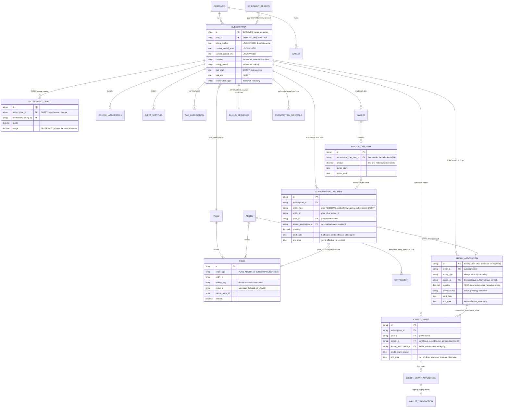

# Plan Change v2 — Swap-In-Place — ERD

Status: **Proposed** — v0
Date: 2026-08-11

---

## 1. Scope

Mutate `subscriptions.plan_id` in place instead of cancel-and-recreate. Slice line items at the
effective date, leave the billing anchor alone.

**In v0:** feature parity with today's v1 plan change, delivered by swap, plus **addon dispositions**
(carry / drop) and **attaching addons** at change time — which together express replace.

**Out of v0, structure kept open for each:**


| Deferred                                                                  | Note                                   |
| ------------------------------------------------------------------------- | -------------------------------------- |
| `subscription_associations` table                                         | §7                                     |
| `target_config` — coupons / overrides at change time (addons ARE in v0)   | §8                                     |
| Dispositions for coupons, tax, credit grants, price/entitlement overrides | all default to CARRY = zero operations |
| Interval / cadence / currency change, hierarchy subs, phases              | 4xx, hint points at v1                 |


---


## 2. API contract

```
POST /v1/subscriptions/{id}/change/v2/preview     @x-scope "read"
POST /v1/subscriptions/{id}/change/v2/execute     @x-scope "write"
```

Preview and execute take the **identical** request type — that is what guarantees quote parity, and
it is what v1 gets wrong (two independent credit-netting implementations; preview ignores usage, tax,
coupons and the cancel invoice).

```go
type SubscriptionChangeV2Request struct {
    TargetPlanID      string                  `json:"target_plan_id" validate:"required"`
    ChangeAt          *types.ScheduleType     `json:"change_at,omitempty"`   // immediate (default) | end_of_period
    ProrationBehavior types.ProrationBehavior `json:"proration_behavior" validate:"required"`

    // What happens to what is already attached. Wrapper kept so new entity types
    // are added without a breaking change; v0 populates exactly one field.
    EntityPolicies *SubscriptionChangeEntityPolicies `json:"entity_policies,omitempty"`

    // What to attach as part of the change. Same wrapper reasoning.
    TargetConfig *SubscriptionChangeTargetConfig `json:"target_config,omitempty"`

    Checkout       *CheckoutParams   `json:"checkout,omitempty"`
    IdempotencyKey *string           `json:"idempotency_key,omitempty"`
    Metadata       map[string]string `json:"metadata,omitempty"`
}

// SubscriptionChangeEntityPolicies is the extension point. Each entity type gets
// one field of the same shape, so adding coupons or tax later is additive.
type SubscriptionChangeEntityPolicies struct {
    Addons *EntityChangePolicy `json:"addons,omitempty"`
    // v1+, all *EntityChangePolicy:
    //   Coupons, TaxAssociations, CreditGrants, PriceOverrides, EntitlementOverrides
}

// SubscriptionChangeTargetConfig attaches new entities as part of the change.
// A named subset of SubscriptionCreationConfig, same field names and types.
type SubscriptionChangeTargetConfig struct {
    Addons []AddAddonToSubscriptionRequest `json:"addons,omitempty" validate:"omitempty,dive"`
    // v1+: SubscriptionCoupons, OverrideLineItems, OverrideEntitlements,
    //      CreditGrants, TaxRateOverrides, LineItemCommitments
}

// EntityChangePolicy declares what happens to one entity type's existing
// attachments. Generic on purpose — the same shape serves every entity.
type EntityChangePolicy struct {
    // Applied to every active attachment of this entity type.
    // Empty means the entity's built-in default, which is "carry" for everything in v0.
    Default types.EntityDisposition `json:"default,omitempty"`

    // Per-instance override, keyed by the INSTANCE id for that entity type —
    // addon_associations.id, coupon_associations.id, credit_grants.id — never the
    // catalogue id, because one subscription can hold two attachments of one addon (§5).
    Overrides map[string]types.EntityDisposition `json:"overrides,omitempty"`
}
```

`EntityDisposition` is an enum in `internal/types/`, alongside the other change enums:

```go
// EntityDisposition is the shared vocabulary for what a plan change does to an
// existing attachment. Not every value is legal for every entity type — each policy
// field validates against its own allowed set via ValidateFor, and the error names
// the allowed values, so an unsupported combination is a 4xx, not a silent no-op.
type EntityDisposition string

const (
    // Leave the attachment untouched. Zero operations. Built-in default for everything in v0.
    EntityDispositionCarry EntityDisposition = "carry"
    // Close the attachment at the change's effective_at, settling money per the
    // change's proration_behavior.
    EntityDispositionDrop EntityDisposition = "drop"
    // v1+: "rederive" — close and recreate from the target plan. Takes no parameter;
    // there are only two plans in this API. Meaningless until plan-bundled addons exist.
)

var EntityDispositionValues = []EntityDisposition{
    EntityDispositionCarry,
    EntityDispositionDrop,
}

func (d EntityDisposition) String() string { return string(d) }

// ValidateFor checks d against the subset an entity type accepts.
// v0: addon -> {carry, drop}.
func (d EntityDisposition) ValidateFor(e SubscriptionChangeEntityType, allowed []EntityDisposition) error
```

```json
"entity_policies": { "addons": { "overrides": { "addon_assoc_A": "drop" } } }
```


### Response

```go
type SubscriptionChangeV2Response struct {
    Subscription     *SubscriptionResponse `json:"subscription"`
    ChangedResources ChangedResources      `json:"changed_resources"`  // reused as-is

    ChangeType  types.SubscriptionChangeType `json:"change_type"`
    EffectiveAt time.Time                    `json:"effective_at"`
    FromPlan    PlanSummary                  `json:"from_plan"`        // existing type
    ToPlan      PlanSummary                  `json:"to_plan"`

    // One entry per active attachment the change touched or considered, any entity
    // type. v0 emits addon rows only. Same shape as the request policy, so a caller
    // can round-trip a preview result back as explicit overrides.
    EntityDispositions []EntityDispositionResult `json:"entity_dispositions,omitempty"`

    IsScheduled bool       `json:"is_scheduled"`
    ScheduleID  *string    `json:"schedule_id,omitempty"`
    ScheduledAt *time.Time `json:"scheduled_at,omitempty"`

    CheckoutSession *CheckoutSessionResponse `json:"checkout_session,omitempty"`
    Warnings        []string                 `json:"warnings,omitempty"`
    Metadata        map[string]string        `json:"metadata,omitempty"`
}

type EntityDispositionResult struct {
    EntityType types.SubscriptionChangeEntityType `json:"entity_type"`
    // The instance id — the key an Overrides entry would use.
    ReferenceID string `json:"reference_id"`
    // The catalogue id: addon_id, coupon_id, …
    EntityID string `json:"entity_id"`
    // The resolved value — identical to what an Overrides entry accepts, so a
    // preview result round-trips back as an explicit override unchanged.
    Disposition types.EntityDisposition `json:"disposition"`
    Reason      types.DispositionReason `json:"reason"`
    // Free text, set only when Reason alone is not self-explanatory.
    Detail string `json:"detail,omitempty"`
}
```

The two enums live in `internal/types/`, next to the existing `SubscriptionChangeType`:

```go
// SubscriptionChangeEntityType names an entity kind a plan change can act on.
// Singular — one result row describes one attachment. It corresponds to the
// same-named plural field on SubscriptionChangeEntityPolicies: addon -> Addons.
type SubscriptionChangeEntityType string

const (
    SubscriptionChangeEntityTypeAddon SubscriptionChangeEntityType = "addon"
    // v1+: coupon, tax_association, credit_grant, price_override, entitlement_override
)

var SubscriptionChangeEntityTypeValues = []SubscriptionChangeEntityType{
    SubscriptionChangeEntityTypeAddon,
}

func (e SubscriptionChangeEntityType) String() string { return string(e) }
func (e SubscriptionChangeEntityType) Validate() error { /* mirrors SubscriptionChangeType.Validate */ }

// DispositionReason explains why a disposition was chosen, so a preview is
// auditable without the caller re-deriving the precedence rules.
type DispositionReason string

const (
    // No per-instance override matched; the effective default applied. Covers both
    // the built-in default and a caller-supplied entity_policies.<entity>.default —
    // the two are not split, because the caller can see which they sent and the
    // resolved Disposition is echoed back either way.
    DispositionReasonDefault DispositionReason = "default"
    // entity_policies.<entity>.overrides[<reference_id>] named this attachment.
    DispositionReasonExplicitOverride DispositionReason = "explicit_override"
    // The server overrode policy. The only reason a consumer cannot derive from
    // its own request, so it is the one that has to be on the wire. Detail says why.
    DispositionReasonForced DispositionReason = "overriden_default"
)

var DispositionReasonValues = []DispositionReason{
    DispositionReasonDefault,
    DispositionReasonExplicitOverride,
    DispositionReasonForced,
}
```

**Line-item continuity is reported through** `ChangedLineItem`**, not a parallel array.** That type
already exists and is already returned for every line item created or ended
([dto/subscription_modification.go:409](../../internal/api/dto/subscription_modification.go#L409));
it simply does not say which `created` entry succeeds which `ended` one. One additive optional field
fixes that:

```go
type ChangedLineItem struct {
    ID           string                `json:"id"`
    PriceID      string                `json:"price_id"`
    Quantity     decimal.Decimal       `json:"quantity"`
    StartDate    *time.Time            `json:"start_date,omitempty"`
    EndDate      *time.Time            `json:"end_date,omitempty"`
    ChangeAction ChangedLineItemAction `json:"change_action"`

    // NEW. Two entries in the SAME response sharing a non-empty line_key — one
    // "ended", one "created" — are the same service continuing. An "ended" entry
    // whose key matches no "created" entry is a service that stopped; a "created"
    // entry matching no "ended" one is new.
    //
    // The key is derived from the price, so it is equal across plans only when the
    // two prices are genuinely the same service: (meter_id, filter_values) for
    // USAGE, a shared prices.group_id for FIXED, otherwise price_id — which is
    // unique per line and therefore pairs with nothing. Unpaired is the normal
    // outcome for fixed lines and is not an error.
    LineKey string `json:"line_key,omitempty"`
}
```


### Preconditions — 4xx before any write

Interval / cadence / period-count / billing-cycle mismatch · currency mismatch ·
`subscription_type ∈ {parent, grouped_invoicing, inherited}` · subscription has phases ·
`pause_status ∈ {active, scheduled}` · pending cancellation or plan_change schedule ·
pending checkout session · `subscription_status ∉ {active, trialing}` ·
`target_plan_id == subscription.plan_id`. Every hint names the v1 endpoint as the fallback.

---


## 3. Dispositions

> **Everything keyed on** `subscription_id` **carries, because the row survives. v0 rederives exactly one
> thing — plan-derived line items — and makes exactly one thing configurable — addons.**

**UNTOUCHED, zero operations.** `invoices`, `invoice_line_items`, `credit_notes`, `payments`,
`wallets`, `wallet_transactions`, `coupon_applications`, `tax_applieds`, `usage_records`, ClickHouse
`events_processed` / `feature_usage` / `usage_benchmark`, `entity_integration_mappings`,
`workflow_executions`, `system_events`, `alert_logs`, `parent_subscription_id` and children.
`billing_sequences` in particular — unique on `(tenant_id, subscription_id)` — so the cycle counter
no longer restarts at 1.

**CARRY, not configurable in v0.** `coupon_associations`, `tax_associations`, plan-sourced and custom
`credit_grants`, `entitlement_grants` **including the usage counter**, subscription-scoped `prices`,
`alert_settings`, `trial_start`/`trial_end`, and the subscription columns v1 silently dropped
(`commitment_*`, `overage_factor`, `enable_true_up`, `payment_behavior`, `collection_method`,
`gateway_payment_method_id`, `payment_terms`, `timezone`, `lookup_key`, `auto_invoice_threshold`,
`invoicing_customer_id`).

**REDERIVE.** `subscription_line_items` where `entity_type = 'plan'` — close at `effective_at`, open
successors from the target plan's prices.

### Addons

CARRY is zero operations. DROP is the semantics `RemoveAddonFromSubscription` already implements,
with `EffectiveDate = effective_at`:


| Addon shape             | On drop                                                                                                                                                                                                                | Status                                                                      |
| ----------------------- | ---------------------------------------------------------------------------------------------------------------------------------------------------------------------------------------------------------------------- | --------------------------------------------------------------------------- |
| Fixed, advance          | Prorated credit for the unused window                                                                                                                                                                                  | works                                                                       |
| Usage, arrear           | **Not prorated.** Closing the line item clips the ClickHouse window; the next regular invoice bills `[period_start, effective_at)`                                                                                     | works — **must be tested**, this is the usage restart silently never billed |
| Fixed, arrear           | *Should* be a prorated charge for the consumed fraction, but `shouldIssueCharge` ([calculator.go:122](../../internal/domain/proration/calculator.go#L122)) is never true for remove actions, so today it bills nothing | **open — confirm and close**                                                |
| Credit grant, ONETIME   | Nothing. Already delivered, expiry frozen. Never clawed back — credits may be spent                                                                                                                                    | works                                                                       |
| Credit grant, RECURRING | `CancelFutureSubscriptionGrants` scoped by `AddonID` ([subscription.go:5643](../../internal/ee/service/subscription.go#L5643)). Already-applied periods are not clawed back                                            | works                                                                       |
| Entitlements            | No write. Addon entitlements are templates (`entity_type = ADDON`, [addon.go:243](../../internal/ee/service/addon.go#L243)) resolved through the active association                                                    | works                                                                       |


Two changes the drop path needs inside a plan change:

1. **One invoice.** Today the credit is a wallet top-up issued *after* the transaction, best-effort — [subscription.go:5672](../../internal/ee/service/subscription.go#L5672) logs *"removal was persisted and the credit is UNISSUED"*. Use `LineItemProrationService.Compute`, not `Apply`, and fold the entries into the plan change's single settlement.
2. **Default to** `effective_at`**.** `RemoveAddonFromSubscription` defaults to `sub.CurrentPeriodEnd`.

**Open — arrear fixed charge on drop.** Adding `ProrationActionRemoveItem` to `shouldIssueCharge` is
not enough: the branch computes `NewPricePerUnit × NewQuantity × coefficient`, and a remove has no
`New*` values, so it would still produce zero. Charging the consumed fraction needs a distinct branch
on `Old* × (1 − coefficient)`. A design task, not a flag.

**Guard — two attachments of one addon.** `entitlement_grants` is UNIQUE on
`(tenant_id, environment_id, entitlement_config_id, customer_id, subscription_id, valid_from)`
([entitlement_grant.go:125](../../ent/schema/entitlement_grant.go#L125)), so two attachments of the
same addon share **one** grant row — a second cannot exist. Dropping one attachment must therefore
not close the entitlement grant while another active attachment of the same `addon_id` remains. Same
shape as the `credit_grants` case in §5, and the reason `credit_grants.addon_association_id` alone
does not cover it.

---


## 4. ERD




Three of these arrows are the whole design: `plan_id` mutates, `subscription_line_items` slice, and
everything else keeps pointing at an `id` that did not change.

---


## 5. Addon identity

Quantity and instances are different things and both exist.

**Quantity** — one association, one line item, `quantity = N`, set via `override_line_items[].quantity`
and applied by `ProcessSubscriptionPriceOverrides`
([subscription.go:5103](../../internal/ee/service/subscription.go#L5103)).

**Two associations** — two `addon_associations` rows for one `addon_id`. Not caused by a different
size or price: prices belong to the addon, so "Extra Storage 100 GB" and "500 GB" are two catalogue
addons. The real case is a reversed cancellation, documented in `RemoveAddonFromSubscription`:

```
Oct 1   Priority Support active                    -> addon_assoc_A (end_date = nil)
Oct 10  cancelled, effective period end            -> addon_assoc_A (end_date = Nov 1)
Oct 15  customer changes their mind, re-attaches   -> addon_assoc_B (end_date = nil)

Oct 15 -> Nov 1: two concurrent associations, same addon_id
```

> "This handles the case where a previous association was cancelled at period-end (EndDate set)
> while a new recurring association was added on top (EndDate zero)."

A plan change landing Oct 20 cannot say which to drop from `addon_id` alone — A is dying Nov 1
anyway, B is the live one. Hence `AddonChangePolicy.Overrides` is keyed by `addon_associations.id`.

Secondary: `Cadence` is a property of the attachment, not the addon
([ent/schema/addon.go](../../ent/schema/addon.go) carries only id / lookup_key / name / description /
metadata), so one addon can be attached both recurring and onetime. Thin in practice.

**Two bugs this exposes, both fixed as columns.** In the same overlap window,
`CancelFutureSubscriptionGrants(subscription_id, addon_id)` cancels the grants of *both*
attachments, so dropping A also kills B's allocation. Narrow — if A was cleanly cancelled its grant
is already end-dated — but real. Fix: `credit_grants.addon_association_id`. Separately,
`createLineItemFromPrice` writes a literal `"addon_quantity": "1"` into line-item metadata
([subscription.go:5743](../../internal/ee/service/subscription.go#L5743)) while the real quantity is
set later by the override path, so association-level quantity is unreliable. Fix:
`addon_associations.quantity`.

---


## 7. Why no `subscription_associations` table

Directionality is not the argument — `addon_associations` already indexes
`(tenant, env, entity_id, entity_type, addon_id)` for "what does this sub have", and a
`(tenant, env, addon_id)` index gives the reverse. One table reads both ways.

The real value would be one homogeneous row per link across all entity types, so the change engine
becomes *iterate associations, apply disposition* instead of one handler per entity type. That is a
genuine argument at six entity types. It is not true at one.

The cost is that a generic table holds only what is common, so one fact lives in two rows that can
disagree:

- `RemoveAddonFromSubscription` is 170 lines that know nothing about a registry. Unless it is patched too, billing correctly stops billing a cancelled addon while the change engine still sees it ACTIVE and tries to prorate a line item that ended two months ago.
- `addon_associations.end_date` and a registry's `effective_to` both mean "when this addon stopped". A period-end cancel sets Nov 1; a registry hook holding only `time.Now()` writes Oct 5. Two truths, 27 days apart, no constraint catches it.
- Any future attach path that forgets the hook leaves the registry silently incomplete — worse than absent, because the engine trusts it.

**Do the two real fixes as columns** (`credit_grants.addon_association_id`,
`addon_associations.quantity`). When more entities get dispositions, add `source` to
`addon_associations` and `coupon_associations` the same way. If the per-entity loop then hurts, build
the generic table **as a view or materialised projection** — derived, not a second source of truth,
and structurally incapable of disagreeing.

**Versioning — background only, not proposed.** Recorded to show why per-association versioning
does not work, should the table ever be revisited. Version would have to be per *subscription*:

```
after a change:  subscriptions.version = 2
  (S, PLAN,   starter, created_in_v=1, ended_in_v=2)
  (S, PLAN,   pro,     created_in_v=2, ended_in_v=NULL)
  (S, ADDON,  assoc_A, created_in_v=1, ended_in_v=2)
  (S, COUPON, assoc_C, created_in_v=1, ended_in_v=NULL)   <- untouched, NOT rewritten

config at version N:
  WHERE created_in_v <= N AND (ended_in_v IS NULL OR ended_in_v > N)
```

Unchanged rows are not duplicated. Per-association versioning cannot answer "config at version N" at
all — PLAN would be at v2 while the coupon is at v1 — leaving only timestamp queries, in which case
the version column is dead weight.

**What v0 gives up:** plan history, which restart provided accidentally as a chain of cancelled rows.
Mitigations: emit `subscription.plan_changed` with `{from_plan_id, to_plan_id, effective_at}`, and
note that *service* history is already recoverable at finer granularity from `invoice_line_items` via
the immutable `subscription_line_item_id` FK.

---


## 8. `target_config` — attaching addons, and replace

`target_config.addons` attaches addons as part of the change. Combined with `entity_policies`,
**replace** is expressible without a dedicated action:

```json
{ "target_plan_id": "plan_pro",
  "proration_behavior": "create_prorations",
  "entity_policies": { "addons": { "overrides": { "addon_assoc_A": "drop" } } },
  "target_config":   { "addons": [ { "addon_id": "addon_B", "cadence": "recurring" } ] } }
```

**Adding an addon that is already attached is not a conflict.** It creates a second attachment,  
which §5 establishes is legitimate and which `AddAddonToSubscription` already supports. To replace  
rather than stack, drop the existing attachment in the same request. Note this differs from coupons,  
where additive application *is* a bug — `[handleSubCoupons](../../internal/ee/service/subscription.go#L4602)`  
has it today — so the precedence rule must be decided per entity type when `SubscriptionCoupons`  
joins `target_config`, not inherited from addons.

```
close plan lines         -> ProrationActionRemoveItem
open  target-plan lines  -> ProrationActionAddItem
dropped addon lines      -> ProrationActionRemoveItem
added addon lines        -> ProrationActionAddItem
      -> Compute once -> one summary
      -> write all line items in one tx
      -> settle once
```

Two gaps to close in the shared settlement:

- `Apply` **returns only** `error`**.** `ChangedResources` needs the invoice and wallet-transaction ids, so the change calls `Compute` and settles itself, or `Apply` widens its return.
- **Charges and credits do not net.** `Apply` raises an invoice for `TotalChargeAmount` *and separately* a wallet credit for `TotalCreditAmount`, so a replace whose drop out-credits the add produces both. The pay-first path already nets them into one draft (`createAggregatedProrationDraftInvoice` locks charges − credits). **Open decision:** net for pay-later too, or keep the split.

---


## 9. Persistence delta


| Piece                                | Change                                                                                                                                         |
| ------------------------------------ | ---------------------------------------------------------------------------------------------------------------------------------------------- |
| `subscriptions.plan_id`              | drop `.Immutable()`; add to the repository `Update` field list                                                                                 |
|                                      |                                                                                                                                                |
| `credit_grants.addon_association_id` | new nullable immutable column; backfill from `addon_id` where the subscription has exactly one association for that addon, NULL otherwise (§5) |
| `addon_associations.quantity`        | new column, default 1, backfilled from line-item quantity (§5)                                                                                 |
|                                      |                                                                                                                                                |


---


## 10. Prerequisite — the credit basis

**Ships first, on v1. Blocking.** Credit is computed from the **list** price
([proration.go:451,463](../../internal/ee/service/proration.go#L451), and again at
[line_item_proration.go:210](../../internal/ee/service/line_item_proration.go#L210)), and the cap
meant to bound it compares a value against itself scaled by a coefficient ≤ 1
([calculator.go:255-273](../../internal/domain/proration/calculator.go#L255)), so it never binds.

Restart masks this — each subscription is credited once and cancelled. Under swap a line item
survives many changes and the error compounds. Fix is the join through the immutable
`invoice_line_items.subscription_line_item_id` FK; the call sites
`getOriginalAmountPaidForLineItem` and `getPreviousCreditsForLineItem` already exist commented out at
[proration.go:441,454](../../internal/ee/service/proration.go#L441).

Ship it on v1 where the parity harness measures it. **A4 and A2 point in opposite directions —
fixing A2 without A4 turns an over-credit into real money leaving the business.**

---


## 11. Sequencing

1. **A4 credit basis fix**, on v1. Blocking.
2. `credit_grants.addon_association_id` and `addon_associations.quantity` + backfills. Behaviour-neutral. Scope addon-drop grant cancellation on the association once the column exists.
3. `plan_id` mutable; `SubRepo.GetForUpdate` mirroring the invoice repo.
4. `/change/v2` preview + execute, immediate only. v1 deprecated in Swagger.
5. Deferred (`end_of_period`) + collapse the three scheduled executors ([subscription.go:3709](../../internal/ee/service/subscription.go#L3709), [update_billing_period_activities.go:380](../../internal/temporal/activities/subscription/update_billing_period_activities.go#L380), [subscription_schedule.go:246](../../internal/ee/service/subscription_schedule.go#L246)) into one — all three currently pass `time.Now()` instead of the scheduled instant.
6. Payment gating — add plan change to the checkout allowlist.
7. Point the Stripe inbound `handlePlanChange` ([internal/integration/stripe/subscription.go:585](../../internal/integration/stripe/subscription.go#L585)) at the same service, deleting the fourth implementation.
8. Webhooks: `subscription.updated` + new `subscription.plan_changed`. **Never** `subscription.cancelled` then `subscription.created` for an upgrade.

Deleted once v2 is the only in-place path: `inheritPaddleEntityMappings` and its TODO
([subscription_change.go:959](../../internal/ee/service/subscription_change.go#L959)),
`transferLineItemCoupons` (`:1106`), `mergeSubscriptionMetadata` (`:945`, already dead), and most of
`internal/domain/subscription/change.go`.

---


## 12. Verification


| #   | Scenario                                                   | Expected                                                                                                            |
| --- | ---------------------------------------------------------- | ------------------------------------------------------------------------------------------------------------------- |
| 1   | Same-interval upgrade mid-period                           | one row, same `id`, anchor and period bounds unchanged, `plan_id` updated, line items tile with no gap or overlap   |
| 2   | Lateral change, identical price                            | net zero, no invoice                                                                                                |
| 3   | Upgrade then downgrade back in one period                  | total equals true consumption, **with no special-case code**                                                        |
| 4   | Two changes in one period                                  | second credit references the first change's debit, not list price                                                   |
| 5   | Downgrade, credit exceeds the invoice                      | visible credit line, residue to the wallet, not discarded                                                           |
| 6   | `proration_behavior: none`                                 | service swaps, no credit, next regular invoice at the new price                                                     |
| 7   | Metered plan, usage before the change                      | pre-change usage billed at the old rate on the next regular invoice                                                 |
| 8   | Addon carry (default)                                      | zero DML against the association, its line items, grants, entitlements                                              |
| 9   | Addon drop, fixed advance                                  | prorated credit **netted onto the plan-change invoice**, not a separate wallet top-up                               |
| 10  | Addon drop, usage arrear                                   | no credit; usage `[period_start, effective_at)` on the next regular invoice                                         |
| 11  | Addon drop, fixed arrear                                   | prorated charge for the consumed fraction (bills nothing today)                                                     |
| 12  | Addon drop, ONETIME grant                                  | untouched, not clawed back                                                                                          |
| 13  | Addon drop, RECURRING grant                                | future applications cancelled, already-applied period kept                                                          |
| 14  | Drop lands exactly on a period boundary                    | the boundary CGA does not apply                                                                                     |
| 15  | Dropped addon's feature also on the plan                   | access retained, limit lowered                                                                                      |
| 16  | Cancel at period end, re-attach, change inside the overlap | the override targets the right association; the survivor and **its credit grant** are untouched                     |
| 17  | Addon with `quantity = 2`, dropped                         | one line item closed, credit prorated on the full quantity                                                          |
| 18  | Line-item coupon                                           | survives the change and applies to the next invoice                                                                 |
| 19  | Subscription-level coupon                                  | survives                                                                                                            |
| 20  | Entitlement usage counter                                  | preserved across the change                                                                                         |
| 21  | Trial in progress                                          | continues to its natural end                                                                                        |
| 22  | Concurrent double-execute                                  | second blocks on the row lock, then 4xx on `target_plan_id == plan_id`; exactly one change, no duplicate line items |
| 23  | Replayed `idempotency_key`                                 | same response, no second change                                                                                     |
| 24  | Interval / hierarchy / phases / pause / currency           | 4xx, no mutation                                                                                                    |
| 25  | Preview vs execute                                         | identical money for an identical request                                                                            |


```bash
go test -v -race ./internal/ee/service -run TestSubscriptionChangeV2
make test
make lint-ci
make generate-ent && make generate-migration
make swagger && make sdk-all
```

**End to end** (`make run-local`, `make migrate-local`): customer plus Starter and Pro with matching
`lookup_key`s → subscribe, attach one fixed-advance and one usage-arrear addon, let the first invoice
issue → ingest events against both meters → preview and check dispositions, mapping, money → execute
with `entity_policies.addons.default = "carry"` and an override dropping the arrear addon → assert
subscription id, `billing_anchor`, `current_period_*` and `billing_sequences.last_sequence` unchanged,
`plan_id` changed, carried addon untouched, **one invoice not three** → roll the period and assert
the dropped addon's usage was billed → replay with the same idempotency key → attempt an
interval-changing target and get a 400 with nothing mutated.