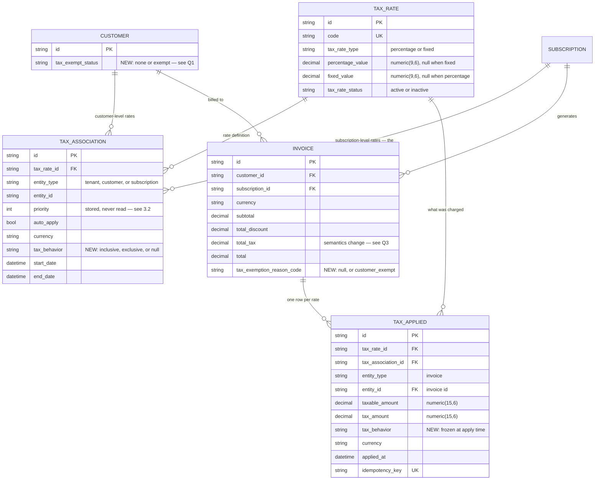
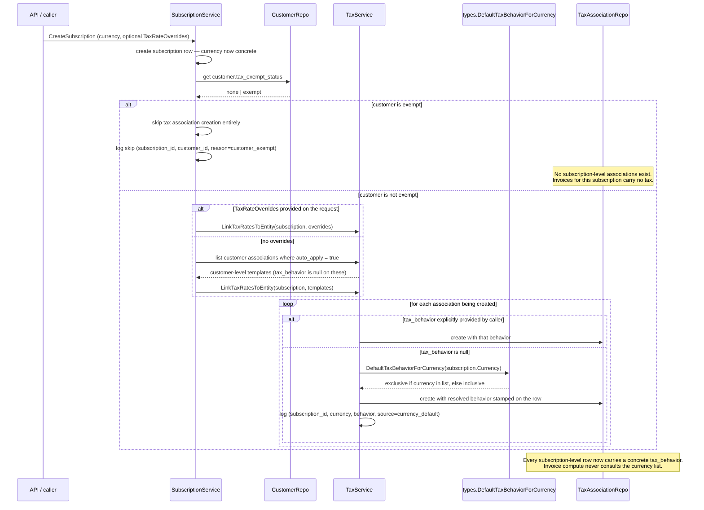
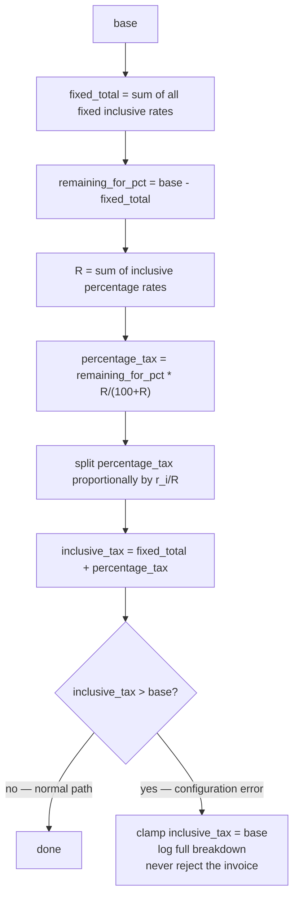
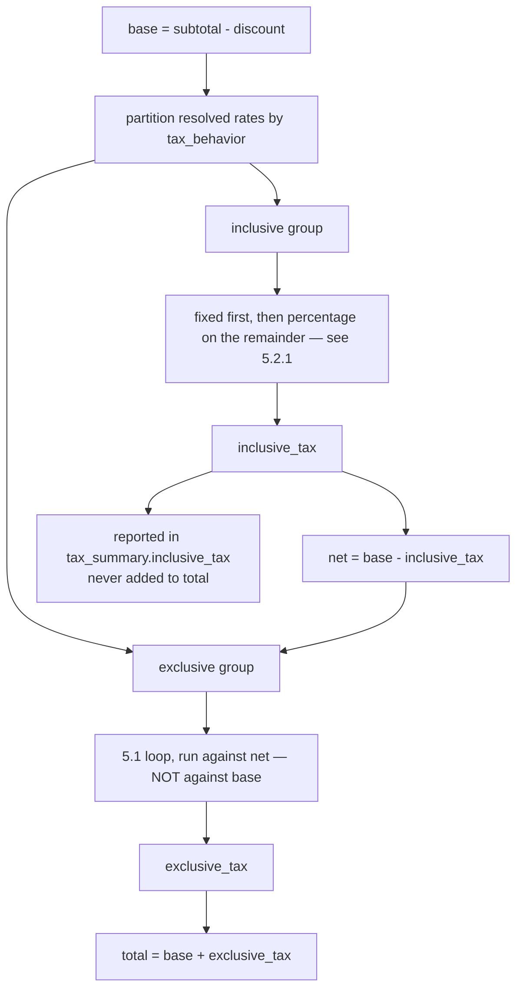
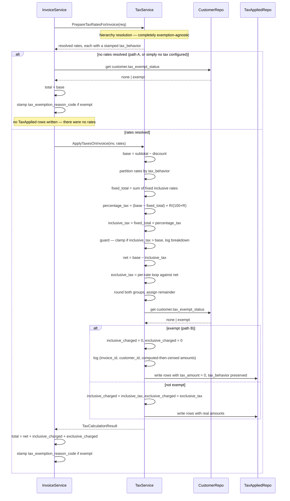

# Taxation — Inclusive / Exclusive / Exemption — Design ERD

Status: **Proposed** — v1 (invoice level)
Date: 2026-08-17
Author: Subrat Sahil Gupta
Related: `internal/ee/service/tax.go`, `ent/schema/taxassociation.go`, `ent/schema/taxapplied.go`, `internal/types/taxassociation.go`

---

## 1. Problem Statement

Tax is exclusive-only today — always added on top of `taxableAmount(inv) = subtotal - discount`
(`internal/ee/service/tax.go:1015-1041`). There is no tax-inclusive concept and no exemption concept
anywhere in the domain model. `TaxRateType` (`percentage` / `fixed`) governs how a rate's own amount is
computed, not whether it is already contained in the price.

**v1 goal:** inclusive, exclusive, mixed inclusive+exclusive, and customer tax exemption — all at the
invoice level.

---

## 2. Scope

| In v1 | Not in v1 |
|---|---|
| `tax_behavior` on `TaxAssociation` (inclusive / exclusive) | Line-item-level tax associations |
| Mixed inclusive + exclusive on one invoice | Price-level / product-level tax behavior |
| Fixed and percentage rates, both behaviors | Discount carry-down to line items |
| Per-currency default behavior (compiled list) | Per-tenant configurable currency default |
| Customer tax exemption | Reverse charge — enum value reserved, not built |
| Exclusive math — **unchanged** | Automatic jurisdiction / nexus detection |
| | Exemption certificate validation — the flag is trusted, not verified |
| | Configurable rounding granularity |

### 2.1 Terminology

Fixed vocabulary. Used consistently everywhere in this document.

| Term | Definition | Given or derived |
|---|---|---|
| `subtotal` | Sum of line item amounts | Given |
| `discount` | `inv.TotalDiscount` — a single invoice-level number in v1 | Given |
| `base` | `subtotal − discount`. Unchanged from today's `taxableAmount()`. The number tax is computed **from**. | Given |
| `inclusive_tax` | Tax already contained inside `base`, recovered by reverse calculation | Derived |
| `net` | `base − inclusive_tax`. What remains after inclusive tax is taken out. | Derived — never an input |
| `exclusive_tax` | Tax added on top, computed against `net` | Derived |

`base` and `net` are never interchangeable. `base` is always the given gross amount. `net` is always
what is left after extraction. Any formula that appears to "solve for base" from a total is in fact
solving for **`net`**.

---

## 3. Schema



### 3.1 New enums

```go
// internal/types

type TaxBehavior string

const (
    TaxBehaviorInclusive TaxBehavior = "inclusive"
    TaxBehaviorExclusive TaxBehavior = "exclusive"
)

type TaxExemptStatus string

const (
    TaxExemptStatusNone   TaxExemptStatus = "none"
    TaxExemptStatusExempt TaxExemptStatus = "exempt"
    // "reverse" reserved for reverse-charge, not implemented in v1
)

// TaxExemptionReason is the machine-readable code recorded on an invoice when tax
// was not charged because of an exemption. Stored in invoices.tax_exemption_reason_code
// and surfaced to API consumers as tax_summary.exemption.reason_code.
type TaxExemptionReason string

const (
    TaxExemptionReasonCustomerExempt TaxExemptionReason = "customer_exempt"
    // "reverse_charge" reserved, not implemented in v1
)

// DisplayLabel returns the human-readable text for a reason code, surfaced as
// tax_summary.exemption.reason. Derived at response-build time — never stored.
func (r TaxExemptionReason) DisplayLabel() string {
    switch r {
    case TaxExemptionReasonCustomerExempt:
        return "Customer is tax exempt"
    default:
        return string(r)
    }
}
```

### 3.2 Field rationale

**`TaxAssociation.tax_behavior`** — nullable. Lives on the association rather than on `TaxRate` because
the same 18% GST rate can legitimately be inclusive under one customer's contract and exclusive under
another's. Putting it on `TaxRate` would force cloning the rate for every contract that treats it
differently.

Nullable rather than defaulted because tenant- and customer-level associations have no single currency
to resolve against — they may be copied down to subscriptions in many different currencies. Only
subscription-level associations get a concrete value. See §4.

**`TaxApplied.tax_behavior`** — a frozen snapshot of the behavior actually used at the moment tax was
applied. Necessary because the association can be archived and replaced, or the currency default list
can change in a later release. The applied record must remain a true statement of what the customer
was charged at the time, independent of any later configuration change.

**`Invoice.tax_exemption_reason_code`** — nullable. Holds the reason **code** (`customer_exempt`) when
tax was not charged because of an exemption, `null` otherwise. Named `_code` because that is what it
stores — the enum, not prose. See §6.4 for why it must live on the invoice and cannot be inferred from
`TaxApplied` rows.

The response exposes two fields from this one column (§8.2):

| Response field | Source |
|---|---|
| `tax_summary.exemption.reason_code` | the stored column verbatim — `"customer_exempt"` |
| `tax_summary.exemption.reason` | derived at response-build time via `TaxExemptionReason.DisplayLabel()` — `"Customer is tax exempt"` |

**The human-readable `reason` is never stored.** Persisting a display string would duplicate state that
is fully determined by the code, force a migration and backfill to reword it, and block localisation.
One column, one source of truth, label derived on the way out.

**No per-row exemption reason on `TaxApplied`** — deliberately, not an omission. It would be redundant
in v1: exemption is a single customer-level flag applied uniformly to the whole invoice, so every
zeroed row on an invoice is zeroed for the same reason, which `Invoice.tax_exemption_reason_code` already
states once.

A `$0` row remains unambiguous without it — if the invoice's exemption reason is set, the row is zero
because of the exemption; if it is `null`, the row is zero for an ordinary reason (a 0% rate
configured, or `base` reaching zero after a full discount).

The field would become necessary only under **partial exemption** — exemption scoped per rate, per
jurisdiction, or per product, where one row could be exempt while another on the same invoice is not.
That is not in v1, and if it is ever added, the column arrives with the new reason codes that make it
meaningful.

**`TaxApplied.tax_behavior` stays**, because it is genuinely per-row — one row can be inclusive and
another exclusive on the same invoice, so it is not derivable from anything at invoice level.

**`priority` (existing, untouched)** — currently accepted by the API, validated, persisted, and never
read anywhere in the resolution path. Every `auto_apply = true` association resolves and applies;
nothing sorts or filters by priority. Not changed in v1. Documented here only so nobody assumes it
does something it does not.

### 3.3 Currency default — a list, not a table, not a map

```go
// internal/types

// ExclusiveTaxCurrencies lists the currencies whose default tax behavior is exclusive
// when a tax association is created without an explicit behavior. Every currency not
// in this list defaults to inclusive.
//
// This is a compiled-in system convention. There is no admin UI, no API, and no
// per-tenant override — changing it requires a code change and a release.
var ExclusiveTaxCurrencies = []string{
    "USD",
    "CAD",
}

// DefaultTaxBehaviorForCurrency returns the behavior to stamp on a tax association
// when the caller did not specify one.
func DefaultTaxBehaviorForCurrency(currency string) TaxBehavior {
    if lo.Contains(ExclusiveTaxCurrencies, strings.ToUpper(currency)) {
        return TaxBehaviorExclusive
    }
    return TaxBehaviorInclusive
}
```

A slice matches the existing convention in this package (`EntityHierarchy` in
`internal/types/taxassociation.go:29` is a slice). The list is two entries and is only consulted once
per association creation, so lookup cost is irrelevant. A slice also reads more naturally when the
list grows.

---

## 4. Resolution — when behavior is decided

`tax_behavior` decides **how** a resolved rate is treated. It never decides **whether** a rate applies.
The tenant → customer → subscription hierarchy is completely untouched.

### 4.1 Behavior is stamped once, at subscription-association creation

Not recomputed on every invoice. The reasoning:

- `PrepareTaxRatesForInvoice` only ever reads **subscription-entity** associations, or explicit request
  overrides. It never reads customer- or tenant-level associations directly
  (`internal/ee/service/tax.go:953-996`).
- A subscription always has a concrete `Currency` from the moment it is created.
- Therefore the currency list can be consulted exactly once, at the only point where the currency is
  known and the association being created is the one that will actually be used at invoice time.

Tenant- and customer-level associations are templates for copy-down. They span multiple currencies and
are never read directly during invoicing, so they keep `tax_behavior = null` until copied down.

### 4.2 Exemption is checked before associations are created

If the customer is exempt at the time a subscription is created, **no subscription-level tax
associations are created at all**. Nothing to resolve later means nothing to compute later.

This is deliberate and it is the cheapest correct path for the common case: an exempt customer's
invoices carry no tax rows, no computation, and no chance of a rate being applied by mistake.

It also creates a real behavioral split that must be understood before implementing — see **§9.1**,
which is the most important edge case in this document.

### 4.3 Sequence



### 4.4 Rollout backfill

Every `TaxAssociation` that exists before this ships is backfilled with `tax_behavior = exclusive` in a
single migration, before the feature is enabled.

Without this, every association would have `tax_behavior = null`, and any tenant invoicing in a
currency outside the exclusive list would silently flip from exclusive — the only behavior that has
ever existed in this system — to inclusive on deploy day. That is a live change to invoice totals with
no opt-in from the tenant.

The backfill logs rows scanned and rows updated.

---

## 5. Calculation

### 5.1 Exclusive — unchanged

Verified against current code. `base` is computed once outside the loop and the same `base` is passed
to every rate regardless of rate type or iteration order (`internal/ee/service/tax.go:1024-1041`):

```go
base := taxableAmount(inv)
for _, taxRate := range taxRates {
    amount := s.calculateTaxAmount(taxRate, base)   // same base every iteration
    rounded := types.RoundToCurrencyPrecision(lo.FromPtr(amount), inv.Currency)
    total = total.Add(rounded)
}
```

- **Percentage:** `tax_i = base × r_i / 100`
- **Fixed:** `tax_i = FixedValue` — no multiplication against `base` at all
  (`internal/ee/service/tax.go:1110-1118`)

Exclusive rates are mutually independent. Every rate is applied to the same untouched `base`, and the
results are summed. Order is irrelevant, because `base×r1/100 + base×r2/100 = base×(r1+r2)/100`.

That independence is the property inclusive tax does **not** have, which is why the inclusive path
needs entirely different handling (§5.2) even though the exclusive path needs no math changes at all.

### 5.2 Inclusive — extraction

`base` already contains the tax. Deriving how much of it is tax:

```
Let net = the tax-free amount, r = the rate percentage.

base = net + (net × r/100)          the price already contains its own tax
     = net × (100+r)/100

net  = base × 100/(100+r)           solve for net
tax  = base − net
     = base − base × 100/(100+r)
     = base × [1 − 100/(100+r)]
     = base × r/(100+r)
```

**Multiple percentage rates cannot each run this formula independently.** Every run of
`base × r/(100+r)` implicitly claims that this rate alone accounts for the entire difference between
`base` and `net`. Two rates both making that claim about the same money produce two different and
mutually contradictory values for `net`:

```
base = 1000, rates 9% and 5%

WRONG — each rate extracted independently:
  tax@9% = 1000 × 9/109 = 82.57      implies net = 917.43
  tax@5% = 1000 × 5/105 = 47.62      implies net = 952.38
  sum    = 130.19                     two different nets — both cannot be true

CORRECT — combine, extract once, then split:
  R         = 9 + 5 = 14
  total_tax = 1000 × 14/114 = 122.81  implies net = 877.19 — one consistent answer
  tax@9%    = 122.81 × (9/14) = 78.95
  tax@5%    = 122.81 × (5/14) = 43.86
  check     : 78.95 + 43.86 = 122.81
```

**The split is proportional to each rate's share of `R`. It is never an equal division.** With 9% and
5%, an equal split would give 61.41 to each line, which is wrong — the 9% line must carry more than the
5% line, in exactly the ratio 9:5.

### 5.2.1 Fixed rates inside the inclusive group

A fixed inclusive rate is a flat amount already sitting inside the price. It has no percentage, so it
cannot be added into `R` — `9% + $100` is not a meaningful sum. Fixed amounts are taken out **first**,
and percentage extraction then runs on whatever remains:



Worked example — `base = 1000`, one fixed inclusive rate of `100`, one percentage inclusive rate of
`10%`:

```
fixed_total       = 100
remaining_for_pct = 1000 − 100 = 900
percentage_tax    = 900 × 10/110 = 81.82      extracted from 900, NOT from 1000
inclusive_tax     = 100 + 81.82 = 181.82
net               = 1000 − 181.82 = 818.18
invoice total     = 1000                       unchanged — the tax was always inside
```

The percentage rate runs against `900`, not `1000`, because the fixed `100` has already been claimed.
Running it against `1000` would count the same money twice.

**Overflow guard.** The invariant is `inclusive_tax ≤ base`, checked once against the combined total,
not separately per rate type. Percentage extraction cannot violate it structurally, because
`base × r/(100+r) < base` for any positive `r`. A fixed amount has no such ceiling — a `$100` fixed
inclusive fee against a `$30` base would drive `net` negative.

On violation: **clamp `inclusive_tax` to `base`, and never reject the invoice.** This is consistent
with `calculateTaxAmount`, which already logs and skips malformed rate data rather than failing the
whole invoice (`internal/ee/service/tax.go:1103-1106`).

Clamping silently is not acceptable. This condition is always a configuration error somewhere upstream,
so the log must carry everything needed to diagnose it without re-deriving anything by hand:
`invoice_id`, every contributing `tax_rate_id`, `base`, `fixed_total`, `percentage_tax`, the pre-clamp
`inclusive_tax`, and the clamped result.

### 5.3 Mixed inclusive and exclusive on the same invoice

The two groups are **not independent**. Exclusive rates run against `base` with the inclusive tax
already taken out — that is, against `net` — not against the raw `base`.

The reason: the inclusive tax has already claimed part of that money. Applying an exclusive rate to the
full `base` would be taxing an amount that includes money already accounted for as a different tax.



Order of operations whenever both groups are present:

```
1. inclusive_tax = extract from base            (5.2 / 5.2.1)
2. net           = base − inclusive_tax
3. exclusive_tax = 5.1 loop, against net        (NOT against base)
4. total         = base + exclusive_tax
```

Worked example — `base = 1000`, fixed inclusive `100`, percentage inclusive `10%`, percentage exclusive
`18%`:

```
fixed_total       = 100
remaining_for_pct = 1000 − 100 = 900
percentage_tax    = 900 × 10/110 = 81.82
inclusive_tax     = 100 + 81.82 = 181.82
net               = 1000 − 181.82 = 818.18
exclusive_tax     = 818.18 × 18/100 = 147.27      18% of net, not of 1000
total             = 1000 + 147.27 = 1147.27
```

Only exclusive tax ever moves the total. Inclusive tax is extracted and reported, never added.

### 5.4 Rounding

| Group | Invariant it must satisfy | Rule |
|---|---|---|
| Inclusive | `net + inclusive_tax == base` exactly, every time | Round the combined-rate result once, then split into per-rate lines. Any stray cent left by the split is assigned to one deterministic line — see Q4 |
| Exclusive | Unchanged from today | Round each rate, then sum |

Rounding happens entirely inside the calculation steps, before exemption is applied. Exemption
therefore never interacts with remainder assignment.

---

## 6. Tax exemption

### 6.1 Two distinct paths, and why both exist

Exemption reaches an invoice through one of two completely different routes, and they do not produce
the same result. Both must be implemented and both must be understood.

| Path | When it happens | What the invoice sees | Result |
|---|---|---|---|
| **A — associations never created** | Customer was already exempt when the subscription was created (§4.2) | No tax associations at all | No tax computed. `total = base` |
| **B — associations exist, amounts zeroed** | Customer became exempt *after* the subscription (and its associations) already existed | Associations resolve normally | Tax computed in full, then zeroed. Inclusive tax is taken out of the total |

Path A is the clean common case. Path B is what happens to every subscription that predates the
customer's exemption. **They produce different totals for the same plan and the same customer.** That
is the subject of §9.1 and is currently an open question — see Q2.

### 6.2 Path B — the back-out model

When associations do exist and the customer is exempt, tax is **computed exactly as though the customer
were not exempt**, and only then are the amounts zeroed. For inclusive rates, the extracted amount is
also removed from what the customer pays.

Rationale: an inclusive rate is a statement that part of the listed price is tax. If that tax is not
owed, the seller should not collect it. The customer pays the tax-free portion.

Worked example — one 10% inclusive rate, `base = 100`:

| | Not exempt | Exempt |
|---|---|---|
| `inclusive_tax` computed | 9.09 | 9.09 (computed, then zeroed) |
| `net` | 90.91 | 90.91 |
| Tax collected | 9.09 | 0 |
| **Customer pays** | **100.00** | **90.91** |

And for one 10% exclusive rate, `base = 100`:

| | Not exempt | Exempt |
|---|---|---|
| `exclusive_tax` computed | 10.00 | 10.00 (computed, then zeroed) |
| Tax collected | 10.00 | 0 |
| **Customer pays** | **110.00** | **100.00** |

### 6.3 The general formula

One formula covers every combination. Exemption zeroes terms — it never adds a branch to the math:

```
inclusive_tax     = extracted per 5.2 / 5.2.1     computed regardless of exemption
net               = base − inclusive_tax          computed regardless of exemption
exclusive_tax     = 5.1 loop against net          computed regardless of exemption

exempt            = customer.tax_exempt_status != none

inclusive_charged = exempt ? 0 : inclusive_tax
exclusive_charged = exempt ? 0 : exclusive_tax

total = net + inclusive_charged + exclusive_charged
```

Verified against every case:

| Case | `net` | `incl_charged` | `excl_charged` | `total` | Correct |
|---|---|---|---|---|---|
| Not exempt, exclusive only | `base` (no inclusive tax exists) | 0 | full | `base + exclusive_tax` | Matches today's behavior exactly |
| Not exempt, inclusive only | `base − inclusive_tax` | full | 0 | `base` | Total unchanged, as intended |
| Not exempt, mixed | `base − inclusive_tax` | full | full | `base + exclusive_tax` | Matches §5.3 |
| Exempt (path B), exclusive only | `base` | 0 | 0 | `base` | Nothing was ever added |
| Exempt (path B), inclusive only | `base − inclusive_tax` | 0 | 0 | `net` | Tax taken out of the price |
| Exempt (path B), mixed | `base − inclusive_tax` | 0 | 0 | `net` | Inclusive removed, exclusive never added |
| Exempt (path A) | `base` (nothing resolved) | 0 | 0 | `base` | No associations existed |

Note the last four rows. Under path B with inclusive rates, `total` drops **below** `base`. The existing
relationship `total = base + total_tax` no longer holds in that case. This is the one existing invariant
v1 changes, and it is intentional.

### 6.4 Exemption is recorded once, on the invoice

Exemption is stamped on the **invoice itself** at compute time, in
`Invoice.tax_exemption_reason_code` — nullable, holding `customer_exempt` in v1 and extensible to
reverse-charge later without a second migration. The API exposes it as
`tax_summary.exemption.reason_code`, alongside a `reason` label derived from it at response-build time
(§3.2, §8.2).

**Why it cannot live only on `TaxApplied` rows.** Under path A no rows exist at all, so there is
nothing to carry the flag:

| Situation | `taxes[]` | `total_tax` | Distinguishable without an invoice-level field? |
|---|---|---|---|
| Customer has no tax configured, not exempt | empty | 0 | — |
| Customer is exempt, path A (no associations) | empty | 0 | **No — byte-identical to the row above** |

Two entirely different situations produce identical output. The invoice-level field is the only thing
that separates them.

**Why one field is enough.** Exemption in v1 is a single customer-level flag applied uniformly to the
whole invoice. Every zeroed row on an invoice is zeroed for the same reason, so recording that reason
once on the invoice states it completely. A per-row reason column would repeat the same value on every
row and add nothing (§3.2).

`Customer.tax_exempt_status` remains the live source of truth. The invoice field is a frozen snapshot
taken at compute time, the same principle as `TaxApplied.tax_behavior`. Changing a customer's status
later does not rewrite historical invoices.

Under path B, `TaxApplied` rows are still written at `tax_amount = 0`, carrying their `tax_behavior`
and the `taxable_amount` they were computed against. They are never omitted, so the audit trail still
records which rates were evaluated — the invoice's exemption reason explains why they came out zero.

### 6.5 Compute sequence



**Resolution (§4) and calculation (§5) are both entirely exemption-agnostic.** Exemption applies at
exactly one point, after everything else has been computed. That is what prevents a combinatorial
explosion of `exempt × inclusive × fixed × mixed` special cases — there is one override point,
regardless of what preceded it.

---

## 7. Current payload — as it exists today

Recorded verbatim for reference. Nothing in this section is a proposal.

**Invoice response**, tax-related fields only (`internal/api/dto/invoice.go:1132`,
`internal/domain/invoice/model.go:128`):

```jsonc
{
  "subtotal": "1000.00",
  "total_discount": "0.00",
  "total_tax": "180.00",
  "total": "1180.00",
  "amount_due": "1180.00",
  "taxes": [ /* TaxAppliedResponse[], omitempty */ ]
}
```

`taxes` is populated by `WithTaxes()` (`internal/api/dto/invoice.go:1240-1242`), fetched by
`entity_type = invoice, entity_id = <invoice id>` (`internal/ee/service/invoice.go:642-644`).

**`TaxAppliedResponse`** (`internal/api/dto/taxapplied.go:47-50`, inlining
`internal/domain/taxapplied/model.go:13-27`):

```jsonc
{
  "id": "taxapp_...",
  "tax_rate_id": "txr_...",
  "entity_type": "invoice",
  "entity_id": "inv_...",
  "tax_association_id": "taxassoc_...",      // nullable
  "taxable_amount": "1000.00",               // string
  "tax_amount": "90.00",                     // string
  "currency": "USD",
  "applied_at": "2026-08-17T10:00:00Z",
  "environment_id": "env_...",
  "metadata": {},
  "idempotency_key": "tax_application-...",  // nullable
  "tenant_id": "tenant_...",
  "status": "published",
  "created_at": "...",
  "updated_at": "...",
  "created_by": "...",
  "updated_by": "...",

  // present only when expand=tax_applied.tax_rate
  "tax_rate": {
    "id": "txr_...",
    "name": "GST",
    "code": "gst_18",
    "description": "...",
    "tax_rate_status": "active",
    "tax_rate_type": "percentage",
    "scope": "internal",
    "percentage_value": "18.000000",         // nullable, string
    "fixed_value": null,                     // nullable, string
    "metadata": {},
    "tenant_id": "...", "status": "published",
    "created_at": "...", "updated_at": "...",
    "created_by": "...", "updated_by": "..."
  }
}
```

Existing characteristics worth knowing before changing anything:
- All decimals serialize as **strings** (`swaggertype:"string"`).
- Domain structs are inlined with `json:",inline"`, so `TaxApplied` and `TaxRate` fields appear flat.
- `tax_rate` is nil unless the caller passes `expand=tax_applied.tax_rate`
  (`internal/ee/service/invoice.go:4181-4191`).
- Nothing indicates inclusive versus exclusive. Nothing indicates exemption. Both are net-new.

---

## 8. Proposed payload

### 8.1 Invoice response — normal, mixed inclusive and exclusive

`base = 1000`, one 10% inclusive rate, one 18% exclusive rate:

```jsonc
{
  "subtotal": "1000.00",
  "total_discount": "0.00",
  "total_tax": "254.55",

  "tax_summary": {
    "inclusive_tax": "90.91",
    "exclusive_tax": "163.64",
    "exemption": null
  },

  "total": "1163.64",
  "amount_due": "1163.64",

  "taxes": [
    {
      "id": "taxapp_...",
      "tax_rate_id": "txr_gst",
      "entity_type": "invoice",
      "entity_id": "inv_...",
      "tax_behavior": "inclusive",
      "taxable_amount": "1000.00",
      "tax_amount": "90.91",
      "currency": "USD"
    },
    {
      "id": "taxapp_...",
      "tax_rate_id": "txr_vat",
      "entity_type": "invoice",
      "entity_id": "inv_...",
      "tax_behavior": "exclusive",
      "taxable_amount": "909.09",
      "tax_amount": "163.64",
      "currency": "USD"
    }
  ]
}
```

Two things to read carefully in that example:

- The inclusive row's `taxable_amount` is `1000.00` (`base`); the exclusive row's is `909.09` (`net`).
  That difference is the §5.3 cascade made visible in the response — the exclusive rate genuinely was
  applied to a smaller number.
- `total_tax` is `254.55`, the sum of both kinds, but `total` is `1163.64 = 1000 + 163.64`. Only the
  exclusive portion moved the total. **This changes what `total_tax` means** — see Q3.

### 8.2 Invoice response — exempt

```jsonc
{
  "subtotal": "1000.00",
  "total_discount": "0.00",
  "total_tax": "0.00",

  "tax_summary": {
    "inclusive_tax": "0.00",
    "exclusive_tax": "0.00",
    "exemption": {
      "reason_code": "customer_exempt",
      "reason": "Customer is tax exempt"
    }
  },

  "total": "1000.00",
  "amount_due": "1000.00",

  "taxes": []
}
```

`reason_code` is the stored enum; `reason` is derived from it at response-build time and is not
persisted (§3.2).

That example is **path A** — no associations ever existed, so `taxes` is empty and `total = base`.

Under **path B**, the same customer would instead get populated `taxes[]` rows at `tax_amount = "0.00"`
(each still carrying its `tax_behavior`), and `total` would be `net` rather than `base` if any inclusive
rate was involved. The `tax_summary.exemption` object is present and identical in both paths — that
object is the single thing that distinguishes an exempt invoice from an ordinary untaxed one, in both
paths, and it is the only place the exemption reason appears.

### 8.3 Required DTO and domain changes

**`tax_behavior` support:**

| Type | File | Change |
|---|---|---|
| `CreateTaxAssociationRequest` | `internal/api/dto/taxassociation.go` | Add `TaxBehavior *types.TaxBehavior` — optional; when nil, resolved from currency at creation (§4) |
| `TaxAssociationUpdateRequest` | `internal/api/dto/taxassociation.go` | Add `TaxBehavior *types.TaxBehavior` — see Q5, whether this is allowed at all |
| `TaxAssociation` (domain) | `internal/domain/taxassociation/model.go` | Add `TaxBehavior types.TaxBehavior` + map it in `FromEnt` |
| `TaxAssociationFilter` | `internal/types/taxassociation.go` | Add `TaxBehavior *types.TaxBehavior` so associations can be listed by behavior |
| `TaxRateOverride` | `internal/api/dto/taxassociation.go:149` | Add `TaxBehavior *types.TaxBehavior`, carried into `ToTaxAssociationRequest` |

**Inclusive / exclusive / exemption support on `TaxApplied`:**

| Type | File | Change |
|---|---|---|
| `TaxApplied` (domain) | `internal/domain/taxapplied/model.go` | Add `TaxBehavior types.TaxBehavior` + map it in `FromEnt` |
| `CreateTaxAppliedRequest` | `internal/api/dto/taxapplied.go` | Add `TaxBehavior`, carried through `ToTaxApplied` |
| `TaxAppliedFilter` | `internal/types/taxapplied.go` | Add `TaxBehavior` filter for reporting queries |

No per-row exemption reason — the exemption reason lives once on the invoice and is exposed as
`tax_summary.exemption.reason_code` (§3.2, §6.4).

**Invoice response:**

| Type | File | Change |
|---|---|---|
| `InvoiceResponse` | `internal/api/dto/invoice.go` | Add `TaxSummary` object (§8.1), including the nested `exemption` with `reason_code` |
| `Invoice` (domain) | `internal/domain/invoice/model.go` | Add `TaxExemptionReasonCode *types.TaxExemptionReason` |

**Customer:**

| Type | File | Change |
|---|---|---|
| `Customer` (domain) | `internal/domain/customer/model.go` | Add `TaxExemptStatus types.TaxExemptStatus` — see Q1 |
| `CreateCustomerRequest`, `UpdateCustomerRequest` | `internal/api/dto/customer.go` | Add the field |

---

## 9. Edge cases

Every one of these is a case where the obvious implementation produces a wrong or surprising result.
They are written out in full because none of them are self-evident from the formulas above.

### 9.1 The same customer, the same plan, two different totals

**This is the most important edge case in this document.**

Setup: a customer is on a plan priced at `1000`, with one 10% inclusive tax rate configured at the
customer level.

| Timeline | What happens at subscription creation | What the invoice does | Customer pays |
|---|---|---|---|
| Customer marked exempt **first**, then subscription created | §4.2 skips association creation entirely | No rates resolve. No tax computed. | **1000.00** |
| Subscription created **first**, then customer marked exempt | Associations created normally, with `tax_behavior = inclusive` | Rates resolve. Tax computed, then zeroed. Inclusive tax is taken out of the total (§6.2). | **909.09** |

Same customer, same plan, same exemption status at invoice time — **a 90.91 difference**, decided
entirely by the order in which two unrelated actions happened weeks apart.

Why it happens: §4.2 optimizes by never creating associations for an exempt customer, which means the
invoice has no way to know what rates *would* have applied, and therefore no way to back anything out.
Path B knows, because the associations survive.

This is not a bug in either path taken alone. It is a consequence of having both. It needs an explicit
decision before implementation — see **Q2**.

### 9.2 Customer's exemption is removed later

Under path A, no subscription-level associations were ever created. If the customer's exemption is
later removed, **nothing happens automatically** — the subscription still has no tax associations, so
its invoices continue to carry no tax, indefinitely.

There is no existing mechanism that re-runs the customer → subscription copy-down after subscription
creation. The copy-down runs exactly once, at creation
(`internal/ee/service/subscription.go:1032-1069`).

Whoever removes the exemption must also create the subscription-level associations, or the customer is
silently never taxed. This is worth an explicit warning in whatever surface exposes the exemption
toggle.

### 9.3 Inclusive tax exceeds the base

Covered by the clamp in §5.2.1, but the consequence is worth stating plainly: a fixed inclusive rate of
`100` applied to an invoice whose `base` is `30` would compute `net = −70`. The clamp forces
`inclusive_tax = 30`, so `net = 0` and the customer pays nothing.

That is a strange invoice, and it is the correct outcome given a nonsensical configuration. The
alternative — rejecting the invoice — means a bad tax rate silently stops billing for that customer
entirely, which is worse. The clamp keeps billing running and makes the problem visible through logs
instead.

### 9.4 No rates resolve and the customer is not exempt

`taxes` is empty, `total_tax` is zero, `tax_summary.exemption` is `null`, `total = base`.

This is a legitimate, common state — most tenants have no tax configured at all. It must not be treated
as an error. It is distinguishable from an exempt invoice purely by `tax_summary.exemption` being
`null` rather than populated (§6.4).

### 9.5 A currency outside the exclusive list, with no explicit behavior

An association created for, say, an INR subscription with no explicit `tax_behavior` will be stamped
`inclusive`, because INR is not in `ExclusiveTaxCurrencies` (§3.3).

That is the intended convention, but it is a **silent** decision that changes how much the customer is
charged. If a tenant assumed exclusive, their invoice totals will be lower than expected and nothing
in the request told them otherwise. This is why the stamping decision is logged with
`source=currency_default` (§10) — so the decision is traceable after the fact.

The safer usage pattern is to always pass `tax_behavior` explicitly when creating associations via the
API, and treat the currency default as a fallback for callers that do not care.

### 9.6 Behavior changes after invoices already exist

`tax_behavior` is stamped on the association and frozen onto every `TaxApplied` row at apply time
(§3.2). Changing the association later — if that is even permitted, see Q5 — does not and must not
alter historical invoices. They keep whatever was frozen at the time.

Recomputing an existing invoice, however, would pick up the new behavior and produce a different total
than the original. Whether recompute should be blocked when behavior has changed since the invoice was
first computed is not decided in v1.

### 9.7 Mixed group where the inclusive side consumes everything

If `inclusive_tax` clamps to `base` (§9.3), then `net = 0`, and every exclusive rate then computes
against zero — producing `exclusive_tax = 0` for percentage rates.

Fixed exclusive rates are unaffected by this, because they never multiply against anything
(§5.1) — a fixed exclusive rate of `50` still adds `50` even when `net` is zero. So an invoice in this
state can have `total = 0 + 50 = 50` on a `base` of `30`. Degenerate, but well-defined.

---

## 10. Logging

Every decision point that is not obvious from the output gets a structured log. Follows the existing
convention: `internal/logger`, ctx first, literal `"error"` key on `Error`, no `fmt.Print*`.

| Event | Fields | Why it must be logged |
|---|---|---|
| Behavior stamped from currency default (§4.3) | `subscription_id`, `currency`, resolved behavior, `source=currency_default` | Answers "why is this subscription inclusive" without re-deriving it by hand (§9.5) |
| Association creation skipped for exempt customer (§4.2) | `subscription_id`, `customer_id`, `reason=customer_exempt` | The only record that path A was taken deliberately rather than by misconfiguration |
| Rollout backfill (§4.4) | rows scanned, rows updated | Bulk mutation across every existing association |
| Inclusive overflow clamp (§5.2.1) | `invoice_id`, all `tax_rate_id`s, `base`, `fixed_total`, `percentage_tax`, pre-clamp and clamped `inclusive_tax` | Always a configuration error; needs full numbers to diagnose |
| Rounding remainder assigned (§5.4) | `invoice_id`, `tax_rate_id` that absorbed it, amount | Answers "why is this line a cent off the flat proportional math" |
| Exemption applied, path B (§6.2) | `invoice_id`, `customer_id`, computed-then-zeroed `inclusive_tax` and `exclusive_tax`, resulting `total` | The computed-then-zeroed amounts appear nowhere in the response; without this the backed-out figure is unrecoverable |
| Zero rates resolved, customer not exempt (§9.4) | `invoice_id`, `subscription_id` | Distinguishes intentional no-tax from misconfiguration |

---

## 11. Phase 2 — not designed here

Line-item-level tax (`invoice_line_item` as a level below `invoice`). Blocked on discount carry-down.

- **Live resolution, not copy-down.** `tenant → customer → subscription` copies rows at creation;
  `subscription → invoice` resolves live with no persisted row (`internal/ee/service/tax.go:953-996`).
  `invoice → invoice_line_item` should extend the live pattern. Invoices and lines are created on every
  cycle and every recompute, so a persisted row per line would be wasted writes for the overwhelmingly
  common case where a line simply inherits from the invoice.
- **Override-only writes** — a line-item association row exists only when that line actually overrides
  something.
- **Discount carry-down (the blocker)** — `TotalDiscount` is a single invoice-level number today
  (`internal/ee/service/tax.go:1016`). Per-line tax needs a per-line base, which needs a decided rule
  for splitting the invoice discount across lines. Proportional to line amount is the standard
  approach, but it is not assumed here.
- **`TaxApplied` cardinality** — per-line rows break the current cheap `entity_type = invoice` rollup
  used by PDF rendering (`internal/ee/service/invoice.go:642-644`). Needs an indexed `invoice_id`
  column.
- **Does §5.3's partition work per line, or stay invoice-wide?** Undecided.

**What v1 does to stay ready:** every calculation function takes `base` as a parameter rather than
reading `inv.Subtotal` internally. Phase 2 calls the same functions per line with that line's own base
and rolls the results up. The math does not change — only what computes `base` and how results
aggregate. Functions that reached into the invoice directly would have to be rewritten instead.

---

## 12. Open questions

| # | Question | Blocks |
|---|---|---|
| Q1 | Is `Customer.tax_exempt_status` the right home for exemption? | Schema |
| Q2 | Path A vs path B produce different totals (§9.1) — which wins? | Implementation |
| Q3 | Does `total_tax` change meaning, or does inclusive tax get its own field? | API contract |
| Q4 | Rounding remainder — which line absorbs the stray cent? | Implementation |
| Q5 | Is `tax_behavior` updatable on an existing association? | API contract |
| Q6 | Does §5.3's partitioning extend per line in Phase 2? | Phase 2 design |

---

**Q1 — `Customer.tax_exempt_status`.**

*Proposed:* a new enum column on `Customer` (`none` / `exempt`, with reverse-charge reserved),
mutable, acting as the live source of truth. Invoices snapshot it at compute time into
`Invoice.tax_exemption_reason_code` (§6.4).

*Why customer level:* exemption is a property of the buying entity — a non-profit or government body
is exempt regardless of which plan, subscription, or rate is involved. Putting it on `TaxAssociation`
would require setting it repeatedly on every association, and putting it on `Subscription` would let
the same legal entity be exempt on one subscription and not another, which is not what exemption means.

*Open part:* whether a customer-wide flag is sufficient, or whether exemption needs to be scoped —
per jurisdiction, per subscription, or with validity dates (an exemption certificate that expires).
v1 as designed has one flag with no expiry and no scope.

---

**Q2 — path A versus path B (§9.1).**

*Proposed:* both paths exist as described. §4.2 skips association creation for an already-exempt
customer; §6.2 backs out inclusive tax when associations already existed.

*The problem:* they disagree. The same customer on the same plan pays `1000.00` or `909.09` depending
purely on whether the exemption was set before or after the subscription was created.

*Options, none chosen:*
- **(a) Always create associations, never skip.** Drop §4.2 entirely. Every subscription gets its
  associations regardless of exemption, and exemption is applied only at compute time via §6.3.
  One code path, one outcome, always consistent. Costs a handful of rows per exempt subscription that
  will always compute to zero.
- **(b) Keep the skip, and accept the inconsistency.** Cheapest, but the divergence in §9.1 is real and
  will eventually be reported as a billing bug by someone who cannot see why two identical customers
  are charged differently.
- **(c) Keep the skip, and re-run the copy-down when exemption is removed.** Fixes §9.2 as well, but
  requires new machinery — nothing today re-runs customer → subscription copy-down after creation.

Option (a) is the smallest change and removes both §9.1 and §9.2 outright. It is not chosen here.

---

**Q3 — `total_tax` semantics.**

*Proposed (as drafted in §8.1):* `total_tax` becomes the sum of inclusive and exclusive tax, and
`tax_summary` carries the split. In the §8.1 example that is `254.55`, while `total` is `1163.64`.

*The problem:* today `total = subtotal − discount + total_tax` always holds. Under the proposal it
does not — a consumer computing a total from `subtotal` and `total_tax` would get `1254.55` instead of
`1163.64`. That is a breaking semantic change to an existing field, even though the field's name and
type are unchanged, and it will break silently rather than loudly.

*Alternative considered and not chosen:* keep `total_tax` meaning exactly what it means today (what was
added to reach the total, i.e. `exclusive_tax` only) and put the extracted figure in a new sibling
field. Non-breaking, but leaves two fields that both look like "the tax on this invoice" and requires
knowing which is which.

Not decided. If the proposal stands, every existing consumer of `total_tax` needs auditing before
release.

---

**Q4 — rounding remainder.**

The proportional split (`tax_i = total_tax × r_i/R`) rarely divides into whole cents. Three inclusive
rates — 9%, 5%, 3% (`R = 17`) — on `base = 1000`:

```
total_tax = 1000 × 17/117 = 145.2991...  → rounded once = 145.30

Unrounded proportional shares:
  tax@9% = 145.30 × (9/17) = 76.9235...
  tax@5% = 145.30 × (5/17) = 42.7353...
  tax@3% = 145.30 × (3/17) = 25.6412...

Rounded independently: 76.92 + 42.74 + 25.64 = 145.30   reconciles in this case
```

That case happens to land clean. Others do not — rounding three fractions independently can sum to
145.29 or 145.31 against a `total_tax` of 145.30, because rounded parts are not guaranteed to add back
to the rounded whole. One line must absorb the difference:

| Rule | Behavior | Trade-off |
|---|---|---|
| Largest rate absorbs it | The 9% line becomes 76.93 or 76.91 | Simple; that line stops being a clean function of its own rate |
| Largest unrounded remainder absorbs it | The line whose fraction was closest to rounding up takes it | Most defensible; slightly more code |
| First by rate ID | Deterministic but arbitrary | Simplest; weakest explanation to a customer |
| Last by rate ID | Same as above | Same |

Whatever is chosen must be fixed permanently. A rule that can vary means the same invoice recomputed
produces different per-rate lines for identical total tax, which breaks reproducibility and makes
`TaxApplied` useless for audit.

---

**Q5 — is `tax_behavior` updatable on an existing association?**

*Proposed:* `TaxAssociationUpdateRequest` gains the field (§8.3), so behavior can be corrected without
deleting and recreating the association.

*The argument against allowing it:* `UpdateTaxAssociation` currently permits changing `priority`,
`auto_apply`, and `metadata` (`internal/ee/service/tax.go:664-674`) — all of which affect only future
invoices in ways that are easy to reason about. `tax_behavior` is different: flipping it changes the
arithmetic of every future invoice for that subscription, and if an invoice is ever recomputed, it
changes that invoice's total retroactively (§9.6).

Note that `UpdateTaxRate` already refuses to update a rate that has any associations or applied records
(`internal/ee/service/tax.go:178-220`) — precedent in this codebase for blocking changes that would
alter historical meaning.

*Options, none chosen:*
- **(a) Allow the update freely.** Simplest. Recompute risk (§9.6) is real but unguarded.
- **(b) Block it entirely.** Behavior is immutable; correcting it means archiving the association and
  creating a new one. Archive-and-replace is already the delete semantic
  (`internal/repository/ent/taxassociation.go:194-203`), so this costs nothing structurally.
- **(c) Allow it only when no `TaxApplied` record references the association yet**, mirroring the
  existing `UpdateTaxRate` guard.

---

**Q6** — see §11.

---

## 13. Code map

| File | Change |
|---|---|
| `ent/schema/taxassociation.go` | Add `tax_behavior` |
| `ent/schema/taxapplied.go` | Add `tax_behavior` |
| `ent/schema/customer.go` | Add `tax_exempt_status` (Q1) |
| `ent/schema/invoice.go` | Add `tax_exemption_reason_code` |
| `internal/types/` | `TaxBehavior`, `TaxExemptStatus`, `TaxExemptionReason` enums; `ExclusiveTaxCurrencies` slice + `DefaultTaxBehaviorForCurrency` |
| `internal/types/taxassociation.go` | `TaxBehavior` on `TaxAssociationFilter` |
| `internal/types/taxapplied.go` | `TaxBehavior` on `TaxAppliedFilter` |
| `internal/domain/taxassociation/model.go` | `TaxBehavior` field + `FromEnt` |
| `internal/domain/taxapplied/model.go` | `TaxBehavior` + `FromEnt` |
| `internal/domain/customer/model.go` | `TaxExemptStatus` + `FromEnt` |
| `internal/domain/invoice/model.go` | `TaxExemptionReason` + `FromEnt` |
| `internal/ee/service/tax.go` | Partition by behavior; `calculateInclusiveTaxLines` (§5.2, §5.2.1); exclusive loop unchanged internally but called against `net`; exemption zeroing (§6.3); clamp guard; logging |
| `internal/ee/service/subscription.go` | Exemption pre-check (§4.2); stamp `tax_behavior` from currency default at association creation (§4.3) |
| `internal/ee/service/invoice.go` | `tax_summary`, exemption reason, revised total formula (§6.3) |
| `internal/api/dto/taxassociation.go` | `TaxBehavior` on create, update, and `TaxRateOverride` |
| `internal/api/dto/taxapplied.go` | `TaxBehavior` on request and response |
| `internal/api/dto/customer.go` | `TaxExemptStatus` on create and update |
| `internal/api/dto/invoice.go` | `TaxSummary` object |
| `migrations/` | Backfill `tax_behavior = exclusive` on all existing associations (§4.4) |
