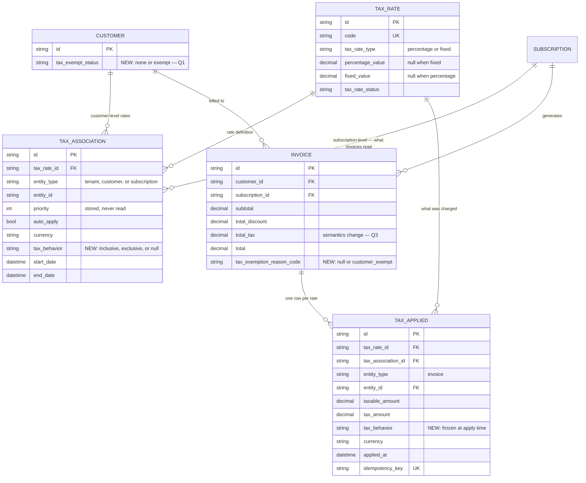
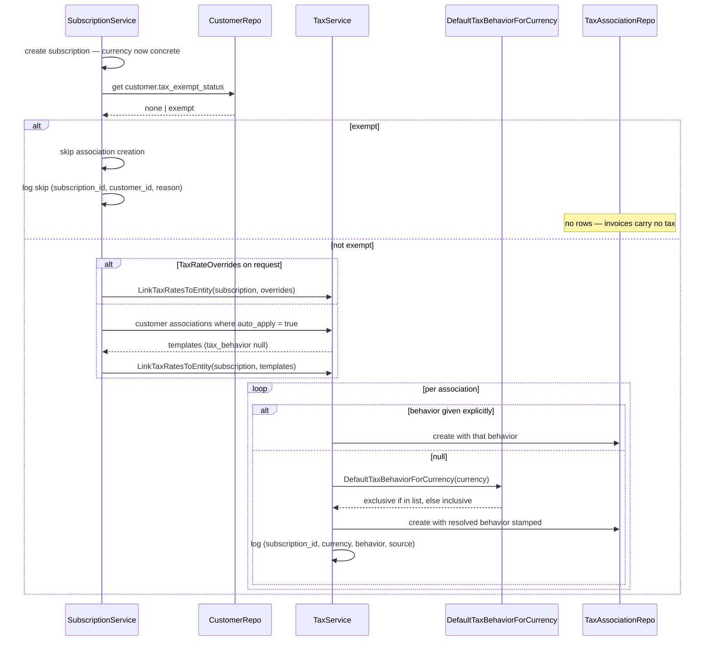
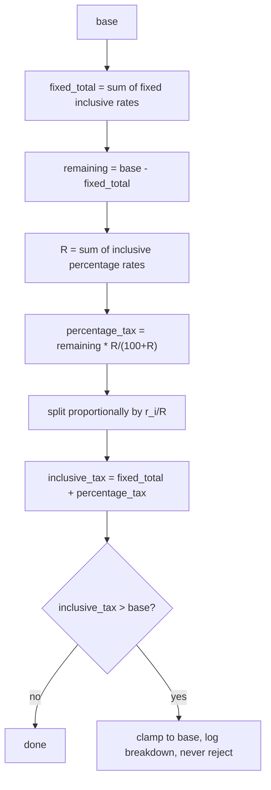
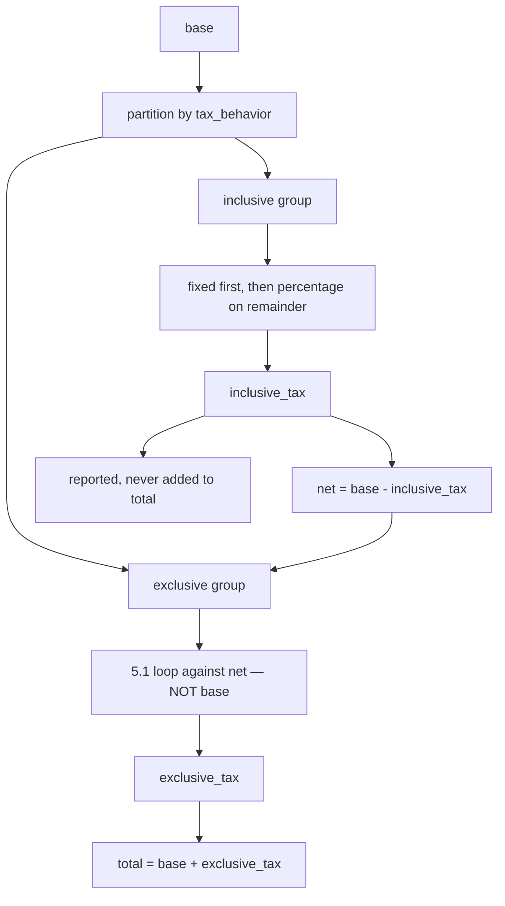
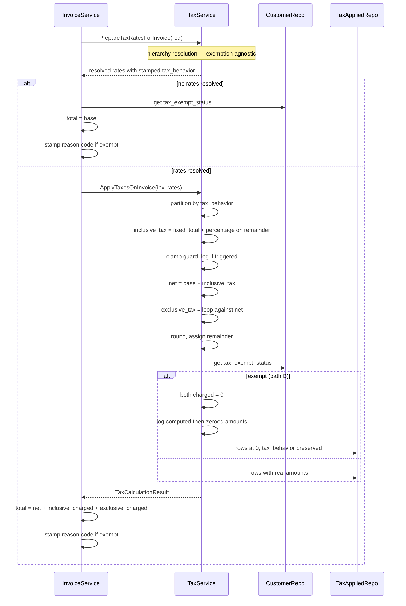

# Taxation — Inclusive / Exclusive / Exemption — Design ERD

Status: **Proposed** — v1 (invoice level)
Date: 2026-08-17
Author: Subrat Sahil Gupta
Related: `internal/ee/service/tax.go`, `ent/schema/taxassociation.go`, `ent/schema/taxapplied.go`

---

## 1. Problem

Tax is exclusive-only today — always added on top of `taxableAmount(inv) = subtotal - discount`
(`internal/ee/service/tax.go:1015-1041`). No inclusive concept, no exemption concept.
`TaxRateType` (`percentage` / `fixed`) governs how a rate's amount is computed, not whether it is
already contained in the price.

**v1:** inclusive, exclusive, mixed, and customer exemption — all at invoice level.

## 2. Scope

| In v1 | Not in v1 |
|---|---|
| `tax_behavior` on `TaxAssociation` | Line-item / price-level tax |
| Mixed inclusive + exclusive on one invoice | Discount carry-down to line items |
| Fixed and percentage rates, both behaviors | Per-tenant configurable currency default |
| Per-currency default (compiled list) | Reverse charge — enum reserved, not built |
| Customer exemption | Jurisdiction / nexus detection |
| Exclusive math — unchanged | Exemption certificate validation |

### 2.1 Terminology

| Term | Definition |
|---|---|
| `base` | `subtotal − discount`. Unchanged from today's `taxableAmount()`. What tax is computed **from**. Given. |
| `inclusive_tax` | Tax already inside `base`, recovered by reverse calculation. Derived. |
| `net` | `base − inclusive_tax`. Derived — never an input. |
| `exclusive_tax` | Tax added on top, computed against `net`. Derived. |

`base` and `net` are never interchangeable. Any formula that appears to "solve for base" from a total
is solving for `net`.

---

## 3. Schema



### 3.1 Enums

```go
// internal/types

type TaxBehavior string

const (
    TaxBehaviorInclusive TaxBehavior = "inclusive"
    TaxBehaviorExclusive TaxBehavior = "exclusive"
)

type TaxExemptStatus string

const (
    TaxExemptStatusNone   TaxExemptStatus = "none"
    TaxExemptStatusExempt TaxExemptStatus = "exempt"
    // "reverse" reserved, not implemented in v1
)

// TaxExemptionReason is stored in invoices.tax_exemption_reason_code and surfaced
// as tax_summary.exemption.reason_code.
type TaxExemptionReason string

const (
    TaxExemptionReasonCustomerExempt TaxExemptionReason = "customer_exempt"
    // "reverse_charge" reserved, not implemented in v1
)

// DisplayLabel is surfaced as tax_summary.exemption.reason. Derived, never stored.
func (r TaxExemptionReason) DisplayLabel() string {
    switch r {
    case TaxExemptionReasonCustomerExempt:
        return "Customer is tax exempt"
    default:
        return string(r)
    }
}
```

### 3.2 Field rationale

**`TaxAssociation.tax_behavior`** — nullable. On the association rather than `TaxRate` because the
same 18% GST rate can be inclusive under one contract and exclusive under another; putting it on the
rate would force cloning the rate per contract.

Nullable because tenant- and customer-level associations have no single currency to resolve against —
they get copied down to subscriptions in different currencies. Only subscription-level rows get a
concrete value (§4).

**`TaxApplied.tax_behavior`** — frozen at apply time. The association can be archived and replaced, or
the currency list can change in a later release; the applied record must stay true to what was charged
then. Genuinely per-row: one row inclusive, another exclusive on the same invoice.

**`Invoice.tax_exemption_reason_code`** — nullable, holds the reason **code**. Named `_code` because
that is what it stores. The response exposes two fields from this one column:

| Response field | Source |
|---|---|
| `tax_summary.exemption.reason_code` | stored column verbatim |
| `tax_summary.exemption.reason` | derived via `DisplayLabel()` — never stored |

Storing the display string would duplicate state fully determined by the code, force a migration to
reword it, and block localisation.

**No per-row exemption reason on `TaxApplied`** — exemption in v1 is one customer-level flag applied
uniformly, so every zeroed row on an invoice is zeroed for the same reason, stated once on the invoice.
A `$0` row stays unambiguous: invoice reason set → exemption; `null` → ordinary reason (0% rate, or
`base` zero after full discount). Only **partial exemption** (per rate / jurisdiction / product) would
require it, and that is not v1.

**`priority`** — accepted by the API, validated, persisted, never read in the resolution path. Every
`auto_apply = true` association applies; nothing sorts by priority. Unchanged in v1, noted so nobody
assumes otherwise.

### 3.3 Currency default

```go
// internal/types

// ExclusiveTaxCurrencies lists currencies whose default tax behavior is exclusive when
// an association is created without an explicit behavior. Everything else defaults to
// inclusive. Compiled-in convention — no UI, no API, no per-tenant override.
var ExclusiveTaxCurrencies = []string{"USD", "CAD"}

func DefaultTaxBehaviorForCurrency(currency string) TaxBehavior {
    if lo.Contains(ExclusiveTaxCurrencies, strings.ToUpper(currency)) {
        return TaxBehaviorExclusive
    }
    return TaxBehaviorInclusive
}
```

A slice matches `EntityHierarchy` in the same package (`internal/types/taxassociation.go:29`).

---

## 4. Resolution

`tax_behavior` decides **how** a resolved rate is treated, never **whether** it applies. The
tenant → customer → subscription hierarchy is untouched.

### 4.1 Stamped once, at subscription-association creation

`PrepareTaxRatesForInvoice` only reads subscription-entity associations or explicit request overrides —
never customer or tenant rows directly (`internal/ee/service/tax.go:953-996`). A subscription has a
concrete `Currency` from creation. So the currency list is consulted once, at the only point where
currency is known and the row being created is the one invoices will actually read. Invoice compute
never touches the list.

### 4.2 Exemption checked before associations are created

If the customer is exempt when a subscription is created, **no subscription-level associations are
created**. Nothing to resolve later means nothing to compute later.

This creates a behavioral split that must be understood before implementing — §8.1, and Q2.

### 4.3 Sequence



### 4.4 Rollout backfill

Every existing `TaxAssociation` is backfilled with `tax_behavior = exclusive` in one migration before
the feature is enabled. Otherwise every row would be `null`, and any tenant invoicing outside the
exclusive currency list would silently flip from exclusive — the only behavior that has ever existed —
to inclusive on deploy day.

---

## 5. Calculation

### 5.1 Exclusive — unchanged

`base` is computed once outside the loop and passed to every rate regardless of type or order
(`internal/ee/service/tax.go:1024-1041`):

- **Percentage:** `tax_i = base × r_i / 100`
- **Fixed:** `tax_i = FixedValue` — no multiplication (`internal/ee/service/tax.go:1110-1118`)

Rates are independent, results summed, order irrelevant
(`base×r1/100 + base×r2/100 = base×(r1+r2)/100`). That independence is what inclusive tax does **not**
have.

### 5.2 Inclusive — extraction

```
Let net = the tax-free amount, r = the rate percentage.

base = net + (net × r/100)          the price already contains its own tax
     = net × (100+r)/100

net  = base × 100/(100+r)           solve for net
tax  = base − net
     = base − base × 100/(100+r)
     = base × [1 − 100/(100+r)]
     = base × r/(100+r)
```

**Multiple percentage rates cannot each run this independently.** Every run implicitly claims that rate
alone accounts for the whole difference between `base` and `net`. Two rates both claiming that produce
two contradictory values for `net`:

```
base = 1000, rates 9% and 5%

WRONG — extracted independently:
  tax@9% = 1000 × 9/109 = 82.57      implies net = 917.43
  tax@5% = 1000 × 5/105 = 47.62      implies net = 952.38
  sum    = 130.19                     two different nets — both cannot be true

CORRECT — combine, extract once, split:
  R         = 9 + 5 = 14
  total_tax = 1000 × 14/114 = 122.81  implies net = 877.19
  tax@9%    = 122.81 × (9/14) = 78.95
  tax@5%    = 122.81 × (5/14) = 43.86
```

**Split is proportional to each rate's share of `R`, never an equal division.** Equal split would give
61.41 each — wrong; the 9% line must carry more, in the ratio 9:5.

### 5.2.1 Fixed rates in the inclusive group

A fixed inclusive rate has no percentage, so it cannot go into `R` — `9% + $100` is not a sum. Fixed
amounts come out **first**, percentage extraction runs on the remainder:



`base = 1000`, fixed inclusive `100`, percentage inclusive `10%`:

```
fixed_total    = 100
remaining      = 1000 − 100 = 900
percentage_tax = 900 × 10/110 = 81.82     from 900, NOT from 1000
inclusive_tax  = 100 + 81.82 = 181.82
net            = 818.18
total          = 1000                      unchanged — tax was always inside
```

Running the percentage against `1000` would count the fixed `100` twice.

**Overflow guard:** invariant is `inclusive_tax ≤ base`, checked once on the combined total, not per
rate type. Percentage extraction cannot violate it (`base × r/(100+r) < base` always); a fixed amount
has no ceiling. On violation, **clamp to `base`, never reject** — consistent with `calculateTaxAmount`,
which logs and skips bad rate data rather than failing the invoice
(`internal/ee/service/tax.go:1103-1106`). Always a config error, so the log must carry the full
breakdown (§9).

### 5.3 Mixed

Exclusive rates run against `net`, not raw `base` — the inclusive tax has already claimed part of that
money.



```
1. inclusive_tax = extract from base
2. net           = base − inclusive_tax
3. exclusive_tax = 5.1 loop against net
4. total         = base + exclusive_tax
```

`base = 1000`, fixed inclusive `100`, percentage inclusive `10%`, percentage exclusive `18%`:

```
inclusive_tax = 100 + (900 × 10/110) = 181.82
net           = 818.18
exclusive_tax = 818.18 × 18/100 = 147.27      18% of net, not of 1000
total         = 1000 + 147.27 = 1147.27
```

Only exclusive tax moves the total.

### 5.4 Rounding

| Group | Invariant | Rule |
|---|---|---|
| Inclusive | `net + inclusive_tax == base` exactly | Round the combined result once, then split. Stray cent goes to one deterministic line — Q4 |
| Exclusive | Unchanged | Round each rate, then sum |

Rounding happens before exemption is applied, so exemption never interacts with remainder assignment.

---

## 6. Exemption

### 6.1 Two paths

| Path | When | Invoice sees | Result |
|---|---|---|---|
| **A** | Customer already exempt at subscription creation (§4.2) | No associations | No tax computed. `total = base` |
| **B** | Customer became exempt after the subscription existed | Associations resolve normally | Tax computed in full, then zeroed. Inclusive tax comes out of the total |

They produce different totals for the same plan — §8.1, Q2.

### 6.2 Path B — back out the tax

Tax is computed **as though the customer were not exempt**, then zeroed. For inclusive rates the
extracted amount also comes out of what the customer pays: an inclusive rate states that part of the
listed price is tax; if that tax is not owed, it should not be collected.

`base = 100`, one 10% rate:

| | Not exempt | Exempt |
|---|---|---|
| 10% inclusive | pays **100.00** (9.09 collected) | pays **90.91** (0 collected) |
| 10% exclusive | pays **110.00** (10.00 collected) | pays **100.00** (0 collected) |

### 6.3 General formula

```
inclusive_tax     = extracted per 5.2 / 5.2.1     computed regardless of exemption
net               = base − inclusive_tax          computed regardless of exemption
exclusive_tax     = 5.1 loop against net          computed regardless of exemption

exempt            = customer.tax_exempt_status != none

inclusive_charged = exempt ? 0 : inclusive_tax
exclusive_charged = exempt ? 0 : exclusive_tax

total = net + inclusive_charged + exclusive_charged
```

| Case | `net` | `total` |
|---|---|---|
| Not exempt, exclusive only | `base` | `base + exclusive_tax` — today's behavior |
| Not exempt, inclusive only | `base − inclusive_tax` | `base` |
| Not exempt, mixed | `base − inclusive_tax` | `base + exclusive_tax` |
| Exempt B, exclusive only | `base` | `base` |
| Exempt B, inclusive only | `base − inclusive_tax` | `net` |
| Exempt B, mixed | `base − inclusive_tax` | `net` |
| Exempt A | `base` | `base` |

Under path B with inclusive rates `total` drops **below** `base`, so `total = base + total_tax` no
longer holds. This is the one existing invariant v1 changes, intentionally.

**Why exemption cannot skip the calculation:** `inclusive_tax` is load-bearing — `total = net` depends
on it. `exclusive_tax` is genuinely discardable when exempt (it is zeroed and appears nowhere else),
but it is still computed, to keep exemption a single override at the end rather than a branch inside
the calculation, and to keep the waived figure available for logging (§9).

### 6.4 Recorded once, on the invoice

Under path A no `TaxApplied` rows exist, so nothing per-row can carry the flag:

| Situation | `taxes[]` | `total_tax` | Distinguishable? |
|---|---|---|---|
| No tax configured, not exempt | empty | 0 | — |
| Exempt, path A | empty | 0 | **No — identical** |

`Invoice.tax_exemption_reason_code` is the only thing separating them. `Customer.tax_exempt_status`
stays the live source of truth; the invoice column is a frozen snapshot at compute time, so changing a
customer's status later does not rewrite historical invoices.

Under path B, `TaxApplied` rows are still written at `tax_amount = 0` with their `tax_behavior` — never
omitted, so the audit trail records which rates were evaluated.

### 6.5 Compute sequence



Resolution (§4) and calculation (§5) are both exemption-agnostic. Exemption applies at exactly one
point, after everything is computed — that is what prevents an `exempt × inclusive × fixed × mixed`
matrix of special cases.

---

## 7. API response

### 7.1 Normal — mixed inclusive and exclusive

`base = 1000`, 10% inclusive, 18% exclusive:

```jsonc
{
  "subtotal": "1000.00",
  "total_discount": "0.00",
  "total_tax": "254.55",

  "tax_summary": {
    "inclusive_tax": "90.91",
    "exclusive_tax": "163.64",
    "exemption": null
  },

  "total": "1163.64",
  "amount_due": "1163.64",

  "taxes": [
    {
      "id": "taxapp_...",
      "tax_rate_id": "txr_gst",
      "entity_type": "invoice",
      "entity_id": "inv_...",
      "tax_behavior": "inclusive",
      "taxable_amount": "1000.00",
      "tax_amount": "90.91",
      "currency": "USD"
    },
    {
      "id": "taxapp_...",
      "tax_rate_id": "txr_vat",
      "entity_type": "invoice",
      "entity_id": "inv_...",
      "tax_behavior": "exclusive",
      "taxable_amount": "909.09",
      "tax_amount": "163.64",
      "currency": "USD"
    }
  ]
}
```

The inclusive row's `taxable_amount` is `base`; the exclusive row's is `net`. That difference is the
§5.3 cascade visible in the response.

`total_tax` is the sum of both kinds, but `total` only moved by the exclusive portion — **this changes
what `total_tax` means**, Q3.

### 7.2 Exempt

```jsonc
{
  "subtotal": "1000.00",
  "total_discount": "0.00",
  "total_tax": "0.00",

  "tax_summary": {
    "inclusive_tax": "0.00",
    "exclusive_tax": "0.00",
    "exemption": {
      "reason_code": "customer_exempt",
      "reason": "Customer is tax exempt"
    }
  },

  "total": "1000.00",
  "amount_due": "1000.00",

  "taxes": []
}
```

Path A — no associations existed, `taxes` empty, `total = base`. Under path B, `taxes[]` is populated
with rows at `"0.00"` and `total` is `net` if any inclusive rate was involved. The `exemption` object
is identical in both paths and is the only thing distinguishing an exempt invoice from an ordinary
untaxed one.

`reason_code` is the stored enum; `reason` is derived (§3.2).

---

## 8. Edge cases

### 8.1 Same customer, same plan, two different totals

Customer on a `1000` plan with one 10% inclusive rate at customer level:

| Order of events | Result |
|---|---|
| Marked exempt **first**, then subscribed | §4.2 skips associations. No rates resolve. Pays **1000.00** |
| Subscribed **first**, then marked exempt | Associations exist. Tax computed, zeroed, inclusive backed out. Pays **909.09** |

Same customer, same plan, same exemption status at invoice time — **90.91 difference**, decided by the
order of two unrelated actions weeks apart.

Path A optimizes by never creating associations, so the invoice has no way to know what rates *would*
have applied and nothing to back out. Path B knows because the rows survive. Not a bug in either path
alone; a consequence of having both. **Q2.**

### 8.2 Exemption removed later

Under path A no associations were ever created. Removing the exemption later does **nothing** —
nothing re-runs the customer → subscription copy-down after creation
(`internal/ee/service/subscription.go:1032-1069`), so the subscription stays untaxed indefinitely.

Whoever removes the exemption must also create the subscription-level associations, or the customer is
silently never taxed.

### 8.3 Inclusive tax exceeds base

A fixed inclusive rate of `100` on a `base` of `30` would compute `net = −70`. The clamp forces
`inclusive_tax = 30`, `net = 0`, customer pays nothing.

Strange invoice, correct outcome for a nonsensical config. Rejecting instead would mean a bad rate
silently stops billing that customer entirely — worse. The clamp keeps billing running and surfaces
the problem through logs.

### 8.4 No rates resolve, customer not exempt

`taxes` empty, `total_tax` zero, `exemption` null, `total = base`. Legitimate and common — most tenants
have no tax configured. Distinguished from an exempt invoice purely by `exemption` being null (§6.4).

### 8.5 Currency outside the exclusive list, no explicit behavior

An INR subscription with no explicit `tax_behavior` is stamped `inclusive`, because INR is not in the
list. Intended, but **silent** — it changes how much the customer is charged, and nothing in the
request said so. Hence the `source=currency_default` log (§9).

Safer pattern: always pass `tax_behavior` explicitly; treat the currency default as a fallback for
callers that do not care.

### 8.6 Behavior changed after invoices exist

`tax_behavior` is frozen onto every `TaxApplied` row at apply time, so historical invoices keep what
was frozen. But **recomputing** an existing invoice picks up the new behavior and produces a different
total than the original. Whether recompute should be blocked when behavior changed since first compute
is not decided in v1.

### 8.7 Inclusive consumes everything, exclusive still charges

If `inclusive_tax` clamps to `base` (§8.3), `net = 0`, so percentage exclusive rates compute to zero.
**Fixed exclusive rates are unaffected** — they never multiply against anything (§5.1), so a fixed
exclusive rate of `50` still adds `50`. An invoice can end up `total = 50` on a `base` of `30`.
Degenerate but well-defined.

---

## 9. Logging

Convention: `internal/logger`, ctx first, literal `"error"` key on `Error`, no `fmt.Print*`. `Warn` is
bootstrap-only per `AGENTS.md`, so recovered and skipped conditions log at `Info`.

Everything below must be logged. Tax math that cannot be reconstructed from logs is not debuggable
after the fact — the intermediate values exist nowhere in the response.

| # | Event | Level | Fields |
|---|---|---|---|
| L1 | Behavior stamped from currency default (§4.3) | Info | `subscription_id`, `tax_rate_id`, `currency`, `resolved_behavior`, `source=currency_default` |
| L2 | Behavior taken from explicit input (§4.3) | Info | `subscription_id`, `tax_rate_id`, `behavior`, `source=explicit` |
| L3 | Association creation skipped, exempt customer (§4.2) | Info | `subscription_id`, `customer_id`, `reason=customer_exempt` |
| L4 | Rollout backfill (§4.4) | Info | `rows_scanned`, `rows_updated` |
| L5 | Inclusive extraction computed (§5.2.1) | Info | `invoice_id`, `base`, `fixed_total`, `combined_rate`, `percentage_tax`, `inclusive_tax`, `net` |
| L6 | Clamp triggered (§5.2.1) | Info | everything in L5 plus `pre_clamp_inclusive_tax`, `clamped_to` |
| L7 | Exclusive computed against net (§5.3) | Info | `invoice_id`, `net`, per-rate `tax_rate_id` and amount, `exclusive_tax` |
| L8 | Rounding remainder assigned (§5.4) | Info | `invoice_id`, `tax_rate_id` that absorbed it, `remainder` |
| L9 | Exemption applied, path B (§6.2) | Info | `invoice_id`, `customer_id`, `waived_inclusive_tax`, `waived_exclusive_tax`, `total_before`, `total_after` |
| L10 | Exemption applied, path A (§6.1) | Info | `invoice_id`, `customer_id`, `rates_resolved=0` |
| L11 | Zero rates resolved, not exempt (§8.4) | Info | `invoice_id`, `subscription_id` |
| L12 | Rate skipped — missing percentage or fixed value | Info | `invoice_id`, `tax_rate_id`, `tax_rate_type` (existing behavior, `internal/ee/service/tax.go:1103-1106`) |

L5 and L7 together let any invoice's tax be recomputed by hand from logs alone. L9 is the only record
of what was waived — those amounts appear nowhere in the response or the DB.

---

## 10. Phase 2 — not designed here

Line-item-level tax (`invoice_line_item` below `invoice`). Blocked on discount carry-down.

- **Live resolution, not copy-down.** `tenant → customer → subscription` copies rows at creation;
  `subscription → invoice` resolves live with no persisted row (`internal/ee/service/tax.go:953-996`).
  `invoice → invoice_line_item` should extend the live pattern — lines are created on every cycle and
  recompute, so a persisted row per line is wasted writes for the common inherit-everything case.
- **Override-only writes** — a line-item association row only when that line actually overrides.
- **Discount carry-down (the blocker)** — `TotalDiscount` is one invoice-level number today
  (`internal/ee/service/tax.go:1016`). Per-line tax needs a per-line base, which needs a decided rule
  for splitting the discount across lines. Proportional to line amount is standard, not assumed.
- **`TaxApplied` cardinality** — per-line rows break the cheap `entity_type = invoice` rollup used by
  PDF rendering (`internal/ee/service/invoice.go:642-644`). Needs an indexed `invoice_id`.
- **Does §5.3's partition work per line, or stay invoice-wide?** Undecided.

**What v1 does to stay ready:** every calculation function takes `base` as a parameter rather than
reading `inv.Subtotal` internally. Phase 2 calls the same functions per line with that line's base and
rolls results up — the math does not change, only what computes `base` and how results aggregate.


---

## 11. Open questions

| # | Question | Blocks |
|---|---|---|
| Q1 | Is `Customer.tax_exempt_status` the right home for exemption? | Schema |
| Q2 | Path A vs B produce different totals (§8.1) — which wins? | Implementation |
| Q3 | Does `total_tax` change meaning? | API contract |
| Q4 | Rounding remainder — which line absorbs the cent? | Implementation |
| Q5 | Is `tax_behavior` updatable on an existing association? | API contract |

**Q1 — exemption home.** *Proposed:* enum column on `Customer` (`none` / `exempt`), mutable, live
source of truth; invoices snapshot it at compute time. Customer level because exemption is a property
of the buying entity — a non-profit is exempt regardless of plan. On `TaxAssociation` it would need
setting repeatedly; on `Subscription` the same legal entity could be exempt on one subscription and not
another, which is not what exemption means.

*Open:* whether one flag is enough, or exemption needs scoping — per jurisdiction, per subscription, or
with validity dates (a certificate that expires). v1 has one flag, no expiry, no scope.

**Q2 — path A vs path B (§8.1).** *Proposed:* both paths as described. *Problem:* they disagree by
90.91 on identical inputs.

- **(a) Always create associations, never skip.** Drop §4.2. Exemption applies only at compute via
  §6.3. One code path, one outcome. Costs some rows that always compute to zero. Removes §8.1 and §8.2
  outright.
- **(b) Keep the skip, accept the inconsistency.** Cheapest; the divergence will eventually be reported
  as a billing bug.
- **(c) Keep the skip, re-run copy-down when exemption is removed.** Also fixes §8.2, but nothing today
  re-runs copy-down after subscription creation — new machinery.

**Q3 — `total_tax` semantics.** *Proposed (§7.1):* `total_tax` becomes inclusive + exclusive, with
`tax_summary` carrying the split.

*Problem:* today `total = subtotal − discount + total_tax` always holds. Under the proposal it does
not — a consumer computing a total from `subtotal` and `total_tax` gets `1254.55` instead of `1163.64`.
Breaking semantic change to an existing field, and it breaks silently.

*Alternative not chosen:* keep `total_tax` meaning exactly what it means today (exclusive only) and put
the extracted figure in a new sibling field. Non-breaking, but leaves two fields that both look like
"the tax on this invoice."

If the proposal stands, every existing consumer of `total_tax` needs auditing before release.

**Q4 — rounding remainder.** The proportional split rarely divides into whole cents. Three rates —
9%, 5%, 3% (`R = 17`) — on `base = 1000`:

```
total_tax = 1000 × 17/117 = 145.2991... → rounded = 145.30
shares    = 76.9235... / 42.7353... / 25.6412...
rounded   = 76.92 + 42.74 + 25.64 = 145.30    reconciles here
```

Other inputs do not — independently rounded parts can sum to 145.29 or 145.31 against a `total_tax` of
145.30. One line must absorb the difference:

| Rule | Trade-off |
|---|---|
| Largest rate absorbs | Simple; that line stops being a clean function of its own rate |
| Largest unrounded remainder absorbs | Most defensible; slightly more code |
| First / last by rate ID | Simplest; weakest explanation to a customer |

Must be fixed permanently — a varying rule means the same invoice recomputed produces different
per-rate lines for identical total tax, breaking reproducibility and making `TaxApplied` useless for
audit.

**Q5 — is `tax_behavior` updatable?** *Proposed:* yes, on `TaxAssociationUpdateRequest`.

*Against:* `UpdateTaxAssociation` currently allows `priority`, `auto_apply`, `metadata`
(`internal/ee/service/tax.go:664-674`) — all affecting only future invoices in obvious ways.
`tax_behavior` changes the arithmetic of every future invoice, and retroactively changes any invoice
that gets recomputed (§8.6). Precedent exists for blocking this: `UpdateTaxRate` refuses to update a
rate that has any associations or applied records (`internal/ee/service/tax.go:178-220`).

- **(a) Allow freely.** Simplest; recompute risk unguarded.
- **(b) Block entirely.** Archive-and-replace is already the delete semantic
  (`internal/repository/ent/taxassociation.go:194-203`), so this costs nothing structurally.
- **(c) Allow only when no `TaxApplied` row references the association**, mirroring `UpdateTaxRate`.
