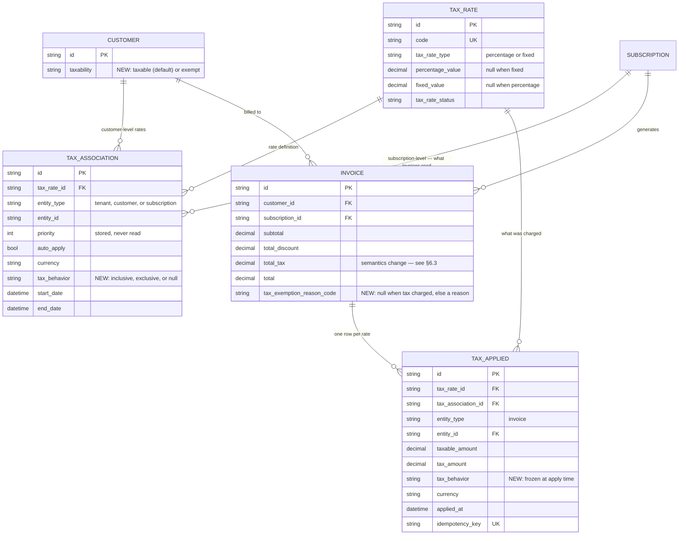
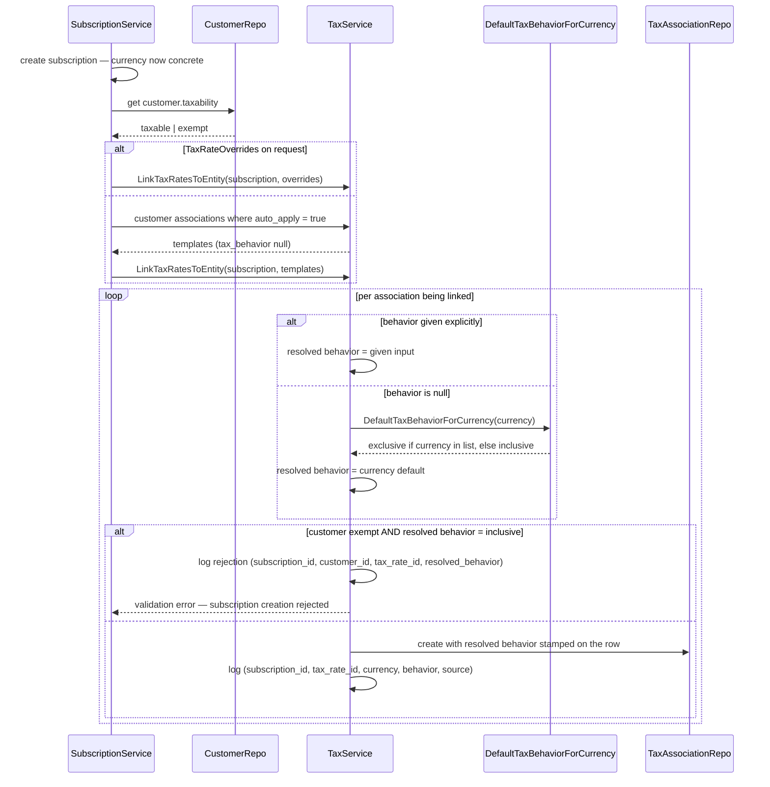
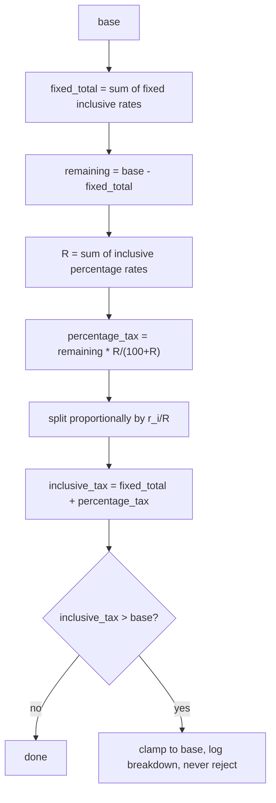
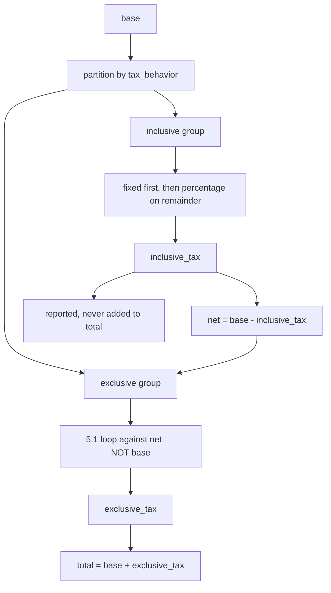
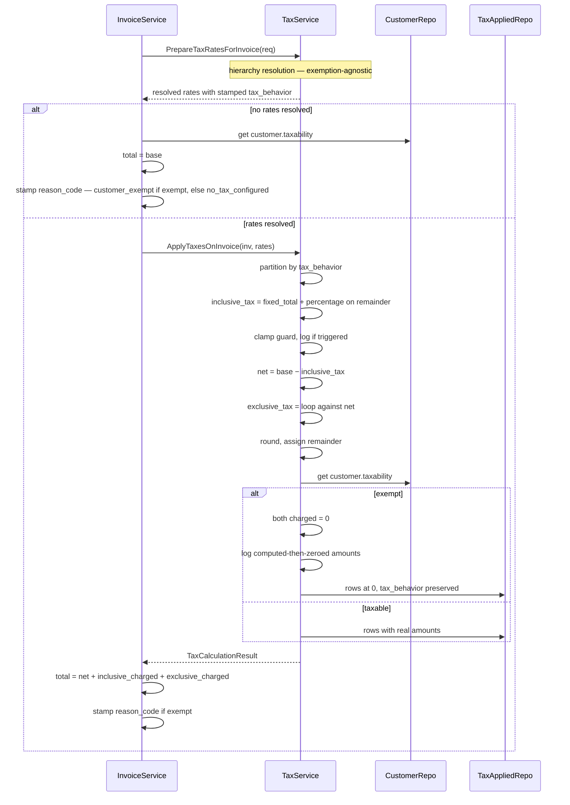

# Taxation — Inclusive / Exclusive / Exemption — Design ERD

Status: **Finalized** — v1 (invoice level). All open questions resolved (§11).
Date: 2026-08-17
Author: Subrat Sahil Gupta
Related: `internal/ee/service/tax.go`, `ent/schema/taxassociation.go`, `ent/schema/taxapplied.go`

---

## 1. Problem

Tax is exclusive-only today — always added on top of `taxableAmount(inv) = subtotal - discount`
(`internal/ee/service/tax.go:1015-1041`). No inclusive concept, no exemption concept.
`TaxRateType` (`percentage` / `fixed`) governs how a rate's amount is computed, not whether it is
already contained in the price.

**v1:** inclusive, exclusive, mixed, and customer exemption — all at invoice level.

## 2. Scope

| In v1 | Not in v1 |
|---|---|
| `tax_behavior` on `TaxAssociation` | Line-item / price-level tax |
| Mixed inclusive + exclusive on one invoice | Discount carry-down to line items |
| Fixed and percentage rates, both behaviors | Per-tenant configurable currency default |
| Per-currency default (compiled list) | Reverse charge — enum reserved, not built |
| Customer exemption | Jurisdiction / nexus detection |
| Exclusive math — unchanged | Exemption certificate validation |

### 2.1 Terminology

| Term | Definition |
|---|---|
| `base` | `subtotal − discount`. Unchanged from today's `taxableAmount()`. What tax is computed **from**. Given. |
| `inclusive_tax` | Tax already inside `base`, recovered by reverse calculation. Derived. |
| `net` | `base − inclusive_tax`. Derived — never an input. |
| `exclusive_tax` | Tax added on top, computed against `net`. Derived. |

`base` and `net` are never interchangeable. Any formula that appears to "solve for base" from a total
is solving for `net`.

---

## 3. Schema



### 3.1 Enums

```go
// internal/types

type TaxBehavior string

const (
    TaxBehaviorInclusive TaxBehavior = "inclusive"
    TaxBehaviorExclusive TaxBehavior = "exclusive"
)

// Taxability is the customer's tax treatment. Defaults to taxable.
type Taxability string

const (
    TaxabilityTaxable Taxability = "taxable"
    TaxabilityExempt  Taxability = "exempt"
    // "reverse_charge" reserved, not implemented in v1
)

// TaxExemptionReason is stored in invoices.tax_exemption_reason_code and surfaced
// as tax_summary.exemption.reason_code.
type TaxExemptionReason string

const (
    TaxExemptionReasonCustomerExempt  TaxExemptionReason = "customer_exempt"
    TaxExemptionReasonNoTaxConfigured TaxExemptionReason = "no_tax_configured"
    // "reverse_charge" reserved, not implemented in v1
)

// DisplayLabel is surfaced as tax_summary.exemption.reason. Derived, never stored.
func (r TaxExemptionReason) DisplayLabel() string {
    switch r {
    case TaxExemptionReasonCustomerExempt:
        return "Customer is tax exempt"
    case TaxExemptionReasonNoTaxConfigured:
        return "No tax configured"
    default:
        return string(r)
    }
}
```

### 3.2 Field rationale

**`TaxAssociation.tax_behavior`** — nullable. On the association rather than `TaxRate` because the
same 18% GST rate can be inclusive under one contract and exclusive under another; putting it on the
rate would force cloning the rate per contract.

Nullable because tenant- and customer-level associations have no single currency to resolve against —
they get copied down to subscriptions in different currencies. Only subscription-level rows get a
concrete value (§4).

**`TaxApplied.tax_behavior`** — frozen at apply time. The association can be archived and replaced, or
the currency list can change in a later release; the applied record must stay true to what was charged
then. Genuinely per-row: one row inclusive, another exclusive on the same invoice.

**`Invoice.tax_exemption_reason_code`** — nullable, holds the reason **code**. Named `_code` because
that is what it stores. The response exposes two fields from this one column:

| Response field | Source |
|---|---|
| `tax_summary.exemption.reason_code` | stored column verbatim |
| `tax_summary.exemption.reason` | derived via `DisplayLabel()` — never stored |

Storing the display string would duplicate state fully determined by the code, force a migration to
reword it, and block localisation.

**No per-row exemption reason on `TaxApplied`** — exemption in v1 is one customer-level flag applied
uniformly, so every zeroed row on an invoice is zeroed for the same reason, stated once on the invoice.
A `$0` row stays unambiguous — the invoice's reason code says why (§6.4). Only **partial exemption**
(per rate / jurisdiction / product) would need a per-row reason, and that is not v1.

**`Customer.taxability`** — `taxable` (default) or `exempt`. Every customer is taxable unless
explicitly marked otherwise, so existing rows need no backfill beyond the column default. Customer
level because exemption is a property of the buying entity — a non-profit is exempt regardless of plan.
On `TaxAssociation` it would need setting repeatedly; on `Subscription` the same legal entity could be
exempt on one subscription and not another, which is not what exemption means.

**`priority`** — accepted by the API, validated, persisted, never read in the resolution path. Every
`auto_apply = true` association applies; nothing sorts by priority. Unchanged in v1, noted so nobody
assumes otherwise.

### 3.3 Validation

| Rule | Where | Reason |
|---|---|---|
| `percentage_value` and `fixed_value` mutually exclusive | Exists today (`internal/api/dto/taxrate.go:90-124`) | A rate is one or the other |
| `percentage_value` in 0–100 | Exists today | — |
| **A percentage rate above 100% cannot be `inclusive`** | New, at association creation | An inclusive rate above 100% means the tax exceeds the tax-free price it is derived from. The extraction still computes (`base × r/(100+r)` stays below `base` for any positive `r`), so nothing breaks numerically — it is rejected because it is a configuration error, not because the math fails. Reject at creation rather than clamping at compute, so it never reaches an invoice |
| Combined inclusive rate is **not** capped at 100% | — | Multiple valid rates can sum past 100 (60% + 50%). The per-rate check is the guard; the combined figure is only used for extraction |
| **A subscription cannot resolve an inclusive association while `taxability = exempt`** | New, at subscription creation | §4.2 |

### 3.4 Currency default

```go
// internal/types

// ExclusiveTaxCurrencies lists currencies whose default tax behavior is exclusive when
// an association is created without an explicit behavior. Everything else defaults to
// inclusive. Compiled-in convention — no UI, no API, no per-tenant override.
var ExclusiveTaxCurrencies = []string{"USD", "CAD"}

func DefaultTaxBehaviorForCurrency(currency string) TaxBehavior {
    if lo.Contains(ExclusiveTaxCurrencies, strings.ToUpper(currency)) {
        return TaxBehaviorExclusive
    }
    return TaxBehaviorInclusive
}
```

A slice matches `EntityHierarchy` in the same package (`internal/types/taxassociation.go:29`).

---

## 4. Resolution

`tax_behavior` decides **how** a resolved rate is treated, never **whether** it applies. The
tenant → customer → subscription hierarchy is untouched.

### 4.1 Stamped once, at subscription-association creation

`PrepareTaxRatesForInvoice` only reads subscription-entity associations or explicit request overrides —
never customer or tenant rows directly (`internal/ee/service/tax.go:953-996`). A subscription has a
concrete `Currency` from creation. So the currency list is consulted once, at the only point where
currency is known and the row being created is the one invoices will actually read. Invoice compute
never touches the list.

### 4.2 Exemption is validated at subscription creation, not skipped

Tax associations are created for **every** subscription, including an exempt customer's — there is no
"skip creation for exempt customers" path. What gates an exempt customer is validation, not omission:

**If `customer.taxability = exempt` and the association being linked resolves to
`tax_behavior = inclusive`, subscription creation is rejected.**

This is a product convention as much as a technical one: a tenant selling both tax-inclusive and
tax-exclusive priced plans must put an exempt customer on the exclusive one. An inclusive price is a
statement that tax is baked into what the customer sees — an exempt customer must be quoted a price
that was never computed with tax in it to begin with.

Exclusive associations, and subscriptions with no tax association at all, are unaffected by this check
— both already converge to `total = base` for an exempt customer whether or not the association exists
(§6.3), so there is nothing to reject.

This closes the two-different-totals problem (§8.1) for every **new** subscription. It does not reach a
customer who becomes exempt *after* they are already on an inclusive-tax subscription — that is a
`taxability` update, not a subscription-creation event, and this check only runs at creation. §8.1
covers what happens there.

### 4.3 Sequence



Every association creation is logged, whether stamped from the currency default or from explicit
input, and the rejection path is logged separately — nothing about this flow is silent (§9).

### 4.4 Rollout backfill

Every existing `TaxAssociation` is backfilled with `tax_behavior = exclusive` in one migration before
the feature is enabled. Otherwise every row would be `null`, and any tenant invoicing outside the
exclusive currency list would silently flip from exclusive — the only behavior that has ever existed —
to inclusive on deploy day.

---

## 5. Calculation

### 5.1 Exclusive — unchanged

`base` is computed once outside the loop and passed to every rate regardless of type or order
(`internal/ee/service/tax.go:1024-1041`):

- **Percentage:** `tax_i = base × r_i / 100`
- **Fixed:** `tax_i = FixedValue` — no multiplication (`internal/ee/service/tax.go:1110-1118`)

Rates are independent, results summed, order irrelevant
(`base×r1/100 + base×r2/100 = base×(r1+r2)/100`). That independence is what inclusive tax does **not**
have.

### 5.2 Inclusive — extraction

```
Let net = the tax-free amount, r = the rate percentage.

base = net + (net × r/100)          the price already contains its own tax
     = net × (100+r)/100

net  = base × 100/(100+r)           solve for net
tax  = base − net
     = base − base × 100/(100+r)
     = base × [1 − 100/(100+r)]
     = base × r/(100+r)
```

**Multiple percentage rates cannot each run this independently.** Every run implicitly claims that rate
alone accounts for the whole difference between `base` and `net`. Two rates both claiming that produce
two contradictory values for `net`:

```
base = 1000, rates 9% and 5%

WRONG — extracted independently:
  tax@9% = 1000 × 9/109 = 82.57      implies net = 917.43
  tax@5% = 1000 × 5/105 = 47.62      implies net = 952.38
  sum    = 130.19                     two different nets — both cannot be true

CORRECT — combine, extract once, split:
  R         = 9 + 5 = 14
  total_tax = 1000 × 14/114 = 122.81  implies net = 877.19
  tax@9%    = 122.81 × (9/14) = 78.95
  tax@5%    = 122.81 × (5/14) = 43.86
```

**Split is proportional to each rate's share of `R`, never an equal division.** Equal split would give
61.41 each — wrong; the 9% line must carry more, in the ratio 9:5.

### 5.2.1 Fixed rates in the inclusive group

A fixed inclusive rate has no percentage, so it cannot go into `R` — `9% + $100` is not a sum. Fixed
amounts come out **first**, percentage extraction runs on the remainder:



`base = 1000`, fixed inclusive `100`, percentage inclusive `10%`:

```
fixed_total    = 100
remaining      = 1000 − 100 = 900
percentage_tax = 900 × 10/110 = 81.82     from 900, NOT from 1000
inclusive_tax  = 100 + 81.82 = 181.82
net            = 818.18
total          = 1000                      unchanged — tax was always inside
```

Running the percentage against `1000` would count the fixed `100` twice.

**Overflow guard:** invariant is `inclusive_tax ≤ base`, checked once on the combined total, not per
rate type. Percentage extraction cannot violate it (`base × r/(100+r) < base` always); a fixed amount
has no ceiling. On violation, **clamp to `base`, never reject** — consistent with `calculateTaxAmount`,
which logs and skips bad rate data rather than failing the invoice
(`internal/ee/service/tax.go:1103-1106`). Always a config error, so the log must carry the full
breakdown (§9).

### 5.3 Mixed

Exclusive rates run against `net`, not raw `base` — the inclusive tax has already claimed part of that
money.



```
1. inclusive_tax = extract from base
2. net           = base − inclusive_tax
3. exclusive_tax = 5.1 loop against net
4. total         = base + exclusive_tax
```

`base = 1000`, fixed inclusive `100`, percentage inclusive `10%`, percentage exclusive `18%`:

```
inclusive_tax = 100 + (900 × 10/110) = 181.82
net           = 818.18
exclusive_tax = 818.18 × 18/100 = 147.27      18% of net, not of 1000
total         = 1000 + 147.27 = 1147.27
```

Only exclusive tax moves the total.

### 5.4 Rounding

| Group | Invariant | Rule |
|---|---|---|
| Inclusive | `net + inclusive_tax == base` exactly | Round the combined result once, then split proportionally. Independently-rounded shares can sum a cent off the rounded whole — assign the stray cent to one deterministic rate (largest share, or largest unrounded remainder). Precision handling, picked once during implementation and never varied afterward — not a design-level question |
| Exclusive | Unchanged | Round each rate, then sum |

Rounding happens before exemption is applied, so exemption never interacts with remainder assignment.
Whatever rule is picked must stay fixed — a rule that can vary between runs makes the same invoice,
recomputed, produce different per-rate `TaxApplied` lines for identical total tax, which breaks
reproducibility.

---

## 6. Exemption

### 6.1 Associations always exist; exemption is enforced by validation and by zeroing at compute

Every subscription gets its tax associations, exempt customer or not (§4.2). Two things keep an exempt
customer from being charged:

1. **At subscription creation** — an inclusive association is rejected outright for an exempt customer
   (§4.2). An exempt customer's subscription can only resolve exclusive associations, or none.
2. **At every invoice compute** — regardless of (1), the general formula (§6.3) zeros both
   `inclusive_charged` and `exclusive_charged` for an exempt customer. This is what actually protects
   revenue-correctness; (1) exists so the common case never even reaches an interesting formula.

What (1) cannot reach: a customer already on an inclusive-tax subscription who becomes exempt
afterward. Their invoices fall through to (2) and get the full back-out treatment (§6.2) — see §8.1.

### 6.2 Backing out the tax

Tax is computed **as though the customer were not exempt**, then zeroed. For inclusive rates the
extracted amount also comes out of what the customer pays: an inclusive rate states that part of the
listed price is tax; if that tax is not owed, it should not be collected.

`base = 100`, one 10% rate:

| | Taxable | Exempt |
|---|---|---|
| 10% inclusive | pays **100.00** (9.09 collected) | pays **90.91** (0 collected) |
| 10% exclusive | pays **110.00** (10.00 collected) | pays **100.00** (0 collected) |

### 6.3 General formula

```
inclusive_tax     = extracted per 5.2 / 5.2.1     computed regardless of exemption
net               = base − inclusive_tax          computed regardless of exemption
exclusive_tax     = 5.1 loop against net          computed regardless of exemption

exempt            = customer.taxability == exempt

inclusive_charged = exempt ? 0 : inclusive_tax
exclusive_charged = exempt ? 0 : exclusive_tax

total = net + inclusive_charged + exclusive_charged
```

| Case | `net` | `total` |
|---|---|---|
| Taxable, exclusive only | `base` | `base + exclusive_tax` — today's behavior |
| Taxable, inclusive only | `base − inclusive_tax` | `base` |
| Taxable, mixed | `base − inclusive_tax` | `base + exclusive_tax` |
| Exempt, exclusive only | `base` | `base` |
| Exempt, inclusive only | `base − inclusive_tax` | `net` |
| Exempt, mixed | `base − inclusive_tax` | `net` |

Under exemption with an inclusive association, `total` drops **below** `base`, so
`total = base + total_tax` no longer holds. This is the one existing invariant v1 changes,
intentionally.

**Why exemption cannot skip the calculation:** `inclusive_tax` is load-bearing — `total = net` depends
on it. `exclusive_tax` is genuinely discardable when exempt (it is zeroed and appears nowhere else),
but it is still computed, to keep exemption a single override at the end rather than a branch inside
the calculation, and to keep the waived figure available for logging (§9).

### 6.4 Recorded once, on the invoice

An invoice with no charged tax states why, rather than leaving the caller to infer it:

| Situation | `taxability` | `taxes[]` | `tax_exemption_reason_code` |
|---|---|---|---|
| No tax configured for this subscription | `taxable` | empty | `no_tax_configured` |
| Customer is exempt | `exempt` | empty or `$0` rows | `customer_exempt` |
| Tax charged normally | `taxable` | populated, nonzero | `null` |

Without this column, "no tax configured" and "exempt customer, nothing resolved" are byte-identical —
empty `taxes[]`, zero `total_tax`, nothing to tell them apart. `tax_exemption_reason_code` is the only
thing that does. It is `null` **only** when tax was actually charged.

`Customer.taxability` stays the live source of truth; the invoice column is a frozen snapshot at
compute time, so changing a customer's taxability later does not rewrite historical invoices.

When associations do resolve for an exempt customer, `TaxApplied` rows are still written at
`tax_amount = 0` with their `tax_behavior` — never omitted, so the audit trail records which rates were
evaluated.

### 6.5 Compute sequence



Resolution (§4) and calculation (§5) are both exemption-agnostic. Exemption applies at exactly one
point, after everything is computed — that is what prevents an `exempt × inclusive × fixed × mixed`
matrix of special cases.

### 6.6 Changing taxability on an existing subscription — no retroactive effect

Marking a customer exempt, or removing that status, is a plain state change on `Customer.taxability` —
no migration, no recomputation, no attempt to fix invoices that already exist. This is the resolution
to Q2, and it is a deliberate design principle, not an implementation shortcut:

**A `taxability` change takes effect starting with the next invoice generated for that customer, and
never alters an invoice already issued.**

This falls out of something the design already does — §6.5's compute sequence reads
`customer.taxability` fresh every time an invoice is generated. Nothing needs to change about that
mechanism; what changes is stating the guarantee explicitly, as a documented contract, not just as an
incidental property of the code. This belongs in the public API documentation, not only in this ERD.

What this means for the two states a subscription can be in when a customer becomes exempt:

- **Association is exclusive, or there is none.** Nothing to reconcile. The next invoice computes
  `exclusive_charged = 0` and `total = base`, exactly as §6.3 already specifies. This was already
  correct and needs no special handling.
- **Association is inclusive.** The next invoice applies §6.2's back-out treatment — `total` drops from
  `base` to `net`. This is intended, not a defect. A tenant who does not want that outcome going forward
  has three ways to act on the same subscription, not just one:
  1. Update the subscription's tax association (`tax_behavior` is updatable, §8.5).
  2. Move the customer to a different, exclusive-priced plan.
  3. Override the subscription's own price down to the pre-tax amount, independently of the plan or
     the tax association — subscriptions already support price overrides for exactly this kind of
     per-customer adjustment.
  The system does none of these automatically — that is exactly why §4.2 recommends tenants maintain
  separate inclusive- and exclusive-priced plans in the first place: it turns "fix this subscription"
  into one deliberate action instead of something easy to forget.

This resolves Q2 in a different sense than "prevent the divergence from ever happening." Instead, every
invoice is correct for the state that existed **when it was generated**, and no later status change
silently rewrites one that already exists.

### 6.7 Correcting an already-issued invoice

An invoice generated while a customer was `taxable`, carrying inclusive tax, keeps that amount when the
customer is later marked exempt (§6.6) — it is never touched retroactively. Correcting it is always
tenant-initiated, never automatic: nothing in this design fires a credit note on its own when
`taxability` changes.

**Rejected: void + regenerate the invoice (`RecalculateInvoice`, already built).** Not used for this,
even though it exists and would cost nothing to reuse. An already-finalized invoice is a document that
was issued to the customer and, in most jurisdictions, on the books for tax purposes — voiding and
replacing it removes that record instead of correcting it in place. This is not a guess: it is the
documented recommendation of the industry system this design otherwise follows for tax behavior
(void-and-replace flows are explicitly called out as needing legal review in at least one jurisdiction,
and are unavailable entirely for subscription invoices in that system — the exact invoice type this
correction applies to). Voiding stays available as a separate, general invoice operation; it is not the
mechanism for this specific correction.

**Decided: the existing credit note mechanism, unchanged, at line-item level.** No new schema, no new
capability, no invoice-level credit note. `CreditNoteLineItem` keeps requiring an `InvoiceLineItemID`
exactly as it does today (`ent/schema/creditnote_line_item.go:39-44`). The tenant computes the correct
tax figure themselves — using the same math this document specifies (§5.2/§6.2) — and issues a credit
note against whichever invoice line item(s) they choose, through the existing flow. Flexprice does not
attribute the correction to a specific `TaxApplied` row and does not validate the credited amount
against what was actually charged; that responsibility sits with the tenant.

This is a deliberate scope line, not an oversight: v1 tax has no natural line item to attach a
tax-specific credit to (§2 — tax is invoice-level, not line-item-level), and building a dedicated
tax-aware credit note capability to solve that is out of scope here. If that gap is felt in practice,
it is Phase 2 territory, once tax itself becomes line-item-scoped and a natural attachment point exists
without inventing one.

---

## 7. API response

### 7.1 Normal — mixed inclusive and exclusive

`base = 1000`, 10% inclusive, 18% exclusive:

```jsonc
{
  "subtotal": "1000.00",
  "total_discount": "0.00",
  "total_tax": "254.55",

  "tax_summary": {
    "inclusive_tax": "90.91",
    "exclusive_tax": "163.64",
    "exemption": null
  },

  "total": "1163.64",
  "amount_due": "1163.64",

  "taxes": [
    {
      "id": "taxapp_...",
      "tax_rate_id": "txr_gst",
      "entity_type": "invoice",
      "entity_id": "inv_...",
      "tax_behavior": "inclusive",
      "taxable_amount": "1000.00",
      "tax_amount": "90.91",
      "currency": "USD"
    },
    {
      "id": "taxapp_...",
      "tax_rate_id": "txr_vat",
      "entity_type": "invoice",
      "entity_id": "inv_...",
      "tax_behavior": "exclusive",
      "taxable_amount": "909.09",
      "tax_amount": "163.64",
      "currency": "USD"
    }
  ]
}
```

The inclusive row's `taxable_amount` is `base`; the exclusive row's is `net`. That difference is the
§5.3 cascade visible in the response.

`total_tax` is the sum of both kinds; `total` moved only by the exclusive portion. Reconstruct a total
with `tax_summary.exclusive_tax`, never with `total_tax` (§6.3).

### 7.2 Exempt

A customer marked exempt, subscribed to a plan whose only association is exclusive (inclusive is
rejected at subscription creation, §4.2):

```jsonc
{
  "subtotal": "1000.00",
  "total_discount": "0.00",
  "total_tax": "0.00",

  "tax_summary": {
    "inclusive_tax": "0.00",
    "exclusive_tax": "0.00",
    "exemption": {
      "reason_code": "customer_exempt",
      "reason": "Customer is tax exempt"
    }
  },

  "total": "1000.00",
  "amount_due": "1000.00",

  "taxes": [
    {
      "id": "taxapp_...",
      "tax_rate_id": "txr_vat",
      "entity_type": "invoice",
      "entity_id": "inv_...",
      "tax_behavior": "exclusive",
      "taxable_amount": "1000.00",
      "tax_amount": "0.00",
      "currency": "USD"
    }
  ]
}
```

`taxes[]` is populated at `$0` because the association exists — associations are always created (§6.1).
It is only empty for an exempt customer on a subscription with no tax association at all, which also
carries `reason_code = customer_exempt`. `reason_code` is the stored enum; `reason` is derived (§3.2).

### 7.3 No tax configured

Same shape, different reason — the invoice states why it is untaxed rather than leaving the caller to
infer it (§6.4):

```jsonc
{
  "subtotal": "1000.00",
  "total_discount": "0.00",
  "total_tax": "0.00",

  "tax_summary": {
    "inclusive_tax": "0.00",
    "exclusive_tax": "0.00",
    "exemption": {
      "reason_code": "no_tax_configured",
      "reason": "No tax configured"
    }
  },

  "total": "1000.00",
  "amount_due": "1000.00",

  "taxes": []
}
```

`exemption` is null **only** when tax was actually charged.

### 7.4 Existing response characteristics

Decimals serialize as strings (`swaggertype:"string"`). Domain structs are inlined with
`json:",inline"`, so `TaxApplied` fields appear flat. `tax_rate` is nil unless the caller passes
`expand=tax_applied.tax_rate` (`internal/ee/service/invoice.go:4181-4191`).

---

## 8. Edge cases

### 8.1 Same customer, same plan, taxability changes over time

An exempt customer on an inclusive-tax plan pays `1000.00` or `909.09` for the identical plan,
depending on whether they were exempt when the subscription was created or became exempt afterward.
§4.2's validation blocks the first path for every new subscription. The second — a `taxability` change
on an existing subscription — is not blocked; it is handled correctly and deliberately at the next
invoice instead. Full resolution and the tenant's remediation options: §6.6, §6.7.

### 8.2 Inclusive tax exceeds base

A fixed inclusive rate of `100` on a `base` of `30` would compute `net = −70`. The clamp forces
`inclusive_tax = 30`, `net = 0`, customer pays nothing.

Strange invoice, correct outcome for a nonsensical config. Rejecting instead would mean a bad rate
silently stops billing that customer entirely — worse. The clamp keeps billing running and surfaces
the problem through logs.

### 8.3 No rates resolve

`taxes` empty, `total_tax` zero, `total = base`. `tax_exemption_reason_code` distinguishes why —
`no_tax_configured` for a taxable customer, `customer_exempt` for an exempt one (§6.4). `exemption` is
never null on an untaxed invoice.

### 8.4 Currency outside the exclusive list, no explicit behavior

An INR subscription with no explicit `tax_behavior` is stamped `inclusive`, because INR is not in the
list. Intended, but **silent** — it changes how much the customer is charged, and nothing in the
request said so. Hence the `source=currency_default` log (§9).

Safer pattern: always pass `tax_behavior` explicitly; treat the currency default as a fallback for
callers that do not care.

### 8.5 Behavior changed after invoices exist

`tax_behavior` is updatable on an existing association. New invoices, and any invoice that gets
recomputed, use the updated behavior. Historical invoices that are not recomputed are unaffected —
`tax_behavior` is frozen onto every `TaxApplied` row at apply time (§3.2), so an invoice that is never
touched again keeps exactly what was true when it was issued. Recomputing is the only action that
changes an existing invoice's total, and that is expected: recompute means "reflect current state," and
current state now includes the new behavior.

### 8.6 Inclusive consumes everything, exclusive still charges

If `inclusive_tax` clamps to `base` (§8.2), `net = 0`, so percentage exclusive rates compute to zero.
**Fixed exclusive rates are unaffected** — they never multiply against anything (§5.1), so a fixed
exclusive rate of `50` still adds `50`. An invoice can end up `total = 50` on a `base` of `30`.
Degenerate but well-defined.

---

## 9. Logging

Convention: `internal/logger`, ctx first, literal `"error"` key on `Error`, no `fmt.Print*`. `Warn` is
bootstrap-only per `AGENTS.md`, so recovered and skipped conditions log at `Info`.

Everything below must be logged. Tax math that cannot be reconstructed from logs is not debuggable
after the fact — the intermediate values exist nowhere in the response. Every copy-down step is logged
individually, not just the outcome (§4.3).

| # | Event | Level | Fields |
|---|---|---|---|
| L1 | Behavior stamped from currency default, during copy-down (§4.3) | Info | `subscription_id`, `tax_rate_id`, `currency`, `resolved_behavior`, `source=currency_default` |
| L2 | Behavior taken from explicit input, during copy-down (§4.3) | Info | `subscription_id`, `tax_rate_id`, `behavior`, `source=explicit` |
| L3 | Subscription creation rejected — exempt customer, inclusive association (§4.2) | Info | `subscription_id`, `customer_id`, `tax_rate_id`, `resolved_behavior=inclusive` |
| L4 | Rollout backfill (§4.4) | Info | `rows_scanned`, `rows_updated` |
| L5 | Inclusive extraction computed (§5.2.1) | Info | `invoice_id`, `base`, `fixed_total`, `combined_rate`, `percentage_tax`, `inclusive_tax`, `net` |
| L6 | Clamp triggered (§5.2.1) | Info | everything in L5 plus `pre_clamp_inclusive_tax`, `clamped_to` |
| L7 | Exclusive computed against net (§5.3) | Info | `invoice_id`, `net`, per-rate `tax_rate_id` and amount, `exclusive_tax` |
| L8 | Rounding remainder assigned (§5.4) | Info | `invoice_id`, `tax_rate_id` that absorbed it, `remainder` |
| L9 | Exemption applied at compute (§6.2) | Info | `invoice_id`, `customer_id`, `waived_inclusive_tax`, `waived_exclusive_tax`, `total_before`, `total_after` |
| L10 | Reason code stamped, no rates resolved (§6.4) | Info | `invoice_id`, `customer_id`, `reason_code` |
| L11 | Rate skipped — missing percentage or fixed value | Info | `invoice_id`, `tax_rate_id`, `tax_rate_type` (existing behavior, `internal/ee/service/tax.go:1103-1106`) |

L5 and L7 together let any invoice's tax be recomputed by hand from logs alone. L9 is the only record
of what was waived — those amounts appear nowhere in the response or the DB. L1–L3 together give a full
trail of every association creation attempt at subscription time, accepted or rejected.

---

## 10. Phase 2 — not designed here

Line-item-level tax (`invoice_line_item` below `invoice`). Blocked on discount carry-down.

- **Live resolution, not copy-down.** `tenant → customer → subscription` copies rows at creation;
  `subscription → invoice` resolves live with no persisted row (`internal/ee/service/tax.go:953-996`).
  `invoice → invoice_line_item` should extend the live pattern — lines are created on every cycle and
  recompute, so a persisted row per line is wasted writes for the common inherit-everything case.
- **Override-only writes** — a line-item association row only when that line actually overrides.
- **Discount carry-down (the blocker)** — `TotalDiscount` is one invoice-level number today
  (`internal/ee/service/tax.go:1016`). Per-line tax needs a per-line base, which needs a decided rule
  for splitting the discount across lines. Proportional to line amount is standard, not assumed.
- **`TaxApplied` cardinality** — per-line rows break the cheap `entity_type = invoice` rollup used by
  PDF rendering (`internal/ee/service/invoice.go:642-644`). Needs an indexed `invoice_id`.
- **Does §5.3's partition work per line, or stay invoice-wide?** Undecided.

**What v1 does to stay ready:** every calculation function takes `base` as a parameter rather than
reading `inv.Subtotal` internally. Phase 2 calls the same functions per line with that line's base and
rolls results up — the math does not change, only what computes `base` and how results aggregate.

---

## 11. Design decisions

| # | Question | Resolution |
|---|---|---|
| Q1 | Where does exemption live? | `Customer.taxability` (`taxable` default, `exempt`) — §3.2 |
| Q2 | Same customer/plan, two different totals | Resolved — new subscriptions blocked by validation (§4.2); status changes on existing subscriptions never touch past invoices and are handled correctly at the next one, by design (§6.6) |
| Q3 | Does `total_tax` change meaning? | Stays the sum of both kinds for reporting; a total is reconstructed from `tax_summary.exclusive_tax`, never from `total_tax` (§6.3) |
| Q4 | Rounding remainder | Implementation-time precision handling (§5.4), not a design question |
| Q5 | Is `tax_behavior` updatable? | Yes — new and recomputed invoices reflect it; historical, non-recomputed invoices keep their frozen `tax_behavior` (§3.2, §8.5) |
| Q6 | How does a credit note refund tax on an already-issued invoice? | Resolved — the existing line-item credit note mechanism, unchanged, no new capability. Void + regenerate rejected as the mechanism. Tenant computes the correction and picks the line item(s) themselves (§6.7) |

**Q2 detail.** The earlier framing treated this as picking between three ways to reconcile two
computation paths. The actual resolution rejects that framing: there are not two paths to reconcile.
`customer.taxability` is read fresh at every invoice generation (§6.5) — it always was — so every
invoice is correct for the state that existed when it was generated, by construction, with no
recomputation and no attempt to make history consistent. Validation at subscription creation (§4.2)
prevents the common mistake up front; §6.6 states the "no retroactive effect" guarantee explicitly as a
documented contract; §6.7 covers what a tenant does when they want a past invoice corrected anyway.
None of this required choosing between the original (a)/(b)/(c) options — the premise that one of them
had to be picked was the thing to drop.

**Q3 detail.** `subtotal` already contains any inclusive tax — the line amounts were never computed
without it. So `subtotal = net + inclusive_tax`, and inclusive tax was never *added* to reach a total,
only exclusive tax ever is:

```
total = subtotal − discount + exclusive_tax
```

| Case | Reduces to |
|---|---|
| Exclusive only | `subtotal − discount + exclusive_tax` |
| Inclusive only | `subtotal − discount` (`exclusive_tax = 0`) |
| Mixed | `subtotal − discount + exclusive_tax` |
| Exempt, inclusive present | `subtotal − discount − inclusive_tax` |

`total_tax` keeps meaning "how much tax is on this invoice" (`inclusive_tax + exclusive_tax`), which is
the reporting question it is actually asked. The relationship `total = subtotal − discount + total_tax`
no longer holds once inclusive tax is present — every existing consumer of `total_tax` for arithmetic
rather than reporting needs auditing before release; arithmetic belongs on
`tax_summary.exclusive_tax`.
