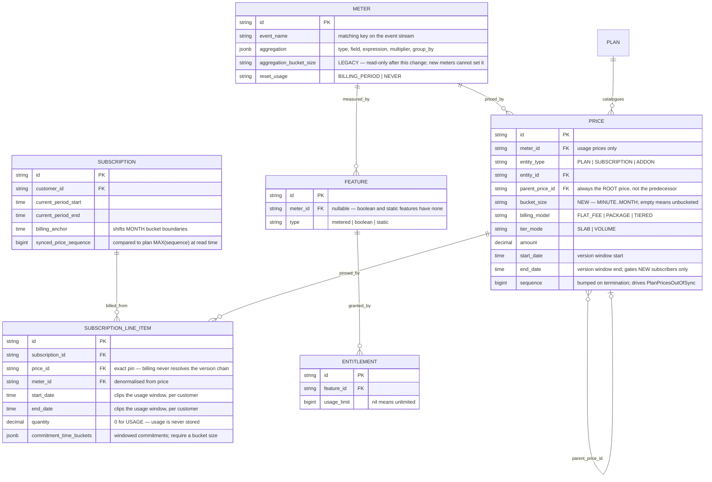

# Price-Level Bucketing — Design ERD

Status: **Proposed** — decisions settled, ready to scope
Date: 2026-08-17
Related: [bucketed-meter-cost-flow](../prds/bucketed-meter-cost-flow.md), [meter-usage-analytics-flow](../meter-usage-analytics-flow.md)

This document is canonical. Requirement IDs referenced below:

| ID | Requirement |
|---|---|
| R1 | A price can carry a bucket size (usage prices on `MAX`/`SUM` meters only) |
| R2 | Changing it versions the price rather than editing it |
| R3 | Exactly one resolver decides the effective bucket size; no code reads either column directly |
| R4 | Price wins over meter; a price may not set one when the meter already has one |
| R5 | Callers with no price get the meter's value only |
| R6 | New meters cannot set a bucket size — accepted but ignored, with a deprecation warning on the response |
| R7 | Bucketing/entitlement conflicts rejected at both write points (§2.7) |
| R8 | Configured on the plan charge, not the feature |
| R9 | Setting or changing it warns that the billable unit changes |
| R10 | Invoices state the billable quantity with its unit |
| R11 | Customer-scoped analytics resolves bucketing through the price it already holds |

§9 records a **pre-existing** defect found while testing this change. It is orthogonal to where
`bucket_size` lives and does not block the move.

---

## 1. Problem Statement

A customer creates a meter — `MAX` of `active_seats` on `seat_snapshot` — attaches it to a plan and
starts billing. Weeks later they want peak-per-hour billing instead of peak-per-period. That is a
pricing decision, but `bucket_size` lives on the meter, and
[`UpdateMeterRequest`](../../internal/api/dto/meter.go#L22) exposes exactly one mutable field:

```
type UpdateMeterRequest struct {
    Filters []meter.Filter
}
```

The immutability is deliberate. Mutating `aggregation` would:

- **retroactively re-aggregate** every open period for *every* subscription on that meter — usage is
  computed at read time, so the change reaches backwards with no cutover
- **redefine the billable unit**: `MAX` → `MAX` + `HOUR` turns seats into seat-hours, so an unchanged
  amount inflates a bill by roughly the number of hours in the period
- **change the price function's granularity** — tiers and packages apply per bucket rather than per
  period ([price.go:1012](../../internal/ee/service/price.go#L1012)), so identical usage prices
  differently
- **switch billing branches** — bucketed meters take a different entitlement and pricing path at
  [billing.go:528](../../internal/ee/service/billing.go#L528)

So there is no supported path. Every workaround mints a **new meter** and repoints the customer's
line item at it, which means telling a customer "we created a new meter and moved your charge onto
it" — a sentence that breaks the identity of the thing they named after their own product.

---

## 2. Approach

### 2.1 The principle

> A meter reports what happened. A price decides what it costs — including over what time window.

`bucket_size` becomes an attribute of the price. Changing it becomes a **price change**, which the
platform already models well: [`UpdatePrice`](../../internal/ee/service/price.go#L824) terminates the
current version at `effective_from`, inserts a successor starting at the same instant, and records
lineage through `parent_price_id`. The customer-facing story becomes *"your price was updated,
effective 1 March"*.

This also removes a real defect. Today `/v1/events/usage/meter` on a bucketed `MAX` meter returns
**15 seat-hours** for events whose actual peak was **9 seats** — a measurement API returning a
billing artifact. After the change, measurement and money separate.

### 2.2 Why the field is added, not moved

Bucketed aggregation is a hot production path, not a niche feature. Over 30 days:

| Signal | Calls |
|---|---|
| `repository.meter_usage.get_usage_for_bucketed_meters` | 3,566,703 |
| `repository.meter_usage.get_usage_for_bucketed_meters_detailed` | 123,257 |
| `POST /v1/events/analytics` | 1,907,201 |
| `POST /v1/costs/analytics` (prod, two regions) | 611 |

`_detailed` is the analytics-side bucketed query, reached from
[`getDetailedAnalyticsWithoutSubscriptionContext`](../../internal/ee/service/meter_usage.go#L1552) —
a path with **no price in scope**. And `POST /v1/events/analytics` is called by our own dashboard
(`flexprice-front/src/api/EventsApi.ts:74` → `CustomerUsageChart.tsx`), so its output is what
customers see on their usage charts.

An earlier draft of this design flipped those meter-scoped surfaces to unbucketed for all meters.
The traffic is why it does not. **Nothing is removed and nothing is migrated** — the meter's field
stays, readable, indefinitely.

### 2.3 One resolution point

Today ~57 sites across 11 files ask the meter directly, via
[`IsBucketedMaxMeter()` / `IsBucketedSumMeter()`](../../internal/domain/meter/model.go#L284) or
`m.Aggregation.BucketSize`. After this change **none of them read either field directly**. They ask a
single resolver that decides precedence for a `(price, meter)` pair.

This is the whole structural change. A two-source world is only safe if the precedence rule exists in
exactly one place.

### 2.4 Precedence is decided by who is asking

| Caller | Holds | Resolves to |
|---|---|---|
| Billing, invoicing, wallet balance | price + meter | price's value, else meter's |
| **Customer-scoped analytics** | price + meter | price's value, else meter's |
| Admin analytics (no customer), `/events/usage/meter`, entitlement checks, cost analytics | meter only | meter's value only |

That asymmetry **is** the backwards compatibility. Every meter bucketed today keeps behaving
identically on every surface, because meter-only callers still see the meter's value. Every new
configuration puts the window on the price, where meter-only callers cannot see it — so those
surfaces return raw measurement for new configs only.

No feature flag, no staged rollout, no customer comms. The behaviour split falls out of the data.

#### Customer-scoped analytics already holds the price

The customer-facing analytics path is **not** meter-only, which is where an earlier draft of this
design was wrong. [`GetDetailedAnalytics`](../../internal/ee/service/meter_usage.go#L1090) resolves
the customer's subscriptions, filters to meters carrying an active line item, and then calls
`GetSubscriptionMeterUsage` per subscription
([meter_usage.go:1242](../../internal/ee/service/meter_usage.go#L1242)) — the same function the
wallet balance uses:

```
resolveCustomerAndSubscriptions
  no subscriptions -> getDetailedAnalyticsWithoutSubscriptionContext   (admin fallback, meter-only)
  otherwise        -> sub.LineItems -> GetSubscriptionMeterUsage       (price available)
```

Inside that call, the price is already resolved at the exact line where bucketing is dispatched
([meter_usage.go:724](../../internal/ee/service/meter_usage.go#L724)):

```
bucketedResult := s.queryBucketedMeterUsage(ctx, m, ...)      // meter only, today
usage := &LineItemMeterUsage{
    Price: result.PriceMap[item.PriceID],                     // ...the price, eight lines later
    BucketedResult: bucketedResult,
}
```

`PriceMap` is populated from the line items at
[meter_usage.go:462](../../internal/ee/service/meter_usage.go#L462). The price is not passed to the
query builder today only because it has nothing to contribute — the window comes off the meter.
**R11 is therefore not a new parameter; it is passing an argument that is already in scope.**

#### What "raw measurement" means for the genuinely meter-only surfaces

| Surface | New-config behaviour | Consequence |
|---|---|---|
| Admin analytics — no `external_customer_id` ([meter_usage.go:1552](../../internal/ee/service/meter_usage.go#L1552)) | raw aggregate | Internal/ops queries only; there is no single correct bucketing when no subscription is named |
| `/events/usage/meter` ([event.go:188](../../internal/ee/service/event.go#L188)) | raw aggregate | Correct answer to "how much was used" — this endpoint takes no price or subscription by design |
| Entitlement & grant checks | raw aggregate | **No behaviour gap.** Entitlements are already blocked on bucketed `MAX`, so the only bucketed meters that can carry one are `SUM` — where bucketed and unbucketed totals are identical |
| Cost analytics ([costsheet:1131](../../internal/ee/service/costsheet_usage_tracking.go#L1131)) | raw aggregate | Understates internal cost for bucketed products until a costsheet price carries a window (Q4) |

None of these is customer-facing in the way the usage chart is, which is why the divergence in §8 is
a footnote rather than a risk.

### 2.5 Versioning comes for free

`bucket_size` joins the critical-field set in
[`ShouldCreateNewPrice()`](../../internal/api/dto/price.go#L551) alongside `amount`, `tiers`,
`billing_model`, `tier_mode` and `transform_quantity`. Setting or changing it therefore versions the
price rather than mutating it.

Note this is the opposite treatment from `price_unit_type` (FIAT vs CUSTOM), which
[`UpdatePrice`](../../internal/ee/service/price.go#L794) refuses outright because it redefines the
unit. `bucket_size` also redefines the unit, but is versionable because the **dated line-item split**
keeps each period unambiguous — see §2.6. The UI must state the unit change explicitly (R9), the way
a currency change would be.

### 2.6 Existing subscriptions are unaffected until moved

Billing binds to an exact `price_id` — [billing.go:494](../../internal/ee/service/billing.go#L494)
matches `charge.Price.ID == item.PriceID`, and nothing walks `parent_price_id` or filters by
`start_date`/`end_date`. So end-dating a price affects **new subscribers only**
(`AllowExpired: false` at [subscription.go:3993](../../internal/ee/service/subscription.go#L3993)).

Existing subscriptions move only when a `subscription_line_items` row is created or terminated —
via `POST /plans/:id/sync/subscriptions`, `PUT /subscriptions/lineitems/:id`, or a plan change. Each
of those already splits the line item at a date, and
[`GetPeriodStart`/`GetPeriodEnd`](../../internal/domain/subscription/line_item.go#L254) clip the
usage window per line item — so a period straddling the change bills both rules, as two charges.

That two-charge outcome is not an artifact; it is forced. A period under two different bucketing
rules cannot be collapsed into one quantity without lying about the unit.

### 2.7 Entitlement constraints are enforced symmetrically, at both write points

Entitlement restrictions currently interrogate the meter:

- [entitlement.go:143, :328](../../internal/ee/service/entitlement.go#L143) — no entitlements on
  bucketed `MAX` meters
- [entitlement_grant.go:564](../../internal/ee/service/entitlement_grant.go#L564) and
  [billing_meter_usage_grants.go:270](../../internal/ee/service/billing_meter_usage_grants.go#L270) —
  no grant-based entitlements on any bucketed meter

With the window on the price, neither entity can answer the question alone — but the join is
reachable from both directions:

```
price.meter_id  ->  features.meter_id  ->  entitlements.feature_id
```

So the constraint is enforced at **both write points**, not deferred to attachment:

| Write | Check |
|---|---|
| Create / update a price with `bucket_size` | reject if the meter's feature carries entitlements or grants |
| Create an entitlement or grant | reject if any live price on that feature's meter is bucketed |

Either check alone leaks — a price created first is missed by the second, an entitlement created
first is missed by the first. Together they are complete. The second is a bounded query on a
low-frequency operation.

This is safe for every existing configuration: entitlements are already blocked on bucketed `MAX`, so
the only bucketed meters carrying one are `SUM` — and for `SUM`, bucketed and unbucketed quantities
are identical.

### 2.8 `group_by` stays on the meter

`group_by` selects which property to split the aggregate by, and it changes what the meter reports.
It is a measurement dimension. Its current coupling to bucketed `MAX`
([model.go:254](../../internal/domain/meter/model.go#L254)) should eventually relax — per-group max
summed over a period is meaningful without buckets — but that is an independent change and must not
ride this one.

### 2.9 Interaction with the meter-usage rollout

Two billing paths exist, gated per tenant by `enable_meter_usage_for_billing`
([config.go:711](../../internal/config/config.go#L711), default `false`):

| Path | Table | Query builder | 7d prod calls |
|---|---|---|---|
| legacy | `events` | [aggregators.go](../../internal/repository/clickhouse/aggregators.go#L768) | 8,700 |
| current | `meter_usage` | [meter_usage_query_builder.go:266](../../internal/repository/clickhouse/meter_usage_query_builder.go#L266) | 2,470,793 |

The resolver must be applied to **both**, or a tenant's bill changes when the flag flips.

---

## 3. ERD



**The invariant this rests on:** `bucket_size` appears on two entities, and no code may read either
column directly. Every consumer goes through the resolver, which is the only place precedence is
expressed.

---

## 4. Resolution rules

| # | Rule |
|---|---|
| 1 | Price's `bucket_size` wins when non-empty |
| 2 | Otherwise the meter's legacy value applies |
| 3 | A caller with no price passes nil and gets rule 2 only |
| 4 | A price may **not** set `bucket_size` when its meter already has one — no override |
| 5 | `bucket_size` on a price is valid only for `USAGE` type whose meter aggregates `MAX` or `SUM` |
| 6 | New meters may not set `bucket_size`. Soft-deprecated: the field is accepted, dropped, and reported in `warnings` on the create response, so existing integrations keep working. Existing rows keep theirs |
| 7 | `bucket_size` is a scalar column on `prices`, not a nested JSON object |

Rule 4 is what prevents a two-live-source pairing, where precedence silently becomes a behaviour
change rather than a migration. **Decided: forbid, no override.**

Rule 7 is deliberate. `meters.aggregation` is a jsonb blob, and that is precisely why `bucket_size`
ended up on the wrong entity — adding a field to a blob is frictionless, so nobody stopped to ask
whether it belonged there. `prices` already splits scalars into columns (`tier_mode`,
`billing_model`) and reserves jsonb for genuinely structured values (`tiers`,
`transform_quantity`). One string is a scalar.

*Revisit trigger:* if a **second** bucketing attribute appears — alignment policy, partial-bucket
handling, timezone override — introduce a `bucketing` jsonb then and deprecate the scalar.

---

## 5. Compatibility matrix

| Surface | Meter bucketed today | New price-level config |
|---|---|---|
| Invoicing | unchanged | bucketed by the price |
| Wallet real-time balance | unchanged | bucketed by the price |
| Usage analytics, customer-scoped (`/events/analytics`) | unchanged | **bucketed by the price** |
| Usage analytics, admin (no customer) | unchanged | raw measurement |
| Public usage (`/events/usage/meter`) | unchanged | raw measurement |
| Cost analytics (`/costs/analytics`) | unchanged | raw measurement |
| Entitlements & grants | unchanged | rejected at price/entitlement write |

Cost analytics resolves itself under grandfathering — its query builder
([costsheet_usage_tracking.go:1131](../../internal/ee/service/costsheet_usage_tracking.go#L1131)) is
feature-scoped and keeps reading the meter. The open question only returns if someone sets a window
on a costsheet price (Q4).

---

## 6. Scenarios

**S1 — new customer, hourly peak billing.** Meter is plain `MAX`. Plan charge sets `HOUR`. Billing
buckets; analytics reports raw peak. No meter field involved.

**S2 — existing bucketed customer, untouched.** Meter carries `HOUR`, price carries nothing. Every
surface behaves exactly as before, including the usage chart.

**S3 — existing bucketed customer stays put, indefinitely.** There is deliberately **no migration
path**, supported or manual, and none is planned. Legacy meter-level bucketing is not deprecated on
any timeline; it simply stops being the way new configurations are built.

Customers arrive at price-level bucketing by natural turnover — a new meter, a new plan, or a new
price — not by being moved. Nothing is scheduled to remove the meter's field, so a tenant that never
changes its catalogue keeps working forever with no action from anyone.

The practical consequence: no customer-facing comms, no cutover windows, no per-tenant tracking, and
no admin endpoint to clear `bucket_size` from a meter. If a specific customer ever asks to move, rule
4 forces the meter's field to be cleared first, which makes it a deliberate one-off rather than
something that can happen by accident.

**S4 — mid-period bucketing change.** `UpdatePrice` with `effective_from` produces two contiguous
versions. Sync or a line-item update splits the line item at the same instant; usage windows clip
cleanly with no gap or overlap.

---

## 7. Acceptance

Fixture: peak-seats meter bucketed `HOUR`, events 4 / 9 / 6 across two hours, `$0.10` per unit,
`$50` prepaid wallet.

| # | Case | Expected |
|---|---|---|
| A1 | Legacy meter, price carries nothing | 15 units, `$1.50`, balance `$48.50` |
| A2 | Plain meter, price carries `HOUR` | identical to A1 |
| A3 | Analytics, legacy meter | bucketed — unchanged |
| A4 | Customer-scoped analytics, price-level config | bucketed (15), matching the invoice |
| A4b | Admin analytics (no customer), price-level config | raw measurement (9) |
| A5 | Bucketing changed mid-period | two contiguous versions; both rules billed |
| A6 | Bucketed price on an entitled feature | rejected at attachment |
| A7 | Price sets a window on an already-bucketed meter | rejected at creation |
| A8 | Same, with `enable_meter_usage_for_billing` flipped | A1–A2 hold on both paths |
| A9 | Entitlement created on a feature whose meter already has a bucketed price | rejected at entitlement creation |
| A10 | Bucketed price created on a feature that already has an entitlement | rejected at price creation |

A1 must hold for every bucketed tenant in production before this ships.

---

## 8. Known sharp edges

**Raw vs billed quantity on price-less surfaces.** For a new price-level config, a surface that
cannot reach the price reports the raw aggregate rather than the billable one:

```
raw aggregate      9      the highest seat count reached          max(4, 9, 6)
billed quantity   15      seat-hours held                         max(4,9) + max(6)
invoice amount $1.50      15 x $0.10
```

Both are correct answers to different questions — 9 is a peak, 15 is a duration — but a reader
seeing them together without units will read a discrepancy.

This does **not** affect the customer's usage chart: customer-scoped analytics resolves the price
(§2.4) and reports 15, matching the invoice. It applies only to admin analytics queries with no
customer, `/events/usage/meter`, and cost analytics.

The fix is labelling: invoices read **"15 seat-hours"** rather than "15 units" (R10), and raw
surfaces label their number as measured usage. Downgraded from a support-ticket risk to a
documentation item once customer-scoped analytics was confirmed to carry the price.

**Two sources of truth, indefinitely.** Someone reading the schema cold will not know which wins.
Contained only by discipline: nothing may set `bucket_size` on a meter again, and no code may read
either column directly.

**Bucket-boundary alignment on a mid-period split.** If a line item splits at 09:48 on an `HOUR`
meter, the 09:00 bucket is partially in each window and both sides see a partial bucket. Windowed
commitments already validate alignment
([subscription_line_item.go:1029](../../internal/ee/service/subscription_line_item.go#L1029)); plain
bucketed pricing does not. Default effective dates to a period boundary.

**Unit recalibration is silent.** Setting `HOUR` on an existing amount multiplies the bill by the
bucket count. R9 exists solely for this.

---

## 9. Pre-existing defect: entitlements discard bucketed pricing

Found while testing this change. **Not introduced by it** — the same code ran before, keyed on
`m.IsBucketedSumMeter()` instead of the resolver. Recorded here because this is the first time
anyone has had a reason to look at the interaction.

### What happens

A charge's amount is written twice. The second write has less information than the first.

```
billing_meter_usage.go:171   calculateBucketedMeterCost   -> amount priced PER BUCKET
billing_meter_usage.go:215   adjustMeterUsageEntitlement  -> amount recomputed on the TOTAL
```

[`adjustMeterUsageEntitlement`](../../internal/ee/service/billing_meter_usage.go#L402):

```go
if price.IsBucketedMax(...) || price.IsBucketedSum(...) {
    if ent.UsageLimit != nil {
        adjusted := decimal.Max(quantity.Sub(allowed), decimal.Zero)
        if !adjusted.Equal(quantity) && matchingCharge.Price != nil {
            matchingCharge.SetAmountWithCurrencyPrecision(
                priceService.CalculateCost(ctx, matchingCharge.Price, adjusted), ...)
```

`CalculateCost` prices a scalar. The per-bucket loop in
[price.go:1012](../../internal/ee/service/price.go#L1012) is discarded.

**Bucketed quantity survives; bucketed pricing does not.** `adjusted` is still derived from the
bucketed total, so the measurement is intact — only the cost function changes.

### Worked example

SUM meter, events 4 / 9 / 6 across two hours → buckets `[13, 6]`, total 19.
Price TIERED/SLAB: first 10 units free, then $1.

| Allowance | adjusted | Priced how | Charge |
|---|---|---|---|
| none | 19 | per bucket: tier(13) + tier(6) | **$3** |
| 0 | 19 | `adjusted == quantity` → no recalc | **$3** |
| 1 | 18 | aggregate: tier(18) | **$8** |
| 5 | 14 | aggregate: tier(14) | **$4** |
| 9 | 10 | aggregate: tier(10) | **$0** |
| 1000 | 0 | aggregate: tier(0) | **$0** |

Granting **1** free unit takes the bill from $3 to $8. The free-10 tier allowance is granted twice
in the per-bucket path (once per bucket) and once in the aggregate path.

The only reason allowance `0` behaves is the `!adjusted.Equal(quantity)` short-circuit — bucketed
pricing is preserved for exactly one input value.

### Why it has never surfaced

Every bucketed meter in production today is `FLAT_FEE`, and flat pricing is linear:

```
sum(0.10 x 13, 0.10 x 6)  ==  0.10 x 19
sum(tier(13),  tier(6))   !=  tier(19)
ceil-per-bucket           !=  ceil-on-total
```

### The rule that is actually needed

The current guard rejects entitlements on bucketed `MAX` and allows them on bucketed `SUM`. That
catches one case by accident of aggregation type rather than by the real constraint, which is:

> Entitlements are incompatible with bucketing whenever the charge is not a plain linear function of
> total quantity.

Three configurations fail that test:

| Config | Before | Now |
|---|---|---|
| bucketed `MAX`, any model | rejected | rejected — the unit itself changes |
| bucketed `SUM` + `TIERED` / `PACKAGE` | allowed | **rejected** — implemented, see below |
| bucketed `SUM` + `FLAT_FEE` | allowed | allowed — genuinely harmless |
| bucketed `SUM` + windowed commitment | allowed | allowed — **unverified**, see below |

### Implemented: option 1, the guard is tightened

`isLinearBillingModel` in
[bucketing_guard.go](../../internal/ee/service/bucketing_guard.go) treats only `FLAT_FEE` as linear.
Both guard directions now reject the combination:

- creating a bucketed price with `TIERED` / `PACKAGE` on a meter whose feature carries an entitlement
- creating an entitlement on a meter that already has a bucketed `TIERED` / `PACKAGE` price

`FLAT_FEE` is untouched, so no existing configuration changes — every bucketed meter in production is
flat-fee.

This closes the reachable half of the defect: the broken arithmetic in
`adjustMeterUsageEntitlement` is still present, but no new configuration can reach it. Fixing the
math (option 2) remains open and is only worth doing if a customer needs entitlements *and* tiered
windowed pricing together.

### Untraced: entitlement vs windowed commitment

A windowed commitment recomputes the amount from `bucketedValues`
([billing_meter_usage.go:576](../../internal/ee/service/billing_meter_usage.go#L576)) *after* the
entitlement branch has already rewritten it. Whether the entitlement survives, is silently
discarded, or is double-counted has not been traced. Needs one debugger session with an
entitlement, a bucket size and a windowed commitment configured together.

Note this is the one way bucketed `SUM` matters under flat-fee pricing — windowed commitments
require a bucket size ([subscription_line_item.go:690](../../internal/ee/service/subscription_line_item.go#L690)) —
so "SUM bucketing only matters for tiered pricing" is not quite true.

### Remaining work

**Option 2 — fix the math.** Draw the allowance down across buckets and re-run per-bucket pricing.
Correct, but requires deciding *which bucket* a free unit comes from — the same unanswered question
that got grants banned from bucketed meters. Not attempted; the guard makes it unreachable.

The defect itself is pre-existing and orthogonal to where `bucket_size` lives. It does not block the
move, and with the guard in place it is no longer silently inheritable either.

---

## 10. Decisions

| # | Question | Decision |
|---|---|---|
| Q1 | Price-level window when the meter already has one — forbid or override? | **Forbid.** An override turns a migration into a silent behaviour change. Now rule 4 |
| Q2 | Scalar column or nested JSON? | **Scalar**, keeping the name `bucket_size`. Now rule 7, with a revisit trigger |
| Q3 | Who consumes `/v1/events/analytics` besides the dashboard? | **Out of scope.** It mattered only while the plan flipped semantics globally; grandfathering changes no existing consumer. Real observability debt on a 1.9M-calls/month endpoint with no tenant attribution — tracked separately, not a blocker here |
| Q4 | Does cost analytics eventually follow its own costsheet price? | **Deferred.** Grandfathering keeps it working untouched. *Trigger to revisit:* the first time anyone sets `bucket_size` on a costsheet price |

No open blockers.

**R11** came out of review and then shrank: customer-scoped analytics already resolves the price and
holds it at the dispatch point, so it is a matter of passing an existing argument, not adding a
parameter. Scope it with the rest — without it, new bucketed customers see a usage chart that
disagrees with their invoice for no reason.
