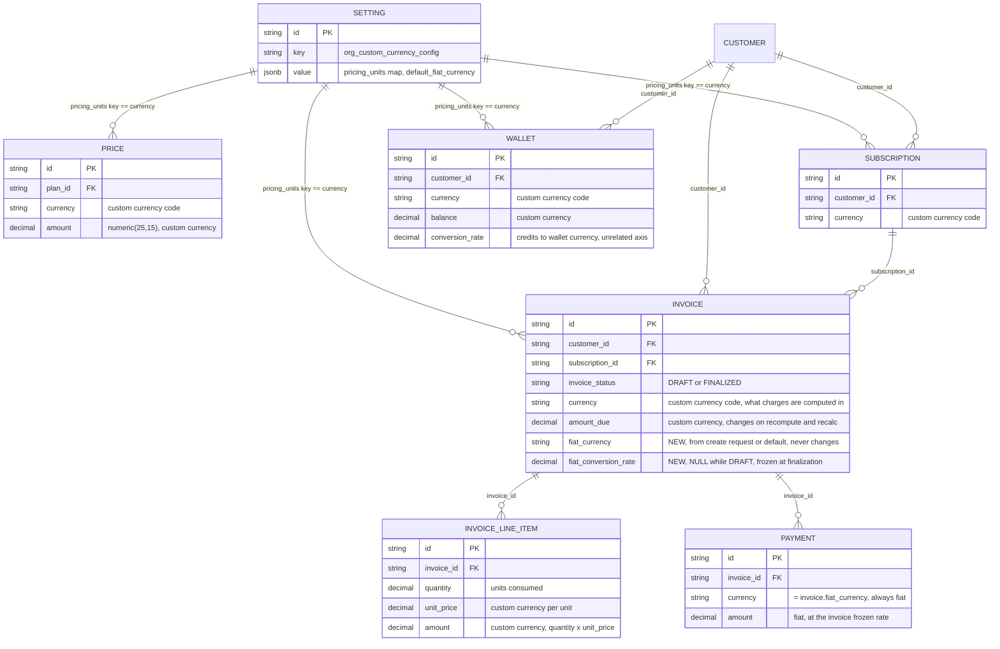
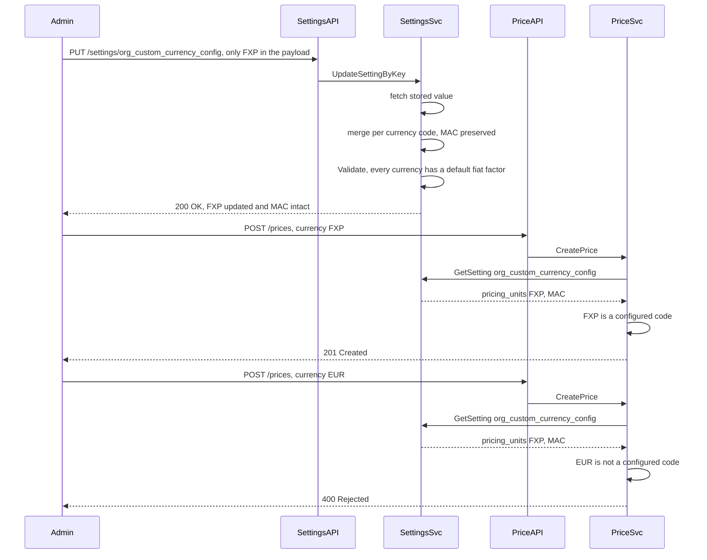
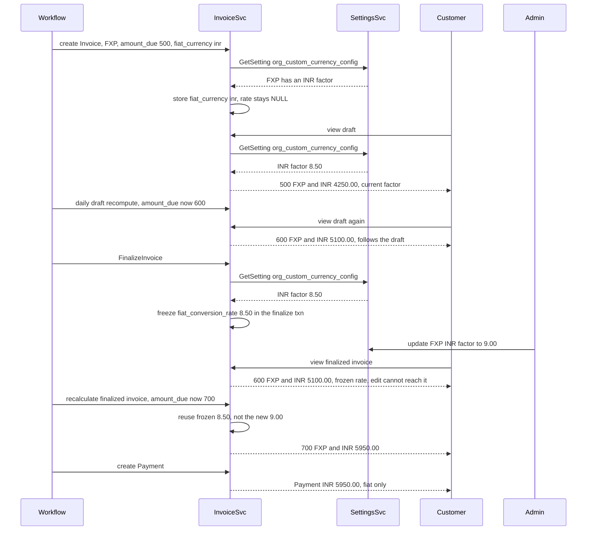

# Custom Org Currency — Design

Status: **Proposed**
Date: 2026-08-27

---

## 1. Problem Statement

A tenant should be able to define its own currency — e.g. `FXP` — and have the entire product operate in it. Plans, prices, subscriptions, wallets, usage costs, analytics, dashboards: everything internal is denominated, computed, and displayed in that currency.

Fiat appears at exactly one boundary: artifacts handed to the tenant's **end customers**. An invoice reading `500 FXP` is meaningless to someone who has to pay it, and a payment cannot be collected in a currency no bank recognizes. Those artifacts must additionally carry a real-money amount.

**Design in one line:** the custom currency is the operating currency everywhere; invoices show both currencies; payments are fiat-only.

**Goal:**

1. A tenant defines its custom currencies and their conversion factors to each fiat currency it bills in.
2. Every Price / Subscription / Wallet is created in a custom currency — enforced.
3. Invoice creation takes the fiat currency to bill in; absent that, the configured default is used.
4. An invoice's conversion rate freezes at finalization. Later factor edits never move it.
5. `name` and `symbol` are freely editable. `code` is not — other entities store it.
6. A missing factor falls back to the default fiat currency and logs. A missing *currency code* is prevented outright (§2.7).

---

## 2. Approach

### 2.1 The setting

Key `org_custom_currency_config` (name and scope open, §7.1). Settings are already tenant/environment-isolated at the row level — `EnvironmentID` comes from request context, never from the payload (`internal/api/dto/settings.go:47`), and tenant-level keys leave it unset (`isTenantLevelSetting`, `internal/ee/service/settings.go:55`). No scoping fields appear in the value.

```go
// OrgCurrencyConfig defines the tenant's operating currencies and the fiat currency
// used when an invoice does not name one, or when a requested factor is missing.
//
// Named CustomCurrency internally, not PricingUnit: this codebase already has an
// unrelated PriceUnit entity with no interaction with this feature (§6) — sharing
// the name would suggest a connection that doesn't exist. The wire format still
// uses "pricing_units" as the JSON key.
type OrgCurrencyConfig struct {
	// CustomCurrencies is keyed by currency code. The code lives only as the map
	// key, never duplicated inside the value — nothing to drift out of sync with it.
	CustomCurrencies map[string]CustomCurrency `json:"pricing_units" validate:"dive"`

	// DefaultFiatCurrency is the guaranteed-available fiat currency. Every entry in
	// CustomCurrencies must carry a factor for it (enforced in Validate), which is
	// what makes the §2.7 fallback safe: there is always a real factor to fall
	// back to, never a guessed one.
	DefaultFiatCurrency FiatCurrency `json:"default_fiat_currency"`
}

// CustomCurrency is one tenant-defined operating currency, keyed by its code in
// OrgCurrencyConfig.CustomCurrencies.
//
// The code is IMMUTABLE — other tables store it as their currency value, so
// changing or removing the map key orphans them (§2.7). Name and Symbol are
// freely editable: they are read from this config at render time and are stored
// nowhere else.
type CustomCurrency struct {
	Name                  string                     `json:"name" validate:"required"`
	Symbol                string                     `json:"symbol" validate:"required"`
	FiatConversionFactors map[string]decimal.Decimal `json:"fiat_conversion_factors" validate:"required,min=1"`
}

type FiatCurrency struct {
	Code   string `json:"code" validate:"required,len=3"`
	Symbol string `json:"symbol" validate:"required"`
	Name   string `json:"name" validate:"required"`
}
```

```json
{
  "key": "org_custom_currency_config",
  "value": {
    "pricing_units": {
      "FXP": {
        "name": "Flexprice Credits",
        "symbol": "FXP",
        "fiat_conversion_factors": { "USD": "0.10", "INR": "8.50" }
      },
      "MAC": {
        "name": "MoEngage AI Credits",
        "symbol": "MAC",
        "fiat_conversion_factors": { "USD": "0.05", "INR": "4.25" }
      }
    },
    "default_fiat_currency": { "code": "USD", "symbol": "$", "name": "US Dollar" }
  }
}
```

`Validate()` enforces:

- Every factor is positive.
- `DefaultFiatCurrency` is present whenever `CustomCurrencies` is non-empty.
- `DefaultFiatCurrency.Code` is not itself a custom currency code.
- **Every custom currency carries a factor for `DefaultFiatCurrency.Code`.** In the example above, both `FXP` and `MAC` must have a `USD` entry. This is what guarantees the §2.7 fallback always has a real factor available — without it, "fall back to the default" could itself fail.

Codes and factor keys are lowercased on write, matching `CreatePriceUnitRequest.Validate` (`internal/api/dto/priceunit.go:44`).

Read via `GetSetting[types.OrgCurrencyConfig](s, ctx, ...)` (`ee/service/settings.go:225`), written via `UpdateSetting` (`:272`) through `PUT /settings/:key` (`api/router.go:735`), already `superAdminOnly`.

### 2.2 Enforcement

A custom currency code is exactly 3 characters, so it passes every currency validator already in the codebase without any of them being modified — the same way `"usd"` does. Those validators do **not** check that a code is a real world currency; the only rule any of them applies is a length check:

- `CreatePriceRequest.Currency` — `validate:"required,len=3"` (`internal/api/dto/price.go:19`)
- `CreateSubscriptionRequest.Currency` — `validate:"required,len=3"` (`internal/api/dto/subscription.go:531`)
- `types.ValidateCurrencyCode` — `len(currency) != 3` and nothing more (`internal/types/currency.go:93`, which carries a `TODO` for real currency-code validation that was never implemented). Called from `wallet.go:128,185`, `invoice.go:247,515`, `payment.go:258`, `payment_method.go:64`.

So `"fxp"` is, to all existing validation, just a 3-character string. Nothing is relaxed or rewritten.

**The one new check.** When creating a Price, Subscription, or Wallet, read `org_custom_currency_config`:

- Tenant has custom currencies configured → the request's `currency` must be one of those codes, else reject.
- Tenant has none configured → nothing changes; any 3-character currency is accepted exactly as today.

It runs after the existing validators, as an additional rule. It does not replace anything. Applies to every price-bearing entity — plan charges, addon charges, one-off charges.

### 2.3 Everything internal operates in the custom currency

No new columns. `Price.Currency`, `Subscription.Currency`, `Wallet.Currency` already hold a 3-character string; it is now `"fxp"`.

- **Cost calculation** — `CalculateCost` (`ee/service/price.go:1073`) is untouched; the numbers it reads are custom-currency-denominated and it never needs to know.
- **Wallet** — `Wallet.Currency = "fxp"`. Balances, top-ups, and debits all operate in it. `Wallet.ConversionRate` / `TopupConversionRate` (credits ↔ wallet currency) are a different axis and are untouched (`internal/domain/wallet/model.go:16-42`).
- **Wallet-pays-invoice matching** — `IsMatchingCurrency` (`wallet_payment.go:84`, `payment.go:237`, `payment_processor.go:566`) is an exact string compare and needs no change: wallet and invoice both carry `"fxp"`.
- **Analytics and dashboards** — displayed in the custom currency, using `symbol` / `name` read live from the config.

### 2.4 Invoice — the fiat boundary

**At creation**, the request names the fiat currency to bill in via `target_currency`, resolved into the stored `fiat_currency`:

```
POST /invoices { ..., "target_currency": "inr" }
```

- Given, and the custom currency has a factor for it → used.
- Given, but **no factor exists** for it → log at Error, fall back to `default_fiat_currency.code`. Safe because §2.1 guarantees every custom currency has a factor for the default.
- Omitted → `default_fiat_currency.code`.

The resolved value is stored as `fiat_currency` and never changes for the life of the invoice.

**Two new columns**, and the split between them is the entire mutability model:

| Column | Set at | Mutable after |
| --- | --- | --- |
| `fiat_currency` | creation | Never |
| `fiat_conversion_rate` | **finalization** | Never |

**The fiat amount is not a column.** It is always derived:

```
fiat_amount = RoundToCurrencyPrecision(amount_due × fiat_conversion_rate, fiat_currency)
```

Deriving it rather than storing it produces the required behavior with nothing to keep in sync:

- **While `DRAFT`** — `fiat_conversion_rate` is NULL; display uses the current factor. A daily job recomputes draft invoices for tenants with `draft_invoice_recompute` enabled (`ee/service/invoice.go:1147`), moving `amount_due` on its own; the fiat figure follows automatically. The two cannot disagree.
- **At finalization** — `performFinalizeInvoiceActions` (`ee/service/invoice.go:972`) writes `fiat_conversion_rate` from the current factor, inside the same transaction that finalizes the invoice.
- **After finalization** — the rate is frozen. A factor edit cannot reach it.
- **On recalculation of a finalized invoice** — `amount_due` changes and the fiat amount changes with it, **reusing the frozen rate**. The amount stays mutable; the rate does not. There is no stored fiat amount that could drift from the rate it was computed with.

### 2.5 How an invoice renders

Target layout, using the reference example (custom currency `CCT` "Cloud Compute Tokens", fiat `CHF`, factor `0.50`):

```
Charge                       Applied commit   Effective date          Quantity   Unit price   Total
──────────────────────────────────────────────────────────────────────────────────────────────────
Inference & Model Hosting    –                Jan 01 – Feb 01, 2025         75        2 CCT   150 CCT
CCT conversion               –                Jan 01 – Feb 01, 2025        150     CHF 0.50   CHF 75.00
AI Model Training            Prepaid Commit   Jan 01 – Feb 01, 2025      33.33        3 CCT   100 CCT
AI Model Training            –                Jan 01 – Feb 01, 2025      66.67        3 CCT   200 CCT
CCT conversion               –                Jan 01 – Feb 01, 2025        200     CHF 0.50   CHF 100.00

                                                          Cloud Compute Tokens
                                                            Subtotal                      450 CCT
                                                            Prepaid Commit consumed      -100 CCT
                                                            Total (CCT)                   350 CCT

                                                          CHF
                                                            CCT (x350)                 CHF 175.00
                                                            CHF 0.50 per CCT
                                                            Subtotal                   CHF 175.00
                                                            Total (CHF)                CHF 175.00

                                                            Total due                  CHF 175.00
```

The structural points, each of which the design has to support:

- **Conversion is its own row in the charges table, not just a summary block.** The table interleaves two kinds of row: charge rows priced in the custom currency, and conversion rows priced in fiat. A conversion row's `quantity` is the custom-currency amount of the rows it follows, its `unit price` is the conversion factor, and its `total` is the fiat figure.
- **Only the payable portion converts.** The commit-covered `AI Model Training` row (100 CCT) has no conversion row after it — a prepaid commit was already paid for, so it converts to no new money owed. The conversion rows cover 150 + 200 = 350 CCT, which is exactly the net after the commit is deducted.
- **Two summary blocks, one per currency, in order.** The custom-currency block shows gross subtotal, commit/credit deductions, and net total. The fiat block restates that net as `CCT (x350)`, names the rate on its own line (`CHF 0.50 per CCT`), and totals.
- **`Total due` is always fiat.** It is the figure a payment is raised against (§2.6).
- **Commits, credits, and discounts apply in the custom currency, before conversion.** They are part of arriving at the net custom-currency total. Because a single `fiat_conversion_rate` governs every conversion row and the summary alike, the conversion rows sum to the fiat total exactly — `75 + 100 = 175` — with no drift between the two.

**Open: are conversion rows persisted or derived?** They can be generated at render time from the charge rows and the invoice's frozen rate, which keeps `INVOICE_LINE_ITEM` free of a currency or row-kind column and keeps the "no fiat amount is stored" property. The alternative — persisting them as real line items — makes them independently queryable but introduces stored fiat amounts that recalculation must keep in sync. Derived is the recommendation; flagged as §7.6 since it changes the line-item schema if decided the other way.

### 2.6 Payment — fiat only

A payment is money actually collected, so it is denominated in fiat only. `Payment.Currency = invoice.fiat_currency`; `Payment.Amount` is the invoice's derived fiat amount at the frozen rate. No custom currency reaches a payment record or a payment provider.

**Wallet payments are the exception worth naming.** A wallet debit is an internal movement in the custom currency, but the resulting `Payment` row still records fiat, converted at the invoice's frozen rate — so every payment against an invoice is denominated the same way and sums cleanly against the amount due. Flagged in §7.3, as it is the one place "payments are fiat-only" meets "wallets are custom-currency".

### 2.7 Config integrity — what may change

| Field | Editable? | Why |
| --- | --- | --- |
| `name`, `symbol` | **Freely, no migration** | Read from config at render time and stored nowhere else, so an edit propagates to every surface on the next read |
| `default_fiat_currency` display fields | **Freely** | Same — render-time only |
| `fiat_conversion_factors` — changing a value | **Yes** | Finalized invoices carry their own frozen rate, so only drafts and future finalizations see the new value |
| `fiat_conversion_factors` — adding a key | **Yes** | Purely additive; opens a new billable fiat currency |
| `fiat_conversion_factors` — removing a key | **Not expressible in v1** | Merge semantics can only add or overwrite (below). Accepted trade-off |
| `code` | **Not expressible in v1** | Other tables store this exact string as their `currency` value; changing it would orphan every Price, Subscription, Wallet, and Invoice pointing at it. A payload naming a new code adds a currency rather than renaming one |
| Removing a whole custom currency | **Not expressible in v1** | Same orphaning problem, plus it requires migrating every entity denominated in it across a cross-rate. Deferred to §7.4 |

#### The gap

Setting writes are **already** fetch-then-merge-then-put, not a blind replace: `updateSettingByKey` (`ee/service/settings.go:495`) loads the stored value, merges the request over it, and persists the result. So a payload omitting a top-level key is safe today.

The problem is that the merge is **one level deep**. `mergePreservingImmutableFields` (`ee/service/settings.go:137`) is a flat loop:

```go
for k, v := range update {
	stored[k] = v
}
```

`OrgCurrencyConfig`'s top-level keys are `pricing_units` and `default_fiat_currency`. So sending

```json
{ "pricing_units": { "FXP": { ...corrected factor... } } }
```

merges at the top level correctly — `default_fiat_currency` survives untouched — but assigns the entire `pricing_units` map to what was sent. **`MAC` is silently deleted**, by an admin who was only fixing `FXP`.

#### The solution — merge deeper for this key, don't guard against it

Rather than a guard that rejects partial payloads, `org_custom_currency_config` merges at three levels: the top-level keys, then per currency code inside `pricing_units`, then per fiat code inside `fiat_conversion_factors`. Every write becomes strictly add-or-update:

| Payload | Effect |
| --- | --- |
| `{"pricing_units": {"FXP": {...}}}` | `FXP` updated, `MAC` untouched |
| `{"pricing_units": {"FXP": {"symbol": "F"}}}` | Only `FXP.symbol` changes; its `name` and factors are preserved |
| `{"pricing_units": {"FXP": {"fiat_conversion_factors": {"USD": "0.12"}}}}` | Only the `USD` factor changes; `INR` survives |
| `{"pricing_units": {"EUR": {...}}}` | New currency added alongside the existing ones |

This makes removal **structurally inexpressible** — there is no payload that deletes a currency, a display field, or a factor, because merging can only add or overwrite. That is exactly the v1 position: removing a custom currency means migrating every balance, price, and subscription denominated in it across a cross-rate, as an audited ledger movement, and nothing in v1 needs it (§7.4).

The consequence to accept deliberately: **legitimate removal is also impossible in v1**, including of a single unwanted fiat factor. When removal is eventually supported it needs its own explicit mechanism — a dedicated endpoint that names what to delete and checks what references it — never a re-interpretation of these merge semantics, which would resurrect the silent-deletion failure this fixes.

Changing a `code` is likewise not expressible: sending a new code adds a currency and leaves the old one in place, which is correct given other tables store the old string.

**Runtime fallback**, for the states this guard makes unreachable but that a direct DB edit or a bad migration could still produce:

- **A requested fiat factor is missing** → log at Error, use `default_fiat_currency`. Always available, since §2.1 requires every custom currency to carry its factor.
- **A custom currency's `name`/`symbol` is missing** → log at Error, render using `default_fiat_currency`'s display values. Cosmetic only; no amount is affected.
- **A custom currency code is missing entirely** → log at Error and fail the operation. There is no correct number to produce: a wallet holding `500 FXP` at a factor of `0.10` is worth `$50`, and treating it as `$500` would misprice every entity on that code with nothing in the data to reveal it later. Finalized invoices are unaffected either way — they carry their own frozen rate and need no config lookup to state what is owed.

---

## 3. ERD

Two new columns on `INVOICE`. Every other table is structurally unchanged — they already had a `currency` string column.



Three things the diagram cannot express, stated instead:

- **No fiat amount is stored anywhere.** `INVOICE` and `INVOICE_LINE_ITEM` hold only custom-currency amounts; every fiat figure on the rendered invoice (§2.5) is derived as `amount × invoice.fiat_conversion_rate` at read time. Storing it would create a second value that recalculation could leave stale.
- **`INVOICE_LINE_ITEM` has no currency or row-kind column.** Every stored line is a charge in the invoice's `currency`. The fiat conversion rows shown in §2.5 are generated at render time from those charges and the invoice's single `fiat_conversion_rate` — which is what keeps the conversion rows, the subtotal, and the total due arithmetically consistent. If conversion rows were instead persisted (§7.6), this table would need both columns.
- **A `CustomCurrency` is never a row.** It exists only inside `SETTING.value`, so each `SETTING` edge above is an application-level string match, not a database foreign key — nothing at the DB level enforces that a `WALLET.currency` of `FXP` refers to anything. What stands in for referential integrity is that §2.7's merge semantics make deleting a referenced code inexpressible, with runtime fallbacks as the backstop.

---

## 4. Sequence diagrams

### 4.1 Setup and enforced creation



### 4.2 Invoice lifecycle — draft, finalization, recalculation



```json
// DRAFT — rate NULL, fiat derived from the current factor
GET /invoices/inv_A
→ { "invoice_status": "DRAFT", "currency": "fxp", "amount_due": "600",
    "fiat_currency": "inr", "fiat_conversion_rate": null, "fiat_amount": "5100.00" }

// FINALIZED — rate frozen in the finalize transaction
GET /invoices/inv_A
→ { "invoice_status": "FINALIZED", "amount_due": "600",
    "fiat_currency": "inr", "fiat_conversion_rate": "8.50", "fiat_amount": "5100.00" }

// recalculated after finalization — amount moved, rate did not
GET /invoices/inv_A
→ { "invoice_status": "FINALIZED", "amount_due": "700",
    "fiat_currency": "inr", "fiat_conversion_rate": "8.50", "fiat_amount": "5950.00" }

// line items carry both, derived from the invoice's single rate
GET /invoices/inv_A/line-items
→ [ { "quantity": "75", "unit_price": "2", "amount": "150", "currency": "fxp",
      "fiat_amount": "1275.00", "fiat_currency": "inr" } ]

// requested fiat currency has no factor — logged, falls back to the default
POST /invoices { "target_currency": "gbp", ... }
→ 201 { "fiat_currency": "usd" }   // Error logged: no factor for fxp→gbp
```

---

## 5. Migration

- Add `SettingKeyOrgCurrencyConfig` to `allowedKeys` (`internal/types/settings.go:39-53`), and decide its scope in `isTenantLevelSetting` (`ee/service/settings.go:55`) — §7.1.
- Add `fiat_currency` (string, nullable) and `fiat_conversion_rate` (decimal, nullable) to `invoices`. No backfill: existing invoices are already fiat-denominated, so `currency` is the payable currency and `amount_due` the payable amount.
- Hook rate freezing into `performFinalizeInvoiceActions` (`ee/service/invoice.go:972`), inside the existing finalize transaction.
- Deepen the merge for `org_custom_currency_config` (§2.7). `mergePreservingImmutableFields` (`ee/service/settings.go:137`) is a flat top-level loop; this key needs it applied per currency code and per fiat factor. Either extend that helper with a per-key merge depth or add a key-specific merge alongside it — the surrounding fetch-merge-put flow in `updateSettingByKey` (`:495`) is unchanged either way.
- Nothing on `prices`, `subscriptions`, `wallets`, `payments`, `invoice_line_items`; no existing currency validator changes (§2.2).

---

## 6. Scenarios

Configured: `pricing_units` = `FXP`, `MAC`; `default_fiat_currency` = `USD`.

| # | Scenario | Result |
| --- | --- | --- |
| 1 | No `org_custom_currency_config`, or `pricing_units` empty | Today's behavior — any 3-character currency code, unrestricted |
| 2 | Create a Price with `currency: "fxp"` | `FXP` is a configured code — created |
| 3 | Create a Price with `currency: "eur"` | Passes the length check but isn't a configured code — `400 currency must be one of: fxp, mac` |
| 4 | Save a config where `MAC` has factors for `INR` only, with `default_fiat_currency` = `USD` | Rejected — every custom currency must carry a factor for the default fiat currency (§2.1) |
| 5 | Create an invoice with `fiat_currency: "inr"` | `FXP` has an INR factor — stored on the invoice, never changes |
| 6 | Create an invoice with no `fiat_currency` | Falls back to `default_fiat_currency.code` = `USD` |
| 7 | Create an invoice with `fiat_currency: "gbp"`, which `FXP` has no factor for | Error logged, falls back to `USD`. Safe because the `USD` factor is guaranteed to exist |
| 8 | **Multi-region:** one automated run bills an Indian customer with `fiat_currency: "inr"` and a US customer with `fiat_currency: "usd"`, both on `FXP` plans | Each invoice stores its own `fiat_currency` and freezes its own rate. Same operating currency, different payable currencies |
| 9 | Draft is viewed, the daily recompute moves `amount_due` `500 → 600`, viewed again | Fiat figure moves with it — derived from the current factor, nothing stored, so the two cannot disagree |
| 10 | Invoice is finalized | `fiat_conversion_rate` frozen inside the finalize transaction |
| 11 | Factor edited after that invoice finalized | Finalized invoice unchanged. Drafts and future finalizations use the new factor |
| 12 | **Finalized invoice is recalculated, `amount_due` `600 → 700`** | Fiat amount recomputes to match, **reusing the frozen rate**. Amount mutable, rate not |
| 13 | Invoice rendered (§2.5) | Charges table interleaves custom-currency charge rows with fiat conversion rows; two summary blocks, one per currency; total due in fiat |
| 13a | A charge is fully covered by a prepaid commit | No conversion row is emitted for it — a prepaid commit converts to no new money owed. Conversion rows cover only the net payable amount |
| 14 | Payment created for a finalized invoice | Fiat only — `Payment.Currency = invoice.fiat_currency`, amount at the frozen rate |
| 15 | `FXP` wallet pays an `FXP` invoice | Wallet debit in `FXP` via unchanged `IsMatchingCurrency`; the `Payment` row records fiat at the frozen rate (§7.3) |
| 16 | Admin edits `FXP`'s `name` or `symbol` | Allowed, no migration — display values are read from config at render, so every surface picks them up on the next read |
| 17 | Admin adds an `EUR` factor to `FXP` | Allowed — purely additive, opens `EUR` as a billable fiat currency |
| 18 | Admin sends a payload containing only `FXP`, intending just to fix its factor | `FXP` updated, **`MAC` untouched** — the merge is per currency code, so omission is never deletion (§2.7) |
| 19 | Admin sends `{"pricing_units": {"FXP": {"symbol": "F"}}}` | Only `FXP.symbol` changes; its `name` and both factors are preserved by the same merge |
| 20 | Admin sends `{"pricing_units": {"FXP": {"fiat_conversion_factors": {"USD": "0.12"}}}}` | Only the `USD` factor changes; the `INR` factor survives |
| 20a | Admin tries to rename `FXP`'s code to `FXC` | Not a rename — `FXC` is added as a new currency and `FXP` remains. Correct, since other tables store the string `fxp` |
| 20b | Admin wants to delete `MAC` outright | **Not expressible in v1.** No payload removes a currency; merge only adds or overwrites (§2.7). Deferred to §7.4 |
| 21 | A code is missing at runtime anyway (direct DB edit, bad migration) | Operation **fails and logs at Error**. Never substituted 1:1 with the default — valuing `500 FXP` as `$500` would misprice everything on that code invisibly. Already-finalized invoices are unaffected, since they carry their own frozen rate |
| 22 | Admin fat-fingers a factor value, `"8.50"` → `"85.0"` | **Not caught** — merge semantics prevent deletion, not a wrong value. Finalized invoices are safe via frozen rates; drafts and future finalizations take the wrong value. Open gap, §7.2 |

---

## 7. Open questions

1. **Scope: tenant-level or tenant × environment?** Settings support both — `isTenantLevelSetting` (`ee/service/settings.go:55`) leaves `environment_id` unset for tenant-wide keys, otherwise it comes from context. A currency is an organizational identity (argues tenant-level, like `saml_config`), but factors and enforcement may need to differ between production and sandbox (argues env-level, like most keys). **One line of code; must be settled before implementation.**
2. **No protection against a wrong factor *value*.** Merge semantics make deletion inexpressible but say nothing about `"8.50"` → `"85.0"` (scenario 22). A delta check — reject an edit moving a factor more than N% in a single write — would close it.
3. **Wallet payments and the fiat-only rule (§2.6).** A wallet debit is an internal custom-currency movement, but the `Payment` row is specified as fiat. Proposed: record fiat at the invoice's frozen rate, so all payments against an invoice sum in one currency. Needs confirmation.
4. **Removing a custom currency is deferred, not solved.** v1's merge semantics make it inexpressible. Supporting it means a cross-rate through a shared fiat pivot, wallet balance conversion as an audited ledger movement, and new Price rows with line items repointed rather than mutated in place — its own design, and it must arrive as an explicit delete mechanism that names its target and checks references, never as looser merge semantics.
5. **Conversion rows: derived or persisted (§2.5)?** Recommended derived — generated at render from the charge rows and the invoice's frozen rate, keeping `INVOICE_LINE_ITEM` free of currency and row-kind columns and preserving "no fiat amount is stored". Persisting them makes them independently queryable but adds stored fiat amounts that recalculation has to keep in sync. Decides whether the line-item schema changes.
6. **Interaction with the existing `PriceUnit` entity.** `PriceUnit.base_currency` pegs a price unit to a fiat currency. Should it also accept a custom currency code? If not, a PriceUnit-priced Price can land in a currency this config doesn't recognize — straight into scenario 21. Codes are 3 characters either way, so allowing it needs no schema change, only a resolution order at PriceUnit creation.
