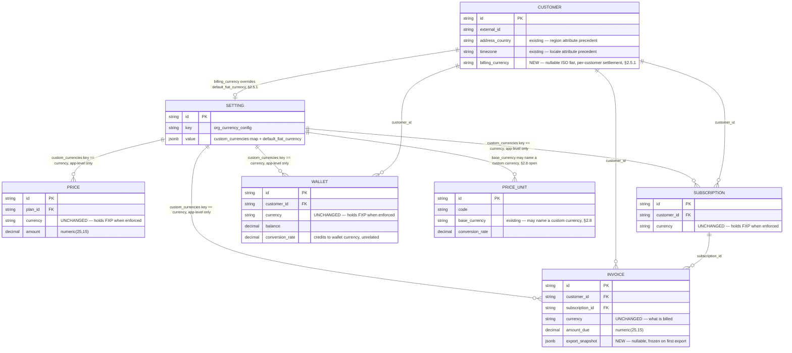
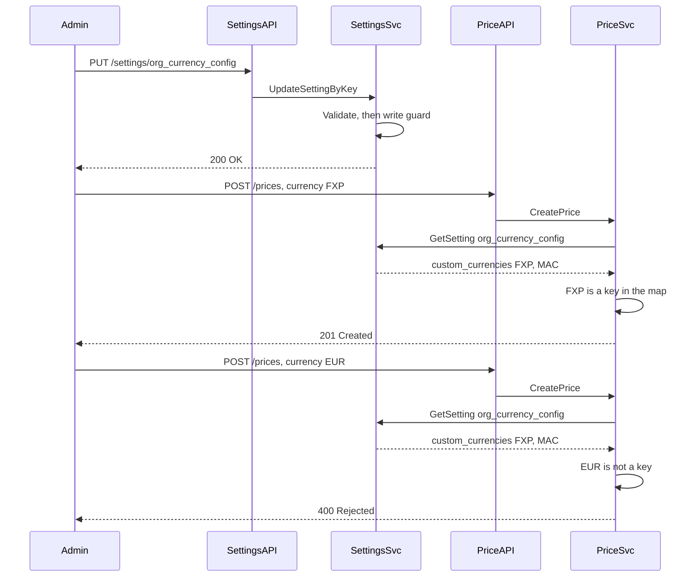
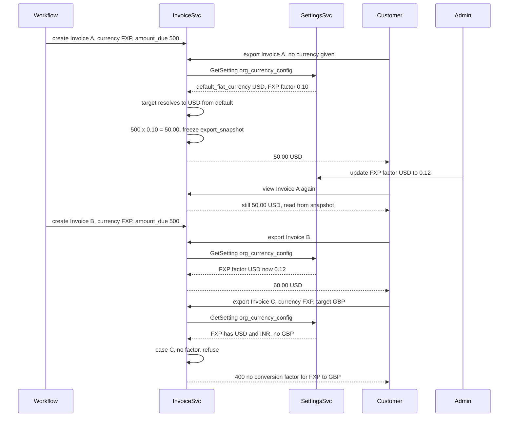

# Custom Org Currency — Design

Status: **Proposed**
Date: 2026-08-27

---

## 1. Problem Statement

An org that wants to run its ledger (plans, subscriptions, wallets) in its own custom currency — e.g. `FXP` — cannot today. `PriceUnit` exists, but it is authoring sugar and invoice-display sugar only: a price can be *entered* in a custom unit, but it is immediately converted to a fixed fiat currency and stored as fiat; a wallet can be *seeded* from a custom unit, but becomes an ordinary fiat wallet the instant it's created. Nothing — event, usage record, wallet balance, subscription — is ever actually denominated in the custom unit at rest. (Current-state trace: `internal/ee/service/price.go:1459`, `internal/ee/service/wallet.go:159`.)

The real requirement is the opposite: the org's entire billing surface — plan charges, subscriptions, wallets — should live natively in one or more org-defined currencies, all the time. Fiat appears only at the boundary where a human has to pay: an invoice shown to an end customer must be expressed in a real currency they understand, converted via a factor the org controls.

**Goal:**
1. A set of org-defined currencies per tenant (scope: §7.1), each with a conversion factor to every fiat currency the org bills in, plus one `default_fiat_currency`.
2. Once configured, every Price / Subscription / Wallet is created in one of those currencies — enforced.
3. Anything customer-facing resolves its fiat currency from the config — explicit request value first, `default_fiat_currency` otherwise.
4. A later factor edit affects only computations *after* the edit; already-exported invoices are frozen.
5. **A malformed or partially-deleted config never silently misprices money** (§2.6).

---

## 2. Approach

### 2.1 This does not touch the existing PriceUnit entity

An earlier revision routed everything through `PriceUnit` (`ent/schema/priceunit.go`) — a real entity with its own table, CRUD API, and cache. Wrong shape: what's needed is a small, per-tenant set of `{code, name, symbol, factors}` records. `Setting` already exists for exactly this (`internal/domain/settings/model.go:12`). Standing up a full entity for a four-field record is unwarranted.

| | PriceUnit-entity approach (discarded) | This design |
|---|---|---|
| Storage | new/changed `price_units` table row per currency | one `settings` row's `value` |
| Link from Price/Sub/Wallet | new `price_unit_id` FK column on each | none — the existing `currency` string column holds the code |
| Creating a currency | `POST /prices/units` | `PUT /settings/org_currency_config` |
| Schema migration | new/changed columns on 4 tables | none — `settings.value` is already `jsonb`; only `invoices` gains one column (§2.5) |

How this coexists with `PriceUnit`, which still exists and still works: §2.8.

### 2.2 The Setting — value structure

Key `org_currency_config` (name open, §7.1). **Settings are already tenant/environment-isolated at the row level** — `EnvironmentID` is taken from request context, never from the payload (`internal/api/dto/settings.go:47`), and tenant-level keys simply leave it unset (`isTenantLevelSetting`, `internal/ee/service/settings.go:55`). So no scoping fields appear in the value below; the scope is a one-line decision in `isTenantLevelSetting`, discussed in §7.1.

```go
// OrgCurrencyConfig defines the tenant's own currencies and the fiat currency that
// customer-facing amounts fall back to. Resolution rules: §2.6.
type OrgCurrencyConfig struct {
	// CustomCurrencies is keyed by currency code — the same value as each entry's
	// own Code field. Map, not a list: every read is a lookup by code, and a map
	// makes duplicate codes structurally impossible instead of a validation rule.
	CustomCurrencies map[string]CustomCurrency `json:"custom_currencies" validate:"dive"`

	// DefaultFiatCurrency is the tenant-wide LAST RESORT, not the answer for every
	// customer. It is used only when neither the request nor the customer names a
	// currency (resolution chain: §2.5.1), and as the presentation fallback in
	// §2.6 case F. A multi-region tenant sets per-customer currencies instead of
	// relying on this. Required whenever CustomCurrencies is non-empty.
	DefaultFiatCurrency DefaultFiatCurrency `json:"default_fiat_currency"`
}

// CustomCurrency is one org-defined currency. Code must be exactly 3 characters so
// it satisfies every existing currency validator unchanged — see §2.3.
type CustomCurrency struct {
	Code                  string                     `json:"code" validate:"required,len=3"`
	Name                  string                     `json:"name" validate:"required"`
	Symbol                string                     `json:"symbol" validate:"required"`
	FiatConversionFactors map[string]decimal.Decimal `json:"fiat_conversion_factors" validate:"required,min=1"`
}

type DefaultFiatCurrency struct {
	Code   string `json:"code" validate:"required,len=3"`
	Symbol string `json:"symbol" validate:"required"`
	Name   string `json:"name" validate:"required"`
}
```

Wire format — no `environment_id`, no `status`:

```json
{
  "key": "org_currency_config",
  "value": {
    "custom_currencies": {
      "FXP": {
        "code": "FXP",
        "name": "Flexprice Credits",
        "symbol": "FXP",
        "fiat_conversion_factors": { "USD": "0.10", "INR": "8.50" }
      },
      "MAC": {
        "code": "MAC",
        "name": "MoEngage AI Credits",
        "symbol": "MAC",
        "fiat_conversion_factors": { "USD": "0.05", "INR": "4.25" }
      }
    },
    "default_fiat_currency": {
      "code": "USD",
      "symbol": "$",
      "name": "US Dollar"
    }
  }
}
```

`Validate()` enforces: map key equals the entry's `Code`; every `FiatConversionFactors` value is positive; `DefaultFiatCurrency` is present and non-empty when `CustomCurrencies` is; `DefaultFiatCurrency.Code` is not itself a custom currency code. Codes and factor keys are lowercased on write, matching `CreatePriceUnitRequest.Validate` (`internal/api/dto/priceunit.go:44`); shown uppercase here only because that's how the example was given.

Read via `GetSetting[types.OrgCurrencyConfig](s, ctx, ...)` (`ee/service/settings.go:225`), written via `UpdateSetting` (`:272`) through `PUT /settings/:key` (`api/router.go:735`), already `superAdminOnly` for every key.

**There is no `status` field.** Retirement is handled by the write guard plus real migration (§2.7), not a soft-delete flag.

### 2.3 Enforcement — the existing `currency` column carries the code, zero validators relaxed

`Code` is required to be exactly 3 characters — deliberately, so it passes every existing check unmodified, exactly as `"usd"` does:

- `CreatePriceRequest.Currency` — `validate:"required,len=3"` (`internal/api/dto/price.go:19`)
- `CreateSubscriptionRequest.Currency` — `validate:"required,len=3"` (`internal/api/dto/subscription.go:531`)
- `types.ValidateCurrencyCode` — `len(currency) != 3` (`internal/types/currency.go:93`), called from `wallet.go:128,185`, `invoice.go:247,515`, `payment.go:258`, `payment_method.go:64`

None are touched. `"fxp"` is, to all of them, just a 3-character string.

The one new check, at Price / Subscription / Wallet creation: if `custom_currencies` is non-empty, `currency` must be a key in it (case-insensitive). Additive logic after the existing validators, not a change to them. Empty/absent config → today's behavior, unrestricted ISO fiat.

Applies to every price-bearing entity — plan, addon, one-off charges — not just the standalone Price create path.

### 2.4 Wallet

No new column. `Wallet.Currency = "fxp"`. `Wallet.ConversionRate` / `TopupConversionRate` (credits ↔ wallet-currency) are untouched and unrelated (`internal/domain/wallet/model.go:16-42`).

Wallet-pays-invoice matching (`IsMatchingCurrency`, exact string compare — `wallet_payment.go:84`, `payment.go:237`, `payment_processor.go:566`) needs no change: wallet and invoice carry the same code.

### 2.5 Invoice + export

Invoices generate and finalize entirely in the custom currency — `Invoice.Currency = "fxp"`, `AmountDue` in `fxp`. No fiat input in the billing cycle.

```
POST /invoices/{id}/export { "currency": "usd" }   // "currency" optional
```

1. **Resolve target fiat** through the chain in §2.5.1 — never a caller-invented value.
2. Resolve `invoice.Currency` through §2.6.
3. `rate := entry.FiatConversionFactors[target]`; missing → §2.6 case C.
4. `amount = RoundToCurrencyPrecision(invoice.amount_due × rate, target)` (`internal/types/currency.go:137`, unmodified).
5. Persist one field — `export_snapshot jsonb`, the **only Ent schema migration in this design**:
   ```json
   { "currency": "usd", "amount": "50.00", "conversion_rate": "0.10", "exported_at": "2026-08-27T10:00:00Z" }
   ```

Re-exporting the same invoice returns the frozen snapshot — no recompute. A factor edit therefore only affects invoices exported *after* it.

### 2.5.1 Which fiat currency does a customer get billed in?

A single tenant-wide `default_fiat_currency` cannot answer this. A tenant operating across regions bills its Indian customers in INR and its US customers in USD — from the *same* ledger currency (`FXP`), in the *same* environment, often in the *same* automated billing run. Forcing one tenant-wide value would either mis-bill one region or require a human to pass `currency` explicitly on every invoice, which automated billing workflows have no way to do.

So the export target resolves through a chain, most specific first:

| Order | Source | When it applies |
|---|---|---|
| 1 | `currency` on the export request | Explicit per-invoice override — a one-off, or a customer asking for a different currency this once |
| 2 | `customer.billing_currency` | **The regional answer.** Set once per customer; every invoice for them settles in it, including fully automated runs |
| 3 | `default_fiat_currency.code` from the setting | Tenant-wide last resort, for customers with no preference set |
| 4 | — | Nothing resolved → reject. Never guessed |

**`Customer.billing_currency`** is a new nullable column. This follows the precedent already on that entity: `Customer` carries `address_country` and `timezone` (`ent/schema/customer.go:85,90`) — per-customer region and locale attributes are exactly what it already models, and settlement currency is one more. It holds a plain ISO fiat code (`"inr"`), never a custom currency code; a custom code there would be meaningless, since this field answers *what real money does this customer pay in*.

Nullable is deliberate — an unset value means "no regional preference, use the tenant default", which is the correct behavior for single-region tenants and keeps this entirely opt-in. No backfill, no behavior change for anyone who doesn't set it.

**Validation is soft, by necessity.** A customer's `billing_currency` is only usable if the custom currency being billed has a factor for it — `INR` on the customer is useless if `FXP.fiat_conversion_factors` has only `USD`. That can't be hard-enforced at customer-write time: the customer may be created before the currency exists, factors get added later, and one customer may be billed across several custom currencies with different factor coverage. So customer-write validates opportunistically (reject only if *no* configured custom currency has a factor for it — an unambiguous mistake) and §2.6 case C is the real backstop at export, where the exact pairing is finally known.

### 2.6 Resolution rules — what happens when the config is wrong

This is the clean flow for the gap: **two stated rules ("raise the error" vs "use the default so nothing breaks") apply to two different things, and the split is by what's being asked for, not by how broken the config is.**

The governing principle:

> **A conversion factor is never guessed. Presentation data is always substituted.**

Getting a factor wrong misprices real money and is unrecoverable once invoiced. Getting a symbol wrong is cosmetic. So money paths fail loudly; display paths degrade silently. Every case falls out of that one rule:

| # | Config state for `entity.currency = X` | Money path (export amount, wallet debit, cost calc) | Display path (symbol, name, label) |
|---|---|---|---|
| **A** | `custom_currencies[X]` present, factor for target fiat present | Normal — convert and proceed | Normal |
| **B** | `custom_currencies[X]` present; `name`/`symbol` empty | Unaffected — factor is intact, money is correct | Substitute `X` itself as symbol and name. **Log error.** Never fails |
| **C** | `custom_currencies[X]` present; **factor for the target fiat missing** | **Reject.** `no conversion factor configured for X→USD`. Nothing persisted, nothing charged | Renders fine from `symbol`/`name` |
| **D** | `custom_currencies[X]` **entirely absent**, and `X == default_fiat_currency.code` | Normal — X *is* plain fiat. No conversion needed; the amount already is in that currency | Use `default_fiat_currency.symbol`/`.name` |
| **E** | `custom_currencies[X]` **entirely absent**, X is a valid ISO code, config is empty or X isn't custom | Normal — ordinary fiat, pre-existing behavior | Existing `GetCurrencySymbol` (`types/currency.go:62`) |
| **F** | `custom_currencies[X]` **entirely absent**, X is neither the default nor plain fiat — i.e. a live entity references a code the config no longer has | **Reject + log error.** Cannot convert; see below | Fall back to `default_fiat_currency` symbol/name so pages still render. **Log error** |

**Case F is the one that needs justifying, because it is where "nothing should break" and "never misprice" genuinely collide.**

The tempting reading of "use the default currency in place" is: treat the amount as if it were already in `default_fiat_currency`. That is a silent 1:1 reinterpretation. If a wallet holds `500 FXP` and FXP's real factor is `0.10 USD`, its true value is `$50`. Substituting the default at 1:1 turns it into `$500` — a 10× error, applied to every wallet and invoice on that code, with no error surfaced and no way to detect it after the fact from the data alone. That is strictly worse than an outage: an outage is loud, reversible, and fixed by restoring one config key; a silent 10× mispricing is none of those.

So case F splits: **the fallback applies to presentation only.** Pages, PDFs, and labels keep rendering using the default currency's symbol and name — nothing 500s, the customer-facing surface stays up. But any operation that must produce an *amount* refuses and logs, because there is no correct number available to produce.

Every one of B, C, and F logs at `Error` with the currency code and the entity id — these states are only reachable if the config was mutated out from under live data, which §2.7 exists to prevent. The runtime rules here are the second line of defense, not the first.

### 2.7 Removing or replacing a currency

Two mechanisms, in order of precedence.

#### 2.7.1 Write-time guard — the primary protection

`PUT /settings/:key` is a **blind full-value replace**: whatever value the caller sends becomes the new value, checked only for internal shape. Nothing in that path knows whether a code being dropped is load-bearing for a live wallet balance. The failure mode isn't only deliberate deletion — an admin correcting one factor whose payload accidentally omits another entry produces the identical result, silently, until the next computation needing it hits case F.

Closed at write time, in the settings service, following the same per-key special-casing already used there (`requireSAMLEnabled`, `apiImmutableSettingFields`, `mergePreservingImmutableFields` — `ee/service/settings.go:69-161`):

```go
// updateOrgCurrencyConfig guards writes to SettingKeyOrgCurrencyConfig, run before persist.
func (s *settingsService) updateOrgCurrencyConfig(ctx context.Context, old, new types.OrgCurrencyConfig) error {
	for code, oldEntry := range old.CustomCurrencies {
		newEntry, present := new.CustomCurrencies[code]

		removedFactors := []string{}
		if present {
			for fiat := range oldEntry.FiatConversionFactors {
				if _, ok := newEntry.FiatConversionFactors[fiat]; !ok {
					removedFactors = append(removedFactors, fiat)
				}
			}
		}

		if !present || len(removedFactors) > 0 {
			inUse, err := s.currencyStillReferenced(ctx, code)
			if err != nil {
				return err
			}
			if inUse {
				return ierr.NewErrorf(
					"org_currency_config: %q is still referenced by live entities — migrate them before removing it",
					code,
				).Mark(ierr.ErrValidation)
			}
		}
	}
	return nil
}
```

`currencyStillReferenced` is new repository work: an existence query over Price / Subscription / Wallet / non-finalized Invoice filtered on `currency = code`. **This is what actually enforces removal safety** — §2.6 case F is only reachable if this guard was bypassed (direct DB edit, a bad migration), which is precisely why F must not silently invent numbers.

Editing a factor's *value* is unaffected — nothing is removed, so no existence check runs. That path is safe because of the export snapshot (§2.5), not because of this guard.

#### 2.7.2 Migration — the only way to actually remove a referenced currency

With no `status` flag, there is no soft-delete: a currency in use cannot be removed until the entities using it have moved. That means real migration, and it is genuinely three hard problems, not a string rewrite:

1. **The conversion isn't 1:1.** `MAC` → `FXP` requires a cross-rate through a fiat pivot both share: `cross = MAC.factors[USD] / FXP.factors[USD]`. No shared pivot → no valid answer, refuse.
2. **Wallet balance conversion is real money movement.** `balance`/`credit_balance` recomputed via cross-rate, but only as an explicit, transactional, audited ledger entry — never a field overwrite.
3. **Price is conventionally immutable.** Create a *new* Price in the target currency and repoint live subscription line items — the pattern `ProcessSubscriptionPriceOverrides` already uses. Mutating Price rows retroactively changes what past proration computed against.

`Invoice` is never migrated regardless: a finalized invoice records what was actually billed. Only invoices generated *after* a migration see the new currency.

**Not designed here.** Until it exists, a referenced currency simply cannot be removed — the guard rejects it. That is the deliberate trade: no removal is better than unsafe removal.

### 2.8 Interaction with the existing PriceUnit entity

`PriceUnit` still exists and still works as it does today (§2.1). The two features overlap on one field: `PriceUnit.base_currency`, the fiat currency a custom price unit is pegged to.

Once a tenant has org currencies configured, a `PriceUnit` created in that scope should be able to peg to an **org currency code** rather than only an ISO fiat code — otherwise the tenant has two disconnected notions of "custom currency" and a PriceUnit-priced Price lands in a currency the org config doesn't recognize (straight into §2.6 case F).

Proposed: `base_currency` accepts either an ISO code (today) or a key of `custom_currencies`. Because org currency codes are 3 characters (§2.3), this needs no schema or validator change — only a resolution order at PriceUnit creation: check `custom_currencies` first, fall through to ISO. **Open for discussion — §7.4.**

---

## 3. ERD

Open for discussion. Two new columns in the entire design: `INVOICE.export_snapshot` and `CUSTOMER.billing_currency`.



`tenant_id` / `environment_id` / `status` / timestamps exist on every row above via shared mixins and are omitted — `SETTING` in particular is already tenant+environment isolated at the row level, which is why no scoping field appears in its `value`.

What this diagram deliberately cannot show: a `CustomCurrency` is never a row anywhere — it exists only inside `SETTING.value`, so every edge above is an application-level string match, not a foreign key. Nothing in the database enforces that a `WALLET.currency` of `FXP` corresponds to anything; §2.7.1 (write guard) and §2.6 (resolution rules) are what stand in for referential integrity, which is exactly why both exist.

---

## 4. Sequence diagrams

### 4.1 Setup and enforced creation



```json
// accepted
{ "plan_id": "plan_01J...", "currency": "fxp", "amount": "5" }
→ 201 { "id": "price_01J...", "currency": "fxp" }

// rejected
{ "plan_id": "plan_01J...", "currency": "eur", "amount": "5" }
→ 400 { "code": "ErrValidation", "message": "currency must be one of: fxp, mac" }
```

Touchpoints: `CreatePrice` (`ee/service/price.go:60`), `GetSetting[OrgCurrencyConfig]` (`ee/service/settings.go:225`), `PUT /settings/:key` already `superAdminOnly` (`api/router.go:735`).

### 4.2 Export, fallback resolution, and the factor-edit guarantee



```json
// no currency given — resolves to default_fiat_currency.code
POST /invoices/inv_A/export {}
→ 200 { "export_snapshot": { "currency": "usd", "amount": "50.00", "conversion_rate": "0.10", "exported_at": "..." } }

// unchanged after the factor edit — read from the snapshot
GET /invoices/inv_A
→ 200 { "export_snapshot": { "currency": "usd", "amount": "50.00", "conversion_rate": "0.10", "exported_at": "..." } }

// exported after the edit
POST /invoices/inv_B/export {}
→ 200 { "export_snapshot": { "currency": "usd", "amount": "60.00", "conversion_rate": "0.12", "exported_at": "..." } }

// §2.6 case C — factor missing for the requested target
POST /invoices/inv_C/export { "currency": "gbp" }
→ 400 { "code": "ErrValidation", "message": "no conversion factor configured for fxp→gbp" }
```

Touchpoints: `amount_due` from `CalculateCost` (`ee/service/price.go:1073`), unchanged; `ExportInvoice` is a new method on `invoiceService` (`ee/service/billing.go`) plus a new route; rounding reuses `types.RoundToCurrencyPrecision` (`types/currency.go:137`).

---

## 5. Migration

- Add `SettingKeyOrgCurrencyConfig` to `allowedKeys` (`internal/types/settings.go:39-53`), and decide its scope in `isTenantLevelSetting` (`ee/service/settings.go:55`) — §7.1.
- Add one column, `export_snapshot jsonb`, to `invoices`.
- Add one column, `billing_currency` (nullable string), to `customers` — §2.5.1. No backfill; NULL means "use the tenant default", which is correct for every existing customer.
- New repository method `currencyStillReferenced` for the §2.7.1 guard.
- Nothing on `price_units`, `prices`, `subscriptions`, `wallets`; no existing currency validator changes (§2.3).

---

## 6. Scenarios

Configured throughout: `custom_currencies` = `FXP`, `MAC`; `default_fiat_currency` = `USD`.

| # | Scenario | Result |
|---|---|---|
| 1 | No `org_currency_config`, or `custom_currencies` empty | Today's behavior — any valid ISO fiat code, unrestricted |
| 2 | Create a Price with `currency: "fxp"` | `FXP` is a key in `custom_currencies` — created |
| 3 | Create a Price with `currency: "eur"` | Passes ISO checks but isn't a configured key — `400 currency must be one of: fxp, mac` |
| 4 | Create a Price with `currency: "xyz"` | Same membership failure as #3 |
| 5 | Export an `FXP` invoice for a customer with no `billing_currency`, no `currency` in the request | Chain step 3 — `default_fiat_currency.code` = `USD`, converts at `0.10` |
| 6 | Export an `FXP` invoice explicitly to `"inr"` | Chain step 1 — explicit request value wins over everything below it, converts at `8.50` |
| 6a | **Multi-region:** automated billing run covers an Indian customer (`billing_currency: "inr"`) and a US customer (`billing_currency: "usd"`), both on `FXP` plans, same environment, same run | Each invoice resolves independently at chain step 2 — the Indian invoice settles at `8.50` INR/FXP, the US one at `0.10` USD/FXP. No human input, no per-invoice override needed |
| 6b | Customer has `billing_currency: "inr"`, but this one invoice is exported with an explicit `{"currency": "usd"}` | Chain step 1 beats step 2 — `USD` is used for this invoice only; the customer's standing preference is unchanged |
| 6c | Customer has `billing_currency: "gbp"`, billed on `FXP`, which has factors only for `USD`/`INR` | Chain resolves `GBP` at step 2, then §2.6 **case C** rejects at the factor lookup — `no conversion factor configured for fxp→gbp`. Soft validation at customer-write did not catch this because `GBP` may be valid for a different custom currency (§2.5.1) |
| 7 | Export an `FXP` invoice to `"gbp"`, which `FXP` has no factor for | §2.6 **case C** — rejected, `no conversion factor configured for fxp→gbp`. Nothing persisted |
| 8 | Export the same invoice twice | Second call returns the frozen `export_snapshot` verbatim — no re-lookup, no drift |
| 9 | Admin edits `FXP.USD` from `0.10` to `0.12` between two invoices' exports | Already-exported invoice keeps `0.10`; the next export uses `0.12`. It's the invoice's export state that's frozen, not a point in time |
| 10 | `FXP` wallet pays an `FXP` invoice | Exact string match — existing `IsMatchingCurrency` unchanged |
| 11 | Card payment settles | Charges `export_snapshot.amount` in `export_snapshot.currency` — the exact figure shown to the customer |
| 12 | Admin sends a `PUT` that removes `MAC` while a live `MAC` wallet exists | §2.7.1 guard rejects — `still referenced by live entities` |
| 13 | Admin fixes an `FXP` factor but the payload accidentally omits `MAC` entirely | Same rejection as #12 — the guard can't tell accident from intent, which is the point |
| 14 | Admin removes `MAC` when nothing references it | Allowed — entry disappears from the map |
| 15 | Admin edits `FXP.USD` value; key still present | Allowed unconditionally — no removal, so no existence check. Safety comes from the export snapshot, not the guard |
| 16 | Admin fat-fingers `FXP.USD` to `"10.0"`; key still present | **Not caught** — the guard only fires on removal. Open gap, §7.3 |
| 17 | A `MAC` entry has an empty `symbol` | §2.6 **case B** — money math unaffected; UI renders `MAC` as its own symbol; error logged |
| 18 | A live wallet holds `MAC`, but `MAC` is gone from config (direct DB edit / bad migration — the guard was bypassed) | §2.6 **case F** — the wallet page still renders using `USD` symbol/name, error logged; any debit or export **refuses** rather than silently valuing `500 MAC` as `$500` |
| 19 | An invoice's currency is `USD`, which equals `default_fiat_currency.code` and isn't in `custom_currencies` | §2.6 **case D** — plain fiat, no conversion needed, proceeds normally |
| 20 | Tenant wants to retire `MAC` entirely and move its wallets to `FXP` | Not possible yet — §2.7.2 migration is unbuilt, and the guard blocks removal until entities move. Deliberate: no removal beats unsafe removal |

---

## 7. Open questions

1. **Scope: tenant-level or tenant × environment?** Settings support both — `isTenantLevelSetting` (`ee/service/settings.go:55`) leaves `environment_id` unset for tenant-wide keys, and `dto/settings.go:47` otherwise pulls it from context. Arguments both ways: a currency is an organizational identity (tenant-level, like `saml_config`), but rates and enforcement may need to differ between production and a sandbox environment (env-level, like most keys). **Undecided — this changes one line and must be settled before implementation.**
2. **Setting key name** — `org_currency_config` is proposed. `currency_config` is shorter and doesn't imply org-vs-env scope, which is still open per #1.
3. **No protection against a wrong factor *value*.** §2.7.1 blocks removal, not `"0.10"` → `"10.0"` (scenario 16). A delta check — reject an edit moving a factor more than N% in one write — would close it. Not designed here.
4. **PriceUnit ↔ org currency reconciliation (§2.8).** Should `PriceUnit.base_currency` accept an org currency code? If yes, resolution order at PriceUnit creation is "custom first, ISO fallback" and needs no schema change. If no, the two features stay disconnected and a PriceUnit-priced Price can land in a currency the org config doesn't know — straight into case F. Leaning yes; needs a decision.
5. **Grandfathering.** Entities created before a currency existed in config, or in plain fiat before enforcement was switched on — case E covers them at runtime, but whether they should be migrated or left is undecided.
6. **Where per-customer billing currency lives (§2.5.1).** Proposed as a new `Customer.billing_currency` column, matching the `address_country` / `timezone` precedent already on that entity. Two alternatives were considered and not taken: **Customer metadata** (zero migration, but untyped, unvalidated, and invisible to any query that needs to group customers by settlement currency), and **Subscription-level** (finer-grained, but a customer with two subscriptions could end up with two settlement currencies, and an invoice spanning both would have no coherent answer). Needs a decision; customer-level is the recommendation.
7. **Should `default_fiat_currency` be split into two fields?** It currently serves two roles — chain step 3 (tenant-wide export default) and the §2.6 case F presentation fallback. Both are genuinely "when nothing else is known, use this", so one field is proposed. Splitting them would allow exporting in USD by default while rendering broken-config pages in the tenant's home currency — an edge case thin enough that it doesn't justify a second field until someone asks.
8. **`currencyStillReferenced` cost.** A synchronous existence query per removed code on every config write. Config writes should be rare, but this hasn't been measured against real table sizes.
