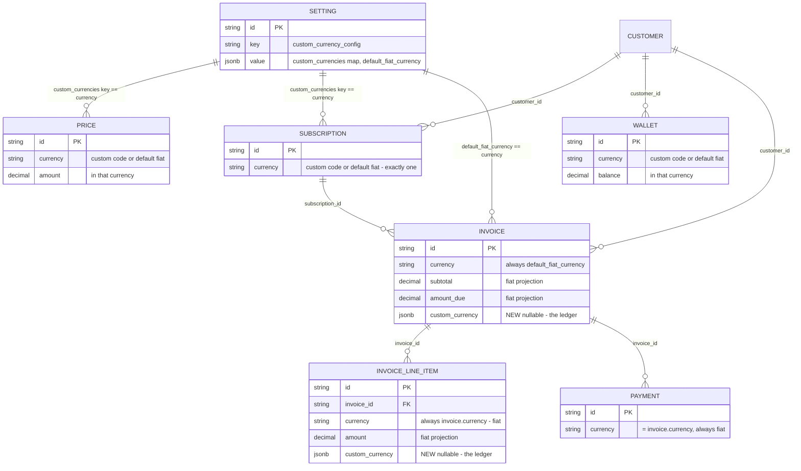

# Tenant Custom Currency — Design

Status: **Approved — implementation pending**
Date: 2026-08-27 · Revised 2026-09-04

---

## 1. Problem Statement

A tenant should be able to define its own currency — e.g. `MAC` — and have the product operate in it. Plans, prices, subscriptions, wallets, usage costs and analytics are all denominated and computed in that currency.

Fiat appears at exactly one boundary: the invoice. An invoice reading `500 MAC` is meaningless to whoever has to pay it, and no gateway will collect it. So the invoice — and everything downstream of it — is denominated in the tenant's `default_fiat_currency`.

**Design in one line:** the custom currency is the operating currency; the invoice is a fiat projection of it, converted exactly once.

**Goals**

1. A tenant defines its custom currencies and their conversion factors to the fiat currency it bills in.
2. Every Price, Subscription, Wallet and Addon is created in a supported currency — a custom code or the default fiat — enforced.
3. Invoices and invoice line items are always denominated in `default_fiat_currency`.
4. Custom-currency amounts are carried alongside in a `custom_currency` object and are the source of truth for every recomputation.
5. Conversion happens once, at the end, on the invoice total — never per line item.
6. An invoice's conversion rate freezes at finalization. Later factor edits never move it.

---

## 2. Approach

### 2.1 The setting

Key `custom_currency_config`. Settings are already tenant/environment-isolated at the row level — `EnvironmentID` comes from request context, never from the payload (`internal/api/dto/settings.go:47`), and tenant-level keys leave it unset (`isTenantLevelSetting`, `internal/ee/service/settings.go:55`). No scoping fields appear in the value.

```go
type CustomCurrencyConfig struct {
	// keyed by currency code; the code lives only as the map key
	CustomCurrencies map[string]CustomCurrencyDefinition `json:"custom_currencies" validate:"dive"`

	// the currency invoices are denominated in; every custom currency needs a factor for it
	DefaultFiatCurrency string `json:"default_fiat_currency"`
}

type CustomCurrencyDefinition struct {
	Name                  string                     `json:"name" validate:"required"`
	Symbol                string                     `json:"symbol" validate:"required"`
	FiatConversionFactors map[string]decimal.Decimal `json:"fiat_conversion_factors" validate:"required,min=1"`
}
```

```json
{
  "key": "custom_currency_config",
  "value": {
    "custom_currencies": {
      "mac": {
        "name": "MoEngage AI Credits",
        "symbol": "MAC",
        "fiat_conversion_factors": { "usd": "0.10", "inr": "8.50" }
      }
    },
    "default_fiat_currency": "usd"
  }
}
```

#### What a conversion factor means

**A factor is how much fiat one unit of the custom currency is worth.** Always fiat-per-custom, never the other way round.

```
fiat   = custom × factor
custom = fiat   ÷ factor
```

So `"usd": "0.10"` above reads *1 MAC = $0.10*, and 150 MAC bills as $15.00.

This direction is not arbitrary — it matches the two conversions already in the codebase, so all three read the same way:

| Existing | Formula |
| --- | --- |
| `priceunit.ConvertToFiatCurrencyAmount` | `fiat_amount = price_unit_amount × conversion_rate` |
| Wallet credits | `amount = credits × conversion_rate` |
| This feature | `fiat = custom × factor` |

**Configuring it.** If the rate you have is expressed the other way round — *fiat to custom* — invert it before storing:

| You want | Store |
| --- | --- |
| 1 MAC = $0.10 | `"usd": "0.10"` |
| 1 MAC = $10.00 | `"usd": "10.00"` |
| **1 USD = 0.8 MAC** | **`"usd": "1.25"`** — invert: `1 ÷ 0.8` |
| 1 USD = 100 MAC | `"usd": "0.01"` — invert: `1 ÷ 100` |

The last two are the easy mistake. Storing `0.8` for *1 USD = 0.8 MAC* would make 1 MAC worth $0.80 instead of $1.25 — a plausible-looking number that silently misprices every invoice on that currency. Nothing in the config can detect it (§7.2), so it is worth stating on the settings UI next to the field.

The example above is internally consistent: `usd: 0.10` and `inr: 8.50` together imply $1 = ₹85. Factors for different fiat currencies are independent — nothing cross-checks them.

`Validate()` enforces: every factor positive; `default_fiat_currency` present whenever `custom_currencies` is non-empty; the default is not itself a custom code; **every custom currency carries a factor for the default fiat currency**; no duplicate codes after lowercasing. Codes and factor keys are lowercased on write, matching `CreatePriceUnitRequest.Validate` (`internal/api/dto/priceunit.go:44`).

**Precision.** A custom currency is money-like and uses the 2-decimal default from `RoundToCurrencyPrecision`. No `precision` field. Revisit only if a tenant needs a token-like unit.

### 2.2 Enforcement

A custom currency code is 3 characters, so it passes every existing currency validator unchanged — none of them check that a code is a real world currency, only its length (`internal/types/currency.go:93`, `dto/price.go:19`, `dto/subscription.go:531`).

The one new rule, `CustomCurrencyConfig.EnforceCurrency`: when creating a Price, Subscription, Wallet or Addon, the currency must be **either a configured custom code or `default_fiat_currency`**. Tenants with no config are unaffected.

Fiat stays allowed deliberately. A tenant may want some charges billed directly in fiat, and those flow through the existing pipeline with no conversion at all.

**A subscription is in exactly one currency.** Plan charges may exist in both custom and fiat; a subscription bills only the prices matching its own currency. That is existing behaviour and it is intended — but it is a silent drop, so it is logged.

### 2.3 The ledger / projection split

This is the core of the design.

> **The `custom_currency` object is the ledger. The fiat columns are a projection of it.**

Every monetary computation — subtotal, prepaid credits, discounts, tax — happens in custom-currency space, reading and writing `custom_currency.*`. The fiat columns (`subtotal`, `total`, `amount_due`, …) are then produced by one multiplication and stored so that everything downstream — payments, gateways, vendor sync, PDF, analytics — sees ordinary fiat and needs no knowledge of this feature.

The projection is refreshed twice:

| Stage | Rate used | Effect |
| --- | --- | --- |
| Compute | live factor from config | Draft is self-describing and correctly denominated |
| Finalization | frozen into `custom_currency.rate` | Sealed; later factor edits cannot restate it |

Nothing in the custom pipeline ever reads a fiat column, so the "no conversion until the invoice" property holds exactly.

**Why not convert per line item.** `sum(round(custom × rate))` ≠ `round(sum(custom) × rate)`. Converting each line and summing loses money against the total. So the subtotal is always derived from the custom sum:

```
subtotal_custom = sum(quantity × unit_price)      // custom currency
subtotal_fiat   = subtotal_custom × rate          // one conversion
```

Never `sum(line_item.amount)`. The accepted consequence: a line item's fiat `amount` can differ from its exact share of the total by sub-cent rounding, so the fiat line items do not sum precisely to `subtotal`. Every path that currently derives a total by summing line items must take the custom branch instead (§4, steps 5 and 7).

### 2.4 `IsMatchingCurrency` is the guard

The system already compares currencies before applying money from one entity to another. That comparison is the whole enforcement mechanism here — nothing new is introduced, the existing checks simply get the right currency passed to them.

| Applying | Matches against | Behaviour on mismatch |
| --- | --- | --- |
| Prepaid credits (wallet → invoice) | subscription / custom currency | Not applied, logged at Info |
| Coupon discount | `subscription.Currency` — already implemented at `coupon_validation.go:112` | Filtered out before application |
| Wallet pays invoice | `invoice.Currency` (fiat) — unchanged | Wallet is not a candidate |
| Ongoing balance — usage | subscription currency | Not counted |
| Ongoing balance — pending invoices | custom code when the wallet is custom | Not counted |

Every skip is logged with both currencies and the amount, so the arithmetic is reconstructable from logs.

**Consequence, accepted:** a wallet in a custom currency can never pay an invoice, because the invoice is fiat and `wallet_payment.go:142` and `payment_processor.go:566` both require an exact match. That is correct — a MAC balance cannot settle a USD debt — and it means the payment path needs no changes at all. A custom-currency wallet still applies prepaid credits (which happen in custom space, before conversion) and still reports an ongoing balance.

### 2.5 Invoice lifecycle

**Empty draft** (`CreateEmptyDraftInvoice`) — a zero-dollar scaffold reserving the period. `currency` is set to `default_fiat_currency`; `custom_currency` is created holding only the code, resolved from the subscription's currency. No amounts, nothing to convert.

**Computed draft** (`ComputeInvoice`, `invoice.go:~520-571`) — line items are priced in the custom currency and written to each line's `custom_currency` object; the invoice's `custom_currency.subtotal` is the sum of `quantity × unit_price`; coupons apply in custom space. All of it is then projected to the fiat columns at the **live** factor and persisted.

This stage matters: compute writes real money onto a `DRAFT` row (`invoice.go:525-531`), persists it (`:571`) and fires `WebhookEventInvoiceUpdate` (`:582`). Projecting at compute is what keeps that row and that webhook correctly denominated instead of publishing custom-magnitude numbers labelled with a fiat code.

**Finalization** (`performFinalizeInvoiceActions`) — under the row lock, in custom space:

```
subtotal_custom                                     // from compute
  - prepaid_credits_custom                          // wallet debit, currency-matched
  - discount_custom
  + tax_custom                                      // exclusive; inclusive already in subtotal
  = total_custom, floored at 0
```

then the rate is frozen into `custom_currency.rate` and every fiat column is projected once. `amount_due = total`; `amount_remaining = amount_due - amount_paid`. The zero-total payment shortcut runs **after** projection, because a small custom total can round to zero fiat.

**After finalization** — the frozen rate governs. Recomputation re-runs the custom pipeline off `custom_currency.*` and re-projects at that same frozen rate, so the amount stays mutable while the rate does not.

**Derived, never stored:** `amount_paid` and `amount_remaining` have no custom mirrors. They move with payments settled in fiat, so a stored custom copy would drift. Where a custom-space remaining is needed — the ongoing-balance read — it is derived as `amount_remaining / rate`, which stays correct through partial payments and credit notes for free.

### 2.6 Payment — unchanged

Invoices are fiat, so payments, payment links, gateways and vendor sync are untouched by this feature. `Payment.Currency = invoice.Currency`. No custom currency reaches a payment record or a provider. This is the main reason the invoice is the fiat boundary rather than the payment.

### 2.7 Config integrity — what may change

| Field | Editable? | Why |
| --- | --- | --- |
| `name`, `symbol` | **Freely, no migration** | Read from config at render time and stored nowhere else |
| `fiat_conversion_factors` — changing a value | **Yes** | Finalized invoices carry a frozen rate, so only drafts and future finalizations see it |
| `fiat_conversion_factors` — adding a key | **Yes** | Purely additive |
| `fiat_conversion_factors` — removing a key | **Not expressible in v1** | Merge can only add or overwrite |
| `code` | **Not expressible in v1** | Other tables store this exact string; changing it orphans them. A new code adds a currency rather than renaming one |
| Removing a whole custom currency | **Not expressible in v1** | Same orphaning problem, plus it requires migrating every entity across a cross-rate (§7.4) |

#### The gap

Setting writes are already fetch-merge-put: `updateSettingByKey` (`ee/service/settings.go:495`) loads the stored value, merges the request over it, and persists. But `mergePreservingImmutableFields` (`:137`) is one level deep:

```go
for k, v := range update {
	stored[k] = v
}
```

The top-level keys are `custom_currencies` and `default_fiat_currency`, so a payload sending only `{"custom_currencies": {"mac": {...}}}` assigns the whole map — **silently deleting every other currency**, written by an admin who was only fixing `mac`.

#### The solution — merge deeper, don't guard

`custom_currency_config` merges at three levels: top-level keys, then per currency code, then per fiat factor. Every write becomes strictly add-or-update:

| Payload | Effect |
| --- | --- |
| `{"custom_currencies": {"mac": {...}}}` | `mac` updated, others untouched |
| `{"custom_currencies": {"mac": {"symbol": "M"}}}` | Only `mac.symbol` changes |
| `{"custom_currencies": {"mac": {"fiat_conversion_factors": {"usd": "0.12"}}}}` | Only the `usd` factor changes; `inr` survives |

This makes removal structurally inexpressible, which is exactly the v1 position. The deliberate cost: legitimate removal is also impossible, including of one unwanted factor. When removal is supported it needs its own explicit endpoint that names its target and checks references — never looser merge semantics, which would resurrect the silent-deletion failure this fixes.

**Runtime fallbacks** for states this makes unreachable but a direct DB edit could still produce:

- **Missing factor at finalization** → fail the finalize. Sealing an invoice whose totals are still custom-magnitude but labelled fiat is worse than refusing.
- **Missing `name`/`symbol`** → log at Error, render the raw code. Cosmetic; no amount affected.
- **Missing currency code entirely** → log at Error and fail the operation. There is no correct number to produce.

---

## 3. ERD

Two new columns, both nullable jsonb. Every other table is structurally unchanged.



### Decisions

- **The invoice is the fiat boundary.** `INVOICE.currency` and `INVOICE_LINE_ITEM.currency` are always `default_fiat_currency`, so payments, gateways, vendor sync, PDF and dashboards need no changes.
- **The custom object is the ledger; fiat columns are a projection.** All arithmetic runs in custom space; the projection is refreshed at compute (live rate) and at finalization (frozen rate).
- **One conversion, on the total.** Subtotal comes from the custom sum, never from summing fiat line items. Line items therefore do not sum exactly to the subtotal — accepted.
- **`fiat = custom × rate`**, matching `priceunit.ConvertToFiatCurrencyAmount` and the wallet's `amount = credits × conversion_rate`. A `mac→usd` factor of `0.10` means 1 MAC = $0.10.
- **`IsMatchingCurrency` is the guard.** Mismatched wallets and coupons simply do not apply, and say so in the logs.
- **A wallet may be custom or fiat.** A custom wallet applies prepaid credits and reports an ongoing balance, but can never pay a fiat invoice. Deliberate.
- **A custom currency is never a row.** It lives only in `SETTING.value`, so each `SETTING` edge is a string match, not a foreign key.

---

## 4. Implementation plan

Ordered by dependency. Each step is independently verifiable.

### Step 0 — revert the superseded branch work

The branch currently implements an earlier model where line items carried the custom code. All four must come out before the new model goes in.

| Revert | File |
| --- | --- |
| `ToInvoiceLineItem` setting the line item currency to the custom code | `internal/api/dto/invoice.go:~820` |
| Permissive line-item currency check | `internal/domain/invoice/model.go:~286` — back to strict `item.Currency == i.Currency` |
| Wallet rejection of custom currencies | `internal/ee/service/wallet.go` — wallets may now be custom |
| Per-subscription rate filtering in both balance paths | `internal/ee/service/wallet.go:~1638`, `~3273` — back to plain currency matching |

### Step 1 — types

`internal/types/custom_currency.go`. Expand `CustomCurrency` from a single amount to the full ledger:

```
code, rate,
subtotal, total_discount, total_tax,
total_prepaid_credits_applied, amount_due
```

`amount_paid` and `amount_remaining` are deliberately absent — derived (§2.5). Add a line-item variant carrying `amount`, `line_item_discount`, `invoice_level_discount`, `prepaid_credits_applied`. Keep `ToFiat` and `EnforceCurrency` as they are.

*Verify:* `go build ./...`, existing `internal/types` tests pass.

### Step 2 — schema

- `ent/schema/invoice.go` — `custom_currency` jsonb, optional (already present)
- `ent/schema/invoice_line_item.go` — same, new
- `make generate-ent`, then `make generate-migration`

No backfill: existing invoices are already fiat, `custom_currency` stays NULL, and every read path treats NULL as "no custom currency".

*Verify:* generated code compiles; migration SQL adds two nullable columns and nothing else.

### Step 3 — persistence

The field is dropped on write unless every hand-enumerated field list is updated. Both of these were already found missing it once.

- `internal/repository/ent/invoice.go` — `SetCustomCurrency` in `Create` and `CreateWithLineItems`; set-or-clear in `Update`. Same for the line-item repo.
- `internal/testutil/inmemory_invoice_store.go` — `copyInvoice` and the line-item copy.

*Verify:* a round-trip test that writes and re-reads a non-nil `custom_currency` on both entities.

### Step 4 — draft creation

`CreateEmptyDraftInvoice`: read the config, resolve the custom code from the subscription's currency, set `inv.Currency = default_fiat_currency` and `inv.CustomCurrency = {code}`. No amounts. Already implemented; only needs the expanded struct.

### Step 5 — compute

`ComputeInvoice` (`invoice.go:~520-571`) — the new work.

- Price line items in the custom currency into each line's `custom_currency`.
- `custom_currency.subtotal = sum(quantity × unit_price)` — **not** `sum(line_item.amount)`.
- Apply coupons in custom space. Already currency-guarded at `coupon_validation.go:112` against `subscription.Currency`, so no new filter is needed.
- Project the invoice and every line item to fiat at the live factor.
- `billing.go:1726` — the grouped-invoicing parent merge rebuilds `Subtotal` by summing line item amounts. Take the custom branch there.

*Verify:* a computed MAC draft has fiat `subtotal` = `custom.subtotal × rate`, fiat line item amounts, and `WebhookEventInvoiceUpdate` carries fiat magnitudes.

### Step 6 — finalization

`performFinalizeInvoiceActions`.

- `credit_adjustment.go:218` — pass the **custom code** to `GetWalletsForCreditAdjustment` when `custom_currency != nil`, so a MAC wallet matches and a USD one does not. This is the one genuine bug fix in the plan: today it passes `inv.Currency`, so a USD wallet erases custom-magnitude line items 1:1, off by the whole rate.
- Run the total math in custom space off `custom_currency.*` (§2.5).
- Freeze the rate; fail the finalize if no factor exists for `inv.Currency`.
- Project every fiat column once.
- Move the zero-total payment shortcut to after projection.

*Verify:* 15 MAC at `0.10` finalizes to `$1.50` across all totals; a USD prepaid wallet applies nothing to a MAC invoice and logs why; a missing factor fails with a specific hint.

### Step 7 — read paths

- `GetUnpaidInvoicesToBePaid` (`invoice.go:2525`) — when the wallet currency is a custom code, match on `custom_currency.code` and use `amount_remaining / rate`. Both ongoing-balance paths pick this up from the one change.
- `recalculateInvoiceTotals` (`invoice.go:4375`) — custom-aware branch. Read-time only, sole caller at `:4351` behind `group_by` + `force_runtime_recalculation`, so it never persists — but without this it displays a subtotal a few cents off the stored one.
- `invoice.go:121` — `ValidateCoupon(ctx, *coupon, nil)` passes a nil subscription, so the `subscription != nil` guard at `coupon_validation.go:111` short-circuits and the currency check is skipped. Close it for invoices carrying a `custom_currency`.

### Step 8 — enforcement

`EnforceCurrency` on price, subscription, wallet and addon creation. Price and subscription are already wired; wallet needs the rejection block removed (Step 0) and the plain enforcement left in place.

### Step 9 — tests

Extend the **existing service test files** — `invoice_test.go`, `wallet_test.go`, `price_test.go`. No new files, and no test files for types.

Cases: compute projects at the live rate · finalize freezes and converts every total · line items are fiat and carry custom amounts · custom prepaid wallet applies, fiat one does not · custom wallet is never a payment candidate · ongoing balance counts pending invoices via the custom code and survives a partial payment · unconfigured tenants unaffected on every path.

---

## 5. Migration

- `custom_currency_config` in `allowedKeys` (`internal/types/settings.go:39-53`); settle its scope in `isTenantLevelSetting` (§7.1).
- Add `custom_currency` jsonb, nullable, to `invoices` and `invoice_line_items`. No backfill.
- Deepen the merge for this key (§2.7).
- Nothing on `prices`, `subscriptions`, `wallets`, `payments`; no existing currency validator changes.

---

## 6. Scenarios

Configured: `custom_currencies` = `mac` (factor `usd: 0.10`); `default_fiat_currency` = `usd`.

| # | Scenario | Result |
| --- | --- | --- |
| 1 | No config, or `custom_currencies` empty | Today's behaviour — any 3-character code, unrestricted |
| 2 | Create a Price in `mac` | Configured code — created |
| 3 | Create a Price in `usd` | The default fiat is always allowed — created |
| 4 | Create a Price in `eur` | `400 currency must be one of: mac, usd` |
| 5 | Config where `mac` has an `inr` factor only, default `usd` | Rejected — every custom currency needs a factor for the default (§2.1) |
| 6 | Plan has `mac` and `usd` charges; subscription is `mac` | Only `mac` charges bill. Intended, and logged |
| 7 | Empty draft for a `mac` subscription | `currency = usd`, `custom_currency = {code: mac}`, all amounts zero |
| 8 | Compute prices 150 MAC of usage | `custom.subtotal = 150`, `subtotal = $15.00` at the live factor; line items fiat |
| 9 | Draft recomputed after the factor moves `0.10 → 0.12` | Fiat projection follows; `custom.subtotal` unchanged |
| 10 | Finalization | Rate frozen at `0.10`; all totals projected once |
| 11 | Factor edited after finalization | Finalized invoice unchanged; drafts and future finalizations take the new value |
| 12 | Finalized invoice recalculated | Custom pipeline re-runs, re-projects at the **frozen** rate |
| 13 | `mac` prepaid wallet, `mac` invoice | Credits applied in custom space before conversion |
| 14 | `usd` prepaid wallet, `mac` invoice | Not applied, logged. Previously applied 1:1 against custom amounts — the bug this fixes |
| 15 | `mac` wallet, finalized `usd` invoice | Not a payment candidate — a MAC balance cannot settle a USD debt (§2.4) |
| 16 | `usd` wallet, finalized `usd` invoice | Pays normally, path unchanged |
| 17 | Ongoing balance, `mac` wallet | Usage in `mac` counted; pending invoices matched via `custom_currency.code`, deducted as `amount_remaining / rate` |
| 18 | Ongoing balance, `usd` wallet, `mac` subscription | No usage counted, no invoice matched — currencies differ |
| 19 | Invoice half-paid by gateway, `mac` wallet reads ongoing balance | Deduction halves — derived from `amount_remaining`, not a frozen total |
| 20 | Credit note reduces `amount_due` | Same — the derived custom remaining follows automatically |
| 21 | `usd` coupon on a `mac` subscription | Filtered before application by `coupon_validation.go:112` |
| 22 | Invoice finalized with no `mac → usd` factor | Finalize **fails** with a specific hint. Sealing custom-magnitude totals labelled fiat is worse |
| 23 | Vendor sync / payment link on a finalized invoice | Sees ordinary `usd` on the invoice and every line item — untouched by this feature |
| 24 | Admin sends a payload containing only `mac` | `mac` updated, other currencies untouched (§2.7) |
| 25 | Admin tries to delete a currency, or rename a code | Not expressible in v1 — merge only adds or overwrites (§7.4) |
| 26 | Admin fat-fingers `0.10 → 1.00` | **Not caught.** Finalized invoices safe via frozen rates; drafts and future finalizations take it. Open gap, §7.2 |

---

## 7. Open questions

1. **Scope: tenant-level or tenant × environment?** `isTenantLevelSetting` (`ee/service/settings.go:55`) decides. A currency is an organizational identity (argues tenant-level, like `saml_config`), but factors may need to differ between production and sandbox. One line; must be settled before implementation.
2. **No protection against a wrong factor *value*.** Merge semantics prevent deletion, not `0.10 → 1.00` (scenario 26). A delta check rejecting an edit that moves a factor more than N% in one write would close it.
3. **Line items do not sum to the subtotal.** Sub-cent, inherent, accepted (§2.3). Worth confirming no downstream consumer asserts exact reconciliation — `calculatePriceTypeAmounts` (`wallet_payment.go`) caps wallet payments per price type from line item sums and will be off by cents against `amount_remaining`.
4. **Removing a custom currency is deferred, not solved.** Needs a cross-rate through a fiat pivot, wallet balance conversion as an audited ledger movement, and new Price rows with line items repointed rather than mutated. Its own design, arriving as an explicit delete mechanism.
5. **Customer-level fiat currency.** Today every invoice uses the tenant's `default_fiat_currency`. A customer-level override is the natural next step and the schema already supports it — `custom_currency` carries its own rate per invoice, so nothing here assumes one global fiat. No work now; noted so it stays cheap.
6. **Interaction with the existing `PriceUnit` entity.** `PriceUnit.base_currency` pegs a price unit to a fiat currency. If a PriceUnit-priced Price can land in a currency this config does not recognise, it bypasses §2.2 enforcement. Codes are 3 characters either way, so allowing it needs no schema change — only a resolution order at PriceUnit creation.
