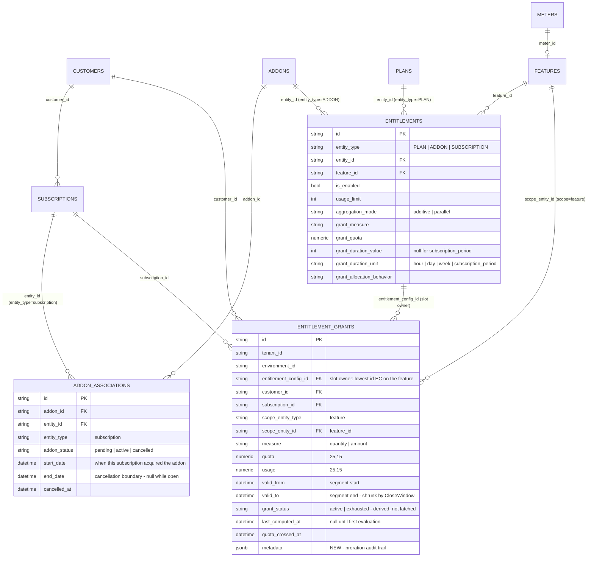
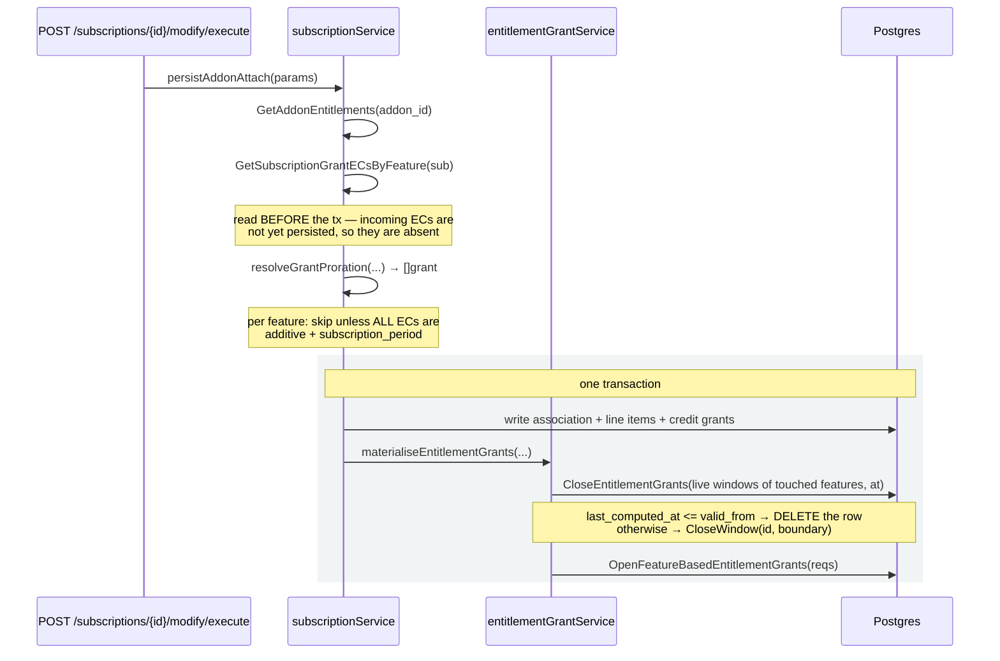
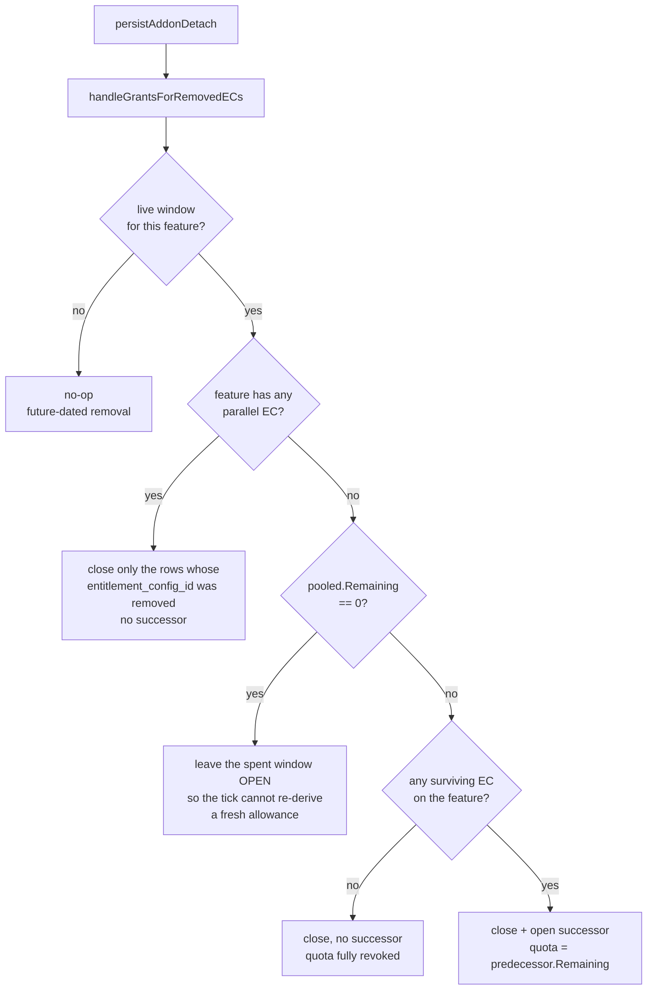

# Entitlement Grant Proration — Addon Attach & Detach — ERD

Status: **Implemented** — PR #2614
Date: 2026-08-27

---

## 1. Scope

An addon attached mid-cycle should hand the customer a *proportional* slice of the entitlement quota
it carries, not the whole cycle's worth. Before this change the grant evaluator only ever opened
windows lazily, on a usage-driven tick, with no request in scope — so an addon attached on day 20 of
a 30-day cycle granted its full quota for the 10 days that remained.

This PR makes the attach and detach paths write the grant segment themselves, so the proration exists
at the moment of the change rather than whenever the next event happens to arrive.

**In scope:**


| Area                       | Change                                                                |
| -------------------------- | --------------------------------------------------------------------- |
| Grant proration on attach  | New `resolveGrantProration` + `materialiseEntitlementGrants`          |
| Grant settlement on detach | New `handleGrantsForRemovedECs`                                       |
| Window lifecycle           | New `CloseWindow` repo method; segments tile instead of being mutated |
| Grant audit trail          | New `entitlement_grants.metadata` column                              |
| Entitlement reads          | Addon associations now resolved by *liveness*, not period overlap     |
| Credit-grant proration     | Refactored onto the shared coefficient helper                         |


**Explicitly out of scope** — see §6, these are product decisions, not gaps:


| Deferred                                      | Note                                                            |
| --------------------------------------------- | --------------------------------------------------------------- |
| Clawback of granted quota on detach           | §6.1 — will become a customer-configurable carry-forward policy |
| Proration for parallel-mode features          | §6.4 — parallel is reset-on-attach by design                    |
| Proration for static cadences (hour/day/week) | §6.4 — subscription-period additive only, for now               |
| Closing the coverage gap on static cadences   | §6.5 — known gap                                                |


---


## 2. Data model


### 2.1 ERD




### 2.2 What changed in the schema

Exactly one column: `entitlement_grants.metadata jsonb`.

Everything else is behavioural. In particular **grant rows remain immutable facts** — a mid-cycle
entitlement change never edits `quota` in place. It ends the current window and opens a successor
beside it, and the two tile exactly:

```
                    attach at T
  cycle start            |                          cycle end
      |                  |                              |
      +------------------+------------------------------+
      |   segment A      |         segment B            |
      |   quota 100      |   quota = A.remaining + Δ    |
      |   usage 30       |   usage 0                    |
      +------------------+------------------------------+
                    A.valid_to == B.valid_from
```

`Δ = coefficient × addon_quota`, and `coefficient = (period_end − proration_date) / (period_end − period_start)`,
second-based. `OpenFeatureBasedEntitlementGrants` **rejects** a successor whose `valid_from` does not
equal the predecessor's `valid_to`, so a gap or overlap is a hard error rather than silent drift.

### 2.3 Metadata written


| Key                               | Attach segment | Detach successor     |
| --------------------------------- | -------------- | -------------------- |
| `proration_source`                | `addon_attach` | `addon_detach`       |
| `proration_coefficient`           | ✓              | —                    |
| `proration_original_quota`        | ✓              | —                    |
| `proration_period_start` / `_end` | ✓              | —                    |
| `proration_date`                  | ✓              | —                    |
| `proration_strategy`              | `second_based` | —                    |
| `carry_forward_from`              | —              | predecessor grant id |


---


## 3. Control flow


### 3.1 Attach




Two subtleties worth keeping:

- `at = max(effectiveDate, now)`**.** A future-dated attach cuts the window where the change actually
becomes live. A backdated one cannot re-cut windows that have already been measured, so it clamps
to now.
- **Un-evaluated windows are deleted, not split.** If `last_computed_at <= valid_from`, nothing has
ever measured that window; splitting it would let both halves permit the same quota, because the
usage it really saw was never folded into the successor's balance. Deleting and letting the
successor span the original window keeps every event counting against one pool.


### 3.2 Detach




### 3.3 Entitlement reads

`GetSubscriptionEntitlementsForSubscription` changed in two ways:

1. It now asks for `addon_status IN (active, cancelled)` plus a new `ActiveAt` filter, instead of
  `active` plus period overlap. A cancellation dated at period end and one dated mid-period both
   write `addon_status = cancelled`; only `end_date` distinguishes them, and `ActiveAt = now` is what
   separates "still entitled through the period you paid for" from "revoked as of now".
2. `withAssociationWindow` narrows each addon entitlement to the association's own window. The
  entitlement is a catalog row shared by every association of that addon, so without the copy an
   addon attached on day 20 looks like it was present from the cycle start, and its grant window
   backdates over usage that predates it.

Both are additive: `AddonStatuses` defaults to `[active]` when empty and `ActiveAt` is skipped when
nil, so every other caller of `GetActiveAddonAssociation` behaves exactly as before.

---


## 4. Slot ownership

A feature has **slots**. Which slots exist depends on `aggregation_mode`, and this is what decides
whether a grant path may write a segment at all.


| Mode                 | Slots                    | Quota                           | Who owns the segment                                                        |
| -------------------- | ------------------------ | ------------------------------- | --------------------------------------------------------------------------- |
| `additive` (default) | one, on the lowest-id EC | sum of every EC's `grant_quota` | attach/detach writes it directly, when the cadence is `subscription_period` |
| `parallel`           | one per EC               | each EC's own `grant_quota`     | the evaluator tick only                                                     |


`hasParallelECs` is deliberately "any", not "all" — one parallel EC on a feature makes the whole
feature parallel, because the two models cannot share a pool coherently. Mixed cadences on one
feature are rejected at entitlement creation by `validateGrantSiblingCoherence`.

`shouldOpenGrantManually` is the gate: a feature is written by the attach path only when **every**
EC on it is additive **and** on the `subscription_period` cadence. Everything else falls through to
the tick.

---


## 5. Scenarios that work

All verified end-to-end against a running server, reading `entitlement_grants` directly and comparing
against independently computed expectations.


| #   | Scenario                                               | Behaviour                                                                         |
| --- | ------------------------------------------------------ | --------------------------------------------------------------------------------- |
| 1   | Attach mid-cycle, `create_prorations`                  | `quota = remaining + coefficient × addon_quota`, exact to 15 dp                   |
| 2   | Attach mid-cycle, `none`                               | coefficient 1, full quota added                                                   |
| 3   | Attach future-dated within the cycle                   | predecessor cut at the future date, successor prorated from it                    |
| 4   | Attach dated into a later cycle                        | skipped entirely, live window untouched                                           |
| 5   | Attach backdated                                       | clamped to the line item's start, so grant and charge cover the same window       |
| 6   | Attach on a feature the subscription does not yet have | window opens at the attach, prorated quota only, no backdating over earlier usage |
| 7   | Annual billing period                                  | coefficient 0.726027 over 365 days, quota exact                                   |
| 8   | Two addons attached in sequence                        | deltas accumulate onto one window                                                 |
| 9   | Two concurrent attaches                                | one coherent window, no overlap or duplication                                    |
| 10  | Attach onto an un-evaluated window                     | predecessor deleted, successor spans the original window                          |
| 11  | Detach mid-cycle, additive                             | successor carries the predecessor's remaining balance exactly                     |
| 12  | Detach mid-cycle, parallel                             | only the addon's own slot closes; the plan's slot survives untouched              |
| 13  | Detach when the window is fully spent                  | window left open, no fresh allowance handed back                                  |
| 14  | Detach at period end (default)                         | grant windows untouched — entitled through the paid period                        |
| 15  | Detach of the last EC on a feature                     | quota fully revoked, no successor                                                 |
| 16  | Preview                                                | writes nothing: no rows created, no window closed                                 |
| 17  | Legacy `POST`/`DELETE /subscriptions/addon`            | identical behaviour to the modify API                                             |
| 18  | Entitlements with no grant config                      | untouched, no grant rows created                                                  |
| 19  | Other modify types (`quantity_change`, …)              | grants left alone                                                                 |
| 20  | Read after period-end cancellation                     | addon entitlement retained                                                        |
| 21  | Read after mid-cycle cancellation                      | addon entitlement revoked immediately                                             |
| 22  | Credit-grant proration                                 | behaviourally identical to the pre-refactor helper                                |
| 23  | Mixed cadence on one feature                           | rejected at entitlement creation                                                  |


---


## 6. Scenarios that do NOT work — and why

Each of these is a **decided** position, not an oversight. They are listed so the next person does
not "fix" them by accident.

### 6.1 Repeated attach/detach accumulates quota

Every attach adds a prorated slice; every detach carries the whole remaining balance forward,
including that slice. Nothing subtracts the departing addon's share, so the pair does not cancel.
Four cycles on a plan granting 100 units:

```
baseline   100.000
cycle 1    121.612
cycle 2    173.224
cycle 3    224.836
cycle 4    276.447
```

**Decision:** intentional for now. Already-granted quota is never clawed back — the same policy credit
grants follow. Carry-forward will become a customer-facing choice, at which point the clawback branch
lands here.

### 6.2 A mid-cycle detach refunds the money and keeps the quota

`create_prorations` on detach issues a wallet credit for the unused time while the addon's quota
contribution survives to period end.

**Decision:** use `proration_behavior: none` on detach. No refund is issued, and retaining the quota
is then consistent. §6.1 and this are the same mechanism seen once versus repeatedly.

### 6.3 Attaching an addon resets consumed usage on parallel and static-cadence features

`materialiseEntitlementGrants` closes every live window of every feature the change touches —
including slots it does not own — so the tick can hand the incoming quota over immediately rather
than waiting for the window to expire. The tick reopens those slots at the config's full quota with
`usage = 0`. A plan EC sitting at 80/100 used returns to 100 available.

**Decision:** intended. Attaching an addon on a feature is meant to reset that feature's parallel
limits.

### 6.4 `proration_behavior` has no effect for parallel or static cadences

The same request yields a prorated grant or a full one depending on the feature's aggregation mode
and cadence, silently:

```
additive · subscription_period    Δ = 51.6129   (coefficient 0.516128)
parallel · subscription_period    Δ = 100.0000  (not prorated)
additive · day                    Δ = 100.0000  (not prorated)
```

**Decision:** prorations are scoped to subscription-period additive features for now. Worth revisiting
whether the API should reject `create_prorations` for the other combinations rather than ignore it.

### 6.5 Static cadences leave an uncovered gap after the attach

For hour/day/week grants the tick anchors a new window to the first *uncovered usage event*. The
attach closes the live window immediately, but nothing reopens until the next event arrives — so
between those instants the feature has no live window and usage in the gap counts against nothing.

**Known gap.** Duration is however long until the customer's next event.

---


## 7. Invariants to preserve

Anything touching this code should keep these true:

1. **Segments tile.** `successor.valid_from == predecessor.valid_to`, always. Enforced with a hard
  error in `OpenFeatureBasedEntitlementGrants`.
2. **Grant rows are immutable except for** `valid_to`**.** `CloseWindow` only ever *shrinks* a window,
  and leaves `usage`, `grant_status` and `last_computed_at` alone — `last_computed_at < valid_to` is
   what keeps a closed row in the evaluator's unfinalized set for its final refresh, so tail events
   still reach the billing reads.
3. **A window nothing has measured is deleted, never split.** Keyed on `last_computed_at`, not on the
  close boundary.
4. **A spent window stays open on detach.** Closing it would let the tick re-derive a fresh allowance
  from the surviving configs and hand back quota the pool already consumed.
5. **A window never backdates over usage that predates its configs.** `grantCandidate.startDate`
  carries the earliest instant any contributing EC was live from; `computeGrantWindow` floors
   `coveredUntil` at it.
6. **Preview writes nothing.**

---


## 8. Test coverage

- Unit: `internal/ee/service/entitlement_grant_proration_test.go`,
`internal/domain/entitlementgrant/model_test.go`, `internal/domain/proration/`.
- End-to-end: 29 scenarios across §5 and §6, run against a live server with per-scenario isolated
fixtures, asserting on `entitlement_grants` rows read straight from Postgres.

The behaviours in §6 have no regression tests, deliberately — they are positions expected to change.
Pin them with tests only once §6.1's carry-forward policy is settled.