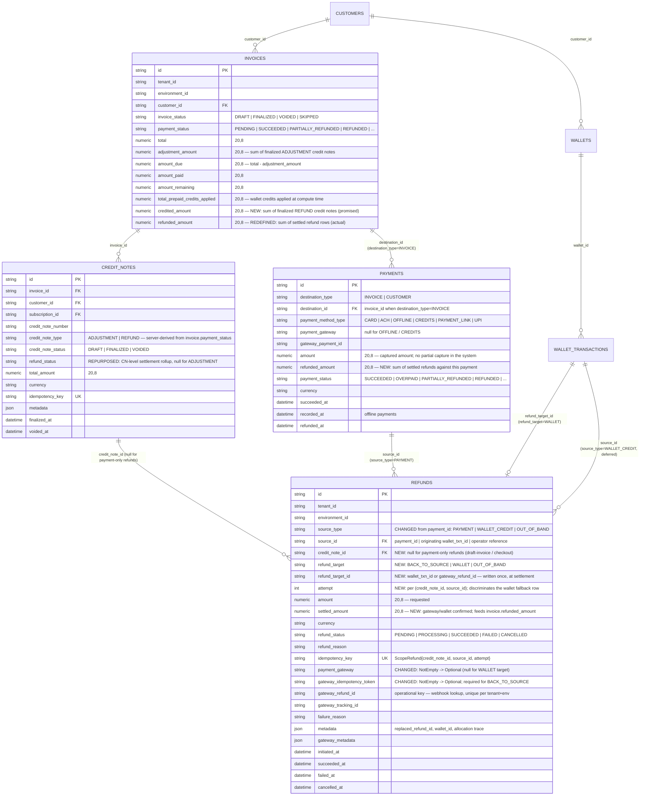
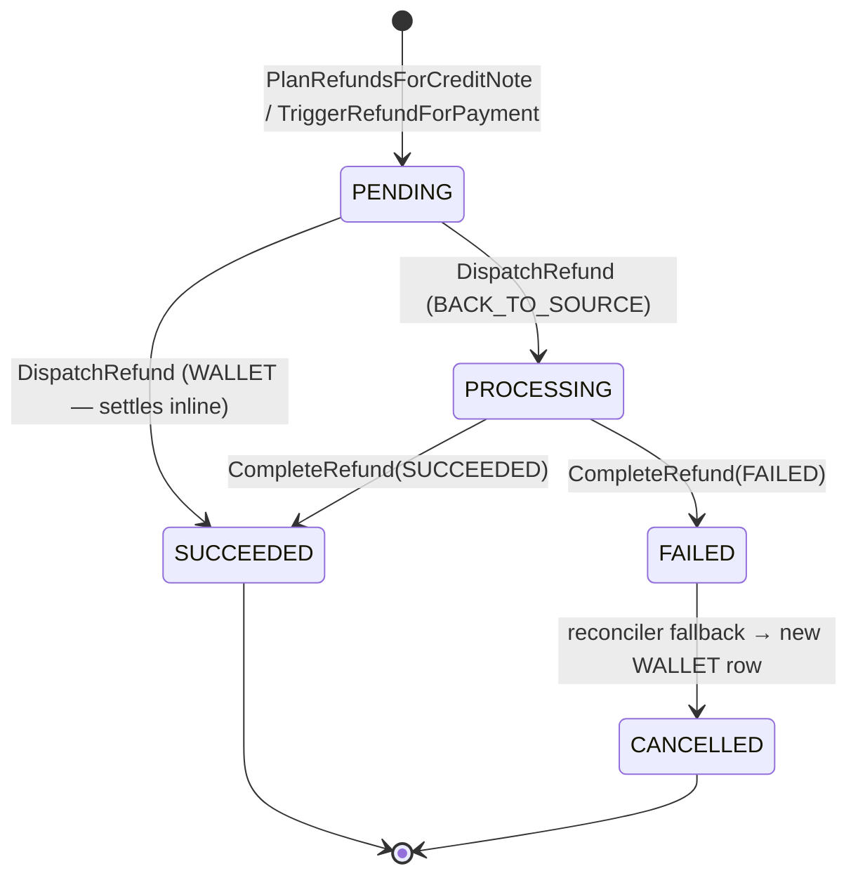

# Refund Architecture — Credit Notes, Refund Ledger & Settlement — ERD

Status: **Proposed**  
Date: 2026-08-28  
Author: Harshit Gupta ([harshit.gupta@flexprice.io](mailto:harshit.gupta@flexprice.io))

---

## 1. Scope

Today a refund credit note is finalised and the money is returned by a single inline wallet
top-up inside `FinalizeCreditNote` ([creditnote.go:601](../../internal/ee/service/creditnote.go#L601)).  

There is no record of *how* the money went back, no way to return it to the original payment
instrument, and no way to distinguish "we promised the customer a refund" from "the money
actually left". The `refunds` table exists and is wired into DI ([factory.go:178](../../internal/repository/factory.go#L178), [main.go:162](../../cmd/server/main.go#L162))
but no service reads or writes it.

This design separates the two concerns:

- **Credit note** — the accounting document. Says what the customer is owed. Immediate, transactional.
- **Refund row** — the money-movement ledger. One row per source per attempt. Asynchronous, retryable.

**In scope:**


| Area                  | Change                                                                                                               |
| --------------------- | -------------------------------------------------------------------------------------------------------------------- |
| Refund ledger         | `refunds` reshaped around `source_type`/`source_id` + `refund_target`; becomes the settlement record                 |
| Invoice money columns | New `credited_amount` (promised); `refunded_amount` redefined as settled cash                                        |
| Payment money columns | New `refunded_amount`                                                                                                |
| CN finalize           | Inline wallet top-up replaced by allocation into refund rows + out-of-tx dispatch                                    |
| Refund service        | `PlanRefundsForCreditNote`, `DispatchRefund`, `CompleteRefund`, `ReconcileInvoiceRefunds`, `TriggerRefundForPayment` |
| Reconciliation        | Refund-row-driven sweep; failed gateway refunds fall back to wallet credit                                           |
| Void safety           | `SkipRefund` on `InvoiceVoidRequest` so a void does not double-credit an in-flight refund                            |


**Explicitly out of scope** — see §8:


| Deferred                                | Note                                                                                |
| --------------------------------------- | ----------------------------------------------------------------------------------- |
| Prepaid credits as a refund source      | §8.1 — schema supports it (`source_type = WALLET_CREDIT`); allocation does not yet  |
| `OUT_OF_BAND` refund target             | §8.2 — enum value defined, offline payments route to `WALLET` for now               |
| Overpayment (`PaymentStatusOverpaid`)   | §8.3 — CN bound is authoritative, drift is an alert not an abort                    |
| Refunds on partially-paid invoices      | §8.4 — CN type is server-derived; adjustment first, then refund                     |
| Caller-specified credit note type       | §8.5 — moves to the DTO later                                                       |
| 3-strikes retry policy                  | §8.6 — `attempt` column lands now, the policy later                                 |
| Refund fallback policy (tenant setting) | §10.3 — v1 hardcodes wallet fallback; the setting and the write-off path come later |


---


## 2. Data model


### 2.1 ERD




### 2.2 What changes in the schema


| Table          | Field                                          | Change                                                                                                               | Why                                                                                                                                                                                                    |
| -------------- | ---------------------------------------------- | -------------------------------------------------------------------------------------------------------------------- | ------------------------------------------------------------------------------------------------------------------------------------------------------------------------------------------------------ |
| `refunds`      | `payment_id`                                   | **Renamed** to `source_id`, plus new `source_type`                                                                   | Prepaid credits are a refund source with no payment row (§8.1). Two overlapping pointers later is worse than one rename now, while the table is dormant.                                               |
| `refunds`      | `credit_note_id`                               | **New**, optional, indexed                                                                                           | Ties refund rows to the document that authorised them. Null for `TriggerRefundForPayment`.                                                                                                             |
| `refunds`      | `refund_target`, `refund_target_id`            | **New**                                                                                                              | Where the money actually went. `refund_target_id` is polymorphic and **write-once at settlement**.                                                                                                     |
| `refunds`      | `settled_amount`                               | **New**                                                                                                              | `amount` is requested, `settled_amount` is confirmed. Only the latter rolls up.                                                                                                                        |
| `refunds`      | `attempt`                                      | **New**, default 0                                                                                                   | The failed-gateway → wallet fallback row shares `(credit_note_id, source_id)` with the row it replaces and would otherwise collide on the idempotency unique index. Also the future 3-strikes counter. |
| `refunds`      | `payment_gateway`, `gateway_idempotency_token` | `NotEmpty` → **Optional**                                                                                            | Wallet-target refunds touch no gateway. Enforced at the domain layer for `BACK_TO_SOURCE` instead.                                                                                                     |
| `refunds`      | `Idx_refund_tenant_status`                     | **Widened** to `(tenant_id, environment_id, refund_status, updated_at)`                                              | The reconciler scans stuck rows by status + age.                                                                                                                                                       |
| `refunds`      | `Idx_refund_tenant_payment`                    | **Follows the rename** to `(tenant, env, source_type, source_id)`; new `(tenant, env, credit_note_id)`               | The two access paths. The source index is not new — recon re-derives `payment.refunded_amount` from rows on every settlement, and payment-only rows have no `credit_note_id` to reach them by.         |
| `refunds`      | `gateway_refund_id` index                      | `Idx_refund_gateway_refund_id` → **unique** on `(tenant, env, gateway_refund_id)`                                    | A replayed gateway webhook must not be able to mint a second row.                                                                                                                                      |
| `invoices`     | `credited_amount`                              | **New**, default 0                                                                                                   | Sum of finalized refund CNs — what today's `refunded_amount` means.                                                                                                                                    |
| `invoices`     | `refunded_amount`                              | **Redefined** (no DDL)                                                                                               | Becomes settled cash only. See §7 for the migration order.                                                                                                                                             |
| `payments`     | `refunded_amount`                              | **New**, default 0                                                                                                   | Per-payment settled total; drives `PARTIALLY_REFUNDED` / `REFUNDED`.                                                                                                                                   |
| `credit_notes` | `refund_status`                                | **Repurposed** — column already exists and is never written ([creditnote.go:85](../../ent/schema/creditnote.go#L85)) | CN-level settlement rollup. Keeps the `PaymentStatus` GoType so the vocabulary matches `invoice.payment_status`: `PENDING → PARTIALLY_REFUNDED → REFUNDED`.                                            |


### 2.3 The money columns, stated once

```
inv.adjustment_amount = Σ finalized ADJUSTMENT credit notes
inv.amount_due        = inv.total - inv.adjustment_amount
inv.credited_amount   = Σ finalized REFUND credit notes          -- promised
inv.refunded_amount   = Σ settled_amount of SUCCEEDED refunds    -- actual
payment.refunded_amount = Σ settled_amount of SUCCEEDED refunds where source_id = payment.id
```

`credited_amount` is **incremented** at CN finalize (transactional, single writer).
`refunded_amount` is **derived** — recomputed from the refund rows on every settlement, never incremented. Refunds retry, settle partially, and complete out of order; derived is the only form that survives that.

---


## 3. Bounds and invariants

```
ADJUSTMENT CN ≤ inv.total - inv.adjustment_amount - inv.amount_paid        (unchanged today)
REFUND CN     ≤ inv.amount_paid + inv.total_prepaid_credits_applied
                  - inv.credited_amount

invariant A:  inv.refunded_amount ≤ inv.credited_amount
              gap = in-flight or failed refunds → reconciler's queue
invariant B:  cn.total_amount == Σ amount of non-CANCELLED refund rows for that CN
invariant C:  Σ settled_amount per payment ≤ payment.amount
```

The credit-note bound is **authoritative**. Allocation does not impose a second bound: if the
sources cannot cover a CN that passed the bound, that is data drift (manual `UpdatePayment`,
overpayment, backfill), and it surfaces as a stuck refund row plus an alert — never as a
rejected credit note. The one exception is a *structurally* impossible allocation (no source
rows at all), which fails the CN transaction outright rather than writing rows that can never
settle.

---


## 4. Control flow


### 4.1 Refund credit note on a paid invoice

```
BEGIN
  GetForUpdate(invoice)                       -- existing lock, creditnote.go:78
  re-check cn.total ≤ max creditable          -- now against credited_amount
  cn.status = FINALIZED, assign number
  inv.credited_amount += cn.total_amount
  cn.refund_status = PENDING
  PlanRefundsForCreditNote(cn) -> refund rows, all PENDING
COMMIT
for each row: DispatchRefund(row.id)          -- outside the tx, one commit per row
```

`PlanRefundsForCreditNote` is pure DB — no gateway calls, no wallet writes:


| Step              | Rule                                                                                                                                                                                                                                                                                                       |
| ----------------- | ---------------------------------------------------------------------------------------------------------------------------------------------------------------------------------------------------------------------------------------------------------------------------------------------------------- |
| Candidate sources | payments on the invoice with status `SUCCEEDED`, `OVERPAID`, `PARTIALLY_REFUNDED`, where `amount - refunded_amount > 0`                                                                                                                                                                                    |
| Order             | LIFO by `succeeded_at` (`recorded_at` for offline). Prepaid credits will slot in ahead of payments when §8.1 lands.                                                                                                                                                                                        |
| Target per source | `payment_method_type = CREDITS` → `WALLET` (forced — the source *was* the wallet). `payment_gateway IS NULL` (offline) → `WALLET` for now, `OUT_OF_BAND` later. Otherwise the requested source.                                                                                                            |
| Wallet selection  | first `WalletType = PRE_PAID` wallet matching the invoice currency, creating one if absent — the [VoidInvoice](../../internal/ee/service/invoice.go#L1310) rule, not the CN rule, which currently matches on currency alone and can pick a non-prepaid wallet                                              |
| Idempotency       | `ScopeRefund{credit_note_id, source_id, attempt}` — replaying the planner after a crash produces the same keys, and the unique index physically blocks double allocation of the same source to the same CN. Two credit notes against the same payment carry different `credit_note_id` and coexist freely. |


### 4.2 Adjustment credit note

Unchanged. No refund rows, no money movement — `adjustment_amount` rises, `amount_due` falls.

### 4.3 Payment-only refund (draft invoice / checkout)

```
TriggerRefundForPayment(paymentID, amount, idempotencyKey)   -- key is caller-supplied
  → one refund row, credit_note_id = NULL, source_type = PAYMENT
  → DispatchRefund
  → VoidInvoice(invoiceID, {SkipRefund: true})
```

`SkipRefund` is required, not optional. `VoidInvoice` computes
`refundAmount = (amount_paid + prepaid_applied) - refunded_amount` and tops up the wallet
([invoice.go:1302](../../internal/ee/service/invoice.go#L1302)); draft invoices with a`SUCCEEDED` payment status are voidable ([invoice.go:1230](../../internal/ee/service/invoice.go#L1230)).

With a gateway refund still in flight, `refunded_amount` is 0 and the void credits the wallet
for money that is already on its way back to the card. There is no CN in this path, so
`credited_amount` does not protect it either.

This path also absorbs [RefundLateCapturedPayment](../../internal/integration/razorpay/payment.go#L1021), which today refunds at Razorpay and flips the payment status while writing nothing to the ledger.

### 4.4 Settlement and reconciliation

`CompleteRefund(ctx, refundID, outcome)` is the single leaf for both paths — gateway webhook,
gateway poll, and synchronous wallet settlement all funnel through it.

```go
type RefundOutcome struct {
    Status          types.RefundStatus // SUCCEEDED | FAILED
    SettledAmount   decimal.Decimal    // ≤ refund.Amount
    GatewayRefundID *string
    FailureReason   *string
    SettledAt       time.Time
    GatewayMetadata map[string]any
}
```

Each gateway's handler builds the outcome from its own payload, so `CompleteRefund` stays
gateway-agnostic. It sets `settled_amount`, `refund_target_id`
(`coalesce(walletTxnID, outcome.GatewayRefundID)` — one writer, one place), and then branches:

- row **has** `credit_note_id` → `ReconcileInvoiceRefunds(cn.invoice_id)`: recompute
`inv.refunded_amount`, `payment.refunded_amount`, payment statuses, `cn.refund_status`;
when `refunded_amount == credited_amount`, dispatch the integration resync
- row **has no** `credit_note_id` → stop after the payment-level update


### 4.5 Failure fallback

A `FAILED` gateway refund is credited to the wallet rather than retried indefinitely:

```
old row: refund_status = CANCELLED, metadata.replaced_by_refund_id = new.id
new row: attempt = old.attempt + 1, refund_target = WALLET,
         metadata.replaced_refund_id = old.id
```

Invariant B holds throughout because the cancelled row leaves the sum. The metadata link
carries the UX trail; `attempt` carries the retry count.

### 4.6 Reconciler

The sweep starts from the refunds table, **not** from invoices — that is what lets it handle
CN-backed and payment-only rows in one loop, and it is why the refund row needs no `invoice_id`
column (payment rows reach the invoice via `payment.destination_id`, CN rows via
`cn.invoice_id`).

```
stuck:  refund_status IN (PENDING, PROCESSING) AND updated_at < now() - threshold
failed: refund_status = FAILED AND attempt < 3
```

Per row: re-query the gateway → `CompleteRefund` → branch as in §4.4. Failed rows past the
threshold take the §4.5 fallback.

---


## 5. Refund state machine




`CANCELLED` therefore means exactly one thing: superseded by a fallback row (§4.5). There is no
"allocation superseded" path — rows are planned inside the CN finalize transaction under the
invoice row lock, so nothing can invalidate them between planning and dispatch.

Wallet-target rows skip `PROCESSING` — the top-up is a DB write in the dispatcher's own
transaction. Gateway rows are written `PENDING` **before the gateway is called**, so a webhook that lands
before the HTTP response returns finds a row to attach to. This race is real for both Stripe and
Razorpay: the event can be delivered while the request connection is still open, or the response
can be lost after the gateway has already fired.

Webhook matching goes `gateway_refund_id` → **our refund id echoed in the gateway's metadata
field** (Razorpay `notes`, already modelled as `FlexibleNotes` in[webhook/types.go:96](../../internal/integration/razorpay/webhook/types.go#L96); Stripe
`metadata`) → requeue. It never creates a row. 

### 5.1 Two idempotency keys, two jobs


| Key                                 | Scope               | Dedupes                                                                                            |
| ----------------------------------- | ------------------- | -------------------------------------------------------------------------------------------------- |
| `refunds.idempotency_key`           | ours                | **planning** — a replayed planner cannot allocate the same source to the same CN twice             |
| `refunds.gateway_idempotency_token` | sent to the gateway | **dispatch** — a retried gateway call returns the original refund instead of creating a second one |


The gateway token already exists in the codebase as Razorpay's `X-Refund-Idempotency`
([client.go:563](../../internal/integration/razorpay/client.go#L563)), but it is derived as`"refund_" + paymentID` — correct only while that flow issues one full refund per payment, as its own comment notes. With partial refunds it must become per-row: `RefundPayment` takes the token as
a parameter, sourced from `refund.gateway_idempotency_token`.

---


## 6. Service API

```go
// in tx, pure DB — no gateway I/O, no wallet writes
PlanRefundsForCreditNote(ctx, cn *creditnote.CreditNote) ([]*refund.Refund, error)

// out of tx, per row, each committed independently
DispatchRefund(ctx, refundID string) error

// single settlement leaf — webhook, poll, and inline wallet all land here
CompleteRefund(ctx, refundID string, outcome RefundOutcome) error

// derived roll-up; idempotent, safe to re-run
ReconcileInvoiceRefunds(ctx, invoiceID string) error

// no credit note; draft-invoice / checkout path.
// idempotencyKey is caller-supplied and required — see below.
TriggerRefundForPayment(ctx, paymentID string, amount decimal.Decimal, idempotencyKey string) (*refund.Refund, error)
```

---


## 7. Migration order

The redefinition of `invoices.refunded_amount` is the one step that can silently double-credit
if sequenced wrong. Three PRs:

1. **Schema + backfill.** Add `invoices.credited_amount`, `payments.refunded_amount`, reshape
  `refunds`. Backfill `UPDATE invoices SET credited_amount = refunded_amount`. No behaviour change.
2. **Reader flip.** Point all four readers of `refunded_amount` at `credited_amount`:
  [calculateMaxCreditableAmount](../../internal/ee/service/creditnote.go#L776),
   [RecalculateInvoiceAmounts](../../internal/ee/service/invoice.go#L3245),
   [RecalculateInvoiceAmountsForCreditNote](../../internal/ee/service/creditnote.go#L874),
   [VoidInvoice](../../internal/ee/service/invoice.go#L1303). `refunded_amount` still tracks
   CN totals at this point — the two columns are equal, so this is a no-op at runtime.
3. **RefundService.** CN finalize stops topping up the wallet inline and starts planning refund
  rows; `refunded_amount` becomes settled-only and is written exclusively by
   `ReconcileInvoiceRefunds`. Add `SkipRefund` and wire the checkout path.

Steps 2 and 3 in one PR is where the double-credit slips through: `refunded_amount` means
settled cash while `VoidInvoice` still reads it as the promised total.

---


## 8. Deferred — and what is already in place for it


### 8.1 Prepaid credits as a refund source

`total_prepaid_credits_applied` is applied at invoice compute time
([invoice.go:4565](../../internal/ee/service/invoice.go#L4565)) and produces **no payment row**.
An invoice funded entirely by wallet credits has `amount_paid = 0` and no payments, so
allocation over payments alone finds nothing to refund — while the CN bound (which includes
`total_prepaid_credits_applied`, mirroring `VoidInvoice`) correctly permits the credit note.

Currently prepaid credits apply to usage charges only, so this is low-frequency. The schema
already carries it: `source_type = WALLET_CREDIT`, `source_id` = the originating wallet
transaction, target always `WALLET`. Only the allocator in `PlanRefundsForCreditNote` needs the
extra branch, ordered ahead of payments. Back-to-source therefore becomes genuinely
multi-source — this is why the planner returns a **list** from day one.

### 8.2 `OUT_OF_BAND` target

The enum value ships now (validation only). Offline payments route to `WALLET` today. Adding
real out-of-band handling is then a routing-table change plus an operator-confirmation
endpoint that supplies the bank reference into `refund_target_id` — no type or schema change.

### 8.3 Overpayment

`PaymentStatusOverpaid` exists and already transitions to `PARTIALLY_REFUNDED` / `REFUNDED`
([payment.go:58](../../internal/types/payment.go#L58)). `Σ payment.amount` can exceed
`invoice.amount_paid`. The CN bound governs; the excess is not refundable through this path
and shows up as allocation drift.

### 8.4 Refunds on partially-paid invoices

A partially-paid invoice keeps `payment_status = PENDING`
([invoice.go:3519](../../internal/ee/service/invoice.go#L3519)), so
[getCreditNoteType](../../internal/ee/service/creditnote.go#L840) returns `ADJUSTMENT`,
bounded by `total - adjusted - paid`. The paid portion cannot be refunded directly: clear the
due with an adjustment, then refund. Worth a comment on `getCreditNoteType` so this reads as a
decision rather than an oversight.

### 8.5 Caller-specified credit note type

The type is server-derived and is hashed into the credit note's idempotency key
([creditnote.go:184](../../internal/ee/service/creditnote.go#L184)), so exposing it on the DTO
changes the key. Deliberate, deferred.

### 8.6 Retry policy

`attempt` lands with the schema; the 3-strikes rule and its alerting land with the reconciler's
second iteration.

---


## 9. Invariants to preserve

1. `inv.refunded_amount ≤ inv.credited_amount`, always. A gap is in-flight work, never an error state.
2. `cn.total_amount == Σ amount of non-CANCELLED refund rows for that CN`.
3. `refunded_amount` is derived from refund rows, never incremented in place.
4. `credited_amount` is incremented only inside the CN finalize transaction, under the invoice row lock.
5. No gateway I/O inside a database transaction.
6. A gateway refund row exists with its idempotency token **before** the gateway is called.
7. `refund_target_id` is written exactly once, in `CompleteRefund`, and is never used as a lookup key.
8. Every path that returns money to a customer writes a refund row — including
  `VoidInvoice`'s wallet credit and the Razorpay late-capture refund.
9. `credited_amount - refunded_amount` is a **reportable liability**, not an internal queue. It is
  exported, it ages, and it is never silently written off.

---


## 10. Accounting treatment

There is no GL module in this repo — journal posting happens downstream, off the exports in
[sync/export/](../../internal/ee/service/sync/export/) and the accounting sync. The design's job
is therefore to make *promised* and *settled* distinguishable to whatever books them. That is
exactly what `credited_amount` and `refunded_amount` are for.

### 10.1 Why finalising before the money moves is correct

Finalising a credit note before settlement is not the system taking the obligation upon itself
speculatively — it is recording the obligation at the moment it arises, which is when accounting
says to record it. Two events, two entries:

**At CN finalize** — revenue reverses, a liability appears:

```
Dr  Sales Returns & Allowances   (contra-revenue)
Cr  Refunds Payable              (liability)
```

**At settlement** — the liability is discharged:

```
BACK_TO_SOURCE:  Dr Refunds Payable    Cr Cash / Bank
WALLET:          Dr Refunds Payable    Cr Customer Credits (contract liability)
```

So the gap between finalize and settlement is not an anomaly — **the gap *is* the refund
liability**, and `credited_amount - refunded_amount` is its balance. Under ASC 606 / IFRS 15 a
refund liability is recognised when the entity becomes obligated, not when cash leaves.

The wallet fallback (§4.5) does not conjure a liability either — it **transfers** one: Refunds
Payable becomes Customer Credits. Both are liabilities; it stays a liability until the customer
consumes the credits (then revenue) or it expires (breakage). No revenue is double-counted and
none leaks.

The inverse ordering — settle first, finalise after — is strictly worse: a customer would be owed
money with no document on the books, no revenue reversal, and no `credited_amount` for concurrent
credit notes to be bounded against (§3).

### 10.2 What this requires of the code


| Requirement                                           | Change                                                                                                                                                                                                                                                                              |
| ----------------------------------------------------- | ----------------------------------------------------------------------------------------------------------------------------------------------------------------------------------------------------------------------------------------------------------------------------------- |
| The liability must be visible downstream              | [invoice_export.go:204](../../internal/ee/service/sync/export/invoice_export.go#L204) exports `adjustment_amount` and `refunded_amount` but not `credited_amount` — without it the books cannot see the promised-but-unsettled balance at all. Add it in the same PR as the column. |
| Cash-out and liability-transfer are different entries | `refund_target` is the GL discriminator: `BACK_TO_SOURCE` → cash, `WALLET` → contract liability, `OUT_OF_BAND` → cash. Whoever wires the accounting export must not collapse them.                                                                                                  |
| A finalized refund CN cannot be erased                | Already true — [creditnote.go:431](../../internal/ee/service/creditnote.go#L431) rejects voiding a finalized refund CN. Once revenue is reversed and the liability incurred, you issue a new document; you do not unwind the old one.                                               |


### 10.3 Where the real exposure is — consent, not accounting

Converting a card refund into store credit is clean on the books but is a consumer-protection
question in several jurisdictions (EU/UK/India): money owed against a card payment generally
returns to the card unless the customer agrees otherwise. So the wallet fallback should be a
**tenant-level policy**, not a silent default — a `SettingKey` alongside the existing keys in
[settings.go:22](../../internal/types/settings.go#L22):


| Policy   | Behaviour on a permanently failed gateway refund                                      |
| -------- | ------------------------------------------------------------------------------------- |
| `WALLET` | §4.5 fallback — cancel, credit the wallet, record the substitution in refund metadata |
| `NONE`   | Row stays `FAILED`, alert fires, liability stays open, an operator resolves it        |


v1 hardcodes `WALLET`; the setting lands with the reconciler's second iteration. Either way the
substitution is recorded in refund metadata (which policy, when), so the trail exists.

`NONE` needs a terminal path for a refund that can never settle — write-off to other income, or
escalation. Without one the liability ages indefinitely, which is an audit finding and, past a
threshold, an unclaimed-property question.