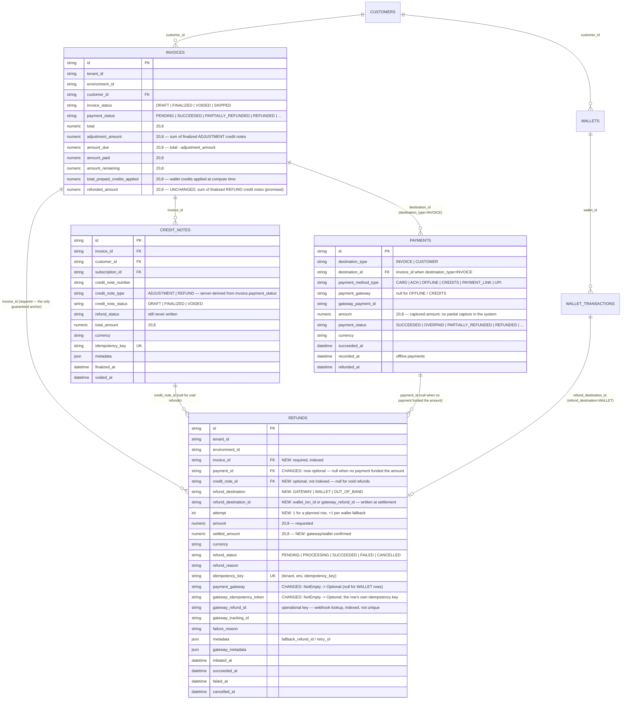
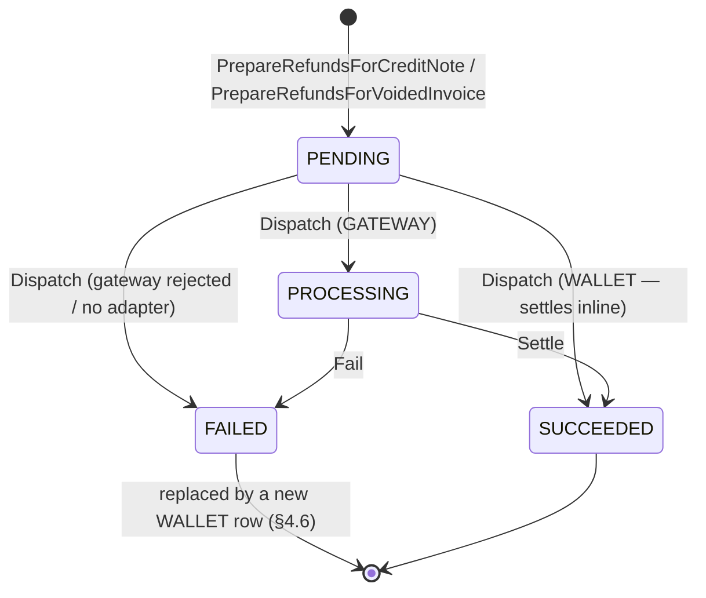

# Refund Architecture — Credit Notes, Refund Ledger & Settlement — ERD

Status: **Implemented**  
Date: 2026-08-28  
Author: Harshit Gupta ([harshit.gupta@flexprice.io](mailto:harshit.gupta@flexprice.io))

---

## 1. Scope

Before this change a refund credit note was finalised and the money returned by a single inline
wallet top-up inside `FinalizeCreditNote`.

There was no record of *how* the money went back, no way to return it to the original payment
instrument, and no way to distinguish "we promised the customer a refund" from "the money
actually left". The `refunds` table existed and was wired into DI
([factory.go:178](../../internal/repository/factory.go#L178), [main.go:161](../../cmd/server/main.go#L161))
but no service read or wrote it.

This design separates the two concerns:

- **Credit note** — the accounting document. Says what the customer is owed. Immediate, transactional.
- **Refund row** — the money-movement ledger. One row per funding source per attempt. Asynchronous, retryable.

**Shipped:**


| Area              | Change                                                                                                                    |
| ----------------- | ------------------------------------------------------------------------------------------------------------------------- |
| Refund ledger     | `refunds` gains `invoice_id`, `credit_note_id`, `refund_destination`, `refund_destination_id`, `settled_amount`, `attempt` |
| Invoice columns   | None. `invoice.refunded_amount` keeps its meaning — the sum of finalized refund credit notes                              |
| Payment columns   | None. Per-payment settled cash is derived from refund rows                                                                |
| CN finalize       | Inline wallet top-up replaced by allocation into refund rows + dispatch after the commit                                  |
| Invoice void      | Plans refund rows for the same amount it used to top up; wallet-only, dispatched inside the void transaction              |
| Refund service    | `PrepareRefundsForCreditNote`, `PrepareRefundsForVoidedInvoice`, `Dispatch`, `Settle`, `Fail`, `RetryRefund`               |
| Gateway abstraction | `interfaces.RefundProvider` + Razorpay and Chargebee adapters resolved through `Factory.GetRefundProvider`               |
| Webhooks          | Inbound Razorpay / Chargebee refund events settle rows; outbound `refund.created` / `refund.succeeded` / `refund.failed`  |
| API               | `GET /refunds`, `GET /refunds/{id}`, `POST /refunds/{id}/retry`, and `refund_target` on credit note create + finalize     |


**Not shipped** — see §8:


| Deferred                              | Note                                                                                     |
| ------------------------------------- | ---------------------------------------------------------------------------------------- |
| `invoices.credited_amount`            | §8.1 — rejected. `refunded_amount` keeps its meaning; settled cash is derived, not stored |
| `payments.refunded_amount`            | §8.1 — same reason; per-payment settled cash is a query over refund rows                 |
| Prepaid credits as a distinct source  | §8.2 — they produce no payment row, so they fall into the single no-payment wallet row   |
| `OUT_OF_BAND` destination             | §8.3 — enum value ships, nothing produces it and the API rejects it as a target          |
| Reconciler                            | §8.4 — a stuck row is recovered by `POST /refunds/{id}/retry`, not by a sweep            |
| Payment-only refunds                  | §8.5 — checkout reversals still refund at the gateway without writing a row              |
| `credit_notes.refund_status`          | §8.6 — column still exists and is still never written                                    |
| Moyasar / Stripe refunds              | §8.7 — no adapter; the row fails and falls back to the wallet                            |
| 3-strikes retry policy                | §8.8 — `attempt` counts, nothing enforces a ceiling                                      |
| Refund fallback policy (tenant setting) | §10.3 — the caller chooses per credit note instead                                     |


---

## 2. Data model

### 2.1 ERD



### 2.2 What changed in the schema


| Table     | Field                                          | Change                                                            | Why                                                                                                                                                                                     |
| --------- | ---------------------------------------------- | ----------------------------------------------------------------- | ----------------------------------------------------------------------------------------------------------------------------------------------------------------------------------------- |
| `refunds` | `invoice_id`                                   | **New**, required, indexed                                        | A void refund of prepaid credits has neither a payment nor a credit note, so the invoice is the only link guaranteed to exist. It also backs `GET /refunds?invoice_ids=`, the only way to read settled cash. |
| `refunds` | `payment_id`                                   | `NotEmpty` → **Optional**, index unchanged                        | Refunds exist with no payment row at all — manual mark-paid, `amount_paid` pre-set at creation, prepaid credits on void. Kept over a `source_type`/`source_id` pair: nullable says the same thing with one column. |
| `refunds` | `credit_note_id`                               | **New**, optional, **not indexed**                                | Provenance that `invoice_id` cannot recover when an invoice has several credit notes. It has one query — `ListByInvoice` plus an in-memory filter — and rows per invoice are bounded by (credit notes × payments). |
| `refunds` | `refund_destination`, `refund_destination_id`  | **New**                                                           | Where the money actually went. `refund_destination_id` is the wallet transaction id or the gateway refund id, written at settlement.                                                     |
| `refunds` | `settled_amount`                               | **New**, default 0                                                | `amount` is requested, `settled_amount` is confirmed. Only the latter counts as cash.                                                                                                    |
| `refunds` | `attempt`                                      | **New**, default 1                                                | The failed-gateway → wallet fallback row shares its parent's key prefix and would otherwise collide on the idempotency unique index. Starts at 1 to match `payment_attempts.attempt_number`. |
| `refunds` | `payment_gateway`, `gateway_idempotency_token` | `NotEmpty` → **Optional**                                         | Wallet rows touch no gateway.                                                                                                                                                           |
| `refunds` | `Idx_refund_tenant_invoice`                    | **New** `(tenant_id, environment_id, invoice_id)`                 | Drives every read path: list by invoice, and the per-payment capacity sums which are invoice-scoped.                                                                                     |
| `refunds` | `Idx_refund_tenant_status`                     | **Unchanged** `(tenant_id, environment_id, refund_status)`        | Widening it with `updated_at` was for the reconciler's stuck-row scan, which is not built (§8.4).                                                                                       |
| `refunds` | `idx_refund_gateway_refund_id`                 | **Unchanged**, still not unique                                   | A replayed webhook is stopped by the status transition guard, not by an index.                                                                                                          |


Nothing was added to `invoices` or `payments`, and there is no backfill — see §8.1.

### 2.3 The money columns, stated once

```
inv.adjustment_amount = Σ finalized ADJUSTMENT credit notes
inv.amount_due        = inv.total - inv.adjustment_amount
inv.refunded_amount   = Σ finalized REFUND credit notes           -- promised
settled cash          = Σ settled_amount of SUCCEEDED refund rows -- derived, never stored
```

`refunded_amount` is **incremented** at CN finalize and at void, under the invoice row lock,
exactly as before. Settled cash has no column: it is read from the refund rows when needed, so
there is no counter to drift and a duplicate webhook cannot double-count.

The field name reads misleadingly — it means promised, not cash. The rename is declined: it
ships in the invoice API response, the CSV export and the generated SDKs.

---

## 3. Bounds and invariants

```
ADJUSTMENT CN ≤ inv.total - inv.adjustment_amount - inv.amount_paid
REFUND CN     ≤ inv.amount_paid - inv.refunded_amount

invariant A:  Σ settled_amount for an invoice ≤ inv.refunded_amount
              gap = in-flight or failed refunds
invariant B:  cn.total_amount == Σ settled_amount of that CN's rows, once they all settle
invariant C:  per payment, Σ settled + Σ in-flight ≤ payment.amount
```

The credit-note bound is **authoritative** and is unchanged by this design. Allocation imposes a
second, per-payment bound (invariant C) which cannot reject a credit note: an amount no payment
can cover becomes a single wallet row with `payment_id = NULL`.

Invariant B is stated over settled cash, not over `amount`. A failed gateway row keeps its
`amount` and is replaced by a fallback row carrying the same amount, so summing `amount` over
non-cancelled rows double-counts every fallback.

---

## 4. Control flow

### 4.1 Refund credit note on a paid invoice

```
BEGIN
  GetForUpdate(invoice)                       -- existing lock
  re-check cn.total ≤ max creditable
  cn.status = FINALIZED, assign number
  inv.refunded_amount += cn.total_amount
  PrepareRefundsForCreditNote(cn, inv) -> refund rows, all PENDING
COMMIT
for each row: Dispatch(row.id)                -- outside the tx, one commit per row
```

A dispatch failure is logged, not returned: the credit note is already finalized and the row
stays `PENDING` for `RetryRefund`.

`PrepareRefundsForCreditNote` is pure DB — no gateway calls, no wallet writes:


| Step              | Rule                                                                                                                                                                                        |
| ----------------- | ---------------------------------------------------------------------------------------------------------------------------------------------------------------------------------------------- |
| Candidate sources | payments on the invoice with status `SUCCEEDED`, in the invoice's currency                                                                                                                  |
| Order             | oldest first by `created_at`, then `id`, so allocation is reproducible regardless of repository ordering                                                                                     |
| Capacity          | `payment.amount - settled - in-flight`, both sums scoped to this invoice. In-flight is counted so a second credit note cannot draw a balance an unsettled refund has already claimed         |
| Remainder         | anything no payment can cover becomes one row with `payment_id = NULL`, destination `WALLET`                                                                                                 |
| Destination       | `WALLET` unless the caller asked for `BACK_TO_SOURCE` **and** the payment is gateway-refundable: method in `{CARD, PAYMENT_LINK, UPI}`, non-null `payment_gateway`, non-empty `gateway_payment_id`. `ACH` is deliberately excluded — no adapter refunds it |
| Wallet selection  | `EnsurePrepaidWallet` — the first active `PRE_PAID` wallet in the invoice currency, creating one if absent                                                                                   |
| Idempotency       | `<credit_note_id>-<index>`. The unique index on `(tenant, env, idempotency_key)` is what stops the same credit note being planned twice                                                      |


### 4.2 Adjustment credit note

Unchanged. No refund rows, no money movement — `adjustment_amount` rises, `amount_due` falls.

### 4.3 Invoice void

```
BEGIN
  GetForUpdate(invoice)
  refundAmount = (amount_paid + total_prepaid_credits_applied) - refunded_amount
  PrepareRefundsForVoidedInvoice(inv, refundAmount)
  for each row: Dispatch(row.id)              -- inside the tx: wallet only, no external I/O
  inv.refunded_amount += refundAmount
COMMIT
```

Void rows are never gateway-targeted, carry no `credit_note_id`, and key on
`<invoice_id>-void-<index>`. Subtracting `refunded_amount` is what prevents paying an in-flight
refund twice. Observable behaviour is unchanged from before this design; the money now has a
ledger row.

### 4.4 Dispatch

`Dispatch` is a no-op on a terminal row, and branches on the destination:

- **`WALLET`** — one transaction: lock the row, `EnsurePrepaidWallet`, `TopUpWallet` keyed on the
refund row id, `Settle`. The top-up is keyed on the row rather than the credit note because one
credit note can fan out into several rows.
- **`GATEWAY`** — claim `PENDING → PROCESSING` under the row lock in a short transaction, call
the provider **outside** it, then `Settle`, `Fail`, or record the gateway's acceptance and wait
for the webhook. Claiming first means a concurrent dispatch cannot issue a second refund for the
same money.

A gateway with no adapter resolves to `ErrNotImplemented` and routes to `Fail` — not an error.

### 4.5 Settlement

`Settle(refundID, settledAmount, destinationID, gatewayMetadata)` is the single leaf: inline
wallet settlement, the Razorpay `refund.processed` webhook and Chargebee's `payment_refunded`
all funnel through it. Under the row lock it:

1. rejects the call if the row cannot transition to `SUCCEEDED` — this is what makes a
   redelivered webhook a no-op, and it is the only thing settlement idempotency rests on;
2. rejects a `settled_amount` greater than the row's `amount`;
3. writes `settled_amount`, `succeeded_at`, `refund_destination_id`, and — for gateway rows —
   `gateway_refund_id`, so the two cannot drift.

`refund.succeeded` is published only when the transition actually applied.

### 4.6 Failure fallback

`Fail` records the failure and, for a gateway row only, creates the one wallet row that replaces
it:

```
failed row: refund_status = FAILED, failure_reason, metadata.fallback_refund_id = new.id
new row:    attempt = old.attempt + 1, refund_destination = WALLET,
            idempotency_key = <old key>-fb-<attempt>, metadata.retry_of = old.id
```

The failed row is **not** cancelled — it keeps its amount and its failure reason as the audit
trail, which is why invariant B is stated over settled cash. Because the link is written on the
failed row, `RetryRefund` returns the existing fallback instead of minting a second one. Wallet
rows never spawn a fallback, so there is no loop.

### 4.7 Retry

`POST /refunds/{id}/retry` is the only recovery path. A `PENDING` row is dispatched again; a
`FAILED` row gets its fallback (existing or new) dispatched; anything else is rejected. There is
no sweep — see §8.4.

---

## 5. Refund state machine



`SUCCEEDED` and `FAILED` are terminal — the transition table maps them to an empty set, so
`SUCCEEDED → SUCCEEDED` is rejected and a replayed webhook changes nothing. `CANCELLED` is a
legal target from `PENDING` and `PROCESSING` but nothing issues it today.

Wallet rows skip `PROCESSING` — the top-up is a DB write in the dispatcher's own transaction.
Gateway rows are moved to `PROCESSING` **before the gateway is called**, so a webhook that lands
before the HTTP response returns finds a row to attach to.

Webhook matching is `gateway_refund_id` → row, and nothing else. An unresolvable id is logged
and skipped; the handler never creates a row and always answers 200.

### 5.1 Two idempotency keys, two jobs


| Key                                 | Scope               | Dedupes                                                                                            |
| ----------------------------------- | ------------------- | -------------------------------------------------------------------------------------------------- |
| `refunds.idempotency_key`           | ours                | **planning** — a replayed planner cannot allocate the same credit note twice                       |
| `refunds.gateway_idempotency_token` | sent to the gateway | **dispatch** — a retried gateway call returns the original refund instead of creating a second one |


Neither dedupes settlement; the status transition guard does.

The gateway token is the row's own idempotency key. `RefundPayment` takes it as a parameter
([client.go:558](../../internal/integration/razorpay/client.go#L558)); it previously hardcoded
`"refund_" + paymentID`, which is correct only while a flow issues one full refund per payment.
Under the ledger a payment can be refunded several times, and reusing that key makes Razorpay
return the **first** refund instead of creating the second — a silent under-refund.

---

## 6. Service API

```go
// in tx, pure DB — no gateway I/O, no wallet writes
PrepareRefundsForCreditNote(ctx, cn *creditnote.CreditNote, inv *invoice.Invoice, target *types.RefundTarget) ([]*refund.Refund, error)
PrepareRefundsForVoidedInvoice(ctx, inv *invoice.Invoice, amount decimal.Decimal) ([]*refund.Refund, error)

// moves one row towards settlement; must run outside a transaction for gateway rows
Dispatch(ctx, refundID string) error

// single settlement leaf — webhook and inline wallet both land here
Settle(ctx, req *dto.SettleRefundRequest) error
Fail(ctx, refundID, reason string) error

// read + recovery
GetRefund(ctx, id string) (*dto.RefundResponse, error)
GetRefundByGatewayRefundID(ctx, gateway, gatewayRefundID string) (*dto.RefundResponse, error)
ListRefunds(ctx, filter *types.RefundFilter) (*dto.ListRefundsResponse, error)
RetryRefund(ctx, id string) (*dto.RefundResponse, error)
```

### 6.1 Choosing where the money goes

The caller asks for an outcome, not a mechanism — it does not know whether a payment went
through a gateway. `types.RefundTarget` is therefore separate from the stored
`refund_destination`:


| Layer                                                    | Values                             |
| -------------------------------------------------------- | ---------------------------------- |
| request body `refund_target`                             | `PREPAID_WALLET`, `BACK_TO_SOURCE` |
| stored column / response / webhook `refund_destination`  | `GATEWAY`, `WALLET`, `OUT_OF_BAND` |


`refund_target` is accepted on `POST /creditnotes` and on `POST /creditnotes/{id}/finalize`, and
is read at the moment the credit note is processed — it is not persisted, so a credit note
drafted now and finalized later takes it from the finalize call. The default is
`PREPAID_WALLET`. `BACK_TO_SOURCE` falls back to the wallet for any payment the gateway cannot
refund. Void refunds accept no target.

---

## 7. Migration

Two files, both touching `refunds` only:

1. The `ALTER TABLE` statements — catalog-only on PG 11+.
2. `CREATE INDEX CONCURRENTLY` for `(tenant_id, environment_id, invoice_id)`, in its own
   `transaction:false` file holding exactly one statement.

`refunds` is empty on every deployment — confirm with `SELECT count(*) FROM refunds` before
applying. There is no backfill and no DDL on `invoices` or `payments`, so no ACCESS EXCLUSIVE
lock is taken on the two hottest tables. Old and new code both increment `refunded_amount`
identically at finalize, so the rollout window is safe in both directions.

---

## 8. Deferred — and what is already in place for it

### 8.1 `credited_amount`, and settled cash as a column

The original design added `invoices.credited_amount` (promised) and redefined `refunded_amount`
as settled cash, plus `payments.refunded_amount`. Both halves were rejected.

Tracing who needs settled cash, it gates no money decision except per-payment allocation
headroom: the credit-note capacity guard, the invoice payment status and the void arithmetic all
read `refunded_amount` as the promise. Redefining it would break every consumer — the invoice API
response, the CSV export and the generated SDKs — and adding a second column means a backfill and
a counter that can drift.

So settled cash is a query. `SumSettledByPaymentIDs` and `SumInFlightByPaymentIDs` return it per
payment for an invoice, in one grouped index scan each. If it is later wanted on the invoice,
add it then as a computed field backed by a batched sum — or as a materialized column at that
point, when there is a concrete filter or sort requirement to justify one.

### 8.2 Prepaid credits as a distinct source

`total_prepaid_credits_applied` is applied at invoice compute time and produces **no payment
row**. An invoice funded entirely by wallet credits has `amount_paid = 0`, so allocation over
payments finds nothing — the whole amount lands in the single `payment_id = NULL` wallet row,
which is the right destination for it. What is missing is only the provenance: the ledger cannot
say which wallet transaction funded it.

### 8.3 `OUT_OF_BAND` destination

The enum value ships (validation only). Nothing produces it and the API rejects it as a target,
since `Dispatch` has no branch for it. Adding real out-of-band handling is a routing change plus
an operator-confirmation endpoint that supplies the bank reference into `refund_destination_id`
— no type or schema change.

### 8.4 Reconciler

There is no sweep. A row left `PENDING` by a crash, or `PROCESSING` because a gateway webhook
never arrived, stays there until someone calls `POST /refunds/{id}/retry`. `refund_status` and
`updated_at` are both on the row, so the query a sweep would need is available; the job, its
schedule and its alerting are not built.

### 8.5 Payment-only refunds

When a payment is captured after its checkout session expired or failed, the money is handed
straight back to the card by `ensureRefunded` in the Razorpay and Chargebee integrations,
bypassing the refund service. Those reversals stay invisible to the ledger, and the gateway
webhooks they produce resolve to no row and are skipped.

Two things are missing, and the second is a decision rather than wiring. An entry point —
something like `PrepareRefundForPayment(payment, reason)` producing one gateway row — and a
resolution for invariant A, which a reversal breaks: it returns money that was never promised, so
`refunded_amount` stays 0 while a row settles a real amount against that invoice. Either the
invariant is qualified to cover only credit-note and void rows, or reversal rows carry a
distinguishing marker.

### 8.6 `credit_notes.refund_status`

The column exists and is still never written. A CN-level settlement rollup would be derived from
its rows; nothing needs it yet.

### 8.7 Gateways without a refund adapter

Razorpay and Chargebee resolve; everything else, Moyasar and Stripe included, returns
`ErrNotImplemented` and the row falls back to the wallet. Moyasar's API is full-refund-only,
which is why it was not adapted.

Related: Razorpay's amount conversion is a fixed ×100 that ignores the currency. That is true of
every amount conversion in the package, so it was left consistent rather than made a one-off; it
is wrong for zero-decimal and three-decimal currencies.

### 8.8 Retry policy

`attempt` counts fallbacks. Nothing enforces a ceiling, and no alert fires on a row that has
exhausted its attempts.

---

## 9. Invariants to preserve

1. Σ settled cash for an invoice ≤ `inv.refunded_amount`. A gap is in-flight work, never an error
   state. Holds for credit-note and void rows; a checkout reversal would break it (§8.5).
2. `refunded_amount` is incremented only under the invoice row lock, at CN finalize or at void.
3. A refund row reaches `SUCCEEDED` at most once, enforced by the status transition guard. This
   is the only thing settlement idempotency rests on — the builder does not check.
4. `cn.total_amount == Σ settled_amount` of that credit note's rows, once they all settle.
5. No gateway I/O inside a database transaction.
6. A gateway row is `PROCESSING` with its idempotency token **before** the gateway is called.
7. `settled_amount` never exceeds the row's `amount`.

---

## 10. Accounting treatment

There is no GL module in this repo — journal posting happens downstream, off the exports in
[sync/export/](../../internal/ee/service/sync/export/) and the accounting sync. The design's job
is therefore to make *promised* and *settled* distinguishable to whatever books them:
`invoice.refunded_amount` is the promise, the refund rows are the cash.

### 10.1 Why finalising before the money moves is correct

Finalising a credit note before settlement is not the system taking the obligation upon itself
speculatively — it is recording the obligation at the moment it arises, which is when accounting
says to record it. Two events, two entries:

**At CN finalize** — revenue reverses, a liability appears:

```
Dr  Sales Returns & Allowances   (contra-revenue)
Cr  Refunds Payable              (liability)
```

**At settlement** — the liability is discharged:

```
GATEWAY:  Dr Refunds Payable    Cr Cash / Bank
WALLET:   Dr Refunds Payable    Cr Customer Credits (contract liability)
```

So the gap between finalize and settlement is not an anomaly — **the gap *is* the refund
liability**. Under ASC 606 / IFRS 15 a refund liability is recognised when the entity becomes
obligated, not when cash leaves.

The wallet fallback (§4.6) does not conjure a liability either — it **transfers** one: Refunds
Payable becomes Customer Credits. Both are liabilities; it stays a liability until the customer
consumes the credits (then revenue) or it expires (breakage). No revenue is double-counted and
none leaks.

The inverse ordering — settle first, finalise after — is strictly worse: a customer would be owed
money with no document on the books, no revenue reversal, and no bound for concurrent credit
notes to be checked against (§3).

### 10.2 What this requires of the code


| Requirement                                           | Status                                                                                                                                                                                              |
| ----------------------------------------------------- | ----------------------------------------------------------------------------------------------------------------------------------------------------------------------------------------------------- |
| The liability must be visible downstream              | `invoice.refunded_amount` is already exported ([invoice_export.go:205](../../internal/ee/service/sync/export/invoice_export.go#L205)) and is the promise. Settled cash is not exported — read it from `GET /refunds?invoice_ids=` |
| Cash-out and liability-transfer are different entries | `refund_destination` is the GL discriminator: `GATEWAY` → cash, `WALLET` → contract liability. Whoever wires the accounting export must not collapse them                                            |
| A finalized refund CN cannot be erased                | Already true — [creditnote.go:434](../../internal/ee/service/creditnote.go#L434) rejects voiding a finalized refund CN, so a finalize has no in-flight rows to cancel                                |
| A refunded invoice must reach the billing providers   | **Not built.** Vendor sync is driven by `invoice.update.finalized` and `invoice.update.payment`; nothing publishes on refund settlement or on void, so a refunded invoice still reads as paid at Zoho, QuickBooks and Chargebee |


### 10.3 Where the real exposure is — consent, not accounting

Converting a card refund into store credit is clean on the books but is a consumer-protection
question in several jurisdictions (EU/UK/India): money owed against a card payment generally
returns to the card unless the customer agrees otherwise.

This is why the choice is a per-credit-note input (§6.1) rather than a silent default. The
default is `PREPAID_WALLET`, so returning money to the card is something the caller asks for
explicitly, having established consent — the system never silently converts a card refund into
credit at the point of request.

It still does so on failure: `BACK_TO_SOURCE` that the gateway rejects falls back to the wallet
(§4.6) rather than staying open. The substitution is recorded on both rows, so the trail exists,
but the policy is hardcoded. A tenant-level setting with a `NONE` option — leave the row `FAILED`,
alert, let an operator resolve it — is the natural next step, and needs a terminal path for a
refund that can never settle. Without one the liability ages indefinitely.
