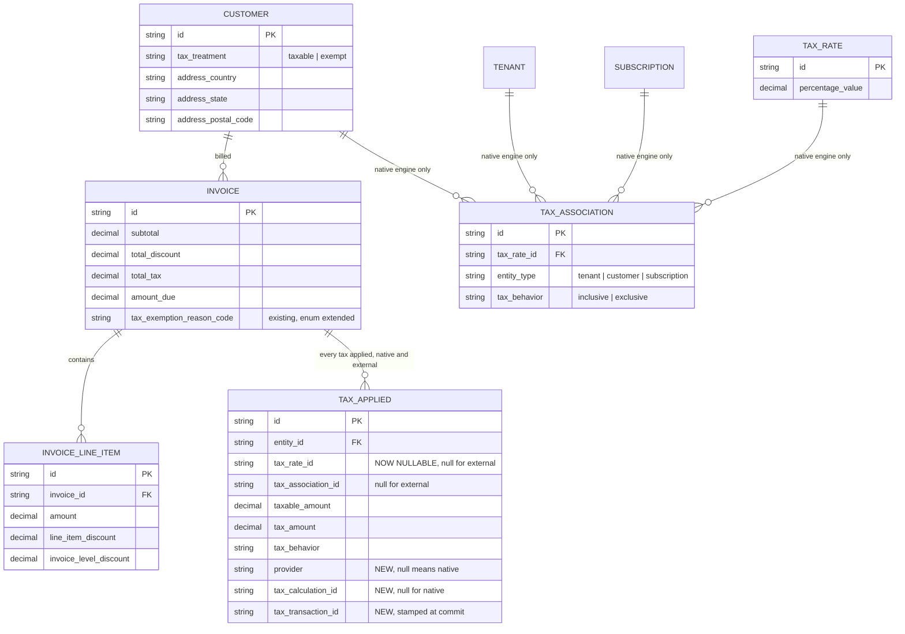
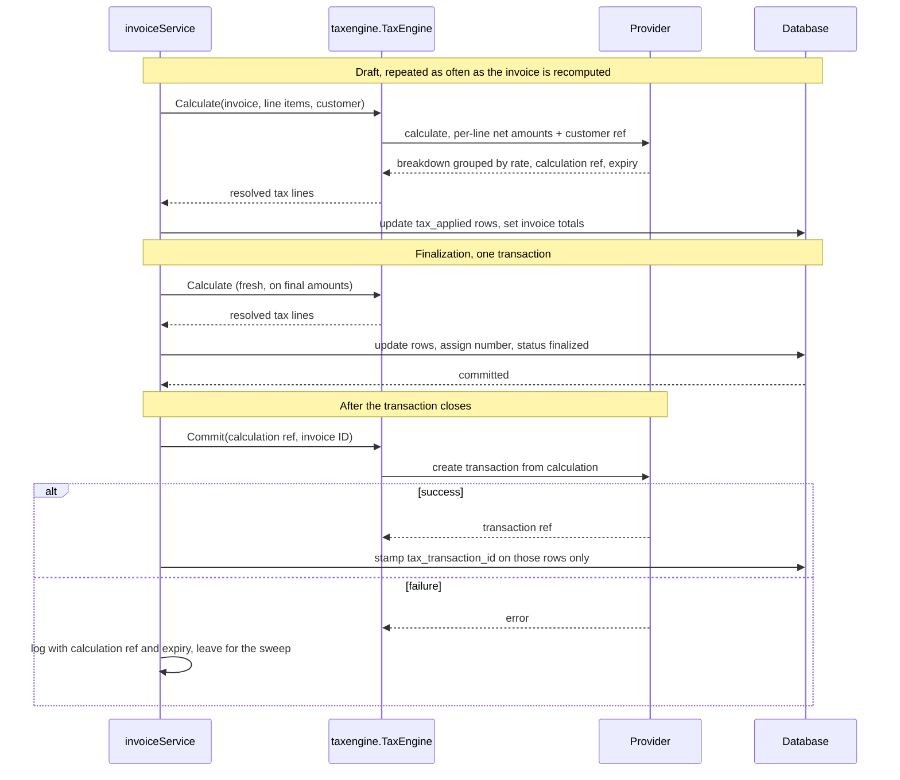
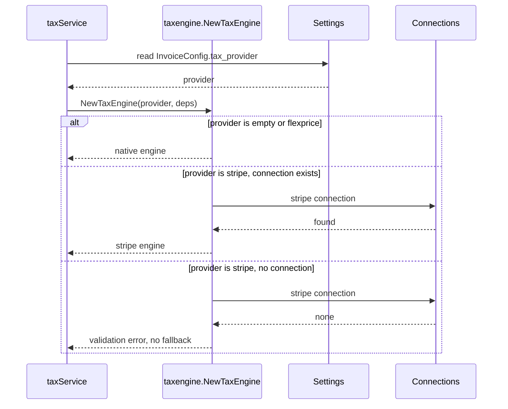

# Stripe Tax Engine Integration — Design ERD

Author: Tsage  
Date: 2026-09-11  
Ticket: FLE-1167

---

## 1. Context

### 1.1 How Flexprice calculates tax today

A tenant defines `tax_rate` rows holding a flat percentage. Each rate is linked to a tenant, a customer or a subscription through `tax_association`, which also carries the `tax_behavior`, inclusive or exclusive. At invoice time `taxService` resolves the applicable rates, multiplies them against the invoice's taxable amount, and writes one `tax_applied` row per rate.

The taxable amount is the invoice subtotal less total discount. Tax is computed at **invoice level**, not per line item.

Where it runs differs by invoice type. One-off and credit invoices apply tax during compute, because they are created and finalized in one operation. Subscription invoices defer tax to finalization, so wallet debits only happen when the invoice is sealed.

`tax_applied` is the record of what was charged. The invoice API exposes it as `taxes[]`, and `tax_summary` is derived from those rows by summing them by behavior. The invoice PDF renders them as an Applied Taxes table.

### 1.2 What the Stripe integration already does

Flexprice syncs several entities to Stripe through `entity_integration_mapping`, which pairs a Flexprice entity ID with a provider entity ID:


| Flexprice entity | Stripe object | Direction           |
| ---------------- | ------------- | ------------------- |
| `customer`       | Customer      | both                |
| `plan`           | Product       | Stripe to Flexprice |
| `subscription`   | Subscription  | Stripe to Flexprice |
| `invoice`        | Invoice       | Flexprice to Stripe |
| `price`          | Product       | Flexprice to Stripe |


Almost all of this happens **after** an invoice is finalized. The invoice sync runs in a Temporal workflow triggered by the finalized event, and it is that workflow which creates the Stripe Product for any price billed for the first time. The Stripe Customer is created the same way, lazily, when an invoice sync or a payment flow needs one. A connection-level outbound customer sync toggle exists but is off by default, so in practice the customer reaches Stripe at the same point everything else does.

Stripe's own `automatic_tax` is never enabled anywhere. Flexprice folds its own tax into the amounts it sends, so Stripe is a recipient of tax, not a calculator of it.

## 2. Problem statement

Flat percentage rates work when the tenant already knows the rate. Real indirect tax is not that. Getting VAT, GST and US sales tax right requires a jurisdiction rules database, per-jurisdiction registration tracking, product taxability classification, and reverse charge determination for cross-border B2B sales. None of that is something Flexprice is building.

**Goal.** Let a tenant delegate tax calculation to an external engine, Stripe Tax first, behind an interface that other engines can be added to later without touching invoice code.

**Non-goal.** Replacing the native engine. It stays the default for tenants who do not opt in, and nothing changes for them.

## 3. ERD




### 3.1 Schema changes


| Table                       | Change                                    | Why                                                                                                         |
| --------------------------- | ----------------------------------------- | ----------------------------------------------------------------------------------------------------------- |
| `tax_applied`               | `tax_rate_id` becomes nullable            | An external row has no Flexprice rate to point at                                                           |
| `tax_applied`               | add `provider`, nullable                  | Null or empty means the native engine, so every existing row is already correct and nothing is backfilled   |
| `tax_applied`               | add `tax_calculation_id`                  | The provider's calculation handle, and the retry input if a commit fails                                    |
| `tax_applied`               | add `tax_transaction_id`                  | The provider's record of the filed tax, stamped once at commit                                              |
| `tax_exemption_reason_code` | extend the enum, see 3.2 | The engine reports why it charged zero, and today's two values cannot hold it |
| `InvoiceConfig` setting     | add `tax_provider`                        | Engine selection                                                                                            |


### 3.2 Tax exemption reason codes

`tax_exemption_reason_code` holds two values today, `customer_exempt` and `no_tax_configured`. An engine reports a richer set: Stripe returns fifteen `taxability_reason` values [3]. Most describe partial or standard rating and never mean "no tax was charged", so mapping all fifteen would add values nothing ever sets.

Five are adopted, because each means a zero for a materially different reason and the difference changes what an operator should do about it:

| Provider reason | Maps to | Means |
| --- | --- | --- |
| `reverse_charge` | `reverse_charge` | The buyer accounts for the tax. Legitimate, and it obliges the invoice to carry a statement |
| `customer_exempt` | `customer_exempt` | Existing value, unchanged |
| `not_collecting` | `not_collecting` | No registration in that jurisdiction, **or** a nontaxable product code. Ambiguous on the provider's side |
| `not_subject_to_tax` | `not_subject_to_tax` | The jurisdiction does not tax this at all |
| `not_supported` | `not_supported` | The engine cannot compute there. An operational problem, not a tax outcome |

Everything else maps to null, meaning tax was charged normally.

**A reverse charge customer stays `taxable` on the Flexprice side.** `tax_treatment` is an input to the native engine and nothing else: it becomes a calculation input in one place, where `exempt` sets the exemption flag on the resolved rates. With an external engine selected that path does not run, because the engine makes the determination itself from what it holds.

Marking such a customer `exempt` would be wrong twice. Exempt means no tax is due at all, whereas reverse charge means tax **is** due and the buyer accounts for it to their own authority rather than paying it to the seller. It would also stamp `customer_exempt` as the reason, which misreports why the invoice carries zero. The zero comes from the engine's determination, recorded as `reverse_charge`, not from the customer's treatment.

The distinction that matters most is `reverse_charge` against `not_collecting`. Both produce a zero. The first is correct and expected. The second usually means the tenant has not finished configuring registrations and is under-collecting. Without the reason they are indistinguishable, which is why today's `no_tax_configured` is not sufficient: it would label a legitimate reverse charge as a misconfiguration. Because `not_collecting` is itself ambiguous, the raw provider string is kept alongside the mapped value so its two causes can be told apart later.

### 3.3 What is deliberately not changed here

Three things a reader might expect to see in this table are absent, because they belong to the **native** engine rather than to this change. They are recorded in 7.1.

| Not changed | Why not |
| --- | --- |
| `customer.tax_ids` | The external engine reads tax IDs off the provider's own Customer object [2], including ones the provider collected itself at checkout. A Flexprice copy would have to be kept in sync, and the customer sync does not push tax IDs today, so the column would be written and never read. It is needed for the invoice template, which is a native concern too |
| `reverse_charge` on `tax_treatment` | That value is an **input** to native calculation. The external engine determines reverse charge itself from the tax IDs it holds and reports it back as a reason, which the extended enum in 3.2 already captures. Native needs the input; this change does not |
| Per-line tax storage | Tax stays at invoice level. The request shape already supports per-line, so nothing here blocks it later, see 7.2 |

## 4. Approach

### 4.1 Walkthrough





### 4.2 Flexprice owns the invoice, the engine only returns numbers

The external engine is a calculator. It never becomes the system of record, never finalizes anything and never sees a Flexprice invoice. Flexprice sends amounts and a customer reference, receives tax back, writes it onto its own invoice and finalizes on its own schedule.

The consequence is that Stripe's `automatic_tax` must never be enabled, on invoices or on checkout sessions. Flexprice already folds tax into the amounts it sends to Stripe, so if Stripe also calculated tax the invoice would be taxed twice. Today this holds only because no code sets the field. It gets set explicitly to `false` so the intent is recorded rather than assumed.

### 4.3 Two stages, calculate then commit

| Stage | Call | Repeatable | What it does |
| --- | --- | --- | --- |
| Calculate | `POST /v1/tax/calculations` [3] | yes | Answers "what is the tax". Persists nothing on the provider side |
| Commit | `POST /v1/tax/transactions/create_from_calculation` [5] | no | Records the tax in the provider's books, so it appears in the tenant's tax reports and they can file |

Calculate alone produces a correct Flexprice invoice. Commit is what lets the tenant file. Commit is the terminal step.

A note on the words. Flexprice already has an unrelated `POST /invoices/preview` that returns a hypothetical invoice and creates nothing. These stage names avoid that word, and match the two methods on the engine interface in 4.7.

### 4.4 All tax configuration lives in the provider

A tenant who selects Stripe Tax configures tax in Stripe: registrations, product tax codes, and the default tax behavior in Tax Settings. No `tax_rate` or `tax_association` rows are created in Flexprice, and Flexprice sends none.

The calculation request carries the invoice as an array of line items, one entry per invoice line. There is no total parameter on the API, so no invoice total is sent. The provider sums the entries itself and returns `amount_total` [3].

```
currency=usd
customer=cus_...
line_items[0][amount]=8147     line_items[0][reference]=<invoice_line_item.id>
line_items[1][amount]=9053     line_items[1][reference]=<invoice_line_item.id>
line_items[2][amount]=2500     line_items[2][reference]=<invoice_line_item.id>
expand[]=line_items.data.tax_breakdown
```

| Sent | Value |
| --- | --- |
| `currency` | Invoice currency |
| `line_items[i].amount` | That line's amount, already net of its line discount and its share of the invoice discount, in the smallest currency unit |
| `line_items[i].reference` | The invoice line item ID |
| `customer` | The mapped Stripe customer ID |
| `expand[]` | One entry whatever the line count. It is a path, and the path covers every element |

**Why line items rather than one amount.** Tax is resolved per line and then grouped by the rate each line resolves to [1]. Sending the invoice as its own lines is the only shape that can express more than one rate on an invoice, and it is also the shape line-item taxation needs later, so the request does not change when that ships. Today every line resolves to the tenant's preset tax code, so there is a single group, but the request is already correct for the day that stops being true.

**Why `customer` and not `customer_details`.** The Stripe Customer becomes the single source for who the buyer is. The provider reads its shipping or billing address, its IP, any tax exemption, and its tax IDs [2]. Sending the ID rather than a snapshot means there is one address of record and no way for the two to disagree. It also picks up tax IDs the provider collected itself at checkout, with no work on our side.

**Discounts are already applied.** The provider has no discount parameter on this API and expects the caller to apply discounts first [1]. Each Flexprice invoice line already carries its amount net of its own discount and its pro-rata share of any invoice-level discount, so the line amounts sum to the invoice's taxable amount by construction. Prepaid credits are not subtracted: today's taxable amount has no credits term, because credits pay the bill rather than reduce the price.

| Deliberately not sent | Why |
| --- | --- |
| `customer_details` | Superseded by `customer` |
| `line_items[].product` | Nothing would use it yet, see below |
| `tax_behavior` | The provider resolves it from its own Tax Settings default [7] |
| `tax_code` | The provider falls back to the tenant's preset tax code [7] |
| Any rate or percentage | The engine determines the rate. That is the point |

**On `product`.** Passing it would let the provider read a tax code off its own catalogue object [2]. Two things make it pointless today. Flexprice never sets a tax code on the Products it creates, so there would be nothing to read. And those Products are only created when an invoice syncs, which happens after finalization, so at the moment tax is calculated a price billed for the first time has no Product to point at. Both are addressed in 7.1.

### 4.5 Tax behavior stays with the provider, and the tenant owns the consequence

`tax_behavior` decides whether the amount sent is treated as pre-tax or post-tax:

```
amount sent 10000, rate 18%

exclusive  ->  tax 1800,  total 11800     tax added on top
inclusive  ->  tax 1525,  total 10000     tax carved out, total unchanged
```

Omitting it means the provider uses its own default [7]. Stripe's recommended setting resolves to exclusive for USD and CAD and inclusive for other currencies.

This puts a real obligation on the tenant. If their behavior is inclusive, their Flexprice plan prices must already contain the tax. If it is exclusive, prices must be pre-tax. A mismatch produces a wrong total silently, and Flexprice cannot detect it because there is no `tax_association` to compare against. Our side of the contract is to be rigid: always omit the field, never guess it, never override it. The tenant's side belongs in product documentation with worked examples for both settings.

### 4.6 `tax_applied` records external tax too

Every tax applied to an invoice is a `tax_applied` row, whatever computed it. There is no second place tax is recorded and no new column on `invoice`. One row per entry in the calculation's top-level breakdown, which is already grouped by resolved rate and already at invoice-level cardinality [3].

| Column | Native | External |
| --- | --- | --- |
| `tax_rate_id` | The rate | null |
| `tax_association_id` | The association | null |
| `taxable_amount` | Computed | The breakdown entry's base |
| `tax_amount` | Computed | The breakdown entry's tax |
| `tax_behavior` | From the association | From the breakdown entry |
| `provider` | null | `stripe` |
| `tax_calculation_id` | null | Written with the row |
| `tax_transaction_id` | null | Stamped once at commit |

**Rows are updated in place, exactly as native rows are.** A recompute resolves the invoice's existing rows and writes the new amounts onto them. Native matches a row by the tax rate it came from; an external row is matched by the invoice and the provider. Nothing is deleted and nothing is archived, because only the current calculation matters.

**The one write after finalization.** Commit returns the transaction ID only after the invoice is sealed. It is stamped onto those rows through a narrow setter that writes `tax_transaction_id` and nothing else, scoped to the rows carrying the calculation ID that produced that transaction and whose transaction ID is still null. Amounts, behavior and timestamps stay exactly as finalization left them, and a repeated stamp is a no-op.

**Why the transaction ID is the record and the calculation ID is not.** A calculation is a quote. The provider persists nothing when one is made, it never appears in the tenant's tax reports, it counts toward no filing, and it expires [3]. The transaction is the entry in the provider's books [4] and the only handle a reversal accepts [6]. There is also no way to search for a transaction, only to retrieve one by ID, so a transaction whose ID was not stored is unreachable. The calculation ID is kept alongside it as the retry input for a commit that failed.

**Everything that reads tax keeps working.** `taxes[]` is already the `tax_applied` rows, and `tax_summary` is already derived from them by summing by behavior. Both inputs that derivation uses are existing columns that map directly onto a breakdown entry, so neither changes. The read paths that need fixing are the two that assume a non-empty `tax_rate_id`: one feeds rate IDs into a filter that rejects empty values, and one slices the last characters of the ID for a display name. The webhook payload should also carry `provider`, so a subscriber can tell an external row from missing data.

### 4.7 The engine interface

Tax calculation becomes an interface with two operations. Everything that differs between providers lives behind it, and invoice code never names a provider.

| Operation | Guarantee |
| --- | --- |
| `Calculate` | Pure from Flexprice's point of view. Persists nothing on the provider side, safe to call as often as the invoice is recomputed. Returns tax as a set of resolved rate lines |
| `Commit` | Records the calculation in the provider's books. Called once, after finalization. Terminal |

The native engine implements the same interface, with `Commit` returning an empty result without calling anything. That is the load-bearing detail: it means the invoice path calls `Calculate` then `Commit` unconditionally, and no `if external` exists outside the engine package.

```go
// internal/taxengine/engine.go
type TaxEngine interface {
	// GetProvider names the engine. Stamped onto every row it writes.
	GetProvider() types.TaxProvider

	Calculate(ctx context.Context, in CalculationInput) (*CalculationResult, error)
	Commit(ctx context.Context, in CommitInput) (*CommitResult, error)
}
```

**What crosses the boundary.** The input carries the invoice and nothing provider-shaped. No rates, no tax codes, no provider vocabulary. Each engine resolves what it needs from what it is given: native resolves rates and associations, Stripe resolves the customer mapping, Avalara and Anrok will resolve theirs. This is what stops the interface growing a field per provider.

```go
type CalculationInput struct {
	Invoice    *invoice.Invoice
	LineItems  []*invoice.InvoiceLineItem
	CustomerID string
}

type CalculationResult struct {
	CalculationRef string    // empty for native
	ExpiresAt      time.Time // read from the provider, never assumed
	CalculatedAt   time.Time
	InclusiveTax   decimal.Decimal
	ExclusiveTax   decimal.Decimal
	Lines          []ResolvedTaxLine
}

// ResolvedTaxLine is one resolved rate group, not one invoice line item.
// It maps onto exactly one tax_applied row.
type ResolvedTaxLine struct {
	TaxRateID     *string // native only, null for external
	TaxableAmount decimal.Decimal
	TaxAmount     decimal.Decimal
	TaxBehavior   types.TaxBehavior
}

type CommitInput struct {
	CalculationRef string
	Reference      string // the invoice ID, unique across all transactions [5]
}

type CommitResult struct {
	TransactionRef string // empty for native
	PostedAt       time.Time
}
```

The result is deliberately shaped like the rows it becomes. `ResolvedTaxLine` is one `tax_applied` row, so persistence is a direct write with no reshaping and no provider-specific branch.

### 4.8 Choosing an engine

Two inputs, both required:

- **The setting says which.** `tax_provider` on `InvoiceConfig` names the engine.
- **The connection says how.** Credentials live on the provider connection, as they do for every other integration.

A factory reads the first, verifies the second, and returns a `TaxEngine`. That is the only place in the system a provider is named.

```go
// internal/taxengine/factory.go
func NewTaxEngine(ctx context.Context, provider types.TaxProvider, deps Deps) (TaxEngine, error) {
	switch provider {
	case types.TaxProviderStripe:
		conn, err := deps.ConnectionRepo.GetByProvider(ctx, types.SecretProviderStripe)
		if err != nil {
			return nil, err
		}
		if conn == nil {
			return nil, ierr.NewError("stripe is the selected tax engine but no stripe connection exists").
				WithHint("Connect Stripe before selecting it as the tax engine").
				Mark(ierr.ErrValidation)
		}
		return newStripeEngine(deps), nil

	default:
		return newNativeEngine(deps), nil
	}
}
```

Three properties of that switch are deliberate:

- **`default` is native.** Unset, empty and `flexprice` all land there, so every existing tenant keeps working with no migration and no backfill.
- **A selected engine that cannot be built is an error.** Choosing Stripe without a Stripe connection fails loudly. It never quietly falls back to native, because billing native rates under an external configuration produces a wrong invoice that looks right.
- **An unknown value is an error, not a default.** A typo in the setting must not silently change how a tenant is taxed.

Callers resolve the engine once at the top of the tax path and then work only against the interface:

```go
cfg, err := GetSetting[types.InvoiceConfig](settingsSvc, ctx, types.SettingKeyInvoiceConfig)
if err != nil {
	return err
}

engine, err := taxengine.NewTaxEngine(ctx, cfg.TaxProvider, deps)
if err != nil {
	return err
}

result, err := engine.Calculate(ctx, taxengine.CalculationInput{
	Invoice:    inv,
	LineItems:  inv.LineItems,
	CustomerID: inv.CustomerID,
})
```

Adding an engine later is a case in that switch plus an adapter behind the interface. No invoice code changes and no read path changes, because the result already arrives in the shape the rows take.

### 4.9 Where the setting lives

`tax_provider` goes on the existing `InvoiceConfig` setting. It is already tenant and environment scoped, which is exactly the scope of the decision, and it already holds invoice-time behavior such as due dates and the finalization delay. It is already fetched on the billing path, so there is no new plumbing and no new settings key.

Selection is not overridable per customer. The tax engine is an accounting decision rather than a per-customer one, so it follows that setting's existing hierarchy.

The setting holds only which engine to use. Everything else already has a home: the seller address is on the tenant's provider account, credentials are on the connection, and tax behavior belongs to the provider per 4.5.

### 4.10 Finalize and commit ordering

A provider HTTP call cannot sit inside a database transaction, so finalization and commit cannot be genuinely atomic. They are sequential and separately recoverable.

Finalization comes first, because a draft can still change. Finalization is the first moment the number is real, so committing earlier risks filing tax for an invoice that then moves.

```
1. DB transaction: recalculate tax, write tax_applied rows, finalize the invoice.
                   tax_transaction_id still null
2. DB commit
3. Provider: create the transaction from the calculation
4. DB: stamp tax_transaction_id onto those rows, touching no other column
```

Two mechanisms make step 3 safe to repeat. It runs inside a Temporal activity, so a failure is retried automatically. And the transaction reference is the invoice ID, which must be unique across all transactions including reversals [5], so the provider rejects a duplicate on retry.

The residual state is a finalized invoice with a null transaction ID after retries are exhausted. That is recoverable, not corrupt: the invoice and its tax are correct, only the provider's copy is missing. Recovery is to re-run the commit from the stored calculation ID.

The deadline is read, never assumed. A calculation carries its own expiry [3], and Stripe does not publish a fixed validity window anywhere in its guides or object reference. Read the field off the response and log it, so the failure carries its own deadline rather than becoming an open-ended cleanup task.

### 4.11 Tax is recalculated before finalization

Rates change. An invoice drafted while a jurisdiction charged 18 percent and finalized after it moved to 20 percent must be finalized at 20. The tax that matters is the tax at the moment the invoice is sealed, not at the moment it was drafted.

Today that holds for **subscription** invoices and not for the others:

| Invoice type | Tax written at compute | Recalculated at finalization |
| --- | --- | --- |
| Subscription | No | **Yes** |
| One-off | Yes | **No** |
| Credit | Yes | **No** |

The gate is explicit and doubled. Finalization only calls the recalculation for subscription invoices, and the recalculation itself returns immediately for anything that is not a subscription invoice with a subscription ID.

In the common path that is harmless, because one-off and credit invoices are created and finalized in a single operation and there is no window in which anything could change. It stops being harmless where a one-off invoice is created as a **persisted draft** and finalized later. That happens today: mid-cycle quantity changes, addon charges and wallet top-ups all create computed drafts that are finalized separately. Those invoices carry the tax computed on the day they were drafted.

**The requirement: tax is calculated before finalization, every time, for every invoice type.** The scope is to lift the subscription-only gate so every type recalculates, and to make finalization itself check that the invoice was computed recently enough rather than leaving that check only on the scheduled path.

This becomes mandatory rather than merely correct once an external engine is involved. The calculation's tax date selects the rule set that applies [3], so a month-old calculation used a month-old rule set, and a stale calculation cannot be committed at all once it has expired.

**Only the tax step reruns, not the whole compute.** Prepaid credits are applied by the same compute path, and applying them debits wallets for real. Where that happens differs by type: one-off and credit invoices debit at draft compute, subscription invoices debit at finalization. Either way, re-running the full compute at finalization would debit the same wallet a second time. There is no protection against that today, because the wallet debit's idempotency key is built with a nanosecond timestamp in it, so every call produces a different key. Finalization also runs inside a retrying Temporal activity, which would multiply the problem. So the change is scoped to recalculating tax and nothing else.

### 4.12 A finalized invoice's tax is frozen

Once an invoice is finalized its tax has been committed to the provider and exists in the tenant's filings. Rewriting those rows afterwards makes the Flexprice record disagree with the provider's, and nothing reconciles the two.

So `tax_applied` rows are mutable while the invoice is a draft and frozen once it is sealed. The tax write path is gated on draft status, and a recalculation that reaches a finalized invoice errors rather than rewriting the record.

One exception, and only one: the transaction ID stamp in 4.10, which writes a single column that was null and leaves every other column as finalization left it.

### 4.13 Reverse charge invoices need a statement

When the engine determines that the buyer accounts for the tax, it returns zero with a `reverse_charge` reason. Zero tax alone is not a compliant invoice in that case. The invoice has to say so: Stripe's own instruction is to "issue an invoice with the text, 'Tax to be paid on reverse charge basis'" [2].

The template carries no such statement today, and an invoice showing zero tax without it is indistinguishable from one where the tax was simply missed.

This is in scope for this change, because the engine can return that reason from the first invoice a tenant runs through it. It needs the reason code from 3.2 to reach the template, and the statement rendered whenever it is `reverse_charge`.

What is **not** in scope, and is recorded in 7.1: storing customer tax IDs with format validation, and a `reverse_charge` value on `tax_treatment` so the native engine can express the case. Neither is needed for the engine path, because the engine determines reverse charge from the tax IDs the tenant configures on the provider's own customer.

### 4.14 Failure policy and logging

A configured engine that fails is an error. There is no fallback to native, because silently billing native rates under an external configuration produces a wrong invoice that looks right.

The tax path already logs at compute. Two existing lines gain fields, and the events the engine introduces are new:

| Event | Level | Carries |
| --- | --- | --- |
| Tax computed | Info | Existing fields plus `provider`, and the taxability reason when the provider returned one |
| Engine call failed | Error | `invoice_id`, `provider`, `error` |
| Commit succeeded | Info | `invoice_id`, calculation and transaction IDs, posted at |
| Commit skipped, already committed | Info | `invoice_id`, transaction ID |
| Commit failed | Error | `invoice_id`, calculation ID, **calculation expiry**, provider error code and type, total tax, currency, `error` |
| Finalized with no committed transaction after retries | Error | `invoice_id`, calculation ID, calculation expiry, total tax, currency |

The calculation expiry is what makes a commit failure actionable. Without it an operator knows a commit failed but not how long they have to fix it. The provider error code and type separate the three cases that need different responses: bad credentials, a configuration problem such as a missing registration, and a transient failure that resolves itself.

The taxability reason matters more than it looks. A zero from an engine is legitimate for reverse charge and broken for a missing registration, and the two are indistinguishable without it, per 3.2.

The last row is the reconciliation trigger and the only line here that something operational should alert on.

Every error log carries a literal `error` key, per the loglint gate.

## 5. Test coverage


### 5.1 Selection and configuration


| Case                                               | Expected                                   |
| -------------------------------------------------- | ------------------------------------------ |
| Setting absent or empty                            | Native engine, existing behavior unchanged |
| Setting is `flexprice`                             | Native engine                              |
| Setting is `stripe`, connection exists             | Stripe engine                              |
| Setting is `stripe`, no connection                 | Validation error, never native             |
| Setting is an unknown value                        | Validation error                           |
| Two environments of one tenant, different settings | Each resolves independently                |


### 5.2 Request construction


| Case                                                         | Expected                                                                             |
| ------------------------------------------------------------ | ------------------------------------------------------------------------------------ |
| Invoice with several line items                              | One array entry per line, one `expand` entry regardless of count                     |
| Line with a line-level discount                              | Amount sent is net of it                                                             |
| Invoice-level discount across several lines                  | Each line net of its pro-rata share, and the sum equals subtotal less total discount |
| Sum of line amounts does not reconcile to the taxable amount | Refuse to send, error                                                                |
| Invoice carrying prepaid credits                             | Credits are **not** subtracted from what is sent                                     |
| Line fully discounted to zero                                | Sent as zero, or excluded, without breaking the reconciliation check                 |
| Customer has no mapped Stripe ID                             | Precondition failure with a clear error, not a call with a missing customer          |
| Customer synced with country only and no address lines       | Refused rather than silently returning zero tax                                      |


### 5.3 Response handling


| Case                                          | Expected                                                        |
| --------------------------------------------- | --------------------------------------------------------------- |
| Single rate group                             | One row, amounts match                                          |
| Several rate groups on one invoice            | One row per group, sum equals invoice total tax                 |
| Inclusive and exclusive groups on one invoice | Both represented, `tax_summary` splits them correctly           |
| Zero tax with a reverse charge reason         | Zero recorded, reason mapped, not treated as a misconfiguration, and the statement rendered |
| Zero tax with a not-collecting reason         | Zero recorded, reason mapped, distinguishable from the above    |
| Exempt customer                               | Zero charged, reason recorded                                   |


### 5.4 Lifecycle


| Case                                           | Expected                                                                                           |
| ---------------------------------------------- | -------------------------------------------------------------------------------------------------- |
| Draft recomputed several times                 | Rows updated in place, no duplicates accumulate                                                    |
| Rate group count changes between recomputes    | Row set matches the latest calculation                                                             |
| Finalization after a long-lived draft          | Tax recalculated before sealing, not inherited from the draft                                      |
| Commit succeeds                                | Transaction ID stamped on that invoice's rows only                                                 |
| Commit fails                                   | Invoice stays finalized and correct, transaction ID null, error logged with the calculation expiry |
| Commit retried after a success                 | Provider rejects the duplicate reference, no second transaction                                    |
| Stamp applied twice                            | No-op, nothing else on the row changes                                                             |
| Recalculation attempted on a finalized invoice | Errors rather than rewriting the record                                                            |


### 5.5 Reads and compatibility


| Case                                                     | Expected                                    |
| -------------------------------------------------------- | ------------------------------------------- |
| Invoice fetched with tax expanded, external rows present | Succeeds, does not fail on a null rate ID   |
| Invoice PDF for an external invoice                      | Renders without panicking on a null rate ID |
| Invoice PDF for a reverse charge invoice | Carries the statement, not merely a zero |
| Webhook payload for an external invoice                  | Emits the rows and identifies the provider  |
| Native tenant, any of the above                          | Byte-identical to today                     |
| Invoice created before this feature                      | Reads as native, no migration needed        |


### 5.6 Failure and isolation


| Case                                          | Expected                                                 |
| --------------------------------------------- | -------------------------------------------------------- |
| Engine call times out during compute          | Error propagates, no fallback to native                  |
| Engine returns a malformed or empty breakdown | Error, no partial rows written                           |
| Engine fails during finalization              | Finalization fails, invoice stays draft                  |
| Two concurrent finalizations of one invoice   | One wins, no duplicate rows and no duplicate transaction |


## 6. Open question: immutability of `tax_applied` rows

**Why it matters.** An external row is no longer only our record. Once committed it corresponds to a transaction in the provider's books that the tenant has filed on. If our copy changes afterwards, the two disagree and nothing reconciles them.

**Two approaches.**

| | Approach | Trade-off |
| --- | --- | --- |
| A | Update rows in place, frozen once the invoice is finalized | Simple, matches how native rows already behave, and bounded. The freeze is enforced in application code |
| B | Archive on every rewrite, never update | Full history of how the tax evolved during the draft. Rows accumulate on every recompute, and nothing reads that history |

**What this design takes: A.** A draft is not issued to anyone. Its intermediate tax states have no legal standing, no external party has seen them, and nobody files on them. The state that matters is the one at finalization, and that one is already frozen. B pays in unbounded rows for history no requirement asks for.

**What is left open.** Under A the freeze is a status check in application code, which holds until a caller is added that does not know about it. Worth considering: once `tax_transaction_id` is non-null, prevent the amount columns changing at the database level. One constraint, targeting only the rows where drift would matter, leaving draft behavior untouched.

## 7. Enhancements and scalability

### 7.1 Enhancements needed

- **The price to Product mapping orphans the tenant's own Product.**  
  A Flexprice price maps to a Stripe Product that Flexprice creates. A tenant's own Product, the one they would tag with a tax code, maps to a Flexprice plan instead, and the price sync never consults the plan mapping. The tenant's tagged Product is orphaned and the invoice line points at an untagged duplicate. Those duplicates are also named after the raw price ID when no display name exists, which makes them impractical to find and tag.

- **The Product does not exist when tax is calculated.**  
  It is created during invoice sync, which runs after finalization. Tax runs at finalization. So for a price billed for the first time there is no Product to point at at the moment it would be needed. This is why `line_items[].product` is not sent today, and both halves must be fixed before per-product taxability can work at all.

- **Customer tax IDs and exemption are never synced.**  
  The customer sync pushes name, email and a conditional address, and nothing else. Reverse charge determination needs the tax IDs to reach the provider. Tax IDs the provider collects itself at checkout already land correctly and need no work, so this only affects tax IDs Flexprice would hold.

- **The address is only attached conditionally.**  
  A customer carrying a country and no address lines reaches the provider with no address at all, and a calculation against it returns zero tax rather than failing. The condition needs widening, and the engine path needs a precondition that refuses rather than billing a silent zero.

- **The invoice template carries no tax registration number for either party.**  
  A B2B invoice in VAT and GST jurisdictions is normally expected to show both. The reverse charge statement itself is in scope for this change, see 4.13, but the registration numbers depend on the customer tax ID storage below.

- **Customer tax IDs and format validation.**  
  Storing a customer's tax registration number, with per-type format validation. Worth noting where the bar sits: the provider itself format-checks only and does not validate against government databases, so matching that level is achievable with regex per ID type rather than an integration. Needed for the template above, and as the input a native reverse charge determination would require.

- **Reverse charge as a tax treatment, for the native engine only.**  
  The enum holds taxable and exempt, so native cannot express that a customer accounts for the tax itself. The external engine needs none of this, because it determines reverse charge from the tax IDs the tenant configures on the provider's customer and reports it back as a reason.

  The care needed here is worth stating, because reverse charge is a **determination**, not a flag: it applies when the seller is registered in one country, the buyer is a registered business in another, and the supply is of a type the scheme covers. Those are jurisdiction rules, which section 2 says Flexprice is not building. So native support means treating it as a **tenant assertion** rather than a Flexprice determination, which is the same position the provider takes when it offers an override for sellers who "have separately determined that the reverse charge scheme applies". For that to be safe rather than merely convenient it needs the tax ID stored and format-validated, wording in the UI that reads as the tenant declaring a treatment rather than Flexprice deciding one, the invoice statement, and product documentation stating plainly that Flexprice makes no determination. Note also that a reverse-charged sale is not an untaxed sale: it carries its own reporting obligations, which is a further reason to let a configured engine handle it.

- **Credit notes cannot reverse tax at the provider.**  
  Crediting or refunding an invoice means the tax on the credited portion was never really collected, but it has already been filed. The only way to correct that is a reversal, which posts a new offsetting transaction rather than editing the original [16]. `mode=full` reverses an entire invoice. `mode=partial` with a negative `flat_amount`, "the total amount to refund from the transaction, including taxes", suits our invoice-level model and needs nothing beyond the transaction ID already stored. The per-line form is not usable, because it requires the provider's own line identifiers from inside the original transaction, which we never keep.

  The prerequisite is on our side, not the provider's: a `credit_note` carries `total_amount` and per-line amounts and **no tax component at all**. `flat_amount` must include tax, so the credited tax has to be derived from the invoice's `tax_applied` rows, which are grouped by rate rather than by line, and the arithmetic differs between inclusive and exclusive behavior. That derivation belongs at credit note creation, while the invoice's breakdown and behavior are still to hand, rather than being reconstructed later. Until it exists, a credit note against an engine invoice leaves the provider's filing overstating tax by the tax on the credited amount, correctable by hand in the provider dashboard.

- **The native path never cleans up stale rows.**  
  Nothing removes a `tax_applied` row whose rate no longer applies, and removing every rate from a draft leaves the previous set intact and still counted in the summary. A pre-existing defect rather than something this design introduces, and it belongs on its own ticket.

### 7.2 How this approach scales

**A second engine costs an adapter and a case in one switch.** Every candidate already has the same two-stage shape, a throwaway estimate followed by a recorded document, so the interface in 4.7 does not move to accommodate them:

| Engine | Calculate | Commit | Notes |
| --- | --- | --- | --- |
| Stripe Tax | `POST /v1/tax/calculations` [3] | `create_from_calculation` [5] | Provider generates the transaction ID |
| Avalara AvaTax | `SalesOrder`, a temporary estimate that is not recorded [14] | `SalesInvoice`, then commit [14] | Documents move through Saved, Posted and Committed, so commit issues two calls |
| Anrok | `transactions/createEphemeral`, which calculates "without saving the transaction" [15] | `transactions/createOrUpdate`, which saves it for filing and threshold monitoring [15] | Returns no calculation ID, and jurisdiction is a display string only |

What a second adapter costs beyond the two methods: a reason-code mapping, because no two vendors publish the same taxability vocabulary; transaction reference generation, because the others take a caller-supplied identifier and the adapter then owns uniqueness; and jurisdiction normalization, because the structure differs per vendor.

The rest of this section is about what does **not** have to change.

- **Per-product tax codes become one field once 7.1 lands.**  
  Pass the product reference on each line and the provider resolves the code off its own catalogue object. Nothing else changes, and the provider reads only the tax code off that object [2], so linking products cannot disturb amounts or behavior. Flexprice never mirrors the code: the pointer lives in the entity mapping, the classification stays with the provider, and a mirrored copy would be a cache with no invalidation.

- **Line-item level taxation needs no request change.**  
  The request already sends one entry per invoice line with the line ID as its reference, and the response already carries a per-line breakdown. What changes is which breakdown is read, invoice-level or per-line; row identity, which becomes the invoice line item ID; and the invoice template. The schema in 4.6 does not need revisiting, because rows are already per-row rather than per-invoice and the provider handles already live on them.

- **Per-jurisdiction reporting is additive.**  
  The breakdown carries the jurisdiction, percentage, tax type and reason for each entry. None is stored today because nothing reads them. An invoice template that itemises rate and jurisdiction, or reporting grouped by jurisdiction, would add them as flat columns. Existing rows are legitimately null, so no data migration follows. Until then the tenant's own provider tax reports are the jurisdiction-level record, reachable from the stored transaction ID.

- **Engine coverage is a ceiling, not a setting.**  
  Supported seller locations and supported customer locations are different lists [8]. A tenant whose own account country is not supported as a seller location cannot use that engine at all and must stay on native, whatever the setting says. Worth validating when a tenant selects an engine rather than discovering it on the first invoice.

## 8. References

Numbered so they can be cited inline from the sections above.

| # | Source | What it establishes here |
| --- | --- | --- |
| [1] | [Calculate tax](https://docs.stripe.com/tax/calculating) | Which inputs determine a rate. That tax is calculated after discounts and the Tax API requires the caller to apply them first. That precision is retained and tax is rounded once across amounts sharing a rate |
| [2] | [Standalone Tax APIs](https://docs.stripe.com/tax/custom) | That passing a customer sources its address, IP, exemption and tax IDs from the Customer object. That a product's tax code is used and no other product value is. That tax IDs are format-checked only. Taxability overrides for exemption and reverse charge |
| [3] | [The Tax Calculation object](https://docs.stripe.com/api/tax/calculations/object) | The breakdown shape, one entry per rate group with its summed base. That a calculation carries an expiry. That the tax date selects the rule set. The full taxability reason enum |
| [4] | [The Tax Transaction object](https://docs.stripe.com/api/tax/transactions/object) | That the transaction carries no breakdown, jurisdiction, percentage or reason, so nothing descriptive can be recovered from it later |
| [5] | [Create a transaction from a calculation](https://docs.stripe.com/api/tax/transactions/create_from_calculation) | That the reference must be unique across all transactions including reversals, which is what makes a retried commit safe |
| [6] | [Create a reversal transaction](https://docs.stripe.com/api/tax/transactions/create_reversal) | That a reversal takes the original transaction ID, which is why that ID has to be stored |
| [7] | [Product tax codes and tax behavior](https://docs.stripe.com/tax/products-prices-tax-codes-tax-behavior) | That the preset tax code applies when a product carries none, and that behavior falls back to the Tax Settings default |
| [8] | [Countries supported by Stripe Tax](https://docs.stripe.com/tax/supported-countries) | That seller location support and customer location support are different lists |
| [9] | [Zero tax amounts and reverse charges](https://docs.stripe.com/tax/zero-tax) | When an engine legitimately returns zero, and the reverse charge scheme |
| [10] | [Tax registrations](https://docs.stripe.com/tax/registering) | That tax is only calculated where a registration is active |
| [11] | [Product tax code list](https://docs.stripe.com/tax/tax-codes) | The `txcd_` vocabulary a tenant tags products with |
| [12] | [Determining customer locations](https://docs.stripe.com/tax/customer-locations) | The address hierarchy the provider uses to decide where a customer is |
| [13] | [Reporting and filing](https://docs.stripe.com/tax/reports) | Where a committed transaction surfaces for the tenant |
| [14] | [AvaTax document types](https://developer.avalara.com/avatax/dev-guide/transactions/document-types/) | That `SalesOrder` is a temporary non-recorded estimate and `SalesInvoice` is the recorded document, and that transactions move through Saved, Posted and Committed. This is what makes Avalara fit the same two-stage interface |
| [15] | [Anrok API reference](https://apidocs.anrok.com/) | That `createEphemeral` calculates "without saving the transaction in Anrok" and `createOrUpdate` saves it "for use in filing returns and sales threshold monitoring". The same two stages under different names |
| [16] | [Create a reversal Transaction](https://docs.stripe.com/api/tax/transactions/create_reversal) | The `full` and `partial` reversal modes, that `flat_amount` is the refund total including taxes, and that the per-line form needs the original transaction's own line identifiers |
