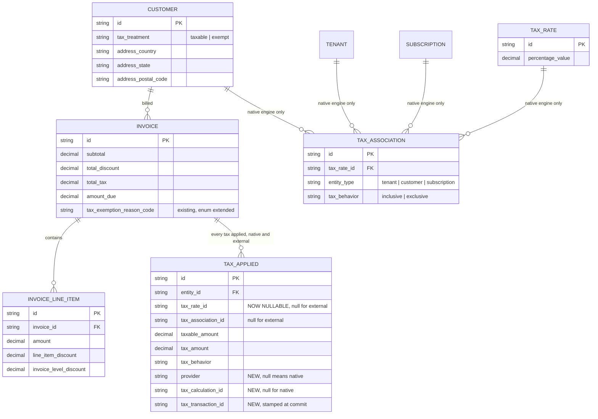
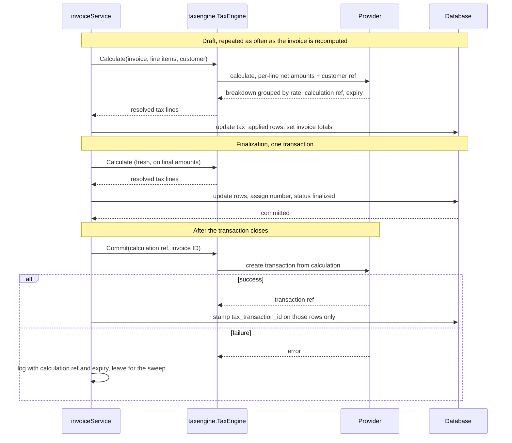
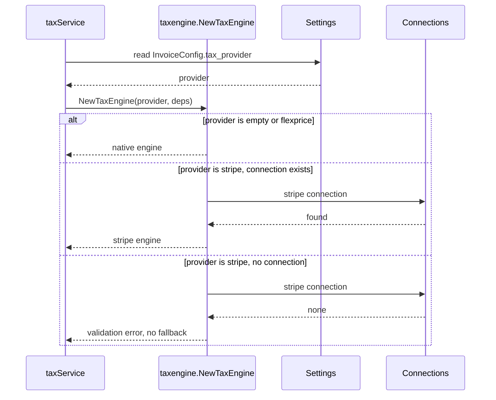
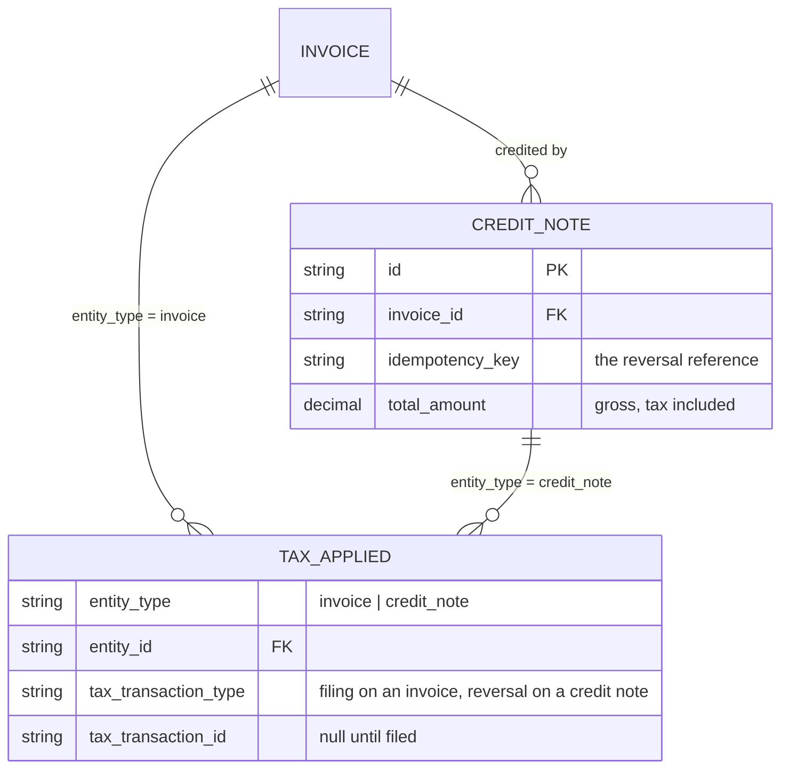

# Stripe Tax Engine Integration — Design ERD

Author: Tsage  
Date: 2026-09-11  
Ticket: FLE-1167

---

## 1. Context

### 1.1 How Flexprice calculates tax today

A tenant defines `tax_rate` rows holding a flat percentage. Each rate is linked to a tenant, a customer or a subscription through `tax_association`, which also carries the `tax_behavior`, inclusive or exclusive. At invoice time `taxService` resolves the applicable rates, multiplies them against the invoice's taxable amount, and writes one `tax_applied` row per rate.

The taxable amount is the invoice subtotal less total discount. Tax is computed at **invoice level**, not per line item.

Where it runs differs by invoice type. One-off and credit invoices apply tax during compute, because they are created and finalized in one operation. Subscription invoices defer tax to finalization, so wallet debits only happen when the invoice is sealed.

`tax_applied` is the record of what was charged. The invoice API exposes it as `taxes[]`, and `tax_summary` is derived from those rows by summing them by behavior. The invoice PDF renders them as an Applied Taxes table.

### 1.2 What the Stripe integration already does

Flexprice syncs several entities to Stripe through `entity_integration_mapping`, which pairs a Flexprice entity ID with a provider entity ID:


| Flexprice entity | Stripe object | Direction           |
| ---------------- | ------------- | ------------------- |
| `customer`       | Customer      | both                |
| `plan`           | Product       | Stripe to Flexprice |
| `subscription`   | Subscription  | Stripe to Flexprice |
| `invoice`        | Invoice       | Flexprice to Stripe |
| `price`          | Product       | Flexprice to Stripe |


Almost all of this happens **after** an invoice is finalized. The invoice sync runs in a Temporal workflow triggered by the finalized event, and it is that workflow which creates the Stripe Product for any price billed for the first time. The Stripe Customer is created the same way, lazily, when an invoice sync or a payment flow needs one. A connection-level outbound customer sync toggle exists but is off by default, so in practice the customer reaches Stripe at the same point everything else does.

Stripe's own `automatic_tax` is never enabled anywhere. Flexprice folds its own tax into the amounts it sends, so Stripe is a recipient of tax, not a calculator of it.

## 2. Problem statement

Flat percentage rates work when the tenant already knows the rate. Real indirect tax is not that. Getting VAT, GST and US sales tax right requires a jurisdiction rules database, per-jurisdiction registration tracking, product taxability classification, and reverse charge determination for cross-border B2B sales. None of that is something Flexprice is building.

**Goal.** Let a tenant delegate tax calculation to an external engine, Stripe Tax first, behind an interface that other engines can be added to later without touching invoice code.

**Non-goal.** Replacing the native engine. It stays the default for tenants who do not opt in, and nothing changes for them.

## 3. ERD




### 3.1 Schema changes


| Table                       | Change                                    | Why                                                                                                         |
| --------------------------- | ----------------------------------------- | ----------------------------------------------------------------------------------------------------------- |
| `tax_applied`               | `tax_rate_id` becomes nullable            | An external row has no Flexprice rate to point at                                                           |
| `tax_applied`               | add `provider`, nullable                  | Null or empty means the native engine, so every existing row is already correct and nothing is backfilled   |
| `tax_applied`               | add `tax_transaction_id`                  | The provider's record of the filed tax, stamped once at commit                                              |
| `tax_applied`               | add `external_tax_details`, jsonb         | Everything the engine returned about this tax, frozen at calculation. Null for a native row. See 8.10       |
| `tax_exemption_reason_code` | extend the enum, see 3.2 | The engine reports why it charged zero, and today's two values cannot hold it |
| `InvoiceConfig` setting     | add `tax_provider`                        | Engine selection                                                                                            |


### 3.2 Tax exemption reason codes

`tax_exemption_reason_code` holds two values today, `customer_exempt` and `no_tax_configured`. An engine reports a richer set: Stripe returns fifteen `taxability_reason` values [3]. Most describe partial or standard rating and never mean "no tax was charged", so mapping all fifteen would add values nothing ever sets.

Five are adopted, because each means a zero for a materially different reason and the difference changes what an operator should do about it:

| Provider reason | Maps to | Means |
| --- | --- | --- |
| `reverse_charge` | `reverse_charge` | The buyer accounts for the tax. Legitimate, and it obliges the invoice to carry a statement |
| `customer_exempt` | `customer_exempt` | Existing value, unchanged |
| `not_collecting` | `not_collecting` | No registration in that jurisdiction, **or** a nontaxable product code. Ambiguous on the provider's side |
| `not_subject_to_tax` | `not_subject_to_tax` | The jurisdiction does not tax this at all |
| `not_supported` | `not_supported` | The engine cannot compute there. An operational problem, not a tax outcome |

Everything else maps to null, meaning tax was charged normally.

**A reverse charge customer stays `taxable` on the Flexprice side.** `tax_treatment` is an input to the native engine and nothing else: it becomes a calculation input in one place, where `exempt` sets the exemption flag on the resolved rates. With an external engine selected that path does not run, because the engine makes the determination itself from what it holds.

Marking such a customer `exempt` would be wrong twice. Exempt means no tax is due at all, whereas reverse charge means tax **is** due and the buyer accounts for it to their own authority rather than paying it to the seller. It would also stamp `customer_exempt` as the reason, which misreports why the invoice carries zero. The zero comes from the engine's determination, recorded as `reverse_charge`, not from the customer's treatment.

The distinction that matters most is `reverse_charge` against `not_collecting`. Both produce a zero. The first is correct and expected. The second usually means the tenant has not finished configuring registrations and is under-collecting. Without the reason they are indistinguishable, which is why today's `no_tax_configured` is not sufficient: it would label a legitimate reverse charge as a misconfiguration. Because `not_collecting` is itself ambiguous, the raw provider string is kept alongside the mapped value so its two causes can be told apart later.

### 3.3 What is deliberately not changed here

Three things a reader might expect to see in this table are absent, because they belong to the **native** engine rather than to this change. They are recorded in 6.1.

| Not changed | Why not |
| --- | --- |
| `customer.tax_ids` | The external engine reads tax IDs off the provider's own Customer object [2], including ones the provider collected itself at checkout. A Flexprice copy would have to be kept in sync, and the customer sync does not push tax IDs today, so the column would be written and never read. It is needed for the invoice template, which is a native concern too |
| `reverse_charge` on `tax_treatment` | That value is an **input** to native calculation. The external engine determines reverse charge itself from the tax IDs it holds and reports it back as a reason, which the extended enum in 3.2 already captures. Native needs the input; this change does not |
| Per-line tax storage | Tax stays at invoice level. The request shape already supports per-line, so nothing here blocks it later, see 6.2 |

## 4. Approach

### 4.1 Walkthrough





### 4.2 Flexprice owns the invoice, the engine only returns numbers

The external engine is a calculator. It never becomes the system of record, never finalizes anything and never sees a Flexprice invoice. Flexprice sends amounts and a customer reference, receives tax back, writes it onto its own invoice and finalizes on its own schedule.

The consequence is that Stripe's `automatic_tax` must never be enabled, on invoices or on checkout sessions. Flexprice already folds tax into the amounts it sends to Stripe, so if Stripe also calculated tax the invoice would be taxed twice. Today this holds only because no code sets the field. It gets set explicitly to `false` so the intent is recorded rather than assumed.

### 4.3 Two stages, calculate then commit

| Stage | Call | Repeatable | What it does |
| --- | --- | --- | --- |
| Calculate | `POST /v1/tax/calculations` [3] | yes | Answers "what is the tax". Persists nothing on the provider side |
| Commit | `POST /v1/tax/transactions/create_from_calculation` [5] | no | Records the tax in the provider's books, so it appears in the tenant's tax reports and they can file |

Calculate alone produces a correct Flexprice invoice. Commit is what lets the tenant file. Commit is the terminal step.

A note on the words. Flexprice already has an unrelated `POST /invoices/preview` that returns a hypothetical invoice and creates nothing. These stage names avoid that word, and match the two methods on the engine interface in 4.7.

### 4.4 All tax configuration lives in the provider

A tenant who selects Stripe Tax configures tax in Stripe: registrations, product tax codes, and the default tax behavior in Tax Settings. No `tax_rate` or `tax_association` rows are created in Flexprice, and Flexprice sends none.

The calculation request carries the invoice as an array of line items, one entry per invoice line. There is no total parameter on the API, so no invoice total is sent. The provider sums the entries itself and returns `amount_total` [3].

```
currency=usd
customer=cus_...
line_items[0][amount]=8147     line_items[0][reference]=<invoice_line_item.id>
line_items[1][amount]=9053     line_items[1][reference]=<invoice_line_item.id>
line_items[2][amount]=2500     line_items[2][reference]=<invoice_line_item.id>
expand[]=line_items.data.tax_breakdown
```

| Sent | Value |
| --- | --- |
| `currency` | Invoice currency |
| `line_items[i].amount` | That line's amount, already net of its line discount and its share of the invoice discount, in the smallest currency unit |
| `line_items[i].reference` | The invoice line item ID |
| `customer` | The mapped Stripe customer ID |
| `expand[]` | One entry whatever the line count. It is a path, and the path covers every element |

**Why line items rather than one amount.** Tax is resolved per line and then grouped by the rate each line resolves to [1]. Sending the invoice as its own lines is the only shape that can express more than one rate on an invoice, and it is also the shape line-item taxation needs later, so the request does not change when that ships. Today every line resolves to the tenant's preset tax code, so there is a single group, but the request is already correct for the day that stops being true.

**Why `customer` and not `customer_details`.** The Stripe Customer becomes the single source for who the buyer is. The provider reads its shipping or billing address, its IP, any tax exemption, and its tax IDs [2]. Sending the ID rather than a snapshot means there is one address of record and no way for the two to disagree. It also picks up tax IDs the provider collected itself at checkout, with no work on our side.

**Discounts are already applied.** The provider has no discount parameter on this API and expects the caller to apply discounts first [1]. Each Flexprice invoice line already carries its amount net of its own discount and its pro-rata share of any invoice-level discount, so the line amounts sum to the invoice's taxable amount by construction. Prepaid credits are not subtracted: today's taxable amount has no credits term, because credits pay the bill rather than reduce the price.

| Deliberately not sent | Why |
| --- | --- |
| `customer_details` | Superseded by `customer` |
| `line_items[].product` | Nothing would use it yet, see below |
| `tax_behavior` | The provider resolves it from its own Tax Settings default [7] |
| `tax_code` | The provider falls back to the tenant's preset tax code [7] |
| Any rate or percentage | The engine determines the rate. That is the point |

**On `product`.** Passing it would let the provider read a tax code off its own catalogue object [2]. Two things make it pointless today. Flexprice never sets a tax code on the Products it creates, so there would be nothing to read. And those Products are only created when an invoice syncs, which happens after finalization, so at the moment tax is calculated a price billed for the first time has no Product to point at. Both are addressed in 6.1.

### 4.5 Tax behavior stays with the provider, and the tenant owns the consequence

`tax_behavior` decides whether the amount sent is treated as pre-tax or post-tax:

```
amount sent 10000, rate 18%

exclusive  ->  tax 1800,  total 11800     tax added on top
inclusive  ->  tax 1525,  total 10000     tax carved out, total unchanged
```

Omitting it means the provider uses its own default [7]. Stripe's recommended setting resolves to exclusive for USD and CAD and inclusive for other currencies.

This puts a real obligation on the tenant. If their behavior is inclusive, their Flexprice plan prices must already contain the tax. If it is exclusive, prices must be pre-tax. A mismatch produces a wrong total silently, and Flexprice cannot detect it because there is no `tax_association` to compare against. Our side of the contract is to be rigid: always omit the field, never guess it, never override it. The tenant's side belongs in product documentation with worked examples for both settings.

### 4.6 `tax_applied` records external tax too

Every tax applied to an invoice is a `tax_applied` row, whatever computed it. There is no second place tax is recorded and no new column on `invoice`. One row per entry in the calculation's top-level breakdown, which is already grouped by resolved rate and already at invoice-level cardinality [3].

| Column | Native | External |
| --- | --- | --- |
| `tax_rate_id` | The rate | null |
| `tax_association_id` | The association | null |
| `taxable_amount` | Computed | The breakdown entry's base |
| `tax_amount` | Computed | The breakdown entry's tax |
| `tax_behavior` | From the association | From the breakdown entry |
| `provider` | null | `stripe` |
| `tax_calculation_id` | null | Written with the row |
| `tax_transaction_id` | null | Stamped once at commit |

**Rows are updated in place, exactly as native rows are.** A recompute resolves the invoice's existing rows and writes the new amounts onto them. Native matches a row by the tax rate it came from; an external row is matched by the invoice and the provider. Nothing is deleted and nothing is archived, because only the current calculation matters.

**The one write after finalization.** Commit returns the transaction ID only after the invoice is sealed. It is stamped onto those rows through a narrow setter that writes `tax_transaction_id` and nothing else, scoped to the rows carrying the calculation ID that produced that transaction and whose transaction ID is still null. Amounts, behavior and timestamps stay exactly as finalization left them, and a repeated stamp is a no-op.

**Why the transaction ID is the record and the calculation ID is not.** A calculation is a quote. The provider persists nothing when one is made, it never appears in the tenant's tax reports, it counts toward no filing, and it expires [3]. The transaction is the entry in the provider's books [4] and the only handle a reversal accepts [6]. There is also no way to search for a transaction, only to retrieve one by ID, so a transaction whose ID was not stored is unreachable. The calculation ID is kept alongside it as the retry input for a commit that failed.

**Everything that reads tax keeps working.** `taxes[]` is already the `tax_applied` rows, and `tax_summary` is already derived from them by summing by behavior. Both inputs that derivation uses are existing columns that map directly onto a breakdown entry, so neither changes. The read paths that need fixing are the two that assume a non-empty `tax_rate_id`: one feeds rate IDs into a filter that rejects empty values, and one slices the last characters of the ID for a display name. The webhook payload should also carry `provider`, so a subscriber can tell an external row from missing data.

### 4.7 The engine interface

Tax calculation becomes an interface with two operations. Everything that differs between providers lives behind it, and invoice code never names a provider.

| Operation | Guarantee |
| --- | --- |
| `Calculate` | Pure from Flexprice's point of view. Persists nothing on the provider side, safe to call as often as the invoice is recomputed. Returns tax as a set of resolved rate lines |
| `Commit` | Records the calculation in the provider's books. Called once, after finalization. Terminal |

The native engine implements the same interface, with `Commit` returning an empty result without calling anything. That is the load-bearing detail: it means the invoice path calls `Calculate` then `Commit` unconditionally, and no `if external` exists outside the engine package.

```go
// internal/taxengine/engine.go
type TaxEngine interface {
	// GetProvider names the engine. Stamped onto every row it writes.
	GetProvider() types.TaxProvider

	Calculate(ctx context.Context, in CalculationInput) (*CalculationResult, error)
	Commit(ctx context.Context, in CommitInput) (*CommitResult, error)
}
```

**What crosses the boundary.** The input carries the invoice and nothing provider-shaped. No rates, no tax codes, no provider vocabulary. Each engine resolves what it needs from what it is given: native resolves rates and associations, Stripe resolves the customer mapping, Avalara and Anrok will resolve theirs. This is what stops the interface growing a field per provider.

```go
type CalculationInput struct {
	Invoice    *invoice.Invoice
	LineItems  []*invoice.InvoiceLineItem
	CustomerID string
}

type CalculationResult struct {
	CalculationRef string    // empty for native
	ExpiresAt      time.Time // read from the provider, never assumed
	CalculatedAt   time.Time
	InclusiveTax   decimal.Decimal
	ExclusiveTax   decimal.Decimal
	Lines          []ResolvedTaxLine
}

// ResolvedTaxLine is one resolved rate group, not one invoice line item.
// It maps onto exactly one tax_applied row.
type ResolvedTaxLine struct {
	TaxRateID     *string // native only, null for external
	TaxableAmount decimal.Decimal
	TaxAmount     decimal.Decimal
	TaxBehavior   types.TaxBehavior
}

type CommitInput struct {
	CalculationRef string
	Reference      string // the invoice ID, unique across all transactions [5]
}

type CommitResult struct {
	TransactionRef string // empty for native
	PostedAt       time.Time
}
```

The result is deliberately shaped like the rows it becomes. `ResolvedTaxLine` is one `tax_applied` row, so persistence is a direct write with no reshaping and no provider-specific branch.

### 4.8 Choosing an engine

Two inputs, both required:

- **The setting says which.** `tax_provider` on `InvoiceConfig` names the engine.
- **The connection says how.** Credentials live on the provider connection, as they do for every other integration.

A factory reads the first, verifies the second, and returns a `TaxEngine`. That is the only place in the system a provider is named.

```go
// internal/taxengine/factory.go
func NewTaxEngine(ctx context.Context, provider types.TaxProvider, deps Deps) (TaxEngine, error) {
	switch provider {
	case types.TaxProviderStripe:
		conn, err := deps.ConnectionRepo.GetByProvider(ctx, types.SecretProviderStripe)
		if err != nil {
			return nil, err
		}
		if conn == nil {
			return nil, ierr.NewError("stripe is the selected tax engine but no stripe connection exists").
				WithHint("Connect Stripe before selecting it as the tax engine").
				Mark(ierr.ErrValidation)
		}
		return newStripeEngine(deps), nil

	default:
		return newNativeEngine(deps), nil
	}
}
```

Three properties of that switch are deliberate:

- **`default` is native.** Unset, empty and `flexprice` all land there, so every existing tenant keeps working with no migration and no backfill.
- **A selected engine that cannot be built is an error.** Choosing Stripe without a Stripe connection fails loudly. It never quietly falls back to native, because billing native rates under an external configuration produces a wrong invoice that looks right.
- **An unknown value is an error, not a default.** A typo in the setting must not silently change how a tenant is taxed.

Callers resolve the engine once at the top of the tax path and then work only against the interface:

```go
cfg, err := GetSetting[types.InvoiceConfig](settingsSvc, ctx, types.SettingKeyInvoiceConfig)
if err != nil {
	return err
}

engine, err := taxengine.NewTaxEngine(ctx, cfg.TaxProvider, deps)
if err != nil {
	return err
}

result, err := engine.Calculate(ctx, taxengine.CalculationInput{
	Invoice:    inv,
	LineItems:  inv.LineItems,
	CustomerID: inv.CustomerID,
})
```

Adding an engine later is a case in that switch plus an adapter behind the interface. No invoice code changes and no read path changes, because the result already arrives in the shape the rows take.

### 4.9 Where the setting lives

`tax_provider` goes on the existing `InvoiceConfig` setting. It is already tenant and environment scoped, which is exactly the scope of the decision, and it already holds invoice-time behavior such as due dates and the finalization delay. It is already fetched on the billing path, so there is no new plumbing and no new settings key.

Selection is not overridable per customer. The tax engine is an accounting decision rather than a per-customer one, so it follows that setting's existing hierarchy.

The setting holds only which engine to use. Everything else already has a home: the seller address is on the tenant's provider account, credentials are on the connection, and tax behavior belongs to the provider per 4.5.

### 4.10 Finalize and commit ordering

A provider HTTP call cannot sit inside a database transaction, so finalization and commit cannot be genuinely atomic. They are sequential and separately recoverable.

Finalization comes first, because a draft can still change. Finalization is the first moment the number is real, so committing earlier risks filing tax for an invoice that then moves.

```
1. DB transaction: recalculate tax, write tax_applied rows, finalize the invoice.
                   tax_transaction_id still null
2. DB commit
3. Provider: create the transaction from the calculation
4. DB: stamp tax_transaction_id onto those rows, touching no other column
```

Two mechanisms make step 3 safe to repeat. It runs inside a Temporal activity, so a failure is retried automatically. And the transaction reference is the invoice ID, which must be unique across all transactions including reversals [5], so the provider rejects a duplicate on retry.

The residual state is a finalized invoice with a null transaction ID after retries are exhausted. That is recoverable, not corrupt: the invoice and its tax are correct, only the provider's copy is missing. Recovery is to re-run the commit from the stored calculation ID.

The deadline is read, never assumed. A calculation carries its own expiry [3], and Stripe does not publish a fixed validity window anywhere in its guides or object reference. Read the field off the response and log it, so the failure carries its own deadline rather than becoming an open-ended cleanup task.

### 4.11 Tax is recalculated before finalization

Rates change. An invoice drafted while a jurisdiction charged 18 percent and finalized after it moved to 20 percent must be finalized at 20. The tax that matters is the tax at the moment the invoice is sealed, not at the moment it was drafted.

Today that holds for **subscription** invoices and not for the others:

| Invoice type | Tax written at compute | Recalculated at finalization |
| --- | --- | --- |
| Subscription | No | **Yes** |
| One-off | Yes | **No** |
| Credit | Yes | **No** |

The gate is explicit and doubled. Finalization only calls the recalculation for subscription invoices, and the recalculation itself returns immediately for anything that is not a subscription invoice with a subscription ID.

In the common path that is harmless, because one-off and credit invoices are created and finalized in a single operation and there is no window in which anything could change. It stops being harmless where a one-off invoice is created as a **persisted draft** and finalized later. That happens today: mid-cycle quantity changes, addon charges and wallet top-ups all create computed drafts that are finalized separately. Those invoices carry the tax computed on the day they were drafted.

**The requirement: tax is calculated before finalization, every time, for every invoice type.** The scope is to lift the subscription-only gate so every type recalculates, and to make finalization itself check that the invoice was computed recently enough rather than leaving that check only on the scheduled path.

This becomes mandatory rather than merely correct once an external engine is involved. The calculation's tax date selects the rule set that applies [3], so a month-old calculation used a month-old rule set, and a stale calculation cannot be committed at all once it has expired.

**Only the tax step reruns, not the whole compute.** Prepaid credits are applied by the same compute path, and applying them debits wallets for real. Where that happens differs by type: one-off and credit invoices debit at draft compute, subscription invoices debit at finalization. Either way, re-running the full compute at finalization would debit the same wallet a second time. There is no protection against that today, because the wallet debit's idempotency key is built with a nanosecond timestamp in it, so every call produces a different key. Finalization also runs inside a retrying Temporal activity, which would multiply the problem. So the change is scoped to recalculating tax and nothing else.

### 4.12 A finalized invoice's tax is frozen

Once an invoice is finalized its tax has been committed to the provider and exists in the tenant's filings. Rewriting those rows afterwards makes the Flexprice record disagree with the provider's, and nothing reconciles the two.

So `tax_applied` rows are mutable while the invoice is a draft and frozen once it is sealed. The tax write path is gated on draft status, and a recalculation that reaches a finalized invoice errors rather than rewriting the record.

One exception, and only one: the transaction ID stamp in 4.10, which writes a single column that was null and leaves every other column as finalization left it.

### 4.13 Reverse charge invoices need a statement

When the engine determines that the buyer accounts for the tax, it returns zero with a `reverse_charge` reason. Zero tax alone is not a compliant invoice in that case. The invoice has to say so: Stripe's own instruction is to "issue an invoice with the text, 'Tax to be paid on reverse charge basis'" [2].

The template carries no such statement today, and an invoice showing zero tax without it is indistinguishable from one where the tax was simply missed.

This is in scope for this change, because the engine can return that reason from the first invoice a tenant runs through it. It needs the reason code from 3.2 to reach the template, and the statement rendered whenever it is `reverse_charge`.

What is **not** in scope, and is recorded in 6.1: storing customer tax IDs with format validation, and a `reverse_charge` value on `tax_treatment` so the native engine can express the case. Neither is needed for the engine path, because the engine determines reverse charge from the tax IDs the tenant configures on the provider's own customer.

### 4.14 Failure policy and logging

A configured engine that fails is an error. There is no fallback to native, because silently billing native rates under an external configuration produces a wrong invoice that looks right.

The tax path already logs at compute. Two existing lines gain fields, and the events the engine introduces are new:

| Event | Level | Carries |
| --- | --- | --- |
| Tax computed | Info | Existing fields plus `provider`, and the taxability reason when the provider returned one |
| Engine call failed | Error | `invoice_id`, `provider`, `error` |
| Commit succeeded | Info | `invoice_id`, calculation and transaction IDs, posted at |
| Commit skipped, already committed | Info | `invoice_id`, transaction ID |
| Commit failed | Error | `invoice_id`, calculation ID, **calculation expiry**, provider error code and type, total tax, currency, `error` |
| Finalized with no committed transaction after retries | Error | `invoice_id`, calculation ID, calculation expiry, total tax, currency |

The calculation expiry is what makes a commit failure actionable. Without it an operator knows a commit failed but not how long they have to fix it. The provider error code and type separate the three cases that need different responses: bad credentials, a configuration problem such as a missing registration, and a transient failure that resolves itself.

The taxability reason matters more than it looks. A zero from an engine is legitimate for reverse charge and broken for a missing registration, and the two are indistinguishable without it, per 3.2.

The last row is the reconciliation trigger and the only line here that something operational should alert on.

Every error log carries a literal `error` key, per the loglint gate.

## 5. Test coverage


### 5.1 Selection and configuration


| Case                                               | Expected                                   |
| -------------------------------------------------- | ------------------------------------------ |
| Setting absent or empty                            | Native engine, existing behavior unchanged |
| Setting is `flexprice`                             | Native engine                              |
| Setting is `stripe`, connection exists             | Stripe engine                              |
| Setting is `stripe`, no connection                 | Validation error, never native             |
| Setting is an unknown value                        | Validation error                           |
| Two environments of one tenant, different settings | Each resolves independently                |


### 5.2 Request construction


| Case                                                   | Expected                                                                       |
| ------------------------------------------------------ | -------------------------------------------------------------------------------- |
| Invoice with several line items                        | One array entry carrying the whole taxable base, and no `expand`               |
| Invoice carrying a discount                            | The base sent is net of it                                                     |
| Base sent versus the base the native engine would tax  | Identical, so the two engines cannot disagree on the same invoice              |
| Invoice discounted past its subtotal                   | Clamped at zero, never negative                                                |
| Invoice carrying prepaid credits                       | Credits are **not** subtracted from what is sent                               |
| Zero-decimal currency                                  | Not scaled, because its smallest unit is its major one                         |
| Line reference                                         | The invoice id, because one line carries the whole invoice                     |
| Customer has no mapped Stripe ID                       | Precondition failure with a clear error, not a call with a missing customer    |
| Customer synced with country only and no address lines | Refused rather than silently returning zero tax                                |


### 5.3 Response handling


| Case                                            | Expected                                                              |
| ------------------------------------------------- | ----------------------------------------------------------------------- |
| Single breakdown entry                          | One row, amounts match                                                |
| Several entries on one invoice                  | One row per entry, sum equals invoice total tax                       |
| Entry a jurisdiction imposed nothing for        | Still a row, recorded for the filing, not drawn on the invoice        |
| Entry with `tax_rate_details: null`             | Still a row; the handle lands, no percentage is recorded, no panic    |
| Inclusive line                                  | Every row on it is inclusive, read from the line and not the entry    |
| Percentage rate                                 | Display name, tax type, percentage, reason and jurisdiction all land  |
| Customer tax IDs on the calculation             | Frozen onto the invoice alongside the biller's                        |
| Neither side has a tax ID                       | The set is left absent rather than written as an empty object         |
| Zero tax with each mapped reason                | Reason recorded, reverse charge outranking the rest                   |
| One jurisdiction reverse charged, another taxed | Reason still recorded, because that invoice owes the statement        |
| Every jurisdiction standard rated               | No reason, standard rating is not an exemption                        |
| Zero tax with a reverse charge reason         | Zero recorded, reason mapped, not treated as a misconfiguration, and the statement rendered |
| Zero tax with a not-collecting reason         | Zero recorded, reason mapped, distinguishable from the above    |
| Exempt customer                               | Zero charged, reason recorded                                   |


### 5.4 Lifecycle


| Case                                           | Expected                                                                                           |
| ---------------------------------------------- | -------------------------------------------------------------------------------------------------- |
| Draft recomputed several times                 | Rows updated in place, no duplicates accumulate                                                    |
| Rate group count changes between recomputes    | Row set matches the latest calculation                                                             |
| Finalization after a long-lived draft          | Tax recalculated before sealing, not inherited from the draft                                      |
| Commit succeeds                                | Transaction ID stamped on that invoice's rows only                                                 |
| Commit fails                                   | Invoice stays finalized and correct, transaction ID null, error logged with the calculation expiry |
| Commit retried after a success                 | Provider rejects the duplicate reference, no second transaction                                    |
| Stamp applied twice                            | No-op, nothing else on the row changes                                                             |
| Recalculation attempted on a finalized invoice | Errors rather than rewriting the record                                                            |


### 5.5 Reads and compatibility


| Case                                                     | Expected                                    |
| -------------------------------------------------------- | ------------------------------------------- |
| Invoice fetched with tax expanded, external rows present | Succeeds, does not fail on a null rate ID   |
| Invoice PDF for an external invoice                      | Renders without panicking on a null rate ID |
| Invoice PDF for a reverse charge invoice | Carries the statement, not merely a zero |
| Webhook payload for an external invoice                  | Emits the rows and identifies the provider  |
| Native tenant, any of the above                          | Byte-identical to today                     |
| Invoice created before this feature                      | Reads as native, no migration needed        |


### 5.6 Failure and isolation


| Case                                          | Expected                                                 |
| --------------------------------------------- | -------------------------------------------------------- |
| Engine call times out during compute          | Error propagates, no fallback to native                  |
| Engine returns a malformed or empty breakdown | Error, no partial rows written                           |
| Engine fails during finalization              | Finalization fails, invoice stays draft                  |
| Two concurrent finalizations of one invoice   | One wins, no duplicate rows and no duplicate transaction |


## 6. Enhancements and scalability

### 6.1 Enhancements

Everything not built here, in one place. Items solved during implementation have been removed
rather than left as open questions.

**Tax records**

| Item | What is missing |
| --- | --- |
| A finalized row is frozen by convention, not by the schema | 4.12 gates the write path on draft status. An external row corresponds to a transaction the tenant has filed on, so drift reconciles against nothing. The end state is a row immutable apart from `tax_transaction_id`. Deferred because it changes the native write path too, and archive-and-rewrite needs a retention answer |
| A native row does not freeze its rate | It points at a `tax_rate`, so editing or archiving that rate changes what an old invoice renders and drops it out of the rebuild in 8.6. Freezing name and percentage onto the row fixes both |
| The native path never cleans up stale rows | Removing every rate from a draft leaves the previous set published and still counted. Pre-existing defect, its own ticket |
| One engine per invoice is not enforced | Reachable by switching a tenant back to native with a one-off draft outstanding. Commit fails loudly rather than silently, so the state is visible. Enforcing it means deciding what a mismatch does, which only becomes real once a tenant can hold more than one engine |
| No sweep for uncommitted tax | A commit that fails after its retries leaves a finalized invoice whose rows carry no `tax_transaction_id`. The log carries what is needed to act. A scheduled sweep would select those rows, order by `calculation_expires_at`, and call the same commit path. An expired calculation needs an operator decision, not a sweep |

**Per-line taxation**

| Item | What is missing |
| --- | --- |
| Line-item taxation | Replaces invoice-level taxation rather than running beside it. Needs a tax column on line items, per-line rows, per-line credit note reversal and a native engine that resolves a rate per line. See 8.9 |
| The price to Product mapping orphans the tenant's Product | A Flexprice price maps to a Product Flexprice creates. The tenant's own Product, the one they would tag with a tax code, maps to a plan instead, and the price sync never consults the plan mapping |
| The Product does not exist when tax is calculated | It is created during invoice sync, after finalization. Tax runs at finalization. Both halves must be fixed before per-product taxability works at all |

**Tax identity**

| Item | What is missing |
| --- | --- |
| Tax numbers are read from the provider, not stored | 8.12 reads both sides out of Stripe on every render. Holding them on the tenant and customer, and pushing them on customer sync, means one place to maintain them and two fewer calls when rendering. Changes nothing about what the invoice shows |
| Customer tax IDs are never synced outbound | The customer sync pushes name, email and a conditional address. IDs the provider collects itself at checkout already land correctly, so this only affects ones Flexprice would hold |
| Customer tax ID storage and format validation | The provider format-checks only and does not validate against government databases, so regex per ID type matches the bar. Needed for the storage above and as the input native reverse charge would require |
| The customer address is attached conditionally | A customer with a country and no address lines reaches the provider with no address, and the calculation returns zero rather than failing. The condition needs widening and the engine path needs a precondition that refuses |
| Reverse charge as a native tax treatment | The enum holds taxable and exempt only. Native cannot express that the buyer accounts for the tax. It has to read as a **tenant assertion** rather than a Flexprice determination, which means the tax ID stored and validated, UI wording that says the tenant is declaring it, and documentation stating Flexprice makes no determination. The external engine needs none of this |

**Credit notes**

| Item | What is missing |
| --- | --- |
| A natively credited amount carries no tax | Native tax resolves from an invoice's rate associations and a credit note has none of its own, so `Calculate` returns the amount untaxed. Taxing it from the invoice's own rows is a change to the native path |
| A partial reversal followed by a full one is untested | A credit note reverses part, then the invoice is voided with `mode: full`. Not exercised against the live API. May over-reverse or be refused |

**Engine selection**

| Item | What is missing |
| --- | --- |
| Engine coverage is not validated at selection | Supported seller locations and supported customer locations are different lists [8]. A tenant whose account country is unsupported as a seller cannot use that engine at all, whatever the setting says |

### 6.2 How this approach scales

**A second engine costs an adapter and a case in one switch.** Every candidate already has the same two-stage shape, a throwaway estimate followed by a recorded document, so the interface in 4.7 does not move to accommodate them:

| Engine | Calculate | Commit | Notes |
| --- | --- | --- | --- |
| Stripe Tax | `POST /v1/tax/calculations` [3] | `create_from_calculation` [5] | Provider generates the transaction ID |
| Avalara AvaTax | `SalesOrder`, a temporary estimate that is not recorded [14] | `SalesInvoice`, then commit [14] | Documents move through Saved, Posted and Committed, so commit issues two calls |
| Anrok | `transactions/createEphemeral`, which calculates "without saving the transaction" [15] | `transactions/createOrUpdate`, which saves it for filing and threshold monitoring [15] | Returns no calculation ID, and jurisdiction is a display string only |

What a second adapter costs beyond the two methods: a reason-code mapping, because no two vendors publish the same taxability vocabulary; transaction reference generation, because the others take a caller-supplied identifier and the adapter then owns uniqueness; and jurisdiction normalization, because the structure differs per vendor.

The rest of this section is about what does **not** have to change.

- **Per-product tax codes become one field once 6.1 lands.**  
  Pass the product reference on each line and the provider resolves the code off its own catalogue object. Nothing else changes, and the provider reads only the tax code off that object [2], so linking products cannot disturb amounts or behavior. Flexprice never mirrors the code: the pointer lives in the entity mapping, the classification stays with the provider, and a mirrored copy would be a cache with no invalidation.

- **Line-item level taxation needs no request change.**  
  The request already sends one entry per invoice line with the line ID as its reference, and the response already carries a per-line breakdown. What changes is which breakdown is read, invoice-level or per-line; row identity, which becomes the invoice line item ID; and the invoice template. The schema in 4.6 does not need revisiting, because rows are already per-row rather than per-invoice and the provider handles already live on them.

- **Per-jurisdiction reporting is additive.**  
  The breakdown carries the jurisdiction, percentage, tax type and reason for each entry. None is stored today because nothing reads them. An invoice template that itemises rate and jurisdiction, or reporting grouped by jurisdiction, would add them as flat columns. Existing rows are legitimately null, so no data migration follows. Until then the tenant's own provider tax reports are the jurisdiction-level record, reachable from the stored transaction ID.

- **Engine coverage is a ceiling, not a setting.**  
  Supported seller locations and supported customer locations are different lists [8]. A tenant whose own account country is not supported as a seller location cannot use that engine at all and must stay on native, whatever the setting says. Worth validating when a tenant selects an engine rather than discovering it on the first invoice.

## 7. Revised after provider research

Sections 3 to 7 were written against Stripe. Checking Avalara and Anrok afterwards showed one
concept in them does not generalise, so it is removed rather than carried. This section
supersedes the points it names. Nothing else in the document changes.

### 7.1 What the other engines actually do

| | Handle after calculating | Handle after recording | Who issues it |
| --- | --- | --- | --- |
| Native | none | none | — |
| Stripe | `taxcalc_...`, and it **expires** [3] | `tax_...` | Stripe |
| Avalara | **none**, a `SalesOrder` is a temporary non-recorded estimate [14] | transaction code | us |
| Anrok | **none**, `createEphemeral` returns no identifier [15] | transaction id | us |

Anrok's `createOrUpdate` takes the full invoice payload again and will not accept a reference
to a prior ephemeral calculation [15]. Avalara records by sending the transaction a second
time as a `SalesInvoice` [14].

So an intermediate calculation handle is a Stripe implementation detail, not a stage every
engine has. Two of the three recalculate when they record, which makes recalculate-then-record
the common shape rather than the exception.

### 7.2 Changes

| Supersedes | Change | Why |
| --- | --- | --- |
| 3.1 | `tax_applied.tax_calculation_id` is **not added** | Stripe-only, and it expires. A permanent tax record should not carry a token that goes stale |
| 4.6 | The calculation expiry is **not stored** | Nothing reads it once the retry window closes with the request |
| 4.6 | `tax_applied.tax_transaction_id` **stays** | Every engine ends with one addressable record. It is the proof of filing and the handle a reversal needs [16] |
| 4.7 | `Commit` takes the invoice, not a calculation reference | `Commit(ctx, inv) (taxTransactionID string, err error)`. Stripe calculates then records from that result. Avalara and Anrok send the invoice. Native returns empty |
| 4.10 | Recording runs immediately after finalization, with retry, and logs on failure | A reconciliation sweep is dropped. A Stripe calculation would have expired before a scheduled job reached it, so the sweep could not have used one anyway |
| 7.2 | The two stages generalise, the handoff between them does not | The interface fits all four engines only once `Commit` stops assuming Stripe's intermediate |

### 7.3 What this costs

Stripe performs one extra calculation when recording, because it no longer holds a stored
handle to record from. It runs immediately after finalization against a frozen invoice, so the
figures match what was stored. The recorded total is compared against the stored total and a
mismatch is logged rather than filed silently.

One provider difference remains and cannot be abstracted away: only Stripe records the exact
figures that were calculated. Avalara and Anrok recalculate at the point of recording, because
they take the payload again.

## 8. Revised during implementation

Building the engine surfaced six things sections 3 to 7 did not account for. This section
supersedes the points it names. Nothing else in the document changes.

### 8.1 A recalculation replaces `tax_applied` rows rather than updating them

An invoice is calculated more than once, on every draft recompute and again before
finalization. Updating rows in place means answering one question for every amount the engine
returns: does this belong to a row that already exists, or is it a new one. Answer it wrongly
one way and every recalculation appends duplicates, so the invoice reports double then triple
tax. Answer it wrongly the other way and one row absorbs amounts belonging to different rows.

For an external engine the question has no reliable answer. Stripe's breakdown is grouped by
resolved rate [3], so two rates that share a behavior produce two entries that nothing stored
on the row can tell apart. Matching on behavior returns the same row for both. The second
amount overwrites the first and the other row keeps a stale one, leaving rows that sum to less
than `invoice.total_tax`.

The question is removed rather than answered. On every recalculation, for both engines:

1. Fetch every published `tax_applied` row for the invoice.
2. Archive all of them.
3. Create the new set from what the engine returned.

No row is ever updated. The single exception is `tax_transaction_id` in 8.3, which fills a
column that was null and leaves every other column as finalization wrote it.

This covers `tax_applied` rows only. Nothing else about how an invoice is computed changes.

### 8.2 The unique index has to exclude archived rows

`idx_entity_tax_rate_id` is unique on tenant, environment, entity type, entity id and tax rate
id, with no predicate.

External rows are unaffected, because they carry no rate id and Postgres does not collide
nulls. Native rows carry a real one, so archive-then-create collides on the second
recalculation. The first archive leaves a row on that key and the second produces an identical
one.

Adding `status` as a sixth column does not fix it. Archived is a constant rather than a
discriminator, so the key admits exactly one archived row and fails on the next. A single
recalculation passes, which is what makes that shape dangerous.

The index becomes partial on `status = 'published'`. Archived rows leave the index entirely,
any number of them accumulate, and exactly one published row per key is still enforced. This
also closes a standing defect. `Delete` is a soft archive, so today an archived row holds its
key permanently and that rate can never be applied to that invoice again.

### 8.3 Commit reads its own handle off the rows it is about to stamp

7.2 changed `Commit` to take the invoice and recalculate, on the basis that a handle could not
be relied on to survive between calculating and recording. It survives on the row.

Each row carries whatever its engine needs to record it, written into `metadata` when the row
is created. Stripe writes `tax_calculation_id` and `tax_calculation_expires_at` there. At that
moment the calculation response is in hand and the invoice is a draft, so it is an ordinary
field on a new row rather than a mutation.

`Commit(ctx, inv, rows)`. Stripe reads its calculation back from `metadata` and records it.
Avalara and Anrok ignore `metadata` and send the invoice, which is what they require. Native
returns empty.

Two consequences:

- 7.3's comparison of the recorded total against the stored total is dropped. Recording the
  calculation that produced the rows cannot yield a different total.
- Nothing engine-specific crosses a service boundary. No caller of `CommitTaxToProvider` knows
  that Stripe has an intermediate handle and the others do not.

The row is also what makes the handoff work for an invoice that is never recalculated before
finalization. A one-off invoice is created, computed and finalized in a single request, so its
rows are written during compute and are seconds old when commit reads them.

This supersedes 7.2 on the `Commit` signature and on the expiry not being stored.

### 8.4 An engine that returns no usable reference applies no tax

Stripe types the calculation identifier as a plain string, so a response without one arrives
empty. Rows written from it would charge tax that can never be filed, which is worse than
charging none.

The engine refuses at calculation time, before any row is written, so the invoice is wrong in
the direction that is correctable rather than the direction that is a filing problem.

### 8.5 Finalization recalculates the tax for every invoice type

4.11 asks for this and it was gated to subscription invoices. Finalization now calls the
recalculation for every type and every engine, so what gets sealed is a current calculation
rather than whatever the draft was computed with, and an external engine's calculation is
inside its expiry window when commit records it.

The gate was there because a one-off invoice's rate selection arrives on its create request and
is stored nowhere, so recalculating it resolved nothing and would have zeroed the tax. That is
no longer true, see 8.6, so the gate is deleted rather than moved.

Line items are loaded before the call, because an external engine prices line by line and a
non-subscription invoice has not loaded them by that point.

Recalculating also mirrors the tax back into the custom-currency denomination, which is part of
having recalculated rather than something a caller decides. It matters because a read that
restores from the denomination recomputes the invoice total off the denomination's tax, so a
denomination left behind by a tax change returns a wrong total.

### 8.6 A rate selection is rebuilt from the tax the invoice already carries

Rates come from the create request for a one-off invoice and from its associations for a
subscription one. Only the second survives, so any later recalculation of a one-off had nothing
to work from.

The selection did survive, as records rather than as a list. Each `tax_applied` row holds the
rate it came from and the behavior frozen with it, which is the same pair every other source
produces. Reading the rates back by id and pairing them with the stored behavior reconstructs
what the invoice was charged under. Rates are re-read, so a percentage that moved is picked up
and a rate that no longer exists drops out. The customer is re-read, so a change in exemption
applies.

Resolution order becomes one cascade for every invoice type and both engines:

1. Rates the caller prepared.
2. The subscription's own associations.
3. The tax the invoice already carries.

Two things fall out. Nothing can now reach a recalculation with no selection at all, so there
is no case where an invoice's tax is archived because a caller simply had nothing to pass. And
a rate that is no longer configured stops being charged, which closes a standing native defect:
previously only the resolved rates were written and a removed rate kept its record while the
invoice total dropped.

### 8.7 A preview quotes the configured engine

`POST /invoices/preview` and the two internal preview paths resolved rates natively and
computed the tax themselves, so a tenant on an external engine was quoted its own native rates,
or zero when it has none configured, and then billed by the engine. The preview resolves the
engine now and asks it.

Two consequences worth stating. A preview of an external tenant's invoice makes a real
calculation call to the provider, which costs a request on a path that renders often. And a
preview is a quote rather than a bill, so an engine failure renders it untaxed with the reason
logged instead of failing the request, which is what the native path already did when rate
resolution failed. Untaxed for that reason is not reported as an exemption: nothing is stamped,
because the tax was not determined rather than determined to be zero.

Nothing is written to Flexprice either way, which is what makes a preview safe to repeat.

### 8.8 A credit note carries its own tax and reverses the invoice's

6.1 previously listed this as unbuildable because a `credit_note` has no tax component. It has
one now, held the same way an invoice holds its own: as `tax_applied` rows, with
`entity_type = credit_note`. This supersedes 3's diagram, which shows only the invoice.



**The money going back is gross.** The customer paid tax on what is being returned, so the tax
comes back with it. `credit_note.total_amount` is that gross figure. It is `Immutable()`, so the
gross is settled before the row is written and the reversal undoes exactly it. No `total_tax`
column is added: the breakdown is in the rows.

**Preview and persist are the same calculation.** `buildCreditNoteWithTax` builds the credit
note a request would produce and asks the engine what it is taxed at, both in memory.
`PreviewCreditNote` returns those figures and writes nothing, so the dashboard quotes on every
keystroke. `CreateCreditNote` runs the identical step and then persists what came back, so what
was quoted is what is issued. This is the same calculate-then-persist split the invoice uses:
`TaxService.PersistTaxResult` is the only thing that writes rows, for either entity.

A quote is not a credit note, so `PreviewCreditNote` checks only what the quote depends on: the
invoice, the line items, and the invoice's eligibility. A reason is required to **issue** one and
has no bearing on what it is taxed at, so it is not required to quote.

**A credit note's rows are reversals from the moment they are calculated**, because that is the
only thing its tax is ever filed as. They are written unstamped at create and stamped at
finalize, exactly as an invoice's rows are written at compute and stamped at commit.

```
create    → rows written, tax_transaction_type = reversal, tax_transaction_id null
finalize  → engine.Reverse against the invoice's transaction, rows stamped
```

**Finalize reverses inside the credit note's transaction and returns the error.** This is the
opposite of the invoice's commit, deliberately. A commit runs after the invoice is already
finalized, so a failure is an operator's to chase. A credit note is not yet issued when its
reversal runs, so a provider that refuses rolls the whole finalize back rather than issuing a
credit note with its tax still filed.

**A credit note that was reversed cannot be voided.** There is no way to reverse a reversal, and
filing a second correction would credit the tax twice.

**The reference is the credit note's idempotency key.** It is a hash of the request, so a retry
after a failed write sends the identical reference and the provider refuses the duplicate
instead of reversing twice. It also contains no `cn_`, which Stripe reserves and which a
Flexprice credit note id begins with.

### 8.9 The whole taxable base is sent as one line

Stripe taxes per line and rolls the result up into an invoice-level `tax_breakdown` grouped by
resolved rate. Flexprice resolves, stores and reports tax at invoice level: one `tax_applied`
row per rate group, no line-level tax column, and a native engine that computes against
`subtotal − total_discount`. Sending one line per invoice line and then storing the rollup is
the same answer arrived at by a longer route, and it invites the reader to believe line-level
tax exists when nothing downstream can hold it.

So the request carries a single line whose amount is `subtotal − total_discount`, the same base
the native engine taxes, referenced by the invoice id. Both engines now read the same field at
the same moment, which is what makes them comparable on the same invoice. Prepaid credits are
still not subtracted: a credit is a payment method, so it moves what is payable and not what is
taxable.

Chunking can move the answer where a jurisdiction rounds per line, so the two shapes are not
guaranteed to agree to the cent. One aggregate line is the shape that matches what is stored,
so it is the one that is correct here. It also means the line-level breakdown covers the whole
invoice, which 8.10 depends on.

**Line-item taxation is a future mode, not a missing feature.** Product tax codes only bite at
line level, and products sync to the provider after an invoice is finalized, so nothing today
could supply them. Supporting it means a tax column on line items, per-line rows, per-line
credit note reversal and a native engine that can resolve a rate per line — end to end, not in
the provider adapter, which already returns per-line detail for free. When it lands it replaces
invoice-level taxation for that tenant rather than running alongside it: an invoice is taxed at
one level or the other, never both.

### 8.10 The line-level breakdown is the one that is read

A calculation returns two breakdowns and they are not the same shape.

| | invoice-level `tax_breakdown` | line-level `tax_breakdown` |
| --- | --- | --- |
| `inclusive` | yes | no, the line carries `tax_behavior` instead |
| `rate_type`, `flat_amount` | yes | no |
| `jurisdiction` with country, state, display name and level | no | yes |
| `sourcing`, origin or destination | no | yes |
| `tax_rate_details.display_name` | no | yes |
| `percentage_decimal`, `tax_type`, amounts, `taxability_reason` | yes | yes |

The line-level one is read, and the invoice-level one is not read at all. It is the only source
of the jurisdiction and of a display name like "Integrated goods and services tax (IGST)", which
is what the invoice has to print: an external row carries no `tax_rate_id`, so without it the
PDF printed `Tax / / / 0.00`. Behavior comes off the line rather than the entry, which is the
right grain anyway, because behavior belongs to the line's amount and every tax on that line
shares it. Because the whole invoice is sent as one line, that line's entries cover the whole
invoice.

`rate_type` and `flat_amount` are given up with the invoice-level breakdown. A flat-amount rate
is denominated in the provider's own currency rather than the invoice's, so it could never be
rendered in the rate column without inventing an amount, and `percentage_decimal` is already
null for one. The rate column stays empty there and the amounts carry the row.

**Every entry becomes a row, including one that imposed nothing.** An Indian invoice returns an
IGST entry at 18% and a Haryana entry at zero with `tax_rate_details: null` and
`taxability_reason: not_subject_to_tax`; the invoice-level rollup has only the first. Filtering
would be Flexprice deciding what the engine meant, so nothing is filtered: the filing matches
what the engine returned, and the invoice decides separately what to draw. That also settles the
grain for the next engine. Avalara breaks a US address into state, county and city details, and
one row per entry absorbs that without collapsing.

`percentage_decimal` reports the **resolved** rate, not the notional one. A zero-rated German
line reports `"0.0"`, not `"19.0"`, so there is no notional rate to fall back on and none is
invented.

`tax_code` is recorded too, from the line rather than the entry. Because one aggregate line is
sent with neither `tax_code` nor `product`, Stripe fills it with the account default, so today
every row on every invoice carries the same value and there is nothing worth printing. It is
stored now because it costs a field and because the same field holds the real per-product code
once tax is calculated per line item, with no schema change.

### 8.11 The invoice renders every row, and decides nothing

Every row the engine returned is drawn, including one a jurisdiction imposed nothing for. The
renderer filters nothing and infers nothing: it fills the columns the template already had from
what the row holds, and leaves a column empty when the engine gave no value for it. How a tax
invoice ought to read is a question for whoever owns that, not something to settle inside a
mapping function.

| Column | External row | Native row |
| --- | --- | --- |
| Tax Name | the engine's `display_name`, else "Tax" | the rate's name |
| Code | the engine's `tax_code` | the rate's code |
| Jurisdiction | the authority that imposed it | empty, native has no jurisdiction |
| Rate | the resolved percentage, empty when none was imposed | the rate's percentage |
| Taxable Amount, Tax Amount | as recorded | as recorded |

Jurisdiction replaced the Type column rather than adding a seventh. Type carried nothing: for a
native row it is `percentage`, the only value the schema allows, and for an external row it is
`igst` or `vat`, which the display name already says. Jurisdiction is the only thing that tells
apart several rows of the same tax, which is the normal shape of a US sales tax invoice and of
anything Avalara returns.

An empty rate cell is the one place the renderer distinguishes anything: a zero-rated row is a
real rate of `0.00%` and prints as one, while a row the engine imposed no rate for prints
nothing rather than a fabricated zero.

The reverse charge statement stays invoice-level, driven by `tax_exemption_reason_code`, and
the reason is recorded whatever was charged rather than only when the total came to zero. An
invoice can reverse charge one jurisdiction and be taxed normally in another, and that invoice
still owes the statement. Standard rating maps to nothing, so a fully taxed invoice records no
reason. `taxability_reason` is stored per row but nothing renders from it yet.

`not_collecting` is ambiguous in Stripe: it means either no registration in that jurisdiction or
a non-taxable product tax code. Nothing user-facing may claim which one it was.

### 8.12 Tax identification numbers are read when the invoice is rendered

A compliant VAT invoice carries the seller's number and, under reverse charge, the buyer's.
Neither was on the invoice.

Both are read from Stripe at render time and **nothing is stored**. `GET /v1/tax_ids` with no
customer returns the account's own, filtered to `owner.type = self`; the same endpoint with a
customer returns theirs. The account's are static configuration, so they are cached rather than
read for every invoice.

Storing them would mean freezing them at calculation, which is the usual rule for anything on a
sealed document. It is unnecessary here because **the rendered PDF is itself kept**.
`GetInvoicePDFUrl` writes the object once and afterwards serves a presigned URL for it, so the
numbers are frozen into the document the first time it is produced, which is normally at
finalization when the invoice webhook asks for it. The storage object is the freeze, and a
database column would only duplicate it.

The cost is that `?force_generate=true` re-reads live, so regenerating an old invoice can
produce a different document from the one first issued. Accepted: regeneration is rare and
deliberate, and the alternative is a column whose only reader is a renderer that already keeps
its own output.

A failure to read them is logged and the invoice still renders. Tax numbers are not worth
failing a document over, and the native engine holds none at all, so a natively taxed invoice
renders without them either way.

Which biller number to show is merchant policy rather than law, which is why Stripe ships it as
a dashboard toggle. Its documented resolution matches the account number's country against the
invoice's taxable location and falls back to the head office. We keep all of them: over-printing
is safer than printing the wrong one, and there is no head office field to fall back to.

Holding the numbers on the Flexprice tenant and customer, and pushing them to Stripe on customer
sync, is in 6.1. Until then the tenant keeps them in Stripe, which is already where reverse
charge reads them from.

### 8.13 Reverse charge is narrower than it looks

Stripe applies reverse charge only to cross-border sales, and only in VAT and GST regimes. It
does not apply to domestic B2B, including the UK, where Stripe charges VAT even when the
customer supplies a GB VAT number. US sales tax has no reverse charge at all; its nearest
analogue is an exemption certificate, which arrives as `customer_exempt` instead.

It also only fires when the Stripe Customer carries a tax ID. Stripe validates the format, not
the number: EU VAT, GB VAT and AU ABN are checked against government databases afterwards, but
the calculation has already happened, so a well-formed but invalid number still zeroes the tax
and validating it is the tenant's obligation.

The native engine has no reverse charge concept and is not gaining one here.

### 8.14 Reversing tax that was already filed

Tax is undone in two cases, and every engine draws the same distinction: Stripe reverses with
`create_reversal`, Anrok with `createNegation`, Avalara with `RefundTransaction`, and each
returns its own transaction id for the reversal. It is a first-class concept, not a Stripe-ism,
which is why `tax_applied.tax_transaction_type` is a column rather than a field in the details
blob. Empty means a filing, so nothing needs backfilling.

One method serves both cases. `ReverseTaxOnProvider(ctx, req)` takes the entity the reversal is
recorded against, the mode, and the invoice whose transaction is being undone. A void names no
invoice, because the invoice being voided is the entity; a credit note names the one it credits.
The two call sites differ only in what they do with the error, per 8.8.

**A voided invoice** reverses in full. A void says the supply never happened, so the whole
transaction is undone and no amount is sent.

**A credit note** reverses in part, for the gross amount coming back including tax, sent as a
negative `flat_amount`. `ToSmallestUnit` floors at zero, so the sign goes on after the
conversion, never before.

**The rows an entity already has are stamped; it is only given new ones when it has none.** A
credit note carries its reversal rows from creation, so filing stamps them and writing more would
report its tax twice. A voided invoice carries only its filing, so the rows recording the undoing
are created beside it and the filed rows are left exactly as finalization sealed them. Those
created rows carry **zero** amounts: an amount says what tax an entity carries, and a reversal
carries none.

**References are derived, never random.** A reference is unique across every transaction on the
account, reversals included, so an invoice's filing and its later reversal cannot share one: the
filing uses the invoice id, the void prefixes it with `void_`, and a credit note uses its
idempotency key. Being derived is what makes a retry safe — the same reference is sent again and
the provider refuses the duplicate rather than reversing twice.

**Double reversal is guarded here, not by the provider.** A reversed transaction's own
`reversal` field stays null, so the provider offers no way to ask whether something was already
undone. The guard is a reversal row on the entity carrying a transaction id.

**The provider call and the row cannot be made atomic.** There is no two-phase commit with a tax
engine. The call happens first and the row is written after, so the residual failure is a
reversal that happened with no record of it. For a credit note that rollback is the correct
outcome anyway, because the credit note is not yet issued. The derived
reference means a retry is refused rather than filed twice, and the failure log carries the
reference, the original transaction and the new one, which is what it takes to reconcile by
hand. An outbox row would close it properly and is not worth its complexity yet.

**What the reversal actually reverses is the provider's arithmetic, not ours.** Stripe takes the
flat amount and works out how much of it was tax by apportioning it across the original
transaction's lines at the rates those lines were filed at, and posts the correction to the
original's tax date rather than today's. Our own calculation decides how much money the customer
gets back. If a rate moved between the invoice and the credit note those two disagree about the
tax component, which is the one place the two numbers can diverge.

**Nothing that totals or renders tax may count a reversal row.** It records tax being un-filed,
not a tax the entity carries. The invoice PDF and the application's applied-tax table both skip
them; the API returns them, with `tax_transaction_type` visible, so a consumer can see what
happened.

### 8.15 Verified against the live API

Established by running calculations, transactions and reversals against a real account, so they
are not re-derived later:

- A calculation expires exactly ninety days after its `tax_date` (`expires_at − tax_date = 7,776,000s`).
- A reversal's `flat_amount` is the gross refund including tax, negative, and Stripe apportions
  it across the original's lines pro rata by line size.
- `reference` must be unique across every transaction on the account, reversals included, and
  it may not contain `cn_`, which Stripe reserves.
- A reversed transaction's own `reversal` field stays null. The link is one-way, so
  double-reversal is not guarded by the provider and has to be guarded here.
- A reversal posts to the original transaction's `tax_date`, not to the day it is created.
- A transaction returns neither line items nor totals without `expand[]=line_items`.
- `ToSmallestUnit` truncates rather than rounds. A sub-cent tail is dropped from what is sent,
  which is at most one minor unit and is accepted.

### 8.16 Changes

| Supersedes | Change |
| --- | --- |
| 4.6 | A recalculation archives every published row and creates a new set. Nothing is updated in place |
| 3.1 | `idx_entity_tax_rate_id` becomes partial on `status = 'published'` |
| 7.2 | `Commit(ctx, inv, rows)`. Each engine reads its own handle off the rows rather than recalculating |
| 7.3 | The recorded-against-stored total comparison is dropped as unreachable |
| 4.6 | A rate selection with no other source is rebuilt from the invoice's own `tax_applied` records |
| 4.11 | Finalization recalculates for every invoice type and every engine. The subscription-only gate is deleted |
| 4.12 | The tax recalculation on credit note adjustment is removed, because it rewrote a sealed invoice's records |
| 6.1 | A credit note carries its own tax, as `tax_applied` rows with `entity_type = credit_note`. `total_amount` is the gross and no `total_tax` column is added. See 8.8 |
| 6.1 | `POST /creditnotes/preview` quotes a credit note, tax included, and writes nothing. It needs no reason, because a reason is required to issue one and has no bearing on what it is taxed at |
| 6.1 | Creating a credit note persists what the preview calculated. Finalizing it files the partial reversal and stamps those rows, inside the transaction and returning the error |
| 6.1 | A credit note whose tax was reversed cannot be voided |
| 8.14 | One `ReverseTaxOnProvider` serves the void and the credit note. It stamps the entity's own unstamped reversal rows, and creates them only when it has none |
| 3.1 | `TaxCalculationRequest` carries `entity_type`, `entity_id`, `customer_id`, `currency`, `amount` and `reference`. An invoice and a credit note send the same request |
| 4.14 | A commit failure logs tenant, environment, invoice, row ids, calculation id, calculation expiry, provider error code and type, total tax and currency |
| 4.10 | A commit that fails after its retries logs and **does not** return the error. `CommitTaxToProvider` returns nothing at all: it runs after the finalize transaction has committed, so the invoice is final either way and an unfiled tax is an operator's to chase, never a caller's to fail on. The same holds for the engine failing to resolve, the rows failing to read, and a transaction id failing to stamp |
| 5.2, 7.2 | The calculation carries the whole taxable base as one line, referenced by the invoice id |
| 5.3, 7.2 | The line-level breakdown is read and the invoice-level one is not. One row per entry, unfiltered, behavior off the line |
| 4.6 | Rows carry `external_tax_details`, holding the calculation handle and expiry, the display name, tax type, percentage, taxability reason, jurisdiction and sourcing. `metadata` no longer carries any of it |
| 3.1 | `tax_applied.external_tax_details`, jsonb, null for the native engine |
| 3.1 | `tax_applied.tax_transaction_type`, empty or `filing` or `reversal`. See 8.14 |
| 4.12 | A voided invoice's tax is reversed in full with the provider, and the reversal is recorded as its own rows rather than by rewriting the invoice's |
| 1.1 | The invoice PDF renders every recorded row and fills Tax Name, Code, Jurisdiction and Rate from the engine's own answer. Jurisdiction replaces the Type column, which carried nothing |
| 1.1 | The invoice renders the biller's and the customer's tax numbers, read from the engine at render time and not stored. The kept PDF object is the freeze |
| 4.14 | The calculation is bounded at five seconds, because it runs inside the transaction that settles the invoice |
| 1.1 | Invoice previews resolve the configured engine instead of always computing natively |
| 4.6 | `TaxAppliedRepo.GetByIdempotencyKey` and `idempotency.ScopeTaxApplication` are removed. They existed only to find the record a recalculation should update, and nothing replaces records by key any more |

## 9. References

Numbered so they can be cited inline from the sections above.

| # | Source | What it establishes here |
| --- | --- | --- |
| [1] | [Calculate tax](https://docs.stripe.com/tax/calculating) | Which inputs determine a rate. That tax is calculated after discounts and the Tax API requires the caller to apply them first. That precision is retained and tax is rounded once across amounts sharing a rate |
| [2] | [Standalone Tax APIs](https://docs.stripe.com/tax/custom) | That passing a customer sources its address, IP, exemption and tax IDs from the Customer object. That a product's tax code is used and no other product value is. That tax IDs are format-checked only. Taxability overrides for exemption and reverse charge |
| [3] | [The Tax Calculation object](https://docs.stripe.com/api/tax/calculations/object) | The breakdown shape, one entry per rate group with its summed base. That a calculation carries an expiry. That the tax date selects the rule set. The full taxability reason enum |
| [4] | [The Tax Transaction object](https://docs.stripe.com/api/tax/transactions/object) | That the transaction carries no breakdown, jurisdiction, percentage or reason, so nothing descriptive can be recovered from it later |
| [5] | [Create a transaction from a calculation](https://docs.stripe.com/api/tax/transactions/create_from_calculation) | That the reference must be unique across all transactions including reversals, which is what makes a retried commit safe |
| [6] | [Create a reversal transaction](https://docs.stripe.com/api/tax/transactions/create_reversal) | That a reversal takes the original transaction ID, which is why that ID has to be stored |
| [7] | [Product tax codes and tax behavior](https://docs.stripe.com/tax/products-prices-tax-codes-tax-behavior) | That the preset tax code applies when a product carries none, and that behavior falls back to the Tax Settings default |
| [8] | [Countries supported by Stripe Tax](https://docs.stripe.com/tax/supported-countries) | That seller location support and customer location support are different lists |
| [9] | [Zero tax amounts and reverse charges](https://docs.stripe.com/tax/zero-tax) | When an engine legitimately returns zero, and the reverse charge scheme |
| [10] | [Tax registrations](https://docs.stripe.com/tax/registering) | That tax is only calculated where a registration is active |
| [11] | [Product tax code list](https://docs.stripe.com/tax/tax-codes) | The `txcd_` vocabulary a tenant tags products with |
| [12] | [Determining customer locations](https://docs.stripe.com/tax/customer-locations) | The address hierarchy the provider uses to decide where a customer is |
| [13] | [Reporting and filing](https://docs.stripe.com/tax/reports) | Where a committed transaction surfaces for the tenant |
| [14] | [AvaTax document types](https://developer.avalara.com/avatax/dev-guide/transactions/document-types/) | That `SalesOrder` is a temporary non-recorded estimate and `SalesInvoice` is the recorded document, and that transactions move through Saved, Posted and Committed. This is what makes Avalara fit the same two-stage interface |
| [15] | [Anrok API reference](https://apidocs.anrok.com/) | That `createEphemeral` calculates "without saving the transaction in Anrok" and `createOrUpdate` saves it "for use in filing returns and sales threshold monitoring". The same two stages under different names |
| [16] | [Create a reversal Transaction](https://docs.stripe.com/api/tax/transactions/create_reversal) | The `full` and `partial` reversal modes, that `flat_amount` is the refund total including taxes, and that the per-line form needs the original transaction's own line identifiers |
