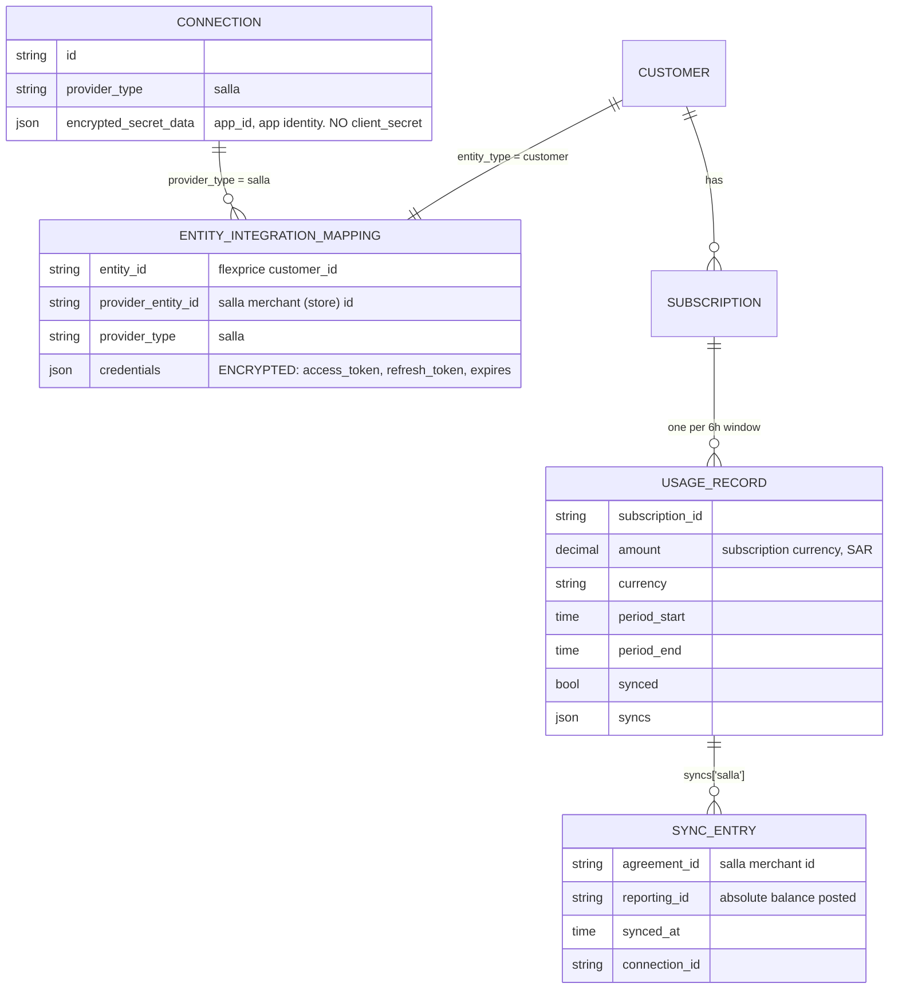
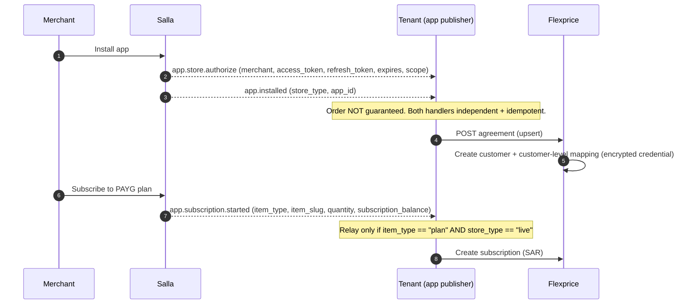
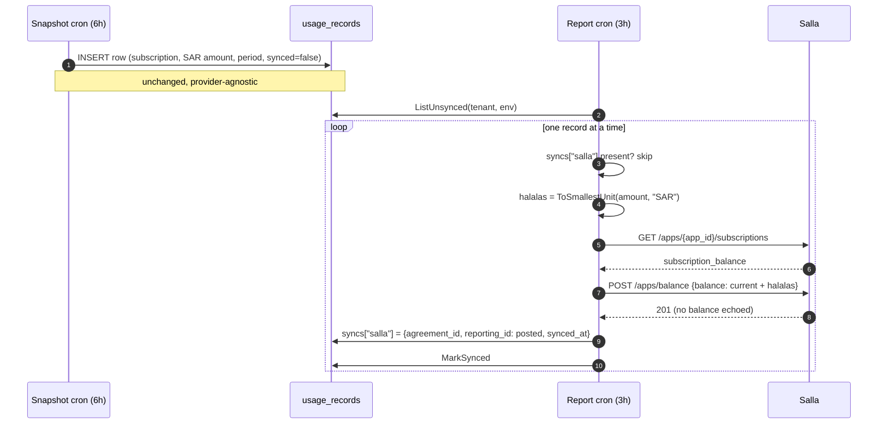

# MENA Marketplace Integration

**Author:** Tsage
**Status:** design, pending demo-store validation.
**Scope:** Salla only. Shopify and Zid are documented here for later.
**Ticket:** FLE-1292

---

## 1. Context

### What a MENA app marketplace is

Salla, Zid and Shopify are **e-commerce platforms**. A merchant runs a store on the platform. Third
parties publish **apps** into the platform's app store, and a merchant **installs** an app into their
store to use it.

The platform owns the merchant relationship and the payment rails. When a merchant subscribes to an
app, the platform bills the merchant and pays the app publisher out on a payout cycle. The app
publisher never touches the merchant's money.

This is the same arrangement as AWS / GCP / Azure Marketplace — the marketplace bills the end
customer on the seller's behalf — with one structural difference: the unit of integration is an
**installed app**, and credentials are issued **per (app, merchant) pair** at install time rather
than held once at the account level.

### Where Flexprice sits

Our tenant is the **app publisher**. Their merchants are our **customers**. Salla is the billing
destination. We meter the merchant's usage and report it to Salla so Salla bills the merchant.

### Salla specifics

Salla's pay-as-you-go product (`plan_type: on_demand`) is a **prepaid bucket**, not postpaid usage.
The merchant buys a quantity up front; the app publisher decrements it as usage occurs.
([subscription-details](https://docs.salla.dev/partner-apis/subscription-details))

Three properties follow, and they drive the whole design:


| Property                                                                | Consequence                                                                                                                                       |
| ----------------------------------------------------------------------- | ------------------------------------------------------------------------------------------------------------------------------------------------- |
| The reporting endpoint **sets** an absolute balance, it does not append | We must compute a total, not a delta                                                                                                              |
| PAYG publishes `plan_period`, `start_date`, `end_date` all **null**     | There is no billing period on Salla's side to align to                                                                                            |
| Salla tracks no usage itself                                            | We are the sole ledger. *"Salla doesn't track usage. Whatever the merchant has used or has left is your responsibility from this point forward."* |


**MVP constraint:** one Salla app per tenant. Hard restriction. Section 7 covers lifting it.

---


## 2. What the marketplace pipeline does today

Flexprice already reports usage to AWS, GCP and Azure Marketplace. Two Temporal schedules drive it.

**Snapshot cron — every 6 hours.** `MarketplaceUsageSnapshotWorkflow` computes a window anchored to
the run's scheduled time: 6 hours wide, ending 4 hours back, so ingestion has settled. For every
published marketplace connection it finds the mapped customers, then for each mapped subscription
calls `GetMeterUsageBySubscription` and `CalculateMeterUsageCharges` and writes one row to
`usage_records`.

The row is **provider-agnostic**. A unique index on
`(tenant_id, environment_id, subscription_id, period_start, period_end)` collapses every
marketplace's pass into the same single row, so a subscription mapped to two marketplaces produces
one row, not two.

**Report cron — every 3 hours.** `MarketplaceUsageReportWorkflow` lists unsynced rows per tenant,
authenticates each connection once, and reports each row to every marketplace its subscription holds
an agreement on. Outcomes land in the row's `syncs` JSONB map, **keyed by provider type**:

```json
{"azure_marketplace": {"skipped": true, "synced_at": "...", "skip_reason": "zero_amount_not_supported",
  "agreement_id": "wxef", "reporting_id": "", "connection_id": "conn_01KY..."}}
```

`synced` flips true once every relevant provider has an entry. A row that is never accepted stays
unsynced and is retried on the next run. There is no dead-letter state.

**Cancellation flush.** `MarketplaceSubscriptionFinalUsageFlushWorkflow` pushes final usage when a
subscription is cancelled, sharing the same `MarketplaceReporter` as the cron so the two cannot
drift.

Both crons and the flush iterate the same `marketplaceProviderTypes` slice, so a provider added there
is picked up in all three places.

---


## 3. Design


### 3.1 Entities




**Merchant identity lives on the customer mapping, not the subscription mapping.** With one app per
tenant, `(customer, salla)` resolves to exactly one merchant and one credential, so a
subscription-level mapping carries no information. Section 7 covers when that stops being true.

### 3.2 Schema changes

**One.** Encrypted credential storage on `entity_integration_mapping` — a new encrypted column, or a
separate credential table.

`metadata` is plain JSON ([ent/schema/entityintegrationmapping.go:56](../../ent/schema/entityintegrationmapping.go))
and is returned by `GET /v1/integrations/mappings` ([router.go:608](../../internal/api/router.go)), the
only route in that group with no RBAC wrapper. Merchant access tokens cannot go there.

The `secrets` table is closer in shape (per-value AES-GCM, has `expires_at`, permits N rows per
provider) but has **no** `Update` **method** on its repository
([internal/domain/secret/repository.go](../../internal/domain/secret/repository.go)), which blocks
token rotation outright. Rejected on that basis.

Nothing else changes. No new table, no column on `usage_records`, no new cron, no new workflow.

### 3.3 Onboarding flow

**Tenant-side prerequisites**, done once in the Salla Partners Portal:

- Publish the app. **Easy Mode is mandatory for published apps**; tokens arrive by webhook and the
tenant does not run an OAuth callback. ([authorization](https://docs.salla.dev/37396517e0.md))
- Create the PAYG plan. `plan_type: on_demand`, `on_demand_type` restricted to
`emails` **|** `messages` **|** `per-transaction`, max 4 PAYG plans per app. **The per-unit rate lives
in Salla's dashboard with no API**, so the rate exists in two places and the tenant's Flexprice
meter must map onto one of those three labels.
([subscription-details](https://docs.salla.dev/partner-apis/subscription-details))
- Supply `app_id` to Flexprice out of band — it is **absent from every webhook payload**.
([App Events](https://docs.salla.dev/421413m0))
- If the app's **trusted-IP whitelist** is enabled, add Flexprice's egress, or every Flexprice call is
rejected.




**The agreement call is an idempotent upsert, not create-only.** `app.store.authorize` re-fires on
every app update with new tokens — *"you are required to update the access token and refresh token in
your database"* ([authorization](https://docs.salla.dev/37396517e0.md)). Arrival order against
`app.installed` is not guaranteed.

Two relay filters the tenant applies:


| Filter                 | Rule                                                                                                                                                                                                     | Source                                                                                     |
| ---------------------- | -------------------------------------------------------------------------------------------------------------------------------------------------------------------------------------------------------- | ------------------------------------------------------------------------------------------ |
| `item_type == "plan"`  | Plan and addon subscriptions emit the **same event name**. Salla's own warning: *"Always check* `item_type` *before acting on any of these webhooks."*                                                   | [App Events](https://docs.salla.dev/421413m0), [add-ons](https://docs.salla.dev/2213496m0) |
| `store_type == "live"` | *"Skip billing logic when* `store_type !== "live"`*"* (development and demo stores). `store_type` **is absent from** `app.store.authorize` and must come from `app.installed` or the subscription event. | [App Events](https://docs.salla.dev/421413m0)                                              |


### 3.4 Reporting pipeline

**No new cron. No new workflow. No change to either schedule.** Salla is added to the
`marketplaceProviderTypes` slice
([snapshot_activities.go:20](../../internal/temporal/activities/marketplace/snapshot_activities.go)),
which is the single list all three entry points iterate — snapshot cron, report cron, and the
cancellation flush. Adding it there wires all three at once.


| Component                                        | Schedule  | Change for Salla                                      |
| ------------------------------------------------ | --------- | ----------------------------------------------------- |
| `MarketplaceUsageSnapshotWorkflow`               | every 6h  | **none** — writes the SAR row unchanged               |
| `MarketplaceUsageReportWorkflow`                 | every 3h  | new `reportSallaRecord` branch in the shared reporter |
| `MarketplaceSubscriptionFinalUsageFlushWorkflow` | on cancel | **none** — inherited                                  |


Cadence needs no adjustment: **Salla documents no rate limit on** `/apps/balance`, only the
platform-wide per-store limit ([rate-limiting](https://docs.salla.dev/rate-limiting)). The 3h report
cadence is well inside it.

Per unsynced record, inside the existing report loop:

1. Skip if `syncs["salla"]` is present.
2. `halalas = ToSmallestUnit(rec.Amount, "SAR")`.
3. `GET /apps/{app_id}/subscriptions` → read the merchant's current `subscription_balance`.
4. `new_balance = current + halalas`.
5. `POST /apps/balance {"balance": new_balance}`.
6. Write `syncs["salla"] = {agreement_id, reporting_id: new_balance, synced_at}`.
7. `MarkSynced`.

Step 3 is not optional. Salla's own guidance is to compute the value server-side and read it back,
the `201` echoes no balance, and reading before every write is what makes a merchant top-up land
without us needing to know about it.




`syncs["salla"]` **is the watermark.** Presence means this row is already in the balance, absence
means it is not. No new column, no new field.

**One record per call, never a batch.** Snapshot runs every 6h and report every 3h, so there is at
most one new record per subscription between runs — N=1 in steady state. Batching buys nothing and
costs correctness: `MarkSynced` is one call per record with no transaction, so a partial failure after
a batched POST leaves rows looking uncounted and the next run double-counts them. Under set semantics
that corrupts an absolute number. Per record, a failure leaves exactly one row uncounted, retried next
run.

**Store the posted absolute in** `reporting_id`**.** A set endpoint under read-modify-write is **not
idempotent**: if the POST succeeds and `MarkSynced` fails, the next run re-reads a balance that
already includes the amount and adds it again. Salla publishes no idempotency key on `/apps/balance` —
it is a set, so there is no natural one. Persisting the posted value lets a retry GET, compare, and
recognise the write already landed. Audit field, not a computation input.

### 3.5 Token ownership

**The tenant is the sole owner of token refresh. Flexprice never refreshes and never holds**
`client_secret` **for that purpose.** The tenant pushes the rotated token on every rotation through the
same idempotent upsert.

Salla refresh tokens are **single-use and rotating**. Reuse revokes the chain and **forces the merchant
to reinstall the app** — there is no API path back ([authorization](https://docs.salla.dev/37396517e0.md)).
The tenant's own app needs the same token for every other Salla call, so we cannot forbid them from
refreshing. Two refreshers on one chain guarantees the failure; one owner removes it by construction.

Cost: a tenant that stops pushing updates leaves us with a stale token and the balance write fails 401.
Visible and alertable. We log it and do not retry into a revocation.

This matches existing practice — **nothing in the codebase schedules a token refresh for any
integration today.** QuickBooks is reactive on error 3200, Zoho is lazy with a one-minute skew.

### 3.6 Lifecycle


| Event                                          | Action                                                                                             |
| ---------------------------------------------- | -------------------------------------------------------------------------------------------------- |
| `app.store.authorize`                          | Upsert customer mapping + credential                                                               |
| `app.subscription.started` (`item_type: plan`) | Tenant creates the Flexprice subscription                                                          |
| `app.subscription.canceled`                    | Tenant cancels in Flexprice. Flush pushes final usage                                              |
| `app.uninstalled`                              | Tenant cancels. `refunded: true` means pushed usage was not collected — surface as a revenue event |


**Nothing is reported during a trial.** The `app.trial.*` payload omits `item_type` entirely
([App Events](https://docs.salla.dev/421413m0)), so the section 3.3 relay filter rejects it and no
Flexprice subscription exists to snapshot. Reporting starts at `app.subscription.started`.

**We do not track whether the merchant paid, and do not need to.** Salla publishes no payment event
for partner app subscriptions — `app.subscription.started` carries no `status`, `payment_status` or
`paid_at` ([App Events](https://docs.salla.dev/421413m0)). It does not matter: we read Salla's balance
before every write, so a settlement or top-up is absorbed automatically. Collection is between Salla
and the merchant, and payout is between Salla and the tenant. Neither is in this pipeline.

### 3.7 Cancellation, uninstall, and the tenant's obligations

**The access token is scoped to the app, not the subscription.** A merchant cancelling one
subscription does not invalidate the token — their other subscriptions under the same app keep
working, and we keep using the same credential. Nothing in the credential path reacts to a
subscription event.

**The tenant must cancel the subscription in Flexprice when the merchant cancels it on Salla.** This
is a hard onboarding obligation, not a nicety. If they do not, the snapshot cron keeps producing rows
for a subscription that no longer exists on Salla and we keep pushing balance for it.

**No usage is lost when this happens.** `usage_records` is our source of truth and rows persist
independently of Salla's state:


| Situation                                              | Behaviour                                                                                                                                                                                                                  |
| ------------------------------------------------------ | -------------------------------------------------------------------------------------------------------------------------------------------------------------------------------------------------------------------------- |
| Merchant cancels one plan, tenant cancels in Flexprice | Flush workflow pushes final usage. Rows unsynced from before cancellation are still reported — the merchant's remaining balance covers them. Other subscriptions under the same merchant keep reporting on the same token. |
| Merchant uninstalls the app                            | Token is invalid. Pushes fail and are logged. **Rows stay in** `usage_records` **with** `synced=false`, so the exact unreported sum is recoverable on demand for collections or a revenue write-off.                       |


This is what makes the uninstall case a **reporting** failure rather than a **data-loss** failure, and
is why it is not carried as a blocking gap.

## 4. Open gaps and assumptions

Settled by demo-store testing, not by more documentation. Each is an assumption the MVP ships on.

### 4.1 Blocking — must be settled before the reporter is written


| #      | Gap                                                                                                                                                                                                                                                                                   | Assumption     | Impact if wrong                                                                                                                                                                                            |
| ------ | ------------------------------------------------------------------------------------------------------------------------------------------------------------------------------------------------------------------------------------------------------------------------------------- | -------------- | ---------------------------------------------------------------------------------------------------------------------------------------------------------------------------------------------------------- |
| **G1** | **Direction of** `balance`**.** Salla contradicts itself: `subscription-api.md` says *"usage balance the merchant **owes**"* (grows), `lifecycle-payloads.md:154` says *"**Remaining balance**"* (shrinks). `SKILL.md` is neutral. No worked example anywhere shows the value moving. | **Add** (owes) | Sign inverted. Every balance wrong.                                                                                                                                                                        |
| **G2** | **Set vs add.** `/apps/balance` appears in exactly one file of the corpus. Only 201 and 422 documented.                                                                                                                                                                               | **Set**        | If it appends, a cron pushing absolutes corrupts every balance in proportion to run frequency, silently, with a 201 every time. **The 201 body carries no balance**, so it is undetectable from the write. |
| **G3** | **Unit.** Total documentation is five words, "App Subscription Balance", integer, example 2399.                                                                                                                                                                                       | **Halalas**    | Off by 100x.                                                                                                                                                                                               |
| **G4** | **Read field ≠ write field.** Write is `POST /apps/balance` → `balance`. Read is `GET /apps/{app_id}/subscriptions` → `data[].subscription_balance`. Never documented as the same quantity.                                                                                           | Same quantity  | Read-modify-write reads the wrong number.                                                                                                                                                                  |


### 4.2 Non-blocking — understood, with a stated handling

**G5 — add-ons create a second subscription on Salla, but not on our side.**

Salla allows 1 plan + up to 5 add-ons per app, each a **separate subscription record with its own**
`subscription_balance` ([add-ons](https://docs.salla.dev/2213496m0)). So when a merchant buys an
add-on, Salla's `GET /apps/{app_id}/subscriptions` returns more than one element, and
`POST /apps/balance` carries no selector saying which one it targets. No published example shows a plan
and an add-on returned together, and the add-on example shows `subscription_balance: 0` rather than
`null`, so an add-on is a plausible write target.

**Handling — a tenant-side rule that sidesteps it entirely.** Add-on entitlements are modelled in
Flexprice as **charges on the merchant's existing subscription**, never as a second subscription. One
Flexprice subscription per merchant means one amount, one row, one push. What Salla does with its own
record count does not affect our arithmetic.

What is still open is only which Salla record receives the write — settled by T3. If it turns out to
be the add-on record rather than the plan record, the fix is in the write target, not in the usage
model.

**G6 — renewal does not apply to PAYG.** `plan_period`, `start_date` and `end_date` are all **null**
for `plan_type: on_demand` ([subscription-details](https://docs.salla.dev/partner-apis/subscription-details)).
There is no cycle to renew against and Salla does not auto-renew PAYG; a merchant re-purchases by
filling a payment form. **There is no renewal boundary for the balance to reset at, so the question
does not arise for the MVP.** It would only apply if a recurring (`plan_period: 1|12`) plan were ever
supported.

**G7 — PAYG top-up event is undocumented.** Which event a re-purchase emits is not stated anywhere.
Most likely a fresh `app.subscription.started` with a new `subscription_id`, but `renewed` is equally
plausible. **Not blocking:** read-then-add reads Salla's balance before every write, so a top-up is
absorbed whether or not we see the event. Confirmed by T5.

**G8 — post-uninstall behaviour.** `/apps/balance` documents **zero** error codes, not even
`app_not_installed`. **Not blocking:** rows persist unsynced and the unreported sum stays recoverable
(section 3.7). We need the status code only to log it accurately.

**G9 — reconciliation keying.** The GET response has **no** `subscription_id` **field** — its `id` is
documented as "Salla App ID" while the kit calls it a subscription identifier. Salla's own guidance:
*"Key your entitlement records on* `(merchant, item_slug)`*, never on* `subscription_id`*. The ID changes
every cycle."* Handling: key on `(merchant, item_slug)`.

**G10 — the rate limit is shared.** Plus 120/min, Pro 360/min, Special 720/min, leaky bucket, per
store, **shared with everything else the tenant's app does for that merchant**
([rate-limiting](https://docs.salla.dev/rate-limiting)). The store's plan is readable at runtime via
`GET /store/info`, so cadence can be sized per store if 429s appear.

**G11 — 7-day refund window.** A merchant may cancel and recover the fees within 7 days of subscribing,
refunded to their Salla wallet
([app refunds](https://salla.dev/blog/what-you-need-to-know-about-app-refund/)). The only trace is
`app.subscription.canceled` (no refund flag) or `app.uninstalled` with `refunded: true` — the single
refund indicator in the whole event set. Out of scope for MVP; surface `refunded: true` as a revenue
event.

**Written questions to** `partners@salla.sa` **for G1, G2 and G4.** These change the shape of the
integration, not just a constant.

## 5. Test coverage


### 5.1 Demo-store tests — blocking, run before writing reporter code


| Test                      | Method                                                                                                                                                                                                           | Settles |
| ------------------------- | ---------------------------------------------------------------------------------------------------------------------------------------------------------------------------------------------------------------- | ------- |
| **T1 Set vs add**         | Baseline read → `POST {"balance": 100}` → read → `POST {"balance": 37}` → read. Third read `37` = set, `137` = add.                                                                                              | G2      |
| **T2 Unit and direction** | Write a known value, then read **what the merchant dashboard renders**. The API echoes back whatever integer it stored regardless of unit or sign. The number gives the unit, the direction gives the semantics. | G1, G3  |
| **T3 Write target**       | Demo store holding **both** an on_demand plan and an addon. Push, then diff which array element moved.                                                                                                           | G4, G5  |
| **T4 Cancel + backlog**   | Leave a row unsynced, cancel the subscription, run the flush. The unreported amount must still reach Salla.                                                                                                      | 3.7     |
| **T5 Top-up**             | Purchase a PAYG plan twice. Capture which event fires and whether `subscription_id` changes.                                                                                                                     | G7      |
| **T6 Post-uninstall**     | Push after uninstall. Record the status code and body.                                                                                                                                                           | G8      |


### 5.2 Integration edge cases

- **Idempotent upsert.** `app.store.authorize` twice for the same merchant updates the credential, does not create a second customer.
- **Arrival order.** `app.subscription.started` before `app.store.authorize`; `app.installed` after `app.store.authorize`. Both must resolve.
- `item_type: addon` on a `started` event is not treated as a plan.
- `store_type != "live"` does not produce a Flexprice subscription.
- **Stale token** → 401 → error logged, row stays unsynced, no refresh attempted.
- **Zero-amount window.** Balance unchanged, row marked done, no spurious skip entry.
- **Multi-marketplace row.** A row with `syncs{aws}` and no `salla` key counts once; a row with `syncs{salla}` and no `aws` key is not re-counted.
- **Retry after partial failure.** POST succeeds, `MarkSynced` fails. Next run must detect via `reporting_id` and not double-add.
- **Non-SAR subscription** is rejected at the provider gate with a logged reason, not silently skipped into oblivion.
- **Cancellation flush** pushes the final balance exactly once.

---


## 6. Known issues

Defects in the existing marketplace pipeline found while designing this integration. The first
two block the Salla ship. The other two do not.

### EXISTING BUG 1 — the 24h submission window will silently drop Salla rows

`[internal/repository/ent/usagerecord.go:133](../../internal/repository/ent/usagerecord.go)`

```go
const submissionWindow = 24 * time.Hour
// ...
usagerecord.PeriodEndGTE(time.Now().UTC().Add(-submissionWindow)),
```

Justified in-comment as *"None of AWS, GCP or Azure take a report older than this."* **Salla has no
staleness rule** — under set semantics an old row is not stale, it is the current truth. A row that
ages past 24h is never fetched again, never marked, and **its usage is permanently lost**: we
undercharge that merchant forever, silently.

**Fix required before ship:** make the window per-provider and nullable. Nil for Salla.

### EXISTING BUG 2 — the report path picks up USD records only, so every SAR row is dropped

**Today the pipeline reports only USD records.** `isEligibleForReport`
([reporter.go:227](../../internal/temporal/activities/marketplace/reporter.go)) rejects anything else
before any provider code runs:

```go
const marketplaceReportingCurrency = "usd"          // reporter.go:25
if !types.IsMatchingCurrency(rec.Currency, marketplaceReportingCurrency) { return false }
```

It gates **both** entry points — the report cron
([report_activities.go:113](../../internal/temporal/activities/marketplace/report_activities.go)) and
the cancellation flush
([final_usage_flush_activities.go:178](../../internal/temporal/activities/marketplace/final_usage_flush_activities.go)).

**The row itself is fine.** `GetMeterUsageBySubscription` sets `response.Currency = sub.Currency`
([subscription.go:6638](../../internal/ee/service/subscription.go)) and the snapshot writes it
through unchanged, with the intent stated in-comment at
[snapshot_activities.go:247](../../internal/temporal/activities/marketplace/snapshot_activities.go):
*"any marketplace-mandated currency conversion happens per-marketplace at report time, not here."*
A SAR subscription already produces a SAR row. There is no USD constraint in the snapshot path at all.

So the failure is report-side only, and it is silent: a SAR row is skipped, gets no sync entry, stays
`synced=false`, and is then dropped for good by EXISTING BUG 1.

**Fix required before ship:** make the accepted currency a property of the provider rather than a
package constant. AWS GCP, and Azure keep USD, Salla takes SAR. A record whose currency does not match its
target marketplace is rejected with a logged reason — never silently skipped.

### EXISTING BUG 3 — per-window pricing is not tier-correct

`[internal/temporal/activities/marketplace/snapshot_activities.go:222](../../internal/temporal/activities/marketplace/snapshot_activities.go)`

```go
GetMeterUsageBySubscription(StartTime: PeriodStart, EndTime: PeriodEnd)
CalculateMeterUsageCharges(ctx, sub, usageResp, PeriodStart, PeriodEnd, ...)
```

Every 6-hour window is priced **standalone, from tier 1**. Under tiers, commitments or overage,
`sum(windows) != charge(cumulative)`.

Tier 1 = 1000u @ 0.10 then 0.05, usage 500u × 3 windows: sum of windows = **150**, correct cumulative
= **125**. Overcharge of 25.

**This affects AWS, GCP and Azure today and is not specific to Salla.** `usage_records.amount` is the
contract between the pipeline and every marketplace; the fix belongs in the snapshot activity, not in
any reporter. **Separate ticket.**

### EXISTING BUG 4 — stale schema comments

`[ent/schema/usagerecord.go](../../ent/schema/usagerecord.go)` and
`[internal/domain/usagerecord/model.go](../../internal/domain/usagerecord/model.go)` both state the
`syncs` map is *"keyed by connection_id"*. It is keyed by **provider type**
([reporter.go:153](../../internal/temporal/activities/marketplace/reporter.go)). `connection_id` is a
field inside the entry. Fix while touching this code.

## 7. Scalability and enhancements


### Multiple Salla apps per tenant

One connection per provider per environment is enforced today in
`[internal/ee/service/connection.go](../../internal/ee/service/connection.go)` (only `s3` and `gcs`
are exempt). To lift the MVP restriction:

1. `connection_id` column on `entity_integration_mapping`. Backfill is unambiguous today because
  exactly one published connection exists per `(tenant, env, provider)`. Backfill, then make it
   **required** — nullable leaves a null branch in every query permanently.
2. **The breaking change is the unique index, not the column.** Today
  `(tenant_id, environment_id, entity_type, entity_id, provider_type)` unique where published.
   Needed: the same plus `connection_id`. This changes behaviour for **every existing provider**.
3. New index `(tenant_id, environment_id, provider_type, connection_id, status)` or the grouping
  query becomes a scan.
4. **Subscription-level mapping becomes required** at that point, to say which app a subscription's
  usage belongs to.
5. Resolution moves off `GetByProvider` onto connection-id resolution **for the new providers only**.
  Leave the existing call sites alone — additive, not a refactor.

**The pattern already exists in-repo.** The S3/GCS export path has `connection_id` first-class on
`scheduled_tasks` with two indexes on it, resolves via `connectionRepo.Get(ctx, request.ConnectionID)`
and never calls `GetByProvider`, and
`[internal/integration/factory.go:1419](../../internal/integration/factory.go)` takes a `*connection.Connection`
rather than a provider type. It has exactly one user today. Multi-app Salla would be the second.

**Multi-app disambiguation is by webhook endpoint, not payload.** `app.store.authorize` carries **no**
`app_id`**, no** `app_name`**, no** `id` — that is the shape of the event, not a doc omission. There is no
app-identifying HTTP header either (only `x-salla-signature` and `X-Salla-Security-Strategy`). The
tenant must run **one webhook route per app** and tell Flexprice which app a relay belongs to.
**Flexprice cannot derive it.**

### Per-marketplace cadence

Salla has **no documented cadence limit** on `/apps/balance` — only the per-store rate limit applies,
so the shared 3h cron is fine.

**Zid is 2 writes per 30-day cycle** ([update-usage-based-charges](https://docs.zid.sa/update-usage-based-charges-13896680e0)).
A nullable submission window does nothing for that — a 3h cron would attempt ~240 writes against a
2-write budget. **Zid needs real cadence gating before it can share this cron at all.**

### Unpaginated mapping loads

The reporter loads all mappings for a provider with `NewNoLimitPublishedQueryFilter()`, unpaginated,
into in-memory maps. Fine for dozens of cloud agreements; 10k merchants × 3 apps is 30k rows per run.
Fix is the batching `ScheduleBillingActivity` already has (`maxWorkflowsPerCronRun`, default 500).

### Runtime currency conversion

MVP is SAR-only: a non-SAR subscription reporting to Salla is rejected with a logged reason.

Each marketplace accepts a fixed currency it does not let the seller choose — AWS and GCP require USD,
Salla bills in SAR. The usage record holds the subscription's native currency, so a
tenant whose merchants are billed in anything else needs conversion **at report time, at the rate
current for that report**, not at snapshot time.

That means an FX rate source, a stored rate and timestamp per push for auditability, and a decision on
what to do when the rate provider is unavailable — report stale, or leave the row unsynced. None of it
exists today. It is the one enhancement that gates onboarding a tenant with mixed-currency merchants.

---


## 8. References


### Salla


| Topic                                                                                                | Link                                                                                                                 |
| ---------------------------------------------------------------------------------------------------- | -------------------------------------------------------------------------------------------------------------------- |
| App Events catalogue (`app.store.authorize`, `app.subscription.*`, `app.uninstalled`)                | [https://docs.salla.dev/421413m0](https://docs.salla.dev/421413m0)                                                   |
| Subscription details, PAYG example, `subscription_balance`                                           | [https://docs.salla.dev/partner-apis/subscription-details](https://docs.salla.dev/partner-apis/subscription-details) |
| Authorization / Easy Mode, token rotation                                                            | [https://docs.salla.dev/37396517e0.md](https://docs.salla.dev/37396517e0.md)                                         |
| Add-on subscriptions                                                                                 | [https://docs.salla.dev/2213496m0](https://docs.salla.dev/2213496m0)                                                 |
| Rate limiting                                                                                        | [https://docs.salla.dev/rate-limiting](https://docs.salla.dev/rate-limiting)                                         |
| Recurring Payments — `charge.succeeded` / `charge.failed`, **merchant-to-shopper, not partner apps** | [https://docs.salla.dev/1650531m0](https://docs.salla.dev/1650531m0)                                                 |


### Endpoints

```http
POST https://api.salla.dev/admin/v2/apps/balance
Authorization: Bearer {merchant access_token}
{"balance": 2399}
→ 201 {"status":201,"success":true,"data":{"message":"تم تحديث رصيد المتجر بنجاح","code":201}}
```

```http
GET https://api.salla.dev/admin/v2/apps/{app_id}/subscriptions
→ data[].subscription_balance
```

Only `201` and `422` are documented on the write; a rejected value comes back under `fields.balance`.
No `429`, no `409`, and no idempotency key anywhere. Salla's own guidance is to compute the value
server-side and **read it back to confirm** — which is what makes the GET in section 3.4 load-bearing
rather than optional.

### Zid — future reference only


| Topic                                   | Link                                                                                                                   |
| --------------------------------------- | ---------------------------------------------------------------------------------------------------------------------- |
| Usage-based charges, 2 per 30-day cycle | [https://docs.zid.sa/update-usage-based-charges-13896680e0](https://docs.zid.sa/update-usage-based-charges-13896680e0) |


### Flexprice code


| Component                                     | Path                                                                                                                                                         |
| --------------------------------------------- | ------------------------------------------------------------------------------------------------------------------------------------------------------------ |
| Snapshot cron (6h)                            | `[internal/temporal/workflows/cron/marketplace_usage_snapshot_workflow.go](../../internal/temporal/workflows/cron/marketplace_usage_snapshot_workflow.go)`   |
| Report cron (3h)                              | `[internal/temporal/workflows/cron/marketplace_usage_report_workflow.go](../../internal/temporal/workflows/cron/marketplace_usage_report_workflow.go)`       |
| Snapshot activity, `marketplaceProviderTypes` | `[internal/temporal/activities/marketplace/snapshot_activities.go](../../internal/temporal/activities/marketplace/snapshot_activities.go)`                   |
| Report activity                               | `[internal/temporal/activities/marketplace/report_activities.go](../../internal/temporal/activities/marketplace/report_activities.go)`                       |
| Shared reporter (per-provider payloads)       | `[internal/temporal/activities/marketplace/reporter.go](../../internal/temporal/activities/marketplace/reporter.go)`                                         |
| Cancellation flush                            | `[internal/temporal/activities/marketplace/final_usage_flush_activities.go](../../internal/temporal/activities/marketplace/final_usage_flush_activities.go)` |
| `usage_records` schema                        | `[ent/schema/usagerecord.go](../../ent/schema/usagerecord.go)`                                                                                               |
| `UsageRecordSyncEntry`                        | `[internal/types/usagerecords.go](../../internal/types/usagerecords.go)`                                                                                     |
| Repository, submission window                 | `[internal/repository/ent/usagerecord.go](../../internal/repository/ent/usagerecord.go)`                                                                     |
| Entity mapping schema                         | `[ent/schema/entityintegrationmapping.go](../../ent/schema/entityintegrationmapping.go)`                                                                     |
| Single-connection enforcement                 | `[internal/ee/service/connection.go](../../internal/ee/service/connection.go)`                                                                               |


################################################################################################################################################################################################################################################################################################################################################################################################################################################################################################################################################################################################################################


# Shopify and Zid are documented here for later.

A tenant publishes an app to a marketplace, merchants install it, Flexprice meters those merchants
and reports usage so the marketplace bills the merchant.

## Shared model

```
Tenant
└── App                      -> one Flexprice CONNECTION per app. A tenant may have several.
    ├── Plans / meters       -> configured in the platform dashboard. No API on any platform.
    └── Installations, one per merchant store
        └── Merchant / Store -> the Flexprice CUSTOMER
            └── Subscription -> the Flexprice SUBSCRIPTION
```

Tenant contract is identical to AWS/GCP/Azure. Flexprice consumes no marketplace webhooks. The
tenant listens to their platform's webhooks and calls the Flexprice agreement API on activation and
the cancellation API on termination.

The store is the customer, not a person. On all three platforms the OAuth credential is scoped to
the (app, merchant) pair, so a merchant installing two of the tenant's apps holds two credentials.

None of the three usage endpoints accepts a platform subscription id.

| | Shopify (App Events) | Zid | Salla |
|---|---|---|---|
| Credential for the write | app-level, no merchant token | per merchant, two headers | per merchant |
| Payload | quantity | money | integer, unit unresolved |
| Who prices it | Shopify | Flexprice | unresolved |
| Semantics | append | append (inferred) | set (inferred) |
| Idempotency | required, permanent | none | none |
| Unit of work | subscription x meter | (app, merchant) | (app, merchant) |
| Write budget | 500/s per app | 2 per 30-day cycle | per-store rate limit only |
| Post-cancellation window | 24 hours | undocumented | undocumented |

---

# Shopify

## Approach

Use the **App Events API** under Shopify App Pricing. Do not use the legacy Billing API.

The legacy Billing API is not deprecated, has no sunset date, and remains selectable for new apps.
It is a separate future phase if a tenant needs it. Opting into App Pricing is a one-way door:
once opted in, an app cannot create new recurring charges through the Billing API.

Auth is app-level. No merchant token is ever held. The merchant is addressed by `shop_id` in the
request body.

We send a **quantity**. Shopify applies the tenant's tier math. Flexprice is a meter here, not the
rate engine.

Unit of work is **subscription x meter**. Events append and each carries its own idempotency key,
so no aggregation is needed.

## API

Token, refreshed hourly:
```http
POST https://api.shopify.com/auth/access_token
Content-Type: application/json

{"client_id": "...", "client_secret": "...", "grant_type": "client_credentials"}
```
```json
{"access_token": "f8563253df0bf277ec9ac6f649fc3f17", "scope": "write_global_api_app_events", "expires_in": 3599}
```

Usage event, one per request, batching not supported:
```http
POST https://api.shopify.com/app/2026-07/events
Authorization: Bearer {access_token}
Content-Type: application/json

{
  "shop_id": "gid://shopify/Shop/23423423",
  "event_handle": "sms_sent",
  "timestamp": "2026-01-27T14:30:00Z",
  "idempotency_key": "evt_55667788",
  "attributes": {"value": 1}
}
```
```
202 Accepted
{"success": true}
```

| Field | Type | Required | Notes |
|---|---|---|---|
| `shop_id` | string | yes | GID or bare numeric as a string |
| `event_handle` | string | yes | must match the meter handle exactly, case-sensitive |
| `timestamp` | string | yes | ISO 8601. Must fall inside the current billing cycle. Max 5 min in the future |
| `idempotency_key` | string | yes | max 64 chars. **Permanent** for billing events. Use the Flexprice usage_record id |
| `attributes.value` | number or quoted string | yes | non-zero. `-1` reverses. Fractions must be quoted, `"1.5"` |

Errors: 400 bad params, 401 bad token, 403 app not installed on that shop, 409 same key in flight,
429 rate limit. **202 does not mean billed.** Async rejections (`PERIOD_CLOSED`, `NO_SUBSCRIPTION`,
`SUBSCRIPTION_NOT_METERED`, `IDEMPOTENCY_KEY_ERROR`, `INVALID_VALUE`, `MISSING_VALUE_KEY`,
`INVALID_ACCOUNT`, `ACCOUNT_FROZEN`) appear only in a 30-day Dev Dashboard log with no API.

Limits: 500 req/s per app. 5 meters per plan, 6 tiers per meter. Usage billed monthly only. Usage
caps not supported. 24 hours after uninstall to submit remaining events.

## Entity mapping

| entity_type | entity_id | provider_entity_id | metadata |
|---|---|---|---|
| `customer` | Flexprice customer id | `shop_id` | `myshopify_domain` |
| `subscription` | Flexprice subscription id | connection id (which app) | none |
| `meter` / feature | Flexprice meter id | `event_handle` | none |

No platform subscription id is mapped. Credentials live on the connection, not per merchant.
Store `myshopify_domain` alongside `shop_id`, because Shopify guarantees permanence for the domain
and not for the numeric id.

## Docs

- [App Events API reference](https://shopify.dev/docs/api/app-events) - auth, body fields, HTTP errors, 202 semantics, rate limit, batching
- [Build a billing event](https://shopify.dev/docs/apps/launch/billing/shopify-app-pricing/subscription-billing/build-billing-event) - async error taxonomy, value semantics
- [Set up usage charges](https://shopify.dev/docs/apps/launch/billing/shopify-app-pricing/subscription-billing/setup-usage-charges) - meter limits, idempotency permanence, 24h post-uninstall window
- [Shopify App Pricing](https://shopify.dev/docs/apps/launch/billing/shopify-app-pricing) - plans, one-way door
- [Billing overview](https://shopify.dev/docs/apps/launch/billing) - which method to use, legacy status
- [Manual pricing (legacy)](https://shopify.dev/docs/apps/launch/billing/manual-pricing) - the Billing API path
- [Partner API](https://shopify.dev/docs/api/partner) - reconciliation, org-level token, 4 req/s
- [Access tokens](https://shopify.dev/docs/apps/build/authentication-authorization/access-tokens) - "one current expiring offline token per app and store"

## Open

- API version segment: reference says `2026-07`, three guides say `unstable`.
- Does a 202-then-async-rejected event burn its idempotency key permanently? Formally asked on Shopify's forum 2026-09-03, unanswered. Determines the retry design.
- Merchant on plan A, `event_handle` only on plan B. Likely silently non-billable. Silent revenue loss.
- Can the App Billing Event log be exported or its 30-day retention extended? Scraping is prohibited.

---

# Zid

## Approach

Write with `POST /v1/managers/market/apps/plans/subscription-charge`. Read with
`GET /v1/market/app/subscription`.

**Read-then-diff before every write.** GET the subscription, sum `charges[]`, compute
`delta = cumulative_target - sum(charges)`, POST the delta. This is the core decision. Zid appends,
has no idempotency key, no void endpoint, and no charge list filtered by a client reference.
Read-then-diff makes a non-idempotent API idempotent: if a previous POST succeeded but the response
was lost, the next GET reveals it and the delta collapses to zero.

Auth is two headers, both per-merchant. The OAuth response field named `access_token` goes in
`X-Manager-Token`, and the separate field named `Authorization` goes in the `Authorization` header.
This is inverted from normal OAuth and is the most likely integration bug.

The token pair is scoped to (app, store). Proven: the example JWT in Zid's own endpoint doc decodes
to `{"aud":"117","sub":"182475"}`, a Laravel Passport token where `aud` is the OAuth client and
`sub` is the resource owner. This disproves the endpoint doc's own boilerplate claim that the
Authorization token carries no store information.

Unit of work is **(app, merchant)**, not the subscription. Several Flexprice subscriptions under one
merchant share one credential and must be summed before the write.

## API

```http
POST https://api.zid.sa/v1/managers/market/apps/plans/subscription-charge
X-Manager-Token: {access_token}
Authorization: Bearer {Authorization token}
Content-Type: application/json
Accept: application/json

{
  "amount": 34500,
  "description": {"ar": "الوصف بالعربي", "en": "Usage charge"}
}
```
```json
{
  "status": "success",
  "charge": "",
  "id": "9eaac8b0-3530-4bdb-b2fb-34b4efe22179",
  "message": {"type": "success", "description": "Subscription charge was updated successfully"}
}
```

| Field | Type | Required |
|---|---|---|
| `amount` | integer | yes. Unit NOT DOCUMENTED. Halalas by inference |
| `description.ar` | string | yes |
| `description.en` | string | yes |

Only 200, 401 and 500 are documented. No 4xx for exceeding the cap.

Read back:
```http
GET https://api.zid.sa/v1/market/app/subscription
X-Manager-Token: {access_token}
Authorization: Bearer {Authorization token}
```
Returns `subscription.is_usage_based` (1 or 0, gates whether you may charge at all),
`pending_charges`, `settled_charges`, and `charges[]` with `id`, `amount`,
`amount_details{amount, currency, formatted}`, `status`, `created_at`. No filters, no pagination.

Limits: **2 writes per 30-day billing cycle.** 60 req/min per app per store. Tokens and refresh
tokens both expire in 1 year.

## Entity mapping

| entity_type | entity_id | provider_entity_id | metadata |
|---|---|---|---|
| `customer` | Flexprice customer id | `store_id` | `store_uuid`, `store_url` |
| `subscription` | Flexprice subscription id | `store_id` | encrypted `X-Manager-Token`, `Authorization` token, `refresh_token`, `expires_at`, `app_id` |

Merchant credentials hang off the subscription mapping. The token pair already encodes (app, store),
so no separate app dimension is needed on the mapping. The connection holds `client_id` and
`client_secret` solely to drive refresh.

## Docs

- [Update Usage-Based Charges](https://docs.zid.sa/update-usage-based-charges-13896680e0) - the write, the 2-per-30-day cap
- [Subscription Details](https://docs.zid.sa/subscription-details-13896876e0) - the read, `charges[]`, `is_usage_based`
- [Authorization / OAuth](https://docs.zid.sa/authorization) - token model, the field-to-header inversion, 1-year lifetimes, token invalidation on uninstall
- [App events / webhooks](https://docs.zid.sa/events-878234m0) - the 12 `app.market.*` events, all sharing one flat payload
- [Rate limiting](https://docs.zid.sa/rate-limiting-644369m0) - 60 req/min per app per store
- [Public app management](https://help-partner.zid.sa/en/articles/8718248-public-app-management) - lifecycle states, T-3 warning, T+5 grace
- [Partner payouts](https://help-partner.zid.sa/en/articles/8750100-for-subscription-app-partners) - 6th of the month
- [ZidPay execute payment](https://docs.zid.sa/execute-payment-request-17112105e0) - "For SAR, amount is provided in Halala (1 SAR = 100 Halalas)"

## Open

- **Append vs set.** No doc says append. Prose says set. Inferred from the POST returning an `id` whose example UUID is byte-identical to the GET's `charges[].id` example, plus per-row `created_at` and `status`. Build for append: assuming set when the truth is append double-bills irreversibly with no void endpoint, assuming append when the truth is set only under-bills recoverably.
- **`amount` unit.** Halalas by inference from ZidPay's explicit statement. The POST's own description states no unit. A 100x error is a 100x billing error.
- **Flush window.** Uninstall invalidates tokens immediately. Whether the token survives the T to T+5 SUSPEND grace is undocumented. Design for the pessimistic case: flush on the `subscription.warning` webhook at T-3, and never spend both cycle writes before that can fire.
- What the third call in a cycle returns.
