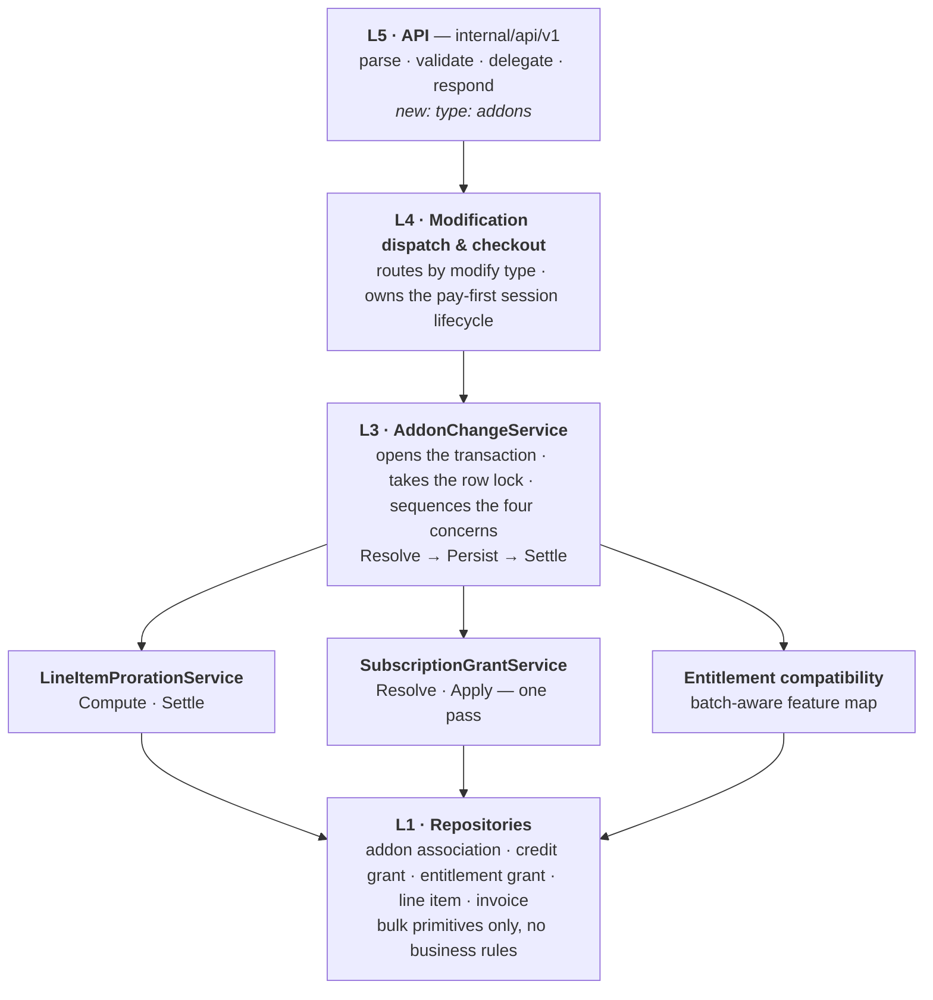
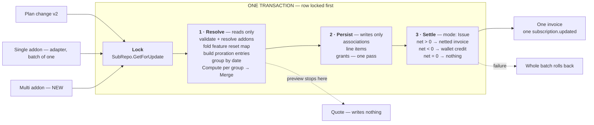
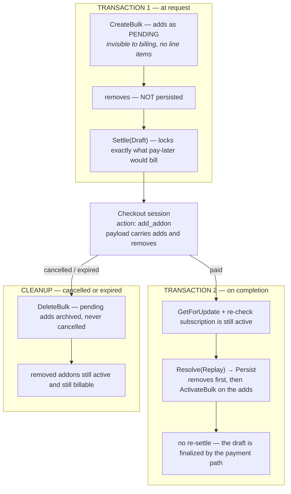

# Multi-Addon Add/Remove with Checkout — ERD

## 1. The problem

### 1.1 The ask

Today a caller changes exactly one addon per request: `POST /subscriptions/{id}/modify/execute` with
`type: "addon"` and `addon_params.action` of `add` or `remove`.

Swapping addon A for addon B means two calls, two transactions, two invoices, two webhooks — and the
entitlement compatibility check on the `add` cannot see that A is leaving, so a legitimate swap is
rejected outright.

We want **one** request that adds and removes several addons atomically, settles as **one** netted
invoice (or one wallet credit), previews as one quote, and supports pay-first checkout.

### 1.2 Why looping the existing path does not work

It is not merely slow — it is incorrect, in two independent ways.

| Failure                     | Mechanism                                                                                                                                                                                                                                                                               |
| --------------------------- | --------------------------------------------------------------------------------------------------------------------------------------------------------------------------------------------------------------------------------------------------------------------------------------- |
| Grant windows get clobbered | `persistAddonAttach` runs a full close/open pass over entitlement grant windows, closing **every live window of every feature the change touches**. Two addons touching the same feature ⇒ the second pass closes the successor the first just opened, cutting spurious grant segments. |
| Settlement does not net     | The old `Apply` raised a charge invoice for the full charge **and** a separate wallet credit for the full credit. A swap that nets to zero charged the customer in full *and* credited them in full.                                                                                    |

### 1.3 The actual problem — three flows, N implementations

Three flows mutate a subscription: **plan change v2**, **addon attach/detach**, and **quantity
change**. All three re-implement the same concerns. That duplication is why the two bugs above live
in one path and not the others, and why fixing one never fixes the rest.

| Concern           | Before                                                                                             | After                          |
| ----------------- | -------------------------------------------------------------------------------------------------- | ------------------------------ |
| Settlement        | 4 — `Apply`, `previewAddonSettlement`, `settlePlanChange`, `createAggregatedProrationDraftInvoice` | 1 — `Settle`, mode-switched    |
| Proration entries | 3 — `prorationEntries`, `buildAddonProrationEntries`, `quantityChangeProration`                    | 1, plus one deferred cleanup   |
| Addon removal     | 2 — `applyDroppedAddons`, `persistAddonDetach`                                                     | 1 — `PersistAddonRemovals`     |
| Grant handling    | 2 — raw loop (plan change), materialise + removed-ECs (addon)                                      | 1 — `SubscriptionGrantService` |

### 1.4 The acceptance criterion

After this lands, single addon add/remove, the new addon batch, and plan change v2 must go through
**the same function** for every entity they govern. Not "similar code". Anything left duplicated is a
place where the three drift again the next time someone edits one of them.

---

## 2. The design

Five layers, each with one job. The rule that makes the whole thing hold: every shared service splits
**resolve (pure, reads only)** from **apply (writes only)**, so the orchestrator can interleave four
concerns inside one transaction and checkout can defer the write half until payment lands.

Calls flow **downward only**. L3 is the only layer that opens a transaction or takes the subscription
row lock; everything at L2 assumes one is already open. That single rule is what lets four concerns
commit atomically instead of as four nested transactions.

### 2.1 The shared spine — all three entry points

- The lock comes **first**, before any read the writes depend on.
- Settlement moves **inside** the transaction, so a failed invoice rolls the batch back rather than
leaving it persisted and unbilled.
- Preview runs the identical `Resolve` and stops before `Persist`, which is why a quote cannot
describe a different outcome than execute.

What each entry point adds on top of the spine:

| Entry point    | Adds                                                                                   |
| -------------- | -------------------------------------------------------------------------------------- |
| Plan change v2 | the plan swap · credit-grant migration · dropped addons through `PersistAddonRemovals` |
| Single addon   | one add **or** one remove — a batch of one                                             |
| Multi addon    | N adds and M removes, each with its own effective date                                 |

### 2.2 Per-entry dates, one document

Entries are grouped by effective date, `Compute` runs once per group, the summaries `Merge`, and the
merged net settles **once**. `periodStart` on the document is the minimum effective date across the
batch; `periodEnd` is `sub.CurrentPeriodEnd`. The invoice window must be passed in, not derived — a
batch has no single effective date, and the window drives coupon applicability.

Defaults keep each side's current behaviour: an omitted date means **now** for an add and **current
period end** for a remove. A remove at period end contributes **zero** credit, so the default batch is
"adds charge now, removes lapse at period end". An explicit mid-period date on a remove makes its
credit net against the adds. Both are correct; document it in the API reference.

### 2.3 Pay-first checkout — where the order changes

One thing genuinely differs when the customer must pay before the change takes effect: the adds are
persisted as **pending** and the removes are **not persisted at all**. A remove applied now would end
line items before payment, and cancelling the checkout would strand the customer on the cheaper state.

The only state committed ahead of the provider call is inert — pending associations are invisible to
billing and the draft invoice is not finalized — so archiving both is a complete rollback. A zero or
negative net has nothing to collect, so checkout is ignored and the batch applies immediately.

### 2.4 Entitlement grants across a change

A grant is a time-boxed quota window on a feature. Usage is **recomputed** over the window on every
evaluator pass — never decremented as a ledger — which is what makes the whole path idempotent under
late, duplicate and reprocessed events.

The policy, settled: **a removal never withdraws quota that was already granted.** A departed config
simply stops funding the next cycle, exactly as an already-applied credit grant is never clawed back.

That is not the same as "a removal leaves grants alone". A window is keyed to the config that owns
its slot, so when that config leaves the slot must move, or the evaluator reads it as empty and opens
a **second** window beside the one still running. Four rules follow, and together they are the design:

| Rule | Why |
| --- | --- |
| A removal re-keys the pooled window onto a surviving config, carrying the remaining balance | the slot must stay owned by something live |
| A spent pool still re-keys — the successor opens at **zero quota, already crossed** | it hands nothing forward but must still hold the slot; every further unit bills |
| A window whose last config left is left to run out | no live config to re-key onto, and nothing will open beside it |
| A window already in overage is never replaced by a later change | it carries state no evaluator pass wrote; replacing it would hand its overage a fresh quota |

Billing follows **window geometry, not config identity**. Disjoint windows partition the event
stream, so their overages sum. Overlapping windows — independent configs metering the same events —
are measured once over the merged overage window, so a unit cannot bill twice. Config count says
nothing about either: a re-keyed pool names two configs across windows that tile in sequence.

A grant also outlives the config that funded it, so billing resolves a window's feature directly
rather than through the subscription's live entitlements. Otherwise the evaluator keeps maintaining a
window — and firing its exhaustion webhook — while billing silently ignores it and charges in full.

---

## 3. Follow up

### 3.1 Removal correctness — closed

Two failures shared one shape — **a removal is targeted by identity, while contribution is counted
per instance**, so removing one instance took the others with it. A third was independent: the
outcome of a removal depended on whether the evaluator had measured the window yet. All three are
closed by the settled policy in §2.4.

| Was | Now |
| --- | --- |
| Removing one of several instances of an addon deleted the feature's window | the window survives; every instance's granted quota stays |
| Removing one config from a pooled window left the quota unchanged | the balance carries and the slot re-keys off the removed config |
| A future-dated removal dropped the quota immediately, and the result differed by whether the evaluator had run | a removal never shortens a window; measurement no longer changes the answer |

The attach side — own-date windows, pooling maths, backdate flooring, several distinct dates in one
request, per-feature independence — was correct throughout and still is. Period-end changes leave the
current cycle untouched.

The same identity-versus-instance shape is **still open on credit grants**: removing one instance
cancels the survivor's future applications, because they are cancelled by addon id, which duplicate
instances share. Fixing it needs an association reference on the credit grant, stamped when the
template is cloned and filtered on at cancellation — a schema change, hence deferred.

### 3.2 Quota accounting — two open defects, one fix

Both are the same missing fact: **the pooled window stores a summed quota, not what each config
contributed.**

- **A future-dated change fixes the successor's balance at change time** while the predecessor keeps
  running until the effective date. Usage in between is spent against the predecessor *and* still
  counted as carried forward, over-granting by that amount. Immediate changes cannot hit this because
  the two instants coincide.
- **An attach/detach round trip mints quota.** The attach adds a prorated contribution; the detach
  cannot subtract it, because nothing records which config contributed what. Repeat the cycle and the
  allowance grows without the customer ever paying for it.

Recording each config's contribution on the window closes both: the successor's quota becomes
derivable at any instant instead of snapshotted, and a detach subtracts exactly what its attach
added. It is also the precondition for making the retain-vs-reclaim question configurable — the
natural rule being to follow the money, reclaiming a prorated contribution exactly when the removal
refunds it.

### 3.3 Direction — separate the funding fact from the window

One row plays three roles today: the funding fact, the measurement window, and the slot token. Every
defect above is a collision between two of them. The credit-grant stack avoids this by separating the
funding rule from its per-period instance; a grant needs the same split — per-config contributions as
rows, with usage allocated across them at read time.

That dissolves pooling, slot ownership and its tie-break, carry-forward arithmetic, and the
window-geometry test in billing. It must **not** adopt the wallet layer: usage is recomputed from the
event stream rather than debited, and that property is load-bearing.

Direction, not a scheduled rewrite. The forcing function is cross-meter grant scopes, which already
need an invoice-level allocation pass — building it once and folding pooling in costs less than
building it alongside.

### 3.4 Convergence and cleanups

Still open against plan change: dropped-addon grant windows are left open, the first period's credit
grants are not prorated, grant closing bypasses the grant service, and no successor windows are
opened. Each sequences behind the addon work with regression tests written first.

Independent behaviour changes: subscription cancel marks never-activated pending associations
`cancelled` rather than archiving them; quantity-change pay-later raises one document per line item;
and subscription cancel still credits the wallet outside `Settle`.

Cleanups: move the addon attach/detach param builders onto the change service; drop quantity change's
dead post-compute draft re-fetch; regenerate the API spec so the batch type and the new change-result
entity type reach the SDKs.

### 3.5 Test coverage gap

The dated-grant matrix asserts windows, quota and slot ownership across every attach and remove
shape, but **no scenario in it ingests a usage event or raises an invoice**. The §2.4 rules that
govern money were verified at service level instead, and both billing defects §2.4 settles were
silent under a fully green matrix. Closing that gap means one scenario that crosses a quota and
asserts the resulting invoice.
