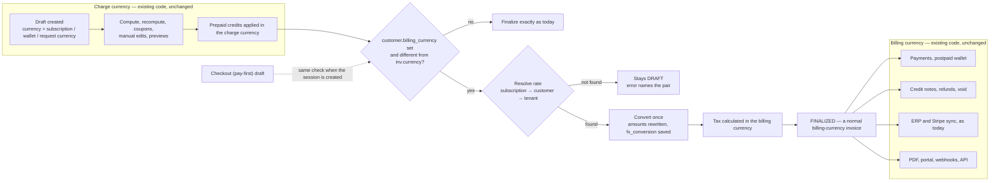
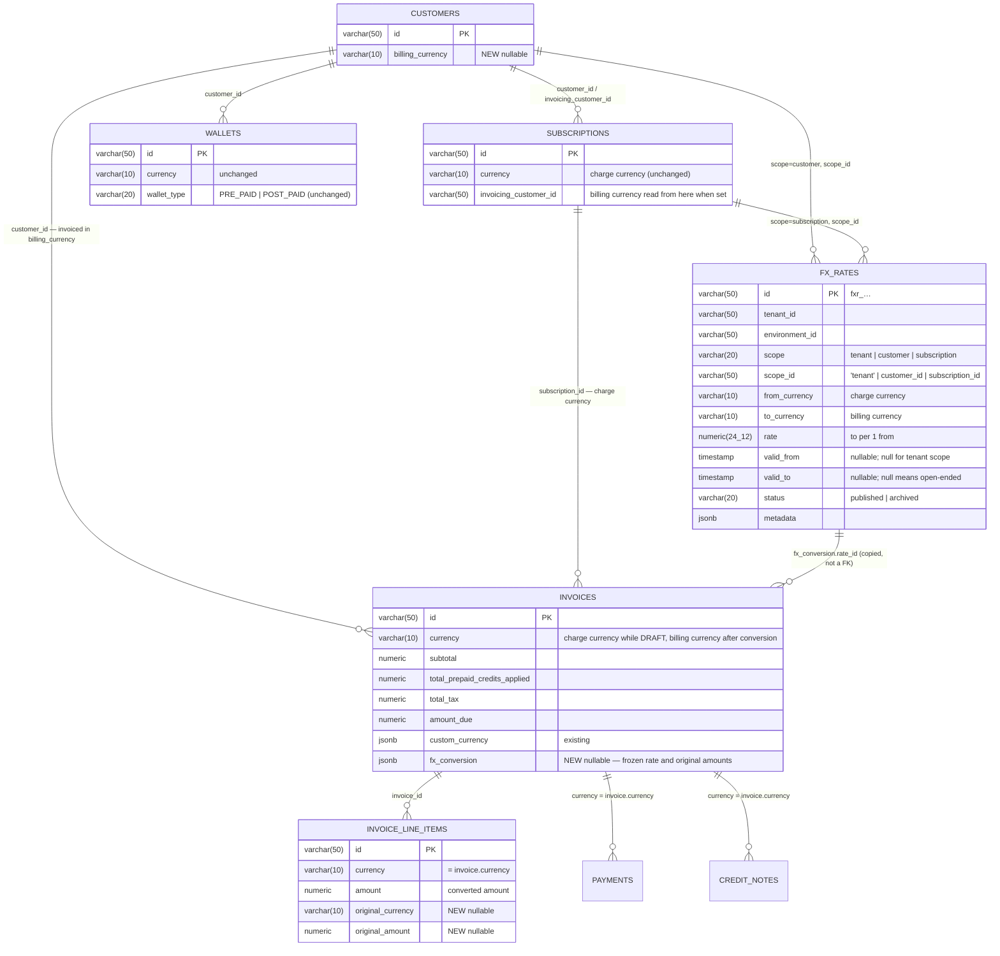
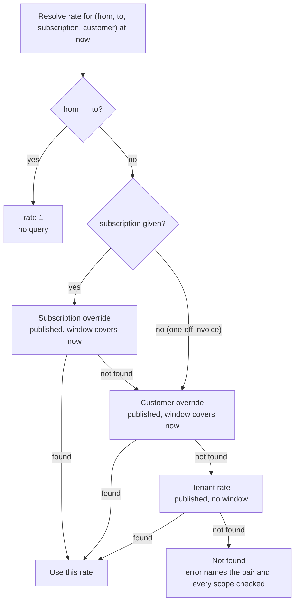
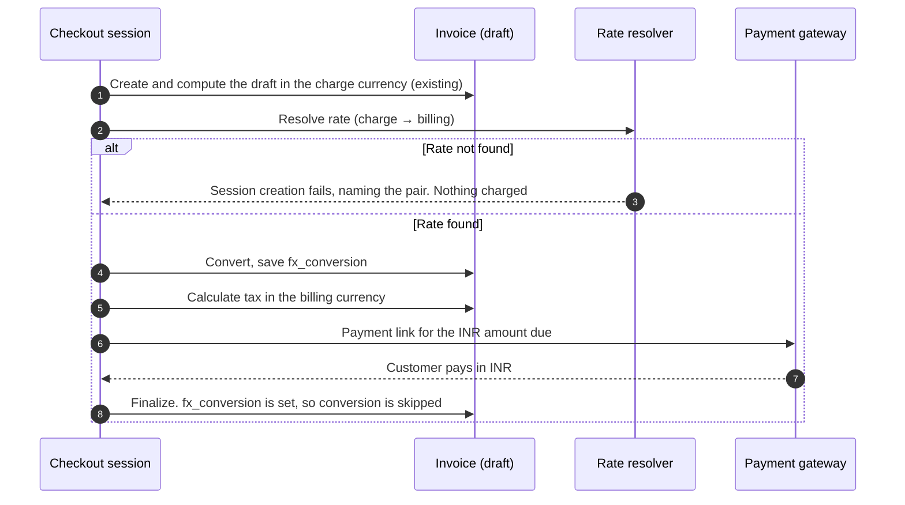
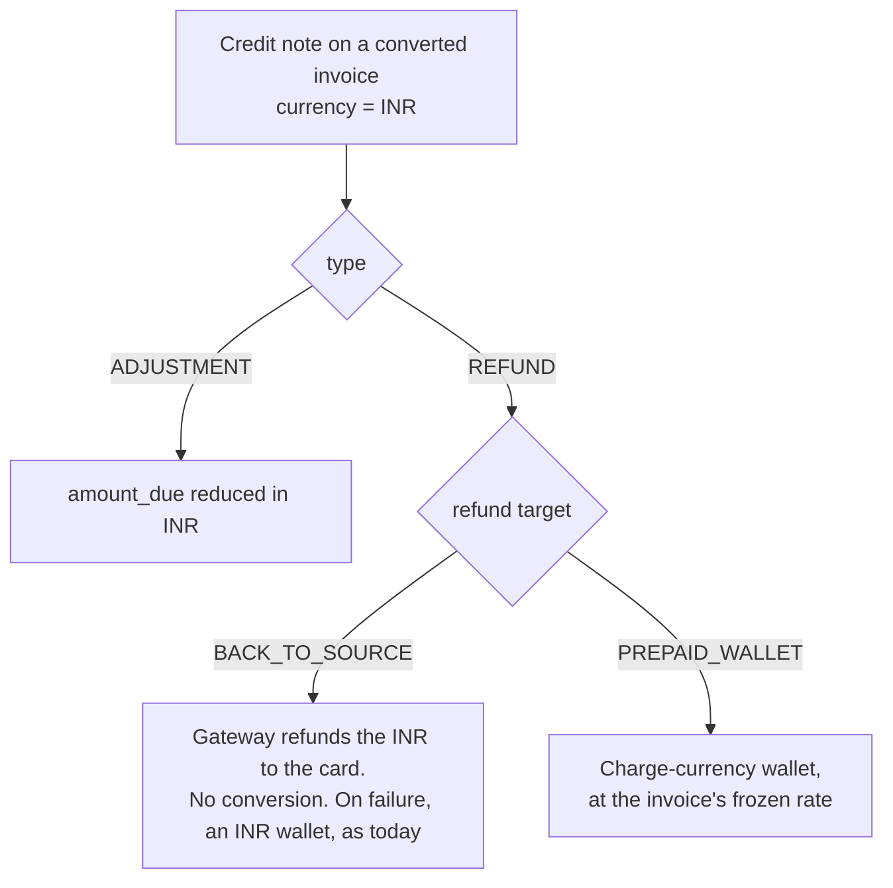
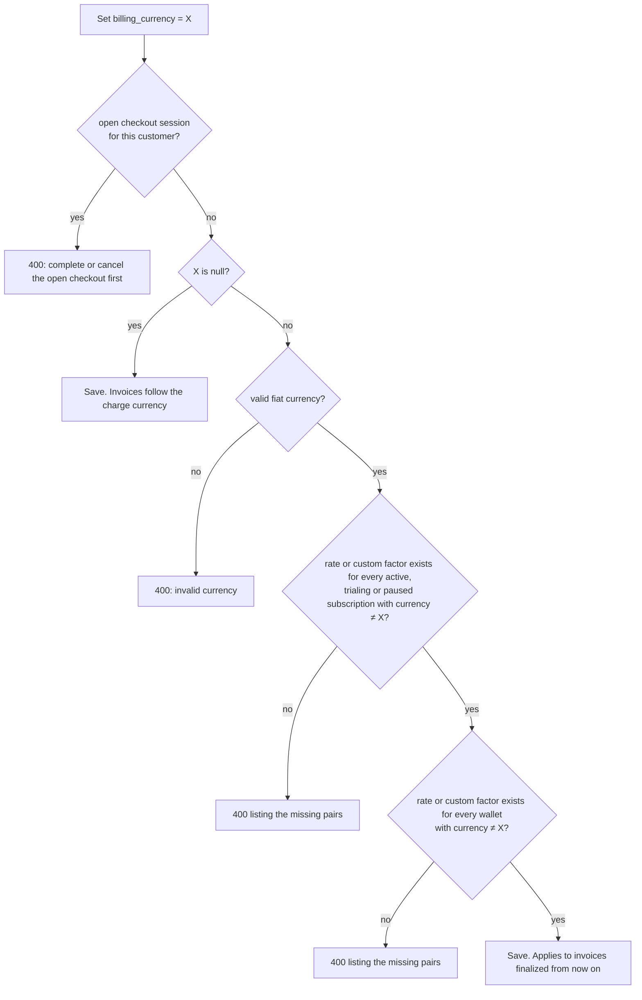
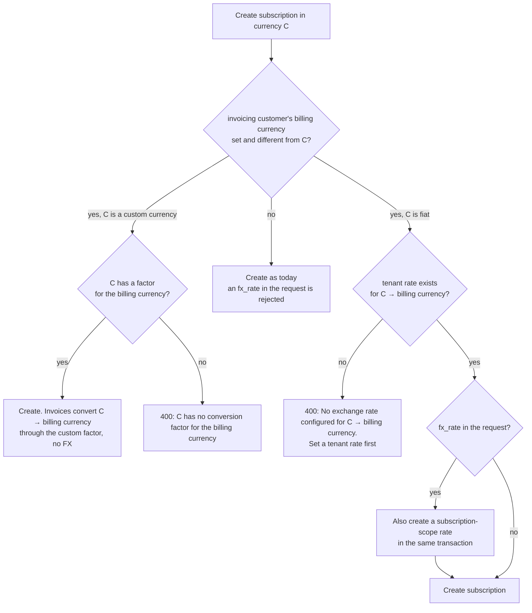

# Adaptive Multi-Currency — Billing Currency and FX Conversion — Design ERD

Status: **Proposed**
Date: 2026-09-26 · Revised 2026-09-29
Author: Paras Aghija
Ticket: FLE-1383
PRD: [`docs/prds/adaptive-multi-currency-prd.md`](../prds/adaptive-multi-currency-prd.md)
Related: [Tenant custom currency](2026-08-27-FLE-1201-tenant-custom-currency.md), [Refund architecture](2026-08-28-refund-architecture-erd.md)

---

## 1. Overview

### 1.1 Problem

Today an invoice is issued in whatever currency the subscription is priced in. A customer with a USD
subscription and an EUR subscription gets invoices in two currencies. To bill an Indian customer in
INR, a tenant has to rebuild the plan with INR prices and keep both price lists in sync by hand.

### 1.2 Goal

A customer can have a **billing currency**. Every invoice for that customer is issued in it. A
subscription keeps its own **charge currency**, and its invoice is built in that currency exactly as
today. At finalization, if the two differ, the invoice is converted once at a rate the tenant
configured. The rate is saved on the invoice and never changes after that.

### 1.3 Non-goals

- Live market rates.
- Deriving `inr → usd` from a `usd → inr` rate. The one exception is a void refund, which reverses its own invoice at that invoice's frozen rate (§6.3).
- A Flexprice payment record in a currency other than its invoice's (gateway-level presentment currency is fine).
- Changing a finalized invoice.
- Changing a subscription's currency.

**Integrations are unchanged.** The invoice is issued in the billing currency and the customer syncs
to the ERP in that same currency, so Zoho, QuickBooks and Stripe sync as today. No FX rate is sent.

### 1.4 Terms

| Term | Meaning |
| --- | --- |
| Charge currency | The currency a plan, price or subscription is priced in. Unchanged by this design |
| Billing currency | The currency a customer is invoiced in. New, optional, set only by API or UI |
| FX rate | A fixed rate the tenant configures. `to = from × rate`. `usd → inr` at 83 means $1 = ₹83 |
| Converted invoice | An invoice whose draft was in the charge currency and was converted to the billing currency at finalization |
| Frozen rate | The rate saved on a converted invoice. Never changes, whatever happens to `fx_rates` later |

### 1.5 Existing customers are not affected

| Customer | Result | FX code that runs |
| --- | --- | --- |
| No billing currency. This is every customer today | Same as today | None. Finalize reads the customer, finds no billing currency and continues on the existing path |
| Billing currency equals the subscription currency | Same as today | None. Same read, the currencies match |
| Billing currency differs from the subscription currency | Invoice converted at finalization | Rate lookup and conversion |

Conversion starts only when someone sets a billing currency that differs from the charge currency.
The implementation must include a test showing that, for these customers, finalize issues no
`fx_rates` query and produces an invoice identical to today's.

---

## 2. Solution at a glance

The draft stays in the charge currency. Finalization converts it once. Everything before the
conversion and everything after it is existing code.



**Worked example.** Acme is billed in INR and subscribes to a USD plan. The tenant rate for
`usd → inr` is 83. Acme has a $20 prepaid USD wallet. GST is 18%.

| Stage | Currency | Subtotal | Prepaid credits | Net | Tax | Total |
| --- | --- | --- | --- | --- | --- | --- |
| Draft | USD | $100.00 | $20.00 | $80.00 | — | — |
| After conversion at 83 | INR | ₹8,300.00 | ₹1,660.00 | ₹6,640.00 | — | — |
| Finalized | INR | ₹8,300.00 | ₹1,660.00 | ₹6,640.00 | ₹1,494.00 | ₹8,134.00 |

- The USD wallet is debited $20 in USD. It is never converted.
- The invoice saves `fx_conversion`: charge `usd`, billing `inr`, rate 83, source net $80.
- Each line keeps its original USD amount next to the converted INR amount.
- Tax is 18% of ₹8,300. As today, tax is calculated on the subtotal less discounts, before prepaid credits.
- Acme pays ₹8,134.00. The INR invoice syncs to the ERP as today.

---

## 3. Data model

### 3.1 ERD



### 3.2 Schema changes

| Table | Change | Why |
| --- | --- | --- |
| `customers` | Add `billing_currency`, nullable | The currency the customer is invoiced in. NULL keeps today's behaviour |
| `fx_rates` | New table | Rates the tenant configures, at tenant, customer or subscription scope |
| `invoices` | Add `fx_conversion`, nullable jsonb | The frozen rate and the original amounts. NULL means never converted |
| `invoice_line_items` | Add `original_currency`, `original_amount`, nullable | Each line's pre-conversion amount, shown exactly on the PDF and API |

Wallets and wallet transactions are not changed. No backfill anywhere.

### 3.3 `customers.billing_currency`

| Column | Type | Default | Notes |
| --- | --- | --- | --- |
| `billing_currency` | `varchar(10)`, nullable | `NULL` | Set only by API or UI. Stored lowercase. NULL means invoices follow the charge currency |

It is read from the customer being invoiced, `invoice.customer_id`. For a child subscription billed
to a parent, the parent's billing currency applies.

### 3.4 `fx_rates`

| Column | Type | Nullable | Notes |
| --- | --- | --- | --- |
| `id` | `varchar(50)` | No | Prefix `fxr_` |
| `tenant_id`, `environment_id` | `varchar(50)` | No | From the base mixins |
| `scope` | `varchar(20)` | No | `tenant`, `customer` or `subscription` |
| `scope_id` | `varchar(50)` | No | `'tenant'`, a `customer_id` or a `subscription_id` |
| `from_currency` | `varchar(10)` | No | Charge currency, for example `usd` |
| `to_currency` | `varchar(10)` | No | Billing currency, for example `inr` |
| `rate` | `numeric(24,12)` | No | `to_currency` units per 1 `from_currency` unit |
| `valid_from` | `timestamp` | Yes | Start of the window. Always NULL for tenant scope |
| `valid_to` | `timestamp` | Yes | End of the window, exclusive. NULL means open-ended |
| `status` | `varchar(20)` | No | `published` or `archived`. Tenant rates are always `published` |
| `metadata` | `jsonb` | Yes | Free-form, for example the contract reference |

| Index | Columns | Type |
| --- | --- | --- |
| `idx_fx_rate_tenant_live` | `tenant_id, environment_id, scope, scope_id, from_currency, to_currency` | Unique, partial on `status = 'published' AND scope = 'tenant'` |
| `idx_fx_rate_override` | same columns plus `valid_from` | Non-unique. Serves customer and subscription lookups |

**Scope rules**

- **Tenant rate.** The default for a currency pair across the tenant. No validity window. Exactly one
  row per pair. It cannot be deleted or archived once created, only its value can be updated.
  Checking whether any subscription, draft or wallet still depends on it would mean scanning the
  whole tenant, and every override falls back to it.
- **Customer and subscription overrides.** Need a published tenant rate for the same pair. Can be
  permanent or limited to a `[valid_from, valid_to)` window. Several overrides may exist for one
  entity and pair as long as their windows do not overlap.
- **Edits.** A rate row can be edited in place. Finalized invoices are not affected, because each one
  keeps its own frozen rate in `fx_conversion`.

**Sample rows** (one tenant, one environment)

| scope | scope_id | pair | rate | valid_from | valid_to | Meaning |
| --- | --- | --- | --- | --- | --- | --- |
| `tenant` | `tenant` | usd → inr | 83.00 | — | — | Default for every customer |
| `tenant` | `tenant` | eur → inr | 89.50 | — | — | Default for EUR |
| `customer` | `cust_acme` | usd → inr | 84.50 | — | — | Acme always gets 84.50 |
| `customer` | `cust_globex` | usd → inr | 85.00 | 2026-11-01 | 2026-12-01 | Globex: conversions run during November use 85 |
| `customer` | `cust_globex` | usd → inr | 86.00 | 2026-12-01 | — | Globex: conversions run from December use 86 |
| `subscription` | `subs_pro` | usd → inr | 82.00 | — | 2026-11-01 | This subscription: conversions run before November use 82 |

The window is matched against the moment conversion runs, not the invoice's billing period (§4). A
November-usage invoice finalized on 1 December is converted at 86, not 85.

### 3.5 `invoices.fx_conversion`

A jsonb snapshot written once, at conversion, in the same transaction as the converted amounts. NULL
means the invoice was never converted, and every reader checks that first.

| Field | Type | Meaning |
| --- | --- | --- |
| `charge_currency` | string | Original currency of the draft, for example `usd` |
| `billing_currency` | string | Currency the invoice was issued in, for example `inr` |
| `rate` | decimal string | The frozen rate |
| `rate_id` | string | The `fx_rates` row used. For reference only; never read again |
| `scope` | string | Where the rate was found: `subscription`, `customer` or `tenant` |
| `converted_at` | ISO 8601 timestamp | When the conversion ran |
| `source.subtotal`, `source.total_discount`, `source.total_prepaid_credits_applied`, `source.net` | decimal strings | Original amounts in the charge currency, before tax |
| `rounding_adjustment`, `rounding_line_item_id` | decimal string, string | The rounding difference and the line that absorbed it (§5.3) |

`invoice.currency` holds the charge currency while the invoice is a draft and the billing currency
after conversion.

The invoice repository lists columns by hand in `Create`, `CreateWithLineItems` and `Update`, and
the in-memory test store copies fields one by one. `custom_currency` was lost on write twice because
of this. Add `fx_conversion` to all of them with a round-trip test, and make `Update` keep the value,
never clear it.

### 3.6 `invoice_line_items` original amounts

| Column | Type | Notes |
| --- | --- | --- |
| `original_currency` | `varchar(10)`, nullable | The line's currency before conversion. NULL on invoices that were never converted |
| `original_amount` | `numeric(20,8)`, nullable | The line's gross amount before conversion |

The PDF, portal and API read these directly, so the original amount per line is exact. No screen
divides by the rate.

---

## 4. Rate resolution



- The most specific scope wins: subscription, then customer, then tenant.
- A window covers `now` when `valid_from` is NULL or not after `now`, and `valid_to` is NULL or after
  `now`.
- `now` is the moment conversion runs — invoice finalize time, or checkout-session creation for
  pay-first (§5.6) — never the invoice's billing period. A window is matched against that moment, so a
  November-usage invoice finalized in December uses December's rate. `fx_conversion.converted_at`
  records it.
- At most three indexed lookups. No cache.
- A `usd → inr` rate is never used for `inr → usd`, and a missing rate is never treated as 1.
- `GET /v1/fx-rates/resolve` calls the same function, so a preview always matches the invoice.

---

## 5. Invoice lifecycle

### 5.1 Draft: no change

Every draft is created in the currency its caller passes, as today:

| Entry point | Draft currency |
| --- | --- |
| Subscription billing cycle | Subscription currency |
| Subscription create or renew, opening invoice | Subscription currency |
| One-off invoice API | Request currency |
| Wallet top-up | Wallet currency |
| Plan change settlement | Subscription currency |
| Old plan's usage on plan change | Subscription currency |
| Quantity change proration | Subscription currency |

Compute, recompute, coupons, previews and wallet balance reads all work on charge-currency amounts
and are not changed. The API can show a billing-currency estimate on a draft (§9.3). It is
calculated on read and never saved.

### 5.2 Finalization

Conversion runs inside the existing finalize transaction, under the invoice row lock. Steps 4 to 5
are new.

| Step | Action | Currency | Notes |
| --- | --- | --- | --- |
| 1 | Checkout gate, confirm still DRAFT | Charge | Existing |
| 2 | Freeze custom-currency rate | Charge | Existing |
| 3 | Apply prepaid credits and discounts | Charge | Existing. The wallet is debited in its own currency |
| 4 | **Check billing currency, resolve rate** | — | Skip to 6 if no billing currency, if it matches, or if `fx_conversion` is already set. Missing rate: stop, invoice stays DRAFT |
| 5 | **Convert** | Charge → billing | Rewrites invoice and line amounts, stamps line originals, saves `fx_conversion` |
| 6 | Calculate tax | Billing | Existing, now also for converted one-off invoices |
| 7 | Invoice number, mark FINALIZED, publish `invoice.update.finalized` | Billing | Existing |

**Why this order.** Credits and discounts come first, so only the remainder crosses the rate. Tax
comes after, so an INR invoice carries INR tax, as GST and the ERPs require.

**All invoice types, not just subscriptions.** Today only subscription invoices compute tax inside
finalize; one-off, credit and wallet-top-up invoices compute coupons, credits and tax earlier, during
compute, and finalize skips that work for them. So steps 4 to 6 must be a shared step that runs for
**any** invoice whose customer has a billing currency, placed outside the subscription-only finalize
block. For a one-off invoice this means tax is **recomputed on the converted amounts at finalize**,
because its original tax was computed in the charge currency at compute time. Subscription invoices are
unaffected — they already tax at finalize.

**Checkout (pay-first) drafts.** The customer pays before finalization, so steps 4 to 6 run earlier,
when the checkout session is created. See §5.6.

**Retries.** `fx_conversion` is saved in the same transaction as the amounts, and step 4 skips it
when set, so a retried finalize never converts twice.

### 5.3 Conversion and rounding

1. Convert the net once: `net_billing = round(net_charge × rate)`. This is what the customer owes
   before tax.
2. Convert each line's amount, discounts and credits, and round each one.
3. If the lines do not add up to `net_billing`, add the difference to the line with the largest
   **positive** amount — so the penny lands on a real charge, never on a proration credit or discount
   line. If no line is positive, use the largest by absolute value; break ties on the lowest line id
   for determinism. A single-line invoice takes the whole difference on that line. Record it in
   `rounding_adjustment` and `rounding_line_item_id`.
4. Stamp each line's `original_currency` and `original_amount` before overwriting its amount.

This keeps the lines equal to the total, so the PDF, portal and ERPs, which all add up lines, match
the saved invoice.

**Example.** Three lines, `usd → jpy` at 149.37. JPY has no decimals.

| | Source | × 149.37 | Rounded | After adjustment |
| --- | --- | --- | --- | --- |
| Line A | $33.33 | 4978.50 | ¥4,979 | ¥4,979 |
| Line B | $33.33 | 4978.50 | ¥4,979 | ¥4,979 |
| Line C | $33.34 | 4979.99 | ¥4,980 | ¥4,979 |
| **Total** | $100.00 | 14937.00 | ¥14,938 | **¥14,937** |

The invoice records `rounding_adjustment: -1` on line C. For two-decimal currencies the difference is
usually zero and at most ±0.01.

| Field | Converted? |
| --- | --- |
| `subtotal`, `total_discount`, `total_prepaid_credits_applied`, `total`, `amount_due` | Yes |
| Line `amount`, `line_item_discount`, `invoice_level_discount`, `prepaid_credits_applied` | Yes |
| `total_tax` | Calculated in step 6 |
| `amount_paid`, `amount_remaining` | No. `amount_paid` is 0 when converting (§8.4), so `amount_remaining` equals `amount_due` |
| `adjustment_amount`, `refunded_amount` | No. Zero on a draft |
| Line `quantity`, `price_unit_amount` | No. Not money in a currency |

### 5.4 After finalization

A converted invoice is a normal INR invoice. Code after finalization needs no FX logic:

| Flow | Behaviour | Why it already works |
| --- | --- | --- |
| Card or gateway payment | Charges INR. Payment currency must equal invoice currency, as today | Existing payment currency checks |
| Postpaid wallet payment | Only a postpaid wallet in INR can pay | `GetWalletsForPayment` matches `invoice.currency` |
| Prepaid wallet | Never pays invoices. Already applied before conversion | `GetWalletsForPayment` picks postpaid wallets only |
| Balance of a USD prepaid wallet | Counts the draft while it is in USD, stops once it is INR. The wallet was already debited at step 3 | `GetUnpaidInvoicesToBePaid` matches `invoice.currency` |
| Credit notes and refunds | In INR; a prepaid-wallet refund converts at the frozen rate (§7) | A credit note takes its invoice's currency |
| Void | Full funded value returns to the charge-currency prepaid wallet at the frozen rate (§6.3) | `VoidInvoice` reads `fx_conversion` |
| ERP and Stripe sync | As today. The invoice and the synced customer are both in the billing currency | No change |
| Recalculating a finalized invoice | Voids it and creates a new charge-currency draft, which converts at its own finalize | `RecalculateInvoice`; in-place recalculation works on drafts only |

A customer with USD and EUR subscriptions gets two INR invoices, each converted on its own.

### 5.5 Tenant custom currency

A custom currency (FLE-1201), for example `mac`, is converted to fiat when the draft is created,
using the factors in the tenant's custom currency config. FX never applies to a custom currency, so
there is only ever one conversion.

| Subscription currency | Customer billing currency | Draft currency | At finalize |
| --- | --- | --- | --- |
| `mac` (custom) | none | Tenant default fiat, for example `usd` | Custom rate `mac → usd` frozen, as today |
| `mac` (custom) | `inr`, and `mac` has an `inr` factor | `inr` | Custom rate `mac → inr` frozen. No FX, no `fx_conversion` |
| `mac` (custom) | `inr`, and `mac` has no `inr` factor | — | Not allowed. Subscription create and billing-currency changes reject it (§8.2, §8.3) |

The only code change: when the customer has a billing currency, the draft uses it as the fiat
currency instead of the tenant default. Finalization already freezes the factor for the invoice's own
currency. Top-ups of a custom-currency wallet follow the same rule.

### 5.6 Pay-first checkout

Checkout-gated flows take payment on a DRAFT invoice and finalize it only after the payment succeeds:
subscription create, addon attach, quantity change and wallet top-up. The customer must see the
final amount in the billing currency before paying, so conversion and tax run when the checkout
session is created, not at finalize.



| Step | What happens | Currency |
| --- | --- | --- |
| Session created | Draft created and computed, as today | Charge (USD) |
| Same moment | Rate resolved, draft converted, `fx_conversion` saved | USD → INR |
| Same moment | Tax calculated on the converted amounts | INR |
| Payment link | Created for the INR `amount_due`, which is now locked. The checkout payment record copies the invoice currency, so it is INR | INR |
| Customer pays | Payment currency matches the invoice | INR |
| Completion | Finalize skips conversion because `fx_conversion` is set. Amounts do not change | INR |
| Session expires or fails | Draft archived, as today. Nothing extra to undo | — |

- **Order matters.** Conversion must run before the checkout payment record is created, because that
  record copies the invoice currency. Created earlier, the payment would be in USD against an INR
  invoice, and payment processing would reject it after the gateway had already taken the money.
- **Not blocked by the draft-payment rule.** Checkout payments are created through their own path
  (`CreatePaymentForCheckout`), not the one that enforces "no payment before conversion" (§8.4), and
  the draft is already converted anyway.
- **The rate is fixed when the customer sees the price.** A rate edit after the link is created has no
  effect on that invoice.
- **The converted draft is frozen.** Recompute and manual line edits are rejected (§8.4).
- **Both finalize paths are safe.** Checkout completion finalizes the invoice, and payment processing
  can also mark a fully paid draft as finalized directly. Either way the draft was already converted.
- **Subscription create checks first.** The rate check in §8.3 runs before the session opens.
- **Billing currency is locked while a session is open.** A change would leave a USD link on an INR
  customer, or an INR invoice on a customer now billed in EUR. §8.2 rejects it.
- **Wallet top-ups.** The INR link pays for the USD credits; the wallet receives them on completion
  (§6.2).
- **Custom currency.** The draft is already in the billing currency through the custom factor (§5.5),
  so there is no FX step.

---

## 6. Wallets

**A wallet balance is never converted**, with one exception: a void refund reverses its invoice at the
frozen rate to return everything to the charge-currency wallet (§6.3). Otherwise credits go in and come
out in the wallet's own currency, and all conversion happens on invoices. Wallets and wallet
transactions have no new fields.

### 6.1 Prepaid credits

Credits reduce the draft in the charge currency before conversion (§5.2, step 3). Only the remainder
is converted.

| | USD wallet | Invoice |
| --- | --- | --- |
| Before finalize | $20 balance | Draft $100 |
| Step 3 | −$20 | Net $80 |
| Step 5 at 83 | unchanged | ₹6,640 |

### 6.2 Top-ups across currencies

A purchased top-up already creates an invoice in the wallet currency. That invoice converts like any
other, and the wallet receives its credits in its own currency after payment. No wallet code
changes.

| Step | Wallet (USD) | Top-up invoice |
| --- | --- | --- |
| Customer billed in INR buys $300 of credits, rate 100 | Pending +$300 | Draft $300 |
| Invoice finalized | Pending +$300 | ₹30,000 |
| Customer pays ₹30,000 | +$300 | Paid |

The credits come from the pending wallet transaction, never from the invoice total, so the
conversion cannot change them.

**Convert inside the top-up transaction.** The pending wallet credit and the top-up invoice are created
together in one DB transaction, and the credit is confirmed only when the invoice is paid. The
conversion must run **inside that same transaction**, so a missing rate rolls the pending credit back
with the invoice — nothing is left half-created. If conversion were deferred to a later step, a failure
after commit would strand the pending credit, which permanently blocks the wallet's auto-top-up. A
missing fiat rate is unlikely here (tenant rates cannot be deleted, and §8.2 checks every wallet pair
when a billing currency is set), but the atomic placement is the safe design. Independently, a
scheduled sweep should void stale finalized-but-unpaid top-up invoices and release their pending
credits — a gap that already exists today, before FX.

### 6.3 Void

Void returns the full **funded value** to the customer's prepaid wallet **in the invoice's charge
currency**. It never refunds to a gateway and never returns money to a postpaid wallet.

`funded = amount_paid + total_prepaid_credits_applied − refunded_amount` (`invoice.go`), all in the
billing currency. This is the whole value the customer put toward the invoice — cash paid plus credits
spent — so it can exceed the invoice's net total, which already had the credits deducted.

**Why the charge currency.** A prepaid credit can only be applied to a draft in the wallet's own
currency (`GetWalletsForCreditAdjustment`), and prepaid wallets never pay finalized invoices. A customer
on a USD subscription billed in INR has only USD-charge drafts, so an INR credit would be stranded and
unspendable. Returning the refund to the USD wallet keeps it usable.

**How.** Convert the funded value back at the invoice's own **frozen** rate — never the current rate —
and credit the charge-currency prepaid wallet:

| Leg | Amount returned | To |
| --- | --- | --- |
| Prepaid credits | The exact charge amount from `fx_conversion.source.total_prepaid_credits_applied` | The USD prepaid wallet |
| Cash (gateway, offline or postpaid wallet) | `(amount_paid − refunded_amount) ÷ frozen_rate`, rounded to charge precision | The USD prepaid wallet |

This is a uniform rule: **all** funded value returns to the charge-currency prepaid wallet, regardless of
how it was paid. So an INR payment made by a postpaid wallet comes back as charge-currency prepaid
credit, not to the postpaid wallet — which matches today's void, where refunds always go to a prepaid
wallet and never back to the paying method.

Example (rate 100): draft $100, $20 applied from the USD wallet, ₹8,000 cash paid. `funded` = ₹8,000 +
₹2,000 = ₹10,000 → **$100 back to the USD wallet** — exactly what the customer put in.

The frozen rate makes this an exact reversal: ₹ ÷ frozen returns the original $, with no FX gain or loss.
The current rate is never used — there is no INR→USD value to draw on, and it would refund more or less
than was paid. This is a bounded exception to "wallets are never converted" (§6): the one place a rate
touches a wallet, using the invoice's own frozen rate, only to reverse it.

**Voiding a paid invoice is a full refund.** A `SUCCEEDED` invoice can be voided; the whole funded value
comes back as wallet credit (never to the card) and the invoice ends `REFUNDED`. Eligibility is unchanged
from today: any invoice that is `DRAFT`, `FINALIZED` or `SKIPPED`, with a payment status other than
`PROCESSING` or `REFUNDED`, and not gated on another caller's checkout session.

**Accounting.**

- This applies only to a converted invoice (`fx_conversion` set). A non-converted invoice, any draft
  included, follows today's single-currency void untouched.
- `refunded_amount` stays a billing-currency (INR) field and records the INR funded value returned, as
  today. The wallet is credited in the charge currency at the frozen rate, and that conversion is
  recorded on the wallet transaction, so the field itself never mixes currencies.
- Prior refunds (from refund credit notes, §7) are cash in INR; they lower `amount_paid − refunded_amount`
  before the division. The credits leg always returns in full from `fx_conversion.source`.

---

## 7. Credit notes and refunds

A credit note is always issued in its invoice's currency, so on a converted invoice it is INR, and
today's amounts and limits apply in INR. The refundable amount is the cash the customer paid
(`amount_paid`); the prepaid credits applied before conversion are returned only by void (§6.3), not by a
credit note. No new columns on `credit_notes`, `credit_note_line_items` or `refunds`.

On a REFUND credit note the user picks the destination, exactly as today. Only the prepaid-wallet target
touches a rate:



| Target | Where the money goes | Rate |
| --- | --- | --- |
| `BACK_TO_SOURCE` | Gateway refunds the INR payment to the card. A failed gateway refund falls back to an INR wallet, as today | None |
| `PREPAID_WALLET` | The customer's charge-currency prepaid wallet, so the credit is usable on their charge-currency drafts | The invoice's frozen rate |

`BACK_TO_SOURCE` returns the exact INR the gateway took, so no rate is involved. `PREPAID_WALLET` mirrors
void: the refunded INR is converted back at the invoice's frozen rate and credited to the
charge-currency wallet, never a live rate. This is the one change to the credit-note path — today a
wallet refund tops up an invoice-currency wallet; on a converted invoice it now targets the
charge-currency wallet at the frozen rate.

---

## 8. Guardrails

All checks run in the service layer. Errors name the currency pair and the IDs involved.

### 8.1 Configuring rates

| Rule | Detail | Enforced in |
| --- | --- | --- |
| Valid input | `from ≠ to`, `rate > 0`, valid codes. Custom currency codes are not allowed on either side; they convert through the custom currency config (§5.5). For subscription scope, the subscription's currency must equal `from`. When both `valid_from` and `valid_to` are set, `valid_from` must be earlier | `FXRateService.Create`, `FXRateService.Update` |
| One tenant rate per pair | A second tenant rate for the same pair returns `409`. Update the existing one instead | Unique index, plus a pre-check for a clear error |
| Override needs a tenant rate | A customer or subscription rate is rejected if no tenant rate exists for the pair. This includes an `fx_rate` sent on subscription create | `FXRateService.Create` |
| No overlapping override windows | Checked on create and update. A missing `valid_from` counts as the beginning of time and a missing `valid_to` as the end. Overlap returns `409` | `FXRateService.Create`, `FXRateService.Update` |
| Tenant rates cannot be removed | Delete, and any update that archives a tenant rate, are rejected. Only its `rate` and `metadata` can change | `FXRateService.Update`, `FXRateService.Delete` |
| Overrides can be removed freely | Deleting a customer or subscription override is always safe, because the tenant rate for the pair always exists as the fallback | `FXRateService.Delete` |
| Tenant and environment isolation | A staging rate never applies in production | Base mixins and query filters |

### 8.2 Setting a billing currency



- Enforced in `CustomerService.Create` and `CustomerService.Update`.
- Subscriptions are checked where the customer is the subscriber or the invoicing customer.
- Wallets are checked because their top-ups convert into the billing currency (§6.2).
- For a custom-currency subscription or wallet, the check is that the custom currency has a factor
  for X, not an FX rate (§5.5).
- A change is rejected while the customer has an open checkout session: "Complete or cancel the open
  checkout first." Sessions expire in about 15 minutes, so the wait is short (§5.6).
- Clearing it back to NULL is allowed when no checkout session is open.
- Finalized invoices never change. Open drafts use the value at their own finalize.
- The subscription and wallet checks do not cover a stray one-off DRAFT invoice created earlier in a
  now-mismatched currency. That is acceptable: the finalize guard (§8.4) is the safety net — such a
  draft simply stays DRAFT until a rate exists, with no bad data. The set-billing-currency response may
  additionally list any affected open drafts as a warning.
- Recommended practice: set it when creating the customer, so ERP sync starts in the right currency.

### 8.3 Creating a subscription



- Enforced in `createSubscription`, next to the existing currency check.
- Every override needs a tenant rate for the same pair (§8.1), including an `fx_rate` sent on
  subscription create. Because no override can exist without one, checking the tenant rate is enough.
- A custom-currency subscription never uses `fx_rates`, and an `fx_rate` in its request is rejected.
- The same check runs before a checkout session opens, so a customer is never shown a price that
  cannot be invoiced.
- Subscription currency cannot change. Plan change requires a target plan in the same currency. To
  move a customer to a plan in another currency, cancel the subscription and create a new one.
- Plan changes, addons and proration need no new check. Their invoices convert at finalize.

### 8.4 Invoices

| Rule | Detail | Enforced in |
| --- | --- | --- |
| No rate means no finalize | The invoice stays DRAFT and nothing is written. Never a rate of 1, never a guess. Logged at `Error`. Marked as an invalid-operation error, so Temporal does not retry it. The scheduled finalizer picks the draft up once a rate exists | Finalize, step 4 |
| Convert once | Skipped when `fx_conversion` is already set | Finalize, step 4 |
| No payment before conversion | A payment on an unconverted draft is rejected when the customer's billing currency differs: "Finalize the invoice first; it will be issued in INR." A one-off invoice submitted with `payment_status`/`amount_paid` for a cross-currency customer is rejected explicitly — today those fields are silently dropped on the create path, so this becomes a loud error instead. Today payments on drafts are allowed | `CreateInvoiceRequest.Validate`, `validateInvoicePaymentEligibility` |
| Converted checkout draft is frozen | Recompute and manual line edits are rejected, so the paid amount cannot drift from the link (§5.6). Void is allowed | Invoice recompute and line-edit entry points |
| Conversion checks itself | Lines add up to the net; a non-zero net never converts to zero; an all-zero invoice converts to zeros | Finalize, step 5 |
| One charge currency per grouped invoice | Grouped invoicing already requires every child subscription to share the parent's charge currency (enforced at attach time). A grouped invoice is therefore single-currency by construction and converts as a whole at finalize — no per-child currency split is needed | Existing attach-time check; no new merge logic |
| Tax in the billing currency | Tax is recalculated after conversion. Tax rates are percentages found by entity, so nothing converts. For tax rates with no inclusive or exclusive setting, the invoice currency picks the default; after conversion that is the billing currency, which is intended | Finalize, step 6 |
| One-off invoices follow the billing currency | A USD request for a customer billed in INR produces an INR invoice. A missing rate fails the create call | `CreateInvoice` |

### 8.5 Wallets, payments and credit notes

| Rule | Detail | Enforced in |
| --- | --- | --- |
| Wallets can be created in any currency | No new restriction | `CreateWallet` |
| Postpaid wallets pay only matching invoices | A postpaid wallet pays an invoice only when their currencies match | `GetWalletsForPayment` |
| Payment currency equals invoice currency | As today | Payment service, existing checks |
| Credit note refunds | Refundable amount is the INR cash paid. `BACK_TO_SOURCE` uses no rate; `PREPAID_WALLET` converts to the charge currency at the frozen rate (§7) | Credit note and refund services |

---

## 9. API

New endpoints follow the `/taxes/rates` pattern: a private group, writes gated on a new `EntityFXRate`
permission, and `@x-scope` on every handler.

### 9.1 FX rates

| Method | Path | Purpose |
| --- | --- | --- |
| `POST` | `/v1/fx-rates` | Create a rate |
| `GET` | `/v1/fx-rates` | List, filtered by pair, scope, scope_id, status |
| `POST` | `/v1/fx-rates/search` | Filtered, paginated search |
| `GET` | `/v1/fx-rates/:id` | Get one |
| `PUT` | `/v1/fx-rates/:id` | Update. Tenant rates: `rate` and `metadata` only. Overrides: also the validity window and status |
| `DELETE` | `/v1/fx-rates/:id` | Archive an override. Tenant rates cannot be deleted |
| `GET` | `/v1/fx-rates/resolve` | Show which rate a customer or subscription gets now. Same function as finalize |

**Create a rate**

```jsonc
// POST /v1/fx-rates
{
  "scope": "customer",            // tenant | customer | subscription
  "scope_id": "cust_acme",        // omit for tenant scope
  "from_currency": "usd",         // charge currency, fiat only
  "to_currency": "inr",           // billing currency, fiat only
  "rate": "84.50",                // > 0; inr per 1 usd
  "valid_from": "2026-11-01T00:00:00Z",   // optional, overrides only
  "valid_to": "2026-12-01T00:00:00Z",     // optional, exclusive, after valid_from
  "metadata": { "contract": "ACME-2026" } // optional
}

// 201
{
  "id": "fxr_01J…",
  "scope": "customer",
  "scope_id": "cust_acme",
  "from_currency": "usd",
  "to_currency": "inr",
  "rate": "84.50",
  "valid_from": "2026-11-01T00:00:00Z",
  "valid_to": "2026-12-01T00:00:00Z",
  "status": "published",
  "metadata": { "contract": "ACME-2026" },
  "created_at": "2026-10-15T09:30:00Z",
  "updated_at": "2026-10-15T09:30:00Z"
}
```

**Update a rate.** Send only the fields to change. `scope`, `scope_id` and the currency pair cannot
change; create a new rate instead. A tenant rate accepts only `rate` and `metadata`.

```jsonc
// PUT /v1/fx-rates/fxr_01J…
{ "rate": "85.00", "valid_to": "2026-12-15T00:00:00Z" }
```

**Resolve the rate a customer gets now**

```jsonc
// GET /v1/fx-rates/resolve?from=usd&to=inr&customer_id=cust_acme&subscription_id=subs_pro
// subscription_id is optional; it is checked first when given

// 200
{
  "rate": "84.50",
  "rate_id": "fxr_01J…",
  "scope": "customer",            // where it was found
  "from_currency": "usd",
  "to_currency": "inr"
}

// 404
{
  "error": "no FX rate configured for usd → inr",
  "details": { "scopes_checked": ["subscription:subs_pro", "customer:cust_acme", "tenant"] }
}
```

Webhooks: `fx_rate.created`, `fx_rate.updated`, `fx_rate.deleted`.

Permissions: writes are gated on `EntityFXRate`. No role change is needed, because roles grant access
by wildcard. `search` is tagged `@x-scope "read"`, since it uses POST but only reads.

### 9.2 Customers and subscriptions

| Resource | Change |
| --- | --- |
| Customer create and update | New optional `billing_currency`. `null` clears it |
| Customer response | New `billing_currency` |
| Subscription create | New optional `fx_rate: { rate }`. Creates a subscription-scope rate in the same transaction. Rejected when there is nothing to convert, or when no tenant rate exists for the pair |
| Subscription `GET /:id` response | New `billing` block: billing currency, rate, rate id, scope. Calculated on read, not on list or search |

Deleting a customer or subscription archives its scoped rates.

Wallet APIs are unchanged. Top-up, balance and transaction endpoints keep their current contracts.

### 9.3 Invoices

| Field | Where | Notes |
| --- | --- | --- |
| `fx_conversion` | Invoice | The snapshot in §3.5. Null on invoices never converted |
| `original_currency`, `original_amount` | Line item | Null on invoices never converted |
| `billing_currency_estimate` | Draft invoice and previews | `{ currency, rate, total, resolvable }`. Calculated on read. Shown only when the billing currency differs from the draft's. `resolvable: false` tells the dashboard the draft will fail to finalize |
| `charge_currency` | Invoice list filter | New filter on the original currency. The existing `currency` filter matches the billing currency |

**Example: a converted invoice**

```jsonc
// GET /v1/invoices/inv_01M2SYBFVQ4R3FHMJPNSWW2E0P
{
  "id": "inv_01M2SYBFVQ4R3FHMJPNSWW2E0P",
  "invoice_number": "INV-000354",
  "invoice_status": "FINALIZED",

  // CONVERTED: switched from USD to the customer's billing currency (INR)
  "currency": "inr",
  "subtotal": "415.00",
  "amount_due": "415.00",
  "total": "415.00",

  // NEW: frozen FX snapshot, written at finalization
  "fx_conversion": {
    "charge_currency": "usd",
    "billing_currency": "inr",
    "rate": "83.00",
    "rate_id": "fxr_01J8Z9K3M4N5P6Q7R8S9T0V1W2",
    "scope": "tenant",
    "converted_at": "2026-09-18T09:42:53Z",
    "source": {
      "subtotal": "5.00",
      "total_discount": "0.00",
      "total_prepaid_credits_applied": "0.00",
      "net": "5.00"
    },
    "rounding_adjustment": "0.00"
  },

  // Line items: converted values, with the original values kept
  "line_items": [
    {
      "id": "inv_line_01M2SYBFX5G4FEAJ8HM49QXYM2",
      "display_name": "Token Usage - $0.05/token",
      "quantity": "100",

      // CONVERTED: rewritten in the billing currency
      "currency": "inr",
      "amount": "415.00",

      // NEW: original charge amounts, for the PDF and UI
      "original_currency": "usd",
      "original_amount": "5.00"
    }
  ],

  // NEW: the customer's billing currency
  "customer": {
    "id": "cust_01M2SRRTCNJV103N2GG7M9GH1Z",
    "name": "Acme",
    "billing_currency": "inr"
  }
}
```

**Where the frozen rate is visible**

| Surface | Shows |
| --- | --- |
| Invoice API and webhooks | `fx_conversion` and line original amounts. Webhooks wrap the invoice response, so no builder change |
| PDF and customer portal | "₹8,300.00 (converted from $100.00 at 83.00)" on totals and on each line |

### 9.4 Error responses

| Case | Status | Message names |
| --- | --- | --- |
| No rate for a pair (`resolve`, subscription create, one-off invoice, checkout session) | 404 / 400 | The pair and every scope checked |
| Setting a billing currency with missing rates | 400 | Every missing pair, with the subscription or wallet id |
| Second tenant rate for a pair, or overlapping override windows | 409 | The existing rate id |
| Override, or `fx_rate` on subscription create, with no tenant rate for the pair | 400 | The pair |
| Deleting or archiving a tenant rate | 400 | The rate id. Update its value instead |
| Payment on an unconverted draft | 400 | The billing currency the invoice will be issued in |
| Custom currency with no factor for the billing currency | 400 | The custom currency and the billing currency |
| Changing the billing currency during an open checkout session | 400 | The open checkout session id |

---

## 10. Failure modes

| Failure | Behaviour |
| --- | --- |
| No rate at finalize | Invoice stays DRAFT, error names the pair, not retried. Rare, because subscription create and billing-currency changes check first, and tenant rates cannot be removed |
| Non-zero net converts to zero | Internal error: the rate is too small for the currency's precision. Finalize fails |
| Rate edited while a draft is open | The draft uses the rate valid at its finalize. Checkout drafts keep the rate shown to the customer |
| Rate edited after finalize | No effect. The invoice keeps its frozen rate |
| Finalize retried after conversion | Conversion skipped |
| No rate at subscription create, billing-currency change or one-off invoice create | Rejected before anything is written, naming the pair |
| Payment recorded against an unconverted draft | Rejected. Finalize first, then pay in the billing currency. Pay-first checkout is not affected (§5.6) |
| No rate when a checkout session is created | Session creation fails, naming the pair. Nothing is charged |
| Rate edited after a payment link is created | No effect. The customer pays the amount shown |
| Customer deleted after the draft was created | Treated as no billing currency; the invoice finalizes in the charge currency |
