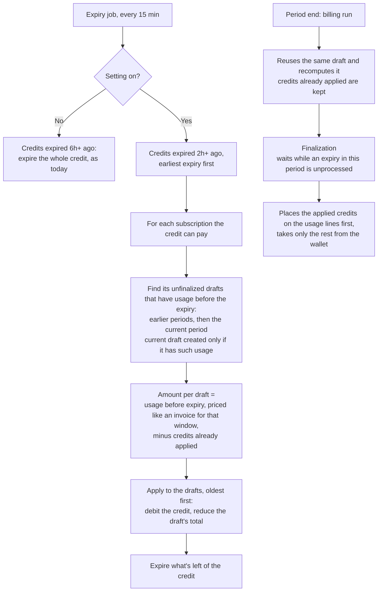

# Mid-period credit expiry

Status: v1 built (PR #2949), off by default. Linear: FLE-897.

Terms used below:
- **Draft**: the period's invoice before it's final. The billing run creates it at period end,
  computes it, and finalizes it a few hours later.
- **Finalization**: the moment credits are taken from the wallet and the invoice is locked.
- **Ongoing balance**: wallet balance minus usage not yet paid, shown to customers in real time.

## The problem

Credits are taken from the wallet only when the period's invoice is finalized. If a credit expires
before that, all of it expires, including the part that should have paid for usage before the
expiry. That usage is then paid from the customer's other credits.

Example: 100 purchased + 30 free credits, 20 of usage, the free credits expire mid-period.
The customer should end with 100. Today they end with 80.

## The idea

When a credit expires, first let it pay the usage from before its expiry, then expire the rest.

The payment goes onto the period's draft invoice (the same draft the billing run finalizes at
period end). Finalization then counts it as already paid and takes only what's still owed from
the wallet.

## Flow

## Example (the case above)

| Step | Wallet balance | Ongoing balance |
|---|---|---|
| 100 purchased + 30 free | 130 | 130 |
| 20 of usage | 130 | 110 |
| Free credits expire: 20 applied to the draft, 10 expired | 100 | 100 |
| 15 more usage | 100 | 85 |
| Period end: draft recomputed, still shows 20 applied | 100 | 85 |
| Finalization: 20 already applied, 15 taken from purchased | 85 | 85 |

Ongoing balance = wallet balance − usage not yet paid. It stays correct at every step.

## Rules for the amount applied

- Only usage **before the expiry** counts. The job waits 2h so late events timestamped before the
  expiry are counted; by then the draft also holds usage after the expiry, which is left out.
- Only **usage, after discounts**. That usage is priced exactly as an invoice for the window from
  period start to expiry would be (same pricing code, coupons and included quotas applied, nothing
  saved). Finalization never puts credits on fixed charges.
- Minus credits **already applied** to that draft by an earlier expiring credit.
- **Rounded down to cents**, and never more than what's left on the credit.
- Several subscriptions: the one whose period ends first is paid first.
- A draft with a payment recorded on it is skipped.
- Custom-currency invoices are handled in their own currency.
- Safe to re-run: a credit is applied to a draft at most once.
- Only active prepaid wallets; only active standalone or parent subscriptions in the same currency,
  without threshold billing.

## When the expiry is processed

The job picks a credit up at least 2h after it expires, so its period may already have rolled over.
Relative to a period P1 followed by P2:

| # | Timing | What happens |
|---|---|---|
| T1 | Expiry mid-period, processed before the period ends | Pays the current draft, rest expires |
| T2 | Expiry inside P1, processed after P1 rolled over | Pays P1's draft; P1's finalization waits for it (at most expiry + 3h) |
| T3 | Expiry after P1 ends, P1 finalizes first | P1 uses the credit as today (still valid at P1's end); the job then pays P2's usage before the expiry |
| T4 | Expiry after P1 ends, job runs before P1 finalizes | One run pays P1's draft, then P2's draft |
| T5 | No usage before the expiry in the current period | No draft created; the credit expires |

## What else changes

| Where | Change |
|---|---|
| Recompute (`ComputeInvoice`) | Keeps credits applied at expiry; a draft with them is never marked SKIPPED |
| Finalization (`ApplyCreditsToInvoice`) | Credits applied at expiry go first and aren't debited again. Wallets count only credits valid at the period end (this part applies to all tenants: it stops "insufficient balance" failures) |
| Finalization hold (`IsFinalizationDue`) | Waits while a credit that expired inside the period is unprocessed |
| Ongoing balance (`GetUnpaidInvoicesToBePaid`, `pendingCharges`) | Credits applied to a draft are subtracted from the usage still owed, so the same usage isn't counted twice |
| Void | Unchanged: refunds applied credits as a top-up with no expiry |

Main new code: `internal/ee/service/credit_expiry.go`. Ledger: the applied part is a
`CREDIT_ADJUSTMENT` debit referencing the draft (`adjustment_type: expiry_settlement`), the rest a
`CREDIT_EXPIRED` debit.

## Rollout

Per-environment setting `credit_expiry_settlement_config` (`{"enabled": true}`), off by default.
With it off nothing changes (6h grace, today's skip rules).

Before enabling for a tenant, check they rarely use immediate cancel or plan changes that reset the
period (see "Not handled yet"), and watch for open cycle drafts with credits applied whose
subscription has moved on.

Cost: each expiring credit with usage computes a draft and runs a usage query on ClickHouse. Fine at
today's volume; worth watching if a tenant expires many credits at once.

## How to see it working

- Ledger: a `CREDIT_ADJUSTMENT` debit on the credit with `adjustment_type: expiry_settlement`,
  referencing the draft, followed by a `CREDIT_EXPIRED` debit for the rest.
- Draft: `total_prepaid_credits_applied` set before finalization; lines show credits only after it.
- Logs: `holding finalization until the expiry job applies an expiring credit` (hold working);
  `expiring credit still unprocessed past the finalization hold` (error: the expiry job is stuck);
  `skipping expiry settlement on a draft with a recorded payment`.

## What we tested

Unit tests in `credit_expiry_settlement_test.go` run the real draft compute against in-memory usage.
End to end on a local stack (wallet, ledger and invoices checked at each step):

| Run | Result |
|---|---|
| T1, then more usage, period end, finalization | Wallet 85 (today 65) |
| T2, finalization tried before the job | Held, then finalized with no extra debit; wallet 100 (today 80) |
| T3 | P1 paid from the credit, P2's draft got its share; purchased untouched |
| T4 | Both drafts paid in one run |
| Two credits in one period, processed in one run | 24 applied (20 if processed latest-expiry first) |
| Void of a draft with applied credits | Refunded, no expiry |

## Not handled yet

**v2 (designed, not built): a period that ends early.** Immediate cancel, scheduled cancel and plan
change with `anchor_at_effect` create a new invoice for the shortened period. Until v2, a draft with
credits applied is left behind: the usage before the expiry is billed again and the draft is never
finalized. v2 rule: reuse the open draft instead (move its period end, set the flow's billing reason,
recompute, finalize). Threshold billing has the same shape; v1 avoids it by skipping threshold
subscriptions, so it only matters if a subscription is switched to threshold billing after a credit
was applied to its draft. The same v2 rule then lets threshold subscriptions be included.

**Accepted limits in v1**
- Events arriving after the job ran aren't counted.
- `RecalculateInvoiceV2` on a draft can drop the applied amount.

**Product calls pending**
- Drafts now exist mid-period: customers and admins can see them before period end, and integrations
  that sync drafts (e.g. Tabs) will receive them. Confirm that's fine.
- Immediate cancel with the default `skip` invoice policy: what happens to a draft with credits?
- A backdated cancel that ends the period before an expiry that already paid usage.

## How others do it

| Platform | Usage before expiry, invoiced after |
|---|---|
| Metronome | Paid by the credit: credits applied to a draft open from period start |
| Orb | Paid by the credit: debited as events arrive |
| Stripe, Lago | Lost: credits apply only at finalization |

Our approach is closest to Metronome, which is also where we want to end up.
