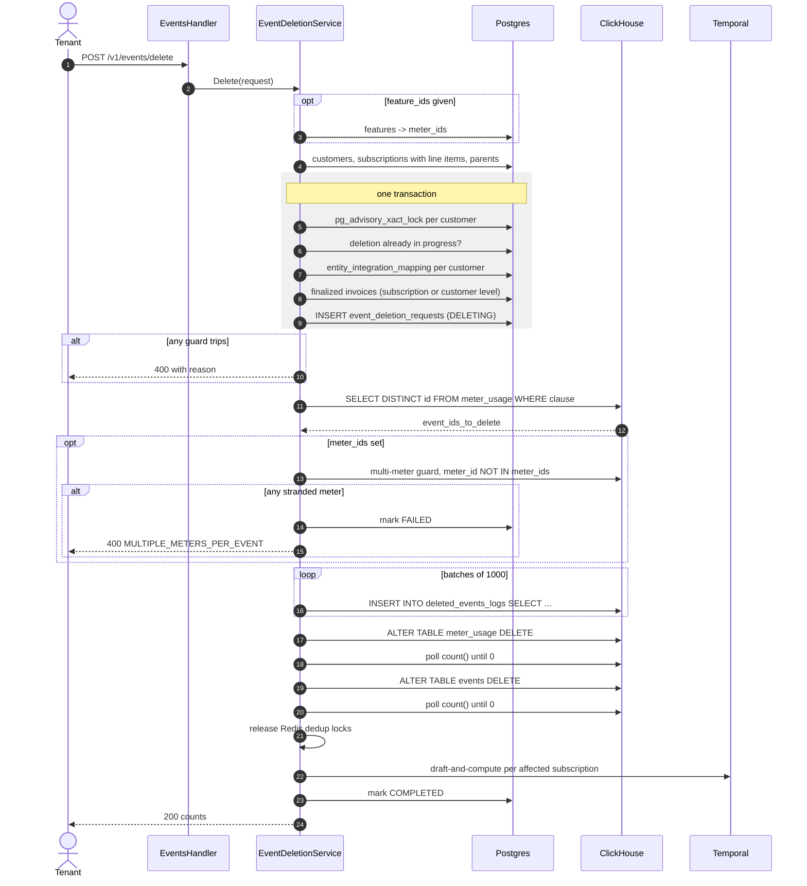

# PRD — Bulk Event Deletion

Author: Tsage  
Date: 2026-09-29  
Ticket: FLE-687

---

## 1. Overview

A tenant-facing bulk API that hard-deletes ingested events and the meter usage they produced. The tenant names the customers and the period, and optionally narrows by feature or by exact event id. The request is refused outright if anything in scope has already been invoiced or belongs to a marketplace customer. What is about to be destroyed is recorded in a new ClickHouse table before the deletes run.

The feature ships in two phases. **Phase 1** runs the deletion inside the request, tracked by a Postgres state row, and blocks invoice finalization for the affected customers while it runs. **Phase 2** moves execution to a Temporal workflow and adds preview. Section 12 lists the split.

---

## 2. Problem & Context

### Current Behavior

Events are published to the Kafka `events` topic and consumed by **six consumer groups across seven handlers**. Four of them write ClickHouse `events` (`flexprice-consumer-local`, `v1_event_processing_lazy`, `v1_event_processing_replay`, `v1_bulk_event_consumption`) and three write ClickHouse `meter_usage` (`v1_meter_usage_tracking_service`, `v1_meter_usage_tracking_service_lazy`, `v1_bulk_meter_usage_tracking`). Each group holds its own offsets, so their lag is independent by construction.

The tracking service matches each event against every meter registered for its `event_name` and writes **one `meter_usage` row per matched meter**, so one event becomes N rows keyed `(id, meter_id)` where `id` is the event id.

Billing reads `meter_usage` exclusively, always filtered on `external_customer_id`. The `events` table is read only by the event browser and the debug endpoint.

There is no deletion path for either table.

### Problem

Tenants sometimes ingest events with incorrect data and have no way to fix them themselves. This often leads to long support threads where we have to help correct the already-ingested events.
Currently, the only way to resolve this is through support ending in manual work on our side: locate the events, delete the `meter_usage` rows, delete the events, then reprocess the corrected events. The threads do not close because the mistake recurs.

The task is simple and the tenant knows exactly which events are wrong. They are blocked only because there is no API.

### Expected Outcome

The tenant deletes their own wrong events and re-ingests the corrected ones, which reprocess through the normal pipeline so `meter_usage` recomputes on its own. No support thread, no manual database work, and the tenant owns the outcome.

---

## 3. Goals & Non-Goals

### Goals

- Bulk hard deletion of events from `meter_usage` and `events`, scoped by customer and period, optionally narrowed by feature or event id.
- Refuse the request if any affected subscription holds a finalized invoice in the period.
- Refuse the request if any customer in scope has a marketplace agreement.
- Refuse the request if deleting the matched events would strand usage on a meter the request did not name.
- A permanent record of every deleted event, written before anything is destroyed.
- Invoice finalization for an affected customer is held while a deletion is in progress, so usage cannot be destroyed behind an invoice issued mid-flight.
- A deleted event cannot be brought back by consumer lag, Kafka redelivery during the deletion, or the raw-event reprocess route.
- Delete and re-ingest under the same event id works without the tenant doing anything special.

### Non-Goals

- No soft delete, no undo.
- No deletion for marketplace customers, under any condition.
- **`raw_events` is out of scope.** Written by the upstream Bento pipeline, not by this repository. Its payloads are not deleted. The reprocess route is prevented from republishing deleted ids instead.
- No unwinding of coupon applications, wallet alerts or usage alerts that already fired against the deleted usage. Section 6 lists what happens to each.
- No revenue-facts rollup trigger.
- No retry or resume of a failed deletion in Phase 1.

---

## 4. Use Cases

### UC1 — Wrong property value across many events

Tenant ingests voice events whose `duration` property is wrong and needs them gone so they can re-send with the corrected value.

Expected: Tenant names the customer, the period, and either the feature or the exact event ids. If nothing in scope has been invoiced, the events and their meter usage are deleted and tenant re-ingests. If the period has been invoiced, the request fails naming the blocking invoice.

### UC2 — Delete and reprocess

Tenant repeatedly asks us to delete a set of events so they can re-send them. Same endpoint, same flow, no involvement from us. The re-ingest carries the same event ids and must land.

---

## 5. Requirements

### Functional Requirements

**R1.** `POST /v1/events/delete` takes the customers and the period, optionally narrowed by `feature_ids` or `event_ids`, and deletes the matching events from `meter_usage` and `events`.

**R2.** Every deleted event is recorded in `deleted_events_logs` before either delete runs, stamped with who deleted it, when, and under which request id.

**R3.** Each request is tracked by a row per affected customer in the Postgres table `event_deletion_requests`, carrying the status, the period and the failure reason.

**R4.** Guards are evaluated before anything is written to ClickHouse. If any guard trips the request is refused on the spot and neither ClickHouse table is touched. Once the guards pass, the request is executed in order: record, delete `meter_usage`, delete `events`. Each ClickHouse mutation is submitted asynchronously and waited on by polling the affected rows to zero, and the state row reaches a terminal status on every exit path including a lost connection.

**R5.** A failure returns a single reason from a fixed enum plus the identifiers available at that point.

**R6.** While a deletion is in progress for a customer and period, invoice finalization for that customer over an overlapping period is refused.

**R7.** While a deletion is in progress for a customer and period, every consumer that writes `events` or `meter_usage` drops incoming events for that customer whose timestamp falls inside the period.

**R8.** Deletion releases the Redis deduplication locks for the deleted event ids, so a re-ingest under the same id is not silently dropped.

**R9.** `POST /v1/events/raw/reprocess/pending` and `/all` skip event ids present in `deleted_events_logs`.

**R10.** A successful deletion triggers the existing draft-and-compute workflow for each affected subscription, so stale draft invoices are recomputed without waiting for the next scheduled run.

**R11.** When `skip_payload` is set on the request, the audit row stores an empty `properties` value and records the reason, so a compliance-driven deletion leaves no payload copy.

**R12.** Every step logs at info level on success and error level on failure, carrying the identifiers involved.

### Business Rules

**BR1.** Refused if any affected subscription holds a `FINALIZED` invoice whose period touches `[period_start, period_end)`. Overlap in either direction counts.

**BR2.** Affected subscriptions are those whose line items carry a meter in scope. Parent subscriptions are pulled in before the meter match, because an `inherited` child carries no line items of its own. When no `feature_ids` are given there is no meter set, so the guard runs at customer level over every customer in scope.

**BR3.** Refused if any customer in scope has a mapping in `entity_integration_mapping` with `entity_type = CUSTOMER` and a marketplace `provider_type`.

**BR4.** Refused if any matched event also carries `meter_usage` on a meter the request did not name. The narrow form is used: `meter_id NOT IN meter_ids`. A tenant who names every feature an event feeds is allowed.

**BR5.** The meter-narrowed clause is built against `meter_usage` only. It is the one table carrying every filter dimension, and `events` has no meter column at all. The unnarrowed clause also runs against `events`, to pick up events that never produced meter usage.

**BR6.** Both deletes are keyed on the resolved id set, which is exactly the set the audit record was written from. Nothing is deleted that was not recorded, and nothing is recorded that is not deleted.

**BR7.** `meter_usage` is deleted before `events`. A surviving `events` row has no reader. A surviving `meter_usage` row keeps billing.

**BR8.** Exactly one deletion may be in progress per customer at a time, enforced by a unique partial index on `event_deletion_requests`.

**BR9.** Each table receives exactly one mutation per request. Mutations are never issued per batch, because a mutation rewrites every part it touches and repeating that over the same parts is what degrades the shared tables.

**BR10.** Deletion is a user-only capability, not assignable to a service account.

**BR11.** An event that produced no `meter_usage` row is deleted and recorded in cases 1 and 3, with `meter_id = ''` and `qty_total = 0`. It cannot appear in case 2, because an event with no meter row cannot match a feature.

### Validations / Constraints

**V1.** `external_customer_ids` non-empty. `period_start` and `period_end` present, `period_start` before `period_end`.

**V2.** Every `external_customer_id` and every `feature_id` must resolve in this environment.

**V3.** When `event_ids` is provided, `external_customer_ids` must contain exactly one entry and `feature_ids` must be empty.

**V4.** `period_end - period_start` must not exceed **1 month**. This bounds the partitions one mutation touches, which is what keeps the shared tables safe.

**V5.** Request caps: `external_customer_ids` at most **100**, `feature_ids` at most **100**, `event_ids` at most **1000**, and a body limit on the route. The ingestion body cap is attached to three ingestion routes only and does not cover this one.

**V6.** The resolved event set must not exceed **`MAX_EVENTS_PER_REQUEST`**. This is checked after the id set is resolved and before anything is written to ClickHouse. Exceeding it fails the request with `TOO_MANY_EVENTS`, carrying the count and the limit, and the remedy is to narrow the period. This is the only cap the tenant cannot predict from their own request, which is why the error returns the actual count.


---

## 6. Product Behavior and Workflow

### The three cases

| Case | Request | Invoice guard | Multi-meter guard | `meter_usage` delete | `events` delete |
|---|---|---|---|---|---|
| 1 | customers + period | customer level | not needed | clause only, no ids | clause only, no ids |
| 2 | customers + `feature_ids` + period | subscription level, narrowed by meter | **required** | clause + `meter_id IN` | ids required, `events` has no meter column |
| 3 | one customer + `event_ids` + period | customer level | not needed | ids, at most 1000 | ids, at most 1000 |

Cases 1 and 3 need no multi-meter guard because their clause carries no meter filter, so every meter row for every matched event is already in the id set and nothing can be stranded.

Case 2 is the only case where the `events` delete needs an id list, because `events` has no meter column to narrow on. That list goes inline into a single mutation with `max_query_size` raised for the statement. It is not split into batches, per BR9.

### State machine

`event_deletion_requests.deletion_status`:

```
DELETING ──► COMPLETED
    │
    └──────► FAILED
```

| Status | Invoice finalization | Ingestion suppression |
|---|---|---|
| `DELETING` | blocked for an overlapping period | on for the customer and period |
| `COMPLETED` | released | off |
| `FAILED` | released | off |

The row is inserted as `DELETING` inside the guard transaction and reaches a terminal status on every exit path. If the client connection is lost, a deferred handler writes `FAILED` with reason `CONNECTION_LOST` on an uncancelled context, so invoicing is never left blocked by a dead request.

### Main flow

```
POST /v1/events/delete
      ↓
validate (V1 to V6)                          ──► 400
      ↓
resolve customers, subscriptions, parents
      ↓
BEGIN TX
  advisory lock per external_customer_id
  one deletion already in progress?           ──► 409, rollback
  marketplace guard                           ──► 400, rollback
  finalized-invoice guard                     ──► 400, rollback
  INSERT event_deletion_requests (DELETING)
COMMIT                        ◄── invoicing hold and ingestion suppression are live
      ↓
resolve meter_ids, resolve event id set       ──► 400 TOO_MANY_EVENTS, mark FAILED
      ↓
multi-meter guard (case 2 only)               ──► 400, mark FAILED
      ↓
INSERT INTO deleted_events_logs, batched at 1000
      ↓
ALTER TABLE meter_usage DELETE, wait         ──► MUTATION_TIMEOUT, mark FAILED
      ↓
ALTER TABLE events DELETE, wait               ──► MUTATION_TIMEOUT, mark FAILED
      ↓
release Redis dedup locks for the deleted ids
      ↓
trigger draft-and-compute per affected subscription
      ↓
UPDATE event_deletion_requests (COMPLETED)
      ↓
200 counts
```

Any failure after the commit marks the row `FAILED` with the reason and returns the error.

### Pseudocode

```
request:
{
  external_customer_ids: [...],    // required, max 100
  period_start,                    // required
  period_end,                      // required, within 1 month of start
  feature_ids: [...],              // optional, max 100
  event_ids: [...],                // optional, max 1000
  skip_payload: false,             // optional
}

validation:
    external_customer_ids not empty
    period_start and period_end present, period_start < period_end
    period_end - period_start <= 1 month
    every external_customer_id resolves
    every feature_id resolves
    if event_ids not empty:
        len(external_customer_ids) == 1
        feature_ids must be empty

// ---------- resolve meters, case 2 only ----------
meter_ids = []
if feature_ids not empty:
    meter_ids = features where feature_id in feature_ids -> meter_id

// ---------- customers and their subscriptions, with line items ----------
customers = CustomerRepo.List(ExternalIDs: external_customer_ids)   // no-limit filter
subs      = SubRepo.List(ExternalCustomerIDs: external_customer_ids, WithLineItems: true)

// ---------- pull parent subscriptions in, with line items ----------
// before the meter match: an inherited child has no line items, the meter lives on the parent
parent_ids = { s.ParentSubscriptionID for s in subs if set }.distinct()
if parent_ids not empty:
    subs += SubRepo.List(SubscriptionIDs: parent_ids, WithLineItems: true)

customer_ids_to_check = ({ c.ID for c in customers } + { s.CustomerID for s in subs }).distinct()

// ---------- guards and the state row, one transaction ----------
BEGIN TX

    // serialises this guard read against invoice finalization's gate read
    for each external_customer_id in external_customer_ids.sorted():
        pg_advisory_xact_lock("evtdel:" + tenant + ":" + env + ":" + external_customer_id)

    // one deletion per customer
    if any row in event_deletion_requests with
         tenant, env, external_customer_id in external_customer_ids,
         deletion_status = DELETING:
        return error DELETION_IN_PROGRESS            // 409

    // marketplace guard
    for each customer_id in customer_ids_to_check:
        if entity_integration_mapping exists with
             entity_id = customer_id, entity_type = CUSTOMER,
             provider_type in (aws_marketplace, gcp_marketplace, azure_marketplace):
            return error MARKETPLACE_CUSTOMER with customer_id

    // invoice guard
    if meter_ids not empty:
        // case 2: only the subscriptions carrying those meters
        affected = { s for s in subs if any(li.MeterID in meter_ids for li in s.LineItems) }
        for each sub in affected:
            finalized = InvoiceRepo.List(
                SubscriptionID:  sub.ID,
                InvoiceStatus:   FINALIZED,
                PeriodStartLTE:  period_end,
                PeriodEndGTE:    period_start,
            )
            if finalized not empty:
                return error FINALIZED_INVOICE_EXISTS with sub.ID, finalized[0].ID
    else:
        // case 1 and 3: no meter set to narrow with
        for each customer_id in customer_ids_to_check:
            finalized = InvoiceRepo.List(
                CustomerID:      customer_id,
                InvoiceStatus:   FINALIZED,
                PeriodStartLTE:  period_end,
                PeriodEndGTE:    period_start,
            )
            if finalized not empty:
                return error FINALIZED_INVOICE_EXISTS with customer_id, finalized[0].ID

    // state row, one per customer named in the request
    for each external_customer_id in external_customer_ids:
        INSERT event_deletion_requests (
            request_id, external_customer_id,
            period_start, period_end,
            deletion_status = DELETING, started_at = now()
        )

COMMIT      // the invoicing hold and the ingestion suppression window are now live

// ---------- build the clause, against meter_usage ----------
base   = tenant_id = ? AND environment_id = ?
       AND external_customer_id IN external_customer_ids
       AND timestamp >= period_start AND timestamp < period_end
if event_ids not empty: base += AND id IN event_ids

clause = base
if meter_ids not empty: clause += AND meter_id IN meter_ids

// ---------- resolve the event id set ----------
metered   = SELECT DISTINCT id FROM meter_usage WHERE clause

// cases 1 and 3 also take events that produced no meter usage at all
unmetered = []
if meter_ids empty:
    unmetered = (SELECT DISTINCT id FROM events WHERE base) - metered

event_ids_to_delete = metered + unmetered

if event_ids_to_delete empty:
    mark COMPLETED
    return success { deleted_events: 0 }

if len(event_ids_to_delete) > MAX_EVENTS_PER_REQUEST:
    mark FAILED
    return error TOO_MANY_EVENTS with event_count, limit

// ---------- multi-meter guard, case 2 only, narrow form ----------
if meter_ids not empty:
    offending = SELECT count(DISTINCT id)      AS event_count,
                       groupUniqArray(meter_id) AS meters_involved
                FROM meter_usage
                WHERE tenant_id = ? AND environment_id = ?
                  AND external_customer_id IN external_customer_ids
                  AND timestamp >= period_start AND timestamp < period_end
                  AND id IN event_ids_to_delete
                  AND meter_id NOT IN meter_ids
    if offending.event_count > 0:
        mark FAILED
        return error MULTIPLE_METERS_PER_EVENT with event_count, meters_involved

// ---------- record, batched at 1000 ids per insert ----------
deleted_at = now()                      // one value for the whole request

for each batch of 1000 in metered:
    INSERT INTO deleted_events_logs
    SELECT m.id, m.meter_id, m.tenant_id, m.environment_id, m.external_customer_id,
           m.event_name, m.source, e.timestamp, e.ingested_at,
           m.qty_total, m.unique_hash,
           {skip_payload ? '' : m.properties},
           deleted_at, {deleted_by}, {request_id}
    FROM meter_usage FINAL AS m
    LEFT JOIN (
        SELECT id, timestamp, ingested_at
        FROM events FINAL
        WHERE tenant_id = ? AND environment_id = ?
          AND timestamp >= period_start AND timestamp < period_end
          AND id IN batch
        ORDER BY ingested_at DESC
        LIMIT 1 BY id                   // one partner per id
    ) AS e ON m.id = e.id
    WHERE <clause> AND m.id IN batch

for each batch of 1000 in unmetered:
    INSERT INTO deleted_events_logs
    SELECT e.id, '', e.tenant_id, e.environment_id, e.external_customer_id,
           e.event_name, e.source, e.timestamp, e.ingested_at,
           0, '',
           {skip_payload ? '' : e.properties},
           deleted_at, {deleted_by}, {request_id}
    FROM events FINAL AS e
    WHERE <base> AND e.id IN batch

// ---------- delete, one mutation per table ----------
ALTER TABLE meter_usage DELETE
  WHERE <clause> AND id IN event_ids_to_delete
  SETTINGS mutations_sync = 0
wait for the mutation to finish

ALTER TABLE events DELETE
  WHERE <base> AND id IN event_ids_to_delete
  SETTINGS mutations_sync = 0
wait for the mutation to finish

// ---------- aftermath ----------
release Redis dedup locks for every id in event_ids_to_delete
trigger draft-and-compute workflow per affected subscription

mark COMPLETED
return success { request_id, deleted_events, deleted_meter_usage_rows }
```

### Notes on the resolution

**The two id sets.** An event is matched against the meters registered for its `event_name` at ingestion. If a meter matches, a `meter_usage` row is written. If none matches, the event sits in `events` with no `meter_usage` row at all. `metered` are the first kind, `unmetered` the second. Cases 1 and 3 delete and record both. Case 2 only ever sees the first kind, because an event with no meter row cannot match a feature.

**Parent subscriptions are pulled in before the meter match.** An `inherited` subscription carries no line items, so the meter lives on the parent. `ExternalCustomerIDsForSubscription` cannot be used for this: it walks a `parent` subscription **down** to its inherited children and returns only the child's own customer when called on a child.

**The invoice query is the overlap test.** `PeriodStartLTE: period_end` with `PeriodEndGTE: period_start` returns every finalized invoice whose period touches the requested one, in either direction. Any result refuses the request.

**All subscription statuses are included.** `SubRepo.List` applies the status predicate only when the filter's status slice is non-empty. Unset returns `cancelled` and `paused` too, which is required because a churned customer's cancelled subscription still holds finalized invoices.

**Pagination.** `NewNoLimitSubscriptionFilter()` and `NewNoLimitCustomerFilter()` are required. The default constructors carry `Limit: 50`, which would silently truncate a 100-customer request to 50 and leave the rest unguarded.

**The advisory lock is what closes the race.** Postgres runs at READ COMMITTED here, so without a lock the deletion's invoice guard and finalization's deletion gate can both pass at the same moment, neither seeing the other's uncommitted write. Both sides take the same key, so one blocks until the other commits. The lock is transaction-scoped and is released at commit, which is correct: it only has to serialise the two reads, not span the mutation. The committed `DELETING` row is what spans the mutation.

**The deletion path must never take a row lock on `invoices`.** Finalization takes the invoice row lock first and then the advisory lock. If deletion took both in the other order the two would deadlock.

**`FINAL` only where it changes the answer.** `meter_usage` is a `ReplacingMergeTree`, so `FINAL` is required on the audit insert, where an uncollapsed duplicate would become a duplicate audit row. It is waste on the resolve, where `SELECT DISTINCT id` already collapses versions, and on the multi-meter guard, where `groupUniqArray` does. It is not applicable to a mutation predicate.

**The join is filtered on both sides.** Without a predicate on the right side, ClickHouse reads the whole `events` table to build its hash table. Predicate propagation across a join does not exist on the target version, so the filter has to be written by hand.

**Both deletes use `ALTER TABLE ... DELETE`, not `DELETE FROM`.** A lightweight `DELETE FROM` fails on a table carrying a projection unless `lightweight_mutation_projection_mode` is set, and production `events` carries `proj_by_customer_event`.

**No `IN PARTITION`.** The clause carries the period, but the mutation still examines every part, because automatic partition pruning for mutations exists only on the Replicated engine family and only from a later version than production runs. `IN PARTITION` takes a single partition expression, so restricting a 32-partition request that way would mean 32 mutations, which BR9 forbids. What the period cap bounds is the data **rewritten**, since only parts containing a match are rewritten.

**Mutation predicates carry no subqueries.** A mutation is a stored command applied to each part later by background threads. ClickHouse refuses a subquery in the predicate as nondeterministic, and raising `allow_nondeterministic_mutations` does not lift it. So the clause is literal, and case 2's id list goes inline.

**"Wait for it to finish" means polling `system.mutations`.** `mutations_sync` would block the client, and the ClickHouse read deadline is 30 seconds, so a long mutation would time out while still succeeding on the server. Each delete is submitted with `mutations_sync = 0` and then polled:

```sql
SELECT is_done, latest_fail_reason
FROM system.mutations
WHERE database = ? AND table = ? AND create_time >= {submitted_at}
ORDER BY create_time DESC LIMIT 1
```

`is_done` ends the wait. A non-empty `latest_fail_reason` fails the request with `MUTATION_FAILED`. Reaching `MUTATION_DEADLINE` fails it with `MUTATION_TIMEOUT`. Polling the mutation rather than re-counting rows matters because a row count would have to carry the whole id list on every tick.

**`LIMIT 1 BY id` on the join's right side.** `FINAL` alone is not enough. The `events` sort key is `(tenant_id, environment_id, timestamp, id)`, so the same id re-ingested at a corrected timestamp is two distinct rows that never collapse, and the join would then write two audit rows for one `meter_usage` row.

**Both inserts name their target columns.** `INSERT INTO deleted_events_logs (event_id, meter_id, tenant_id, environment_id, external_customer_id, event_name, source, event_timestamp, event_ingested_at, qty_total, unique_hash, properties, deleted_at, deleted_by, request_id) SELECT ...`. Without the column list the statement is positional, and a later `ADD COLUMN ... AFTER` would silently shift every value one place into a column of a compatible type.

**The response counts.** `deleted_events` is the size of the resolved id set. `deleted_meter_usage_rows` is `SELECT count() FROM deleted_events_logs WHERE tenant_id = ? AND environment_id = ? AND request_id = ? AND meter_id != ''`, which excludes the rows written for events that produced no meter usage.

### Ingestion suppression

Two mechanisms, both reading stores that already exist.

**The window, from `event_deletion_requests`.** Consumers load `(external_customer_id, period_start, period_end)` for rows in `DELETING`, cached in process and refreshed on a short interval. This follows the existing `EventIngestionFilterConfig` pattern, which is a Postgres-backed per-customer gate read once per Kafka batch with an in-process cache. Per event the check is a map lookup.

```
event arrives at a consumer
  customer not in the window set        → write (the normal case, no cost)
  event.timestamp outside the period    → write
  otherwise                             → drop, return nil, log at Info
```

A dropped event must not fire the rejected-event webhook, must not publish to the analytics sink, must not run the post-insert side effects, and must not acquire a dedup lock. The check sits before all of them.

This is the only thing that can catch an event still sitting in Kafka when the id set was resolved, because such an event has never reached `meter_usage` and we therefore never learned its id.

**The id list, from `deleted_events_logs`.** Used by the reprocess route only:

```
per batch of 1000 raw events:
  SELECT DISTINCT event_id FROM deleted_events_logs
  WHERE tenant_id = ? AND environment_id = ? AND event_id IN (batch)
  drop the matches, count them, report them
```

Permanent rather than time-bounded, because `raw_events` has no TTL and a reprocess can be triggered at any point in the future.

### Aftermath

Everything downstream that already read the deleted usage.

| Consumer | What happens | Owner |
|---|---|---|
| Draft invoices | Deletion triggers the existing draft-and-compute workflow per affected subscription. A draft that recomputes to zero flips to `SKIPPED` | this feature |
| `revenue_facts` | Not live yet. Handled when it ships | revenue-facts |
| `coupon_applications` | Already-applied rows keep their pre-deletion amounts. Not unwound | documented, not addressed |
| Wallet and usage alerts already fired | Cannot be unfired | documented, not addressed |
| Scheduled S3 exports already sent | Already delivered | documented, not addressed |
| Entitlement grants | Unchanged | out of scope |

### Sequence Diagram



### Service Structure

`Delete` validates, resolves the customer and subscription set, runs the guards and writes the state rows in one transaction, then resolves the id set, runs the multi-meter guard, and calls `Persist(event_ids_to_delete)` which records, deletes, releases the dedup locks and triggers the recompute. A deferred block marks the row terminal on every exit path, including a cancelled request context.

---

## 7. Data Model

### `event_deletion_requests` — new Postgres table

One row per `(request, external_customer_id)`. Base mixin plus environment mixin supply `tenant_id`, `environment_id`, `status`, `created_at`, `created_by`, `updated_at`, `updated_by`.

| Field | Type | Notes |
|---|---|---|
| `id` | `varchar(50)` | `evtdel_` prefix |
| `request_id` | `varchar(50)` | generated, shared by every row of one request, returned to the caller, stamped on every audit row. Not the HTTP request id |
| `external_customer_id` | `varchar(255)` | the fence key and the suppression key |
| `period_start` | `timestamptz` | not null |
| `period_end` | `timestamptz` | not null |
| `deletion_status` | `varchar(20)` | `DELETING`, `COMPLETED`, `FAILED` |
| `started_at` | `timestamptz` | |
| `completed_at` | `timestamptz` | nullable |
| `failed_at` | `timestamptz` | nullable |
| `failure_reason` | `text` | nullable, the reason enum value |
| `skip_payload` | `bool` | default false. Records that this request asked for the payload not to be stored |

Indexes:

```sql
UNIQUE (tenant_id, environment_id, external_customer_id)
  WHERE status = 'published' AND deletion_status = 'DELETING'

(tenant_id, environment_id, external_customer_id, period_start, period_end)

(tenant_id, environment_id, deletion_status)
```

The unique partial index serves both the fence lookup and BR8. The second serves the suppression cache load. The third serves operator listing.

### `deleted_events_logs` — new ClickHouse table

One table holding the record for both `events` and `meter_usage`.

```sql
CREATE TABLE IF NOT EXISTS flexprice.deleted_events_logs
(
    event_id             String,
    meter_id             LowCardinality(String),
    tenant_id            LowCardinality(String),
    environment_id       LowCardinality(String),
    external_customer_id LowCardinality(String),
    event_name           LowCardinality(String),
    source               LowCardinality(String) DEFAULT '',
    event_timestamp      DateTime64(3),
    event_ingested_at    DateTime64(3),
    qty_total            Decimal(25, 15),
    unique_hash          String DEFAULT '',
    properties           String DEFAULT '' CODEC(ZSTD(3)),
    deleted_at           DateTime64(3),
    deleted_by           String,
    request_id           String
)
ENGINE = MergeTree
PARTITION BY toYYYYMM(deleted_at)
ORDER BY (tenant_id, environment_id, request_id, event_id, meter_id)
SETTINGS index_granularity = 8192;
```

| Column | Source |
|---|---|
| `event_id` | `meter_usage.id` |
| `meter_id`, `qty_total`, `unique_hash` | `meter_usage` |
| `tenant_id`, `environment_id`, `external_customer_id` | `meter_usage` |
| `event_name`, `source`, `properties` | `meter_usage` |
| `event_timestamp`, `event_ingested_at` | `events` |
| `deleted_at`, `deleted_by`, `request_id` | stamped by the `INSERT ... SELECT` |

- **No TTL. The record is permanent.**
- **No storage policy.** A `storage_policy` is server configuration that must exist before the table is created, and nothing in this repository configures one. A migration naming one would fail wherever it is absent, silently on local because the migration runner swallows per-file errors.
- **`ORDER BY` leads with `request_id`.** The documented read path is by `request_id`, and it is not in the key in any other ordering. `event_id` and `meter_id` complete the natural key.
- **`MergeTree`, not `ReplacingMergeTree`.** One write per deleted event. Phase 1 has no retries, so there is never a duplicate insert to collapse.
- **Monthly partitions.** The table is written only when a deletion runs, so daily partitions would produce a long tail of tiny partitions with no query benefit.
- **One row per `(event_id, meter_id)`.** An event matching three meters produces three rows. An event that produced no meter usage gets one row with `meter_id = ''` and `qty_total = 0`.
- **`properties` is stored by default.** When `skip_payload` is set on the request it is written as `''`, and the flag is recorded on `event_deletion_requests` rather than repeated on every audit row.
- **No `customer_id`.** `meter_usage` has no such column and `events.customer_id` is nullable and frequently empty. `external_customer_id` is `NOT NULL` on `meter_usage`.
- `qty_total` is `Decimal(25, 15)` in the versioned migration and `Decimal(18, 8)` in the prod baseline. Both carry ten integer digits, so `Decimal(18,8)` into `Decimal(25,15)` is lossless while the reverse truncates. The wider type is used so the record works against either deployment.
- A `ReplicatedMergeTree` variant created `ON CLUSTER` is needed for a replicated deployment, following the existing replicated baseline.

### `events` and `meter_usage`

Rows are hard-deleted. No schema change on either table.

Production `events` carries `PROJECTION proj_by_customer_event`, partitions monthly by `toYYYYMM(timestamp)`, and has `PRIMARY KEY (tenant_id, environment_id)` which is narrower than its `ORDER BY`. The projection is why both deletes use `ALTER TABLE ... DELETE`. The monthly partitioning is why the period cap matters more for `events` than for `meter_usage`, which is daily.

### `MeterUsageQueryParams`

One new field, `IDs []string`, with a matching `id IN (...)` predicate in `BuildWhereClause`. Every caller must tolerate it being empty.

---

## 8. Contracts

### `POST /v1/events/delete`

`@x-scope "delete"`

```json
{
  "external_customer_ids": ["cust_ext_9"],
  "feature_ids": ["feat_01H..."],
  "event_ids": [],
  "period_start": "2026-03-01T00:00:00Z",
  "period_end":   "2026-03-28T00:00:00Z",
  "skip_payload": false
}
```

Success:

```json
{
  "request_id": "evtdel_01H...",
  "deleted_events": 96000,
  "deleted_meter_usage_rows": 131000
}
```

The deleted set is never enumerated in the response. It lives in `deleted_events_logs`, queryable by `request_id`.

### Failure reasons

A single reason per failure, returned through `ierr.WithReportableDetails` with whatever identifiers are in hand.

| Reason | Identifiers returned | Was anything deleted? |
|---|---|---|
| `MARKETPLACE_CUSTOMER` | `external_customer_id`, `provider_type` | no, guaranteed |
| `FINALIZED_INVOICE_EXISTS` | `external_customer_id`, `subscription_id` (case 2 only), `invoice_id`, invoice period | no, guaranteed |
| `MULTIPLE_METERS_PER_EVENT` | `event_count`, `meters_involved` | no, guaranteed |
| `TOO_MANY_EVENTS` | `event_count`, `limit` | no, guaranteed. The check runs before the first write |
| `MUTATION_FAILED` | `request_id`, the table, the ClickHouse reason | **unknown.** The mutation reported an error partway. Read `deleted_events_logs` by `request_id` for what was recorded |
| `MUTATION_TIMEOUT` | `request_id`, the table | **unknown.** The mutation was submitted and is still running. Read `deleted_events_logs` by `request_id` for what was recorded |
| `DELETION_IN_PROGRESS` | `external_customer_id`, `request_id` of the live deletion | no, guaranteed |
| `CONNECTION_LOST` | `request_id` | **unknown.** The mutations were submitted and most likely completed. Read `deleted_events_logs` by `request_id` for what was recorded |

```go
return ierr.NewError("finalized invoice exists in the requested period").
    WithHint("Deletion is not allowed for a period that has already been invoiced").
    WithReportableDetails(map[string]interface{}{
        "reason":               types.EventDeletionBlockFinalizedInvoiceExists,
        "external_customer_id": extID,
        "subscription_id":      subID,
        "invoice_id":           inv.ID,
    }).
    Mark(ierr.ErrInvalidOperation)
```

Every response path is bounded. Counts on success, identifiers on refusal.

### Errors

| HTTP | `ierr` mark | Condition |
|---|---|---|
| 400 | `ErrValidation` | Required field missing, period inverted, period wider than 1 month, a cap exceeded, `event_ids` with more than one customer or with `feature_ids`, unknown customer or feature |
| 400 | `ErrInvalidOperation` | Marketplace, finalized invoice, or multi-meter guard trips, or the resolved set exceeds `MAX_EVENTS_PER_REQUEST` |
| 403 | `ErrPermissionDenied` | Caller lacks the capability, or is a service account |
| 409 | `ErrAlreadyExists` | A deletion is already in progress for a customer in the request |
| 500 | `ErrDatabase` | A ClickHouse step failed. The state row is marked `FAILED` with the reason |

### Invoice finalization gate

Added inside `performFinalizeInvoiceActions`, under the existing invoice row lock and inside the existing transaction, and as a cheap pre-filter in `IsFinalizationDue` so the cron paths skip rather than error.

```sql
SELECT 1 FROM event_deletion_requests
WHERE tenant_id = ? AND environment_id = ?
  AND status = 'published'
  AND deletion_status = 'DELETING'
  AND external_customer_id = ANY(?)        -- invoice customer and subscription customer
  AND period_start <= {invoice.period_end}
  AND period_end   >= {invoice.period_start}
LIMIT 1
```

The customer list carries both the invoice's `customer_id` and its `subscription_customer_id`, because a `delegated_invoicing` subscription puts a different customer on the invoice than the one that owns the usage.

The same two operators as BR1, so the gate can never be narrower than the guard.

On a hit:

| Path | Behaviour |
|---|---|
| `POST /v1/invoices/{id}/finalize` and other synchronous callers | `409` naming the blocking `request_id` |
| `FinalizeInvoiceActivity` and the cron paths | `Skipped: true`, the existing clean-exit channel. The 30 minute draft-finalization schedule picks it up later. Never marked `ErrInvalidOperation`, which the activity converts into a non-retryable failure |
| Subscription create and the period-roll paths | error, which rolls the transaction back without advancing `current_period_start` |

No billing cycle is lost. Threshold billing re-evaluates usage against the threshold fresh on each run, and the period-roll paths retry on the next tick.

## 9. Edge Cases

| Scenario | Expected Behavior |
|---|---|
| Matched event also carries usage on a meter not named by `feature_ids` | Fails with `MULTIPLE_METERS_PER_EVENT`. Nothing deleted. |
| `feature_ids` not given | No meter filter, so every meter row for every matched event is in scope and the multi-meter guard is unnecessary. |
| `event_ids` with more than one `external_customer_id`, or alongside `feature_ids` | `400 ErrValidation`. |
| Period wider than 1 month | `400 ErrValidation`. Split the request. |
| Period bound carries milliseconds | `400 ErrValidation`. Whole seconds only. |
| A deletion is already running for one of the named customers | `409 DELETION_IN_PROGRESS`. Nothing is started for any customer in the request. |
| Customer has five subscriptions, only one carries a meter in scope | Only that one is checked. |
| Customer has an `inherited` subscription | The child owns no line items. The parent is pulled in before the meter match and checked there. |
| Customer has a `grouped_invoicing` subscription | The child owns its line items and matches the meter. Its parent is also pulled in, so whichever holds the invoice is checked. |
| `delegated_invoicing` subscription | Checked as itself. Its invoice sits under its own `subscription_id`, and the finalization gate matches on both customer columns. |
| Subscription is cancelled or paused | Still checked. All statuses are returned. |
| Invoice for the period is `DRAFT` or `SKIPPED` | Not a blocker. Only `FINALIZED` blocks. The draft is recomputed by the workflow the deletion triggers. |
| Draft invoice recomputes to zero after deletion | It flips to `SKIPPED`: no invoice number, no vendor sync. |
| An invoice tries to finalize mid-deletion | Refused or deferred by the gate. Both sides take the same advisory lock, so they cannot both pass. |
| An invoice finalized a moment before the guard read | The guard sees it and refuses, because the advisory lock makes the finalization commit visible before the guard read proceeds. |
| Finalized invoice ends exactly at `period_start`, or starts exactly at `period_end` | Blocks. The operators are `>=` and `<=`, so an adjacent invoice sharing a boundary is returned. A known over-block, one instant wide, accepted. |
| Backdated event inside a finalized period the invoice never counted | Blocked anyway. `invoice_line_items` store the aggregate quantity, not the event set, so the period is the only available proxy. |
| Event still in Kafka when the id set is resolved | Dropped by the suppression window when it reaches a consumer, because it falls in the customer and period being deleted. |
| Kafka redelivers a deleted event during the deletion | Dropped by the same window. |
| Kafka redelivers a deleted event after the request completes | **Not suppressed.** The window is down. Realistic redelivery happens within seconds, well inside the window, so the exposure is a consumer-group offset reset, which is an operator action. |
| Event for the same customer but outside the period arrives during the deletion | Written normally. The window checks the timestamp against the period. |
| Tenant re-ingests a corrected event under the same id after the deletion | Written normally. The window is down and the dedup lock was released. |
| Tenant re-ingests under the same id but a different timestamp | Written. The old `events` row is already gone, so no orphan. Had the deletion not run, `ReplacingMergeTree` would not have collapsed them, because `timestamp` is in the sort key. |
| `POST /v1/events/raw/reprocess/*` run after a deletion | Deleted ids are skipped against `deleted_events_logs` and reported in a skip count. |
| Event present in `events` with no `meter_usage` row | Cases 1 and 3 delete **and record** it, with `meter_id = ''` and `qty_total = 0`. Case 2 never matches it, since an event with no meter row cannot match a feature. |
| `events` row whose `external_customer_id` is NULL | Not matched, so not deleted and not recorded. The column is `Nullable(String)` in production and `IN` against NULL does not match. It survives as an inert orphan. |
| Resolved set exceeds `MAX_EVENTS_PER_REQUEST` | `400 TOO_MANY_EVENTS` with the count and the limit. Nothing is written, the state row is marked `FAILED`, and invoicing is released. The tenant narrows the period and retries. |
| A mutation stalls and never finishes | The wait gives up at `MUTATION_DEADLINE`, the row is marked `FAILED` with `MUTATION_TIMEOUT`, and invoicing is released. The mutation keeps running on the server, so what was deleted is read back from `deleted_events_logs`. |
| A mutation reports an error in `system.mutations` | The wait stops, the row is marked `FAILED` with `MUTATION_FAILED` and the ClickHouse reason. |
| The same event id appears twice in `events` with different timestamps | One audit row, not two. `events` is deduplicated by id on the way into the record, newest `ingested_at` winning. `FINAL` alone does not do this, because `timestamp` is part of the sort key. |
| `meter_usage` row present with no `events` row | Recorded with the two `events`-sourced timestamp columns at their zero value, then deleted. A left-join miss writes the type default, not an empty value. |
| Clause matches nothing | `200` with `deleted_events: 0`. No record, no deletes, row marked `COMPLETED`. |
| Client connection dropped mid-request | The row is marked `FAILED` with `CONNECTION_LOST` on an uncancelled context, so invoicing is released. The mutations continue server side and most likely complete. |
| Process hard-killed mid-request | No deferred code runs, so the row stays `DELETING` and that customer's invoicing stays blocked until an operator marks it `FAILED`. Rarer than a dropped connection and accepted for Phase 1. |
| `skip_payload: true` | The audit row stores `properties = ''`. The flag itself is on `event_deletion_requests`. Everything else is identical. |
| `period_end` carries a sub-second component | `meter_usage.timestamp` is second precision, so a row at `10:00:01` matches a bound of `10:00:01.500` while its `events` row at `10:00:01.900` does not. That `events` row survives as an inert orphan. Both clauses use the bound as given, with no widening. |

---

## 10. Acceptance Criteria

**AC1.** A request whose period overlaps a `FINALIZED` invoice on an affected subscription fails with `FINALIZED_INVOICE_EXISTS` and the blocking invoice id, in all three overlap shapes. Nothing is deleted.

**AC2.** A finalized invoice entirely before `period_start` or entirely after `period_end` does not block.

**AC3.** A request naming a customer with a marketplace mapping fails with `MARKETPLACE_CUSTOMER`, and nothing is deleted for any customer in that request.

**AC4.** For a customer with two subscriptions where only one carries a meter in scope, a finalized invoice on the other does not block.

**AC5.** A request with no `feature_ids` is blocked by a finalized invoice on any subscription of any customer in scope.

**AC6.** A request whose `feature_ids` name only one of an event's two meters fails with `MULTIPLE_METERS_PER_EVENT`. A request naming every feature an event feeds succeeds.

**AC7.** An event billed on the parent of an `inherited` child blocks the request.

**AC8.** A finalized invoice on a `cancelled` subscription blocks the request.

**AC9.** A subscription whose line item for the meter has been end-dated since the invoice was finalized still blocks.

**AC10.** `event_ids` with more than one `external_customer_id`, or alongside `feature_ids`, returns `400 ErrValidation`. A period wider than 1 month and each exceeded cap also return `400 ErrValidation`.

**AC11.** After a successful deletion, no row for the deleted event ids remains in `meter_usage` or `events`, verified after the polling loop reports zero.

**AC12.** After a successful deletion, `deleted_events_logs` holds one row per `(event_id, meter_id)` with the quantity and payload as they were before deletion, stamped with `deleted_at`, `deleted_by` and `request_id`.

**AC13.** The record rows exist before either delete is issued.

**AC14.** With `skip_payload: true`, every audit row carries `properties = ''` and all other columns are populated as normal, and the flag is recorded on `event_deletion_requests`.

**AC14b.** An event present in `events` with no `meter_usage` row, inside a case 1 request, is deleted and appears in `deleted_events_logs` with `meter_id = ''` and `qty_total = 0`.

**AC14c.** A request whose resolved set exceeds `MAX_EVENTS_PER_REQUEST` fails with `TOO_MANY_EVENTS` carrying the count and the limit. No row is written to `deleted_events_logs`, no mutation is issued, and the state row ends `FAILED`.

**AC14d.** One `meter_usage` row joined to an `events` table holding two rows for that id with different timestamps produces exactly **one** audit row, not two. The same holds for a meter-less event present twice.

**AC14e.** Every audit row written by one request carries the same `deleted_at`, including rows written by different batches.

**AC15.** Exactly one mutation is issued per table per request, regardless of how many events are deleted or how many partitions the period spans. Asserted by counting entries in `system.mutations` for the request.

**AC16.** With a `DELETING` row in scope, `performFinalizeInvoiceActions` refuses, `FinalizeInvoiceActivity` returns `Skipped: true` without finalizing and without burning retries, and the invoice is still `DRAFT` with no invoice number allocated.

**AC17.** With connection A holding the finalization transaction past its gate read, a deletion on connection B for the same customer and an overlapping period blocks on the advisory lock, and once A commits, B is refused with `FINALIZED_INVOICE_EXISTS`. It never returns success. Asserted by polling `pg_locks` rather than by sleeping.

**AC18.** The reverse: with the deletion transaction committed and its row `DELETING`, a finalization for the same customer and an overlapping period defers. Asserted with no advisory lock held by either side, proving the committed row and not the lock covers the mutation window.

**AC19.** A deletion for March does not block finalization of an invoice for January.

**AC20.** A deletion scoped to the subscription-owner customer blocks finalization of an invoice whose `customer_id` is a different invoicing customer but whose `subscription_customer_id` is the deleted one.

**AC21.** With the `meter_usage` consumer stopped, ingest events for a customer, run a deletion over that period, then start the consumer and drain. No row for those ids appears in `meter_usage` or `events`, and each suppressed event logs once at Info.

**AC22.** A suppressed event fires no rejected-event webhook, publishes nothing to the analytics sink, runs no post-insert side effects, and acquires no dedup lock.

**AC23.** An event for a customer under deletion whose timestamp falls outside the deleted period is written normally.

**AC24.** With Redis deduplication enabled, deleting an event and re-ingesting the same id with a corrected property inside the 24 hour dedup window produces a `meter_usage` row with the corrected quantity.

**AC25.** `POST /v1/events/raw/reprocess/pending` and `/all` run after a deletion publish nothing for the deleted ids and report them in a skip count.

**AC26.** A successful deletion triggers the draft-and-compute workflow for each affected subscription.

**AC27.** Two concurrent deletions for the same customer produce exactly one `DELETING` row, and the loser receives `409 DELETION_IN_PROGRESS`.

**AC28.** Cancelling the client connection mid-request leaves the row `FAILED` with `CONNECTION_LOST`, and invoice finalization for that customer resumes.

**AC29.** The delete endpoint returns `403` for a service-account caller regardless of assigned roles.

---

## 11. Open Questions & Decisions

### Open Questions

**Q1 — Does `ALTER TABLE ... DELETE` keep the projection consistent?** No first-party documentation states that a heavyweight mutation regenerates a projection. The reasoning is that it rewrites the part, so the projection is rebuilt with it, which is why `lightweight_mutation_projection_mode` exists only for the lightweight path. Verify on a staging copy of a projected table by comparing `count()` with `optimize_use_projections = 0` against `force_optimize_projection = 1` after a delete. If the projection does go stale, the fallback for Phase 1 is to delete from `meter_usage` only and defer the `events` delete, which keeps billing correct and leaves an inert row in `events`.

**Q2 — Is the target deployment replicated?** Determines whether `deleted_events_logs` is created as `MergeTree` or `ReplicatedMergeTree ... ON CLUSTER`. One line in the migration either way. `SELECT name, engine FROM system.tables WHERE database = 'flexprice'` answers it.

**Q3 — What gateway timeout sits in front of the route?** Phase 1 holds the connection for the duration of the mutations. A short timeout means more requests end as `CONNECTION_LOST`, which is handled but noisy.

**Q4 — RBAC role.** `write` on `event` is disqualified, since `event_ingestor` grants `{"event": ["write"]}` and every ingestion key could then destroy billing data. There is no `ActionDelete` in `types.Action` today, only `read` and `write`, so the `@x-scope "delete"` annotation has no RBAC action behind it. A new user-only role plus an `ActionDelete` value is explicit and grantable independently, and `ValidateRoles` already enforces the user-type restriction.

**Q5 — Coupon application drift.** Pre-existing. On a draft recompute, invoice totals and line items stay correct, but the persisted `coupon_applications` rows are skipped by the `(invoice_id, coupon_id)` idempotency check and keep their pre-deletion amounts. `recalculateDiscountOnInvoice` wipes and reapplies, but `wipeCouponApplications` does not decrement `total_redemptions`, so reusing it double-counts redemptions on one-off coupons. Not addressed here.

### Decisions

| Decision | Reason |
|----------|--------|
| Hard delete from both tables | No soft-delete flag exists on either, and no read path filters on one. |
| Durable, not atomic | ClickHouse has no transaction across the record and the two deletes, and a mutation is not atomic across parts. Guards are all-or-nothing. Past the guards, the state row records which steps landed. |
| Postgres state row per customer per request | It is the fence invoicing reads, the window ingestion reads, and the record of what happened. One row per customer makes both lookups a plain indexed read. |
| Three statuses, no `PENDING` and no cooling tail | The row is created and the work starts in the same request, so there is no pending gap. A cooling tail would only cover redelivery after completion, which realistic redelivery timing does not reach. |
| Terminal status written on a cancelled context | Without it a dropped connection blocks that customer's invoicing with no automatic recovery. |
| Shared `pg_advisory_xact_lock` on both sides | At READ COMMITTED two plain reads either side of the predicate can both pass. The lock is the only thing that closes it. A re-check after the fact narrows the window but does not close it. |
| Deletion never row-locks `invoices` | Finalization takes the invoice row lock before the advisory lock. The reverse order on the deletion side would deadlock. |
| Finalization gate matches both customer columns | A `delegated_invoicing` subscription puts the invoicing customer on the invoice, not the usage owner. |
| Cron paths defer through the existing `Skipped` channel | Already built and already treated as a clean exit by both billing workflows. Marking the deferral `ErrInvalidOperation` would be converted into a non-retryable workflow failure. |
| One mutation per table per request | A mutation rewrites every part it touches. Batching the deletes would repeat that over the same parts, which is the main risk to the shared tables. |
| Record batched at 1000, deletes not | An insert appends a part and is cheap. A mutation is not. |
| `ALTER TABLE ... DELETE`, never `DELETE FROM` | Lightweight delete fails on prod `events` because of its projection. |
| No `IN PARTITION` | It takes one partition expression, so a 32-partition request would need 32 mutations, which BR9 forbids. Automatic partition pruning for mutations is Replicated-only and newer than the production version, so the clause buys no pruning either way. |
| 1 month period cap | It bounds the data one mutation rewrites on tables every tenant shares. Only parts containing a match are rewritten, so the period is the lever. |
| Literal predicates, no subqueries in a mutation | ClickHouse refuses a subquery in a mutation predicate as nondeterministic, and `allow_nondeterministic_mutations` does not lift it. |
| Case 2's id list inline in one statement with `max_query_size` raised | The alternative is many mutations, which is worse for the shared tables than one large parse. |
| `mutations_sync = 0` plus polling `count()` to zero | The client read deadline is 30 seconds and absolute, so a blocking mutation times out while succeeding. Polling keeps each query short while still waiting for the real outcome. |
| Clause built against `meter_usage` only | It is the one table carrying every filter dimension. `events` has no meter column. |
| All three cases key both deletes on the resolved id set | It is the only thing that makes BR6 true. Keying case 1 on the clause alone would delete rows that landed between the resolve and the mutation, and an earlier draft of this doc dropped the customer predicate from the `events` delete on that path, which would have deleted every customer's events for the tenant across the period. |
| Events with no meter usage are recorded, not silently deleted | Case 1's scope is the customer and the period, not the meter. Deleting them without a record would contradict BR6. |
| `MAX_EVENTS_PER_REQUEST` checked after resolution | The fence has to be up before the id set is resolved, so the check cannot run earlier. Nothing has been written to ClickHouse at that point, so failing there is clean. |
| The suppression cache interval is waited out before resolving | Otherwise a consumer with a stale cache can write an in-period event after the state row commits but before the id set is resolved, and no later step removes it. |
| The wait has a deadline | Without one a stalled mutation holds `DELETING` forever, blocks that customer's invoicing and consumes a global slot. |
| Multi-meter guard uses the narrow form, `meter_id NOT IN meter_ids` | The strict form refuses the most correct request a tenant can send, one naming every feature the event feeds. |
| Multi-meter guard refuses rather than widening the deletion | The request did not ask for that usage to go. |
| Invoice overlap via `PeriodStartLTE: period_end` and `PeriodEndGTE: period_start` | Returns every finalized invoice whose period touches the requested one, in either direction. Any result refuses. |
| Guard is subscription-level with `feature_ids`, customer-level without | A finalized invoice on a subscription the deletion cannot touch is not a reason to refuse. Without a meter set there is nothing to narrow with. |
| Parent subscriptions pulled in before the meter match | An `inherited` child has no line items, so the meter lives on the parent. |
| `ExternalCustomerIDsForSubscription` not used for the parent hop | It walks a parent down to its inherited children and returns only the child's own customer when called on a child. |
| Line items read through the subscription with `WithLineItems: true` | `subscription_line_item.customer_id` is the owning subscription's customer, so a meter-wide query filtered by the named customer misses an `inherited` child's parent. |
| No subscription status filter | `SubRepo.List` applies it only when set. Unset includes `cancelled` and `paused`, which still hold finalized invoices. |
| No-limit customer and subscription filters | The default constructors carry `Limit: 50`, which would truncate a 100-customer request and leave the rest unguarded. |
| `meter_usage` deleted before `events` | A surviving `events` row has no reader. A surviving `meter_usage` row keeps billing. |
| Record written by `INSERT ... SELECT` before the deletes | No row reaches Go, so a lakh of events costs nothing in memory, and nothing is destroyed before it is recorded. |
| Record driven from `meter_usage`, left-joined to a filtered `events` subquery | Every record column but two is on `meter_usage`. Without a predicate on the right side ClickHouse reads the whole `events` table to build the hash table, and predicate propagation across a join is not available on the target version. |
| `FINAL` on the audit insert only | `meter_usage` is a `ReplacingMergeTree`, so an uncollapsed duplicate would become a duplicate audit row. `SELECT DISTINCT id` and `groupUniqArray` already collapse versions, so `FINAL` is waste on the resolve and the guard. |
| `deleted_events_logs` ordered by `(tenant, env, request_id, event_id, meter_id)` | The documented read path is by `request_id`, which is in no other ordering. `event_id` and `meter_id` complete the natural key. |
| `MergeTree` for the record, not `ReplacingMergeTree` | One write per deleted event. Phase 1 has no retries, so there is no duplicate insert to collapse. `ReplacingMergeTree` becomes relevant in Phase 2. |
| `reason` not carried on the audit row | The compliance flag is a property of the request, so it lives on `event_deletion_requests` and is read back by `request_id`. |
| Monthly partitions on the record | Written only when a deletion runs. Daily partitions would produce a long tail of tiny partitions with no query benefit. |
| No storage policy, no S3 | A `storage_policy` must exist in server configuration before the table is created, and nothing in this repository configures one. A migration naming one fails wherever it is absent, silently on local. |
| No TTL, `properties` stored by default | The record is permanent. `skip_payload` covers the compliance case by never writing the payload rather than erasing it later. |
| `request_id` generated, not the HTTP request id | It is returned to the caller and stamped on every audit row, so it has to be stable and ours. |
| One audit table for both source tables | A row already identifies its source by which columns are populated, and two tables would double every read path. |
| Suppression window read from Postgres with an in-process cache | A per-event Postgres read would become the ingestion bottleneck. The existing ingestion filter already establishes the pattern of a Postgres-backed per-customer gate read per batch and cached. |
| Suppression keyed on customer and period, not event id | An event still in Kafka was never in `meter_usage`, so its id was never resolved. Only the customer and period can describe it. |
| Reprocess skip keyed on event id against `deleted_events_logs` | Those ids are known and already recorded, and `raw_events` has no TTL so the block has to be permanent. |
| Dedup locks released after the mutations | Releasing them before would remove the incidental protection against a redelivery landing mid-deletion. |
| Deletion triggers the existing draft-and-compute workflow | A stale draft invoice is a wrong number the tenant can see. The workflow already exists and is already called per subscription by the daily cron. |
| Revenue facts deferred | Not live yet. It will handle this when it ships. |
| One deletion per customer at a time | This is the first route where a tenant can trigger mutations on tables every tenant shares. A cap across all tenants waits for Phase 2, where the workflow queue can enforce it without a race. ClickHouse already runs mutations one at a time per table. |
| Marketplace customers refused entirely | `usage_records` are reported to AWS, GCP and Azure every three hours. Once reported the marketplace has billed the customer, and there is no Flexprice invoice to point at. |
| `raw_events` out of scope | Written by the upstream Bento pipeline, not by this repository. The reprocess route is gated instead. |
| Sequential execution in Phase 1 | Everything the asynchronous version needs, the state row and the status field, is built in Phase 1, so moving execution into a workflow is additive rather than a rewrite. |

---

## 12. Phases

### Phase 1 — MVP

Everything in this document. Deletion runs inside the request. No Temporal workflow for the deletion itself, though it triggers the existing draft-and-compute workflow at the end.

| | |
|---|---|
| Execution | sequential, inside the request. Mutations submitted asynchronously and polled to zero |
| State | `event_deletion_requests`, three statuses |
| Concurrency | shared advisory lock, one deletion per customer |
| Invoicing | held for an affected customer over an overlapping period |
| Ingestion | suppression window plus reprocess skip plus dedup lock release |
| Period | at most 1 month |
| Retry | none. A failure is terminal and the caller re-requests |
| Compliance | `skip_payload` |

### Phase 2

| | Why it waits |
|---|---|
| Temporal workflow, `202` with `request_id`, `GET /v1/events/delete/{request_id}` | Phase 1's state row and status field are exactly what the workflow advances, so this is a swap rather than a rewrite |
| Retries and resume from the last completed step | Needs the workflow |
| Periods wider than 1 month, chunked across partitions | Needs retries to be safe |
| Progress reporting during a long deletion | Needs the workflow |
| Recovery of a row left `DELETING` by a hard-killed process | Needs a sweeper, which belongs with the workflow |
| `POST /v1/events/delete/preview` | Needs `exclude_event_ids` on `BuildWhereClause` and `BuildDetailedWhereClause`. Totals must be recomputed with the rows excluded, not derived by subtraction, because the aggregators are `MAX`, `AVG`, `argMax` and `COUNT(DISTINCT unique_hash)` and the deleted quantity is not the delta for any of them. A separate route rather than a flag, so it can be `read`-scoped while Delete stays `delete`-scoped |
| `ReplacingMergeTree` on `deleted_events_logs` | Only matters once retries exist and a step can be replayed |
| A cap on deletions in flight across all tenants | Needs the workflow queue to enforce it without a race |
