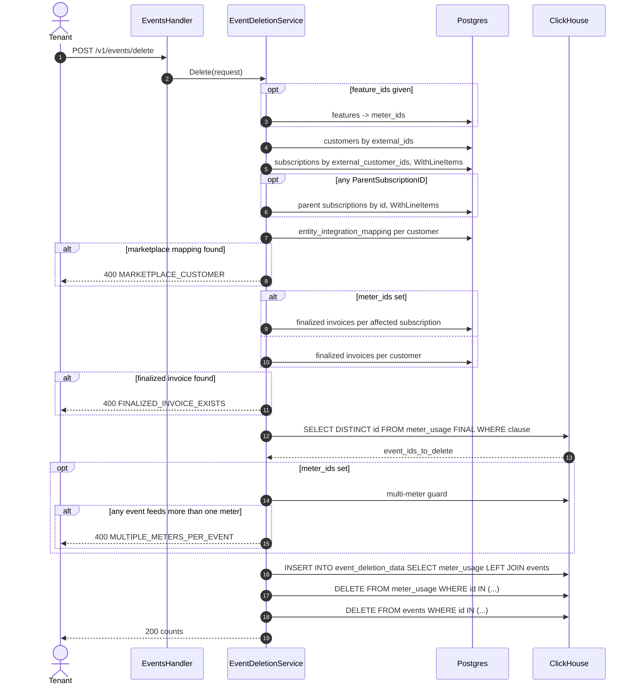

# PRD — Bulk Event Deletion

Author: Tsage  
Date: 2026-09-29  
Ticket: FLE-687

---

## 1. Overview

A tenant-facing bulk API that hard-deletes ingested events and the meter usage they produced. The tenant names the customers and the period, and optionally narrows by feature or by exact event id. The request is refused outright if anything in scope has already been invoiced or belongs to a marketplace customer. What is about to be destroyed is recorded in a new S3-backed ClickHouse table before the deletes run.

Deletion is all-or-nothing. There is no partial outcome.

---

## 2. Problem & Context

### Current Behavior

Events are published to the Kafka `events` topic and consumed by **two independent consumer groups**: `v1_event_processing` writes ClickHouse `events`, and `v1_meter_usage_tracking` writes ClickHouse `meter_usage`. The tracking service matches each event against every meter registered for its `event_name` and writes **one `meter_usage` row per matched meter**, so one event becomes N rows keyed `(id, meter_id)` where `id` is the event id.

Billing reads `meter_usage` exclusively, always filtered on `external_customer_id`. The `events` table is read only by the event browser and the debug endpoint.

There is no deletion path for either table.

### Problem

Tenants ingest events with wrong data and cannot fix it themselves. Ola Krutrim and Simplismart both hit this repeatedly, and the only route is a support thread ending in manual work on our side: locate the events, delete the `meter_usage` rows, delete the events, then reprocess the corrected events. The threads do not close because the mistake recurs.

The task is simple and the tenant knows exactly which events are wrong. They are blocked only because there is no API.

### Expected Outcome

The tenant deletes their own wrong events and re-ingests the corrected ones, which reprocess through the normal pipeline so `meter_usage` recomputes on its own. No support thread, no manual database work, and the tenant owns the outcome.

---

## 3. Goals & Non-Goals

### Goals

- Bulk hard deletion of events from `meter_usage` and `events`, scoped by customer and period, optionally narrowed by feature or event id.
- Refuse the request if any affected subscription holds a finalized invoice in the period.
- Refuse the request if any customer in scope has a marketplace agreement.
- Refuse the request if deleting the matched events would strand usage on a meter the request did not name.
- A permanent record of every deleted event, written before anything is destroyed.

### Non-Goals

- **No partial deletion.** The request deletes everything it matched or nothing.
- **Unprocessed events are out of scope.** An event with no `meter_usage` row is in neither the id set nor the record, by construction. It is about to be processed anyway.
- **`raw_events` is out of scope.** Written by the upstream Bento pipeline, not by this repository.
- No soft delete, no undo.
- No deletion for marketplace customers, under any condition.
- No change to how `revenue_facts`, coupon applications or entitlement grants recompute.

---

## 4. Use Cases

### UC1 — Ola Krutrim: wrong property value across many events

Ola ingests voice events whose `duration` property is wrong and needs them gone so they can re-send with the corrected value.

Expected: Ola names the customer, the period, and either the feature or the exact event ids. If nothing in scope has been invoiced, the events and their meter usage are deleted and Ola re-ingests. If the period has been invoiced, the request fails naming the blocking invoice.

### UC2 — Simplismart: delete and reprocess

Simplismart repeatedly asks us to delete a set of events so they can re-send them. Same endpoint, same flow, no involvement from us.

---

## 5. Requirements

### Functional Requirements

**R1.** `POST /v1/events/delete` takes the customers and the period, optionally narrowed by `feature_ids` or `event_ids`, and deletes the matching events from `meter_usage` and `events`.

**R2.** Every deleted event is recorded in `event_deletion_data` before either delete runs, stamped with who deleted it, when, and under which request id.

**R3.** The record lives in an S3-backed ClickHouse table and is never exported anywhere else.

**R4.** The request fails as a whole on the first guard that trips. Nothing is deleted on a failed request.

**R5.** A failure returns a single reason from a fixed enum plus the identifiers available at that point.

**R6.** `POST /v1/events/delete/preview` runs the same guards and the same id resolution, deletes nothing, and returns the usage as it would stand once the matched events are gone.

**R7.** Every step logs at info level on success and error level on failure, carrying the identifiers involved.

### Business Rules

**BR1.** Refused if any affected subscription holds a `FINALIZED` invoice whose period touches `[period_start, period_end)`. Overlap in either direction counts.

**BR2.** Affected subscriptions are those whose line items carry a meter in scope. Parent subscriptions are pulled in before the meter match, because an `inherited` child carries no line items of its own. When no `feature_ids` are given there is no meter set, so the guard runs at customer level over every customer in scope.

**BR3.** Refused if any customer in scope has a mapping in `entity_integration_mapping` with `entity_type = CUSTOMER` and a marketplace `provider_type`.

**BR4.** Refused if any matched event also carries `meter_usage` on a meter the request did not name. The request did not ask for that usage to go, so nothing is deleted and the request fails instead.

**BR5.** The delete clause is built against `meter_usage` only. It is the one table carrying every filter dimension, and `events` has no meter column at all.

**BR6.** The event id set and the record are both derived from `meter_usage` with the same predicate, so nothing can be deleted without having been recorded.

**BR7.** `meter_usage` is deleted before `events`. A surviving `events` row has no reader. A surviving `meter_usage` row keeps billing.

**BR8.** Deletion is a user-only capability, not assignable to a service account.

### Validations / Constraints

**V1.** `external_customer_ids` non-empty. `period_start` and `period_end` present, `period_start` before `period_end`.

**V2.** Every `external_customer_id` and every `feature_id` must resolve in this environment.

**V3.** When `event_ids` is provided, `external_customer_ids` must contain exactly one entry and `feature_ids` must be empty.

---

## 6. Product Behavior and Workflow

### The three cases

| Case | Request | Invoice guard | Multi-meter guard |
|---|---|---|---|
| 1 | customers + period | customer level | not needed |
| 2 | customers + `feature_ids` + period | subscription level, narrowed by meter | **required** |
| 3 | one customer + `event_ids` + period | customer level | not needed |

Cases 1 and 3 need no multi-meter guard because their clause carries no meter filter, so every meter row for every matched event is already in the id set and nothing can be stranded.

### Pseudocode

```
request:
{
  external_customer_ids: [...],    // required
  period_start,                    // required
  period_end,                      // required
  feature_ids: [...],              // optional
  event_ids: [...],                // optional
}

validation:
    external_customer_ids not empty
    period_start and period_end present, period_start < period_end
    every external_customer_id resolves
    every feature_id resolves
    if event_ids not empty:
        len(external_customer_ids) == 1
        feature_ids must be empty

// ---------- resolve meters, case 2 only ----------
meter_ids = []
if feature_ids not empty:
    meter_ids = features where feature_id in feature_ids -> meter_id

// ---------- customers and their subscriptions, with line items ----------
customers = CustomerRepo.List(ExternalIDs: external_customer_ids)
subs      = SubRepo.List(ExternalCustomerIDs: external_customer_ids, WithLineItems: true)

// ---------- pull parent subscriptions in, with line items ----------
// before the meter match: an inherited child has no line items, the meter lives on the parent
parent_ids = { s.ParentSubscriptionID for s in subs if set }.distinct()
if parent_ids not empty:
    subs += SubRepo.List(SubscriptionIDs: parent_ids, WithLineItems: true)

customer_ids_to_check = ({ c.ID for c in customers } + { s.CustomerID for s in subs }).distinct()

// ---------- marketplace guard ----------
for each customer_id in customer_ids_to_check:
    if entity_integration_mapping exists with
         entity_id = customer_id, entity_type = CUSTOMER,
         provider_type in (aws_marketplace, gcp_marketplace, azure_marketplace):
        log error
        return error MARKETPLACE_CUSTOMER with customer_id

// ---------- invoice guard ----------
if meter_ids not empty:
    // case 2: only the subscriptions carrying those meters
    affected = { s for s in subs if any(li.MeterID in meter_ids for li in s.LineItems) }
    for each sub in affected:
        finalized = InvoiceRepo.List(
            SubscriptionID:  sub.ID,
            InvoiceStatus:   FINALIZED,
            PeriodStartLTE:  period_end,
            PeriodEndGTE:    period_start,
        )
        if finalized not empty:
            log error
            return error FINALIZED_INVOICE_EXISTS with sub.ID, finalized[0].ID
else:
    // case 1 and 3: no meter set to narrow with
    for each customer_id in customer_ids_to_check:
        finalized = InvoiceRepo.List(
            CustomerID:      customer_id,
            InvoiceStatus:   FINALIZED,
            PeriodStartLTE:  period_end,
            PeriodEndGTE:    period_start,
        )
        if finalized not empty:
            log error
            return error FINALIZED_INVOICE_EXISTS with customer_id, finalized[0].ID

// ---------- build the clause, against meter_usage ----------
clause = tenant_id = ? AND environment_id = ?
       AND external_customer_id IN external_customer_ids
       AND timestamp >= period_start AND timestamp < period_end
if meter_ids not empty: clause += AND meter_id IN meter_ids
if event_ids not empty: clause += AND id IN event_ids

// ---------- resolve the event id set ----------
event_ids_to_delete = SELECT DISTINCT id FROM meter_usage FINAL WHERE clause
if event_ids_to_delete empty:
    return success { deleted_events: 0 }

// ---------- multi-meter guard, case 2 only ----------
if meter_ids not empty:
    offending = SELECT count() AS event_count,
                       groupUniqArrayArray(meters) AS meters_involved
                FROM (
                    SELECT id, groupUniqArray(meter_id) AS meters
                    FROM meter_usage FINAL
                    WHERE tenant_id = ? AND environment_id = ?
                      AND id IN event_ids_to_delete
                    GROUP BY id
                    HAVING length(meters) > 1
                )
    if offending.event_count > 0:
        log error
        return error MULTIPLE_METERS_PER_EVENT with event_count, meters_involved

// ---------- record, then delete ----------
INSERT INTO event_deletion_data
SELECT m.id, m.meter_id, m.tenant_id, m.environment_id, m.external_customer_id,
       m.event_name, m.source, e.timestamp, e.ingested_at,
       m.qty_total, m.unique_hash, m.properties,
       now64(3), {deleted_by}, {request_id}
FROM meter_usage FINAL AS m
LEFT JOIN events FINAL AS e ON m.id = e.id
WHERE m.tenant_id = ? AND m.environment_id = ?
  AND m.id IN event_ids_to_delete

DELETE FROM meter_usage WHERE tenant_id = ? AND environment_id = ? AND id IN event_ids_to_delete
DELETE FROM events      WHERE tenant_id = ? AND environment_id = ? AND id IN event_ids_to_delete

return success { request_id, deleted_events, deleted_meter_usage_rows }
```

### Notes on the resolution

**Parent subscriptions are pulled in before the meter match.** An `inherited` subscription carries no line items, so the meter lives on the parent. `ExternalCustomerIDsForSubscription` cannot be used for this: it walks a `parent` subscription **down** to its inherited children and returns only the child's own customer when called on a child.

**`?? ParentSubscriptionID` is not needed in the invoice guard.** The parent subscription is already in `subs` after the pull, so the meter match finds it directly and its own `SubscriptionID` is what the invoice lookup uses. `delegated_invoicing` keeps its invoice under its own subscription id, so it resolves to itself.

**The invoice query is the overlap test.** `PeriodStartLTE: period_end` with `PeriodEndGTE: period_start` returns every finalized invoice whose period touches the requested one, in either direction. Any result refuses the request, with no further comparison.

**Terminated line items are still found.** `WithLineItems: true` eager-loads with `status = published` as its only predicate, no `end_date` filter. A line item that has started is end-dated rather than removed, and only a never-started one is marked `status = deleted`. Anything that could have appeared on an invoice is retrievable.

**All subscription statuses are included.** `SubRepo.List` applies the status predicate only when the filter's status slice is non-empty. Unset returns `cancelled` and `paused` too, which is required because a churned customer's cancelled subscription still holds finalized invoices.

**Pagination.** `NewNoLimitSubscriptionFilter()` is required. `NewSubscriptionFilter()` carries `Limit: 50`.

**The clause is `meter_usage`-only.** `events` has no `meter_id` column, so it is never addressed by anything but event id.

**`FINAL` is required on every read.** `meter_usage` is a `ReplacingMergeTree` and the same event legitimately lands two or three times. Without it the id set and the record would both double-count.

**The join exists for two columns.** Every other log column is on `meter_usage`. `event_timestamp` and `event_ingested_at` come from `events`, because `meter_usage.timestamp` is `DateTime` (second precision) and its `ingested_at` is when the meter row landed rather than the event row. `LEFT` so a `meter_usage` row whose `events` row is missing is still recorded, with those two columns empty.

### Sequence Diagram



### Service Structure

`Delete` validates, resolves the meter set, runs the two guards, resolves the id set, runs the multi-meter guard, then calls `Persist(event_ids_to_delete)` which writes the record and performs the two deletes.

`Preview` runs the same guards and the same id resolution, then calls the supported read paths with `exclude_event_ids` set to that id set. It never calls `Persist`.

---

## 7. Data Model

### `event_deletion_data` — new ClickHouse table, S3-backed

```sql
CREATE TABLE IF NOT EXISTS flexprice.event_deletion_data
(
    event_id             String,
    meter_id             LowCardinality(String),
    tenant_id            LowCardinality(String),
    environment_id       LowCardinality(String),
    external_customer_id LowCardinality(String),
    event_name           LowCardinality(String),
    source               LowCardinality(String) DEFAULT '',
    event_timestamp      DateTime64(3),
    event_ingested_at    DateTime64(3),
    qty_total            Decimal(25, 15),
    unique_hash          String DEFAULT '',
    properties           String DEFAULT '' CODEC(ZSTD(3)),
    deleted_at           DateTime64(3),
    deleted_by           String,
    request_id           String
)
ENGINE = MergeTree
PARTITION BY toYYYYMMDD(deleted_at)
ORDER BY (tenant_id, environment_id, external_customer_id, deleted_at, event_id)
SETTINGS storage_policy = '<s3_backed_policy>', index_granularity = 8192;
```

| Column | Source |
|---|---|
| `event_id` | `meter_usage.id` |
| `meter_id`, `qty_total`, `unique_hash` | `meter_usage` |
| `tenant_id`, `environment_id`, `external_customer_id` | `meter_usage` |
| `event_name`, `source`, `properties` | `meter_usage` |
| `event_timestamp`, `event_ingested_at` | `events` |
| `deleted_at`, `deleted_by`, `request_id` | stamped by the `INSERT ... SELECT` |

- **No TTL.** The record is permanent, and the S3 storage policy is what makes that cheap.
- **No `customer_id`.** `meter_usage` has no such column and `events.customer_id` is nullable and frequently empty, since ingestion requires only one of the two and `processEvent` never resolves it before writing. `external_customer_id` is `NOT NULL` on `meter_usage`.
- **No `export_url`.** There is no export step.
- **`MergeTree`, not `ReplacingMergeTree`.** One write per deleted event.
- **One row per `(event_id, meter_id)`.** An event matching three meters produces three rows.
- `qty_total` carries `meter_usage`'s own type, which is `Decimal(25, 15)` in the versioned migration and `Decimal(18, 8)` in the prod baseline snapshot. Confirm which the target deployment has before applying.

### `events` and `meter_usage`

Rows are hard-deleted. No schema change on either table. `events` in production carries `PROJECTION proj_by_customer_event` and partitions by `toYYYYMM(timestamp)`, which is out of MVP scope and handled alongside the replica work.

### `MeterUsageQueryParams`

One new field, `IDs []string`, with a matching `id IN (...)` predicate in `BuildWhereClause`. Everything else the clause needs is already there.

---

## 8. Contracts

### `POST /v1/events/delete`

`@x-scope "delete"`

```json
{
  "external_customer_ids": ["cust_ext_9"],
  "feature_ids": ["feat_01H..."],
  "event_ids": [],
  "period_start": "2026-03-20T15:04:05Z",
  "period_end":   "2026-03-27T15:04:05Z"
}
```

Success:

```json
{
  "request_id": "req_01H...",
  "deleted_events": 96000,
  "deleted_meter_usage_rows": 131000
}
```

The deleted set is never enumerated in the response. It lives in `event_deletion_data`, queryable by `request_id`.

### `POST /v1/events/delete/preview`

`@x-scope "read"`

Request identical. Runs the same guards and id resolution, deletes nothing, and returns whatever the supported read paths return with `exclude_event_ids` set to the resolved id set. Today that is the detailed usage analytics response. Not the Delete response.

A separate route rather than a flag, so the preview is `read`-scoped while Delete is `delete`-scoped.

### Failure reasons

A single reason per failure, returned through `ierr.WithReportableDetails` with whatever identifiers are in hand.

| Reason | Identifiers returned |
|---|---|
| `MARKETPLACE_CUSTOMER` | `external_customer_id`, `provider_type` |
| `FINALIZED_INVOICE_EXISTS` | `external_customer_id`, `subscription_id` (case 2 only), `invoice_id`, invoice period |
| `MULTIPLE_METERS_PER_EVENT` | `event_count`, `meters_involved` |

```go
return ierr.NewError("finalized invoice exists in the requested period").
    WithHint("Deletion is not allowed for a period that has already been invoiced").
    WithReportableDetails(map[string]interface{}{
        "reason":               types.EventDeletionBlockFinalizedInvoiceExists,
        "external_customer_id": extID,
        "subscription_id":      subID,
        "invoice_id":           inv.ID,
    }).
    Mark(ierr.ErrInvalidOperation)
```

Every response path is bounded. Counts on success, identifiers on refusal, a count and the meter set on the multi-meter refusal. Nothing scales with the event count.

### Errors

| HTTP | `ierr` mark | Condition |
|---|---|---|
| 400 | `ErrValidation` | Required field missing, period inverted, `event_ids` with more than one customer or with `feature_ids`, unknown customer or feature |
| 400 | `ErrInvalidOperation` | Any guard trips |
| 403 | `ErrPermissionDenied` | Caller lacks the capability, or is a service account |
| 500 | `ErrDatabase` | The record insert or either delete failed |

### Preview exclusion

`exclude_event_ids []string` on `MeterUsageQueryParams` and `MeterUsageDetailedAnalyticsParams`, applied as a `NOT IN` predicate in `BuildWhereClause` and `BuildDetailedWhereClause`. Those two builders are what every meter-usage read funnels through.

The totals must be recomputed with the rows excluded rather than derived by subtraction. The aggregators are `MAX(qty_total)`, `AVG(qty_total)`, `argMax(qty_total, timestamp)` and `COUNT(DISTINCT unique_hash)`, so for MAX, LATEST, AVG and COUNT_UNIQUE the deleted quantity is not the delta.

### UI

_[To be filled in.]_

---

## 9. Edge Cases

| Scenario | Expected Behavior |
|---|---|
| Matched event also carries usage on a meter not named by `feature_ids` | Request fails with `MULTIPLE_METERS_PER_EVENT`. Nothing deleted. |
| `feature_ids` not given | No meter filter, so every meter row for every matched event is in scope and the multi-meter guard is unnecessary. |
| `event_ids` with more than one `external_customer_id`, or alongside `feature_ids` | `400 ErrValidation`. |
| Customer has five subscriptions, only one carries a meter in scope | Only that one is checked. The other four's invoices are irrelevant. |
| No `feature_ids` | Guard runs at customer level over every customer in scope, because there is no meter set to narrow with. |
| Customer has an `inherited` subscription | The child owns no line items. The parent is pulled in before the meter match and checked there. |
| Customer has a `grouped_invoicing` subscription | The child owns its line items and matches the meter. Its parent is also pulled in, so whichever holds the invoice is checked. |
| `delegated_invoicing` subscription | Checked as itself. Its invoice sits under its own `subscription_id`. |
| Subscription is cancelled or paused | Still checked. All statuses are returned. |
| Invoice for the period is `DRAFT` or `SKIPPED` | Not a blocker. Only `FINALIZED` blocks. A draft is recomputed after deletion. |
| Draft invoice recomputes to zero after deletion | It flips to `SKIPPED`: no invoice number, no vendor sync. |
| Finalized invoice ends exactly at `period_start`, or starts exactly at `period_end` | Blocks. The filter operators are `>=` and `<=`, so an adjacent invoice sharing a boundary is returned. A known over-block, one instant wide, accepted. |
| Backdated event inside a finalized period the invoice never counted | Blocked anyway. `invoice_line_items` store the aggregate quantity, not the event set, so the period is the only available proxy. |
| Event id outside the period, or belonging to another customer | Matches nothing, silently not deleted. The tenant's responsibility, and `request_id` pins it. |
| Event present in `events` with no `meter_usage` row | Out of scope by construction. Not in the id set, not recorded, not deleted. |
| `meter_usage` row present with no `events` row | Recorded with the two timestamp columns empty, then deleted. |
| Clause matches nothing | `200` with `deleted_events: 0`. No record, no deletes. |
| Redis dedup lock still held for a deleted event id | Re-ingesting the same event id within the 24h `eventDeduplicationLockTTL` is silently dropped where dedup is enabled. Since delete-then-reingest is the intended workflow, this needs the lock released on deletion. See Open Questions. |
| `POST /v1/events/raw/reprocess/*` run after a deletion | `FindUnprocessedRawEvents` anti-joins `raw_events` against `events`, so a deleted event reads as unprocessed and is republished with the same id. `raw_events` is out of scope. See Open Questions. |

---

## 10. Acceptance Criteria

**AC1.** A request whose period overlaps a `FINALIZED` invoice on an affected subscription fails with `FINALIZED_INVOICE_EXISTS` and the blocking invoice id, in all three overlap shapes. Nothing is deleted.

**AC2.** A finalized invoice entirely before `period_start` or entirely after `period_end` does not block.

**AC3.** A request naming a customer with a marketplace mapping fails with `MARKETPLACE_CUSTOMER`, and nothing is deleted for any customer in that request.

**AC4.** For a customer with two subscriptions where only one carries a meter in scope, a finalized invoice on the other does not block.

**AC5.** A request with no `feature_ids` is blocked by a finalized invoice on any subscription of any customer in scope.

**AC6.** A request whose `feature_ids` name only one of an event's two meters fails with `MULTIPLE_METERS_PER_EVENT`, returning the count and the meters involved. Nothing is deleted.

**AC7.** An event billed on the parent of an `inherited` child blocks the request.

**AC8.** A finalized invoice on a `cancelled` subscription blocks the request.

**AC9.** A subscription whose line item for the meter has been end-dated since the invoice was finalized still blocks.

**AC10.** `event_ids` with more than one `external_customer_id`, or alongside `feature_ids`, returns `400 ErrValidation`.

**AC11.** After a successful deletion, no row for the deleted event ids remains in `meter_usage` or `events`.

**AC12.** After a successful deletion, `event_deletion_data` holds one row per `(event_id, meter_id)` with the quantity and payload as they were before deletion, stamped with `deleted_at`, `deleted_by` and `request_id`.

**AC13.** The record rows exist before either delete is issued.

**AC14.** The delete endpoint returns `403` for a service-account caller regardless of assigned roles.

**AC15.** Preview writes nothing, returns the same failure reason as Delete for the same request, and its usage figures match a fresh analytics query taken after the deletion has run, for SUM, COUNT, MAX, LATEST, AVG and COUNT_UNIQUE meters.

---

## 11. Open Questions & Decisions

### Open Questions

**Q1 — ClickHouse deletion guarantees.** The flow assumes both deletes take. A delete returns once the mutation is accepted, not once rows are gone. Three decisions sit here:

- `mutations_sync = 1` (wait on the current replica) or `2` (wait on all replicas), or neither.
- Whether the handler waits for the mutation to complete before responding, or returns once it is queued.
- Whether the `events` delete is issued only after the `meter_usage` delete is confirmed, or both are fired and the outcome checked afterwards. Sequencing them is what prevents an orphaned `meter_usage` row that keeps billing with no `events` row to trace it to, which is the one failure state that matters. The reverse leftover is inert, since `FindUnprocessedEvents` has no production caller.

Until this is settled, every failure is logged at error level with the request id, the event ids and the table involved.

**Q2 — Multi-meter guard strictness.** The guard as written refuses when an event feeds **more than one meter at all**. The narrower form refuses only when it feeds a meter **outside** the named set (`meter_id NOT IN (meter_ids)`), which allows a tenant who names every feature an event touches. Both are one query. The written form never under-blocks but falsely refuses that case.

**Q3 — S3 storage policy provisioning.** `storage_policy` is server configuration, not DDL. It must exist in `config.d` with an `<s3>` disk on every deployment that runs the migration, and local docker-compose has none. Open: whether the policy name is configurable per deployment, and what the local fallback is.

**Q4 — What the preview reports.** The detailed usage analytics response today. Each addition means adding `exclude_event_ids` to another read path. Open: whether cost analytics, the affected subscriptions, or the draft invoices that would be recomputed should be included.

**Q5 — RBAC role.** `write` on `event` is disqualified, since `event_ingestor` grants `{"event": ["write"]}` and every ingestion key could then destroy billing data. `super_admin` needs no change but grants this to everyone who holds it. A new user-only role plus an `ActionDelete` value is explicit and grantable independently, and `ValidateRoles` already enforces the user-type restriction. `super_admin` holds `{"*": ["*"]}` and will match `delete` regardless, so whether the route should additionally require the explicit role is part of this.

**Q6 — Concurrency between the guard and the delete.** Nothing prevents an invoice finalizing between the invoice guard and the mutation. `AutoInvoiceThresholdBillingWorkflow` finalizes mid-period invoices every five minutes. `pg_advisory_xact_lock` is transaction-scoped and cannot span an asynchronous mutation, and the Redis `Locker` fails open when Redis is down.

**Q7 — Redis dedup lock on re-ingestion.** `eventDeduplicationLockTTL` is 24 hours, so re-sending a corrected event under the same id within that window is silently dropped where dedup is enabled. Since delete-then-reingest is the point of the feature, deletion probably needs to release those locks.

**Q8 — `raw_events` and reprocessing.** Out of scope for deletion, but `POST /v1/events/raw/reprocess/pending` defines unprocessed as present in `raw_events` and absent from `events`, so a deleted event reads as unprocessed and returns with the identical id. Options: delete from `raw_events` too, or teach the reprocess path to skip deleted ids.

**Q9 — Revenue facts rollup trigger.** Deletion changes no `ingested_at`, and `scanScopeFor` narrows the rollup using `GetUsageActivitySince` which filters on it, so an affected subscription reads as quiet and is skipped until the weekly full rebuild. `FINAL` rows are out of scope by construction. Open: whether deletion enqueues a rollup. Owner: revenue-facts.

**Q10 — Coupon application drift.** Pre-existing. On a draft recompute, invoice totals and line items stay correct, but the persisted `coupon_applications` rows are skipped by the `(invoice_id, coupon_id)` idempotency check and keep their pre-deletion amounts. `recalculateDiscountOnInvoice` wipes and reapplies, but `wipeCouponApplications` does not decrement `total_redemptions`, so reusing it double-counts redemptions on one-off coupons.

**Q11 — Request caps.** Caps on `external_customer_ids`, `feature_ids`, `event_ids` and the period width. `BulkIngestEventRequest` uses `max=1000` and ingestion carries a 32 MiB body cap as precedent.

### Decisions

| Decision | Reason |
|----------|--------|
| Hard delete from both tables | No soft-delete flag exists on either, and no read path filters on one. |
| No partial deletion | A half-executed request leaves the tenant unable to reason about their own data. |
| Fail on the first guard that trips, single reason enum | Nothing iterates per event, so there is no per-event verdict to accumulate. |
| `external_customer_ids` and the period always required | The customer scopes the ClickHouse clause, and the period is what the invoice guard is cleared against. |
| `event_ids` requires exactly one customer and excludes `feature_ids` | An event belongs to one customer and the clause cannot disambiguate. |
| Clause built against `meter_usage` only | It is the one table carrying every filter dimension. `events` has no meter column. |
| Event id set resolved first, both deletes keyed on it | One delete shape, and the id set and record share a source so nothing is deleted unrecorded. |
| Unprocessed events out of scope | They have no `meter_usage` row, so they are in neither the id set nor the record, and they are about to be processed anyway. |
| Multi-meter guard refuses rather than widening the deletion | The request did not ask for that usage to go. |
| Invoice overlap via `PeriodStartLTE: period_end` and `PeriodEndGTE: period_start` | Returns every finalized invoice whose period touches the requested one, in either direction. Any result refuses. |
| Guard is subscription-level with `feature_ids`, customer-level without | A finalized invoice on a subscription the deletion cannot touch is not a reason to refuse. Without a meter set there is nothing to narrow with. |
| Parent subscriptions pulled in before the meter match | An `inherited` child has no line items, so the meter lives on the parent. |
| `ExternalCustomerIDsForSubscription` not used for the parent hop | It walks a parent down to its inherited children and returns only the child's own customer when called on a child. |
| Line items read through the subscription with `WithLineItems: true` | `subscription_line_item.customer_id` is the owning subscription's customer, so a meter-wide query filtered by the named customer misses an `inherited` child's parent. |
| No subscription status filter | `SubRepo.List` applies it only when set. Unset includes `cancelled` and `paused`, which still hold finalized invoices. |
| `NewNoLimitSubscriptionFilter()` | The default constructor carries `Limit: 50`. |
| `meter_usage` deleted before `events` | A surviving `events` row has no reader. A surviving `meter_usage` row keeps billing. |
| Record written by `INSERT ... SELECT` before the deletes | No row reaches Go, so a lakh of events costs nothing in memory, and nothing is destroyed before it is recorded. |
| Record driven from `meter_usage`, left-joined to `events` | Every log column but two is on `meter_usage`. The join supplies `event_timestamp` and `event_ingested_at`, since `meter_usage.timestamp` is second-precision and its `ingested_at` is when the meter row landed. |
| `FINAL` on every `meter_usage` read | It is a `ReplacingMergeTree` and the same event legitimately lands two or three times. |
| S3-backed, no TTL, no export step | The record is permanent and the storage policy is what makes that cheap. |
| No `customer_id` on the record | `meter_usage` has no such column and `events.customer_id` is nullable and frequently empty. |
| `request_id` on every row | The handle for reading back everything one request deleted. |
| Marketplace customers refused entirely | `usage_records` are reported to AWS, GCP and Azure every three hours. Once reported the marketplace has billed the customer, and there is no Flexprice invoice to point at. |
| Preview and Delete as separate routes | Preview is `read`-scoped, Delete is `delete`-scoped. |
| Two-level logging throughout | Info on every completed step, error on every failure, both carrying the identifiers involved. |
| `events` projection and monthly partitioning out of MVP scope | Handled alongside the replica work. `meter_usage` has no projection and daily partitions. |
| `raw_events` out of scope | Written by the upstream Bento pipeline, not by this repository. |
