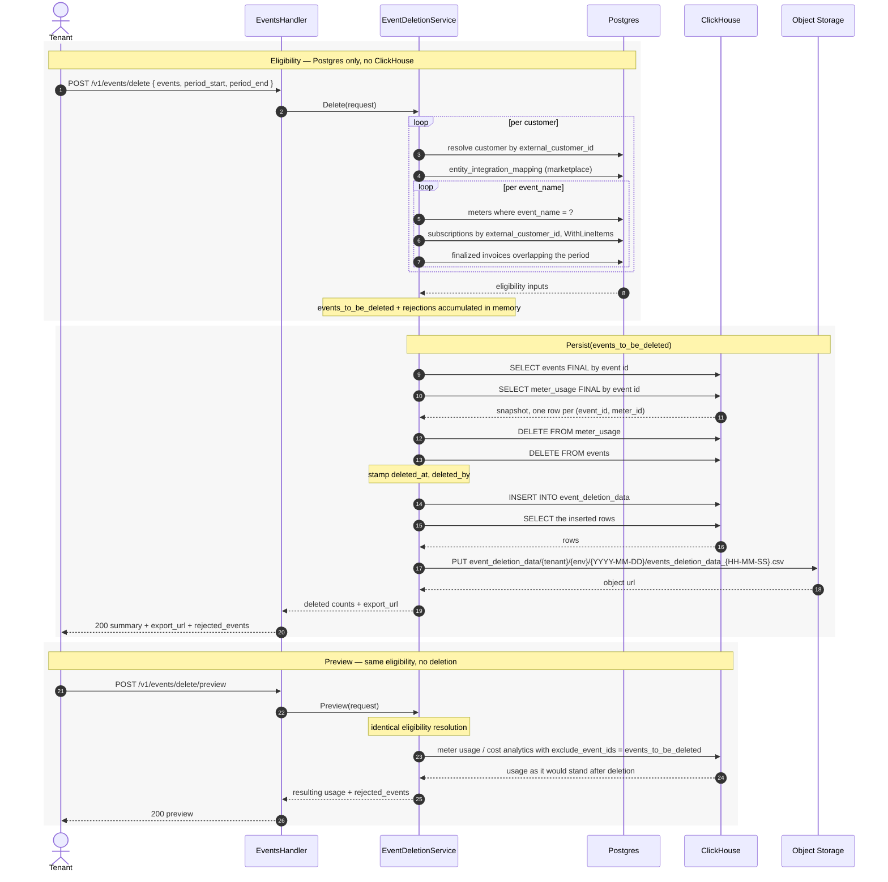

# PRD — Bulk Event Deletion

Author: Tsage  
Date: 2026-09-29  
Ticket: FLE-687

---

## 1. Overview

A tenant-facing bulk API that hard-deletes ingested events and the meter usage they produced. The tenant sends the events grouped by customer and event name, plus the period they belong to. The system refuses anything a finalized invoice already billed and anything belonging to a marketplace customer, deletes the rest from `meter_usage` and `events`, records what it destroyed in a new ClickHouse table, and exports that record to Flexprice-owned object storage.

A preview endpoint runs the same eligibility resolution and returns the usage as it would stand once those events are gone, without deleting anything.

Affects the metering pipeline (`events`, `meter_usage`), every billing read derived from `meter_usage`, and the revenue-facts shadow path.

---

## 2. Problem & Context

### Current Behavior

Events enter through `POST /v1/events` or `POST /v1/events/bulk`, are published to the Kafka `events` topic, and are consumed by **two independent consumer groups**:

| Consumer group | Service | Writes to |
|---|---|---|
| `v1_event_processing` | `EventConsumptionService` | ClickHouse `events` |
| `v1_meter_usage_tracking` | `MeterUsageTrackingService` | ClickHouse `meter_usage` |

`MeterUsageTrackingService` matches the event against every meter registered for its `event_name`, applies each meter's filters, extracts a quantity, and writes **one `meter_usage` row per matched meter**. `meter_usage.id` is the event id, so a single event becomes N rows keyed `(id, meter_id)`.

Billing reads `meter_usage` exclusively and always filters on `external_customer_id`. The `events` table is read only by the event browser and the debug endpoint. `FindUnprocessedEvents`, the only method that would re-drive work from the `events` table, has no production caller.

There is no deletion path for either table. No Go code in the repository issues a ClickHouse mutation.

### Problem

Tenants ingest events with wrong data and cannot fix it themselves. Ola-Krutrim and Simplismart both hit this repeatedly, and the only route available is a support thread that ends in manual work on our side: locate the events, delete the `meter_usage` rows, delete/update the events, then reprocess the corrected events so usage recomputes. Every occurrence is a back-and-forth thread, and the threads do not close because the same mistake recurs.

### Expected Outcome

The tenant deletes their own wrong events and re-ingests the corrected ones. Re-ingestion reprocesses through the normal pipeline and `meter_usage` recomputes on its own. No support thread, no manual database work on our side, and the tenant owns the outcome.

---

## 3. Goals & Non-Goals

### Goals

- Bulk hard deletion of events from `meter_usage` and `events`, grouped by customer and event name, bounded by a period.
- Refuse any event group whose period overlaps a finalized invoice.
- Refuse any event belonging to a customer with a marketplace agreement.
- A durable record of every deleted event, retained in ClickHouse for a bounded window and exported to Flexprice-owned object storage.
- Per-group rejection reasons in the response, grouped by reason.
- A preview that reports the resulting usage without deleting anything.

### Non-Goals

- **`raw_events` is out of scope.** It is written by the upstream Bento pipeline, not by this repository, which has read-only access to it.
- No soft delete. There is no `deleted` flag on either table and no filtered read path.
- No undo. The archive is a record, not a restore mechanism.
- No deletion for customers with a marketplace agreement, under any condition.
- No change to how `revenue_facts`, coupon applications, or entitlement grants recompute. Their interaction with deletion is recorded here and owned elsewhere.

---

## 4. Use Cases

### UC1 — Ola-Krutrim: wrong property value across many events

Ola ingests voice events whose `duration` property is wrong. They need those events gone so they can re-send them with the corrected duration. Today this is a support thread per occurrence, and it recurs.

Expected behavior: Ola sends the affected event ids grouped by customer and event name with the period they fall in. Events in periods with no finalized invoice are deleted along with their meter usage. Ola re-ingests the corrected events, which reprocess normally and recompute usage. Events in an already-invoiced period come back rejected, naming the blocking invoice.

### UC2 — Simplismart: delete and reprocess

Simplismart repeatedly asks us to delete a set of events so they can re-send them. They already have the replacement events ready.

Expected behavior: same endpoint, same flow. They delete, then re-ingest. No involvement from us.

---

## 5. Requirements

### Functional Requirements

**R1.** The tenant can delete events in bulk through `POST /v1/events/delete`, sending the event ids grouped by `external_customer_id` and then by `event_name`, together with the period those events belong to.

**R2.** Eligible events are hard-deleted from both `meter_usage` and `events`.

**R3.** Every deleted event is recorded in `event_deletion_data` with the event payload and the meter usage it carried, stamped with who deleted it and when.

**R4.** The recorded rows are exported to Flexprice-owned object storage as CSV, and the object URL is returned to the tenant.

**R5.** The response reports how many events were requested, deleted and rejected, the export URL, and the rejected events grouped by the reason they were rejected.

**R6.** The tenant can preview the outcome through `POST /v1/events/delete/preview`, which deletes nothing and returns the usage as it would stand once the eligible events are gone.

**R7.** Every step logs at info level on success and at error level on failure, carrying the identifiers involved.

### Business Rules

**BR1.** An event name group is ineligible if any subscription carrying one of its meters, for that customer, holds a `FINALIZED` invoice whose period touches the requested period. Overlap in either direction blocks: the invoice period inside the requested period, the requested period inside the invoice period, or partial overlap at either end.

**BR2.** An event is ineligible if its customer has a mapping in `entity_integration_mapping` with `entity_type = CUSTOMER` and a marketplace `provider_type`. The rejection is per customer: no event for that customer is deletable.

**BR3.** `meter_usage` is deleted before `events`. The reachable partial state is then a leftover `events` row, which has no reader, rather than an orphaned `meter_usage` row that keeps billing.

**BR4.** A period whose events are blocked by a finalized invoice is blocked for that event name only. Other event names for the same customer, whose meters belong to subscriptions without a finalized invoice in the window, are still deletable.

**BR5.** Deletion is a user-only capability. It is not assignable to a service account.

**BR6.** An `external_customer_id` that does not resolve to a customer is rejected. The marketplace check is keyed on the internal `customer_id`, so the customer must exist before any further evaluation. The error is logged and evaluation proceeds to the next customer.

**BR7.** Deletion applies to events that have already been processed through the pipeline. An event that never produced `meter_usage` was never processed and never billed, so it carries no billing consequence either way.

### Validations / Constraints

**V1.** `events` is required and non-empty, `period_start` and `period_end` are required, and `period_start` must be before `period_end`.

---

## 6. Product Behavior and Workflow

### Main Flow

```
POST /v1/events/delete
      ↓
Eligibility resolution                               (Postgres only, no ClickHouse)
      ↓
per customer: resolve external_customer_id → customer
   ┌──────────────────────────┴──────────────────────────┐
   ↓ customer does not exist                             ↓ customer exists
reject every event for this customer                     ↓
reason = customer_not_found                   check entity_integration_mapping
                                                for a marketplace provider_type
                                   ┌──────────────────────┴──────────────────────┐
                                   ↓ a marketplace mapping exists                ↓ no marketplace mapping
                        reject every event for this customer                     ↓
                        reason = marketplace_customer                   per event_name:
                                                                          event_name → meter ids
                                                                          customer's subscriptions + line items
                                                                          subscriptions carrying those meters
                                                                          + parents of inherited subscriptions
                                                                          finalized invoices in the period
                                                      ┌───────────────────────────┴──────────────────┐
                                                      ↓ at least one finalized invoice               ↓ none
                                        reject this event_name's events                  add its events to
                                        reason = in_finalized_invoice                    events_to_be_deleted
                                                      ↓                                               ↓
                                                      └───────────────────────┬──────────────────────┘
                                                                              ↓
                                                        Persist(events_to_be_deleted)
                                                                              ↓
                                           snapshot: read events, read meter_usage (FINAL, by event id)
                                                                              ↓
                                                        batch DELETE meter_usage
                                                                              ↓
                                                        batch DELETE events
                                                                              ↓
                                                        stamp deleted_at, deleted_by
                                                                              ↓
                                                        INSERT into event_deletion_data
                                                                              ↓
                                                        read back, export CSV to object storage
                                                                              ↓
                                       merge Persist's result into the response built during eligibility
                                                                              ↓
                                             return summary + export_url + rejected_events
```

### Eligibility Resolution

The check answers one question per event-name group: **does a finalized invoice exist in the requested period on any subscription that carries one of this event name's meters, for this customer.**

```
events_to_be_deleted = []

for each cust in events:
    resolve customer for cust (external_customer_id)
    if not found:
        log error
        continue with next cust

    marketplace check for cust:
    if exists:
        log error
        continue with next cust

    for each event_name in cust:
        subs_under_observation = []
        fetch meter_ids from the meter table with event_name = event_name
        subs_of_cust = SubRepo.List(ctx, filter:
            ExternalCustomerID: [cust],
            WithLineItems:      true,
        )
        for s in subs_of_cust:
            for li in s.LineItems:
                if li.MeterID in meter_ids:
                    append(subs_under_observation, s.ParentSubscriptionID ?? s.ID)
                    break
        subs_under_observation = append(subs_under_observation, { s.ParentSubscriptionID for s in subs_of_cust if s.SubscriptionType == inherited })
        for each sub in subs_under_observation:
            finalized_invoices = InvoiceRepo.List(
                SubscriptionID:   sub,
                InvoiceStatus:    FINALIZED,
                PeriodStartLTE:   period_end,
                PeriodEndGTE:     period_start,
            )
            if finalized_invoices.length > 0:
                log error
                break and proceed with next event_name
        for each event in event_name:
            append(events_to_be_deleted, event)
```

#### Notes on the resolution

**No ClickHouse queries.** Meters come from the meter table, subscriptions and their line items from Postgres, invoices from Postgres. A request in which every group is rejected never touches ClickHouse.

**`break and proceed with next event_name`** skips the append below it. In Go this is a labelled `continue` on the event-name loop, not a bare `break`, which would fall through to the append.

**The invoice query is the overlap test.** `PeriodStartLTE: period_end` with `PeriodEndGTE: period_start` returns every finalized invoice whose period touches the requested one, in either direction: invoice inside the period, period inside the invoice, or partial overlap at either end. If anything comes back, the group is blocked. No further comparison is made.

**Meter resolution.** Meters are created from event names and the tenant cannot supply a meter id or meter name, so `meter.event_name = event_name` is authoritative. One event name can carry several meters, and which of them a specific event actually fed depends on that event's properties at ingestion time. Those properties live in ClickHouse and are deliberately not read here, so the meter set is a superset, which over-blocks and never under-blocks.

**Why line items come from the subscription.** `subscription_line_item.customer_id` is the owning subscription's customer. Filtering a meter-wide line item query by the event's customer returns nothing for an `inherited` child, whose line items belong to the parent's customer. Loading the customer's subscriptions with their line items and matching the meter in memory keeps the customer in scope without that hole.

**Why terminated line items are still found.** `WithLineItems: true` eager-loads with `status = published` as its only predicate, with no `end_date` filter, so an end-dated line item is returned. A line item that has started is end-dated rather than removed when deleted, and only a future-dated, never-started line item is marked `status = deleted`. Any line item that could have appeared on an invoice is therefore retrievable.

**Why all subscription statuses are included.** `SubRepo.List` applies the status predicate only when the filter's status slice is non-empty. Leaving it unset returns `cancelled` and `paused` subscriptions too, which is required because a churned customer's cancelled subscription still holds finalized invoices.

**Pagination.** `NewNoLimitSubscriptionFilter()` is required. `NewSubscriptionFilter()` carries `Limit: 50`.

**Subscription types.** `inherited` subscriptions carry no line items, so the meter loop never matches them, which is why their parents are appended separately. `grouped_invoicing` children do carry line items but their charges land on the parent's invoice, so `ParentSubscriptionID ?? ID` moves them to where the invoice lives. `standalone`, `parent` and `delegated_invoicing` hold their line items and their invoice on the same subscription, so they resolve to themselves.

### Sequence Diagram



### Service Structure

`Delete` is the entry point. It runs the eligibility resolution, accumulating `events_to_be_deleted` and the rejection map in memory, then calls `Persist(events_to_be_deleted)`. `Persist` performs the snapshot, the deletes, the log insert and the export, logs its own info and error lines, and returns what it achieved. `Delete` merges that into the response it has already built and returns.

`Preview` runs the same eligibility resolution and calls the usage paths with `events_to_be_deleted` as the exclusion list. It never calls `Persist`, and `Persist` never calls it.

### Alternate / Failure Flows

**Marketplace customer in the request.** The whole customer is rejected before any subscription lookup. Every event under that customer is recorded with reason `marketplace_customer` and the provider type.

**Finalized invoice overlapping the period.** The `(customer, event_name)` group is rejected with reason `in_finalized_invoice`, carrying the blocking invoice id and its period. Other event names for the same customer are evaluated independently.

**`external_customer_id` does not resolve.** Logged at error level, every event under that customer recorded as `customer_not_found`, evaluation proceeds to the next customer.

**Deletion fails for some events in either table.** See Open Questions. The current flow assumes the batched deletes succeed. Failures are logged at error level with the event ids and the table they survived in.

**Export fails.** Logged at error level. The rows remain in `event_deletion_data` for the retention window and can be exported by hand. The deletion itself is unaffected, and the response returns without an export URL.

---

## 7. Data Model

### ERD

```
[events]  (ClickHouse)                    [meter_usage]  (ClickHouse)
     │  id                                     │  id  (= event id)
     │                                         │  meter_id
     └────────── 1:N ──────────────────────────┘
                    │
                    │ deleted rows are recorded in
                    ▼
       [event_deletion_data]  (ClickHouse, NEW)
                    │
                    │ exported to
                    ▼
       [object storage]   S3 or GCS, Flexprice-owned

read-only inputs (Postgres)
  [customers] ──1:N──► [subscriptions] ──1:N──► [subscription_line_items]
        │                      │                         │ meter_id
        │                      └──1:N──► [invoices]
        │
        ├──1:N──► [entity_integration_mapping]   provider_type = *_marketplace
        │
  [meters]   event_name → meter_id
```

### Entity Changes

#### `event_deletion_data` — new ClickHouse table

```sql
CREATE TABLE IF NOT EXISTS flexprice.event_deletion_data
(
    event_id             String,
    meter_id             LowCardinality(String) DEFAULT '',
    tenant_id            LowCardinality(String),
    environment_id       LowCardinality(String),
    external_customer_id LowCardinality(String),
    customer_id          LowCardinality(String) DEFAULT '',
    event_name           LowCardinality(String) DEFAULT '',
    source               LowCardinality(String) DEFAULT '',
    event_timestamp      DateTime64(3),
    event_ingested_at    DateTime64(3),
    qty_total            Decimal(25, 15) DEFAULT 0,   -- must match the deployed meter_usage.qty_total
    unique_hash          String DEFAULT '',
    properties           String DEFAULT '' CODEC(ZSTD(3)),
    deleted_at           DateTime64(3),
    deleted_by           String DEFAULT ''
)
ENGINE = MergeTree
PARTITION BY toYYYYMMDD(deleted_at)
ORDER BY (tenant_id, environment_id, external_customer_id, deleted_at, event_id)
TTL toDateTime(deleted_at) + INTERVAL 32 DAY
SETTINGS index_granularity = 8192;
```

Column provenance:

| Column | Source |
|---|---|
| `event_id` | `events.id`, equal to `meter_usage.id` |
| `meter_id`, `qty_total`, `unique_hash` | `meter_usage` |
| `tenant_id`, `environment_id` | either table |
| `external_customer_id` | `events.external_customer_id` |
| `customer_id` | `events.customer_id` only. `meter_usage` has no such column |
| `event_name`, `source`, `properties` | `events` |
| `event_timestamp`, `event_ingested_at` | `events`, prefixed to mark their origin |
| `deleted_at`, `deleted_by` | stamped on the snapshot before insert |

Decisions on this table:

- **`MergeTree`, not `ReplacingMergeTree`.** There is one write per deleted event. No deduplication is needed and no version column exists.
- **Partition and TTL key on `deleted_at`, never on `event_timestamp`.** A TTL on the event's own timestamp would expire the record of an old event's deletion immediately, before the export could run. Partitioning on `deleted_at` also lets the export walk whole partitions and lets TTL drop partitions rather than mutate.
- **One row per `(event_id, meter_id)`.** An event matching three meters produces three rows. The snapshot is two reads rather than a join, so an event present in `events` with no `meter_usage` row is still represented, with the meter columns empty.
- **No `export_url` column.** The export runs after the insert, so populating it would require an `ALTER UPDATE` mutation on the log table. The URL is returned in the API response only.
- `qty_total`, `unique_hash` and `meter_id` carry `meter_usage`'s own types. `qty_total` is `Decimal(25, 15)` in the versioned migration and `Decimal(18, 8)` in the prod baseline snapshot, so confirm which the target deployment has before applying.

#### `events` and `meter_usage`

Rows are hard-deleted. No schema change on either table.

`meter_usage` has daily partitions, no projection, and `external_customer_id` and `meter_id` high in the sort key, so deletes prune well.

`events` in production carries `PROJECTION proj_by_customer_event` and partitions by `toYYYYMM(timestamp)`. Out of MVP scope, handled alongside the replica work.

#### Read-only inputs

No changes. `meters`, `customers`, `subscriptions`, `subscription_line_items`, `invoices` and `entity_integration_mapping` are read by the eligibility resolution and never written by this feature.

---

## 8. Contracts

### API — Delete

```
POST /v1/events/delete
@x-scope "delete"
```

Request:

```json
{
  "events": {
    "cust_ext_9": {
      "voice_call":    ["event1", "event2", "event3"],
      "transcription": ["event4", "event5", "event6"]
    },
    "cust_ext_41": {
      "voice_call": ["event7"]
    }
  },
  "period_start": "2026-03-20T15:04:05Z",
  "period_end":   "2026-03-27T15:04:05Z"
}
```

Response:

```json
{
  "summary": {
    "requested": 7,
    "deleted": 4,
    "rejected": 3
  },
  "export_url": "s3://flexprice-exports/event_deletion_data/tenant1/environment1/2026-10-01/events_deletion_data_14-22-08.csv",
  "rejected_events": [
    {
      "reason": "in_finalized_invoice",
      "count": 3,
      "events": {
        "cust_ext_9": {
          "transcription": ["event4", "event5", "event6"]
        }
      }
    }
  ]
}
```

One entry per distinct rejection cause, so the response size is bounded by the request's group count rather than its event count. The deleted set is not enumerated: it is in the export and in `event_deletion_data`.

### API — Preview

```
POST /v1/events/delete/preview
@x-scope "read"
```

Request: identical to Delete.

The preview runs the same eligibility resolution, then calls the supported read paths with `exclude_event_ids` set to the eligible set. Its response is **not** the Delete response. It is whatever those read paths return, which is the usage as it would stand once the eligible events are gone.

Supported today: the detailed usage analytics response. The preview response therefore carries that payload plus `rejected_events` and `summary`.

The set of things the preview reports grows by adding `exclude_event_ids` to another read path and surfacing its response here. See Open Questions.

A separate route rather than a flag on Delete, so the preview can be `read`-scoped while Delete is `delete`-scoped, and the impact can be inspected without holding the capability to destroy.

### Reason Codes

| Code | Granularity | Meaning |
|---|---|---|
| `marketplace_customer` | customer | The customer has a marketplace mapping. No event for this customer is deletable. |
| `in_finalized_invoice` | customer + event_name | A finalized invoice on a subscription carrying one of this event name's meters overlaps the requested period. |
| `customer_not_found` | customer | The `external_customer_id` does not resolve to a customer in this environment. |

### Errors

| HTTP | `ierr` mark | Condition |
|---|---|---|
| 400 | `ErrValidation` | `events` empty, period missing, or `period_start` not before `period_end` |
| 403 | `ErrPermissionDenied` | Caller lacks the deletion capability, or is a service account |
| 500 | `ErrDatabase` | Snapshot, mutation, log insert or export query failed |

A request in which every group is rejected returns `200` with `deleted: 0` and a populated `rejected_events`. Rejection is a result, not an error.

### Preview exclusion

`exclude_event_ids []string` on `MeterUsageQueryParams` and `MeterUsageDetailedAnalyticsParams`, applied as a `NOT IN` predicate in `BuildWhereClause` and `BuildDetailedWhereClause`. Those two builders are what every meter-usage read funnels through, so one field on each covers usage, analytics, detailed analytics and cost analytics.

The totals have to be recomputed with the rows excluded rather than derived by subtraction. For **MAX, LATEST, AVG and COUNT_UNIQUE** the deleted quantity is not the delta: removing the peak under MAX drops the total to the second highest, LATEST switches to a different event's value, and COUNT_UNIQUE may not move at all when a surviving event shares the `unique_hash`.

Preview reads force `FINAL`. `UsageSource.UseFinal()` is true only for `invoice_creation`, and `meter_usage` is a `ReplacingMergeTree` where the same event legitimately lands two or three times.

### Object storage

Resolved through `storage.Resolver.ForPlatform`, which picks S3 or GCS from the deployment's own cloud at boot. India on AWS gets S3, US and Canada on GCP get GCS, with no branching in this feature. The tenant-BYOB `ExportService` and `scheduled_task` path is deliberately not used: it resolves credentials and destination from a tenant `connection` row, which is the wrong tool for a Flexprice-owned archive.

Key layout: `event_deletion_data/{tenant_id}/{environment_id}/{YYYY-MM-DD}/events_deletion_data_{HH-MM-SS}.csv`

---

## 9. Edge Cases

| Scenario | Expected Behavior |
|---|---|
| Event present in `events` with no `meter_usage` row | It was never processed, so it was never billed. The snapshot's second read returns nothing for it and its log row carries empty meter columns. In practice this does not arise: the events a tenant deletes are ones that were processed with bad properties. |
| `external_customer_id` does not resolve to a customer | Rejected with `customer_not_found`. The marketplace check is keyed on the internal customer id, so evaluation cannot proceed. Logged at error level, next customer is evaluated. |
| Event feeds several meters | One snapshot row and one log row per `(event_id, meter_id)`. |
| Customer has two subscriptions, only one carries the event name's meters | Only the one carrying them is checked. The other's invoices are irrelevant. |
| Customer has an `inherited` subscription | The child owns no line items, so the meter loop never matches it. Its parent is appended separately, without a meter check, which over-blocks safely. |
| Customer has a `grouped_invoicing` subscription | The child owns the line items and matches the meter loop. `ParentSubscriptionID ?? ID` moves it to the parent, where the invoice actually lives. |
| `delegated_invoicing` subscription | Resolves to itself. `parent_subscription_id` is required to be unset for this type and the invoice sits under its own `subscription_id`. |
| Subscription is cancelled or paused | Still checked. `SubRepo.List` with no status filter returns all statuses, and a cancelled subscription still holds finalized invoices. |
| Billing period rolled over since the event | The subscription stays `ACTIVE` and keeps the same row, so its full invoice history including closed periods is reachable. |
| Invoice for the period exists but is `DRAFT` or `SKIPPED` | Not blocking. Only `FINALIZED` blocks. A draft is recomputed after deletion. |
| Draft invoice recomputes to zero after deletion | It flips to `SKIPPED`, so no invoice number is issued and no vendor sync runs. |
| Finalized invoice ends exactly at `period_start`, or starts exactly at `period_end` | Blocking. The filter operators are `>=` and `<=`, so an adjacent invoice sharing a boundary is returned. A known over-block, accepted: it is one instant wide and the design is deliberately conservative. |
| Requested period entirely inside a finalized invoice period | Blocking. |
| Finalized invoice period entirely inside the requested period | Blocking. |
| Backdated event inside a finalized period that the invoice never counted | Blocked anyway. Flexprice cannot know which events an invoice included, because `invoice_line_items` store the aggregate quantity and not the event set, so the period is the only available proxy. A known false rejection, accepted as a constraint. |
| An event id listed under the wrong `external_customer_id` | Not detected. Eligibility runs against the declared customer's subscriptions and invoices. A mis-grouped payload has its guard evaluated against the wrong customer. Accepted risk. |
| Same event id listed twice | Deduplicated at the snapshot. One delete, one log row set. |
| Every group rejected | `200` with `deleted: 0`. No snapshot, no deletes, no ClickHouse query at all. |
| Redis event dedup lock still held for a deleted event id | Re-ingesting the same event id within the 24h `eventDeduplicationLockTTL` is silently dropped where dedup is enabled. Since delete-then-reingest is the intended workflow, this needs the lock released on deletion. See Open Questions. |
| `POST /v1/events/raw/reprocess/*` run after a deletion | `FindUnprocessedRawEvents` anti-joins `raw_events` against `events`, so a deleted event reads as unprocessed and is republished with the same id, because `TransformBentoToEvent` sets `ID: input.ID` from the source payload. `raw_events` is out of scope, so this is a known resurrection path. See Open Questions. |
| A leftover `events` row after a partial deletion | Inert. `FindUnprocessedEvents`, the only method that would re-drive from the `events` table, has no production caller, so the row cannot regenerate usage. It is visible in the event browser until cleaned up. |

---

## 10. Acceptance Criteria

**AC1.** An event-name group whose requested period overlaps a `FINALIZED` invoice on a subscription carrying one of its meters is rejected with `in_finalized_invoice` and the blocking invoice id, in all three overlap shapes: invoice inside the period, period inside the invoice, and partial overlap at either end.

**AC2.** A finalized invoice whose period is entirely before `period_start` or entirely after `period_end` does not block.

**AC3.** A customer with an `entity_integration_mapping` row of `entity_type = CUSTOMER` and a marketplace `provider_type` has every event rejected with `marketplace_customer`, and no event for that customer is deleted.

**AC4.** For one customer, an event name whose meters belong to a subscription with a finalized invoice in the window is rejected while another event name whose meters belong to a subscription without one is deleted, in the same request.

**AC5.** An event billed on a `grouped_invoicing` child's line items, where the invoice sits on the parent, is rejected.

**AC6.** An event billed on the parent of an `inherited` child is rejected.

**AC7.** An event on a `cancelled` subscription's finalized invoice is rejected.

**AC8.** A subscription whose line item for the meter has been end-dated since the invoice was finalized still blocks.

**AC9.** After a successful deletion, no row for the deleted event ids remains in `meter_usage` or `events`.

**AC10.** After a successful deletion, `event_deletion_data` holds one row per `(event_id, meter_id)` carrying the event payload and the meter quantity as they were before deletion, stamped with `deleted_at` and `deleted_by`.

**AC11.** The exported CSV exists at the documented key and its contents match the rows in `event_deletion_data` for that deletion.

**AC12.** The eligibility resolution issues zero ClickHouse queries. A request in which every group is rejected touches ClickHouse not at all.

**AC13.** The delete endpoint returns `403` for a service-account caller regardless of assigned roles.

**AC14.** Preview writes nothing, returns the same `rejected_events` as Delete for the same request, and its usage figures match a fresh analytics query taken after the deletion has run, for SUM, COUNT, MAX, LATEST, AVG and COUNT_UNIQUE meters.

---

## 11. Open Questions & Decisions

### Open Questions

**Q1 — Partial deletion handling.** The flow assumes the batched deletes succeed. If one does not, two states are possible: a `meter_usage` row surviving while its `events` row is gone, which keeps billing with nothing visible to trace it to, or an `events` row surviving while its meter row is gone, which is inert because nothing reads the `events` table to re-drive work. Open: how to detect and report these, what the log row should contain for a partially deleted event, and what the tenant is told. Until then every failure is logged at error level with the event ids and the table they survived in.

**Q2 — What the preview reports.** The detailed usage analytics response, computed with the eligible set excluded, is what it carries today. Each addition means adding `exclude_event_ids` to another read path and surfacing its response. Open: whether cost analytics, the affected subscriptions, the draft invoices that would be recomputed, or the event payloads themselves should be included.

**Q3 — RBAC role.** Three options. `write` on `event` is disqualified: the `event_ingestor` role grants `{"event": ["write"]}`, so every ingestion key could destroy billing data. `super_admin` needs no change but grants this to everyone who already has it. A new user-only role plus an `ActionDelete` value is explicit and grantable independently, and `ValidateRoles` already enforces the user-type restriction through `AllowedRoles()`. Note that `super_admin` holds `{"*": ["*"]}` and will match `delete` regardless, so whether the route should additionally require the explicit role is part of this question.

**Q4 — Concurrency between eligibility and delete.** Nothing prevents an invoice finalizing between the eligibility decision and the mutation. `AutoInvoiceThresholdBillingWorkflow` finalizes mid-period invoices every five minutes. `pg_advisory_xact_lock` is transaction-scoped and cannot span an asynchronous mutation, and the Redis `Locker` fails open when Redis is down.

**Q5 — Inherited parents and the meter check.** Parents of `inherited` subscriptions are appended without checking whether they carry the event name's meters, so a parent with a finalized invoice in the window blocks even when it does not. Making it exact costs one extra `SubRepo.List(SubscriptionIDs: inheritedParents, WithLineItems: true)`, folded in before the meter loop, and only when the customer has an inherited subscription.

**Q6 — Redis dedup lock on re-ingestion.** `eventDeduplicationLockTTL` is 24 hours. Where dedup is enabled, re-sending a corrected event under the same id within that window is silently dropped. Since delete-then-reingest is the whole point of the feature, deletion probably needs to release the dedup locks for the deleted event ids.

**Q7 — `raw_events` and reprocessing.** `raw_events` is out of scope for deletion, but `POST /v1/events/raw/reprocess/pending` defines "unprocessed" as present in `raw_events` and absent from `events`, so a deleted event reads as unprocessed and returns with the identical id. Options: delete from `raw_events` too, or teach the reprocess path to skip deleted ids.

**Q8 — Revenue facts rollup trigger.** Deletion changes no `ingested_at`. `scanScopeFor` narrows the rollup using `GetUsageActivitySince`, which filters on `ingested_at`, so an affected subscription reads as quiet and is skipped, leaving stale provisional rows until the weekly full rebuild. `FINAL` rows are out of scope by construction, since they exist only for finalized invoices, which this feature blocks. Open: whether deletion enqueues a rollup for affected subscriptions, or the weekly rebuild is accepted. Owner: revenue-facts.

**Q9 — Coupon application drift.** Known issue, not introduced by this feature. On a draft recompute, `reconcileLineItems` resets the line item discount columns and coupons are recomputed fresh, so invoice totals and line items stay correct. But the persisted `coupon_applications` rows are skipped by the `(invoice_id, coupon_id)` idempotency check and keep their pre-deletion amounts, so they stop summing to `invoice.total_discount`. `recalculateDiscountOnInvoice` already wipes and reapplies, but `wipeCouponApplications` does not decrement `total_redemptions`, so reusing it would double-count redemptions on one-off coupons. Three-way decision: accept the drift, inherit the double-count, or fix `wipeCouponApplications` first.

**Q10 — Request caps.** Grouped payloads plus a period invite very large requests. `BulkIngestEventRequest` uses `validate:"required,min=1,max=1000"` and event ingestion carries a 32 MiB body cap via `middleware.MaxEventIngestionBodyBytes`. Open: a total-event cap, a customer cap, and a period-width cap, since a wide period on a monthly-partitioned table touches many partitions.

### Decisions

| Decision | Reason |
|----------|--------|
| Hard delete from `meter_usage` and `events` | No soft-delete flag exists on either table and no read path filters on one. |
| Events grouped by customer and then event name in the request | The event name is what resolves meters from Postgres, which keeps the whole eligibility path off ClickHouse. |
| `period_start` and `period_end` required, top level | They scope the finalized-invoice search. One period per request. |
| Meters resolved from `meter.event_name` | Meters are created from event names and the tenant cannot supply a meter id or name, so the mapping is authoritative. |
| Invoice check uses `PeriodStartLTE: period_end` and `PeriodEndGTE: period_start` | That pair returns every finalized invoice whose period touches the requested one, in either direction. Any result blocks, with no further comparison. |
| Rejection granularity is customer, then customer plus event name | Meters resolve from the event name, so a block applies to the whole event-name group. Response size stays bounded by group count. |
| Line items read through the subscription with `WithLineItems: true` | `subscription_line_item.customer_id` is the owning subscription's customer, so the customer stays in scope without excluding an `inherited` child's parent. |
| No subscription status filter | `SubRepo.List` applies the status predicate only when set. Unset includes `cancelled` and `paused`, which still hold finalized invoices. |
| `NewNoLimitSubscriptionFilter()` | The default constructor carries `Limit: 50`. |
| `meter_usage` deleted before `events` | A surviving `events` row has no reader. A surviving `meter_usage` row keeps billing. |
| Snapshot taken after eligibility, as two reads | Two reads cover an event with meter usage and an event without. A fully rejected request touches ClickHouse not at all. |
| Export after insert, URL in the response only | An `export_url` column would need an `ALTER UPDATE` mutation on the log table. |
| `MergeTree` for `event_deletion_data` | One write per deleted event. No deduplication needed. |
| TTL and partition key on `deleted_at`, 32 days | A TTL on `event_timestamp` would expire an old event's deletion record before the export could run. Partitioning on `deleted_at` lets TTL drop partitions. |
| Preview and Delete as separate routes | Preview is `read`-scoped, Delete is `delete`-scoped. |
| Preview and Persist both take `events_to_be_deleted` as a parameter | Eligibility runs once per call and its result is passed forward. Neither calls the other. |
| Preview response is the supported read paths' own response | It reports usage as it would stand after deletion, not a deletion outcome. |
| Marketplace customers blocked entirely | `usage_records` are reported to AWS, GCP and Azure every three hours. Once reported, the marketplace has billed the customer and there is no Flexprice invoice to point at. |
| `customer_mismatch` not detected | A mis-grouped payload is the tenant's own error. Accepted risk, recorded in Edge Cases. |
| Two-level logging throughout | Info on every completed step, error on every failure, both carrying the identifiers involved. The application log is what makes a partial deletion debuggable. |
| `events` projection and monthly partitioning out of MVP scope | Handled alongside the replica work. `meter_usage` has no projection and daily partitions. |
| `raw_events` out of scope | Written by the upstream Bento pipeline, not by this repository, which has read-only access to it. |
