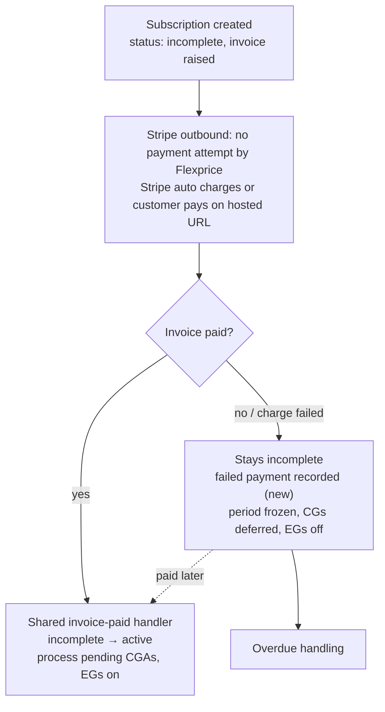
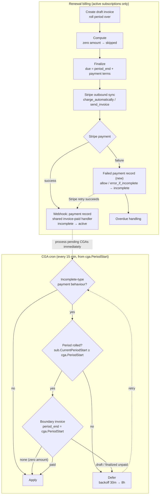
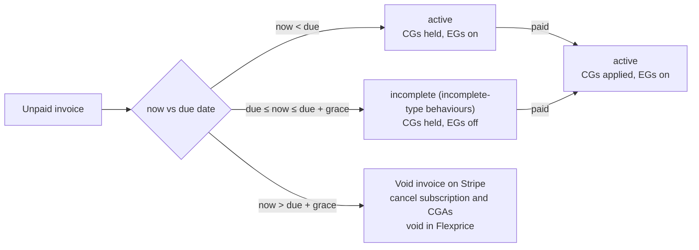

# Gating Subscription Renewal

- **Author:** Harshit Gupta
- **Date:** 2026-09-29
- **Status:** Draft

---

## 1. The problem

Payment gating (`allow_incomplete`, `default_incomplete`) only applies when a subscription is created. On renewal, credit grants and entitlements are applied whether or not the renewal invoice is paid. An unpaid renewal also never moves the subscription to incomplete, and paying it (e.g. on the Stripe-hosted invoice page with Stripe outbound) never reactivates the subscription.

---

## 2. How the flow will work

### Flow diagrams

**New subscription**

**Renewal**

**Overdue handling** (15 min auto-cancellation workflow, per unpaid invoice)

#### New subscription

- Invoice is raised and subscription created with **incomplete status**.
  - With Stripe outbound on, we don't attempt payment ourselves, so the subscription stays incomplete until the Stripe webhook arrives.
- When invoice is paid, subscription status changes to active and benefits like CGs, EGs are active.
  - Pending CGAs are processed immediately via `processPendingCreditGrantsForSubscription`.
  - EGs turn on without an extra step, since the entitlement lookup includes active subs.
- If invoice auto payment fails, no change on subscription (stays incomplete).
  - **(new)** Record a failed payment from Stripe's `invoice.payment_failed` webhooks.
- If it stays unpaid:
  - Period does not roll over; the subscription stays frozen while incomplete.

#### On renewal

- Credit grant application is processed (independently, by the 15 min CGA cron at `PeriodStart`)
  - If payment behaviour is not incomplete-type (`default_active`), apply as today.
  - Else check the boundary invoice of this CGA's period (`invoice.period_end == cga.PeriodStart`).
    - If period hasn't rolled yet (`sub.CurrentPeriodStart < cga.PeriodStart`), defer.
    - If boundary invoice is draft, defer.
    - If boundary invoice is finalized and unpaid, defer.
    - If boundary invoice is paid, **apply**.
    - If period has rolled and there's no boundary invoice (zero amount, skipped), **apply**.
  - Deferred CGAs are retried by the cron with backoff (30m → 8h max), or processed immediately when the invoice is paid.
- Then draft invoice is created and period of subscription is rolled over.
  - Only active subscriptions are rolled over; incomplete ones stay frozen and are caught up once active again.
  - No subscription status change at rollover.
- Then draft gets computed.
  - If amount is zero, invoice is skipped.
- Then draft is finalised.
  - Due date = `period_end` + payment terms (or the tenant's `due_date_days`, default 1).
  - We check if stripe outbound is on, then we don't try to take payment ourselves.
  - Stripe vendor sync runs and syncs invoice on stripe with corresponding `charge_automatically` or `send_invoice` behaviour as configured, with the same due date.
  - If stripe tries to auto charge or invoice is paid manually
    - Success
      - On webhook we update the invoice payment
      - Create a payment record (deduped on the payment intent)
      - **(new)** Handle `invoice.paid` without a payment intent or charge (customer balance, out of band, fully credited): still mark the invoice paid. Skipped when a payment intent on the invoice has succeeded, since that payment is recorded separately.
      - **(new)** From one shared invoice-paid handler, called by the Stripe/gateway reconcile, the payment processor and the manual mark-paid API:
        - If subscription is incomplete, move it to active.
        - Process pending CGAs for the subscription immediately.
        - If subscription is cancelled, don't reactivate. Record the payment; alerting for manual handling is a follow-up.
    - Failure
      - On webhook keep the invoice payment to pending
      - **(new)** Create a failed payment record per attempt (via `invoice.payment_failed`, keyed on the event ID).
      - **(new)** If behaviour is `allow_incomplete` / `error_if_incomplete` with `charge_automatically`, move subscription to incomplete on the first failure. This path isn't capped by the grace window.
      - Stripe keeps retrying; a successful retry goes through the success path and reactivates.
- Overdue handling (15 min auto-cancellation workflow)
  - `now < due date`: active, CGs held until paid, EGs on.
  - `due date ≤ now ≤ due + grace`: **(new)** move to incomplete for incomplete-type behaviours. This is the backstop for `allow_incomplete` when no failure event arrives, and the main trigger for `default_incomplete` with `send_invoice`.
  - `now > due + grace`:
    - **(new)** Void the invoice on Stripe; if that fails, skip and retry.
    - Void it in Flexprice and cancel the subscription.
    - CGAs get cancelled.
    - **(new)** Auto-cancel currently only covers active subscriptions; extend it to incomplete.
  - Paid at any point before cancel: active, CGs applied, EGs on.

## Mental model of the flow:

Today a renewal can become incomplete (stop it's benefits and access) from **three places**:

1. `HandlePaymentBehavior` after a failed Flexprice renewal charge (Stripe outbound off);
2. the Stripe `invoice.payment_failed` webhook;
3. the overdue cron at the due date.

| Stage            | What sets the status                                                                                                                                                        |
| ---------------- | --------------------------------------------------------------------------------------------------------------------------------------------------------------------------- |
| Creation         | `HandlePaymentBehavior`, unchanged: incomplete-type behaviours start incomplete until paid                                                                                  |
| Trial end        | incomplete until the trial-end invoice is paid, unchanged                                                                                                                   |
| **Renewal**      | stays active with next period's grants held. `charge_automatically` moves to incomplete on the first failed charge (Stripe webhook or Flexprice charge); otherwise the overdue cron does it at the due date. |
| Paid             | the paid handler: activate if incomplete, release held grants                                                                                                               |
| Due date + grace | auto-cancel: void and cancel with `payment_overdue`                                                                                                                         |

---

## 3. Follow ups and decisions

### Follow ups

- Supporting this flow for other payment providers too like razorpay, chargebee, etc.
- Parent / child gating: grouped and delegated subscriptions follow the parent's invoice (separate PR).
- `action_required` webhook for a payment on a cancelled subscription.
- Retry the Flexprice void when it fails after auto-cancel.
- Drop the grant pass at period rollover for gated subscriptions: the renewal invoice is almost always unpaid then, so it only defers and bumps the grant's retry backoff. The paid hook and the grants cron already cover it; payment-gated deferrals should re-check on a fixed interval instead of growing the backoff.

### Decisions

- **Never-paid new subscriptions** and **stuck incomplete subscriptions** are auto-cancelled after due + grace with `payment_overdue`; there is no `incomplete_expired` status.
- **Stripe invoice** is voided before cancelling (a draft is deleted), so the hosted page can't collect afterwards. Only a paid Stripe invoice or a transient Stripe error holds the cancellation; a missing connection or a missing Stripe invoice cancels as before.
- **Payment on a cancelled subscription** is recorded, never refunded, and the subscription stays cancelled.
