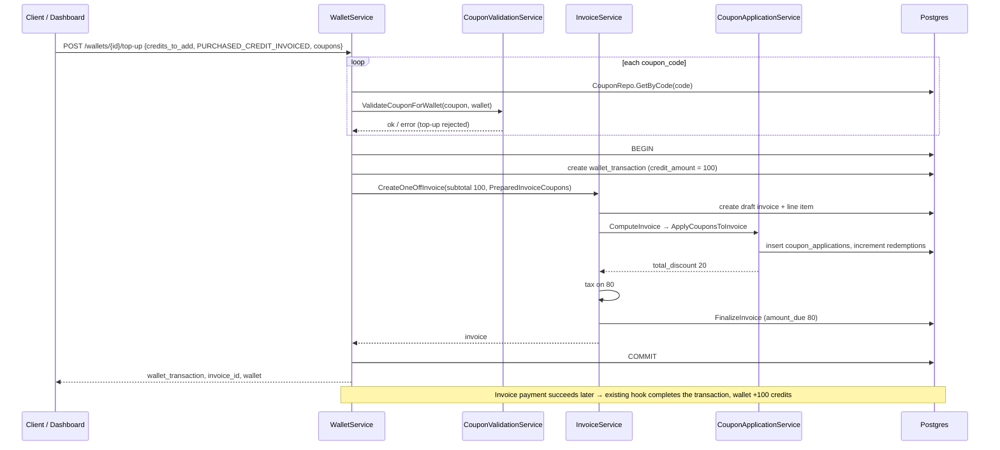
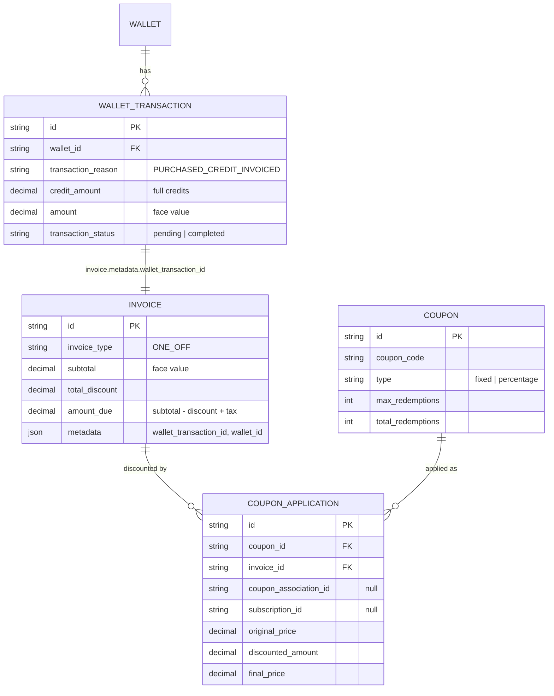
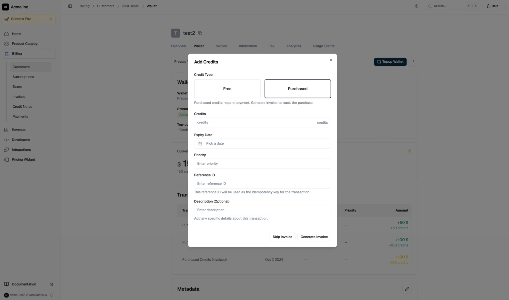

# PRD: Coupons on Wallet Top-ups

Author: Tsage  
Date: 2026-10-07  
Ticket: FLE-1452

---

## 1. Overview

Tenants can apply coupons when topping up a customer's wallet with purchased credits. The coupon
discounts the top-up invoice only. The wallet is still credited with the full credits.

Example: the customer buys 100 credits ($100 face value) with a 20% coupon. The wallet gets 100
credits and the invoice is $80.

---

## 2. Problem & Context

### Current Behavior

- `POST /v1/wallets/{id}/top-up` accepts `credits_to_add` and a `transaction_reason`.
- `PURCHASED_CREDIT_INVOICED` creates a wallet transaction and a ONE_OFF invoice for
  `credits_to_add × topup_conversion_rate` (`handlePurchasedCreditInvoicedTransaction`,
  `internal/ee/service/wallet.go`). The invoice stores the transaction in
  `metadata.wallet_transaction_id`.
  - Pay-later: the transaction stays `pending` until the invoice payment succeeds, then
    `CompletePurchasedCreditTransactionWithRetry` credits the wallet.
  - Auto-complete (`invoice_config.auto_complete_purchased_credit_transaction`): the transaction is
    completed at once and the invoice is marked paid on finalize.
- `PURCHASED_CREDIT_DIRECT` credits the wallet immediately with no invoice ("Skip invoice" in the UI).
- One-off invoices already support coupons. `ComputeInvoice` applies invoice-level coupons before
  tax, writes a `coupon_applications` row per coupon, and increments the coupon's redemptions.

### Problem

The top-up request has no coupon input, so a tenant cannot sell credits at a discount. The invoice
is always for the full amount.

### Expected Outcome

An invoiced top-up can carry one or more coupons. The top-up invoice shows the discount and the
wallet gets the full credits.

---

## 3. Goals & Non-Goals

### Goals

- Coupons on `PURCHASED_CREDIT_INVOICED` top-ups from the API and the admin dashboard.
- Discount recorded on the top-up invoice through the existing `coupon_applications` flow.

### Non-Goals

- Line-item coupons. The top-up invoice has a single line item.
- Reducing credits with a coupon.

---

## 4. Requirements

### Functional Requirements

R1. `TopUpWalletRequest` accepts `coupons: [{ "coupon_code": string }]`.  
R2. Multiple coupons can be applied to one top-up.  
R3. Each code is resolved with `CouponRepo.GetByCode`.  
R4. Each coupon is validated against the wallet with a new `ValidateCouponForWallet(ctx, coupon, wallet)`
on `CouponValidationService`. The existing `ValidateCoupon` is subscription-scoped and is not used.  
R5. Validated coupons are applied as invoice-level coupons on the top-up invoice through the
existing `ComputeInvoice` coupon step.  
R6. `CreateOneOffInvoice` rebuilds `InvoiceCoupons` from the request and silently skips invalid
coupons. Top-up coupons are passed in a new server-only field
`CreateInvoiceRequest.PreparedInvoiceCoupons` (`json:"-"`) that is appended to `InvoiceCoupons`.

### Business Rules

BR1. Coupons are allowed only when `transaction_reason = PURCHASED_CREDIT_INVOICED`.  
BR2. The coupon discounts the invoice only. `wallet_transaction.credit_amount` and `amount` stay at
face value.  
BR3. Multiple coupons apply in order on the running subtotal.  
BR4. Discount is applied before tax.  
BR5. Bonus credit slabs resolve from `credits_to_add`, not from the discounted amount.  
BR6. One redemption is counted per coupon per top-up.

### Validations / Constraints

Any failure rejects the whole top-up. Nothing is created.

V1. `coupons` with any other `transaction_reason` → 400.  
V2. Unknown or non-published coupon code → 404.  
V3. Coupon outside `redeem_after` / `redeem_before` → 400.  
V4. Fixed-amount coupon whose currency differs from the wallet currency → 400.  
V5. Coupon has reached `max_redemptions` → 400.

---

## 5. Sequence Diagram



---

## 6. Data Model

Top-up discounts are stored in `coupon_applications`, the table one-off invoices already use. A
top-up coupon application is linked to the invoice, with `coupon_association_id` and
`subscription_id` null. No schema change.

### ERD



---

## 7. Contracts

### API

Endpoint: `/v1/wallets/{id}/top-up`  
Method: `POST`

Request:

```json
{
  "credits_to_add": "100",
  "transaction_reason": "PURCHASED_CREDIT_INVOICED",
  "coupons": [{ "coupon_code": "TOPUP20" }, { "coupon_code": "LOYAL5" }]
}
```

Response: unchanged (`wallet_transaction`, `invoice_id`, `wallet`). The invoice
(`GET /v1/invoices/{id}`) returns `total_discount` and `coupon_applications`.

### UI

Screen: Customer → Wallet → Topup Wallet → **Add Credits** modal.



- Add a **Coupons** field under Credits, shown only when Credit Type = Purchased.
  - Multi-select over published coupons from `GET /v1/coupons`.
  - Sends `coupons: [{ coupon_code }]`.
- While at least one coupon is selected, **Skip invoice** is disabled. Only **Generate invoice**
  is available.
- Switching to **Free** clears and hides the coupons.

---

## 8. Acceptance Criteria

AC1. A 20% coupon on a 100-credit invoiced top-up produces an invoice with subtotal 100, discount 20,
amount due 80, and a transaction for 100 credits.  
AC2. Two coupons on one top-up both apply, in order, each with its own `coupon_applications` row.  
AC3. Each applied coupon's `total_redemptions` increases by one.  
AC4. Paying the invoice credits the wallet with the full 100 credits.  
AC5. With auto-complete on, the wallet is credited at once and the invoice is paid at the
discounted amount.  
AC6. Each of V1–V5 rejects the top-up and creates no transaction, invoice or redemption.  
AC7. Top-ups without coupons behave exactly as before.  
AC8. In the Add Credits modal, selecting a coupon disables Skip invoice, and switching to Free clears
the coupons.

---

## 9. Open Questions

- **Direct link from coupon application to the top-up.** Today the link is two steps:
  `coupon_applications.invoice_id` → `invoice.metadata.wallet_transaction_id`. Should
  `coupon_applications` get a `wallet_transaction_id` column?
- **100% discount.** The top-up invoice becomes $0. Today `FinalizeInvoice` marks a $0 invoice
  `SUCCEEDED`, which does not go through the payment hook, so the transaction stays pending.
  Proposed: mark the $0 top-up invoice `SKIPPED` and credit the wallet instantly.
- **Voided top-up invoice.** Voiding fails the pending transaction (existing hook), but the
  `coupon_applications` rows and the coupon's redemption count are left as they are. Should the
  redemption be given back?
