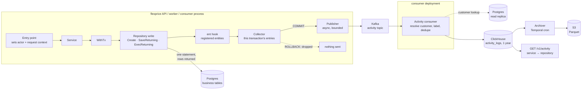
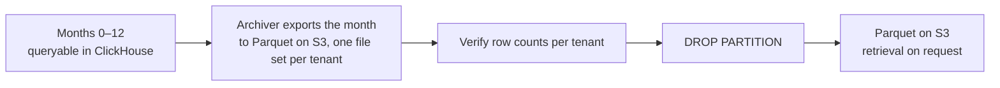

# Activity Log — Design ERD

Status: **Proposed**
Date: 2026-10-08
Author: Paras Aghija
Branch: `docs/activity-log-erd`

---

## 1. Overview

### 1.1 Goals

Tenants can see who created, updated, archived or deleted their billing entities, and when, from the
dashboard and the public API.

- **Every change is recorded.** Each committed create, update, archive and delete of a registered
  entity made through Flexprice (API, dashboard, workflows, consumers, scripts) produces an entry.
  Several writes to one entity in one transaction produce one entry with its final state, since the
  intermediate states were never visible outside the transaction.
- **Who did it.** Each entry names its actor: a user, an API key, or the system. Work the platform does
  on a user's behalf is attributed to the system.
- **Where it came from.** Each entry carries its request id, source, IP address and user agent. All
  changes from one request can be viewed together.
- **State at that time.** Each entry holds a snapshot of the entity right after the change, with the
  same field names as the public API.
- **Rolled up by customer.** A customer's activity includes changes to everything that belongs to
  them, including entities linked only through a subscription or invoice.
- **Filters.** Activity can be listed for the whole tenant, or narrowed by entity, customer, actor
  (type or id), action, request and time range.
- **One year of history.** Activity stays queryable for one year, then is archived to Parquet.

### 1.2 Principles

- **Business writes are never affected.** Capture adds no database round trip to a write and can
  never fail it. If the log pipeline is down, business writes carry on.
- **Lag is acceptable.** Entries appear a few seconds after the change.
- **Best-effort.** An entry can be lost. Drops inside the publisher (a full buffer, Kafka unavailable
  past retries, a shutdown timeout) are counted and alerted. Entries still in memory when a process
  crashes after commit are lost without being counted; there is no durable recovery path for them.
  An entry that exists is always correct on its own.
- **Product interfaces only.** The log covers changes made through Flexprice: API, dashboard,
  workflows, consumers and scripts. Direct SQL on the database is controlled by infrastructure access
  rules, not by this log.

### 1.3 Non-goals

- Failed or rejected requests. Only committed changes are logged.
- Field-level before and after values. An entry holds the state after the change.
- Domain-specific action names such as `invoice.voided`. Actions are generic.
- Querying data older than one year from the dashboard.

### 1.4 Terms

| Term | Meaning |
| --- | --- |
| Entry | One logged change to one entity |
| Actor | Who made the change: a user, an API key, or the system |
| Snapshot | The entity's state right after the change, in the same field names as the public API |
| Registered entity | An entity type that is logged. Each one has a registration (section 3) |
| Collector | The in-memory list of entries for one database transaction |
| `SaveReturning` / `ExecReturning` | Generated ent methods that run a bulk update or delete and return the changed rows (section 4.3) |

---

## 2. Architecture



**Flow of a write.**

| Step | Where | What happens |
| --- | --- | --- |
| 1 | Entry point | The actor and request context (id, IP, user agent) are set in the context |
| 2 | Repository, inside `WithTx` | A write to a registered entity (`Create`, `SaveReturning`, `ExecReturning`). Postgres returns the changed rows, and the hook adds one entry per row to the collector |
| 3 | `WithTx` commits | The post-commit hook hands the collector to the publisher. On rollback the collector is dropped |
| 4 | Publisher | One Kafka message per transaction. The request returns without waiting |
| 5 | Consumer | Resolves the customer and label for each entry, and batch-inserts the rows into ClickHouse |
| 6 | Dashboard and API | The entries appear a few seconds after the change, grouped by request id |

### 2.1 Why this design

- **The actor is known only in the application.** A single transaction mixes user and system writes
  (a user's top-up also creates a system invoice). The hook reads the actor from the context at each
  write, so each entry gets the right one.
- **Postgres returns what changed.** Every update and delete on a registered entity uses `RETURNING`,
  so the changed rows come back with the write itself. Capture needs no extra query, single-row or
  bulk.
- **Nothing is added to the business transaction.** The hook and the collector work in memory.
  Publishing happens after commit, off the request path. No outbox row, no replication slot holding
  WAL on the business database.
- **Each entry stands alone.** An entry holds a full snapshot, not a diff against the previous entry,
  so a lost or late entry removes one row and never makes another row wrong.
- **Generic by construction.** The hook covers every write that goes through ent. The returning
  methods are generated for every entity, so new entities and new bulk updates are covered without
  extra code.

### 2.2 Why ClickHouse

- **Isolation.** Activity reads and writes never touch the business Postgres. A growing log cannot
  slow billing queries.
- **Fits the workload.** Entries are append-only and read by tenant and time range, which is
  exactly a ClickHouse sort key.
- **Cheap at a year of history.** Snapshots of the same entities repeat heavily and compress well.
- **Retention is a partition drop.** Monthly partitions export natively to Parquet on S3 and drop
  instantly.
- **Already operated.** Flexprice runs ClickHouse for events and meter usage. No new infrastructure.

---

## 3. Entity registration

Each logged entity has one registration, next to its repository:

| Field | Purpose |
| --- | --- |
| Entity type | `types.SystemEntityType`, and the ent type the hook matches |
| Snapshot | The entity's `FromEnt` conversion to its domain model |
| Drop | Fields left out of the snapshot (for example `version`, `synced_price_sequence`) |
| Redact | Fields stored as `"[redacted]"` (for example payment method details) |
| Customer | The customer id field, the parent lookup the consumer uses, or none |
| Label | The human name shown in lists (for example invoice number, customer name) |

Entities without a registration are never logged.

### 3.1 Entities in phase 1

Customer-facing billing entities: customer, subscription, subscription phase, subscription schedule,
subscription pause, invoice, credit note, wallet, wallet transaction, credit grant, credit grant
application, entitlement grant, payment, payment method, refund, checkout session, coupon
association, coupon application, addon association, tax association.

---

## 4. Capture

### 4.1 Actor and request context

Every entry point puts an actor and a request context into the Go context. The hook reads both at the
moment of each write.

| Entry point | Actor | Source |
| --- | --- | --- |
| Dashboard (JWT) | `user`: user id and name | `dashboard` |
| API key | `api_key`: key id and key name | `api` |
| Temporal activity | `system`: workflow name, set once by a worker interceptor | `workflow` |
| Gateway webhook | `system`: event name | `webhook` |
| Kafka consumer | `system`: consumer group name | `consumer` |
| Script | `system`: `script:<name>` | `script` |

**Writes the platform makes on a user's behalf** are attributed to the system. A top-up by a user
creates the wallet transaction as the user, and the invoice and payment as `system` "Credit purchase
billing". All three share the request id, which links the system entries to the user who triggered
them. The code doing derived work wraps the context with `WithDerivedSystemActor(ctx, name, label)`.

Request middleware adds the request id, IP address and user agent. System work has none.

A write with no actor is logged as `system / unknown` and counted. It never fails the write.

### 4.2 Snapshot

The snapshot is the entity's domain model serialized to JSON, using the existing `FromEnt`
conversion. Field names, types and formats are therefore the same as the public API. Nested objects
that the API adds by extra queries (a subscription's plan, customer, phases) are not included. The
snapshot keeps their ids, and the frontend links them.

Each registration drops internal fields and redacts sensitive ones (section 3).

```json
{
  "id": "subs_01JB8Q…",
  "customer_id": "cus_3",
  "plan_id": "plan_pro",
  "subscription_status": "cancelled",
  "currency": "usd",
  "billing_period": "MONTHLY",
  "current_period_end": "2026-11-01T00:00:00Z",
  "cancelled_at": "2026-10-08T11:02:44Z",
  "pause_status": "none",
  "gateway_payment_method_id": "[redacted]"
}
```

A delete's snapshot is the row as it was when deleted.

### 4.3 `SaveReturning` and `ExecReturning`

Ent's own bulk `Save` and `Exec` return only a row count. Two methods are added to every entity
through an ent code-generation template, `ent/template/returning.tmpl`:

| Method | On | Runs |
| --- | --- | --- |
| `SaveReturning(ctx) ([]*X, error)` | Every update builder | `UPDATE … WHERE … RETURNING *` |
| `ExecReturning(ctx) ([]*X, error)` | Every delete builder | `DELETE … WHERE … RETURNING *` |

The `generate-ent` target adds the template:

```
ent generate --feature sql/execquery --template ./ent/template ./ent/schema
```

The generated code lives inside the ent package, so it reuses ent's own internals: the same
predicates, the same field encoding as `Save` (JSON and custom types included), and the same row
scanning as ent queries. It runs through ent's hook chain like `Save`.

A call site changes one method and keeps its typed setters and predicates:

```go
rows, err := client.AddonAssociation.Update().
    Where(addonassociation.IDIn(ids...), tenant, env).
    SetEndDate(effectiveAt).
    SetCancelledAt(effectiveAt).
    SetAddonStatus(string(types.AddonStatusCancelled)).
    SetUpdatedAt(now).
    SetUpdatedBy(types.GetUserID(ctx)).
    SaveReturning(ctx)
affected := len(rows)
```

```sql
UPDATE "addon_associations"
   SET "end_date" = $1, "cancelled_at" = $1, "addon_status" = $2, "updated_at" = $3, "updated_by" = $4
 WHERE "id" IN ($5, $6, $7) AND "tenant_id" = $8 AND "environment_id" = $9
RETURNING "id", "tenant_id", "entity_type", "entity_id", "addon_id", "addon_status", "end_date", …
```

The hook receives the returned entities as the mutation's result and adds one entry per row. The rows
are exactly the ones this statement changed, in their state after the change.

**Parity tests.** For every registered entity, a test runs the same builder through `Save` and
`SaveReturning` against a recording driver and checks that the SQL differs only by `RETURNING`. The
tests run on every ent upgrade, since the template depends on ent's generated internals.

### 4.4 Collector

- `WithTx` installs one collector per transaction. Nested `WithTx` calls reuse it.
- Several writes to one entity in a transaction become one entry with the last snapshot. A create
  followed by updates stays `created`.
- On commit, the existing post-commit hook hands the entries to the publisher with the commit time.
- On rollback the collector is dropped with the other post-commit work.
- A write outside any transaction goes to the publisher right after it succeeds.

### 4.5 Ent hook

Ent lets a function wrap every create, update and delete made through a client. The activity hook
is one such function, installed once on the writer client (`client.Use(activity.Hook(registry))`)
when `activity.enabled` is on. Every repository write passes through it, so no service code calls
it.

For each write it:

1. Checks the registry. Unregistered entities, and contexts under `Suppress` (section 4.7), pass
   straight through.
2. Lets the write run.
3. Takes the rows the write returned: the created entity, or the rows from `SaveReturning` /
   `ExecReturning`.
4. For each row, builds an entry from the actor and request context in `ctx`, the action, and the
   snapshot (the domain model's JSON, dropped and redacted per registration).
5. Adds the entries to the transaction's collector (section 4.4).

It makes no database calls and never returns an error to the write. If building an entry fails,
the entry is skipped and `activity_capture_failed_total` is incremented.

### 4.6 How each write is captured

The hook records the rows that each write hands back:

| Write | Rows come from | Extra round trips |
| --- | --- | --- |
| `Create` | The `INSERT` | None |
| `CreateBulk` | The batch `INSERT`; the hook runs once per row | None |
| `Update()…SaveReturning` (one row or many) | `UPDATE … RETURNING *` | None |
| `Delete()…ExecReturning` (one row or many) | `DELETE … RETURNING *` | None |
| Raw SQL | The statement's own `RETURNING *`, passed to `activity.Record` | None |

Raw SQL bypasses ent, so the repository passes the rows from its own `RETURNING *` to
`activity.Record(ctx, entityType, rows)`, which builds entries the same way the hook does.

**Rule for registered entities:** updates end in `SaveReturning`, deletes end in `ExecReturning`.
A plain `Save` or `Exec` on a registered entity returns only a count, so the hook cannot capture it.
That fails in tests and local runs, and increments `activity_uncaptured_total` in production.

**Action** is `created`, `updated`, `archived` or `deleted` (row removed). The hook sees only the
row after the write, so `archived` means the update set the status to archived or deleted, which the
hook reads from the mutation. Re-archiving an already archived entity is also logged as `archived`.

### 4.7 Suppress

`activity.Suppress(ctx, reason)` returns a context in which the hook records nothing. It is for
system paths that keep data up to date as a side effect of other work, not changes anyone made.

```go
evalCtx := activity.Suppress(ctx, "wallet balance evaluation")
balance, err := s.GetWalletBalanceV2(evalCtx, walletID)
```

The wallet's running balance is recomputed every time usage arrives. That evaluation runs under
`Suppress`, so it never fills the customer's timeline. Only code that receives `evalCtx` is
skipped: an auto top-up started from the same flow uses the normal context and is logged.

- A reason is required and is logged at info level, so suppression always leaves a trace.
- It is only for system maintenance paths. Using it on a path a tenant acts on would hide their changes.

### 4.8 Repository changes for phase 1

| Change | Sites |
| --- | --- |
| Template added to `generate-ent`, code regenerated | Once |
| Updates on registered entities: `Save` to `SaveReturning` (single-row and bulk, including addon `CancelBulk` / `ActivateBulk` / `DeleteBulk` and credit grant `DeleteBulk`) | About 37 |
| Deletes on registered entities: `Exec` / `DeleteOneID` to `ExecReturning` | 2 |
| `Create`, `CreateBulk`, existing `UpdateOne` | None |

---

## 5. Delivery

### 5.1 Publisher

- In-process, with a bounded buffer and background workers using the existing Kafka producer.
- One Kafka message per committed transaction. A transaction's entries are split into several
  messages when a message would exceed 100 entries or 512 KB, whichever comes first. This follows
  the existing bulk publish bound (`bulk_max_batch_bytes`) and stays under Kafka's 1 MB message
  limit.
- A single entry whose snapshot exceeds 256 KB is still published, with `state` cut down to the
  entity's id and label fields and `state_truncated: true`. `activity_snapshot_truncated_total` is
  incremented.
- Never blocks the request. A full buffer, or a publish that still fails after retries, drops the
  message and increments `activity_dropped_total`.
- On shutdown it drains the buffer, with a timeout, before the process exits.

### 5.2 Kafka message

```json
{
  "message_id": "actb_01JB8Q…",
  "schema_version": 1,
  "tenant_id": "tenant_acme",
  "environment_id": "env_prod",
  "committed_at": "2026-10-08T11:02:44.170Z",
  "request": { "id": "req_c19d", "source": "dashboard", "ip": "182.76.138.114", "user_agent": "Mozilla/5.0 …" },
  "events": [
    {
      "id": "act_01JB8Q…A",
      "entity_type": "addon_association",
      "entity_id": "aa_1",
      "action": "updated",
      "actor": { "type": "user", "id": "user_7", "label": "Manish" },
      "state": { "id": "aa_1", "entity_type": "subscription", "entity_id": "subs_01", "addon_id": "addon_seats",
                 "addon_status": "cancelled", "cancelled_at": "2026-10-08T11:02:44Z", "end_date": "2026-10-08T11:02:44Z" }
    },
    { "…": "aa_2 and aa_3 in the same shape" }
  ]
}
```

Entry ids are ULIDs created in the process. Their embedded time bounds lookups by id (section 7.2).

`schema_version` is a constant in the activity package that describes the message and snapshot
format. It changes only on a breaking change to that format, and is stored with every row so old
entries stay readable. The message carries no customer id; the consumer resolves it.

### 5.3 Consumer

Runs in the consumer deployment, registered with the router's `AddNoPublishHandler` and its DLQ.
Like the existing bulk consumers, one Kafka message is one batch: it holds a transaction's entries
(section 5.1) and becomes one ClickHouse insert. Inserts use ClickHouse async inserts and wait for
the acknowledgement, so many small transactions are buffered into larger parts by the server, and
the offset is committed only after the insert is acknowledged.

1. Splits the message into rows and copies the request context and commit time onto each.
2. Resolves `customer_id` using the registration, which says whether the entity has a customer.
   - Has a customer field: read it from `state`.
   - Linked through a parent: look the customer up on the Postgres read replica, with a cache. If the
     parent is not on the replica yet, the consumer fails the message and Kafka redelivers it with
     backoff. After the retry limit it goes to the DLQ and `activity_customer_unresolved_total` is
     incremented. Nothing is inserted until every entry in the message is resolved.
   - No customer: stored with an empty customer, no lookup and no retry.
3. Computes `entity_label` from the snapshot using the registration.
4. Batch-inserts into ClickHouse. A message redelivered after a successful insert carries the same
   entry ids, and reads deduplicate by id (section 6.1).

---

## 6. Storage

### 6.1 Table

```sql
CREATE TABLE activity_logs
(
    -- Identity and tenancy
    id              String,                     -- entry id (ULID)
    tenant_id       String,
    environment_id  String,

    -- What changed
    entity_type     LowCardinality(String),     -- subscription, invoice, wallet, …
    entity_id       String,
    entity_label    String,                     -- human name shown in lists
    customer_id     String,                     -- customer roll-up
    action          LowCardinality(String),     -- created, updated, archived, deleted

    -- Who changed it
    actor_type      LowCardinality(String),     -- user, api_key, system
    actor_id        String,
    actor_label     String,

    -- Where the request came from
    source          LowCardinality(String),     -- dashboard, api, workflow, webhook, consumer, script
    request_id      String,
    ip              String,
    user_agent      String,

    -- State after the change
    state           String CODEC(ZSTD(3)),      -- snapshot JSON, API field names
    schema_version  UInt16,

    -- Time
    occurred_at     DateTime64(3, 'UTC'),       -- commit time
    ingested_at     DateTime64(3, 'UTC') DEFAULT now64(3),

    -- Customer tab: everything for one customer, newest first.
    -- Also serves customer_id + entity_type / action / actor filters.
    PROJECTION by_customer
    (
        SELECT * EXCEPT (state) ORDER BY (tenant_id, environment_id, customer_id, occurred_at, id)
    ),

    -- One entity's timeline: everything that happened to subs_01, newest first.
    PROJECTION by_entity
    (
        SELECT * EXCEPT (state) ORDER BY (tenant_id, environment_id, entity_type, entity_id, occurred_at, id)
    ),

    -- What one user, API key or system actor did. Skips blocks without that actor.
    INDEX idx_actor_id actor_id TYPE bloom_filter(0.01) GRANULARITY 4,

    -- Related changes: every entry from one request, bounded to that request's day.
    INDEX idx_request_id request_id TYPE bloom_filter(0.01) GRANULARITY 4
)
ENGINE = MergeTree
PARTITION BY toYYYYMM(occurred_at)
-- Tenant feed: everything in one tenant and environment, newest first.
ORDER BY (tenant_id, environment_id, occurred_at, id)
TTL toDateTime(occurred_at) + INTERVAL 13 MONTH DELETE;
```

- **Sort key** serves the tenant feed: one tenant and environment, newest first.
- **Projections** serve the customer tab and an entity's own timeline. They leave out `state`,
  because lists never return it, so they stay small.
- **Skip indexes** on `actor_id` and `request_id` serve occasional lookups (an actor's history after
  an incident, a request's related changes) without the storage cost of another projection.
- **`MergeTree`**, because the table is append-only: rows are never updated, only dropped with their
  month or erased. Kafka delivers at least once, so a redelivered message can insert an entry twice.
  Reads deduplicate by id: list queries use `LIMIT 1 BY id`, and the detail lookup returns one row
  for the id.
- **`state`** is JSON text compressed with ZSTD. It is never filtered on, only returned when an
  entry is opened.
- **TTL** at 13 months is a safety net. The archiver normally drops a month after exporting it.

The access paths are checked with `EXPLAIN` before rollout.

**Replicated clusters.** Like `events` and `meter_usage`, the table ships in both ClickHouse
baselines. The single-node form is above. The replicated form keeps the same columns, projections,
indexes, partitioning, ordering and TTL, and changes only the statement and the engine:

```sql
CREATE TABLE activity_logs ON CLUSTER '{cluster}'
( … same as above … )
ENGINE = ReplicatedMergeTree('/clickhouse/tables/{shard}/{database}/{table}', '{replica}')
…
```

Every replica holds a copy, and a retried insert of the same batch is deduplicated by the engine.
Every DDL or delete on this table in a replicated cluster runs `ON CLUSTER '{cluster}'`.

### 6.2 Retention and archive

Not in the first release; archiving will be handled later. This section describes how it will work.



- A Temporal cron will find months older than one year and export each, deduplicated by id, with
  ClickHouse's `s3()` table function to `activity_logs/tenant_id=<t>/year=<yyyy>/month=<mm>/`. It
  will verify counts, then drop the partition (`ALTER TABLE … ON CLUSTER '{cluster}' DROP PARTITION …`
  on replicated clusters).
- A month will be dropped only after a verified export.
- Erasure for a customer will be a lightweight `DELETE` in ClickHouse (`ON CLUSTER` on replicated
  clusters) and a rewrite of that tenant's Parquet files. A runbook, not an endpoint.

---

## 7. API

### 7.1 List

`GET /v1/activity` returns lean rows, newest first, with no snapshot.

| Filter | Notes |
| --- | --- |
| `start_time`, `end_time` | Required. At most 90 days, within the last year |
| `entity_type` + `entity_id` | One entity's timeline |
| `customer_id` | Everything for one customer |
| `actor_type`, `actor_id` | Everything one user or key did |
| `request_id` | Every entry from one request, bounded to that request's day |
| `action` | One or more of created, updated, archived, deleted |
| `cursor`, `limit` | Cursor pagination. Default 50, maximum 200 |

```json
{
  "items": [
    {
      "id": "act_01JB8Q…A",
      "occurred_at": "2026-10-08T11:02:44.170Z",
      "action": "updated",
      "entity": { "type": "subscription", "id": "subs_01", "label": "Pro, Acme" },
      "customer_id": "cus_3",
      "actor": { "type": "user", "id": "user_7", "label": "Manish" },
      "source": "dashboard",
      "request_id": "req_c19d",
      "ip": "182.76.138.114",
      "user_agent": "Mozilla/5.0 …"
    }
  ],
  "next_cursor": "…",
  "has_more": true
}
```

### 7.2 Detail

`GET /v1/activity/{id}` returns the row plus `state` and `schema_version`. The id's embedded time is
when the entry was built, shortly before its commit time, and a transaction can commit in the next
month. The lookup therefore searches from that time to one day after it, which touches at most two
partitions.

### 7.3 Access

- Entity and customer timelines need read permission on that entity type.
- The tenant-wide feed needs a new activity read permission.
- API keys can read the log.
- Every query filters on the tenant and environment from the context.

The dashboard shows that entries can take a few seconds to appear.

---

## 8. Operations

| Metric | Alert |
| --- | --- |
| `activity_dropped_total` (by reason) | Any sustained drops |
| Consumer lag on the activity topic | Above five minutes |
| `activity_uncaptured_total` (by entity) | Any non-zero value |
| `activity_customer_unresolved_total` | Sustained growth |
| `activity_unknown_actor_total` (by entry point) | Any non-zero value |
| `activity_capture_failed_total` (by entity) | Any non-zero value |
| `activity_snapshot_truncated_total` (by entity) | Any non-zero value |

- Scripts that change data install the hook with a `script:<name>` actor.
- The Kafka topic is created with the other topics in `init-kafka`.
- CI runs the parity tests for the returning methods and fails on any uncaptured write to a
  registered entity.

### 8.1 Kill switch

`activity.enabled` turns the whole feature off. When it is off:

- no hook or collector is installed, and nothing is published;
- the activity consumer does not start;
- the activity API returns 404 and the dashboard hides the activity views;
- repository writes are unaffected. `SaveReturning` and `ExecReturning` still return rows, which the
  calling code uses.

The setting is read at startup, so changing it takes a restart or a rolling deploy. It applies to all
tenants.

---

## 9. Guarantees and limits

| Property | Guarantee |
| --- | --- |
| Business writes | Never failed or blocked by logging. Same number of round trips as today; updates and deletes also return the changed rows |
| Completeness | Best-effort. Publisher drops are counted and alerted. Entries in memory when a process crashes after commit are lost without being counted |
| Correctness | Every stored entry is self-contained and holds exactly the row its write produced |
| Order | By commit time. Two changes to one entity within milliseconds on different pods can show in either order |
| Duplicates | Removed at read time by entry id |
| Lag | A few seconds |
| Coverage | Writes through Flexprice code to registered entities. Direct SQL outside the application is not logged |
| Retention | One year queryable, then Parquet on S3 |

### 9.1 Open items

- Parquet retention period.
