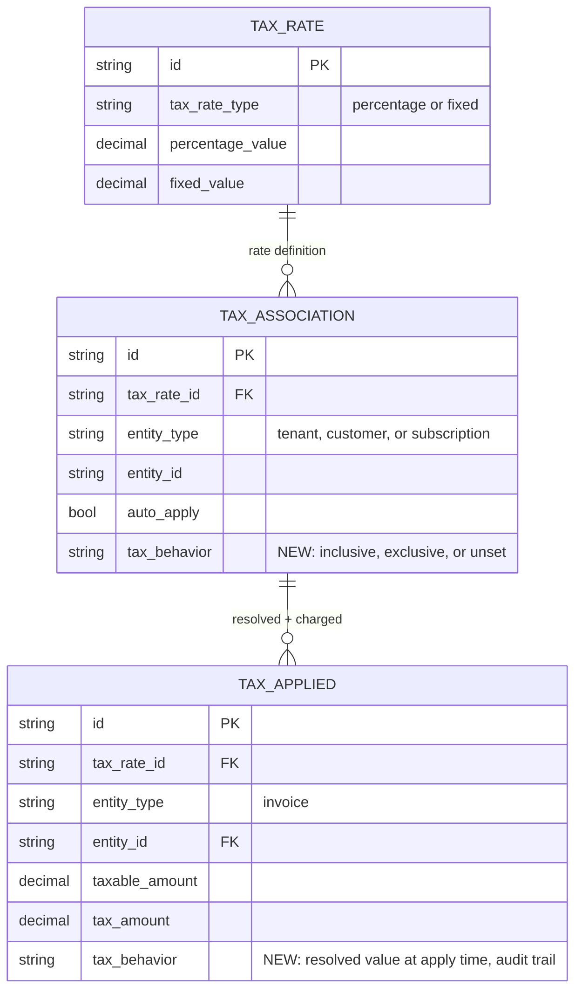
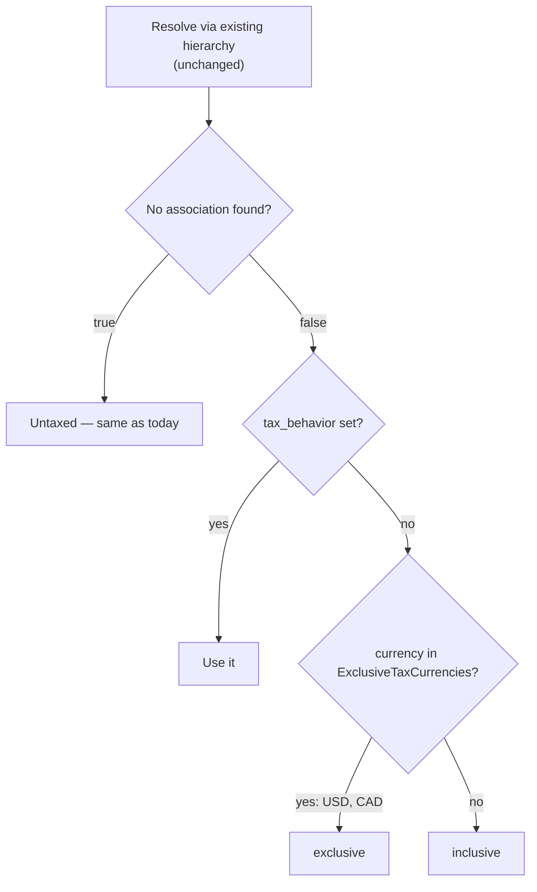
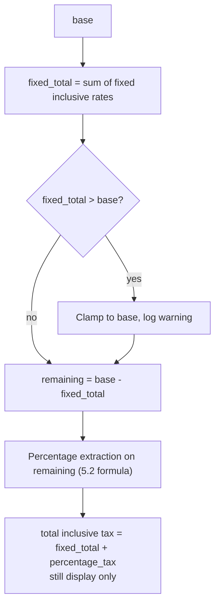
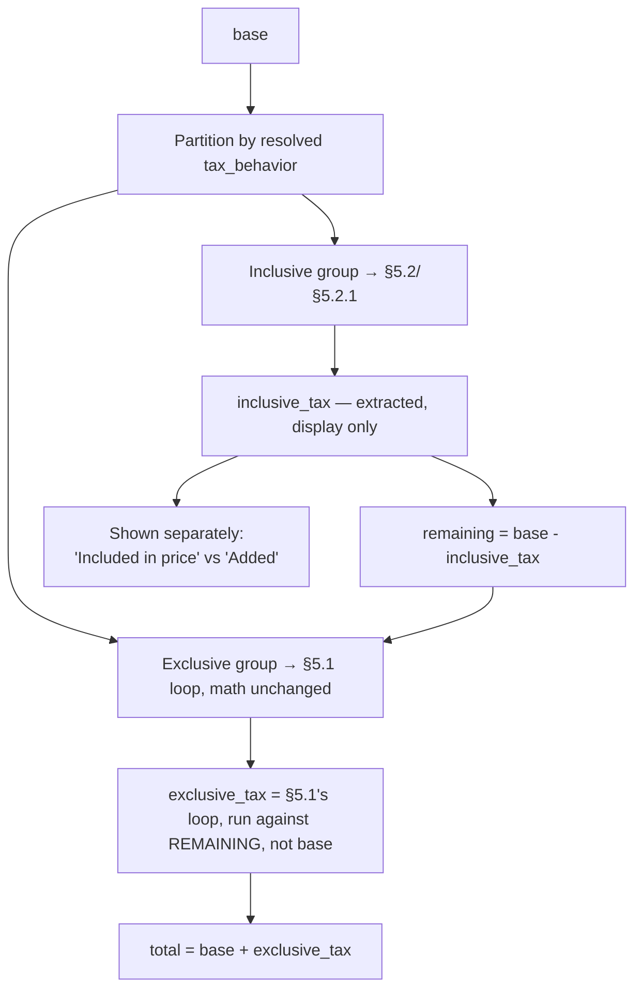

# Taxation — Inclusive/Exclusive Behavior — Design ERD

Status: **Proposed** — v0 (Phase 1: invoice-level)
Date: 2026-08-17
Related: `internal/ee/service/tax.go`, `ent/schema/taxassociation.go`, `ent/schema/taxapplied.go`, `internal/types/taxassociation.go`

---

## 1. Problem Statement

Tax is exclusive-only today — always added on top of `taxableAmount(inv) = subtotal - discount`
(`internal/ee/service/tax.go:1015-1041`). There is no tax-inclusive concept anywhere in the domain
model. `TaxRateType` (`percentage` / `fixed`) governs how a rate's own amount is computed, not whether
it's already baked into the price.

**Goal (Phase 1):** support inclusive tax at the invoice level — same granularity as today, no line
item changes — including invoices where some applicable tax associations are inclusive and others
exclusive.

## 2. Scope

| In Phase 1 | Out of Phase 1 (Phase 2 — see §6) |
|---|---|
| `tax_behavior` on `TaxAssociation` | Line-item-level tax associations |
| Per-currency default behavior (compiled map, not per-tenant config) | Discount carry-down to line items |
| Mixed inclusive + exclusive rates on one invoice | Price-level tax behavior |
| Fixed-value rates, inclusive and exclusive | `TaxApplied` cardinality rework (per-line rows) |
| Exclusive math — **unchanged** | |

**Terminology:** `base` = `subtotal - discount`, same definition either way, unchanged from today's
`taxableAmount()`. `net` = `base - inclusive_tax`, only meaningful for inclusive — exclusive tax has
no separate "net," `base` already *is* the net price. The two are never interchangeable.

---

## 3. Schema changes



- **`TaxAssociation.tax_behavior`** — nullable, lives on the association not `TaxRate`, so the same
  rate can be inclusive for one customer and exclusive for another without cloning it.
- **Currency default is a compiled `internal/types` map, not a new table:**

  ```go
  // ExclusiveTaxCurrencies: currencies whose no-explicit-behavior default is exclusive.
  // Every other currency defaults to inclusive. Mirrors Stripe's Automatic convention.
  var ExclusiveTaxCurrencies = map[string]bool{"USD": true, "CAD": true}
  ```

  Hardcoded system convention — no admin UI, no API, no per-tenant override. See G1 in §7.
- **`TaxApplied.tax_behavior`** — records what was actually used at apply time, so the record stays a
  frozen fact even if the map above changes later.

---

## 4. Resolution — fallback chain

`tax_behavior` only decides **how** an already-resolved rate is treated, never **whether** it applies
— the tenant→customer→subscription hierarchy is untouched.



Every existing `TaxAssociation` has `tax_behavior = null` today, so every one of them hits branch C
"no." Any tenant currently invoicing outside `{USD, CAD}` would silently flip from exclusive to
inclusive with no opt-in — this needs a rollout decision before shipping (G1, §7).

---

## 5. Calculation

### 5.1 Exclusive — unchanged, confirmed against current code

**Percentage** (`internal/ee/service/tax.go:1024-1041`): `base` is computed once, outside the loop,
and the *same* `base` is passed to every rate regardless of type or order —

```go
base := taxableAmount(inv)
for _, taxRate := range taxRates {
    amount := s.calculateTaxAmount(taxRate, base)   // same base every time
    ...
    total = total.Add(rounded)
}
```

So `tax_i = base × r_i / 100` for every percentage rate, independently, then summed
(`base×r1/100 + base×r2/100 = base×(r1+r2)/100` — order never matters, nothing compounds).

**Fixed** (`internal/ee/service/tax.go:1110-1118`): `taxAmount = *taxRate.FixedValue` — no
multiplication against `base` at all, just the flat value, added once. A percentage rate and a fixed
rate in the same invoice never interact — both hit the same untouched `base` and get summed. This
independence is why order-agnostic exclusive math is safe to leave alone; inclusive can't do the same
(§5.2.1).

### 5.2 Inclusive — new formula

`base` already contains the tax. Deriving how much:

```
net  = base × 100/(100+r)
tax  = base − net = base × r/(100+r)
```

**Can't run this per-rate independently when multiple rates apply** — each run assumes it alone
explains the gap between `base` and net. For 9% + 5% on a $1,000 base:

```
Naive (wrong):  tax@9% = 1000×9/109 = 82.57,  tax@5% = 1000×5/105 = 47.62,  sum = 130.19
Correct:        R = 14, total_tax = 1000×14/114 = 122.81
                tax@9% = 122.81×(9/14) = 78.95      ← proportional, not 122.81/2
                tax@5% = 122.81×(5/14) = 43.86      ← proportional, not 122.81/2
```

**Rule: combine the rates first (`R = Σr_i`), extract once, split proportionally by each rate's own
share of `R`** — never independently, never equally.

```go
func calculateInclusiveTaxLines(base decimal.Decimal, rates []resolvedTaxRate, currency string) ([]taxLineAmount, decimal.Decimal) {
    R := sumPercentages(rates)
    totalTax := types.RoundToCurrencyPrecision(base.Mul(R).Div(hundred.Add(R)), currency)
    lines := splitProportionally(totalTax, rates, R)   // tax_i = totalTax × r_i/R
    return lines, totalTax                             // display only — never added to invoice total
}
```

### 5.2.1 Fixed-value rates in the inclusive group

A fixed inclusive rate ("this $50 fee is already in the price") has no percentage, so it can't be
folded into `R`. Fixed amounts must be extracted **first**; percentage rates then extract from what's
left, not from the original `base`:



Worked example, base = $1,000, $50 fixed + 9% percentage, both inclusive:

```
fixed_total = 50
remaining   = 1000 − 50 = 950
percentage_tax = 950 × 9/109 = 78.44        ← from remaining, not the original 1000
total_inclusive_tax = 50 + 78.44 = 128.44   ← display only, total stays 1000
```

The clamp guard exists because percentage extraction can never exceed `base` (`base×r/(100+r) < base`
always), but a flat fee has no such ceiling — a $50 fee against a $30 base would otherwise go
negative. Clamp-and-log mirrors how `calculateTaxAmount` already logs-and-skips on missing values
(`internal/ee/service/tax.go:1103-1106`). Whether to clamp or reject outright is still open — G3, §7.

### 5.3 Mixed inclusive + exclusive on one invoice

Handled by partitioning, not by forcing every rate on an invoice to agree — but the two groups are
**not independent**. This is the one place in the doc where documented industry practice corrected an
earlier draft of this design: the first version computed `inclusive_tax` and `exclusive_tax` both
against the same untouched `base`, in parallel. That's wrong. The exclusive group has to be computed
against `base` *with the inclusive tax already carved out*, not against the raw `base` — the inclusive
tax already claimed part of that price, so the exclusive rate shouldn't act as if that money were still
fully available to tax again.



Order of operations, every time both groups are present:

```
1. inclusive_tax = combined-extract from base (§5.2 / §5.2.1) — unchanged, still base, not remaining
2. remaining      = base − inclusive_tax
3. exclusive_tax  = §5.1's existing per-rate loop, run against `remaining` instead of `base`
4. total          = base + exclusive_tax    (still only exclusive_tax gets added — that part holds)
```

Example, base = $1,000, 10% inclusive + 18% exclusive (9%+9%, still summed independently per §5.1
since that part of exclusive math is unchanged):

```
inclusive_tax = 1000 × 10/110 = 90.91          ← same as before, extraction itself didn't change
remaining     = 1000 − 90.91 = 909.09
exclusive_tax = 909.09 × 18/100 = 163.64        ← 18% of what's LEFT, not of the original 1000
total         = 1000 + 163.64 = 1163.64          ← was 1180.00 under the old, wrong, parallel model
```

**Still true: only exclusive tax ever changes the total** — inclusive tax is still purely a display
label, `base` itself is still untouched. What changed is *what number* the exclusive rates run
against: `remaining`, not `base`. A single merged `TotalTax` (`90.91+163.64=254.55`) would still
misrepresent this — the invoice only moved by $163.64, not $254.55. Needs a split field or
`included`/`added` breakdown — G2, §7.

### 5.4 Rounding

| Group | What it must reconcile to | Rule |
|---|---|---|
| Inclusive | `net + inclusive_tax == base`, exactly, every time | Round `totalTax` once (the combined-rate result), then split into per-rate lines. If the split leaves a stray cent (rounding rarely divides evenly), that cent goes to one deterministic line rather than being left to float — which line it goes to still needs picking (G4, §7) |
| Exclusive | Whatever it already reconciles to today | Unchanged — round each rate, then sum |

---

## 6. Phase 2 — flagged, not designed here

Adds `invoice_line_item` below `invoice` in the hierarchy. Blocked on discount carry-down having no
answer yet — kept out of Phase 1 rather than assumed.

- **Live resolution, not copy-down.** `tenant→customer→subscription` copies `TaxAssociation` rows down
  at creation (`internal/ee/service/customer.go:66-84`). `subscription→invoice` resolves live instead
  (`internal/ee/service/tax.go:953-996`) — no persisted row. `invoice→invoice_line_item` should extend
  that live pattern, not copy-down: invoices and lines are created constantly, so a persisted row per
  line by default would be wasted writes for the common case where a line just inherits the invoice.
- **Override-only writes** — a real `invoice_line_item` association only when a line genuinely
  overrides the invoice's resolved rates.
- **Discount carry-down** — `TotalDiscount` is invoice-level only today (`internal/ee/service/tax.go:1016`).
  Per-line tax needs a per-line base, which needs a decision on how a line's discount share is
  computed (proportional to line amount is standard, not assumed here).
- **`TaxApplied` cardinality** — per-line rows lose the cheap "all tax on this invoice" query used by
  PDF rendering today (`internal/ee/service/invoice.go:642-644`). Needs an indexed `invoice_id` rollup.
- **Does §5.3's partitioning extend per line, or stay invoice-only?** Not answered here.

---

## 7. Open decisions / gaps

Each one needs an actual answer before the piece it touches ships — none of these are picked in this
doc, they're handed off as decisions.

| # | Gap | Must be resolved before |
|---|---|---|
| G1 | Currency-default backward compatibility | Rollout |
| G2 | `TotalTax` field shape for the mixed case | API contract freeze |
| G3 | Fixed + inclusive overflow behavior | Phase 1 implementation |
| G4 | Rounding remainder rule | Phase 1 implementation |
| G5 | Does §5.3's partitioning extend to Phase 2 line items? | Phase 2 design doc |

**G1 — highest-risk item in this doc.** Every `TaxAssociation` that exists right now has
`tax_behavior = null`, because the field doesn't exist yet. The moment the currency-default map (§3,
§4) ships, every one of those pre-existing rows hits the map lookup — and any tenant currently
invoicing in a currency outside `{USD, CAD}` (EUR, GBP, INR, and so on) silently flips from exclusive,
the only behavior that has ever existed, to inclusive, with nothing on their end changing. That's a
live change to their invoice math with no opt-in. Three ways to close this, pick one:
**(a)** backfill every pre-existing association with `tax_behavior = exclusive` explicitly at rollout,
so old rows never reach the map at all; **(b)** keep the system-level fallback exclusive regardless of
currency, and only let the currency map apply to associations created after this ships; **(c)** accept
the behavior change as intended. This doc doesn't choose between them.

**G2 — the `TotalTax` field.** Right now the invoice response has one `TotalTax` number. In the mixed
case (§5.3) that number would have to either merge inclusive and exclusive tax into one figure
(misleading — the invoice total only actually moves by the exclusive portion) or split into something
like `TotalInclusiveTax` / `TotalExclusiveTax`, or an `included`/`added` breakdown. Needs a DTO
decision before the response contract is frozen.

**G3 — fixed + inclusive overflow.** The math itself is designed (§5.2.1): fixed rates extract first,
percentage rates extract from whatever's left. What's still open is only the edge case where
`fixed_total` is bigger than `base` — should that clamp to `base` and log a warning (as drafted), or
should the invoice/rate be rejected outright instead? Has to be one or the other, not both.

**G4 — rounding remainder.** "One deterministic line absorbs the leftover cent" is the rule, but which
line specifically (the largest rate? first by ID? last by ID?) hasn't been chosen. Whatever gets picked
has to stay fixed forever after — if it can vary, invoices stop being reproducible on recompute.

**G5 — does §5.3 generalize to line items?** Phase 1 partitions inclusive vs. exclusive rates at the
whole-invoice level. Whether that same partitioning has to happen independently per line item in
Phase 2, or whether behavior must be uniform within one line and only vary line-to-line, isn't decided
here — see §6.

---

## 8. Code map

| File | Change |
|---|---|
| `ent/schema/taxassociation.go`, `ent/schema/taxapplied.go` | Add `tax_behavior` field |
| `internal/types/taxassociation.go` (or new file) | `ExclusiveTaxCurrencies` map — no schema, not persisted |
| `internal/domain/taxassociation/model.go`, `internal/domain/taxapplied/model.go` | Add field to domain structs |
| `internal/ee/service/tax.go` | `calculateTaxLines` → partition by behavior; new `calculateInclusiveTaxLines` (§5.2, §5.2.1); exclusive loop's own math untouched, but now called with `remaining` (base minus inclusive_tax) when both groups are present, not always raw `base` (§5.3) |
| `internal/api/dto/taxassociation.go` | `tax_behavior` on create/update DTOs |
| `internal/api/dto/invoice.go` | Split `TotalTax` into included/added (§5.3, G2) |
