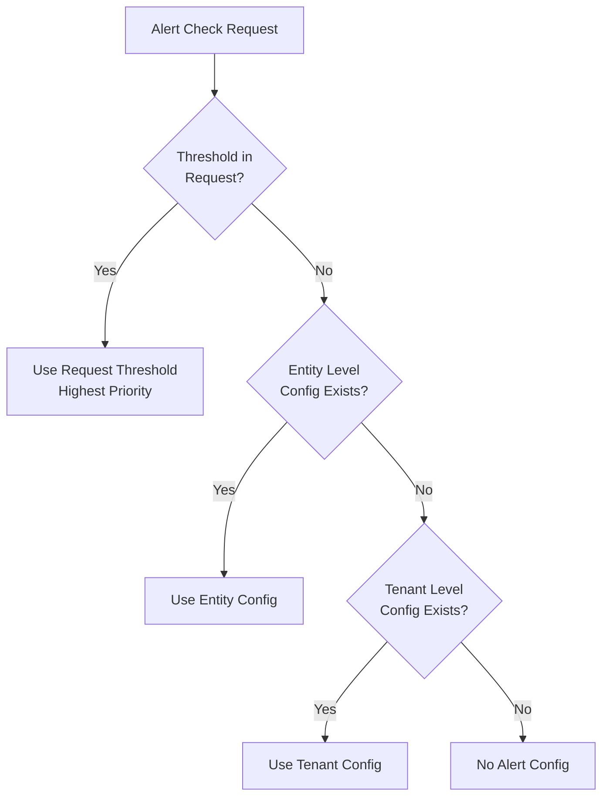
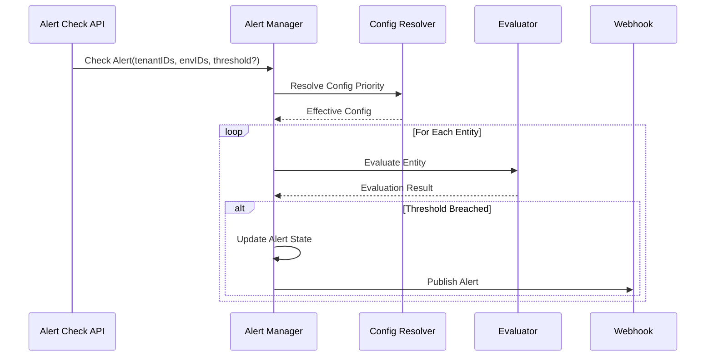
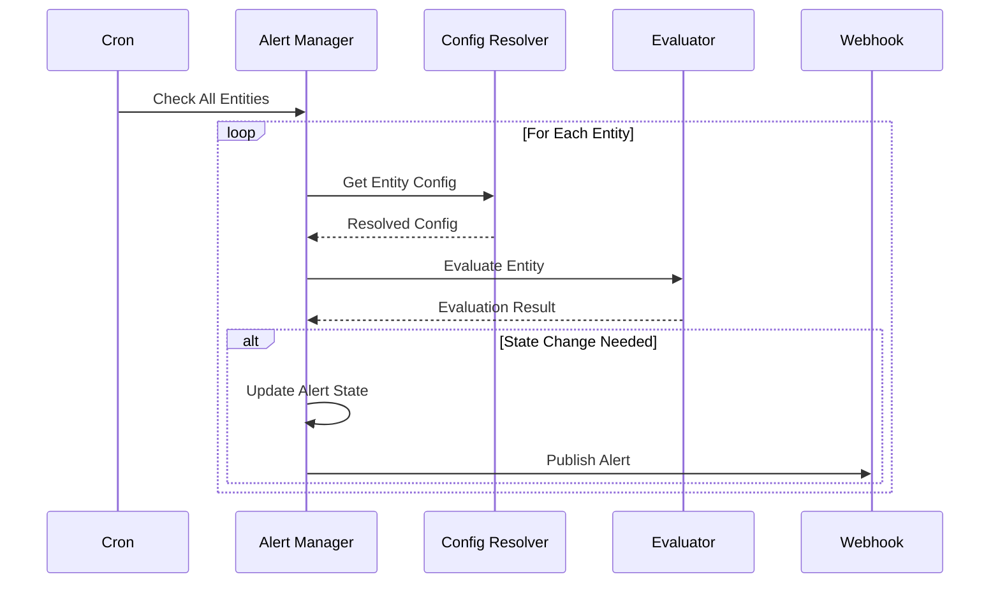

# Alert Engine Design Document

## Overview

The Alert Engine is a standalone system designed to handle threshold-based alerts across different components of the FlexPrice platform. The system supports multi-level alert configuration with clear precedence rules and can be triggered both via API and scheduled checks.

## Core Concepts

### 1. Alert Configuration Hierarchy



### 2. Configuration Models

```go
// Alert Check Request
type AlertCheckRequest struct {
    TenantIDs   []string        `json:"tenant_ids"`
    EnvIDs      []string        `json:"env_ids"`
    Threshold   *AlertThreshold `json:"threshold,omitempty"`
}

// Alert Threshold Configuration
type AlertThreshold struct {
    Inheritance string          `json:"inheritance"` // system, tenant, entity
    Type        string          `json:"type"`       // amount
    Value       decimal.Decimal `json:"value"`
}

// Entity Alert Configuration
type EntityAlertConfig struct {
    Enabled    bool           `json:"enabled"`
    Threshold  AlertThreshold `json:"threshold"`
    State      AlertState     `json:"state"`
    UpdatedAt  time.Time      `json:"updated_at"`
}

// Tenant Alert Configuration
type TenantAlertConfig struct {
    Enabled    bool           `json:"enabled"`
    Threshold  AlertThreshold `json:"threshold"`
    UpdatedAt  time.Time      `json:"updated_at"`
}
```

### 3. Alert States

```go
type AlertState string

const (
    AlertStateOK      AlertState = "ok"
    AlertStateInAlarm AlertState = "alert"
)
```

## Trigger Mechanisms

### 1. API Check Endpoint



### 2. Cron Job Flow



## Configuration Resolution

### 1. Priority Rules

1. **Request Threshold (Highest)**
   - If threshold provided in API request, use it
   - Overrides all other configurations

2. **Entity Level**
   - Entity-specific configuration
   - Used if no request threshold and config exists

3. **Tenant Level**
   - Tenant-wide configuration
   - Used if no request threshold and no entity config

### 2. Resolution Process

```go
func (r *ConfigResolver) ResolveConfig(ctx context.Context, req AlertCheckRequest, entityID string) (*AlertConfig, error) {
    // 1. Check request threshold (highest priority)
    if req.Threshold != nil {
        return &AlertConfig{
            Threshold: *req.Threshold,
            Inheritance: "request",
        }, nil
    }

    // 2. Check entity level config
    if entityConfig, exists := r.entityRepo.GetAlertConfig(entityID); exists {
        return &AlertConfig{
            Threshold: entityConfig.Threshold,
            Inheritance: "entity",
        }, nil
    }

    // 3. Check tenant level config
    if tenantConfig, exists := r.tenantRepo.GetAlertConfig(req.TenantIDs[0]); exists {
        return &AlertConfig{
            Threshold: tenantConfig.Threshold,
            Inheritance: "tenant",
        }, nil
    }

    return nil, errors.New("no alert configuration found")
}
```

## Alert Evaluation Flow

### 1. API Check Flow

```go
func (h *AlertHandler) HandleAlertCheck(ctx context.Context, req AlertCheckRequest) error {
    // 1. Validate request
    if err := h.validateRequest(req); err != nil {
        return err
    }

    // 2. Get entities for tenants/envs
    entities, err := h.entityRepo.GetEntitiesByTenantAndEnv(req.TenantIDs, req.EnvIDs)
    if err != nil {
        return err
    }

    // 3. Process each entity
    for _, entity := range entities {
        // Get config based on precedence
        config, err := h.configResolver.ResolveConfig(ctx, req, entity.ID)
        if err != nil {
            continue // Skip if no config
        }

        // Get current value
        value := h.getCurrentValue(entity)

        // Evaluate and trigger if needed
        if h.evaluator.ShouldTrigger(value, config.Threshold) {
            h.updateAlertState(entity, AlertStateInAlarm)
            h.webhookPublisher.PublishAlert(entity, config)
        }
    }

    return nil
}
```

### 2. Webhook Events

```go
const (
    WebhookEventAlertTriggered = "alert.triggered"
    WebhookEventAlertRecovered = "alert.recovered"
)

type AlertWebhookPayload struct {
    EntityID     string         `json:"entity_id"`
    EntityType   string         `json:"entity_type"` // wallet, entitlement, etc.
    TenantID     string         `json:"tenant_id"`
    EnvID        string         `json:"env_id"`
    AlertState   string         `json:"alert_state"`
    Threshold    AlertThreshold `json:"threshold"`
    CurrentValue interface{}    `json:"current_value"`
    Inheritance  string         `json:"inheritance"` // request, entity, tenant
}
```

## Implementation Components

### 1. Alert Manager
- Handles alert check requests
- Coordinates configuration resolution
- Manages alert state transitions
- Triggers webhook notifications

### 2. Config Resolver
- Implements configuration precedence rules
- Resolves effective configuration
- Handles tenant and entity level configs

### 3. Evaluator
- Performs threshold comparisons
- Supports different threshold types
- Handles value normalization

### 4. Webhook Publisher
- Delivers alert notifications
- Manages retry logic
- Handles webhook signatures

## Monitoring and Observability

### 1. Metrics
- Alert trigger count by type and level
- Configuration resolution stats
- Evaluation latency
- Webhook delivery success rate

### 2. Logging
```go
logger.Infow("alert evaluated",
    "entity_id", entity.ID,
    "entity_type", entity.Type,
    "tenant_id", entity.TenantID,
    "config_inheritance", config.Inheritance,
    "threshold", config.Threshold,
    "current_value", value,
    "alert_state", newState,
)
```

## Future Enhancements

1. **Advanced Configuration**
   - Multiple thresholds per entity
   - Time-based thresholds
   - Custom evaluation logic

2. **Notification Channels**
   - Email notifications
   - SMS alerts
   - Slack integration

3. **Analytics**
   - Alert frequency analysis
   - Pattern detection
   - Threshold optimization


   <svg aria-roledescription="sequence" role="graphics-document document" viewBox="-50 -10 1328 972" style="max-width: 1328px;" xmlns="http://www.w3.org/2000/svg" width="100%" id="mermaid-svg-1754297903277-sbclov21i"><rect class="rect" height="424" width="948" fill="rgb(220, 240, 200)" y="442" x="240"/><rect class="rect" height="357" width="1148" fill="rgb(200, 220, 240)" y="75" x="40"/><g><rect class="actor" ry="3" rx="3" height="65" width="150" stroke="#666" fill="#eaeaea" y="886" x="1078"/><text style="text-anchor: middle; font-size: 16px; font-weight: 400;" class="actor" alignment-baseline="central" dominant-baseline="central" y="918.5" x="1153"><tspan dy="0" x="1153">Webhook</tspan></text></g><g><rect class="actor" ry="3" rx="3" height="65" width="150" stroke="#666" fill="#eaeaea" y="886" x="878"/><text style="text-anchor: middle; font-size: 16px; font-weight: 400;" class="actor" alignment-baseline="central" dominant-baseline="central" y="918.5" x="953"><tspan dy="0" x="953">Evaluator</tspan></text></g><g><rect class="actor" ry="3" rx="3" height="65" width="150" stroke="#666" fill="#eaeaea" y="886" x="678"/><text style="text-anchor: middle; font-size: 16px; font-weight: 400;" class="actor" alignment-baseline="central" dominant-baseline="central" y="918.5" x="753"><tspan dy="0" x="753">Config Resolver</tspan></text></g><g><rect class="actor" ry="3" rx="3" height="65" width="150" stroke="#666" fill="#eaeaea" y="886" x="456"/><text style="text-anchor: middle; font-size: 16px; font-weight: 400;" class="actor" alignment-baseline="central" dominant-baseline="central" y="918.5" x="531"><tspan dy="0" x="531">Alert Manager</tspan></text></g><g><rect class="actor" ry="3" rx="3" height="65" width="150" stroke="#666" fill="#eaeaea" y="886" x="200"/><text style="text-anchor: middle; font-size: 16px; font-weight: 400;" class="actor" alignment-baseline="central" dominant-baseline="central" y="918.5" x="275"><tspan dy="0" x="275">Alert Check API</tspan></text></g><g><rect class="actor" ry="3" rx="3" height="65" width="150" stroke="#666" fill="#eaeaea" y="886" x="0"/><text style="text-anchor: middle; font-size: 16px; font-weight: 400;" class="actor" alignment-baseline="central" dominant-baseline="central" y="918.5" x="75"><tspan dy="0" x="75">Cron Job</tspan></text></g><g><line stroke="#999" stroke-width="0.5px" class="200" y2="886" x2="1153" y1="5" x1="1153" id="actor50"/><g id="root-50"><rect class="actor" ry="3" rx="3" height="65" width="150" stroke="#666" fill="#eaeaea" y="0" x="1078"/><text style="text-anchor: middle; font-size: 16px; font-weight: 400;" class="actor" alignment-baseline="central" dominant-baseline="central" y="32.5" x="1153"><tspan dy="0" x="1153">Webhook</tspan></text></g></g><g><line stroke="#999" stroke-width="0.5px" class="200" y2="886" x2="953" y1="5" x1="953" id="actor49"/><g id="root-49"><rect class="actor" ry="3" rx="3" height="65" width="150" stroke="#666" fill="#eaeaea" y="0" x="878"/><text style="text-anchor: middle; font-size: 16px; font-weight: 400;" class="actor" alignment-baseline="central" dominant-baseline="central" y="32.5" x="953"><tspan dy="0" x="953">Evaluator</tspan></text></g></g><g><line stroke="#999" stroke-width="0.5px" class="200" y2="886" x2="753" y1="5" x1="753" id="actor48"/><g id="root-48"><rect class="actor" ry="3" rx="3" height="65" width="150" stroke="#666" fill="#eaeaea" y="0" x="678"/><text style="text-anchor: middle; font-size: 16px; font-weight: 400;" class="actor" alignment-baseline="central" dominant-baseline="central" y="32.5" x="753"><tspan dy="0" x="753">Config Resolver</tspan></text></g></g><g><line stroke="#999" stroke-width="0.5px" class="200" y2="886" x2="531" y1="5" x1="531" id="actor47"/><g id="root-47"><rect class="actor" ry="3" rx="3" height="65" width="150" stroke="#666" fill="#eaeaea" y="0" x="456"/><text style="text-anchor: middle; font-size: 16px; font-weight: 400;" class="actor" alignment-baseline="central" dominant-baseline="central" y="32.5" x="531"><tspan dy="0" x="531">Alert Manager</tspan></text></g></g><g><line stroke="#999" stroke-width="0.5px" class="200" y2="886" x2="275" y1="5" x1="275" id="actor46"/><g id="root-46"><rect class="actor" ry="3" rx="3" height="65" width="150" stroke="#666" fill="#eaeaea" y="0" x="200"/><text style="text-anchor: middle; font-size: 16px; font-weight: 400;" class="actor" alignment-baseline="central" dominant-baseline="central" y="32.5" x="275"><tspan dy="0" x="275">Alert Check API</tspan></text></g></g><g><line stroke="#999" stroke-width="0.5px" class="200" y2="886" x2="75" y1="5" x1="75" id="actor45"/><g id="root-45"><rect class="actor" ry="3" rx="3" height="65" width="150" stroke="#666" fill="#eaeaea" y="0" x="0"/><text style="text-anchor: middle; font-size: 16px; font-weight: 400;" class="actor" alignment-baseline="central" dominant-baseline="central" y="32.5" x="75"><tspan dy="0" x="75">Cron Job</tspan></text></g></g><style>#mermaid-svg-1754297903277-sbclov21i{font-family:"trebuchet ms",verdana,arial,sans-serif;font-size:16px;fill:rgba(204, 204, 204, 0.87);}#mermaid-svg-1754297903277-sbclov21i .error-icon{fill:#bf616a;}#mermaid-svg-1754297903277-sbclov21i .error-text{fill:#bf616a;stroke:#bf616a;}#mermaid-svg-1754297903277-sbclov21i .edge-thickness-normal{stroke-width:2px;}#mermaid-svg-1754297903277-sbclov21i .edge-thickness-thick{stroke-width:3.5px;}#mermaid-svg-1754297903277-sbclov21i .edge-pattern-solid{stroke-dasharray:0;}#mermaid-svg-1754297903277-sbclov21i .edge-pattern-dashed{stroke-dasharray:3;}#mermaid-svg-1754297903277-sbclov21i .edge-pattern-dotted{stroke-dasharray:2;}#mermaid-svg-1754297903277-sbclov21i .marker{fill:rgba(204, 204, 204, 0.87);stroke:rgba(204, 204, 204, 0.87);}#mermaid-svg-1754297903277-sbclov21i .marker.cross{stroke:rgba(204, 204, 204, 0.87);}#mermaid-svg-1754297903277-sbclov21i svg{font-family:"trebuchet ms",verdana,arial,sans-serif;font-size:16px;}#mermaid-svg-1754297903277-sbclov21i .actor{stroke:hsl(210, 0%, 73.137254902%);fill:#81a1c1;}#mermaid-svg-1754297903277-sbclov21i text.actor&gt;tspan{fill:#191c22;stroke:none;}#mermaid-svg-1754297903277-sbclov21i .actor-line{stroke:rgba(204, 204, 204, 0.87);}#mermaid-svg-1754297903277-sbclov21i .messageLine0{stroke-width:1.5;stroke-dasharray:none;stroke:rgba(204, 204, 204, 0.87);}#mermaid-svg-1754297903277-sbclov21i .messageLine1{stroke-width:1.5;stroke-dasharray:2,2;stroke:rgba(204, 204, 204, 0.87);}#mermaid-svg-1754297903277-sbclov21i #arrowhead path{fill:rgba(204, 204, 204, 0.87);stroke:rgba(204, 204, 204, 0.87);}#mermaid-svg-1754297903277-sbclov21i .sequenceNumber{fill:rgba(204, 204, 204, 0.61);}#mermaid-svg-1754297903277-sbclov21i #sequencenumber{fill:rgba(204, 204, 204, 0.87);}#mermaid-svg-1754297903277-sbclov21i #crosshead path{fill:rgba(204, 204, 204, 0.87);stroke:rgba(204, 204, 204, 0.87);}#mermaid-svg-1754297903277-sbclov21i .messageText{fill:rgba(204, 204, 204, 0.87);stroke:none;}#mermaid-svg-1754297903277-sbclov21i .labelBox{stroke:#454545;fill:#141414;}#mermaid-svg-1754297903277-sbclov21i .labelText,#mermaid-svg-1754297903277-sbclov21i .labelText&gt;tspan{fill:rgba(204, 204, 204, 0.87);stroke:none;}#mermaid-svg-1754297903277-sbclov21i .loopText,#mermaid-svg-1754297903277-sbclov21i .loopText&gt;tspan{fill:#d8dee9;stroke:none;}#mermaid-svg-1754297903277-sbclov21i .loopLine{stroke-width:2px;stroke-dasharray:2,2;stroke:#454545;fill:#454545;}#mermaid-svg-1754297903277-sbclov21i .note{stroke:#2a2a2a;fill:#1a1a1a;}#mermaid-svg-1754297903277-sbclov21i .noteText,#mermaid-svg-1754297903277-sbclov21i .noteText&gt;tspan{fill:rgba(204, 204, 204, 0.87);stroke:none;}#mermaid-svg-1754297903277-sbclov21i .activation0{fill:rgba(64, 64, 64, 0.47);stroke:#30373a;}#mermaid-svg-1754297903277-sbclov21i .activation1{fill:rgba(64, 64, 64, 0.47);stroke:#30373a;}#mermaid-svg-1754297903277-sbclov21i .activation2{fill:rgba(64, 64, 64, 0.47);stroke:#30373a;}#mermaid-svg-1754297903277-sbclov21i .actorPopupMenu{position:absolute;}#mermaid-svg-1754297903277-sbclov21i .actorPopupMenuPanel{position:absolute;fill:#81a1c1;box-shadow:0px 8px 16px 0px rgba(0,0,0,0.2);filter:drop-shadow(3px 5px 2px rgb(0 0 0 / 0.4));}#mermaid-svg-1754297903277-sbclov21i .actor-man line{stroke:hsl(210, 0%, 73.137254902%);fill:#81a1c1;}#mermaid-svg-1754297903277-sbclov21i .actor-man circle,#mermaid-svg-1754297903277-sbclov21i line{stroke:hsl(210, 0%, 73.137254902%);fill:#81a1c1;stroke-width:2px;}#mermaid-svg-1754297903277-sbclov21i :root{--mermaid-font-family:"trebuchet ms",verdana,arial,sans-serif;}</style><g/><defs><symbol height="24" width="24" id="computer"><path d="M2 2v13h20v-13h-20zm18 11h-16v-9h16v9zm-10.228 6l.466-1h3.524l.467 1h-4.457zm14.228 3h-24l2-6h2.104l-1.33 4h18.45l-1.297-4h2.073l2 6zm-5-10h-14v-7h14v7z" transform="scale(.5)"/></symbol></defs><defs><symbol clip-rule="evenodd" fill-rule="evenodd" id="database"><path d="M12.258.001l.256.004.255.005.253.008.251.01.249.012.247.015.246.016.242.019.241.02.239.023.236.024.233.027.231.028.229.031.225.032.223.034.22.036.217.038.214.04.211.041.208.043.205.045.201.046.198.048.194.05.191.051.187.053.183.054.18.056.175.057.172.059.168.06.163.061.16.063.155.064.15.066.074.033.073.033.071.034.07.034.069.035.068.035.067.035.066.035.064.036.064.036.062.036.06.036.06.037.058.037.058.037.055.038.055.038.053.038.052.038.051.039.05.039.048.039.047.039.045.04.044.04.043.04.041.04.04.041.039.041.037.041.036.041.034.041.033.042.032.042.03.042.029.042.027.042.026.043.024.043.023.043.021.043.02.043.018.044.017.043.015.044.013.044.012.044.011.045.009.044.007.045.006.045.004.045.002.045.001.045v17l-.001.045-.002.045-.004.045-.006.045-.007.045-.009.044-.011.045-.012.044-.013.044-.015.044-.017.043-.018.044-.02.043-.021.043-.023.043-.024.043-.026.043-.027.042-.029.042-.03.042-.032.042-.033.042-.034.041-.036.041-.037.041-.039.041-.04.041-.041.04-.043.04-.044.04-.045.04-.047.039-.048.039-.05.039-.051.039-.052.038-.053.038-.055.038-.055.038-.058.037-.058.037-.06.037-.06.036-.062.036-.064.036-.064.036-.066.035-.067.035-.068.035-.069.035-.07.034-.071.034-.073.033-.074.033-.15.066-.155.064-.16.063-.163.061-.168.06-.172.059-.175.057-.18.056-.183.054-.187.053-.191.051-.194.05-.198.048-.201.046-.205.045-.208.043-.211.041-.214.04-.217.038-.22.036-.223.034-.225.032-.229.031-.231.028-.233.027-.236.024-.239.023-.241.02-.242.019-.246.016-.247.015-.249.012-.251.01-.253.008-.255.005-.256.004-.258.001-.258-.001-.256-.004-.255-.005-.253-.008-.251-.01-.249-.012-.247-.015-.245-.016-.243-.019-.241-.02-.238-.023-.236-.024-.234-.027-.231-.028-.228-.031-.226-.032-.223-.034-.22-.036-.217-.038-.214-.04-.211-.041-.208-.043-.204-.045-.201-.046-.198-.048-.195-.05-.19-.051-.187-.053-.184-.054-.179-.056-.176-.057-.172-.059-.167-.06-.164-.061-.159-.063-.155-.064-.151-.066-.074-.033-.072-.033-.072-.034-.07-.034-.069-.035-.068-.035-.067-.035-.066-.035-.064-.036-.063-.036-.062-.036-.061-.036-.06-.037-.058-.037-.057-.037-.056-.038-.055-.038-.053-.038-.052-.038-.051-.039-.049-.039-.049-.039-.046-.039-.046-.04-.044-.04-.043-.04-.041-.04-.04-.041-.039-.041-.037-.041-.036-.041-.034-.041-.033-.042-.032-.042-.03-.042-.029-.042-.027-.042-.026-.043-.024-.043-.023-.043-.021-.043-.02-.043-.018-.044-.017-.043-.015-.044-.013-.044-.012-.044-.011-.045-.009-.044-.007-.045-.006-.045-.004-.045-.002-.045-.001-.045v-17l.001-.045.002-.045.004-.045.006-.045.007-.045.009-.044.011-.045.012-.044.013-.044.015-.044.017-.043.018-.044.02-.043.021-.043.023-.043.024-.043.026-.043.027-.042.029-.042.03-.042.032-.042.033-.042.034-.041.036-.041.037-.041.039-.041.04-.041.041-.04.043-.04.044-.04.046-.04.046-.039.049-.039.049-.039.051-.039.052-.038.053-.038.055-.038.056-.038.057-.037.058-.037.06-.037.061-.036.062-.036.063-.036.064-.036.066-.035.067-.035.068-.035.069-.035.07-.034.072-.034.072-.033.074-.033.151-.066.155-.064.159-.063.164-.061.167-.06.172-.059.176-.057.179-.056.184-.054.187-.053.19-.051.195-.05.198-.048.201-.046.204-.045.208-.043.211-.041.214-.04.217-.038.22-.036.223-.034.226-.032.228-.031.231-.028.234-.027.236-.024.238-.023.241-.02.243-.019.245-.016.247-.015.249-.012.251-.01.253-.008.255-.005.256-.004.258-.001.258.001zm-9.258 20.499v.01l.001.021.003.021.004.022.005.021.006.022.007.022.009.023.01.022.011.023.012.023.013.023.015.023.016.024.017.023.018.024.019.024.021.024.022.025.023.024.024.025.052.049.056.05.061.051.066.051.07.051.075.051.079.052.084.052.088.052.092.052.097.052.102.051.105.052.11.052.114.051.119.051.123.051.127.05.131.05.135.05.139.048.144.049.147.047.152.047.155.047.16.045.163.045.167.043.171.043.176.041.178.041.183.039.187.039.19.037.194.035.197.035.202.033.204.031.209.03.212.029.216.027.219.025.222.024.226.021.23.02.233.018.236.016.24.015.243.012.246.01.249.008.253.005.256.004.259.001.26-.001.257-.004.254-.005.25-.008.247-.011.244-.012.241-.014.237-.016.233-.018.231-.021.226-.021.224-.024.22-.026.216-.027.212-.028.21-.031.205-.031.202-.034.198-.034.194-.036.191-.037.187-.039.183-.04.179-.04.175-.042.172-.043.168-.044.163-.045.16-.046.155-.046.152-.047.148-.048.143-.049.139-.049.136-.05.131-.05.126-.05.123-.051.118-.052.114-.051.11-.052.106-.052.101-.052.096-.052.092-.052.088-.053.083-.051.079-.052.074-.052.07-.051.065-.051.06-.051.056-.05.051-.05.023-.024.023-.025.021-.024.02-.024.019-.024.018-.024.017-.024.015-.023.014-.024.013-.023.012-.023.01-.023.01-.022.008-.022.006-.022.006-.022.004-.022.004-.021.001-.021.001-.021v-4.127l-.077.055-.08.053-.083.054-.085.053-.087.052-.09.052-.093.051-.095.05-.097.05-.1.049-.102.049-.105.048-.106.047-.109.047-.111.046-.114.045-.115.045-.118.044-.12.043-.122.042-.124.042-.126.041-.128.04-.13.04-.132.038-.134.038-.135.037-.138.037-.139.035-.142.035-.143.034-.144.033-.147.032-.148.031-.15.03-.151.03-.153.029-.154.027-.156.027-.158.026-.159.025-.161.024-.162.023-.163.022-.165.021-.166.02-.167.019-.169.018-.169.017-.171.016-.173.015-.173.014-.175.013-.175.012-.177.011-.178.01-.179.008-.179.008-.181.006-.182.005-.182.004-.184.003-.184.002h-.37l-.184-.002-.184-.003-.182-.004-.182-.005-.181-.006-.179-.008-.179-.008-.178-.01-.176-.011-.176-.012-.175-.013-.173-.014-.172-.015-.171-.016-.17-.017-.169-.018-.167-.019-.166-.02-.165-.021-.163-.022-.162-.023-.161-.024-.159-.025-.157-.026-.156-.027-.155-.027-.153-.029-.151-.03-.15-.03-.148-.031-.146-.032-.145-.033-.143-.034-.141-.035-.14-.035-.137-.037-.136-.037-.134-.038-.132-.038-.13-.04-.128-.04-.126-.041-.124-.042-.122-.042-.12-.044-.117-.043-.116-.045-.113-.045-.112-.046-.109-.047-.106-.047-.105-.048-.102-.049-.1-.049-.097-.05-.095-.05-.093-.052-.09-.051-.087-.052-.085-.053-.083-.054-.08-.054-.077-.054v4.127zm0-5.654v.011l.001.021.003.021.004.021.005.022.006.022.007.022.009.022.01.022.011.023.012.023.013.023.015.024.016.023.017.024.018.024.019.024.021.024.022.024.023.025.024.024.052.05.056.05.061.05.066.051.07.051.075.052.079.051.084.052.088.052.092.052.097.052.102.052.105.052.11.051.114.051.119.052.123.05.127.051.131.05.135.049.139.049.144.048.147.048.152.047.155.046.16.045.163.045.167.044.171.042.176.042.178.04.183.04.187.038.19.037.194.036.197.034.202.033.204.032.209.03.212.028.216.027.219.025.222.024.226.022.23.02.233.018.236.016.24.014.243.012.246.01.249.008.253.006.256.003.259.001.26-.001.257-.003.254-.006.25-.008.247-.01.244-.012.241-.015.237-.016.233-.018.231-.02.226-.022.224-.024.22-.025.216-.027.212-.029.21-.03.205-.032.202-.033.198-.035.194-.036.191-.037.187-.039.183-.039.179-.041.175-.042.172-.043.168-.044.163-.045.16-.045.155-.047.152-.047.148-.048.143-.048.139-.05.136-.049.131-.05.126-.051.123-.051.118-.051.114-.052.11-.052.106-.052.101-.052.096-.052.092-.052.088-.052.083-.052.079-.052.074-.051.07-.052.065-.051.06-.05.056-.051.051-.049.023-.025.023-.024.021-.025.02-.024.019-.024.018-.024.017-.024.015-.023.014-.023.013-.024.012-.022.01-.023.01-.023.008-.022.006-.022.006-.022.004-.021.004-.022.001-.021.001-.021v-4.139l-.077.054-.08.054-.083.054-.085.052-.087.053-.09.051-.093.051-.095.051-.097.05-.1.049-.102.049-.105.048-.106.047-.109.047-.111.046-.114.045-.115.044-.118.044-.12.044-.122.042-.124.042-.126.041-.128.04-.13.039-.132.039-.134.038-.135.037-.138.036-.139.036-.142.035-.143.033-.144.033-.147.033-.148.031-.15.03-.151.03-.153.028-.154.028-.156.027-.158.026-.159.025-.161.024-.162.023-.163.022-.165.021-.166.02-.167.019-.169.018-.169.017-.171.016-.173.015-.173.014-.175.013-.175.012-.177.011-.178.009-.179.009-.179.007-.181.007-.182.005-.182.004-.184.003-.184.002h-.37l-.184-.002-.184-.003-.182-.004-.182-.005-.181-.007-.179-.007-.179-.009-.178-.009-.176-.011-.176-.012-.175-.013-.173-.014-.172-.015-.171-.016-.17-.017-.169-.018-.167-.019-.166-.02-.165-.021-.163-.022-.162-.023-.161-.024-.159-.025-.157-.026-.156-.027-.155-.028-.153-.028-.151-.03-.15-.03-.148-.031-.146-.033-.145-.033-.143-.033-.141-.035-.14-.036-.137-.036-.136-.037-.134-.038-.132-.039-.13-.039-.128-.04-.126-.041-.124-.042-.122-.043-.12-.043-.117-.044-.116-.044-.113-.046-.112-.046-.109-.046-.106-.047-.105-.048-.102-.049-.1-.049-.097-.05-.095-.051-.093-.051-.09-.051-.087-.053-.085-.052-.083-.054-.08-.054-.077-.054v4.139zm0-5.666v.011l.001.02.003.022.004.021.005.022.006.021.007.022.009.023.01.022.011.023.012.023.013.023.015.023.016.024.017.024.018.023.019.024.021.025.022.024.023.024.024.025.052.05.056.05.061.05.066.051.07.051.075.052.079.051.084.052.088.052.092.052.097.052.102.052.105.051.11.052.114.051.119.051.123.051.127.05.131.05.135.05.139.049.144.048.147.048.152.047.155.046.16.045.163.045.167.043.171.043.176.042.178.04.183.04.187.038.19.037.194.036.197.034.202.033.204.032.209.03.212.028.216.027.219.025.222.024.226.021.23.02.233.018.236.017.24.014.243.012.246.01.249.008.253.006.256.003.259.001.26-.001.257-.003.254-.006.25-.008.247-.01.244-.013.241-.014.237-.016.233-.018.231-.02.226-.022.224-.024.22-.025.216-.027.212-.029.21-.03.205-.032.202-.033.198-.035.194-.036.191-.037.187-.039.183-.039.179-.041.175-.042.172-.043.168-.044.163-.045.16-.045.155-.047.152-.047.148-.048.143-.049.139-.049.136-.049.131-.051.126-.05.123-.051.118-.052.114-.051.11-.052.106-.052.101-.052.096-.052.092-.052.088-.052.083-.052.079-.052.074-.052.07-.051.065-.051.06-.051.056-.05.051-.049.023-.025.023-.025.021-.024.02-.024.019-.024.018-.024.017-.024.015-.023.014-.024.013-.023.012-.023.01-.022.01-.023.008-.022.006-.022.006-.022.004-.022.004-.021.001-.021.001-.021v-4.153l-.077.054-.08.054-.083.053-.085.053-.087.053-.09.051-.093.051-.095.051-.097.05-.1.049-.102.048-.105.048-.106.048-.109.046-.111.046-.114.046-.115.044-.118.044-.12.043-.122.043-.124.042-.126.041-.128.04-.13.039-.132.039-.134.038-.135.037-.138.036-.139.036-.142.034-.143.034-.144.033-.147.032-.148.032-.15.03-.151.03-.153.028-.154.028-.156.027-.158.026-.159.024-.161.024-.162.023-.163.023-.165.021-.166.02-.167.019-.169.018-.169.017-.171.016-.173.015-.173.014-.175.013-.175.012-.177.01-.178.01-.179.009-.179.007-.181.006-.182.006-.182.004-.184.003-.184.001-.185.001-.185-.001-.184-.001-.184-.003-.182-.004-.182-.006-.181-.006-.179-.007-.179-.009-.178-.01-.176-.01-.176-.012-.175-.013-.173-.014-.172-.015-.171-.016-.17-.017-.169-.018-.167-.019-.166-.02-.165-.021-.163-.023-.162-.023-.161-.024-.159-.024-.157-.026-.156-.027-.155-.028-.153-.028-.151-.03-.15-.03-.148-.032-.146-.032-.145-.033-.143-.034-.141-.034-.14-.036-.137-.036-.136-.037-.134-.038-.132-.039-.13-.039-.128-.041-.126-.041-.124-.041-.122-.043-.12-.043-.117-.044-.116-.044-.113-.046-.112-.046-.109-.046-.106-.048-.105-.048-.102-.048-.1-.05-.097-.049-.095-.051-.093-.051-.09-.052-.087-.052-.085-.053-.083-.053-.08-.054-.077-.054v4.153zm8.74-8.179l-.257.004-.254.005-.25.008-.247.011-.244.012-.241.014-.237.016-.233.018-.231.021-.226.022-.224.023-.22.026-.216.027-.212.028-.21.031-.205.032-.202.033-.198.034-.194.036-.191.038-.187.038-.183.04-.179.041-.175.042-.172.043-.168.043-.163.045-.16.046-.155.046-.152.048-.148.048-.143.048-.139.049-.136.05-.131.05-.126.051-.123.051-.118.051-.114.052-.11.052-.106.052-.101.052-.096.052-.092.052-.088.052-.083.052-.079.052-.074.051-.07.052-.065.051-.06.05-.056.05-.051.05-.023.025-.023.024-.021.024-.02.025-.019.024-.018.024-.017.023-.015.024-.014.023-.013.023-.012.023-.01.023-.01.022-.008.022-.006.023-.006.021-.004.022-.004.021-.001.021-.001.021.001.021.001.021.004.021.004.022.006.021.006.023.008.022.01.022.01.023.012.023.013.023.014.023.015.024.017.023.018.024.019.024.02.025.021.024.023.024.023.025.051.05.056.05.06.05.065.051.07.052.074.051.079.052.083.052.088.052.092.052.096.052.101.052.106.052.11.052.114.052.118.051.123.051.126.051.131.05.136.05.139.049.143.048.148.048.152.048.155.046.16.046.163.045.168.043.172.043.175.042.179.041.183.04.187.038.191.038.194.036.198.034.202.033.205.032.21.031.212.028.216.027.22.026.224.023.226.022.231.021.233.018.237.016.241.014.244.012.247.011.25.008.254.005.257.004.26.001.26-.001.257-.004.254-.005.25-.008.247-.011.244-.012.241-.014.237-.016.233-.018.231-.021.226-.022.224-.023.22-.026.216-.027.212-.028.21-.031.205-.032.202-.033.198-.034.194-.036.191-.038.187-.038.183-.04.179-.041.175-.042.172-.043.168-.043.163-.045.16-.046.155-.046.152-.048.148-.048.143-.048.139-.049.136-.05.131-.05.126-.051.123-.051.118-.051.114-.052.11-.052.106-.052.101-.052.096-.052.092-.052.088-.052.083-.052.079-.052.074-.051.07-.052.065-.051.06-.05.056-.05.051-.05.023-.025.023-.024.021-.024.02-.025.019-.024.018-.024.017-.023.015-.024.014-.023.013-.023.012-.023.01-.023.01-.022.008-.022.006-.023.006-.021.004-.022.004-.021.001-.021.001-.021-.001-.021-.001-.021-.004-.021-.004-.022-.006-.021-.006-.023-.008-.022-.01-.022-.01-.023-.012-.023-.013-.023-.014-.023-.015-.024-.017-.023-.018-.024-.019-.024-.02-.025-.021-.024-.023-.024-.023-.025-.051-.05-.056-.05-.06-.05-.065-.051-.07-.052-.074-.051-.079-.052-.083-.052-.088-.052-.092-.052-.096-.052-.101-.052-.106-.052-.11-.052-.114-.052-.118-.051-.123-.051-.126-.051-.131-.05-.136-.05-.139-.049-.143-.048-.148-.048-.152-.048-.155-.046-.16-.046-.163-.045-.168-.043-.172-.043-.175-.042-.179-.041-.183-.04-.187-.038-.191-.038-.194-.036-.198-.034-.202-.033-.205-.032-.21-.031-.212-.028-.216-.027-.22-.026-.224-.023-.226-.022-.231-.021-.233-.018-.237-.016-.241-.014-.244-.012-.247-.011-.25-.008-.254-.005-.257-.004-.26-.001-.26.001z" transform="scale(.5)"/></symbol></defs><defs><symbol height="24" width="24" id="clock"><path d="M12 2c5.514 0 10 4.486 10 10s-4.486 10-10 10-10-4.486-10-10 4.486-10 10-10zm0-2c-6.627 0-12 5.373-12 12s5.373 12 12 12 12-5.373 12-12-5.373-12-12-12zm5.848 12.459c.202.038.202.333.001.372-1.907.361-6.045 1.111-6.547 1.111-.719 0-1.301-.582-1.301-1.301 0-.512.77-5.447 1.125-7.445.034-.192.312-.181.343.014l.985 6.238 5.394 1.011z" transform="scale(.5)"/></symbol></defs><defs><marker orient="auto" markerHeight="12" markerWidth="12" markerUnits="userSpaceOnUse" refY="5" refX="7.9" id="arrowhead"><path d="M 0 0 L 10 5 L 0 10 z"/></marker></defs><defs><marker refY="4.5" refX="4" orient="auto" markerHeight="8" markerWidth="15" id="crosshead"><path style="stroke-dasharray: 0, 0;" d="M 1,2 L 6,7 M 6,2 L 1,7" stroke-width="1pt" stroke="#000000" fill="none"/></marker></defs><defs><marker orient="auto" markerHeight="28" markerWidth="20" refY="7" refX="15.5" id="filled-head"><path d="M 18,7 L9,13 L14,7 L9,1 Z"/></marker></defs><defs><marker orient="auto" markerHeight="40" markerWidth="60" refY="15" refX="15" id="sequencenumber"><circle r="6" cy="15" cx="15"/></marker></defs><g><rect class="note" ry="0" rx="0" height="39" width="1128" stroke="#666" fill="#EDF2AE" y="95" x="50"/><text style="font-size: 16px; font-weight: 400;" dy="1em" class="noteText" alignment-baseline="middle" dominant-baseline="middle" text-anchor="middle" y="100" x="614"><tspan x="614">Cron Workflow</tspan></text></g><g><rect class="note" ry="0" rx="0" height="39" width="928" stroke="#666" fill="#EDF2AE" y="462" x="250"/><text style="font-size: 16px; font-weight: 400;" dy="1em" class="noteText" alignment-baseline="middle" dominant-baseline="middle" text-anchor="middle" y="467" x="714"><tspan x="714">API Check Workflow</tspan></text></g><g><rect class="note" ry="0" rx="0" height="57" width="154" stroke="#666" fill="#EDF2AE" y="559" x="454"/><text style="font-size: 16px; font-weight: 400;" dy="1em" class="noteText" alignment-baseline="middle" dominant-baseline="middle" text-anchor="middle" y="564" x="531"><tspan x="531">Request may include</tspan></text><text style="font-size: 16px; font-weight: 400;" dy="1em" class="noteText" alignment-baseline="middle" dominant-baseline="middle" text-anchor="middle" y="583" x="531"><tspan x="531">threshold override</tspan></text></g><text style="font-size: 16px; font-weight: 400;" dy="1em" class="messageText" alignment-baseline="middle" dominant-baseline="middle" text-anchor="middle" y="149" x="302">Check All Entities</text><line style="fill: none;" marker-end="url(#arrowhead)" stroke="none" stroke-width="2" class="messageLine0" y2="182" x2="527" y1="182" x1="76"/><text style="font-size: 16px; font-weight: 400;" dy="1em" class="messageText" alignment-baseline="middle" dominant-baseline="middle" text-anchor="middle" y="197" x="641">Get Configs</text><line style="fill: none;" marker-end="url(#arrowhead)" stroke="none" stroke-width="2" class="messageLine0" y2="230" x2="749" y1="230" x1="532"/><text style="font-size: 16px; font-weight: 400;" dy="1em" class="messageText" alignment-baseline="middle" dominant-baseline="middle" text-anchor="middle" y="245" x="644">Tenant/Entity Configs</text><line style="stroke-dasharray: 3, 3; fill: none;" marker-end="url(#arrowhead)" stroke="none" stroke-width="2" class="messageLine1" y2="278" x2="535" y1="278" x1="752"/><text style="font-size: 16px; font-weight: 400;" dy="1em" class="messageText" alignment-baseline="middle" dominant-baseline="middle" text-anchor="middle" y="293" x="741">Evaluate Each Entity</text><line style="fill: none;" marker-end="url(#arrowhead)" stroke="none" stroke-width="2" class="messageLine0" y2="326" x2="949" y1="326" x1="532"/><text style="font-size: 16px; font-weight: 400;" dy="1em" class="messageText" alignment-baseline="middle" dominant-baseline="middle" text-anchor="middle" y="341" x="744">Evaluation Results</text><line style="stroke-dasharray: 3, 3; fill: none;" marker-end="url(#arrowhead)" stroke="none" stroke-width="2" class="messageLine1" y2="374" x2="535" y1="374" x1="952"/><text style="font-size: 16px; font-weight: 400;" dy="1em" class="messageText" alignment-baseline="middle" dominant-baseline="middle" text-anchor="middle" y="389" x="841">Publish Alerts if Needed</text><line style="fill: none;" marker-end="url(#arrowhead)" stroke="none" stroke-width="2" class="messageLine0" y2="422" x2="1149" y1="422" x1="532"/><text style="font-size: 16px; font-weight: 400;" dy="1em" class="messageText" alignment-baseline="middle" dominant-baseline="middle" text-anchor="middle" y="516" x="402">Check Specific Tenants/Envs</text><line style="fill: none;" marker-end="url(#arrowhead)" stroke="none" stroke-width="2" class="messageLine0" y2="549" x2="527" y1="549" x1="276"/><text style="font-size: 16px; font-weight: 400;" dy="1em" class="messageText" alignment-baseline="middle" dominant-baseline="middle" text-anchor="middle" y="631" x="641">Get Configs</text><line style="fill: none;" marker-end="url(#arrowhead)" stroke="none" stroke-width="2" class="messageLine0" y2="664" x2="749" y1="664" x1="532"/><text style="font-size: 16px; font-weight: 400;" dy="1em" class="messageText" alignment-baseline="middle" dominant-baseline="middle" text-anchor="middle" y="679" x="644">Resolve Config Priority</text><line style="stroke-dasharray: 3, 3; fill: none;" marker-end="url(#arrowhead)" stroke="none" stroke-width="2" class="messageLine1" y2="712" x2="535" y1="712" x1="752"/><text style="font-size: 16px; font-weight: 400;" dy="1em" class="messageText" alignment-baseline="middle" dominant-baseline="middle" text-anchor="middle" y="727" x="741">Evaluate Entities</text><line style="fill: none;" marker-end="url(#arrowhead)" stroke="none" stroke-width="2" class="messageLine0" y2="760" x2="949" y1="760" x1="532"/><text style="font-size: 16px; font-weight: 400;" dy="1em" class="messageText" alignment-baseline="middle" dominant-baseline="middle" text-anchor="middle" y="775" x="744">Evaluation Results</text><line style="stroke-dasharray: 3, 3; fill: none;" marker-end="url(#arrowhead)" stroke="none" stroke-width="2" class="messageLine1" y2="808" x2="535" y1="808" x1="952"/><text style="font-size: 16px; font-weight: 400;" dy="1em" class="messageText" alignment-baseline="middle" dominant-baseline="middle" text-anchor="middle" y="823" x="841">Publish Alerts if Needed</text><line style="fill: none;" marker-end="url(#arrowhead)" stroke="none" stroke-width="2" class="messageLine0" y2="856" x2="1149" y1="856" x1="532"/></svg>


   <svg aria-roledescription="flowchart-v2" role="graphics-document document" viewBox="-8 -8 578.5703125 821.1328125" style="max-width: 578.5703125px;" xmlns="http://www.w3.org/2000/svg" width="100%" id="mermaid-svg-1754297896979-s1l71yqb2"><style>#mermaid-svg-1754297896979-s1l71yqb2{font-family:"trebuchet ms",verdana,arial,sans-serif;font-size:16px;fill:rgba(204, 204, 204, 0.87);}#mermaid-svg-1754297896979-s1l71yqb2 .error-icon{fill:#bf616a;}#mermaid-svg-1754297896979-s1l71yqb2 .error-text{fill:#bf616a;stroke:#bf616a;}#mermaid-svg-1754297896979-s1l71yqb2 .edge-thickness-normal{stroke-width:2px;}#mermaid-svg-1754297896979-s1l71yqb2 .edge-thickness-thick{stroke-width:3.5px;}#mermaid-svg-1754297896979-s1l71yqb2 .edge-pattern-solid{stroke-dasharray:0;}#mermaid-svg-1754297896979-s1l71yqb2 .edge-pattern-dashed{stroke-dasharray:3;}#mermaid-svg-1754297896979-s1l71yqb2 .edge-pattern-dotted{stroke-dasharray:2;}#mermaid-svg-1754297896979-s1l71yqb2 .marker{fill:rgba(204, 204, 204, 0.87);stroke:rgba(204, 204, 204, 0.87);}#mermaid-svg-1754297896979-s1l71yqb2 .marker.cross{stroke:rgba(204, 204, 204, 0.87);}#mermaid-svg-1754297896979-s1l71yqb2 svg{font-family:"trebuchet ms",verdana,arial,sans-serif;font-size:16px;}#mermaid-svg-1754297896979-s1l71yqb2 .label{font-family:"trebuchet ms",verdana,arial,sans-serif;color:rgba(204, 204, 204, 0.87);}#mermaid-svg-1754297896979-s1l71yqb2 .cluster-label text{fill:#ffffff;}#mermaid-svg-1754297896979-s1l71yqb2 .cluster-label span,#mermaid-svg-1754297896979-s1l71yqb2 p{color:#ffffff;}#mermaid-svg-1754297896979-s1l71yqb2 .label text,#mermaid-svg-1754297896979-s1l71yqb2 span,#mermaid-svg-1754297896979-s1l71yqb2 p{fill:rgba(204, 204, 204, 0.87);color:rgba(204, 204, 204, 0.87);}#mermaid-svg-1754297896979-s1l71yqb2 .node rect,#mermaid-svg-1754297896979-s1l71yqb2 .node circle,#mermaid-svg-1754297896979-s1l71yqb2 .node ellipse,#mermaid-svg-1754297896979-s1l71yqb2 .node polygon,#mermaid-svg-1754297896979-s1l71yqb2 .node path{fill:#1a1a1a;stroke:#2a2a2a;stroke-width:1px;}#mermaid-svg-1754297896979-s1l71yqb2 .flowchart-label text{text-anchor:middle;}#mermaid-svg-1754297896979-s1l71yqb2 .node .label{text-align:center;}#mermaid-svg-1754297896979-s1l71yqb2 .node.clickable{cursor:pointer;}#mermaid-svg-1754297896979-s1l71yqb2 .arrowheadPath{fill:#e5e5e5;}#mermaid-svg-1754297896979-s1l71yqb2 .edgePath .path{stroke:rgba(204, 204, 204, 0.87);stroke-width:2.0px;}#mermaid-svg-1754297896979-s1l71yqb2 .flowchart-link{stroke:rgba(204, 204, 204, 0.87);fill:none;}#mermaid-svg-1754297896979-s1l71yqb2 .edgeLabel{background-color:#1a1a1a99;text-align:center;}#mermaid-svg-1754297896979-s1l71yqb2 .edgeLabel rect{opacity:0.5;background-color:#1a1a1a99;fill:#1a1a1a99;}#mermaid-svg-1754297896979-s1l71yqb2 .labelBkg{background-color:rgba(26, 26, 26, 0.5);}#mermaid-svg-1754297896979-s1l71yqb2 .cluster rect{fill:rgba(64, 64, 64, 0.47);stroke:#30373a;stroke-width:1px;}#mermaid-svg-1754297896979-s1l71yqb2 .cluster text{fill:#ffffff;}#mermaid-svg-1754297896979-s1l71yqb2 .cluster span,#mermaid-svg-1754297896979-s1l71yqb2 p{color:#ffffff;}#mermaid-svg-1754297896979-s1l71yqb2 div.mermaidTooltip{position:absolute;text-align:center;max-width:200px;padding:2px;font-family:"trebuchet ms",verdana,arial,sans-serif;font-size:12px;background:#88c0d0;border:1px solid #30373a;border-radius:2px;pointer-events:none;z-index:100;}#mermaid-svg-1754297896979-s1l71yqb2 .flowchartTitleText{text-anchor:middle;font-size:18px;fill:rgba(204, 204, 204, 0.87);}#mermaid-svg-1754297896979-s1l71yqb2 :root{--mermaid-font-family:"trebuchet ms",verdana,arial,sans-serif;}</style><g><marker orient="auto" markerHeight="12" markerWidth="12" markerUnits="userSpaceOnUse" refY="5" refX="6" viewBox="0 0 10 10" class="marker flowchart" id="mermaid-svg-1754297896979-s1l71yqb2_flowchart-pointEnd"><path style="stroke-width: 1; stroke-dasharray: 1, 0;" class="arrowMarkerPath" d="M 0 0 L 10 5 L 0 10 z"/></marker><marker orient="auto" markerHeight="12" markerWidth="12" markerUnits="userSpaceOnUse" refY="5" refX="4.5" viewBox="0 0 10 10" class="marker flowchart" id="mermaid-svg-1754297896979-s1l71yqb2_flowchart-pointStart"><path style="stroke-width: 1; stroke-dasharray: 1, 0;" class="arrowMarkerPath" d="M 0 5 L 10 10 L 10 0 z"/></marker><marker orient="auto" markerHeight="11" markerWidth="11" markerUnits="userSpaceOnUse" refY="5" refX="11" viewBox="0 0 10 10" class="marker flowchart" id="mermaid-svg-1754297896979-s1l71yqb2_flowchart-circleEnd"><circle style="stroke-width: 1; stroke-dasharray: 1, 0;" class="arrowMarkerPath" r="5" cy="5" cx="5"/></marker><marker orient="auto" markerHeight="11" markerWidth="11" markerUnits="userSpaceOnUse" refY="5" refX="-1" viewBox="0 0 10 10" class="marker flowchart" id="mermaid-svg-1754297896979-s1l71yqb2_flowchart-circleStart"><circle style="stroke-width: 1; stroke-dasharray: 1, 0;" class="arrowMarkerPath" r="5" cy="5" cx="5"/></marker><marker orient="auto" markerHeight="11" markerWidth="11" markerUnits="userSpaceOnUse" refY="5.2" refX="12" viewBox="0 0 11 11" class="marker cross flowchart" id="mermaid-svg-1754297896979-s1l71yqb2_flowchart-crossEnd"><path style="stroke-width: 2; stroke-dasharray: 1, 0;" class="arrowMarkerPath" d="M 1,1 l 9,9 M 10,1 l -9,9"/></marker><marker orient="auto" markerHeight="11" markerWidth="11" markerUnits="userSpaceOnUse" refY="5.2" refX="-1" viewBox="0 0 11 11" class="marker cross flowchart" id="mermaid-svg-1754297896979-s1l71yqb2_flowchart-crossStart"><path style="stroke-width: 2; stroke-dasharray: 1, 0;" class="arrowMarkerPath" d="M 1,1 l 9,9 M 10,1 l -9,9"/></marker><g class="root"><g class="clusters"/><g class="edgePaths"><path marker-end="url(#mermaid-svg-1754297896979-s1l71yqb2_flowchart-pointEnd)" style="fill:none;" class="edge-thickness-normal edge-pattern-solid flowchart-link LS-A LE-B" id="L-A-B-0" d="M198.59,33.5L198.59,37.667C198.59,41.833,198.59,50.167,198.656,57.7C198.722,65.234,198.854,71.967,198.92,75.334L198.986,78.701"/><path marker-end="url(#mermaid-svg-1754297896979-s1l71yqb2_flowchart-pointEnd)" style="fill:none;" class="edge-thickness-normal edge-pattern-solid flowchart-link LS-B LE-C" id="L-B-C-0" d="M160.537,200.987L148.526,213.037C136.515,225.087,112.492,249.188,100.48,275.359C88.469,301.53,88.469,329.771,88.469,343.892L88.469,358.013"/><path marker-end="url(#mermaid-svg-1754297896979-s1l71yqb2_flowchart-pointEnd)" style="fill:none;" class="edge-thickness-normal edge-pattern-solid flowchart-link LS-B LE-D" id="L-B-D-0" d="M237.642,200.987L249.487,213.037C261.332,225.087,285.021,249.188,296.937,266.147C308.852,283.106,308.993,292.923,309.064,297.831L309.135,302.74"/><path marker-end="url(#mermaid-svg-1754297896979-s1l71yqb2_flowchart-pointEnd)" style="fill:none;" class="edge-thickness-normal edge-pattern-solid flowchart-link LS-D LE-E" id="L-D-E-0" d="M271.275,433.65L260.78,445.597C250.285,457.545,229.295,481.44,218.8,509.05C208.305,536.66,208.305,567.985,208.305,583.647L208.305,599.309"/><path marker-end="url(#mermaid-svg-1754297896979-s1l71yqb2_flowchart-pointEnd)" style="fill:none;" class="edge-thickness-normal edge-pattern-solid flowchart-link LS-D LE-F" id="L-D-F-0" d="M347.147,433.65L357.476,445.597C367.804,457.545,388.461,481.44,398.86,498.297C409.258,515.153,409.4,524.97,409.47,529.878L409.541,534.786"/><path marker-end="url(#mermaid-svg-1754297896979-s1l71yqb2_flowchart-pointEnd)" style="fill:none;" class="edge-thickness-normal edge-pattern-solid flowchart-link LS-F LE-G" id="L-F-G-0" d="M373.507,667.523L364.15,679.166C354.794,690.809,336.08,714.096,326.724,730.564C317.367,747.033,317.367,756.683,317.367,761.508L317.367,766.333"/><path marker-end="url(#mermaid-svg-1754297896979-s1l71yqb2_flowchart-pointEnd)" style="fill:none;" class="edge-thickness-normal edge-pattern-solid flowchart-link LS-F LE-H" id="L-F-H-0" d="M445.727,667.523L454.917,679.166C464.107,690.809,482.487,714.096,491.677,730.564C500.867,747.033,500.867,756.683,500.867,761.508L500.867,766.333"/></g><g class="edgeLabels"><g class="edgeLabel"><g transform="translate(0, 0)" class="label"><foreignObject height="0" width="0"><div style="display: inline-block; white-space: nowrap;" xmlns="http://www.w3.org/1999/xhtml"><span class="edgeLabel"></span></div></foreignObject></g></g><g transform="translate(88.46875, 273.2890625)" class="edgeLabel"><g transform="translate(-11.32421875, -9.25)" class="label"><foreignObject height="18.5" width="22.6484375"><div style="display: inline-block; white-space: nowrap;" xmlns="http://www.w3.org/1999/xhtml"><span class="edgeLabel">Yes</span></div></foreignObject></g></g><g transform="translate(308.7109375, 273.2890625)" class="edgeLabel"><g transform="translate(-9.3984375, -9.25)" class="label"><foreignObject height="18.5" width="18.796875"><div style="display: inline-block; white-space: nowrap;" xmlns="http://www.w3.org/1999/xhtml"><span class="edgeLabel">No</span></div></foreignObject></g></g><g transform="translate(208.3046875, 505.3359375)" class="edgeLabel"><g transform="translate(-11.32421875, -9.25)" class="label"><foreignObject height="18.5" width="22.6484375"><div style="display: inline-block; white-space: nowrap;" xmlns="http://www.w3.org/1999/xhtml"><span class="edgeLabel">Yes</span></div></foreignObject></g></g><g transform="translate(409.1171875, 505.3359375)" class="edgeLabel"><g transform="translate(-9.3984375, -9.25)" class="label"><foreignObject height="18.5" width="18.796875"><div style="display: inline-block; white-space: nowrap;" xmlns="http://www.w3.org/1999/xhtml"><span class="edgeLabel">No</span></div></foreignObject></g></g><g transform="translate(317.3671875, 737.3828125)" class="edgeLabel"><g transform="translate(-11.32421875, -9.25)" class="label"><foreignObject height="18.5" width="22.6484375"><div style="display: inline-block; white-space: nowrap;" xmlns="http://www.w3.org/1999/xhtml"><span class="edgeLabel">Yes</span></div></foreignObject></g></g><g transform="translate(500.8671875, 737.3828125)" class="edgeLabel"><g transform="translate(-9.3984375, -9.25)" class="label"><foreignObject height="18.5" width="18.796875"><div style="display: inline-block; white-space: nowrap;" xmlns="http://www.w3.org/1999/xhtml"><span class="edgeLabel">No</span></div></foreignObject></g></g></g><g class="nodes"><g transform="translate(198.58984375, 16.75)" id="flowchart-A-552" class="node default default flowchart-label"><rect height="33.5" width="159.7109375" y="-16.75" x="-79.85546875" ry="0" rx="0" style="fill:#3498db;stroke:#2980b9;" class="basic label-container"/><g transform="translate(-72.35546875, -9.25)" style="" class="label"><rect/><foreignObject height="18.5" width="144.7109375"><div style="display: inline-block; white-space: nowrap;" xmlns="http://www.w3.org/1999/xhtml"><span class="nodeLabel">Alert Check Request</span></div></foreignObject></g></g><g transform="translate(198.58984375, 161.26953125)" id="flowchart-B-553" class="node default default flowchart-label"><polygon style="" transform="translate(-77.76953125,77.76953125)" class="label-container" points="77.76953125,0 155.5390625,-77.76953125 77.76953125,-155.5390625 0,-77.76953125"/><g transform="translate(-44.26953125, -18.5)" style="" class="label"><rect/><foreignObject height="37" width="88.5390625"><div style="display: inline-block; white-space: nowrap;" xmlns="http://www.w3.org/1999/xhtml"><span class="nodeLabel">Threshold in<br />Request?</span></div></foreignObject></g></g><g transform="translate(88.46875, 389.3125)" id="flowchart-C-555" class="node default default flowchart-label"><rect height="52" width="176.9375" y="-26" x="-88.46875" ry="0" rx="0" style="" class="basic label-container"/><g transform="translate(-80.96875, -18.5)" style="" class="label"><rect/><foreignObject height="37" width="161.9375"><div style="display: inline-block; white-space: nowrap;" xmlns="http://www.w3.org/1999/xhtml"><span class="nodeLabel">Use Request Threshold<br />Highest Priority</span></div></foreignObject></g></g><g transform="translate(308.7109375, 389.3125)" id="flowchart-D-557" class="node default default flowchart-label"><polygon style="" transform="translate(-81.7734375,81.7734375)" class="label-container" points="81.7734375,0 163.546875,-81.7734375 81.7734375,-163.546875 0,-81.7734375"/><g transform="translate(-48.2734375, -18.5)" style="" class="label"><rect/><foreignObject height="37" width="96.546875"><div style="display: inline-block; white-space: nowrap;" xmlns="http://www.w3.org/1999/xhtml"><span class="nodeLabel">Entity Level<br />Config Exists?</span></div></foreignObject></g></g><g transform="translate(208.3046875, 621.359375)" id="flowchart-E-559" class="node default default flowchart-label"><rect height="33.5" width="138.078125" y="-16.75" x="-69.0390625" ry="0" rx="0" style="" class="basic label-container"/><g transform="translate(-61.5390625, -9.25)" style="" class="label"><rect/><foreignObject height="18.5" width="123.078125"><div style="display: inline-block; white-space: nowrap;" xmlns="http://www.w3.org/1999/xhtml"><span class="nodeLabel">Use Entity Config</span></div></foreignObject></g></g><g transform="translate(409.1171875, 621.359375)" id="flowchart-F-561" class="node default default flowchart-label"><polygon style="" transform="translate(-81.7734375,81.7734375)" class="label-container" points="81.7734375,0 163.546875,-81.7734375 81.7734375,-163.546875 0,-81.7734375"/><g transform="translate(-48.2734375, -18.5)" style="" class="label"><rect/><foreignObject height="37" width="96.546875"><div style="display: inline-block; white-space: nowrap;" xmlns="http://www.w3.org/1999/xhtml"><span class="nodeLabel">Tenant Level<br />Config Exists?</span></div></foreignObject></g></g><g transform="translate(317.3671875, 788.3828125)" id="flowchart-G-563" class="node default default flowchart-label"><rect height="33.5" width="143.59375" y="-16.75" x="-71.796875" ry="0" rx="0" style="" class="basic label-container"/><g transform="translate(-64.296875, -9.25)" style="" class="label"><rect/><foreignObject height="18.5" width="128.59375"><div style="display: inline-block; white-space: nowrap;" xmlns="http://www.w3.org/1999/xhtml"><span class="nodeLabel">Use Tenant Config</span></div></foreignObject></g></g><g transform="translate(500.8671875, 788.3828125)" id="flowchart-H-565" class="node default default flowchart-label"><rect height="33.5" width="123.40625" y="-16.75" x="-61.703125" ry="0" rx="0" style="fill:#95a5a6;stroke:#7f8c8d;" class="basic label-container"/><g transform="translate(-54.203125, -9.25)" style="" class="label"><rect/><foreignObject height="18.5" width="108.40625"><div style="display: inline-block; white-space: nowrap;" xmlns="http://www.w3.org/1999/xhtml"><span class="nodeLabel">No Alert Config</span></div></foreignObject></g></g><g transform="translate(355.453125, 16.75)" id="flowchart-B,D,F-567" class="node default default flowchart-label"><rect height="33.5" width="54.015625" y="-16.75" x="-27.0078125" ry="0" rx="0" style="fill:#e74c3c;stroke:#c0392b;" class="basic label-container"/><g transform="translate(-19.5078125, -9.25)" style="" class="label"><rect/><foreignObject height="18.5" width="39.015625"><div style="display: inline-block; white-space: nowrap;" xmlns="http://www.w3.org/1999/xhtml"><span class="nodeLabel">B,D,F</span></div></foreignObject></g></g><g transform="translate(460.31640625, 16.75)" id="flowchart-C,E,G-568" class="node default default flowchart-label"><rect height="33.5" width="55.7109375" y="-16.75" x="-27.85546875" ry="0" rx="0" style="fill:#2ecc71;stroke:#27ae60;" class="basic label-container"/><g transform="translate(-20.35546875, -9.25)" style="" class="label"><rect/><foreignObject height="18.5" width="40.7109375"><div style="display: inline-block; white-space: nowrap;" xmlns="http://www.w3.org/1999/xhtml"><span class="nodeLabel">C,E,G</span></div></foreignObject></g></g></g></g></g></svg>


<svg aria-roledescription="flowchart-v2" role="graphics-document document" viewBox="-8 -8 613.08984375 1340.5546875" style="max-width: 613.08984375px;" xmlns="http://www.w3.org/2000/svg" width="100%" id="mermaid-svg-1754297909393-adkcwy0w5"><style>#mermaid-svg-1754297909393-adkcwy0w5{font-family:"trebuchet ms",verdana,arial,sans-serif;font-size:16px;fill:rgba(204, 204, 204, 0.87);}#mermaid-svg-1754297909393-adkcwy0w5 .error-icon{fill:#bf616a;}#mermaid-svg-1754297909393-adkcwy0w5 .error-text{fill:#bf616a;stroke:#bf616a;}#mermaid-svg-1754297909393-adkcwy0w5 .edge-thickness-normal{stroke-width:2px;}#mermaid-svg-1754297909393-adkcwy0w5 .edge-thickness-thick{stroke-width:3.5px;}#mermaid-svg-1754297909393-adkcwy0w5 .edge-pattern-solid{stroke-dasharray:0;}#mermaid-svg-1754297909393-adkcwy0w5 .edge-pattern-dashed{stroke-dasharray:3;}#mermaid-svg-1754297909393-adkcwy0w5 .edge-pattern-dotted{stroke-dasharray:2;}#mermaid-svg-1754297909393-adkcwy0w5 .marker{fill:rgba(204, 204, 204, 0.87);stroke:rgba(204, 204, 204, 0.87);}#mermaid-svg-1754297909393-adkcwy0w5 .marker.cross{stroke:rgba(204, 204, 204, 0.87);}#mermaid-svg-1754297909393-adkcwy0w5 svg{font-family:"trebuchet ms",verdana,arial,sans-serif;font-size:16px;}#mermaid-svg-1754297909393-adkcwy0w5 .label{font-family:"trebuchet ms",verdana,arial,sans-serif;color:rgba(204, 204, 204, 0.87);}#mermaid-svg-1754297909393-adkcwy0w5 .cluster-label text{fill:#ffffff;}#mermaid-svg-1754297909393-adkcwy0w5 .cluster-label span,#mermaid-svg-1754297909393-adkcwy0w5 p{color:#ffffff;}#mermaid-svg-1754297909393-adkcwy0w5 .label text,#mermaid-svg-1754297909393-adkcwy0w5 span,#mermaid-svg-1754297909393-adkcwy0w5 p{fill:rgba(204, 204, 204, 0.87);color:rgba(204, 204, 204, 0.87);}#mermaid-svg-1754297909393-adkcwy0w5 .node rect,#mermaid-svg-1754297909393-adkcwy0w5 .node circle,#mermaid-svg-1754297909393-adkcwy0w5 .node ellipse,#mermaid-svg-1754297909393-adkcwy0w5 .node polygon,#mermaid-svg-1754297909393-adkcwy0w5 .node path{fill:#1a1a1a;stroke:#2a2a2a;stroke-width:1px;}#mermaid-svg-1754297909393-adkcwy0w5 .flowchart-label text{text-anchor:middle;}#mermaid-svg-1754297909393-adkcwy0w5 .node .label{text-align:center;}#mermaid-svg-1754297909393-adkcwy0w5 .node.clickable{cursor:pointer;}#mermaid-svg-1754297909393-adkcwy0w5 .arrowheadPath{fill:#e5e5e5;}#mermaid-svg-1754297909393-adkcwy0w5 .edgePath .path{stroke:rgba(204, 204, 204, 0.87);stroke-width:2.0px;}#mermaid-svg-1754297909393-adkcwy0w5 .flowchart-link{stroke:rgba(204, 204, 204, 0.87);fill:none;}#mermaid-svg-1754297909393-adkcwy0w5 .edgeLabel{background-color:#1a1a1a99;text-align:center;}#mermaid-svg-1754297909393-adkcwy0w5 .edgeLabel rect{opacity:0.5;background-color:#1a1a1a99;fill:#1a1a1a99;}#mermaid-svg-1754297909393-adkcwy0w5 .labelBkg{background-color:rgba(26, 26, 26, 0.5);}#mermaid-svg-1754297909393-adkcwy0w5 .cluster rect{fill:rgba(64, 64, 64, 0.47);stroke:#30373a;stroke-width:1px;}#mermaid-svg-1754297909393-adkcwy0w5 .cluster text{fill:#ffffff;}#mermaid-svg-1754297909393-adkcwy0w5 .cluster span,#mermaid-svg-1754297909393-adkcwy0w5 p{color:#ffffff;}#mermaid-svg-1754297909393-adkcwy0w5 div.mermaidTooltip{position:absolute;text-align:center;max-width:200px;padding:2px;font-family:"trebuchet ms",verdana,arial,sans-serif;font-size:12px;background:#88c0d0;border:1px solid #30373a;border-radius:2px;pointer-events:none;z-index:100;}#mermaid-svg-1754297909393-adkcwy0w5 .flowchartTitleText{text-anchor:middle;font-size:18px;fill:rgba(204, 204, 204, 0.87);}#mermaid-svg-1754297909393-adkcwy0w5 :root{--mermaid-font-family:"trebuchet ms",verdana,arial,sans-serif;}</style><g><marker orient="auto" markerHeight="12" markerWidth="12" markerUnits="userSpaceOnUse" refY="5" refX="6" viewBox="0 0 10 10" class="marker flowchart" id="mermaid-svg-1754297909393-adkcwy0w5_flowchart-pointEnd"><path style="stroke-width: 1; stroke-dasharray: 1, 0;" class="arrowMarkerPath" d="M 0 0 L 10 5 L 0 10 z"/></marker><marker orient="auto" markerHeight="12" markerWidth="12" markerUnits="userSpaceOnUse" refY="5" refX="4.5" viewBox="0 0 10 10" class="marker flowchart" id="mermaid-svg-1754297909393-adkcwy0w5_flowchart-pointStart"><path style="stroke-width: 1; stroke-dasharray: 1, 0;" class="arrowMarkerPath" d="M 0 5 L 10 10 L 10 0 z"/></marker><marker orient="auto" markerHeight="11" markerWidth="11" markerUnits="userSpaceOnUse" refY="5" refX="11" viewBox="0 0 10 10" class="marker flowchart" id="mermaid-svg-1754297909393-adkcwy0w5_flowchart-circleEnd"><circle style="stroke-width: 1; stroke-dasharray: 1, 0;" class="arrowMarkerPath" r="5" cy="5" cx="5"/></marker><marker orient="auto" markerHeight="11" markerWidth="11" markerUnits="userSpaceOnUse" refY="5" refX="-1" viewBox="0 0 10 10" class="marker flowchart" id="mermaid-svg-1754297909393-adkcwy0w5_flowchart-circleStart"><circle style="stroke-width: 1; stroke-dasharray: 1, 0;" class="arrowMarkerPath" r="5" cy="5" cx="5"/></marker><marker orient="auto" markerHeight="11" markerWidth="11" markerUnits="userSpaceOnUse" refY="5.2" refX="12" viewBox="0 0 11 11" class="marker cross flowchart" id="mermaid-svg-1754297909393-adkcwy0w5_flowchart-crossEnd"><path style="stroke-width: 2; stroke-dasharray: 1, 0;" class="arrowMarkerPath" d="M 1,1 l 9,9 M 10,1 l -9,9"/></marker><marker orient="auto" markerHeight="11" markerWidth="11" markerUnits="userSpaceOnUse" refY="5.2" refX="-1" viewBox="0 0 11 11" class="marker cross flowchart" id="mermaid-svg-1754297909393-adkcwy0w5_flowchart-crossStart"><path style="stroke-width: 2; stroke-dasharray: 1, 0;" class="arrowMarkerPath" d="M 1,1 l 9,9 M 10,1 l -9,9"/></marker><g class="root"><g class="clusters"/><g class="edgePaths"><path marker-end="url(#mermaid-svg-1754297909393-adkcwy0w5_flowchart-pointEnd)" style="fill:none;" class="edge-thickness-normal edge-pattern-solid flowchart-link LS-A LE-B" id="L-A-B-0" d="M195.781,33.5L195.781,37.667C195.781,41.833,195.781,50.167,195.781,57.617C195.781,65.067,195.781,71.633,195.781,74.917L195.781,78.2"/><path marker-end="url(#mermaid-svg-1754297909393-adkcwy0w5_flowchart-pointEnd)" style="fill:none;" class="edge-thickness-normal edge-pattern-solid flowchart-link LS-B LE-C" id="L-B-C-0" d="M195.781,117L195.781,121.167C195.781,125.333,195.781,133.667,195.847,141.2C195.913,148.734,196.045,155.467,196.111,158.834L196.177,162.201"/><path marker-end="url(#mermaid-svg-1754297909393-adkcwy0w5_flowchart-pointEnd)" style="fill:none;" class="edge-thickness-normal edge-pattern-solid flowchart-link LS-C LE-D" id="L-C-D-0" d="M196.281,338.203L196.198,343.828C196.115,349.453,195.948,360.703,195.865,371.153C195.781,381.603,195.781,391.253,195.781,396.078L195.781,400.903"/><path marker-end="url(#mermaid-svg-1754297909393-adkcwy0w5_flowchart-pointEnd)" style="fill:none;" class="edge-thickness-normal edge-pattern-solid flowchart-link LS-D LE-E" id="L-D-E-0" d="M195.781,458.203L195.781,462.37C195.781,466.536,195.781,474.87,195.781,482.32C195.781,489.77,195.781,496.336,195.781,499.62L195.781,502.903"/><path marker-end="url(#mermaid-svg-1754297909393-adkcwy0w5_flowchart-pointEnd)" style="fill:none;" class="edge-thickness-normal edge-pattern-solid flowchart-link LS-E LE-F" id="L-E-F-0" d="M195.781,541.703L195.781,545.87C195.781,550.036,195.781,558.37,195.847,565.903C195.913,573.437,196.045,580.17,196.111,583.537L196.177,586.904"/><path marker-end="url(#mermaid-svg-1754297909393-adkcwy0w5_flowchart-pointEnd)" style="fill:none;" class="edge-thickness-normal edge-pattern-solid flowchart-link LS-F LE-G" id="L-F-G-0" d="M159.055,708.742L147.788,720.572C136.522,732.401,113.99,756.06,102.723,772.714C91.457,789.369,91.457,799.019,91.457,803.844L91.457,808.669"/><path marker-end="url(#mermaid-svg-1754297909393-adkcwy0w5_flowchart-pointEnd)" style="fill:none;" class="edge-thickness-normal edge-pattern-solid flowchart-link LS-F LE-H" id="L-F-H-0" d="M233.508,708.742L244.607,720.572C255.707,732.401,277.906,756.06,289.006,772.714C300.105,789.369,300.105,799.019,300.105,803.844L300.105,808.669"/><path marker-end="url(#mermaid-svg-1754297909393-adkcwy0w5_flowchart-pointEnd)" style="fill:none;" class="edge-thickness-normal edge-pattern-solid flowchart-link LS-G LE-I" id="L-G-I-0" d="M91.457,865.969L91.457,870.135C91.457,874.302,91.457,882.635,101.049,890.641C110.64,898.646,129.823,906.323,139.415,910.161L149.006,914"/><path marker-end="url(#mermaid-svg-1754297909393-adkcwy0w5_flowchart-pointEnd)" style="fill:none;" class="edge-thickness-normal edge-pattern-solid flowchart-link LS-H LE-I" id="L-H-I-0" d="M300.105,865.969L300.105,870.135C300.105,874.302,300.105,882.635,290.514,890.641C280.922,898.646,261.739,906.323,252.148,910.161L242.556,914"/><path marker-end="url(#mermaid-svg-1754297909393-adkcwy0w5_flowchart-pointEnd)" style="fill:none;" class="edge-thickness-normal edge-pattern-solid flowchart-link LS-I LE-J" id="L-I-J-0" d="M195.781,949.469L195.781,953.635C195.781,957.802,195.781,966.135,195.847,973.669C195.913,981.202,196.045,987.936,196.111,991.303L196.177,994.67"/><path marker-end="url(#mermaid-svg-1754297909393-adkcwy0w5_flowchart-pointEnd)" style="fill:none;" class="edge-thickness-normal edge-pattern-solid flowchart-link LS-J LE-K" id="L-J-K-0" d="M196.281,1139.555L196.198,1145.18C196.115,1150.805,195.948,1162.055,195.865,1172.505C195.781,1182.955,195.781,1192.605,195.781,1197.43L195.781,1202.255"/><path marker-end="url(#mermaid-svg-1754297909393-adkcwy0w5_flowchart-pointEnd)" style="fill:none;" class="edge-thickness-normal edge-pattern-solid flowchart-link LS-K LE-L" id="L-K-L-0" d="M195.781,1241.055L195.781,1245.221C195.781,1249.388,195.781,1257.721,195.781,1265.171C195.781,1272.621,195.781,1279.188,195.781,1282.471L195.781,1285.755"/></g><g class="edgeLabels"><g class="edgeLabel"><g transform="translate(0, 0)" class="label"><foreignObject height="0" width="0"><div style="display: inline-block; white-space: nowrap;" xmlns="http://www.w3.org/1999/xhtml"><span class="edgeLabel"></span></div></foreignObject></g></g><g class="edgeLabel"><g transform="translate(0, 0)" class="label"><foreignObject height="0" width="0"><div style="display: inline-block; white-space: nowrap;" xmlns="http://www.w3.org/1999/xhtml"><span class="edgeLabel"></span></div></foreignObject></g></g><g transform="translate(195.78125, 371.953125)" class="edgeLabel"><g transform="translate(-11.32421875, -9.25)" class="label"><foreignObject height="18.5" width="22.6484375"><div style="display: inline-block; white-space: nowrap;" xmlns="http://www.w3.org/1999/xhtml"><span class="edgeLabel">Yes</span></div></foreignObject></g></g><g class="edgeLabel"><g transform="translate(0, 0)" class="label"><foreignObject height="0" width="0"><div style="display: inline-block; white-space: nowrap;" xmlns="http://www.w3.org/1999/xhtml"><span class="edgeLabel"></span></div></foreignObject></g></g><g class="edgeLabel"><g transform="translate(0, 0)" class="label"><foreignObject height="0" width="0"><div style="display: inline-block; white-space: nowrap;" xmlns="http://www.w3.org/1999/xhtml"><span class="edgeLabel"></span></div></foreignObject></g></g><g transform="translate(91.45703125, 779.71875)" class="edgeLabel"><g transform="translate(-11.32421875, -9.25)" class="label"><foreignObject height="18.5" width="22.6484375"><div style="display: inline-block; white-space: nowrap;" xmlns="http://www.w3.org/1999/xhtml"><span class="edgeLabel">Yes</span></div></foreignObject></g></g><g transform="translate(300.10546875, 779.71875)" class="edgeLabel"><g transform="translate(-9.3984375, -9.25)" class="label"><foreignObject height="18.5" width="18.796875"><div style="display: inline-block; white-space: nowrap;" xmlns="http://www.w3.org/1999/xhtml"><span class="edgeLabel">No</span></div></foreignObject></g></g><g class="edgeLabel"><g transform="translate(0, 0)" class="label"><foreignObject height="0" width="0"><div style="display: inline-block; white-space: nowrap;" xmlns="http://www.w3.org/1999/xhtml"><span class="edgeLabel"></span></div></foreignObject></g></g><g class="edgeLabel"><g transform="translate(0, 0)" class="label"><foreignObject height="0" width="0"><div style="display: inline-block; white-space: nowrap;" xmlns="http://www.w3.org/1999/xhtml"><span class="edgeLabel"></span></div></foreignObject></g></g><g class="edgeLabel"><g transform="translate(0, 0)" class="label"><foreignObject height="0" width="0"><div style="display: inline-block; white-space: nowrap;" xmlns="http://www.w3.org/1999/xhtml"><span class="edgeLabel"></span></div></foreignObject></g></g><g transform="translate(195.78125, 1173.3046875)" class="edgeLabel"><g transform="translate(-11.32421875, -9.25)" class="label"><foreignObject height="18.5" width="22.6484375"><div style="display: inline-block; white-space: nowrap;" xmlns="http://www.w3.org/1999/xhtml"><span class="edgeLabel">Yes</span></div></foreignObject></g></g><g class="edgeLabel"><g transform="translate(0, 0)" class="label"><foreignObject height="0" width="0"><div style="display: inline-block; white-space: nowrap;" xmlns="http://www.w3.org/1999/xhtml"><span class="edgeLabel"></span></div></foreignObject></g></g></g><g class="nodes"><g transform="translate(195.78125, 16.75)" id="flowchart-A-628" class="node default default flowchart-label"><rect height="33.5" width="159.7109375" y="-16.75" x="-79.85546875" ry="0" rx="0" style="" class="basic label-container"/><g transform="translate(-72.35546875, -9.25)" style="" class="label"><rect/><foreignObject height="18.5" width="144.7109375"><div style="display: inline-block; white-space: nowrap;" xmlns="http://www.w3.org/1999/xhtml"><span class="nodeLabel">Alert Check Request</span></div></foreignObject></g></g><g transform="translate(195.78125, 100.25)" id="flowchart-B-629" class="node default default flowchart-label"><rect height="33.5" width="114.4140625" y="-16.75" x="-57.20703125" ry="0" rx="0" style="" class="basic label-container"/><g transform="translate(-49.70703125, -9.25)" style="" class="label"><rect/><foreignObject height="18.5" width="99.4140625"><div style="display: inline-block; white-space: nowrap;" xmlns="http://www.w3.org/1999/xhtml"><span class="nodeLabel">Parse Request</span></div></foreignObject></g></g><g transform="translate(195.78125, 252.3515625)" id="flowchart-C-631" class="node default default flowchart-label"><polygon style="" transform="translate(-85.3515625,85.3515625)" class="label-container" points="85.3515625,0 170.703125,-85.3515625 85.3515625,-170.703125 0,-85.3515625"/><g transform="translate(-51.8515625, -18.5)" style="" class="label"><rect/><foreignObject height="37" width="103.703125"><div style="display: inline-block; white-space: nowrap;" xmlns="http://www.w3.org/1999/xhtml"><span class="nodeLabel">Has Tenant IDs<br />&amp; Env IDs?</span></div></foreignObject></g></g><g transform="translate(195.78125, 432.203125)" id="flowchart-D-633" class="node default default flowchart-label"><rect height="52" width="118.1328125" y="-26" x="-59.06640625" ry="0" rx="0" style="" class="basic label-container"/><g transform="translate(-51.56640625, -18.5)" style="" class="label"><rect/><foreignObject height="37" width="103.1328125"><div style="display: inline-block; white-space: nowrap;" xmlns="http://www.w3.org/1999/xhtml"><span class="nodeLabel">Filter Entities<br />by Tenant/Env</span></div></foreignObject></g></g><g transform="translate(195.78125, 524.953125)" id="flowchart-E-635" class="node default default flowchart-label"><rect height="33.5" width="136.9765625" y="-16.75" x="-68.48828125" ry="0" rx="0" style="" class="basic label-container"/><g transform="translate(-60.98828125, -9.25)" style="" class="label"><rect/><foreignObject height="18.5" width="121.9765625"><div style="display: inline-block; white-space: nowrap;" xmlns="http://www.w3.org/1999/xhtml"><span class="nodeLabel">Get Alert Configs</span></div></foreignObject></g></g><g transform="translate(195.78125, 668.5859375)" id="flowchart-F-637" class="node default default flowchart-label"><polygon style="" transform="translate(-76.8828125,76.8828125)" class="label-container" points="76.8828125,0 153.765625,-76.8828125 76.8828125,-153.765625 0,-76.8828125"/><g transform="translate(-43.3828125, -18.5)" style="" class="label"><rect/><foreignObject height="37" width="86.765625"><div style="display: inline-block; white-space: nowrap;" xmlns="http://www.w3.org/1999/xhtml"><span class="nodeLabel">Request Has<br />Threshold?</span></div></foreignObject></g></g><g transform="translate(91.45703125, 839.96875)" id="flowchart-G-639" class="node default default flowchart-label"><rect height="52" width="182.9140625" y="-26" x="-91.45703125" ry="0" rx="0" style="" class="basic label-container"/><g transform="translate(-83.95703125, -18.5)" style="" class="label"><rect/><foreignObject height="37" width="167.9140625"><div style="display: inline-block; white-space: nowrap;" xmlns="http://www.w3.org/1999/xhtml"><span class="nodeLabel">Override Config<br />with Request Threshold</span></div></foreignObject></g></g><g transform="translate(300.10546875, 839.96875)" id="flowchart-H-641" class="node default default flowchart-label"><rect height="52" width="134.3828125" y="-26" x="-67.19140625" ry="0" rx="0" style="" class="basic label-container"/><g transform="translate(-59.69140625, -18.5)" style="" class="label"><rect/><foreignObject height="37" width="119.3828125"><div style="display: inline-block; white-space: nowrap;" xmlns="http://www.w3.org/1999/xhtml"><span class="nodeLabel">Use Existing<br />Config Hierarchy</span></div></foreignObject></g></g><g transform="translate(195.78125, 932.71875)" id="flowchart-I-643" class="node default default flowchart-label"><rect height="33.5" width="135.8984375" y="-16.75" x="-67.94921875" ry="0" rx="0" style="" class="basic label-container"/><g transform="translate(-60.44921875, -9.25)" style="" class="label"><rect/><foreignObject height="18.5" width="120.8984375"><div style="display: inline-block; white-space: nowrap;" xmlns="http://www.w3.org/1999/xhtml"><span class="nodeLabel">Evaluate Entities</span></div></foreignObject></g></g><g transform="translate(195.78125, 1069.26171875)" id="flowchart-J-647" class="node default default flowchart-label"><polygon style="" transform="translate(-69.79296875,69.79296875)" class="label-container" points="69.79296875,0 139.5859375,-69.79296875 69.79296875,-139.5859375 0,-69.79296875"/><g transform="translate(-36.29296875, -18.5)" style="" class="label"><rect/><foreignObject height="37" width="72.5859375"><div style="display: inline-block; white-space: nowrap;" xmlns="http://www.w3.org/1999/xhtml"><span class="nodeLabel">Threshold<br />Breached?</span></div></foreignObject></g></g><g transform="translate(195.78125, 1224.3046875)" id="flowchart-K-649" class="node default default flowchart-label"><rect height="33.5" width="148.3984375" y="-16.75" x="-74.19921875" ry="0" rx="0" style="fill:#2ecc71;stroke:#27ae60;" class="basic label-container"/><g transform="translate(-66.69921875, -9.25)" style="" class="label"><rect/><foreignObject height="18.5" width="133.3984375"><div style="display: inline-block; white-space: nowrap;" xmlns="http://www.w3.org/1999/xhtml"><span class="nodeLabel">Update Alert State</span></div></foreignObject></g></g><g transform="translate(195.78125, 1307.8046875)" id="flowchart-L-651" class="node default default flowchart-label"><rect height="33.5" width="135.421875" y="-16.75" x="-67.7109375" ry="0" rx="0" style="fill:#9b59b6;stroke:#8e44ad;" class="basic label-container"/><g transform="translate(-60.2109375, -9.25)" style="" class="label"><rect/><foreignObject height="18.5" width="120.421875"><div style="display: inline-block; white-space: nowrap;" xmlns="http://www.w3.org/1999/xhtml"><span class="nodeLabel">Publish Webhook</span></div></foreignObject></g></g><g transform="translate(345.3203125, 16.75)" id="flowchart-A,B-652" class="node default default flowchart-label"><rect height="33.5" width="39.3671875" y="-16.75" x="-19.68359375" ry="0" rx="0" style="fill:#3498db;stroke:#2980b9;" class="basic label-container"/><g transform="translate(-12.18359375, -9.25)" style="" class="label"><rect/><foreignObject height="18.5" width="24.3671875"><div style="display: inline-block; white-space: nowrap;" xmlns="http://www.w3.org/1999/xhtml"><span class="nodeLabel">A,B</span></div></foreignObject></g></g><g transform="translate(439.734375, 16.75)" id="flowchart-C,F,J-653" class="node default default flowchart-label"><rect height="33.5" width="49.4609375" y="-16.75" x="-24.73046875" ry="0" rx="0" style="fill:#e74c3c;stroke:#c0392b;" class="basic label-container"/><g transform="translate(-17.23046875, -9.25)" style="" class="label"><rect/><foreignObject height="18.5" width="34.4609375"><div style="display: inline-block; white-space: nowrap;" xmlns="http://www.w3.org/1999/xhtml"><span class="nodeLabel">C,F,J</span></div></foreignObject></g></g><g transform="translate(555.77734375, 16.75)" id="flowchart-D,E,G,H,I-654" class="node default default flowchart-label"><rect height="33.5" width="82.625" y="-16.75" x="-41.3125" ry="0" rx="0" style="fill:#f1c40f;stroke:#f39c12;" class="basic label-container"/><g transform="translate(-33.8125, -9.25)" style="" class="label"><rect/><foreignObject height="18.5" width="67.625"><div style="display: inline-block; white-space: nowrap;" xmlns="http://www.w3.org/1999/xhtml"><span class="nodeLabel">D,E,G,H,I</span></div></foreignObject></g></g></g></g></g></svg>