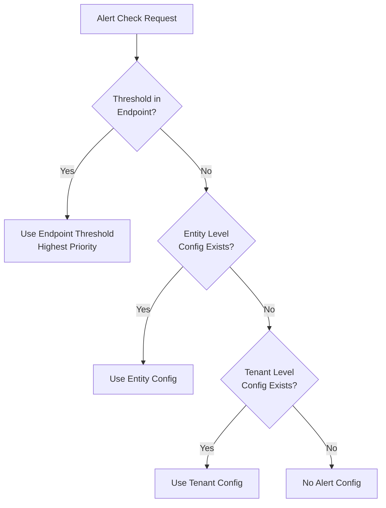
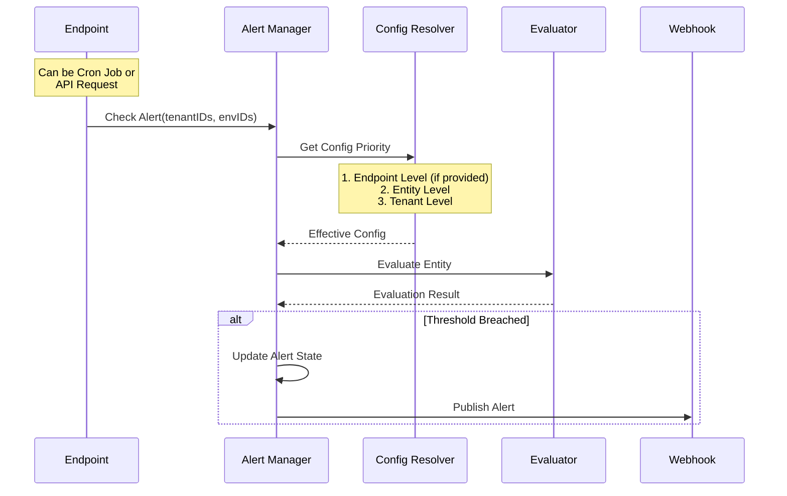
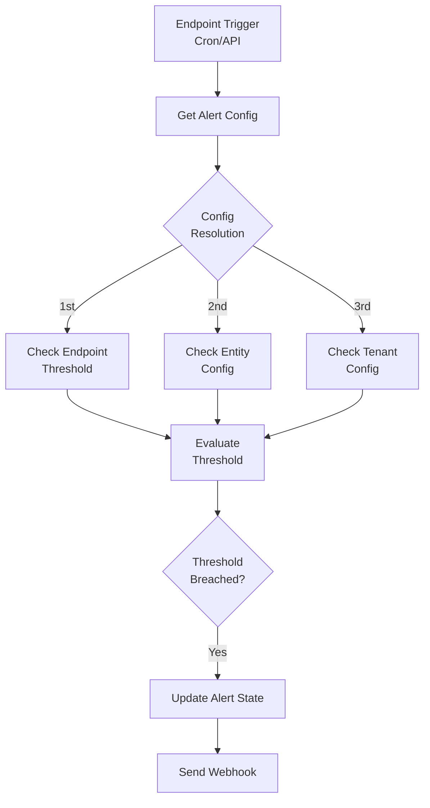

# Alert Engine Design Document

## Overview

The Alert Engine is a standalone system designed to handle threshold-based alerts across different components of the FlexPrice platform. The system supports multi-level alert configuration with clear precedence rules and can be triggered both via API and scheduled checks.

## Core Concepts

### 1. Alert Configuration Hierarchy



### 2. Configuration Models

```go
// Alert Check Request
type AlertCheckRequest struct {
    TenantIDs   []string        `json:"tenant_ids"`
    EnvIDs      []string        `json:"env_ids"`
    Threshold   *AlertThreshold `json:"threshold,omitempty"`
}

// Alert Threshold Configuration
type AlertThreshold struct {
    Inheritance string          `json:"inheritance"` // @endpoint level(cron/json api request), @tenant level, @entity level
    Type        string          `json:"type"`       // amount
    Value       decimal.Decimal `json:"value"`
}

// Entity Alert Configuration
type EntityAlertConfig struct {
    Enabled    bool           `json:"enabled"`
    Threshold  AlertThreshold `json:"threshold"`
    State      AlertState     `json:"state"`
    UpdatedAt  time.Time      `json:"updated_at"`
}

// Tenant Alert Configuration
type TenantAlertConfig struct {
    Enabled    bool           `json:"enabled"`
    Threshold  AlertThreshold `json:"threshold"`
    UpdatedAt  time.Time      `json:"updated_at"`
}
```

### 3. Alert States

```go
type AlertState string

const (
    AlertStateOK      AlertState = "ok"
    AlertStateInAlarm AlertState = "alert"
)
```

## Alert Processing Flow

### 1. Sequence Flow



### 2. Evaluation Flow



## Configuration Resolution

### 1. Priority Rules

1. **Endpoint Level (Highest)**
   - Set via Cron job configuration
   - Set via JSON API request
   - Overrides all other configurations

2. **Entity Level**
   - Entity-specific configuration
   - Used if no endpoint threshold and config exists

3. **Tenant Level**
   - Tenant-wide configuration
   - Used if no endpoint threshold and no entity config

### 2. Resolution Process

```go
func (r *ConfigResolver) ResolveConfig(ctx context.Context, req AlertCheckRequest, entityID string) (*AlertConfig, error) {
    // 1. Check endpoint threshold (highest priority)
    if req.Threshold != nil {
        return &AlertConfig{
            Threshold: *req.Threshold,
            Inheritance: "endpoint",
        }, nil
    }

    // 2. Check entity level config
    if entityConfig, exists := r.entityRepo.GetAlertConfig(entityID); exists {
        return &AlertConfig{
            Threshold: entityConfig.Threshold,
            Inheritance: "entity",
        }, nil
    }

    // 3. Check tenant level config
    if tenantConfig, exists := r.tenantRepo.GetAlertConfig(req.TenantIDs[0]); exists {
        return &AlertConfig{
            Threshold: tenantConfig.Threshold,
            Inheritance: "tenant",
        }, nil
    }

    return nil, errors.New("no alert configuration found")
}
```

### 3. Webhook Events

```go
const (
    WebhookEventAlertTriggered = "alert.triggered"
    WebhookEventAlertRecovered = "alert.recovered"
)

type AlertWebhookPayload struct {
    EntityID     string         `json:"entity_id"`
    EntityType   string         `json:"entity_type"` // wallet, entitlement, etc.
    TenantID     string         `json:"tenant_id"`
    EnvID        string         `json:"env_id"`
    AlertState   string         `json:"alert_state"`
    Threshold    AlertThreshold `json:"threshold"`
    CurrentValue interface{}    `json:"current_value"`
    Inheritance  string         `json:"inheritance"` // endpoint, entity, tenant
}
```

## Implementation Components

### 1. Alert Manager
- Handles alert check requests
- Coordinates configuration resolution
- Manages alert state transitions
- Triggers webhook notifications

### 2. Config Resolver
- Implements configuration precedence rules
- Resolves effective configuration
- Handles tenant and entity level configs

### 3. Evaluator
- Performs threshold comparisons
- Supports different threshold types
- Handles value normalization

### 4. Webhook Publisher
- Delivers alert notifications
- Manages retry logic
- Handles webhook signatures

## Monitoring and Observability

### 1. Metrics
- Alert trigger count by type and level
- Configuration resolution stats
- Evaluation latency
- Webhook delivery success rate

### 2. Logging
```go
logger.Infow("alert evaluated",
    "entity_id", entity.ID,
    "entity_type", entity.Type,
    "tenant_id", entity.TenantID,
    "config_inheritance", config.Inheritance,
    "threshold", config.Threshold,
    "current_value", value,
    "alert_state", newState,
)
```

## Future Enhancements

1. **Advanced Configuration**
   - Multiple thresholds per entity
   - Time-based thresholds
   - Custom evaluation logic

2. **Notification Channels**
   - Email notifications
   - SMS alerts
   - Slack integration

3. **Analytics**
   - Alert frequency analysis
   - Pattern detection
   - Threshold optimization

## Visuals

### _Workflow_
<svg aria-roledescription="sequence" role="graphics-document document" viewBox="-50 -10 1050 592" style="max-width: 1050px;" xmlns="http://www.w3.org/2000/svg" width="100%" id="mermaid-svg-1754549879588-3c8f752qa"><g><rect class="actor" ry="3" rx="3" height="65" width="150" stroke="#666" fill="#eaeaea" y="506" x="800"/><text style="text-anchor: middle; font-size: 16px; font-weight: 400;" class="actor" alignment-baseline="central" dominant-baseline="central" y="538.5" x="875"><tspan dy="0" x="875">Webhook</tspan></text></g><g><rect class="actor" ry="3" rx="3" height="65" width="150" stroke="#666" fill="#eaeaea" y="506" x="600"/><text style="text-anchor: middle; font-size: 16px; font-weight: 400;" class="actor" alignment-baseline="central" dominant-baseline="central" y="538.5" x="675"><tspan dy="0" x="675">Evaluator</tspan></text></g><g><rect class="actor" ry="3" rx="3" height="65" width="150" stroke="#666" fill="#eaeaea" y="506" x="400"/><text style="text-anchor: middle; font-size: 16px; font-weight: 400;" class="actor" alignment-baseline="central" dominant-baseline="central" y="538.5" x="475"><tspan dy="0" x="475">Config Resolver</tspan></text></g><g><rect class="actor" ry="3" rx="3" height="65" width="150" stroke="#666" fill="#eaeaea" y="506" x="200"/><text style="text-anchor: middle; font-size: 16px; font-weight: 400;" class="actor" alignment-baseline="central" dominant-baseline="central" y="538.5" x="275"><tspan dy="0" x="275">Alert Manager</tspan></text></g><g><rect class="actor" ry="3" rx="3" height="65" width="150" stroke="#666" fill="#eaeaea" y="506" x="0"/><text style="text-anchor: middle; font-size: 16px; font-weight: 400;" class="actor" alignment-baseline="central" dominant-baseline="central" y="538.5" x="75"><tspan dy="0" x="75">API/Cron</tspan></text></g><g><line stroke="#999" stroke-width="0.5px" class="200" y2="506" x2="875" y1="5" x1="875" id="actor93"/><g id="root-93"><rect class="actor" ry="3" rx="3" height="65" width="150" stroke="#666" fill="#eaeaea" y="0" x="800"/><text style="text-anchor: middle; font-size: 16px; font-weight: 400;" class="actor" alignment-baseline="central" dominant-baseline="central" y="32.5" x="875"><tspan dy="0" x="875">Webhook</tspan></text></g></g><g><line stroke="#999" stroke-width="0.5px" class="200" y2="506" x2="675" y1="5" x1="675" id="actor92"/><g id="root-92"><rect class="actor" ry="3" rx="3" height="65" width="150" stroke="#666" fill="#eaeaea" y="0" x="600"/><text style="text-anchor: middle; font-size: 16px; font-weight: 400;" class="actor" alignment-baseline="central" dominant-baseline="central" y="32.5" x="675"><tspan dy="0" x="675">Evaluator</tspan></text></g></g><g><line stroke="#999" stroke-width="0.5px" class="200" y2="506" x2="475" y1="5" x1="475" id="actor91"/><g id="root-91"><rect class="actor" ry="3" rx="3" height="65" width="150" stroke="#666" fill="#eaeaea" y="0" x="400"/><text style="text-anchor: middle; font-size: 16px; font-weight: 400;" class="actor" alignment-baseline="central" dominant-baseline="central" y="32.5" x="475"><tspan dy="0" x="475">Config Resolver</tspan></text></g></g><g><line stroke="#999" stroke-width="0.5px" class="200" y2="506" x2="275" y1="5" x1="275" id="actor90"/><g id="root-90"><rect class="actor" ry="3" rx="3" height="65" width="150" stroke="#666" fill="#eaeaea" y="0" x="200"/><text style="text-anchor: middle; font-size: 16px; font-weight: 400;" class="actor" alignment-baseline="central" dominant-baseline="central" y="32.5" x="275"><tspan dy="0" x="275">Alert Manager</tspan></text></g></g><g><line stroke="#999" stroke-width="0.5px" class="200" y2="506" x2="75" y1="5" x1="75" id="actor89"/><g id="root-89"><rect class="actor" ry="3" rx="3" height="65" width="150" stroke="#666" fill="#eaeaea" y="0" x="0"/><text style="text-anchor: middle; font-size: 16px; font-weight: 400;" class="actor" alignment-baseline="central" dominant-baseline="central" y="32.5" x="75"><tspan dy="0" x="75">API/Cron</tspan></text></g></g><style>#mermaid-svg-1754549879588-3c8f752qa{font-family:"trebuchet ms",verdana,arial,sans-serif;font-size:16px;fill:rgba(204, 204, 204, 0.87);}#mermaid-svg-1754549879588-3c8f752qa .error-icon{fill:#bf616a;}#mermaid-svg-1754549879588-3c8f752qa .error-text{fill:#bf616a;stroke:#bf616a;}#mermaid-svg-1754549879588-3c8f752qa .edge-thickness-normal{stroke-width:2px;}#mermaid-svg-1754549879588-3c8f752qa .edge-thickness-thick{stroke-width:3.5px;}#mermaid-svg-1754549879588-3c8f752qa .edge-pattern-solid{stroke-dasharray:0;}#mermaid-svg-1754549879588-3c8f752qa .edge-pattern-dashed{stroke-dasharray:3;}#mermaid-svg-1754549879588-3c8f752qa .edge-pattern-dotted{stroke-dasharray:2;}#mermaid-svg-1754549879588-3c8f752qa .marker{fill:rgba(204, 204, 204, 0.87);stroke:rgba(204, 204, 204, 0.87);}#mermaid-svg-1754549879588-3c8f752qa .marker.cross{stroke:rgba(204, 204, 204, 0.87);}#mermaid-svg-1754549879588-3c8f752qa svg{font-family:"trebuchet ms",verdana,arial,sans-serif;font-size:16px;}#mermaid-svg-1754549879588-3c8f752qa .actor{stroke:hsl(210, 0%, 73.137254902%);fill:#81a1c1;}#mermaid-svg-1754549879588-3c8f752qa text.actor&gt;tspan{fill:#191c22;stroke:none;}#mermaid-svg-1754549879588-3c8f752qa .actor-line{stroke:rgba(204, 204, 204, 0.87);}#mermaid-svg-1754549879588-3c8f752qa .messageLine0{stroke-width:1.5;stroke-dasharray:none;stroke:rgba(204, 204, 204, 0.87);}#mermaid-svg-1754549879588-3c8f752qa .messageLine1{stroke-width:1.5;stroke-dasharray:2,2;stroke:rgba(204, 204, 204, 0.87);}#mermaid-svg-1754549879588-3c8f752qa #arrowhead path{fill:rgba(204, 204, 204, 0.87);stroke:rgba(204, 204, 204, 0.87);}#mermaid-svg-1754549879588-3c8f752qa .sequenceNumber{fill:rgba(204, 204, 204, 0.61);}#mermaid-svg-1754549879588-3c8f752qa #sequencenumber{fill:rgba(204, 204, 204, 0.87);}#mermaid-svg-1754549879588-3c8f752qa #crosshead path{fill:rgba(204, 204, 204, 0.87);stroke:rgba(204, 204, 204, 0.87);}#mermaid-svg-1754549879588-3c8f752qa .messageText{fill:rgba(204, 204, 204, 0.87);stroke:none;}#mermaid-svg-1754549879588-3c8f752qa .labelBox{stroke:#454545;fill:#141414;}#mermaid-svg-1754549879588-3c8f752qa .labelText,#mermaid-svg-1754549879588-3c8f752qa .labelText&gt;tspan{fill:rgba(204, 204, 204, 0.87);stroke:none;}#mermaid-svg-1754549879588-3c8f752qa .loopText,#mermaid-svg-1754549879588-3c8f752qa .loopText&gt;tspan{fill:#d8dee9;stroke:none;}#mermaid-svg-1754549879588-3c8f752qa .loopLine{stroke-width:2px;stroke-dasharray:2,2;stroke:#454545;fill:#454545;}#mermaid-svg-1754549879588-3c8f752qa .note{stroke:#2a2a2a;fill:#1a1a1a;}#mermaid-svg-1754549879588-3c8f752qa .noteText,#mermaid-svg-1754549879588-3c8f752qa .noteText&gt;tspan{fill:rgba(204, 204, 204, 0.87);stroke:none;}#mermaid-svg-1754549879588-3c8f752qa .activation0{fill:rgba(64, 64, 64, 0.47);stroke:#30373a;}#mermaid-svg-1754549879588-3c8f752qa .activation1{fill:rgba(64, 64, 64, 0.47);stroke:#30373a;}#mermaid-svg-1754549879588-3c8f752qa .activation2{fill:rgba(64, 64, 64, 0.47);stroke:#30373a;}#mermaid-svg-1754549879588-3c8f752qa .actorPopupMenu{position:absolute;}#mermaid-svg-1754549879588-3c8f752qa .actorPopupMenuPanel{position:absolute;fill:#81a1c1;box-shadow:0px 8px 16px 0px rgba(0,0,0,0.2);filter:drop-shadow(3px 5px 2px rgb(0 0 0 / 0.4));}#mermaid-svg-1754549879588-3c8f752qa .actor-man line{stroke:hsl(210, 0%, 73.137254902%);fill:#81a1c1;}#mermaid-svg-1754549879588-3c8f752qa .actor-man circle,#mermaid-svg-1754549879588-3c8f752qa line{stroke:hsl(210, 0%, 73.137254902%);fill:#81a1c1;stroke-width:2px;}#mermaid-svg-1754549879588-3c8f752qa :root{--mermaid-font-family:"trebuchet ms",verdana,arial,sans-serif;}</style><g/><defs><symbol height="24" width="24" id="computer"><path d="M2 2v13h20v-13h-20zm18 11h-16v-9h16v9zm-10.228 6l.466-1h3.524l.467 1h-4.457zm14.228 3h-24l2-6h2.104l-1.33 4h18.45l-1.297-4h2.073l2 6zm-5-10h-14v-7h14v7z" transform="scale(.5)"/></symbol></defs><defs><symbol clip-rule="evenodd" fill-rule="evenodd" id="database"><path d="M12.258.001l.256.004.255.005.253.008.251.01.249.012.247.015.246.016.242.019.241.02.239.023.236.024.233.027.231.028.229.031.225.032.223.034.22.036.217.038.214.04.211.041.208.043.205.045.201.046.198.048.194.05.191.051.187.053.183.054.18.056.175.057.172.059.168.06.163.061.16.063.155.064.15.066.074.033.073.033.071.034.07.034.069.035.068.035.067.035.066.035.064.036.064.036.062.036.06.036.06.037.058.037.058.037.055.038.055.038.053.038.052.038.051.039.05.039.048.039.047.039.045.04.044.04.043.04.041.04.04.041.039.041.037.041.036.041.034.041.033.042.032.042.03.042.029.042.027.042.026.043.024.043.023.043.021.043.02.043.018.044.017.043.015.044.013.044.012.044.011.045.009.044.007.045.006.045.004.045.002.045.001.045v17l-.001.045-.002.045-.004.045-.006.045-.007.045-.009.044-.011.045-.012.044-.013.044-.015.044-.017.043-.018.044-.02.043-.021.043-.023.043-.024.043-.026.043-.027.042-.029.042-.03.042-.032.042-.033.042-.034.041-.036.041-.037.041-.039.041-.04.041-.041.04-.043.04-.044.04-.045.04-.047.039-.048.039-.05.039-.051.039-.052.038-.053.038-.055.038-.055.038-.058.037-.058.037-.06.037-.06.036-.062.036-.064.036-.064.036-.066.035-.067.035-.068.035-.069.035-.07.034-.071.034-.073.033-.074.033-.15.066-.155.064-.16.063-.163.061-.168.06-.172.059-.175.057-.18.056-.183.054-.187.053-.191.051-.194.05-.198.048-.201.046-.205.045-.208.043-.211.041-.214.04-.217.038-.22.036-.223.034-.225.032-.229.031-.231.028-.233.027-.236.024-.239.023-.241.02-.242.019-.246.016-.247.015-.249.012-.251.01-.253.008-.255.005-.256.004-.258.001-.258-.001-.256-.004-.255-.005-.253-.008-.251-.01-.249-.012-.247-.015-.245-.016-.243-.019-.241-.02-.238-.023-.236-.024-.234-.027-.231-.028-.228-.031-.226-.032-.223-.034-.22-.036-.217-.038-.214-.04-.211-.041-.208-.043-.204-.045-.201-.046-.198-.048-.195-.05-.19-.051-.187-.053-.184-.054-.179-.056-.176-.057-.172-.059-.167-.06-.164-.061-.159-.063-.155-.064-.151-.066-.074-.033-.072-.033-.072-.034-.07-.034-.069-.035-.068-.035-.067-.035-.066-.035-.064-.036-.063-.036-.062-.036-.061-.036-.06-.037-.058-.037-.057-.037-.056-.038-.055-.038-.053-.038-.052-.038-.051-.039-.049-.039-.049-.039-.046-.039-.046-.04-.044-.04-.043-.04-.041-.04-.04-.041-.039-.041-.037-.041-.036-.041-.034-.041-.033-.042-.032-.042-.03-.042-.029-.042-.027-.042-.026-.043-.024-.043-.023-.043-.021-.043-.02-.043-.018-.044-.017-.043-.015-.044-.013-.044-.012-.044-.011-.045-.009-.044-.007-.045-.006-.045-.004-.045-.002-.045-.001-.045v-17l.001-.045.002-.045.004-.045.006-.045.007-.045.009-.044.011-.045.012-.044.013-.044.015-.044.017-.043.018-.044.02-.043.021-.043.023-.043.024-.043.026-.043.027-.042.029-.042.03-.042.032-.042.033-.042.034-.041.036-.041.037-.041.039-.041.04-.041.041-.04.043-.04.044-.04.046-.04.046-.039.049-.039.049-.039.051-.039.052-.038.053-.038.055-.038.056-.038.057-.037.058-.037.06-.037.061-.036.062-.036.063-.036.064-.036.066-.035.067-.035.068-.035.069-.035.07-.034.072-.034.072-.033.074-.033.151-.066.155-.064.159-.063.164-.061.167-.06.172-.059.176-.057.179-.056.184-.054.187-.053.19-.051.195-.05.198-.048.201-.046.204-.045.208-.043.211-.041.214-.04.217-.038.22-.036.223-.034.226-.032.228-.031.231-.028.234-.027.236-.024.238-.023.241-.02.243-.019.245-.016.247-.015.249-.012.251-.01.253-.008.255-.005.256-.004.258-.001.258.001zm-9.258 20.499v.01l.001.021.003.021.004.022.005.021.006.022.007.022.009.023.01.022.011.023.012.023.013.023.015.023.016.024.017.023.018.024.019.024.021.024.022.025.023.024.024.025.052.049.056.05.061.051.066.051.07.051.075.051.079.052.084.052.088.052.092.052.097.052.102.051.105.052.11.052.114.051.119.051.123.051.127.05.131.05.135.05.139.048.144.049.147.047.152.047.155.047.16.045.163.045.167.043.171.043.176.041.178.041.183.039.187.039.19.037.194.035.197.035.202.033.204.031.209.03.212.029.216.027.219.025.222.024.226.021.23.02.233.018.236.016.24.015.243.012.246.01.249.008.253.005.256.004.259.001.26-.001.257-.004.254-.005.25-.008.247-.011.244-.012.241-.014.237-.016.233-.018.231-.021.226-.021.224-.024.22-.026.216-.027.212-.028.21-.031.205-.031.202-.034.198-.034.194-.036.191-.037.187-.039.183-.04.179-.04.175-.042.172-.043.168-.044.163-.045.16-.046.155-.046.152-.047.148-.048.143-.049.139-.049.136-.05.131-.05.126-.05.123-.051.118-.052.114-.051.11-.052.106-.052.101-.052.096-.052.092-.052.088-.053.083-.051.079-.052.074-.052.07-.051.065-.051.06-.051.056-.05.051-.05.023-.024.023-.025.021-.024.02-.024.019-.024.018-.024.017-.024.015-.023.014-.024.013-.023.012-.023.01-.023.01-.022.008-.022.006-.022.006-.022.004-.022.004-.021.001-.021.001-.021v-4.127l-.077.055-.08.053-.083.054-.085.053-.087.052-.09.052-.093.051-.095.05-.097.05-.1.049-.102.049-.105.048-.106.047-.109.047-.111.046-.114.045-.115.045-.118.044-.12.043-.122.042-.124.042-.126.041-.128.04-.13.04-.132.038-.134.038-.135.037-.138.037-.139.035-.142.035-.143.034-.144.033-.147.032-.148.031-.15.03-.151.03-.153.029-.154.027-.156.027-.158.026-.159.025-.161.024-.162.023-.163.022-.165.021-.166.02-.167.019-.169.018-.169.017-.171.016-.173.015-.173.014-.175.013-.175.012-.177.011-.178.01-.179.008-.179.008-.181.006-.182.005-.182.004-.184.003-.184.002h-.37l-.184-.002-.184-.003-.182-.004-.182-.005-.181-.006-.179-.008-.179-.008-.178-.01-.176-.011-.176-.012-.175-.013-.173-.014-.172-.015-.171-.016-.17-.017-.169-.018-.167-.019-.166-.02-.165-.021-.163-.022-.162-.023-.161-.024-.159-.025-.157-.026-.156-.027-.155-.027-.153-.029-.151-.03-.15-.03-.148-.031-.146-.032-.145-.033-.143-.034-.141-.035-.14-.035-.137-.037-.136-.037-.134-.038-.132-.038-.13-.04-.128-.04-.126-.041-.124-.042-.122-.042-.12-.044-.117-.043-.116-.045-.113-.045-.112-.046-.109-.047-.106-.047-.105-.048-.102-.049-.1-.049-.097-.05-.095-.05-.093-.052-.09-.051-.087-.052-.085-.053-.083-.054-.08-.054-.077-.054v4.127zm0-5.654v.011l.001.021.003.021.004.021.005.022.006.022.007.022.009.022.01.022.011.023.012.023.013.023.015.024.016.023.017.024.018.024.019.024.021.024.022.024.023.025.024.024.052.05.056.05.061.05.066.051.07.051.075.052.079.051.084.052.088.052.092.052.097.052.102.052.105.052.11.051.114.051.119.052.123.05.127.051.131.05.135.049.139.049.144.048.147.048.152.047.155.046.16.045.163.045.167.044.171.042.176.042.178.04.183.04.187.038.19.037.194.036.197.034.202.033.204.032.209.03.212.028.216.027.219.025.222.024.226.022.23.02.233.018.236.016.24.014.243.012.246.01.249.008.253.006.256.003.259.001.26-.001.257-.003.254-.006.25-.008.247-.01.244-.012.241-.015.237-.016.233-.018.231-.02.226-.022.224-.024.22-.025.216-.027.212-.029.21-.03.205-.032.202-.033.198-.035.194-.036.191-.037.187-.039.183-.039.179-.041.175-.042.172-.043.168-.044.163-.045.16-.045.155-.047.152-.047.148-.048.143-.048.139-.05.136-.049.131-.05.126-.051.123-.051.118-.051.114-.052.11-.052.106-.052.101-.052.096-.052.092-.052.088-.052.083-.052.079-.052.074-.051.07-.052.065-.051.06-.05.056-.051.051-.049.023-.025.023-.024.021-.025.02-.024.019-.024.018-.024.017-.024.015-.023.014-.023.013-.024.012-.022.01-.023.01-.023.008-.022.006-.022.006-.022.004-.021.004-.022.001-.021.001-.021v-4.139l-.077.054-.08.054-.083.054-.085.052-.087.053-.09.051-.093.051-.095.051-.097.05-.1.049-.102.049-.105.048-.106.047-.109.047-.111.046-.114.045-.115.044-.118.044-.12.044-.122.042-.124.042-.126.041-.128.04-.13.039-.132.039-.134.038-.135.037-.138.036-.139.036-.142.035-.143.033-.144.033-.147.033-.148.031-.15.03-.151.03-.153.028-.154.028-.156.027-.158.026-.159.025-.161.024-.162.023-.163.022-.165.021-.166.02-.167.019-.169.018-.169.017-.171.016-.173.015-.173.014-.175.013-.175.012-.177.011-.178.009-.179.009-.179.007-.181.007-.182.005-.182.004-.184.003-.184.002h-.37l-.184-.002-.184-.003-.182-.004-.182-.005-.181-.007-.179-.007-.179-.009-.178-.009-.176-.011-.176-.012-.175-.013-.173-.014-.172-.015-.171-.016-.17-.017-.169-.018-.167-.019-.166-.02-.165-.021-.163-.022-.162-.023-.161-.024-.159-.025-.157-.026-.156-.027-.155-.028-.153-.028-.151-.03-.15-.03-.148-.031-.146-.033-.145-.033-.143-.033-.141-.035-.14-.036-.137-.036-.136-.037-.134-.038-.132-.039-.13-.039-.128-.04-.126-.041-.124-.042-.122-.043-.12-.043-.117-.044-.116-.044-.113-.046-.112-.046-.109-.046-.106-.047-.105-.048-.102-.049-.1-.049-.097-.05-.095-.051-.093-.051-.09-.051-.087-.053-.085-.052-.083-.054-.08-.054-.077-.054v4.139zm0-5.666v.011l.001.02.003.022.004.021.005.022.006.021.007.022.009.023.01.022.011.023.012.023.013.023.015.023.016.024.017.024.018.023.019.024.021.025.022.024.023.024.024.025.052.05.056.05.061.05.066.051.07.051.075.052.079.051.084.052.088.052.092.052.097.052.102.052.105.051.11.052.114.051.119.051.123.051.127.05.131.05.135.05.139.049.144.048.147.048.152.047.155.046.16.045.163.045.167.043.171.043.176.042.178.04.183.04.187.038.19.037.194.036.197.034.202.033.204.032.209.03.212.028.216.027.219.025.222.024.226.021.23.02.233.018.236.017.24.014.243.012.246.01.249.008.253.006.256.003.259.001.26-.001.257-.003.254-.006.25-.008.247-.01.244-.013.241-.014.237-.016.233-.018.231-.02.226-.022.224-.024.22-.025.216-.027.212-.029.21-.03.205-.032.202-.033.198-.035.194-.036.191-.037.187-.039.183-.039.179-.041.175-.042.172-.043.168-.044.163-.045.16-.045.155-.047.152-.047.148-.048.143-.049.139-.049.136-.049.131-.051.126-.05.123-.051.118-.052.114-.051.11-.052.106-.052.101-.052.096-.052.092-.052.088-.052.083-.052.079-.052.074-.052.07-.051.065-.051.06-.051.056-.05.051-.049.023-.025.023-.025.021-.024.02-.024.019-.024.018-.024.017-.024.015-.023.014-.024.013-.023.012-.023.01-.022.01-.023.008-.022.006-.022.006-.022.004-.022.004-.021.001-.021.001-.021v-4.153l-.077.054-.08.054-.083.053-.085.053-.087.053-.09.051-.093.051-.095.051-.097.05-.1.049-.102.048-.105.048-.106.048-.109.046-.111.046-.114.046-.115.044-.118.044-.12.043-.122.043-.124.042-.126.041-.128.04-.13.039-.132.039-.134.038-.135.037-.138.036-.139.036-.142.034-.143.034-.144.033-.147.032-.148.032-.15.03-.151.03-.153.028-.154.028-.156.027-.158.026-.159.024-.161.024-.162.023-.163.023-.165.021-.166.02-.167.019-.169.018-.169.017-.171.016-.173.015-.173.014-.175.013-.175.012-.177.01-.178.01-.179.009-.179.007-.181.006-.182.006-.182.004-.184.003-.184.001-.185.001-.185-.001-.184-.001-.184-.003-.182-.004-.182-.006-.181-.006-.179-.007-.179-.009-.178-.01-.176-.01-.176-.012-.175-.013-.173-.014-.172-.015-.171-.016-.17-.017-.169-.018-.167-.019-.166-.02-.165-.021-.163-.023-.162-.023-.161-.024-.159-.024-.157-.026-.156-.027-.155-.028-.153-.028-.151-.03-.15-.03-.148-.032-.146-.032-.145-.033-.143-.034-.141-.034-.14-.036-.137-.036-.136-.037-.134-.038-.132-.039-.13-.039-.128-.041-.126-.041-.124-.041-.122-.043-.12-.043-.117-.044-.116-.044-.113-.046-.112-.046-.109-.046-.106-.048-.105-.048-.102-.048-.1-.05-.097-.049-.095-.051-.093-.051-.09-.052-.087-.052-.085-.053-.083-.053-.08-.054-.077-.054v4.153zm8.74-8.179l-.257.004-.254.005-.25.008-.247.011-.244.012-.241.014-.237.016-.233.018-.231.021-.226.022-.224.023-.22.026-.216.027-.212.028-.21.031-.205.032-.202.033-.198.034-.194.036-.191.038-.187.038-.183.04-.179.041-.175.042-.172.043-.168.043-.163.045-.16.046-.155.046-.152.048-.148.048-.143.048-.139.049-.136.05-.131.05-.126.051-.123.051-.118.051-.114.052-.11.052-.106.052-.101.052-.096.052-.092.052-.088.052-.083.052-.079.052-.074.051-.07.052-.065.051-.06.05-.056.05-.051.05-.023.025-.023.024-.021.024-.02.025-.019.024-.018.024-.017.023-.015.024-.014.023-.013.023-.012.023-.01.023-.01.022-.008.022-.006.023-.006.021-.004.022-.004.021-.001.021-.001.021.001.021.001.021.004.021.004.022.006.021.006.023.008.022.01.022.01.023.012.023.013.023.014.023.015.024.017.023.018.024.019.024.02.025.021.024.023.024.023.025.051.05.056.05.06.05.065.051.07.052.074.051.079.052.083.052.088.052.092.052.096.052.101.052.106.052.11.052.114.052.118.051.123.051.126.051.131.05.136.05.139.049.143.048.148.048.152.048.155.046.16.046.163.045.168.043.172.043.175.042.179.041.183.04.187.038.191.038.194.036.198.034.202.033.205.032.21.031.212.028.216.027.22.026.224.023.226.022.231.021.233.018.237.016.241.014.244.012.247.011.25.008.254.005.257.004.26.001.26-.001.257-.004.254-.005.25-.008.247-.011.244-.012.241-.014.237-.016.233-.018.231-.021.226-.022.224-.023.22-.026.216-.027.212-.028.21-.031.205-.032.202-.033.198-.034.194-.036.191-.038.187-.038.183-.04.179-.041.175-.042.172-.043.168-.043.163-.045.16-.046.155-.046.152-.048.148-.048.143-.048.139-.049.136-.05.131-.05.126-.051.123-.051.118-.051.114-.052.11-.052.106-.052.101-.052.096-.052.092-.052.088-.052.083-.052.079-.052.074-.051.07-.052.065-.051.06-.05.056-.05.051-.05.023-.025.023-.024.021-.024.02-.025.019-.024.018-.024.017-.023.015-.024.014-.023.013-.023.012-.023.01-.023.01-.022.008-.022.006-.023.006-.021.004-.022.004-.021.001-.021.001-.021-.001-.021-.001-.021-.004-.021-.004-.022-.006-.021-.006-.023-.008-.022-.01-.022-.01-.023-.012-.023-.013-.023-.014-.023-.015-.024-.017-.023-.018-.024-.019-.024-.02-.025-.021-.024-.023-.024-.023-.025-.051-.05-.056-.05-.06-.05-.065-.051-.07-.052-.074-.051-.079-.052-.083-.052-.088-.052-.092-.052-.096-.052-.101-.052-.106-.052-.11-.052-.114-.052-.118-.051-.123-.051-.126-.051-.131-.05-.136-.05-.139-.049-.143-.048-.148-.048-.152-.048-.155-.046-.16-.046-.163-.045-.168-.043-.172-.043-.175-.042-.179-.041-.183-.04-.187-.038-.191-.038-.194-.036-.198-.034-.202-.033-.205-.032-.21-.031-.212-.028-.216-.027-.22-.026-.224-.023-.226-.022-.231-.021-.233-.018-.237-.016-.241-.014-.244-.012-.247-.011-.25-.008-.254-.005-.257-.004-.26-.001-.26.001z" transform="scale(.5)"/></symbol></defs><defs><symbol height="24" width="24" id="clock"><path d="M12 2c5.514 0 10 4.486 10 10s-4.486 10-10 10-10-4.486-10-10 4.486-10 10-10zm0-2c-6.627 0-12 5.373-12 12s5.373 12 12 12 12-5.373 12-12-5.373-12-12-12zm5.848 12.459c.202.038.202.333.001.372-1.907.361-6.045 1.111-6.547 1.111-.719 0-1.301-.582-1.301-1.301 0-.512.77-5.447 1.125-7.445.034-.192.312-.181.343.014l.985 6.238 5.394 1.011z" transform="scale(.5)"/></symbol></defs><defs><marker orient="auto" markerHeight="12" markerWidth="12" markerUnits="userSpaceOnUse" refY="5" refX="7.9" id="arrowhead"><path d="M 0 0 L 10 5 L 0 10 z"/></marker></defs><defs><marker refY="4.5" refX="4" orient="auto" markerHeight="8" markerWidth="15" id="crosshead"><path style="stroke-dasharray: 0, 0;" d="M 1,2 L 6,7 M 6,2 L 1,7" stroke-width="1pt" stroke="#000000" fill="none"/></marker></defs><defs><marker orient="auto" markerHeight="28" markerWidth="20" refY="7" refX="15.5" id="filled-head"><path d="M 18,7 L9,13 L14,7 L9,1 Z"/></marker></defs><defs><marker orient="auto" markerHeight="40" markerWidth="60" refY="15" refX="15" id="sequencenumber"><circle r="6" cy="15" cx="15"/></marker></defs><g><line class="loopLine" y2="315" x2="886" y1="315" x1="191"/><line class="loopLine" y2="486" x2="886" y1="315" x1="886"/><line class="loopLine" y2="486" x2="886" y1="486" x1="191"/><line class="loopLine" y2="486" x2="191" y1="315" x1="191"/><polygon class="labelBox" points="191,315 241,315 241,328 232.6,335 191,335"/><text style="font-size: 16px; font-weight: 400;" class="labelText" alignment-baseline="middle" dominant-baseline="middle" text-anchor="middle" y="328" x="216">alt</text><text style="font-size: 16px; font-weight: 400;" class="loopText" text-anchor="middle" y="333" x="563.5"><tspan x="563.5">[Threshold Breached]</tspan></text></g><text style="font-size: 16px; font-weight: 400;" dy="1em" class="messageText" alignment-baseline="middle" dominant-baseline="middle" text-anchor="middle" y="80" x="174">Check Alert</text><line style="fill: none;" marker-end="url(#arrowhead)" stroke="none" stroke-width="2" class="messageLine0" y2="113" x2="271" y1="113" x1="76"/><text style="font-size: 16px; font-weight: 400;" dy="1em" class="messageText" alignment-baseline="middle" dominant-baseline="middle" text-anchor="middle" y="128" x="374">Get Config</text><line style="fill: none;" marker-end="url(#arrowhead)" stroke="none" stroke-width="2" class="messageLine0" y2="161" x2="471" y1="161" x1="276"/><text style="font-size: 16px; font-weight: 400;" dy="1em" class="messageText" alignment-baseline="middle" dominant-baseline="middle" text-anchor="middle" y="176" x="377">Return Config</text><line style="stroke-dasharray: 3, 3; fill: none;" marker-end="url(#arrowhead)" stroke="none" stroke-width="2" class="messageLine1" y2="209" x2="279" y1="209" x1="474"/><text style="font-size: 16px; font-weight: 400;" dy="1em" class="messageText" alignment-baseline="middle" dominant-baseline="middle" text-anchor="middle" y="224" x="474">Evaluate</text><line style="fill: none;" marker-end="url(#arrowhead)" stroke="none" stroke-width="2" class="messageLine0" y2="257" x2="671" y1="257" x1="276"/><text style="font-size: 16px; font-weight: 400;" dy="1em" class="messageText" alignment-baseline="middle" dominant-baseline="middle" text-anchor="middle" y="272" x="477">Result</text><line style="stroke-dasharray: 3, 3; fill: none;" marker-end="url(#arrowhead)" stroke="none" stroke-width="2" class="messageLine1" y2="305" x2="279" y1="305" x1="674"/><text style="font-size: 16px; font-weight: 400;" dy="1em" class="messageText" alignment-baseline="middle" dominant-baseline="middle" text-anchor="middle" y="365" x="276">Update State</text><path style="fill: none;" marker-end="url(#arrowhead)" stroke="none" stroke-width="2" class="messageLine0" d="M 276,398 C 336,388 336,428 276,418"/><text style="font-size: 16px; font-weight: 400;" dy="1em" class="messageText" alignment-baseline="middle" dominant-baseline="middle" text-anchor="middle" y="443" x="574">Send Alert</text><line style="fill: none;" marker-end="url(#arrowhead)" stroke="none" stroke-width="2" class="messageLine0" y2="476" x2="871" y1="476" x1="276"/></svg>
