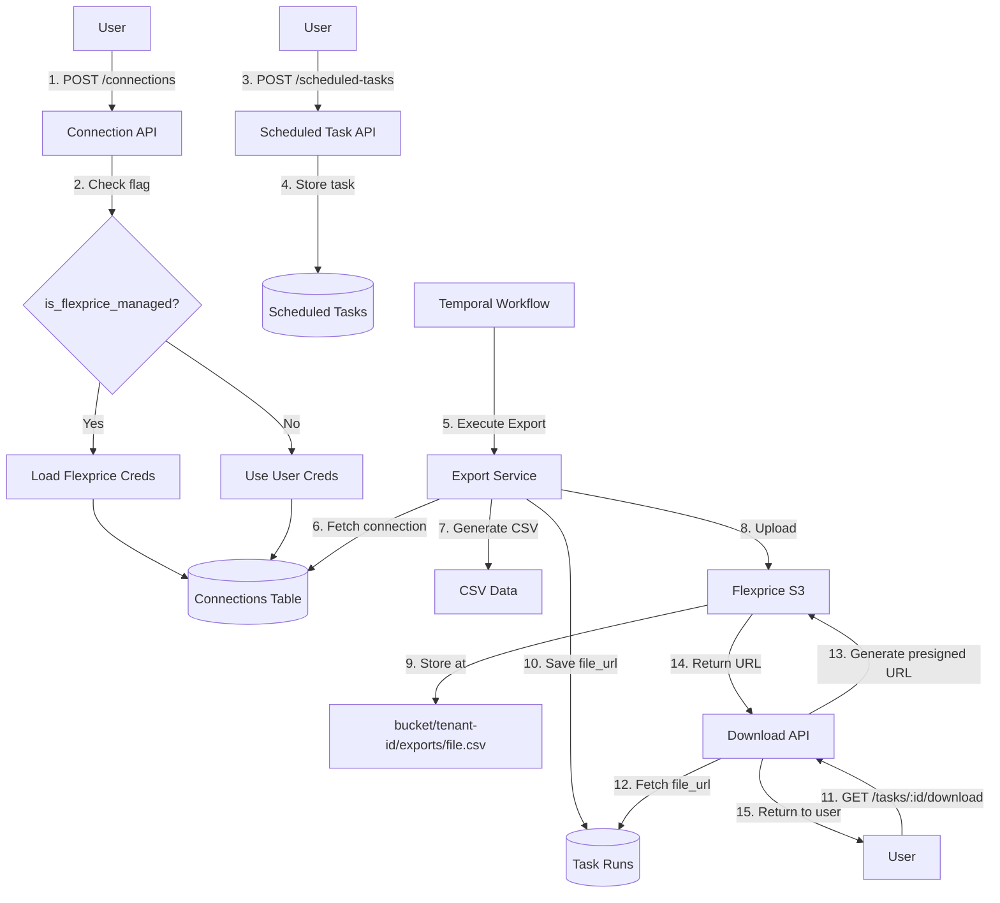
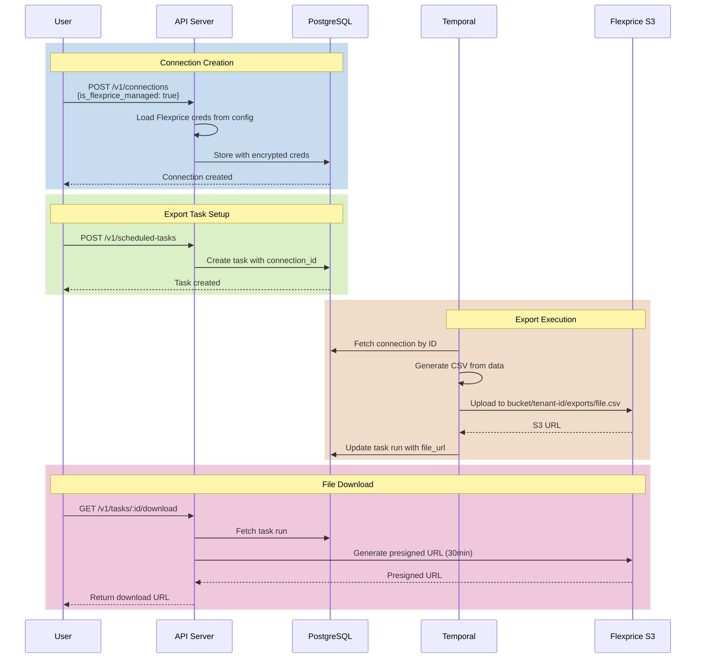

# PRD: Flexprice-Managed S3 Export System

**Version:** 1.0  
**Date:** January 6, 2025  
**Status:** Draft  
**Author:** Tsage

---

## Executive Summary

Enable tenants to export data to a Flexprice-managed S3 bucket when they don't have their own AWS S3 infrastructure. This feature allows users to get started with data exports immediately without AWS setup, while maintaining tenant data isolation and providing secure download capabilities.

## Problem Statement

### Current State
- Users must have their own AWS S3 bucket to use the export feature
- Setting up AWS S3 requires technical knowledge and time
- Onboarding friction prevents users from trying export functionality

### Desired State
- Users can create exports immediately using Flexprice's S3 bucket
- Zero AWS configuration required for basic export functionality
- Users can still use their own S3 if desired (advanced use case)

## Goals & Non-Goals

### Goals
✅ Enable instant export functionality without AWS setup  
✅ Maintain complete tenant data isolation in shared bucket  
✅ Provide secure file download via presigned URLs  
✅ Preserve existing custom S3 connection functionality  
✅ Zero database migrations (use existing schema)

### Non-Goals
❌ File retention management (future enhancement)  
❌ Direct file deletion by users (future enhancement)  
❌ Storage usage quotas/billing (future enhancement)  
❌ Multi-region S3 support (single region initially)

## Success Metrics

- **Adoption:** 50%+ of new tenants use Flexprice-managed S3 in first 30 days
- **Performance:** File download presigned URLs generated in <500ms
- **Security:** Zero cross-tenant data access incidents
- **Reliability:** 99.9% successful export uploads

---

## User Stories

### Story 1: Quick Start User
**As a** new Flexprice user without AWS infrastructure  
**I want to** export my invoice data without AWS setup  
**So that** I can start analyzing my data immediately

**Acceptance Criteria:**
- User can create S3 connection with one click
- No AWS credentials required from user
- Export task creation works identically to custom S3

### Story 2: Data Analyst
**As a** data analyst using Flexprice exports  
**I want to** download my exported files securely  
**So that** I can analyze them in my BI tools

**Acceptance Criteria:**
- Download link available in task run details
- Link works for 30 minutes
- File downloads without additional authentication

### Story 3: Advanced User
**As an** enterprise user with compliance requirements  
**I want to** use both Flexprice S3 and my own S3  
**So that** I can test with Flexprice S3 and use my S3 for production

**Acceptance Criteria:**
- Can create multiple S3 connections (managed + custom)
- Each export task clearly shows which connection it uses
- No interference between managed and custom connections

---

## Technical Architecture

### System Components



### Data Flow Sequence



---

## Implementation Details

### 1. Configuration Setup

**Environment Variables** (`.env`):
```bash
# Flexprice-managed S3 credentials
FLEXPRICE_S3_ACCESS_KEY_ID=AKIA...
FLEXPRICE_S3_SECRET_ACCESS_KEY=...
FLEXPRICE_S3_BUCKET=flexprice-dev-testing
FLEXPRICE_S3_REGION=ap-south-1
```

**Config Structure** (`internal/config/config.go`):
```go
type Configuration struct {
    // ... existing fields
    FlexpriceS3 FlexpriceS3Config `mapstructure:"flexprice_s3" validate:"required"`
}

type FlexpriceS3Config struct {
    Bucket         string `mapstructure:"bucket" validate:"required"`
    Region         string `mapstructure:"region" validate:"required"`
    AccessKeyID    string `mapstructure:"access_key_id" validate:"required"`
    SecretAccessKey string `mapstructure:"secret_access_key" validate:"required"`
}
```

### 2. Data Model Updates

**ONLY ONE CHANGE NEEDED:** Add `IsFlexpriceManaged` flag to existing `S3ExportConfig` struct.

In `internal/types/scheduled_task.go` at line 131, add one line:

```go
type S3ExportConfig struct {
    Bucket      string            `json:"bucket"`
    Region      string            `json:"region"`
    KeyPrefix   string            `json:"key_prefix,omitempty"`
    Compression S3CompressionType `json:"compression,omitempty"`
    Encryption  S3EncryptionType  `json:"encryption,omitempty"`
    
    // ADD THIS LINE:
    IsFlexpriceManaged bool `json:"is_flexprice_managed,omitempty"`
}
```

**Note:** `SyncConfig` already has the `S3 *S3ExportConfig` field (as shown in the screenshot), so no changes needed there!

### 3. Connection Creation Logic

**Update CreateConnection** (`internal/service/connection.go`):
```go
func (s *connectionService) CreateConnection(ctx context.Context, req *dto.CreateConnectionRequest) (*connection.Connection, error) {
    // ... existing validation code
    
    conn := req.ToConnection()
    
    // NEW: Check if this is a Flexprice-managed connection
    if req.SyncConfig != nil && req.SyncConfig.S3 != nil && req.SyncConfig.S3.IsFlexpriceManaged {
        // Validate only one Flexprice-managed connection per tenant
        existingManaged, err := s.connectionRepo.GetManagedS3Connection(ctx, tenantID, environmentID)
        if err == nil && existingManaged != nil {
            return nil, ierr.NewError("flexprice-managed S3 connection already exists").
                WithHint("Only one Flexprice-managed S3 connection allowed per environment").
                Mark(ierr.ErrAlreadyExists)
        }
        
        // Inject Flexprice credentials from config
        conn.EncryptedSecretData.S3 = &types.S3ConnectionMetadata{
            AWSAccessKeyID:     s.Config.FlexpriceS3.AccessKeyID,
            AWSSecretAccessKey: s.Config.FlexpriceS3.SecretAccessKey,
        }
        
        // Set bucket and region from config
        conn.SyncConfig.S3.Bucket = s.Config.FlexpriceS3.Bucket
        conn.SyncConfig.S3.Region = s.Config.FlexpriceS3.Region
        conn.SyncConfig.S3.KeyPrefix = tenantID // Tenant isolation
        
        s.Logger.Infow("creating flexprice-managed S3 connection",
            "tenant_id", tenantID,
            "bucket", conn.SyncConfig.S3.Bucket)
    } else {
        // Use user-provided credentials
        conn.EncryptedSecretData.S3 = req.EncryptedSecretData.S3
        conn.SyncConfig.S3 = req.SyncConfig.S3
    }
    
    // ... rest of existing creation logic (encryption, validation, save)
}
```

### 4. S3 File Organization

**Directory Structure:**
```
s3://flexprice-dev-testing/
├── tenant-00000000-0000-0000-0000-000000000001/
│   └── exports/  (key_prefix set during connection creation)
│       ├── invoice-241215120000-241215130000.csv
│       ├── invoice-241215130000-241215140000.csv
│       ├── events-241215120000-241215130000.csv.gz
│       └── credit_topups-241215120000-241215130000.csv
└── tenant-00000000-0000-0000-0000-000000000002/
    └── exports/
        └── invoice-241215120000-241215130000.csv
```

**Path Pattern:** `{bucket}/{tenant_id}/{key_prefix}/{filename}`

**Key Points:**
- `tenant_id` is automatically set as the primary directory during connection creation
- `key_prefix` can be customized (default: "exports")
- Existing S3 upload logic already handles this pattern correctly
- No code changes needed in upload logic!

### 5. Download API

**New Endpoint:** `GET /v1/tasks/:id/download`

**Handler** (`internal/api/v1/task.go`):
```go
func (h *TaskHandler) DownloadTaskFile(c *gin.Context) {
    taskID := c.Param("id")
    
    // Get task and validate ownership
    task, err := h.taskService.GetTask(c.Request.Context(), taskID)
    if err != nil {
        c.Error(err)
        return
    }
    
    // Generate presigned URL
    downloadURL, err := h.taskService.GenerateDownloadURL(c.Request.Context(), task)
    if err != nil {
        h.logger.Errorw("failed to generate download URL", "error", err, "task_id", taskID)
        c.Error(err)
        return
    }
    
    c.JSON(http.StatusOK, gin.H{
        "download_url": downloadURL,
        "expires_in": "30m",
    })
}
```

**Service Implementation** (`internal/service/task.go`):
```go
func (s *taskService) GenerateDownloadURL(ctx context.Context, task *task.Task) (string, error) {
    if task.FileURL == "" {
        return "", ierr.NewError("task has no file").
            WithHint("Task export has not completed yet").
            Mark(ierr.ErrNotFound)
    }
    
    // Parse S3 URL to extract bucket and key
    bucket, key, err := parseS3URL(task.FileURL)
    if err != nil {
        return "", err
    }
    
    // Generate presigned URL (similar to invoice download)
    presignedURL, err := s.s3Client.GeneratePresignedURL(ctx, bucket, key, 30*time.Minute)
    if err != nil {
        return "", ierr.WithError(err).
            WithHint("Failed to generate presigned URL").
            Mark(ierr.ErrInternal)
    }
    
    return presignedURL, nil
}
```

---

## API Specifications

### 1. Create Flexprice-Managed S3 Connection

**Endpoint:** `POST /v1/connections`  
**Auth:** Required

**Request:**
```json
{
  "name": "Flexprice S3 Exports",
  "provider_type": "s3",
  "sync_config": {
    "s3": {
      "is_flexprice_managed": true,
      "compression": "gzip",
      "encryption": "AES256"
    }
  }
}
```

**Response:** `201 Created`
```json
{
  "id": "conn_abc123",
  "name": "Flexprice S3 Exports",
  "provider_type": "s3",
  "sync_config": {
    "s3": {
      "bucket": "flexprice-dev-testing",
      "region": "ap-south-1",
      "key_prefix": "tenant-00000000-0000-0000-0000-000000000001",
      "compression": "gzip",
      "encryption": "AES256",
      "is_flexprice_managed": true
    }
  },
  "status": "published",
  "created_at": "2025-01-06T10:00:00Z"
}
```

**Notes:**
- Credentials are NOT returned in response (encrypted in database)
- Bucket, region, and key_prefix are automatically set by backend
- User only specifies `is_flexprice_managed: true`

### 2. Download Task Export File

**Endpoint:** `GET /v1/tasks/:id/download`  
**Auth:** Required

**Response:** `200 OK`
```json
{
  "download_url": "https://flexprice-dev-testing.s3.ap-south-1.amazonaws.com/tenant-abc/exports/invoice-241215.csv?X-Amz-Algorithm=...",
  "expires_in": "30m"
}
```

**Error Responses:**
- `404` - Task not found or has no file yet
- `403` - Task belongs to different tenant
- `500` - Failed to generate presigned URL

---

## Security Considerations

### 1. Credential Management
- **Storage:** Flexprice AWS credentials stored in `.env` (never in code)
- **Encryption:** All credentials encrypted in database using AES-256
- **Access:** Only backend services can read Flexprice credentials
- **Rotation:** Credentials can be rotated via environment variable update

### 2. Tenant Isolation
- **Directory Structure:** Each tenant has isolated directory (`bucket/tenant-id/`)
- **Key Prefix:** Tenant ID automatically prepended to all file paths
- **Access Control:** API validates tenant ownership before generating download URLs
- **Presigned URLs:** Time-limited (30 minutes) and tenant-specific

### 3. API Security
- **Authentication:** All endpoints require valid tenant authentication
- **Authorization:** Users can only access their own connections and tasks
- **Validation:** Flag `is_flexprice_managed` cannot be modified after creation
- **Audit:** All connection creation and file downloads logged

### 4. Data Protection
- **Encryption in Transit:** HTTPS for API, TLS for S3
- **Encryption at Rest:** S3 server-side encryption (AES-256)
- **Compression:** Optional gzip compression for bandwidth savings
- **Retention:** No automatic deletion (future enhancement)

---

## Testing Strategy

### Unit Tests
- ✅ Config loading with Flexprice S3 credentials
- ✅ Connection creation with `is_flexprice_managed` flag
- ✅ Credential injection logic
- ✅ S3 path construction with tenant isolation
- ✅ Presigned URL generation
- ✅ Tenant ownership validation

### Integration Tests
- ✅ End-to-end connection creation flow
- ✅ Export task execution with Flexprice S3
- ✅ File upload to correct S3 path
- ✅ Download URL generation and access
- ✅ Cross-tenant access prevention
- ✅ Managed + custom connection coexistence

### Manual Testing Checklist
- [ ] Create Flexprice-managed S3 connection via API
- [ ] Verify credentials encrypted in database
- [ ] Create scheduled export task with managed connection
- [ ] Trigger export and verify file uploaded to correct path
- [ ] Download exported file via presigned URL
- [ ] Verify tenant A cannot download tenant B files
- [ ] Test with both managed and custom S3 connections
- [ ] Verify presigned URL expires after 30 minutes
- [ ] Test error handling for invalid connection IDs
- [ ] Confirm managed connection flag prevents credential modification

---

## Rollout Plan

### Phase 1: Development (Week 1-2)
- ✅ Add configuration and type definitions
- ✅ Implement connection creation logic
- ✅ Add download API endpoint
- ✅ Write unit and integration tests

### Phase 2: Staging (Week 3)
- 🔄 Deploy to staging environment
- 🔄 Manual testing with test tenants
- 🔄 Performance testing (download speeds)
- 🔄 Security audit

### Phase 3: Production (Week 4)
- ⏳ Deploy to production
- ⏳ Enable for 10% of new tenants (canary)
- ⏳ Monitor metrics (adoption, errors)
- ⏳ Gradually increase to 100%

### Phase 4: Documentation (Week 4-5)
- ⏳ Update API documentation
- ⏳ Create user guide
- ⏳ Add frontend UI for connection creation
- ⏳ Announce feature to users

---

## Monitoring & Alerting

### Metrics to Track
- **Adoption:** % of tenants using Flexprice-managed S3
- **Usage:** Number of exports per day using managed S3
- **Performance:** P95 download URL generation time
- **Errors:** Failed exports, download URL generation failures
- **Storage:** Total data stored per tenant

### Alerts
- 🚨 **Critical:** Failed export uploads (>5% failure rate)
- ⚠️ **Warning:** Slow presigned URL generation (>1s)
- ⚠️ **Warning:** S3 bucket approaching quota
- 📊 **Info:** Daily usage report

### Logs to Capture
- Connection creation with `is_flexprice_managed` flag
- Export file uploads to Flexprice S3
- Download URL generation requests
- Tenant isolation validation failures

---

## Future Enhancements

### Q2 2025
1. **File Retention Policies**
   - Auto-delete exports older than 30 days
   - Configurable retention per tenant

2. **Storage Quotas**
   - Per-tenant storage limits
   - Usage notifications

3. **Bulk Download**
   - Download multiple exports as ZIP
   - Date range selection

### Q3 2025
4. **Multi-Region Support**
   - Deploy S3 in multiple AWS regions
   - Automatic region selection based on tenant location

5. **File Deletion API**
   - Allow users to delete old exports
   - Soft delete with recovery period

---

## Migration & Backward Compatibility

### Existing Connections
- ✅ All existing custom S3 connections continue to work unchanged
- ✅ No data migration required
- ✅ No breaking API changes

### Database Schema
- ✅ Uses existing JSON fields (`sync_config`, `encrypted_secret_data`)
- ✅ No table alterations needed
- ✅ New flag is optional (defaults to `false`)

### Configuration
- ✅ New config fields optional (system works without them)
- ✅ Environment variables additive
- ✅ Graceful degradation if Flexprice S3 not configured

---

## Questions & Answers

**Q: Can a tenant have both Flexprice-managed and custom S3 connections?**  
A: Yes! They are independent. Each export task references a specific connection ID.

**Q: What happens if Flexprice S3 credentials expire?**  
A: All managed connection exports will fail until credentials are rotated via environment variable update.

**Q: Can tenants see the Flexprice AWS credentials?**  
A: No. Credentials are never returned in API responses, only stored encrypted in database.

**Q: How long do presigned URLs last?**  
A: 30 minutes (same as invoice PDFs). Users must request a new URL after expiry.

**Q: Can tenants delete their exported files?**  
A: Not in v1. This is planned for Q2 2025 as a future enhancement.

**Q: What's the storage limit per tenant?**  
A: No limit in v1. Storage quotas planned for Q2 2025.

---

## Appendix

### Related Documents
- [S3 Export System Architecture](../architecture/s3-exports.md)
- [Export Workflow Documentation](../workflows/export-workflow.md)
- [Temporal Integration Guide](../integration/temporal.md)

### Key Files Changed
- `internal/config/config.go` - Add FlexpriceS3Config
- `internal/types/sync_config.go` - Add S3 field to SyncConfig
- `internal/types/scheduled_task.go` - Add IsFlexpriceManaged flag
- `internal/service/connection.go` - Add credential injection logic
- `internal/api/v1/task.go` - Add download endpoint
- `internal/service/task.go` - Add download URL generation

### Configuration Reference
```yaml
# config.yaml
flexprice_s3:
  bucket: flexprice-dev-testing
  region: ap-south-1
  # Credentials loaded from environment variables:
  # FLEXPRICE_S3_ACCESS_KEY_ID
  # FLEXPRICE_S3_SECRET_ACCESS_KEY
```

---

**Document Version History:**
- v1.0 (2025-01-06): Initial draft

